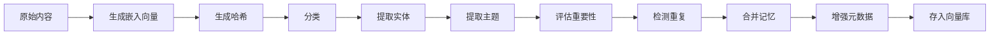

# 记忆管理域技术文档

## 概述

记忆管理域是cortex-mem系统的核心业务领域，负责AI智能体记忆数据的全生命周期管理。该模块作为系统的核心协调中心，实现了记忆的创建、存储、检索、更新、删除等基础操作，并通过与大语言模型（LLM）和向量数据库的深度集成，实现了智能化的元数据增强、重复检测与合并、重要性评估等高级功能。记忆管理域的设计遵循分层架构和依赖注入原则，采用Rust语言的trait和泛型实现高度抽象和可扩展性，确保了系统的高性能、高可靠性和良好的可维护性。

## 架构设计

记忆管理域采用清晰的分层与组合架构，其核心设计理念是**关注点分离**和**策略模式**。整个模块由一个核心控制器`MemoryManager`和多个独立的策略组件构成，各组件通过接口（trait）进行解耦，便于替换和扩展。

### 核心控制器：MemoryManager

`MemoryManager`是记忆管理域的中枢，它不直接实现具体的业务逻辑，而是通过依赖注入的方式组合多个策略组件，协调整个记忆处理流程。其核心职责包括：

1.  **流程编排**：接收来自接入层（CLI、HTTP、MCP）的请求，按顺序调用各个策略组件完成记忆的增强、存储和检索。
2.  **依赖管理**：通过构造函数接收`VectorStore`、`LLMClient`以及所有策略组件的实例，实现依赖注入，提高模块的可测试性和可替换性。
3.  **状态管理**：持有系统配置（`MemoryConfig`），为各个策略组件提供运行时参数（如相似度阈值、合并阈值等）。

`MemoryManager`的初始化过程体现了其设计哲学：
```rust
impl MemoryManager {
    pub fn new(
        vector_store: Box<dyn VectorStore>,
        llm_client: Box<dyn LLMClient>,
        config: MemoryConfig,
    ) -> Self {
        // 通过工厂函数创建各策略组件，传入共享的依赖
        let fact_extractor = create_fact_extractor(dyn_clone::clone_box(llm_client.as_ref()));
        let memory_updater = create_memory_updater(
            dyn_clone::clone_box(llm_client.as_ref()),
            dyn_clone::clone_box(vector_store.as_ref()),
            config.similarity_threshold,
            config.merge_threshold,
        );
        // ... 其他组件类似创建
        Self {
            vector_store,
            llm_client,
            config,
            fact_extractor,
            memory_updater,
            // ... 其他组件
        }
    }
}
```

这种设计使得`MemoryManager`本身保持轻量，业务逻辑的复杂性被分散到各个独立的策略组件中，符合单一职责原则。

### 核心策略组件

记忆管理域的智能处理能力由以下核心策略组件协同实现：

#### 1. 记忆存储管理 (Memory Storage Management)

该子模块负责与底层向量数据库的交互，是记忆持久化的基石。其核心是`VectorStore` trait和其具体实现`QdrantVectorStore`。

*   **`VectorStore` Trait**：定义了所有向量存储后端必须实现的通用接口，包括`insert`、`search`、`update`、`delete`、`list`和`health_check`等方法。这使得系统可以轻松地从Qdrant切换到Pinecone、Weaviate等其他向量数据库，只需实现该trait即可。
*   **`QdrantVectorStore` 实现**：这是`VectorStore` trait的具体实现，负责与Qdrant向量数据库进行通信。其关键功能包括：
    *   **自动集合创建**：在首次连接时，自动检测并创建指定的集合（collection），若集合不存在则根据配置的嵌入维度（`embedding_dim`）或通过LLM客户端自动探测的维度进行创建。
    *   **维度验证**：确保现有集合的嵌入维度与系统期望的维度一致，避免因模型变更导致的兼容性问题。
    *   **数据转换**：将`Memory`结构体转换为Qdrant的`PointStruct`，并将其元数据（`metadata`）序列化为JSON格式的payload，实现结构化存储。
    *   **复合查询**：支持基于向量相似度和元数据过滤条件（如`user_id`、`memory_type`、`importance_score`）的复杂查询，为语义搜索提供支持。

#### 2. 记忆搜索服务 (Memory Search Service)

该子模块由`MemoryManager`中的`search`方法实现，其核心是利用`VectorStore`的`search_with_threshold`方法进行语义检索。

*   **工作流程**：
    1.  用户发起搜索请求（如CLI的`search`命令）。
    2.  `MemoryManager`调用`LLMClient`对查询文本生成嵌入向量。
    3.  `MemoryManager`将此查询向量、用户指定的过滤条件（如`user_id`、`min_importance`）和搜索限制（`limit`）传递给`VectorStore`。
    4.  `QdrantVectorStore`在Qdrant数据库中执行向量相似度搜索，并应用元数据过滤。
    5.  返回一组`ScoredMemory`（包含记忆对象和相似度分数）。
    6.  `MemoryManager`对结果进行排序和格式化，返回给用户。

此流程实现了基于语义而非关键词的精准搜索，是系统“智能”特性的直接体现。

#### 3. 智能分析引擎 (Intelligent Analysis Engine)

该子模块是记忆管理域的“大脑”，负责将原始的、非结构化的文本内容转化为富含元数据的、高价值的记忆。它由多个独立的策略组件构成，均通过`LLMClient`与大语言模型交互。

*   **事实提取器 (FactExtractor)**：分析对话历史，从用户和助手的交互中提取出独立的、可重用的事实（如偏好、计划、知识）。它支持多种提取策略（如仅提取用户事实、仅提取助手事实），并能检测语言。
*   **记忆分类器 (MemoryClassifier)**：将记忆内容自动分类为`MemoryType`枚举中的六种类型之一（Conversational, Procedural, Factual, Semantic, Episodic, Personal）。它通过LLM生成的结构化响应进行分类，确保了分类的准确性。
*   **重要性评估器 (ImportanceEvaluator)**：为每条记忆计算一个0.0到1.0的重要性分数。评估依据包括内容长度、记忆类型、关键词（如“重要”、“永远”）等。该分数是记忆优化和检索排序的关键依据。
*   **重复检测器 (DuplicateDetector)**：检测新记忆是否与数据库中已存在的记忆高度相似。它结合了**语义相似度**（通过计算嵌入向量的余弦相似度）和**内容相似度**（通过Jaccard相似度计算词重叠）进行综合判断。当检测到重复时，它会调用`merge_memories`方法，利用LLM将多个相似记忆合并为一个更全面、更精炼的记忆。

这些组件在`MemoryManager::enhance_memory`方法中被串联起来，形成一个完整的“记忆增强流水线”：


## 核心数据模型

记忆管理域的数据模型设计精良，是其功能实现的基础。

### Memory (记忆实体)

```rust
struct Memory {
    id: String, // 唯一标识符，使用UUID生成
    content: String, // 记忆的原始文本内容
    embedding: Vec<f32>, // 由LLM生成的高维向量表示，用于语义搜索
    metadata: MemoryMetadata, // 丰富的元数据
    created_at: DateTime<Utc>, // 创建时间
    updated_at: DateTime<Utc>, // 更新时间
}
```

### MemoryMetadata (记忆元数据)

元数据是记忆的“灵魂”，它赋予了记忆结构和语义。

```rust
struct MemoryMetadata {
    user_id: Option<String>, // 关联的用户ID
    agent_id: Option<String>, // 关联的AI智能体ID
    run_id: Option<String>, // 执行会话ID
    actor_id: Option<String>, // 操作者ID
    role: Option<String>, // 角色（如user, assistant）
    memory_type: MemoryType, // 记忆类型（核心分类）
    hash: String, // 内容的SHA-256哈希，用于快速去重
    importance_score: f32, // 重要性评分 (0.0 - 1.0)
    entities: Vec<String>, // 提取的命名实体（人名、地点、组织等）
    topics: Vec<String>, // 提取的主题
    custom: HashMap<String, serde_json::Value>, // 自定义键值对，用于存储关键词、摘要等
}
```

### MemoryType (记忆类型)

这是一个枚举类型，定义了系统支持的六种记忆类别，为分类和过滤提供了明确的语义。

```rust
pub enum MemoryType {
    Conversational, // 对话型
    Procedural, // 程序型
    Factual, // 事实型
    Semantic, // 语义型
    Episodic, // 情景型
    Personal, // 个人型
}
```

### Filters (过滤器)

用于精确控制搜索和检索范围的结构体，支持多维度的复合查询。

```rust
pub struct Filters {
    pub user_id: Option<String>,
    pub agent_id: Option<String>,
    pub memory_type: Option<MemoryType>,
    pub min_importance: Option<f32>, // 最小重要性
    pub max_importance: Option<f32>, // 最大重要性
    pub created_after: Option<DateTime<Utc>>, // 创建时间范围
    pub entities: Option<Vec<String>>, // 包含的实体
    pub custom: HashMap<String, serde_json::Value>, // 自定义元数据过滤
}
```

## 核心交互模式

记忆管理域与系统其他部分的交互遵循清晰的契约。

### 1. 与外部系统的交互

*   **与LLM服务**：通过`Box<dyn LLMClient>`接口进行交互。`MemoryManager`和其策略组件（如`FactExtractor`、`MemoryClassifier`）发送提示词（prompt）并接收结构化的JSON响应，获取嵌入向量、分类结果、重要性评分等。这种抽象使得系统可以无缝切换不同的LLM提供商（如OpenAI, Anthropic）。
*   **与Qdrant向量数据库**：通过`Box<dyn VectorStore>`接口进行交互。`QdrantVectorStore`负责将`Memory`对象序列化为Qdrant的`PointStruct`，并处理所有底层的网络通信和数据格式转换。这种设计确保了向量存储后端的可插拔性。

### 2. 与内部模块的交互

*   **与记忆智能处理域**：记忆管理域是记忆智能处理域的**主要调用方**。`MemoryManager`在处理新记忆时，会主动调用`FactExtractor`、`MemoryClassifier`等组件，将非结构化文本转化为结构化数据。
*   **与记忆优化域**：记忆优化域是记忆管理域的**下游消费者**。`ExecutionEngine`在执行合并、删除等优化操作时，会直接调用`MemoryManager`提供的`delete`和`update` API，确保了操作的一致性和原子性。
*   **与系统配置与支撑域**：记忆管理域在初始化时，通过`MemoryConfig`获取其运行所需的全部配置参数（如相似度阈值、LLM模型名称、Qdrant连接地址等），并依赖`tracing`日志系统记录操作日志。

## 总结与价值

记忆管理域通过其精妙的架构设计，成功地将一个复杂的AI记忆管理问题分解为多个可独立开发、测试和优化的组件。它不仅实现了基础的CRUD操作，更通过与LLM的深度集成，实现了记忆的“智能化”和“自我优化”能力。

其核心价值在于：
1.  **提升AI智能体的上下文理解**：通过持久化和结构化记忆，使AI能够记住用户的偏好、历史对话和关键事实，提供个性化、连贯的服务。
2.  **降低信息遗忘成本**：自动化的去重和合并功能，有效避免了记忆库的冗余和膨胀，保持了信息的高密度和高价值。
3.  **保障系统长期健康**：重要性评估和优化流程确保了记忆库的“新陈代谢”，淘汰过时和低质量信息，维持系统的高效运行。

该模块是cortex-mem系统区别于普通知识库的核心竞争力所在，为构建真正具备长期记忆和学习能力的AI智能体提供了坚实的技术基础。