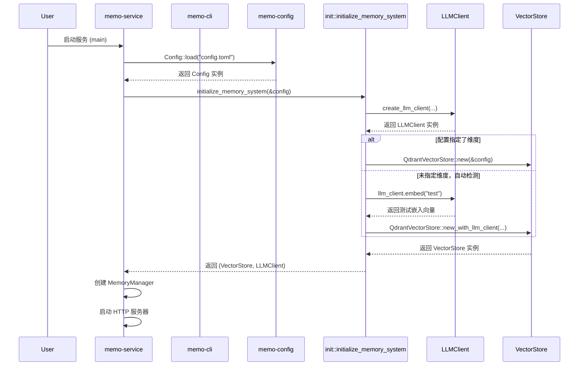

# 配置管理域技术实现文档

**生成时间**：2025-11-30 21:23:51  
**时间戳**：1764509031

## 1. 概述

配置管理域是 `memo` 项目中负责系统全局配置加载、解析与管理的核心基础设施模块。它为系统的可配置性、可维护性和环境适应性提供了基础支撑。该域通过强类型的结构化配置定义，实现了对 `LLM`、`向量存储`、`HTTP服务`、`记忆管理`等多个子系统的参数化控制，确保了系统行为的灵活性和一致性。

本技术文档将深入剖析配置管理域的实现细节，涵盖其架构设计、核心组件、工作流程以及与其他模块的交互关系，旨在为开发者提供一份完整、准确且实用的参考指南。

---

## 2. 架构设计与职责

配置管理域采用分层设计，主要由两个核心部分构成：

1.  **`memo-config` crate**：定义了所有配置的结构化数据模型（`struct`），并提供了从 `TOML` 文件加载配置的核心功能。它是配置数据的“定义者”和“解析者”。
2.  **`memo-core/src/init` 模块**：负责利用 `memo-config` 加载的配置，协调并初始化系统的核心组件（如 `LLMClient` 和 `VectorStore`）。它是配置数据的“使用者”和“执行者”。

这种分离设计遵循了“关注点分离”原则，使得配置的定义与初始化逻辑解耦，提高了代码的可读性和可维护性。

### 2.1 核心职责

-   **配置定义**：为系统所有可配置的参数提供强类型、可序列化的数据结构。
-   **配置加载**：从指定的 `TOML` 文件路径读取配置内容，并将其反序列化为 `Config` 结构体实例。
-   **默认值提供**：为部分配置项（如 `MemoryConfig` 和 `LoggingConfig`）提供合理的默认值，确保在配置文件缺失或不完整时系统仍能正常启动。
-   **系统初始化协调**：基于加载的配置，创建并初始化 `LLM` 客户端和向量存储实例，为 `MemoryManager` 的构建准备依赖项。

---

## 3. 核心组件与实现细节

### 3.1 配置定义 (`memo-config/src/lib.rs`)

`memo-config` crate 的核心是 `Config` 结构体，它是一个包含多个子配置模块的聚合体。所有配置均使用 `serde` 库进行序列化和反序列化，确保了与 `TOML` 文件格式的无缝对接。

#### 主要配置结构体

| 结构体 | 描述 | 关键字段示例 |
| :--- | :--- | :--- |
| `Config` | 主配置结构体，聚合所有子配置。 | `qdrant`, `llm`, `server`, `memory` |
| `QdrantConfig` | Qdrant 向量数据库的连接与行为配置。 | `url`, `collection_name`, `embedding_dim`, `timeout_secs` |
| `LLMConfig` | LLM 服务（如 OpenAI）的 API 配置。 | `api_base_url`, `api_key`, `model_efficient`, `temperature` |
| `ServerConfig` | HTTP 服务的网络配置。 | `host`, `port`, `cors_origins` |
| `EmbeddingConfig` | 嵌入向量生成服务的配置。 | `api_base_url`, `model_name`, `batch_size` |
| `MemoryConfig` | 记忆管理器的核心行为策略。 | `similarity_threshold`, `max_search_results`, `deduplicate`, `merge_threshold` |
| `LoggingConfig` | 系统日志的输出配置。 | `enabled`, `log_directory`, `level` |

#### 实现亮点

-   **强类型与序列化**：所有配置均通过 `#[derive(Serialize, Deserialize)]` 实现，保证了类型安全和配置文件的可读性。
-   **默认值实现**：通过为 `MemoryConfig` 和 `LoggingConfig` 实现 `Default` trait，为关键参数提供了合理的默认值。
    ```rust
    impl Default for MemoryConfig {
        fn default() -> Self {
            MemoryConfig {
                max_memories: 10000,
                similarity_threshold: 0.65,
                max_search_results: 50,
                deduplicate: true,
                merge_threshold: 0.75,
                // ... 其他默认值
            }
        }
    }
    ```
-   **配置加载方法**：`Config` 结构体提供了 `load` 方法，封装了文件读取和反序列化的逻辑。
    ```rust
    impl Config {
        pub fn load<P: AsRef<Path>>(path: P) -> Result<Self> {
            let content = std::fs::read_to_string(path)?;
            let config: Config = toml::from_str(&content)?;
            Ok(config)
        }
    }
    ```

### 3.2 系统初始化 (`memo-core/src/init/mod.rs`)

`init` 模块是配置管理域与核心业务逻辑之间的桥梁。它利用 `memo-config` 提供的 `Config` 实例，完成系统运行环境的构建。

#### 核心函数 `initialize_memory_system`

该函数是系统初始化流程的入口，其主要职责是创建 `VectorStore` 和 `LLMClient` 的实例。

```rust
pub async fn initialize_memory_system(
    config: &Config
) -> Result<(Box<dyn VectorStore>, Box<dyn LLMClient>)> {
    // 1. 首先创建 LLM 客户端
    let llm_client = crate::llm::create_llm_client(&config.llm, &config.embedding)?;

    // 2. 创建向量存储，支持自动维度检测
    let vector_store: Box<dyn VectorStore> = if config.qdrant.embedding_dim.is_some() {
        // 使用配置中指定的维度
        Box::new(QdrantVectorStore::new(&config.qdrant).await?)
    } else {
        // 自动检测嵌入向量的维度
        Box::new(QdrantVectorStore::new_with_llm_client(&config.qdrant, llm_client.as_ref()).await?)
    };

    Ok((vector_store, llm_client))
}
```

#### 关键特性

-   **自动维度检测**：这是 `memo` 项目的一大亮点。当 `config.qdrant.embedding_dim` 为 `None` 时，系统会自动调用 `LLMClient` 生成一个测试文本的嵌入向量，并根据其长度来确定向量数据库的维度。这极大地简化了部署配置，避免了因模型变更导致的维度不匹配问题。
-   **依赖注入**：该函数返回一个包含 `VectorStore` 和 `LLMClient` 的元组，这些实例随后会被注入到 `MemoryManager` 中，实现了依赖的显式传递和管理。

---

## 4. 工作流程

配置管理域的完整工作流程贯穿于系统的启动阶段，其时序如下：



1.  **启动入口**：无论是 `memo-service` (HTTP API) 还是 `memo-cli` (命令行工具)，其 `main` 函数都是流程的起点。
2.  **加载配置**：入口函数调用 `Config::load()` 方法，从 `config.toml` 文件中读取并解析配置。
3.  **初始化核心组件**：调用 `initialize_memory_system()` 函数，传入上一步得到的 `Config` 实例。
4.  **创建 LLM 客户端**：`init` 模块根据 `config.llm` 和 `config.embedding` 的信息，创建 `LLMClient`。
5.  **创建向量存储**：根据 `config.qdrant` 的信息创建 `QdrantVectorStore`。如果未指定 `embedding_dim`，则利用 `LLMClient` 进行自动检测。
6.  **构建应用上下文**：将初始化好的 `VectorStore` 和 `LLMClient` 传递给 `MemoryManager` 的构造函数，完成整个应用上下文的构建。

---

## 5. 与其他模块的交互

配置管理域作为基础设施，与系统中的多个模块存在紧密的依赖关系。

| 交互模块 | 交互方式 | 说明 |
| :--- | :--- | :--- |
| **服务接口域** (`memo-service`, `memo-cli`) | **配置依赖** | `memo-service` 和 `memo-cli` 在启动时直接依赖 `memo-config` 来加载配置文件。它们是配置的直接使用者。 |
| **记忆管理域** (`memo-core/memory`) | **间接依赖** | `MemoryManager` 本身不直接持有 `Config`，但它依赖的 `LLMClient` 和 `VectorStore` 是由 `Config` 初始化的。`MemoryConfig` 中的参数（如 `similarity_threshold`）直接影响 `MemoryManager` 的行为策略。 |
| **LLM交互域** (`memo-core/llm`) | **配置依赖** | `LLMClient` 的创建完全依赖于 `config.llm` 和 `config.embedding` 中的参数，如 API 密钥、模型名称和批处理大小。 |
| **向量存储域** (`memo-core/vector_store`) | **配置依赖** | `QdrantVectorStore` 的连接信息（URL、集合名）和行为（超时、维度）均由 `config.qdrant` 提供。 |
| **RIG集成域** (`memo-rig`) | **配置依赖** | `MemoryTool` 在初始化时也需要加载全局 `Config`，以获取默认的 `user_id`、`agent_id` 等信息。 |

---

## 6. 总结

配置管理域是 `memo` 项目稳定运行的基石。它通过清晰的模块划分和优雅的实现，解决了系统配置的复杂性问题。

-   **`memo-config`** 提供了**声明式**的配置定义，保证了配置的类型安全和可维护性。
-   **`init` 模块** 实现了**命令式**的初始化逻辑，特别是**自动维度检测**功能，极大地提升了系统的易用性和健壮性。

该域的设计充分体现了 Rust 语言在类型安全、模块化和错误处理方面的优势，为整个 `memo` 系统的可扩展性和可配置性奠定了坚实的基础。开发者在进行环境部署或行为调优时，只需修改 `config.toml` 文件中的相应参数，即可实现对系统行为的全局控制。