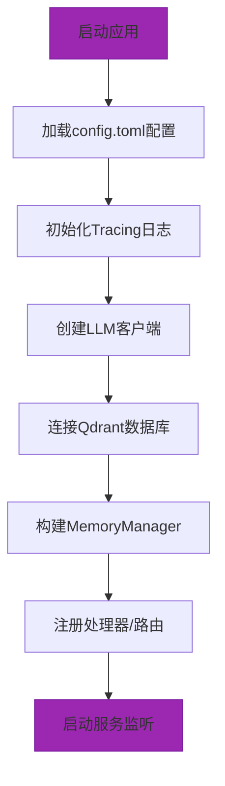

# 配置管理域技术实现文档

## 1. 概述

配置管理域是 `memo` 系统的基础支撑模块，负责集中管理系统的运行时配置。该模块通过强类型的 Rust 结构体定义、TOML 文件格式和 Serde 序列化框架，为系统各组件提供统一、安全、可维护的配置访问机制。作为基础设施域的核心组成部分，配置管理域支撑着 LLM 集成、向量存储、HTTP 服务等关键功能的初始化与运行。

**生成时间**：2025-12-03 14:34:49  
**时间戳**：1764743689

---

## 2. 模块职责与定位

### 2.1 核心职责

配置管理域承担以下关键职责：

1.  **配置定义**：使用 Rust 的 `struct` 和 `derive` 宏定义系统所有可配置项的强类型结构。
2.  **配置加载**：从指定路径的 TOML 文件中读取配置内容，并反序列化为内存中的结构体实例。
3.  **默认值提供**：为部分配置项（如 `MemoryConfig` 和 `LoggingConfig`）提供合理的默认值，确保系统在配置缺失时仍能正常启动。
4.  **统一访问**：通过 `memo-core` 模块的重新导出，为系统所有组件提供一致的配置访问入口。

### 2.2 在系统架构中的定位

根据领域模块调研报告，配置管理域属于**基础设施域**，其重要性评分为 8.0。它与系统中的多个核心域存在强依赖关系：

-   **配置依赖**：`LLM集成域`、`向量存储域`、`接口访问域`均依赖配置管理域获取各自的连接参数和运行时选项。
-   **服务调用**：`记忆管理域`根据配置决定是否启用自动摘要、记忆去重等智能功能。

这种中心化的配置管理设计，实现了关注点分离，降低了各业务模块的耦合度，提升了系统的可配置性和可维护性。

---

## 3. 核心实现细节

### 3.1 模块结构与文件布局

配置管理域由两个主要部分构成：

1.  **`memo-config` crate** (`memo-config/src/lib.rs`)：这是配置管理的核心实现。它定义了所有配置结构体，并实现了 `load` 方法。
2.  **`memo-core` 重导出** (`memo-core/src/config.rs`)：该文件仅包含一行代码 `pub use memo_config::*;`，其作用是将 `memo-config` 中定义的所有公共项重新导出，使得 `memo-core` 的使用者可以直接通过 `use memo_core::config::*;` 访问配置，无需直接依赖 `memo-config`。

这种设计模式遵循了 Rust 的模块化最佳实践，`memo-core` 作为核心业务聚合点，统一了对外的 API。

### 3.2 配置结构体定义

配置管理域采用分层的结构体设计，主配置 `Config` 组合了多个子配置模块，每个模块负责特定功能的配置。

```rust
/// Main configuration structure
#[derive(Debug, Clone, Serialize, Deserialize)]
pub struct Config {
    pub qdrant: QdrantConfig,
    pub llm: LLMConfig,
    pub server: ServerConfig,
    pub embedding: EmbeddingConfig,
    pub memory: MemoryConfig,
    pub logging: LoggingConfig,
}
```

各子模块结构体均派生了 `Debug`, `Clone`, `Serialize`, `Deserialize` 等 trait，确保了配置的可调试性、可复制性和序列化能力。

#### 主要配置项说明

| 配置模块 | 关键字段 | 说明 |
| :--- | :--- | :--- |
| `QdrantConfig` | `url`, `collection_name`, `timeout_secs` | 定义 Qdrant 向量数据库的连接地址、集合名称和超时时间。`embedding_dim` 为可选字段，系统可自动探测。 |
| `LLMConfig` | `api_base_url`, `api_key`, `model_efficient`, `temperature` | 配置大语言模型服务的 API 地址、密钥、模型名称和生成参数（如温度）。 |
| `ServerConfig` | `host`, `port`, `cors_origins` | 配置 HTTP 服务的监听地址、端口和跨域资源共享（CORS）策略。 |
| `EmbeddingConfig` | `api_base_url`, `model_name`, `batch_size` | 配置嵌入向量生成服务的参数，支持批量处理。 |
| `MemoryConfig` | `similarity_threshold`, `merge_threshold`, `auto_enhance`, `deduplicate` | 定义记忆管理的核心策略，如去重和合并的相似度阈值、是否启用自动增强等。 |
| `LoggingConfig` | `enabled`, `log_directory`, `level` | 控制日志系统的开关、日志文件存储目录和日志级别。 |

### 3.3 配置加载流程

配置加载通过 `Config::load<P: AsRef<Path>>(path)` 方法实现，其内部流程如下：

1.  **文件读取**：使用 `std::fs::read_to_string(path)?` 读取指定路径的 TOML 文件内容。
2.  **反序列化**：调用 `toml::from_str(&content)?` 将 TOML 字符串解析为 `Config` 结构体实例。
3.  **错误处理**：整个过程使用 `anyhow::Result` 进行错误传播，任何读取或解析错误都会返回一个 `Result::Err`。

该流程简洁高效，利用了 Rust 强大的类型系统和错误处理机制。

### 3.4 默认值实现

为了提升用户体验和系统健壮性，配置管理域为 `MemoryConfig` 和 `LoggingConfig` 实现了 `Default` trait。

```rust
impl Default for MemoryConfig {
    fn default() -> Self {
        MemoryConfig {
            max_memories: 10000,
            similarity_threshold: 0.65,
            max_search_results: 50,
            memory_ttl_hours: None,
            auto_summary_threshold: 32768,
            auto_enhance: true,
            deduplicate: true,
            merge_threshold: 0.75,
            search_similarity_threshold: Some(0.70),
        }
    }
}
```

这意味着，如果 `config.toml` 文件中未定义 `memory` 部分，系统将自动使用这些默认值，避免了因配置缺失而导致的启动失败。

---

## 4. 配置文件示例

系统使用 `config.toml` 作为默认的配置文件。以下是一个典型的配置示例：

```toml
# config.toml

[qdrant]
url = "http://localhost:6334"
collection_name = "memo-rs"
timeout_secs = 30

[llm]
api_base_url = "https://api.openai.com/v1"
api_key = "your-openai-api-key"
model_efficient = "gpt-4o"
temperature = 0.1
max_tokens = 4096

[server]
host = "0.0.0.0"
port = 3000
cors_origins = ["*"]

[memory]
max_memories = 10000
similarity_threshold = 0.65
deduplicate = true
auto_enhance = false

[logging]
enabled = true
log_directory = "logs"
level = "info"
```

此文件清晰地组织了不同服务的配置，易于阅读和修改。注释（`#`）可用于说明配置项的用途或提供备选方案。

---

## 5. 交互与集成

### 5.1 与其他模块的交互

配置管理域通过以下方式与其他模块交互：

-   **初始化时注入**：在系统启动流程中，`main` 函数首先调用 `Config::load()` 加载配置，然后将配置实例传递给 `LLMClient`、`QdrantVectorStore` 和 `MemoryManager` 等组件的构造函数。
-   **运行时查询**：在业务逻辑中，组件可以通过持有的配置实例查询特定的配置项，例如 `config.memory.auto_enhance` 来判断是否执行自动增强操作。

### 5.2 系统初始化流程中的角色

在“系统初始化流程”中，配置管理域扮演着至关重要的第一步：



所有后续的初始化步骤都依赖于成功加载的配置。

---

## 6. 总结

配置管理域通过其简洁、类型安全的设计，为 `memo` 系统提供了坚实的基础。其核心优势在于：

-   **类型安全**：利用 Rust 的编译时检查，避免了运行时因配置项拼写错误或类型不匹配导致的问题。
-   **易用性**：TOML 格式直观易读，`Default` trait 提供了合理的默认值。
-   **可维护性**：模块化的设计使得添加新的配置项或修改现有结构变得简单且不易出错。
-   **一致性**：通过 `memo-core` 的统一导出，保证了整个系统使用同一套配置接口。

该模块是 `memo` 系统实现高内聚、低耦合架构的关键一环，为系统的稳定运行和未来扩展提供了有力保障。