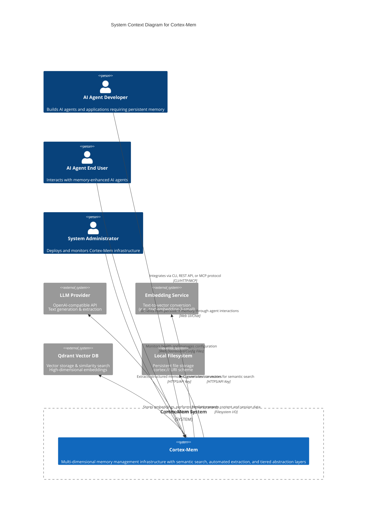

# Cortex-Mem System Context Overview

**Document Version:** 1.0  
**Generation Date:** 2026-02-17 16:29:26 (UTC)  
**Status:** Architecture Baseline  

---

## 1. Executive Summary

### 1.1 Project Introduction

**Cortex-Mem** is a comprehensive, full-stack memory management infrastructure designed specifically for AI agents and Large Language Model (LLM) applications. The system addresses the fundamental limitation of fixed-size context windows in modern LLMs by providing persistent, semantic, long-term memory storage and retrieval capabilities.

As a multi-interface memory substrate, Cortex-Mem enables AI agents to maintain continuity across conversations, recall user preferences, retrieve relevant historical context, and build knowledge progressively over time. The architecture implements a sophisticated multi-dimensional memory model organizing data across User, Agent, and Session scopes, with tiered abstraction layers (L0-L2) enabling progressive context loading based on relevance and computational constraints.

### 1.2 Core Business Value

The system delivers six primary value propositions:

1. **Context Window Augmentation**: Overcomes LLM token limitations through persistent external memory, enabling theoretically infinite conversation history retention
2. **Semantic Retrieval**: Vector-based similarity search allows agents to recall information based on conceptual relevance rather than exact keyword matching
3. **Automated Knowledge Extraction**: LLM-powered analysis automatically identifies and structures facts, preferences, and entities from raw conversation data
4. **Multi-Modal Access**: Supports diverse integration patterns through CLI tooling, REST APIs, Model Context Protocol (MCP), and web-based management interfaces
5. **Developer Experience**: File-system based persistence with URI addressing (`cortex://`) enables version control, portability, and straightforward debugging
6. **Multi-Tenancy**: Isolated memory spaces support secure multi-user and multi-agent deployments

### 1.3 Technical Characteristics

- **Architecture Pattern**: Command Query Responsibility Segregation (CQRS) with event-driven automation
- **Core Technology Stack**: Rust (high-performance backend services), TypeScript/SvelteKit (web insights dashboard)
- **Storage Model**: Virtual filesystem abstraction (`cortex://` URI scheme) backed by physical file storage
- **Search Capability**: Vector similarity search using high-dimensional embeddings (default 1536 dimensions)
- **Integration Protocols**: HTTP/REST, Model Context Protocol (MCP), Command-Line Interface (CLI)

---

## 2. Target Users and Stakeholders

Cortex-Mem serves three distinct user personas, each with specific interaction patterns and technical requirements.

### 2.1 AI Agent Developers

**Role Definition**: Software engineers and architects building AI agent applications requiring persistent memory capabilities.

**Usage Scenarios**:
- Integrating memory capabilities into Rust-based agent frameworks
- Building HTTP client integrations for Python, Node.js, or other language ecosystems
- Developing MCP-compatible AI assistants with tool-based memory access
- Scripting memory maintenance and data migration workflows

**Key Requirements**:
- Rust library integration (`cortex-mem-core`)
- HTTP REST API access for cross-platform integration
- Model Context Protocol (MCP) support for AI assistant tooling
- Vector search capabilities with filtering and scoring APIs
- Multi-tenancy isolation for SaaS deployments
- Tiered memory loading (L0/L1/L2) for optimized context window management

### 2.2 AI Agent End Users

**Role Definition**: Non-technical users interacting with AI agents enhanced by Cortex-Mem memory capabilities through chat interfaces or web applications.

**Usage Scenarios**:
- Engaging in long-running conversations with personal AI assistants that remember past interactions
- Querying memory insights through web dashboards to understand what the agent knows
- Benefiting from personalized responses based on recalled preferences and history
- Reviewing session continuity across multiple chat instances

**Key Requirements**:
- Persistent conversation history without manual save/load operations
- Semantic search across past interactions through natural language queries
- User profile and preference recall across sessions
- Web-based memory insights and analytics for transparency
- Privacy controls over stored memory content

### 2.3 System Administrators

**Role Definition**: DevOps engineers and infrastructure teams responsible for deploying, monitoring, and maintaining Cortex-Mem production instances.

**Usage Scenarios**:
- Deploying multi-service architectures (Core + Insights + Vector DB)
- Monitoring Qdrant vector database connectivity and LLM API availability
- Managing configuration across CLI, service, and MCP server components
- Performing memory optimization and maintenance tasks
- Analyzing system performance metrics and storage utilization

**Key Requirements**:
- Health monitoring dashboards (via Insights Web UI)
- Configuration management through TOML files and environment variables
- Service status monitoring for REST API and MCP endpoints
- Performance metrics and logging aggregation
- Multi-service orchestration capabilities

---

## 3. System Boundaries and Scope

### 3.1 System Scope Definition

Cortex-Mem encompasses the complete memory management infrastructure from user interfaces through core processing libraries. The system boundary includes all software components that implement memory semantics, storage abstractions, and interface protocols.

### 3.2 Included Components

The following components constitute the Cortex-Mem system:

**Core Processing Layer**:
- `cortex-mem-core`: Rust library providing memory operations, vector search coordination, LLM/embedding clients, and extraction pipelines
- `cortex-mem-tools`: Rust crate containing tool definitions for LLM agent integration
- `cortex-mem-config`: Rust configuration management library with TOML parsing

**Interface Adapters**:
- `cortex-mem-cli`: Rust CLI application for interactive and scripted memory operations
- `cortex-mem-service`: Rust HTTP REST API server providing JSON endpoints
- `cortex-mem-mcp`: Rust Model Context Protocol server for AI assistant integration
- `cortex-mem-insights`: TypeScript/SvelteKit web UI with Elysia-based API server for monitoring and analytics

**Integration Components**:
- `cortex-mem-rig`: Rust Rig framework integration for agent tooling
- Configuration files (`config.toml`) and environment variable schemas
- Session data, memory storage, and generated layer files (local filesystem)
- In-memory state management within services

### 3.3 Excluded Components

The following remain outside the system boundary and are treated as external dependencies:

**External AI Services**:
- LLM service providers (OpenAI, Azure OpenAI, local inference servers like Ollama)
- Third-party embedding API services (OpenAI text-embedding-3-small or compatible)

**Infrastructure Dependencies**:
- Qdrant vector database instances (external service, though tightly integrated)
- Operating system filesystem drivers and kernel-level storage mechanisms
- Network infrastructure, load balancers, and TLS termination proxies
- Container orchestration platforms (Kubernetes, Docker Swarm) when used for deployment

---

## 4. External System Interactions

Cortex-Mem maintains critical dependencies on four external systems for full functionality:

### 4.1 LLM Provider (OpenAI-Compatible)

**Interaction Type**: Generative AI Service Integration  
**Protocol**: HTTPS/REST with API Key authentication  
**Functionality**:
- Generates text completions for memory summarization and abstraction layer creation (L0-L1)
- Powers automated memory extraction pipelines analyzing conversation content
- Performs content classification and importance scoring
- Supports multiple providers: OpenAI, Azure OpenAI, and local OpenAI-compatible endpoints

**Data Flow**: Bi-directional; Cortex-Mem sends conversation text and receives structured JSON extractions or summarized content.

### 4.2 Embedding Service API

**Interaction Type**: Vector Generation Service  
**Protocol**: HTTPS/REST with API Key authentication  
**Functionality**:
- Converts text content (memories, queries, session messages) into high-dimensional vector embeddings (default 1536 dimensions)
- Enables semantic similarity search by providing consistent vector representations of concepts
- Supports batch processing for efficient indexing of large memory corpora

**Data Flow**: Unidirectional outbound; Cortex-Mem submits text and receives embedding vectors.

### 4.3 Qdrant Vector Database

**Interaction Type**: Vector Storage and Search Engine  
**Protocol**: HTTP/gRPC with API Key authentication  
**Functionality**:
- Persistent storage of high-dimensional embedding vectors with associated metadata
- Approximate Nearest Neighbor (ANN) search for semantic similarity queries
- Metadata filtering supporting multi-dimensional scoping (User/Agent/Session IDs)
- Collection management for memory isolation and multi-tenancy

**Data Flow**: Bi-directional; Cortex-Mem writes embeddings during storage operations and queries vectors during retrieval.

### 4.4 Filesystem Storage

**Interaction Type**: Local Persistence Layer  
**Protocol**: OS Filesystem APIs  
**Functionality**:
- Stores memory content as markdown files with metadata headers
- Persists session timelines and conversation histories
- Caches generated abstraction layers (L0 abstracts, L1 overviews)
- Maintains configuration files and system logs

**Data Flow**: Bi-directional; Cortex-Mem implements a virtual URI scheme (`cortex://`) mapped to directory structures for portable, version-control-friendly storage.

---

## 5. System Context Architecture

### 5.1 C4 System Context Diagram

The following diagram illustrates Cortex-Mem's position within its ecosystem, depicting user interactions and external system dependencies:

### 5.2 Key Interaction Flows

**Memory Storage Flow**:  
Developers submit memories via CLI (`cortex-mem add`) or API (POST `/memories`). The system generates embeddings via the Embedding Service, stores vectors in Qdrant, persists content to the Filesystem using the `cortex://` URI scheme, and returns a unique memory identifier.

**Semantic Retrieval Flow**:  
End users or agents submit natural language queries. Cortex-Mem converts queries to embedding vectors, executes similarity search against Qdrant with metadata filtering (User/Agent/Session scoping), retrieves full content from Filesystem, and returns ranked results with relevance scores.

**Automated Extraction Flow**:  
During session processing, the system monitors conversation timelines, sends content to the LLM Provider for analysis using specialized extraction prompts, classifies identified memories (Preferences, Entities, Events), generates embeddings, and stores structured results for future retrieval.

**Tiered Context Loading**:  
When agents request context, the system first returns L0 (Abstract) layers for quick relevance scanning. If deeper context is required, it progressively loads L1 (Overview) and L2 (Detail) layers, generating intermediate layers on-demand via LLM summarization when cached versions don't exist.

### 5.3 Architecture Decisions

**File-System as Source of Truth**:  
Unlike traditional database-centric architectures, Cortex-Mem treats the local filesystem as the primary persistence layer, with Qdrant serving as a searchable index. This decision prioritizes data portability, version control compatibility, and operational simplicity.

**Multi-Interface Strategy**:  
The system exposes functionality through four distinct interfaces (CLI, REST, MCP, Web) to accommodate different integration patterns: shell scripting, service-oriented architectures, AI assistant tool calling, and human administrative oversight.

**External AI Service Dependency**:  
Core functionality (embedding generation, memory extraction, summarization) depends on external AI services rather than embedded models. This decouples computational requirements from the core system while allowing flexibility in model selection.

**CQRS with Event-Driven Automation**:  
The architecture separates read and write operations, with automation components (file watchers, auto-indexers) handling background synchronization between filesystem storage and vector indexes.

---

## 6. Business Process Context

At the System Context level, Cortex-Mem enables six primary business process flows that deliver value to stakeholders:

### 6.1 Memory Semantic Storage and Retrieval
Enables persistent storage of structured and unstructured memory entries with semantic vector indexing. Supports multi-dimensional organization (User/Agent/Session scopes) and importance scoring.

### 6.2 Automated Memory Extraction
Implements intelligent content analysis using LLM capabilities to automatically identify and structure facts, preferences, decisions, and entities from conversation sessions, reducing manual data entry.

### 6.3 Tiered Memory Layer Generation
Provides progressive context loading through three abstraction levels (L0 Abstract, L1 Overview, L2 Detail), optimizing token usage in LLM context windows by loading only necessary detail levels.

### 6.4 Semantic Vector Search
Delivers natural language querying capabilities across memory corpora using vector similarity algorithms, enabling conceptual retrieval rather than exact keyword matching.

### 6.5 Session Lifecycle Management
Manages conversation session creation, message accumulation, timeline persistence, and automatic indexing to maintain conversational continuity across interactions.

### 6.6 Memory Optimization and Maintenance
Performs background maintenance including duplicate detection, quality scoring, content reorganization, and storage optimization to ensure memory usefulness and system performance.

---

## 7. Technical Constraints and Considerations

**Latency Sensitivity**:  
Semantic search and memory extraction require network calls to external LLM and embedding services, introducing latency dependencies on third-party API performance.

**Data Privacy**:  
Memory content may include sensitive user information. The system supports local LLM deployments to keep data within organizational boundaries, though this requires additional infrastructure.

**Storage Scalability**:  
While file-system storage provides portability, very large memory corpora may require careful directory structure management and potentially distributed storage solutions for the vector database component.

**Consistency Model**:  
The system operates with eventual consistency between filesystem storage and vector database indexes, managed through automated synchronization processes.

---

*This document establishes the architectural baseline for Cortex-Mem at the System Context level, defining the system's scope, stakeholders, and external dependencies as input for subsequent Container and Component level design activities.*