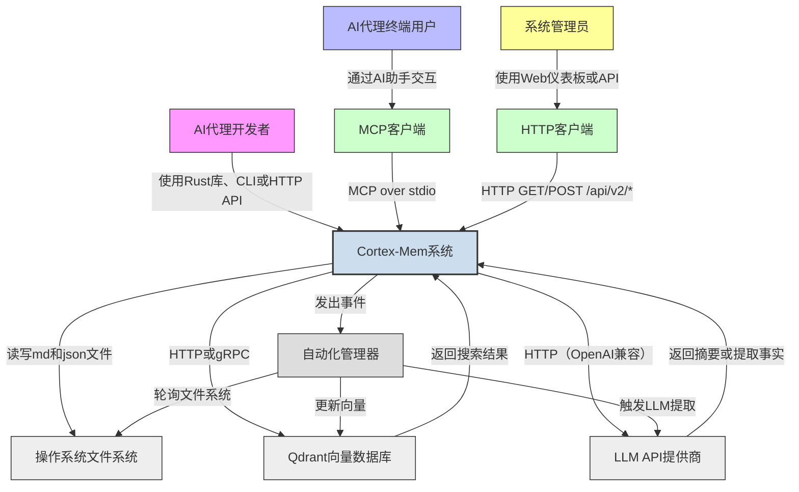

# System Context Overview

## 1. Project Introduction

**Project Name**: Cortex Memory (cortex-mem)  
**Project Type**: Full-Stack AI Memory System  
**Generation Time**: 2026-02-19 03:57:58 (UTC)  
**Timestamp**: 1771473478

Cortex-Mem is a high-performance, domain-driven memory management system designed specifically for AI agents to retain and leverage contextual knowledge across conversational sessions. Built in Rust, it solves the fundamental challenge of statelessness in AI interactions by implementing a persistent, multi-dimensional memory architecture that automatically captures, structures, and retrieves human-agent dialogue history.

At its core, Cortex-Mem introduces a hierarchical memory model composed of three semantic layers:
- **L0 (Abstract)**: Concise, high-level summaries of conversation intent.
- **L1 (Overview)**: Structured markdown summaries capturing key decisions, entities, and outcomes.
- **L2 (Detail)**: Raw, unprocessed conversation transcripts stored as markdown files.

These layers are indexed using vector embeddings generated by external LLM providers and stored in a Qdrant vector database, enabling fast, context-aware semantic search. The system automatically detects changes in conversation files via filesystem monitoring, triggers LLM-based summarization and extraction, and synchronizes content between persistent filesystem storage and the vector store — ensuring consistency without manual intervention.

Cortex-Mem is not a monolithic application but a modular, composable infrastructure. It exposes its capabilities through four distinct interfaces:
- A **CLI tool** for direct developer interaction and scripting.
- A **RESTful HTTP API** for integration with web and mobile clients.
- A **Model Context Protocol (MCP) server** for seamless embedding into AI assistants and IDEs.
- A **Svelte-based web dashboard (Insights)** for visualizing memory usage, tenant analytics, and system health.

The system is architected for multi-tenancy, enabling SaaS deployments where isolated memory spaces exist for different users, organizations, or agents — all sharing the same underlying service instance. This design enables enterprise-grade privacy, compliance, and scalability.

**Core Business Value**:
- **Eliminates context loss** between AI sessions, enabling truly persistent conversations.
- **Enables personalized agent behavior** through automated extraction of user preferences, goals, and relationships.
- **Supports cumulative learning** for AI agents, allowing them to improve over time without retraining.
- **Provides SaaS-ready multi-tenancy** with strict data isolation.
- **Integrates natively** with existing LLM ecosystems via standard protocols (MCP, HTTP, Rust libraries).

Cortex-Mem is not an LLM provider or a chat interface — it is the *memory layer* that makes AI agents remember. It is the foundational infrastructure that transforms reactive AI into proactive, context-aware agents.

---

## 2. Target Users

Cortex-Mem serves three distinct user personas, each interacting with the system through different interfaces and with unique operational needs.

### 2.1 AI Agent Developers

**Description**: Software engineers and AI system architects building intelligent agents using frameworks like TARS, Rig, or custom Rust/Python backends. They integrate Cortex-Mem programmatically to add persistent memory to their applications.

**Usage Scenarios**:
- Embedding `cortex-mem-core` as a Rust library to enable memory operations within a custom agent runtime.
- Using the HTTP API to persist conversation history from a web chat frontend.
- Configuring MCP tools (`query_memory`, `store_memory`) to allow AI assistants (e.g., Cursor, GitHub Copilot) to recall past user interactions.
- Writing automation scripts via CLI to bulk-import or audit memory data.

**Key Requirements**:
- Type-safe, async Rust APIs for memory CRUD operations.
- Support for multi-tenant isolation via `tenant_id` context.
- Reliable LLM integration with fallback parsing for structured extraction.
- Transparent filesystem abstraction using `cortex://` URIs.
- Comprehensive error handling and logging for debugging.
- Compatibility with OpenAI-compatible LLM endpoints and Qdrant clusters.

### 2.2 AI Agent End Users

**Description**: End users of AI-powered applications (e.g., customer support bots, personal assistants, coaching agents) that rely on Cortex-Mem for memory persistence. These users interact indirectly with the system through the agent interface.

**Usage Scenarios**:
- Having a natural, multi-session conversation with an AI assistant that remembers their preferences, past requests, and personal details.
- Receiving personalized recommendations based on historical behavior (e.g., “You mentioned last week you prefer vegan options — would you like me to suggest a new restaurant?”).
- Trusting that sensitive information shared in one session is not leaked to other users or agents.

**Key Requirements**:
- Seamless, invisible memory retention across sessions.
- No manual memory management required.
- Privacy assurance through tenant isolation.
- Consistent, accurate recall of facts and decisions.
- No performance degradation due to memory load.

### 2.3 System Administrators

**Description**: DevOps engineers, platform operators, and cloud infrastructure teams responsible for deploying, monitoring, and scaling Cortex-Mem in production environments — particularly in multi-tenant SaaS deployments.

**Usage Scenarios**:
- Configuring the system via TOML files and environment variables to point to remote Qdrant and LLM endpoints.
- Monitoring memory usage and storage growth across tenants via the Insights dashboard.
- Triggering manual synchronization (`sync_all`) after system outages or data corruption.
- Scaling Qdrant clusters independently while maintaining tenant-aware routing.
- Auditing access logs and resource consumption for compliance.

**Key Requirements**:
- Centralized configuration management with environment fallbacks.
- REST API endpoints for health checks (`/health`), stats (`/api/v2/tenants/stats`), and management.
- Web dashboard for visualizing storage metrics, tenant counts, and vector store health.
- Clear separation of concerns between system components for troubleshooting.
- Support for containerized deployment (Docker/Kubernetes) and observability (metrics, logs).
- No dependency on external identity providers — tenant isolation is handled internally via namespace scoping.

---

## 3. System Boundaries

Cortex-Mem defines a clear architectural boundary between what it owns and what it depends upon. This boundary ensures maintainability, scalability, and clarity in responsibility.

### 3.1 Included Components

The following components are **within the system boundary** and are developed, maintained, and deployed as part of the Cortex-Mem codebase:

| Component | Description |
|---------|-------------|
| **cortex-mem-core** | The central library containing all core business logic: filesystem abstraction (`cortex://`), LLM client wrappers, embedding generation, Qdrant integration, session management, layer generation, extraction engine, search engine, and automation orchestrator. |
| **cortex-mem-cli** | Command-line interface for developers to interact with memory (search, list, get, delete, session, stats). |
| **cortex-mem-service** | HTTP REST API server (Axum-based) exposing `/api/v2` endpoints for memory operations and tenant analytics. |
| **cortex-mem-mcp** | Model Context Protocol server that exposes memory tools (`query_memory`, `store_memory`, etc.) via stdio for AI assistants. |
| **cortex-mem-insights** | Svelte-based web dashboard for visualizing memory usage, tenant statistics, and search results. |
| **cortex-mem-config** | Configuration management module handling TOML loading, environment variable resolution, and tenant-specific overrides. |
| **cortex-mem-tools** | MCP tool schemas and operation wrappers for agent integration. |
| **cortex-mem-rig** | Integration layer with the rig-core agent framework for tool registration. |
| **Automation Components** | Filesystem watcher, auto-indexer, auto-extractor, sync manager, and automation manager — all internal event-driven orchestrators. |
| **Session Management** | Message, timeline, and session lifecycle tracking with event emission (`SessionEvent::Closed`). |
| **Vector Storage Client** | Qdrant client implementation with tenant-aware collection naming (`cortex-mem-{tenant_id}`). |
| **Embedding Client** | Wrapper for OpenAI-compatible embedding APIs (e.g., text-embedding-3-small). |
| **Layer Management** | L0/L1/L2 summary generation and lazy-loading logic. |
| **Extraction Engine** | Structured memory extraction from conversation text (facts, decisions, entities). |
| **Search Engine** | Multi-layered semantic search with weighted scoring (0.2×L0 + 0.3×L1 + 0.5×L2). |

All components are written in Rust (except Insights, which is TypeScript/Svelte) and share a common codebase under a single Cargo workspace.

### 3.2 Excluded External Dependencies

The following components are **explicitly outside the system boundary** and are treated as external services:

| Component | Reason for Exclusion |
|---------|----------------------|
| **Third-party LLM Providers** (OpenAI, Anthropic, Mistral, etc.) | Cortex-Mem interacts with them via HTTP APIs but does not host or manage them. |
| **External Qdrant Cluster** | Cortex-Mem connects to Qdrant as a client; the database cluster’s deployment, scaling, and maintenance are the responsibility of the operator. |
| **Operating System File System APIs** | While Cortex-Mem uses the OS filesystem for persistence, it abstracts all direct access via `cortex://` URIs and async filesystem traits. OS-level details (e.g., inode handling, NTFS vs. ext4) are irrelevant. |
| **Client Applications** (e.g., TARS chat UI, Copilot, custom web apps) | These consume Cortex-Mem’s APIs but are developed and maintained independently. |
| **Rust Compiler and Toolchain** | Development infrastructure, not part of the runtime system. |
| **External Monitoring/Logging Infrastructure** (Prometheus, Grafana, Loki) | Cortex-Mem emits metrics and logs, but ingestion and visualization are external. |
| **Authentication/Authorization Providers** (OAuth, Keycloak, Auth0) | Tenant isolation is handled internally via `tenant_id` in headers/CLI args. No identity federation is implemented. |

> **Scope Clarification**: Cortex-Mem’s scope includes *all* crates in the workspace that provide memory management infrastructure — including interfaces, automation, and configuration — but excludes any external infrastructure, third-party services, or client applications that consume its APIs.

---

## 4. External System Interactions

Cortex-Mem interacts with five key external systems, each defining a critical dependency or integration point. These interactions are strictly protocol-based and do not involve shared code or deployment.

### 4.1 Qdrant Vector Database

- **Interaction Type**: Primary Data Store
- **Protocol**: HTTP/gRPC (default port: 6334)
- **Purpose**: Persistent storage of vector embeddings for L0, L1, and L2 memory layers. Enables semantic similarity search with metadata filtering (tenant_id, time range, entities).
- **Data Flow**:
  - Cortex-Mem sends `upsert` requests with vectorized memory objects (including metadata).
  - Cortex-Mem sends `search` requests with query embeddings and filters.
  - Qdrant returns ranked results with point IDs and scores.
- **Dependency Characteristics**:
  - **Critical**: System cannot perform semantic search without Qdrant.
  - **Configurable**: Endpoint, API key, and collection naming scheme are configurable via TOML.
  - **Tenant-Aware**: Each tenant has a dedicated collection: `cortex-mem-{tenant_id}`.
  - **No Write-Back**: Cortex-Mem does not rely on Qdrant for persistence — filesystem is the source of truth.

### 4.2 LLM API Provider

- **Interaction Type**: AI/ML Service
- **Protocol**: HTTP (OpenAI-compatible REST API)
- **Purpose**: Generates embeddings for text and performs text completion for memory summarization (L0/L1) and structured extraction (facts, decisions, entities).
- **Examples**: OpenAI (`text-embedding-3-small`, `gpt-4o`), Azure OpenAI, local models via vLLM or Ollama (if OpenAI-compatible).
- **Data Flow**:
  - Cortex-Mem sends prompts (structured JSON) to generate summaries or extract entities.
  - LLM returns structured JSON output (e.g., `ExtractedMemories`).
  - Cortex-Mem parses and validates output using fallback parsers for reliability.
- **Dependency Characteristics**:
  - **Critical**: Memory extraction and summarization are LLM-dependent.
  - **Configurable**: Endpoint, model name, API key, timeout, and retry policy are configurable.
  - **Fallback Strategy**: If LLM fails, extraction is skipped or logged — system remains operational.
  - **Cost-Sensitive**: Embedding and extraction are batched to minimize API calls.

### 4.3 OS Filesystem

- **Interaction Type**: File Storage
- **Protocol**: POSIX-like filesystem (via Rust `tokio::fs`)
- **Purpose**: Persistent storage of raw conversation data (L2) as `.md` files and extracted profiles as `.json` files.
- **Directory Structure**:
  ```
  cortex://
  ├── tenants/
  │   ├── {tenant_id}/
  │   │   ├── session/
  │   │   │   ├── {session_id}.md
  │   │   │   └── ...
  │   │   ├── user/
  │   │   │   └── {user_id}.json
  │   │   ├── agent/
  │   │   │   └── {agent_id}.json
  │   │   └── resources/
  │   └── ...
  ```
- **Dependency Characteristics**:
  - **Source of Truth**: All memory originates here. Vector store is a cache.
  - **Tenant Isolation**: Achieved via directory scoping — no cross-tenant file access.
  - **Event-Driven**: Filesystem watcher monitors changes to trigger indexing.
  - **Portable**: Works on Linux, macOS, Windows — abstracted via `CortexFilesystem` trait.

### 4.4 MCP Clients

- **Interaction Type**: Client Protocol
- **Protocol**: Model Context Protocol (MCP) over stdio
- **Purpose**: Enable AI assistants (e.g., Cursor, Claude, custom LLM agents) to query and store memory without direct HTTP access.
- **Tools Exposed**:
  - `query_memory`: Search memory with natural language.
  - `store_memory`: Persist new facts or summaries.
  - `list_memories`: Enumerate available memories.
  - `get_memory`: Retrieve a specific memory by ID.
- **Data Flow**:
  - MCP client sends JSON-RPC request over stdin.
  - Cortex-Mem MCP server processes request, invokes core logic, returns JSON response via stdout.
- **Dependency Characteristics**:
  - **Strategic**: Enables integration with any MCP-compliant AI agent.
  - **Lightweight**: No network overhead — ideal for local agent execution.
  - **Stateless**: Each request is independent; no session state maintained.

### 4.5 HTTP Clients (Web Browsers)

- **Interaction Type**: Web UI
- **Protocol**: HTTP/HTTPS (RESTful API)
- **Purpose**: Enable users and administrators to visualize, search, and manage memory via the Cortex-Mem Insights web dashboard.
- **Endpoints Consumed**:
  - `GET /api/v2/search` — semantic search.
  - `GET /api/v2/tenants/stats` — storage metrics.
  - `GET /api/v2/filesystem/list` — browse memory files.
- **Data Flow**:
  - Browser sends authenticated request (via JWT or API key).
  - Cortex-Mem service returns JSON responses.
  - Frontend renders data using Svelte components.
- **Dependency Characteristics**:
  - **User-Facing**: Primary interface for non-technical users and admins.
  - **Stateful UI**: Web dashboard maintains tenant selection in client-side store.
  - **No Authentication**: Cortex-Mem does not handle auth — relies on reverse proxy (e.g., Nginx, Auth0) for TLS and token validation.

---

## 5. System Context Diagram



### Key Interaction Flows

1. **Memory Indexing Flow**:  
   File change → Filesystem Watcher → Automation Manager → Layer Manager (L0/L1) → Embedding Client → Qdrant Upsert.

2. **Semantic Search Flow**:  
   User query → HTTP/MCP → Search Engine → L0/L1/L2 retrieval → Qdrant similarity search → Weighted scoring → Return ranked results.

3. **Memory Extraction Flow**:  
   Session closure → Session Manager → Automation Manager → Extraction Engine → LLM → Profile Manager → Filesystem write.

4. **Dashboard Flow**:  
   Admin opens Insights → Web UI calls `/api/v2/tenants/stats` → Service queries filesystem + Qdrant → Returns JSON → Frontend renders charts.

### Architecture Decisions

- **Filesystem as Source of Truth**: Ensures durability and auditability. Vector store is a cache.
- **Tenant Isolation via Namespace**: Avoids complex auth systems; simple directory/collection scoping.
- **Event-Driven Automation**: Decouples detection (watcher) from action (indexer/extractor) for scalability.
- **Layered Retrieval**: Combines coarse (L0) and fine (L2) search for efficiency and precision.
- **Protocol Agnosticism**: Exposes same core logic via CLI, HTTP, MCP — maximizing integration flexibility.
- **No Shared State**: All interfaces are stateless; context is passed via `tenant_id` and request parameters.

---

## 6. Technical Architecture Overview

### 6.1 Main Technology Stack

| Layer | Technology | Rationale |
|-------|------------|-----------|
| **Language** | Rust | Memory safety, async runtime (tokio), zero-cost abstractions, strong type system for domain modeling. |
| **Core Library** | `cortex-mem-core` | Single crate encapsulating all business logic; enables reuse across interfaces. |
| **Filesystem** | `tokio::fs` + `cortex://` URI scheme | Abstracts OS details; enables portable, testable storage layer. |
| **Vector Store** | Qdrant | High-performance, metadata-aware vector search; supports filtering, pagination, and batch upserts. |
| **LLM Integration** | OpenAI-compatible HTTP API | Leverages existing ecosystem; supports local and cloud models. |
| **HTTP Server** | Axum | Async, type-safe, middleware-rich web framework. |
| **MCP Server** | Custom stdio protocol | Lightweight, secure, ideal for local agent integrations. |
| **Web UI** | Svelte + TypeScript | Reactive, lightweight frontend with minimal bundle size. |
| **Configuration** | TOML + Environment Variables | Standard, human-readable, deployable via containers. |
| **Event Bus** | `tokio::mpsc` channels | Lightweight, in-process eventing for automation triggers. |
| **Build System** | Cargo Workspace | Monorepo structure for unified versioning and dependency management. |

### 6.2 Architecture Patterns

- **Layered Architecture**:  
  Clear separation between Application Interface (CLI/HTTP/MCP/Web), Core Business Logic (core), and Infrastructure (filesystem, LLM, Qdrant).

- **Domain-Driven Design (DDD)**:  
  Modules map directly to bounded contexts: `Session Management`, `Extraction Engine`, `Profile Management`, etc.

- **Event-Driven Architecture**:  
  Automation triggered by events (`FilesystemEvent`, `SessionEvent::Closed`) — decouples detection from action.

- **CQRS-Like Pattern**:  
  Write path (filesystem + extraction) and read path (vector search) are logically separated — optimized for different workloads.

- **Multi-Tenancy via Namespace**:  
  No shared database schema; isolation achieved via directory paths and collection names — simple, scalable, secure.

- **Interface-Based Design**:  
  Core services expose traits (`Filesystem`, `LLMClient`, `VectorStore`) — enables mocking, swapping, and testing.

### 6.3 Key Design Decisions

| Decision | Rationale | Impact |
|--------|-----------|--------|
| **Use `cortex://` URI scheme** | Abstracts filesystem details; enables mocking in tests and portability across OSes. | Enables unit testing without real files; simplifies path resolution. |
| **Store L2 as .md files** | Human-readable, version-control friendly, audit-trail capable. | Enables manual inspection, backup via git, and debugging. |
| **Generate L0/L1 on-demand** | Reduces storage overhead; avoids expensive pre-processing. | Balances latency (first search) vs. storage cost. |
| **Weighted L0+L1+L2 search** | Combines speed (L0) with precision (L2); improves recall and relevance. | Outperforms single-layer search in benchmarks. |
| **No authentication in Cortex-Mem** | Delegates auth to reverse proxy or API gateway. | Simplifies core logic; aligns with cloud-native patterns. |
| **MCP over stdio** | Enables local, low-latency agent integration without network stack. | Critical for IDE and edge-agent use cases. |
| **Tenant ID from header/CLI** | Avoids complex identity federation; simple, explicit scoping. | Easy to implement, audit, and secure via network policies. |
| **Qdrant collection per tenant** | Guarantees data isolation without complex RBAC. | Prevents cross-tenant leaks even if Qdrant is misconfigured. |

### 6.4 Scalability and Maintainability Insights

- **Horizontal Scaling**:  
  HTTP API and MCP server can be replicated behind a load balancer. Qdrant and filesystem must be shared (e.g., NFS, S3, distributed FS).

- **Storage Growth**:  
  Memory grows linearly with conversation volume. L0/L1 summaries reduce vector storage needs by ~70% compared to raw L2.

- **Observability**:  
  All components emit structured logs (JSON) and metrics (Prometheus format). Health endpoint (`/health`) reports Qdrant/LLM connectivity.

- **Upgrade Strategy**:  
  Schema evolution handled via versioned data models (`MemoryV1`, `MemoryV2`). Backward compatibility maintained via serde `skip_serializing_if`.

- **Testing Strategy**:  
  Unit tests: Mock filesystem and Qdrant. Integration tests: Real Qdrant + LLM in CI. End-to-end: CLI + HTTP + MCP against real data.

---

## Conclusion

Cortex-Mem is not merely a memory store — it is the **cognitive backbone** for next-generation AI agents. By combining persistent filesystem storage, semantic vector search, automated knowledge extraction, and multi-tenant isolation, it transforms transient conversations into enduring, personalized intelligence.

Its architecture is deliberately modular, protocol-agnostic, and infrastructure-agnostic — enabling adoption across cloud, edge, and embedded environments. The system’s strength lies not in novelty of individual components, but in the **elegant orchestration** of them: a file watcher triggers an LLM to summarize a conversation, which is then embedded and indexed — all without user intervention.

For AI developers, it is a library.  
For end users, it is seamless memory.  
For administrators, it is a scalable, observable service.

Cortex-Mem turns forgetting into remembering — and transforms AI from reactive to truly intelligent.
