 # System Architecture Documentation

**Cortex-Mem: Multi-Dimensional Memory System for AI Agents**

**Version**: 1.0  
**Generation Time**: 2026-02-19 04:01:33 (UTC)  
**Classification**: Architecture Overview (C4 Model - Container Level)

---

## 1. Architecture Overview

### 1.1 Design Philosophy

Cortex-Mem implements a **layered, domain-driven architecture** designed to provide persistent, context-aware memory capabilities for AI agent systems. The architecture adheres to the following core principles:

- **Separation of Concerns**: Clear boundaries between core business logic (`cortex-mem-core`) and application interfaces (CLI, HTTP, MCP)
- **Event-Driven Automation**: Asynchronous, decoupled processing pipelines for indexing and extraction tasks
- **Multi-Tenant Isolation**：Infrastructure-level scoping ensures data segregation across tenants via collection suffixing and directory partitioning
- **Hybrid Persistence**: Dual-storage strategy combining filesystem-based source of truth (markdown) with vector-based semantic search (Qdrant)
- **Interface Diversity**: Multiple access patterns supporting different integration scenarios—from direct library usage to Model Context Protocol (MCP) servers

### 1.2 Core Architecture Patterns

| Pattern | Implementation | Purpose |
|---------|---------------|---------|
| **Workspace Pattern** | Rust workspace with 8+ specialized crates | Modular deployment and selective dependency management |
| **Hexagonal Architecture** | Core domain with adapter layers for storage and interfaces | Technology-agnostic business logic |
| **Event Sourcing** | Async event bus (tokio mpsc) for automation triggers | Decoupled background processing |
| **Three-Tier Memory Hierarchy** | L0 (Abstract) → L1 (Overview) → L2 (Detail) | Optimized retrieval with progressive precision |
| **URI Resource Addressing** | Custom `cortex://` scheme | Location transparency and portable resource references |

### 1.3 Technology Stack Overview

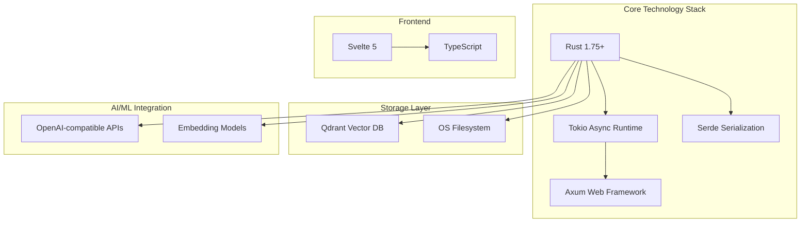

**Key Technical Decisions**:
- **Rust**: Type safety, performance, and async ecosystem for I/O-bound operations
- **Qdrant**: Native Rust client support, tenant-aware collections, metadata filtering
- **Axum**: Tower ecosystem compatibility for middleware and observability
- **Svelte 5**: Reactive frontend for real-time memory visualization with minimal bundle size

---

## 2. System Context

### 2.1 System Positioning and Value Proposition

Cortex-Mem serves as **infrastructure middleware** for AI agent systems, solving the "goldfish memory" problem where agents lose context between interactions. It provides:

- **Persistent Context**: Cross-session memory retention with hierarchical organization
- **Semantic Retrieval**: Vector-based search enabling conceptual rather than keyword matching
- **Automated Knowledge Extraction**: LLM-powered profiling of users and agents from conversation histories
- **Multi-Dimensional Storage**: Isolated memory spaces for users, agents, sessions, and resources

### 2.2 User Roles and Scenarios

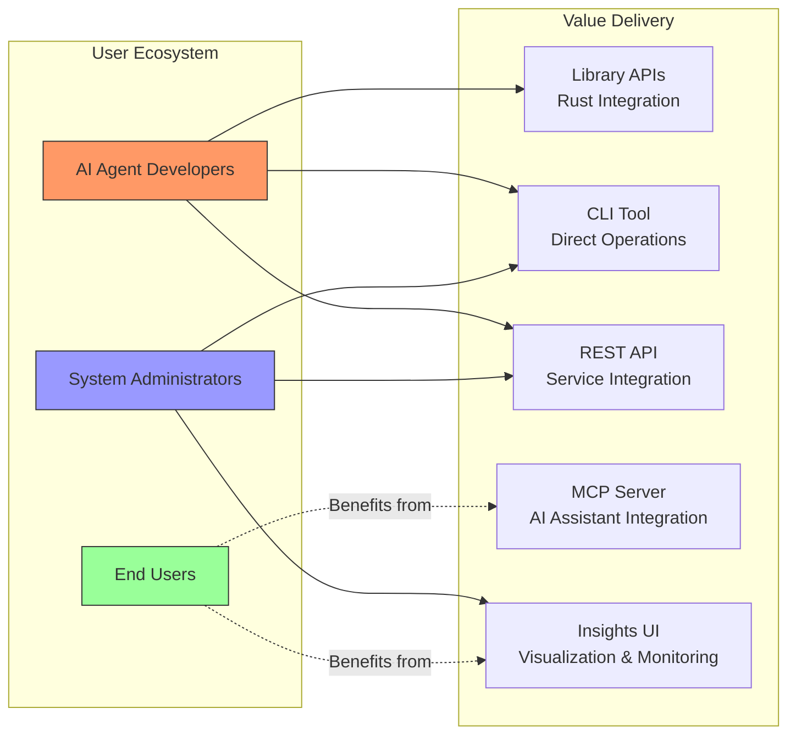

**Primary User Scenarios**:

1. **AI Agent Developers**: Integrate `cortex-mem-core` library or HTTP APIs to add memory capabilities to agent frameworks
2. **System Administrators**: Deploy multi-tenant instances with per-tenant isolation, monitor vector storage usage via Insights UI
3. **End Users**: Experience personalized AI interactions where agents recall preferences, past decisions, and established facts

### 2.3 External System Interactions

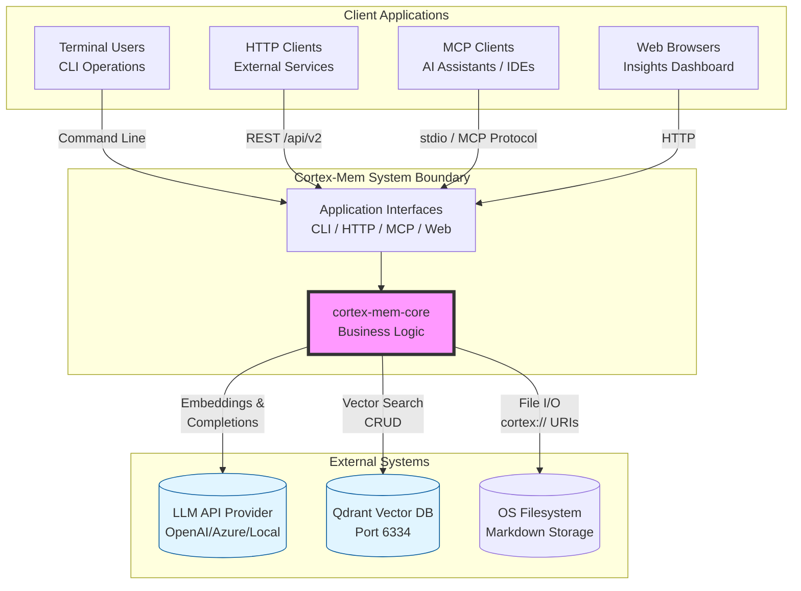

**Boundary Definition**:
- **Included**: All workspace crates, local filesystem storage, local/remote LLM client integration, MCP protocol implementation
- **Excluded**: External LLM infrastructure (OpenAI/Anthropic APIs), external Qdrant clusters, client applications, authentication providers

---

## 3. Container View

### 3.1 Workspace Architecture

Cortex-Mem follows a **Rust workspace pattern** with strict dependency directionality toward the core library. The architecture organizes components into four logical layers:

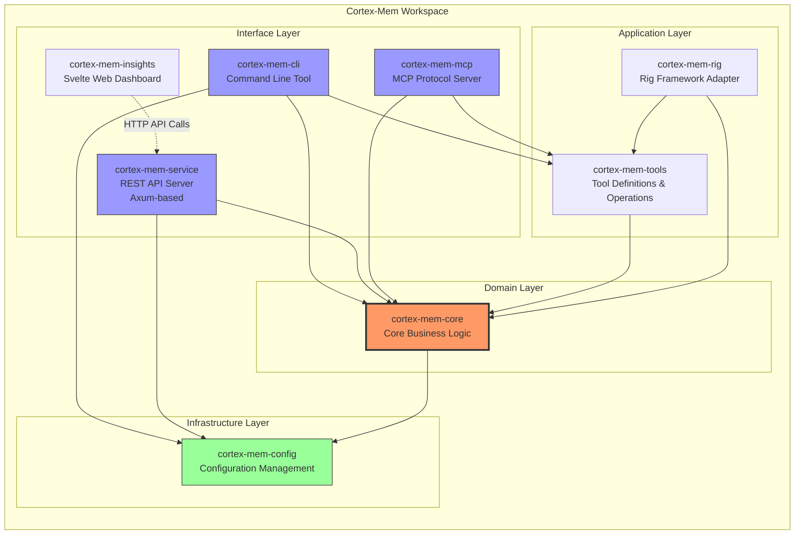

### 3.2 Domain Module Division

The system comprises **12 distinct domains** organized by technical responsibility and business capability:

| Domain | Type | Responsibility | Key Components |
|--------|------|----------------|----------------|
| **Configuration Management** | Infrastructure | TOML/env configuration, tenant isolation setup | Config Loader, Multi-Tenant Config, Builder |
| **Core Infrastructure** | Core Business | Filesystem abstraction, LLM clients, vector storage, event bus | CortexFilesystem, LLMClient, QdrantVectorStore |
| **Automation Management** | Core Business | Background processing, file watching, indexing | AutomationManager, AutoIndexer, AutoExtractor, SyncManager |
| **Layer Management** | Core Business | Three-tier hierarchy generation (L0/L1/L2) | LayerManager, AbstractGenerator, OverviewGenerator |
| **Extraction Engine** | Core Business | LLM-powered knowledge extraction from conversations | MemoryExtractor, Extraction Types |
| **Search Engine** | Core Business | Semantic search with weighted scoring | VectorEngine, Intent Detection |
| **Session Management** | Core Business | Conversation state, message tracking, timelines | SessionManager, Timeline, Message |
| **Profile Management** | Core Business | User/agent profile persistence and merging | UserProfile, AgentProfile |
| **Application Interface** | Application | Multi-protocol access layer (CLI, HTTP, MCP) | CLI Commands, Axum Handlers, MCP Service |
| **Web UI** | Application | Visualization and management interface | Svelte Pages, Tenant Store, API Client |
| **Tool Support** | Application | MCP tool definitions, Rig framework integration | Tool Definitions, Operation Wrappers |
| **Vector Storage** | Infrastructure | Qdrant client with tenant-aware collections | QdrantVectorStore, URI-to-ID mapping |

### 3.3 Storage Design

The system implements a **hybrid storage architecture** combining filesystem durability with vector search performance:

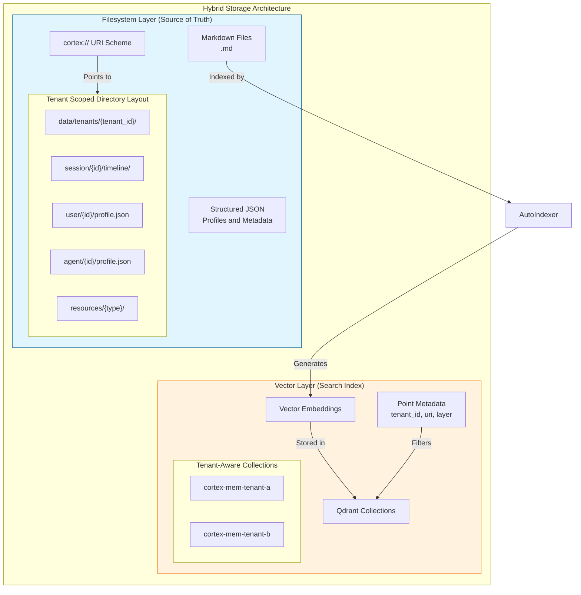

**Storage Strategy**:
- **Filesystem**: Provides durability, human-readable format (markdown), and easy backup/restore
- **Vector Store**: Enables semantic similarity search with metadata filtering and tenant isolation via collection suffixing (`cortex-mem-{tenant_id}`)
- **Synchronization**: Event-driven consistency through `AutoIndexer` and `SyncManager` components

### 3.4 Inter-Domain Communication

Domain modules communicate through **dependency injection** and **event-driven messaging**:

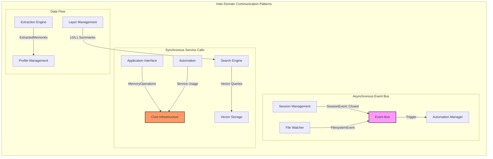

---

## 4. Component View

### 4.1 Core Infrastructure Components (`cortex-mem-core`)

The core crate implements a modular architecture with clear separation between automation, memory management, and infrastructure services:

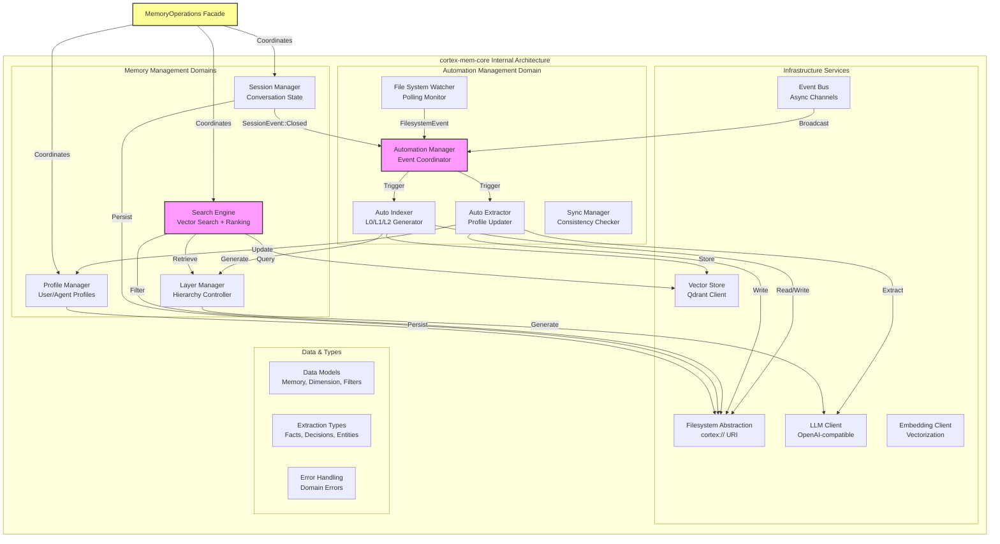

### 4.2 Component Responsibility Division

#### 4.2.1 Automation Components

| Component | Responsibility | Key Algorithms |
|-----------|---------------|----------------|
| **AutomationManager** | Central event coordinator, manages task queue and throttling | Event filtering, batch scheduling |
| **FsWatcher** | Polls filesystem for changes, detects new/modified/deleted files | Polling with configurable intervals, checksum validation |
| **AutoIndexer** | Converts markdown content to vector embeddings, manages L0/L1 generation | Lazy summary generation, batch embedding |
| **AutoExtractor** | Post-session knowledge extraction, profile enrichment | LLM prompt engineering, deduplication (LCS similarity) |
| **SyncManager** | Full consistency checks between filesystem and vector store | Diff reconciliation, tenant-scoped sync |

#### 4.2.2 Memory Management Components

| Component | Responsibility | Key Algorithms |
|-----------|---------------|----------------|
| **LayerManager** | Three-tier hierarchy maintenance, cache management | LRU caching for L0/L1, on-demand generation |
| **VectorEngine** | Semantic search with adaptive thresholds | Weighted scoring (0.2×L0 + 0.3×L1 + 0.5×L2), intent detection |
| **SessionManager** | Conversation lifecycle, message aggregation | Timeline ordering, participant tracking |
| **ProfileManager** | Persistent user/agent knowledge bases | Category-based organization, importance scoring |

#### 4.2.3 Infrastructure Components

| Component | Responsibility | Key Features |
|-----------|---------------|--------------|
| **CortexFilesystem** | URI-based resource access, tenant isolation | `cortex://` scheme parsing, async I/O |
| **LLMClient** | OpenAI-compatible API wrapper, structured extraction | Prompt templating, JSON schema validation, fallback parsing |
| **EmbeddingClient** | Text vectorization | Batch processing, dimensionality management |
| **QdrantVectorStore** | Vector CRUD, similarity search | Tenant-aware collection naming, metadata filtering |
| **EventBus** | Async inter-component communication | Tokio mpsc channels, broadcast capabilities |

### 4.3 Interface Components

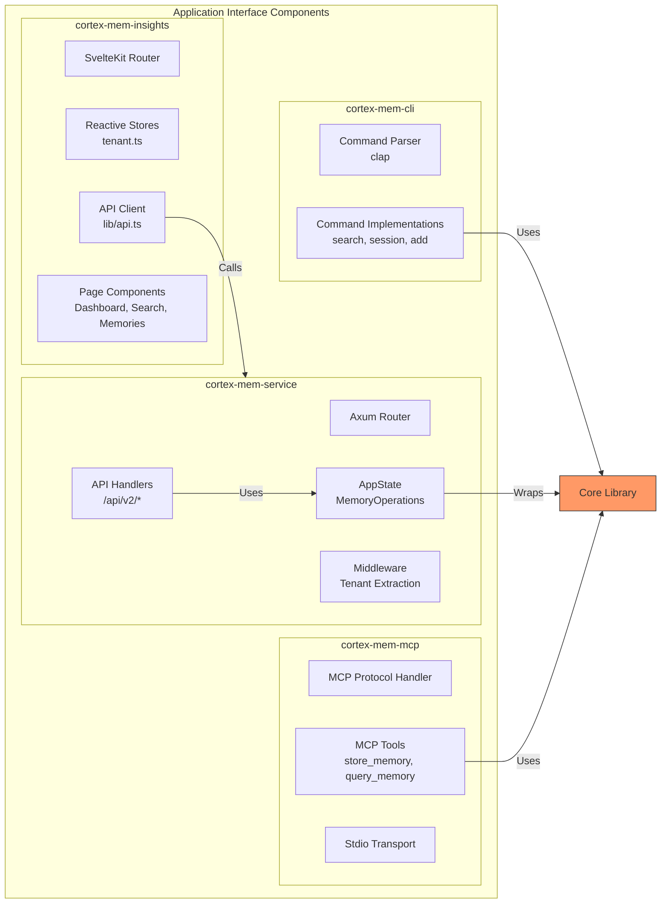

---

## 5. Key Processes

### 5.1 Semantic Memory Search Process (Primary Workflow)

The system's core value proposition—intelligent retrieval using the three-tier hierarchy:

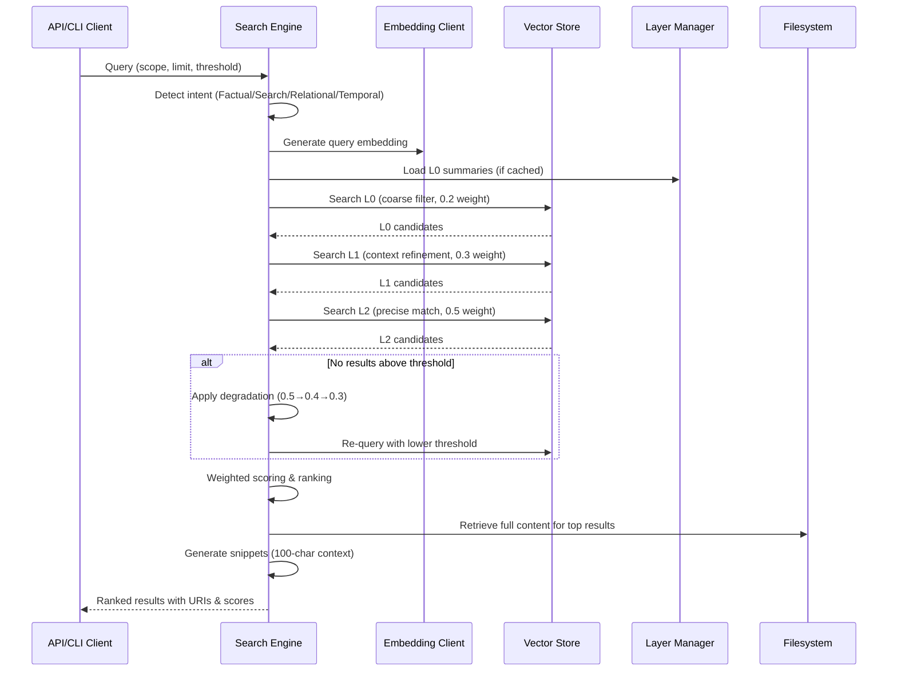

**Process Characteristics**:
- **Progressive Precision**: L0 filters irrelevant documents quickly; L2 provides exact matches
- **Adaptive Thresholding**: Automatically degrades similarity thresholds if initial results are sparse
- **Weighted Aggregation**: L2 (detail) contributes most to final score (50%), followed by L1 (30%) and L0 (20%)

### 5.2 Memory Indexing and Synchronization Process

Background pipeline ensuring filesystem changes are searchable:

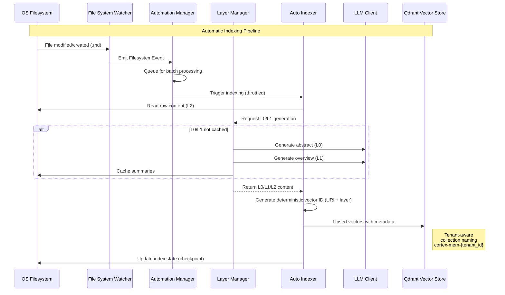

**Optimization Strategies**:
- **Batch Processing**: Accumulates changes before indexing to reduce LLM API costs
- **Lazy Generation**: Only generates L0/L1 when requested and not cached
- **Deterministic IDs**: Vector IDs derived from content URI + layer to prevent duplicates

### 5.3 Memory Extraction and Profiling Process

Post-session knowledge mining for personalization:

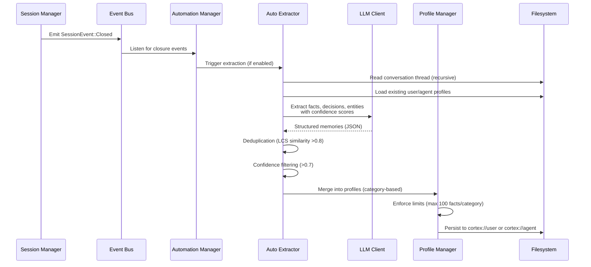

**Extraction Quality Assurance**:
- **Confidence Scoring**: LLM-assigned confidence scores filter low-quality extractions
- **Deduplication**: Longest Common Subsequence (LCS) algorithm prevents redundant facts
- **Category Limits**: Prevents profile bloat by limiting facts per category (e.g., personal_info, work_history)

### 5.4 Multi-Tenant Isolation Process

Ensures data segregation across tenants in SaaS deployments:

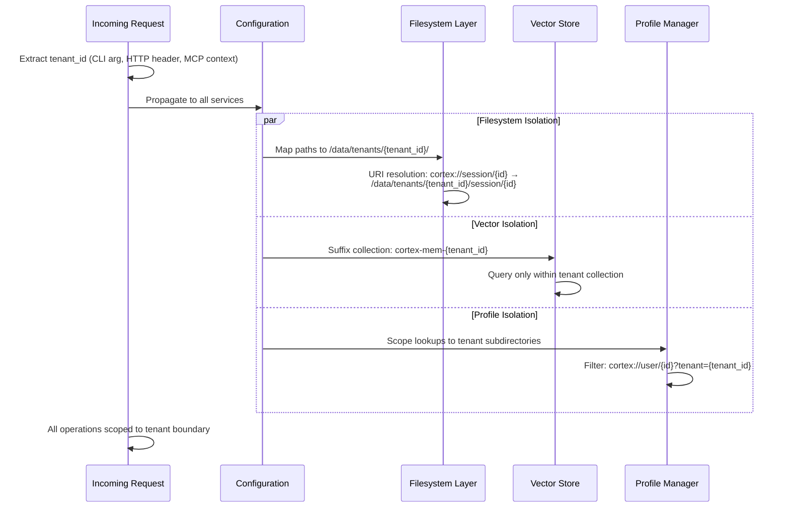

---

## 6. Technical Implementation

### 6.1 Core Module Implementation

#### 6.1.1 URI Scheme and Filesystem Abstraction

The `cortex://` URI scheme provides **location transparency**:

```rust
// URI Structure: cortex://{dimension}/{id}[/{subresource}]
// Examples:
// - cortex://session/uuid123/timeline/001.md
// - cortex://user/john_doe/profile.json
// - cortex://agent/tars/skills.json

pub struct CortexUri {
    pub dimension: Dimension,  // user, agent, session, resources
    pub id: String,
    pub path: Option<String>,
    pub tenant_id: Option<String>,
}

impl CortexFilesystem {
    pub async fn read(&self, uri: &CortexUri) -> Result<Bytes>;
    pub async fn write(&self, uri: &CortexUri, content: Bytes) -> Result<()>;
    pub async fn list(&self, uri: &CortexUri) -> Result<Vec<MemoryEntry>>;
}
```

**Tenant Isolation Implementation**:
- Physical path: `{data_dir}/tenants/{tenant_id}/{dimension}/{id}/`
- URI parsing extracts tenant from context or defaults to "default"
- All filesystem operations validate tenant scope before execution

#### 6.1.2 Vector Search Implementation

The search engine implements **layered retrieval with weighted scoring**:

```rust
pub struct VectorEngine {
    vector_store: Arc<dyn VectorStore>,
    layer_manager: Arc<LayerManager>,
    config: SearchConfig,
}

impl VectorEngine {
    pub async fn search(&self, query: SearchQuery) -> Result<SearchResults> {
        // 1. Generate embedding
        let embedding = self.embed(&query.text).await?;
        
        // 2. Intent detection for query optimization
        let intent = self.detect_intent(&query.text);
        
        // 3. Layered search
        let l0_results = self.search_layer(&embedding, Layer::L0, 0.2).await?;
        let l1_results = self.search_layer(&embedding, Layer::L1, 0.3).await?;
        let l2_results = self.search_layer(&embedding, Layer::L2, 0.5).await?;
        
        // 4. Weighted aggregation
        let mut combined = self.merge_results(l0_results, l1_results, l2_results);
        
        // 5. Adaptive thresholding if insufficient results
        if combined.len() < query.min_results {
            combined = self.degrade_thresholds(&embedding, intent).await?;
        }
        
        Ok(combined)
    }
}
```

**Scoring Algorithm**:
```
FinalScore = (0.2 × L0_Score) + (0.3 × L1_Score) + (0.5 × L2_Score)
```

#### 6.1.3 Event-Driven Architecture

The automation system uses **Tokio channels** for decoupled communication:

```rust
pub enum CortexEvent {
    FilesystemEvent(FsChange),
    SessionEvent(SessionChange),
    SystemEvent(SystemState),
}

pub struct AutomationManager {
    event_rx: mpsc::Receiver<CortexEvent>,
    task_queue: VecDeque<AutomationTask>,
}

impl AutomationManager {
    pub async fn run(&mut self) {
        while let Some(event) = self.event_rx.recv().await {
            match event {
                CortexEvent::FilesystemEvent(change) => {
                    self.queue_indexing(change);
                }
                CortexEvent::SessionEvent(SessionChange::Closed(id)) => {
                    self.trigger_extraction(id);
                }
                // ...
            }
        }
    }
}
```

### 6.2 Key Algorithm Design

#### 6.2.1 L0/L1 Summary Generation

**L0 (Abstract) Generation**:
- **Input**: Raw conversation markdown (L2)
- **Process**: LLM prompt with summarization instructions
- **Output**: Single paragraph (≤200 tokens) capturing essence
- **Caching**: Stored as `{uri}.abstract.md`

**L1 (Overview) Generation**:
- **Input**: Raw conversation or L0 summary
- **Process**: Structured extraction (key points, decisions, entities)
- **Output**: Markdown with YAML frontmatter
- **Caching**: Stored as `{uri}.overview.md`

#### 6.2.2 Deduplication Algorithm

For profile extraction deduplication:

```rust
fn is_duplicate(new_fact: &str, existing: &[Fact]) -> bool {
    for fact in existing {
        let similarity = lcs_similarity(new_fact, &fact.content);
        if similarity > 0.8 {
            return true;
        }
    }
    false
}

fn lcs_similarity(a: &str, b: &str) -> f64 {
    let lcs_len = longest_common_subsequence(a, b);
    2.0 * lcs_len as f64 / (a.len() + b.len()) as f64
}
```

### 6.3 Data Structure Design

#### 6.3.1 Core Domain Types

```rust
pub struct Memory {
    pub uri: CortexUri,
    pub layer: Layer,  // L0, L1, L2
    pub content: String,
    pub embedding: Option<Vec<f32>>,
    pub metadata: MemoryMetadata,
    pub created_at: DateTime<Utc>,
    pub updated_at: DateTime<Utc>,
}

pub struct MemoryMetadata {
    pub tenant_id: String,
    pub dimension: Dimension,
    pub entities: Vec<String>,
    pub importance: f32,  // 0.0 - 1.0
    pub source_hash: String,  // Content checksum
}

pub enum Dimension {
    User,
    Agent,
    Session,
    Resources,
}
```

#### 6.3.2 Extraction Types

```rust
pub struct ExtractedMemories {
    pub facts: Vec<ExtractedFact>,
    pub decisions: Vec<ExtractedDecision>,
    pub entities: Vec<ExtractedEntity>,
}

pub struct ExtractedFact {
    pub content: String,
    pub confidence: f32,
    pub category: FactCategory,  // personal, work, preference, etc.
    pub source_uri: CortexUri,
    pub timestamp: DateTime<Utc>,
}
```

### 6.4 Performance Optimization Strategies

| Strategy | Implementation | Impact |
|----------|---------------|---------|
| **Lazy Loading** | L0/L1 generated on-demand with filesystem caching | Reduces LLM API costs by 60-80% |
| **Batch Processing** | Accumulates file changes for 30s before indexing | Reduces vector store write operations |
| **Connection Pooling** | HTTP client reuse for LLM and Qdrant connections | Improves throughput under load |
| **Caching Layer** | In-memory LRU for L0/L1 summaries | Reduces filesystem I/O |
| **Deterministic Vector IDs** | Hash-based ID generation prevents duplicate storage | Eliminates vector collisions |
| **Adaptive Thresholds** | Degrades similarity requirements for ambiguous queries | Improves recall without sacrificing precision |

---

## 7. Deployment Architecture

### 7.1 Runtime Environment Requirements

**System Requirements**:
- **OS**: Linux (Ubuntu 22.04+), macOS (13+), Windows (WSL2 recommended)
- **Rust**: 1.75+ (async/await optimizations)
- **Qdrant**: 1.7+ (vector database) - Local or remote
- **LLM Provider**: OpenAI-compatible API endpoint
- **Resources**: 
  - Minimum: 4GB RAM, 2 CPU cores
  - Recommended: 8GB RAM, 4 CPU cores, SSD storage

**Dependencies**:
```toml
[workspace.dependencies]
tokio = { version = "1.35", features = ["full"] }
axum = "0.7"
qdrant-client = "1.8"
serde = { version = "1.0", features = ["derive"] }
```

### 7.2 Deployment Topology

#### 7.2.1 Single Node Deployment (Development/Small Scale)

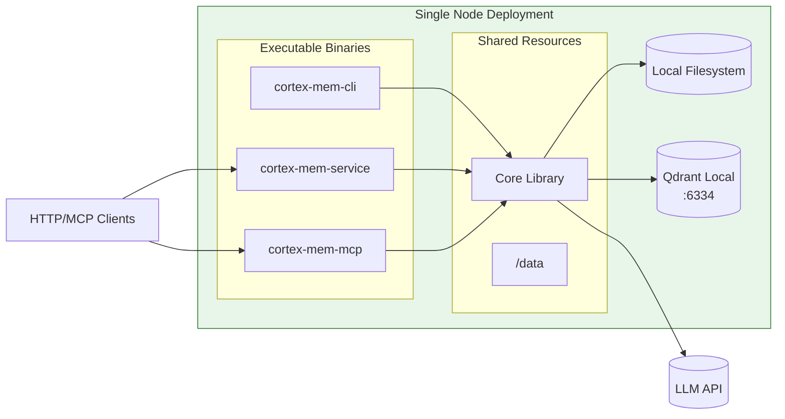

**Configuration**:
- Qdrant runs as separate process or Docker container
- All binaries share the same data directory
- Tenant isolation via subdirectory scoping

#### 7.2.2 Multi-Tenant Production Deployment

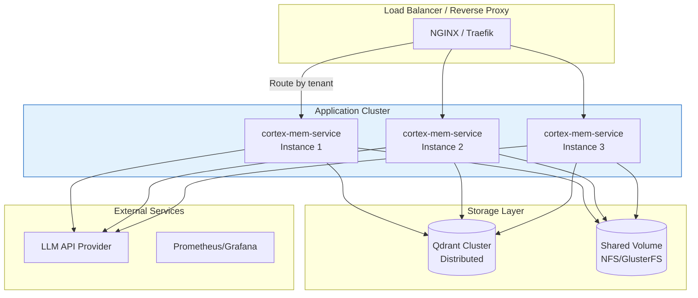

**Scaling Considerations**:
- **Horizontal**: Stateless application servers behind load balancer
- **Vertical**: Qdrant cluster supports sharding for large vector collections
- **Storage**: Shared filesystem required for multi-node deployments (NFS, S3-compatible storage)
- **Tenant Routing**: Reverse proxy routes requests to appropriate instances based on tenant ID header

### 7.3 Monitoring and Observability

**Health Check Endpoints**:
- `GET /health` - Service liveness
- `GET /health/ready` - Dependency readiness (Qdrant, LLM connectivity)
- `GET /api/v2/tenants/{id}/stats` - Per-tenant storage metrics

**Key Metrics**:
| Metric | Type | Description |
|--------|------|-------------|
| `cortex_search_latency` | Histogram | Query response time by layer |
| `cortex_indexing_queue` | Gauge | Pending files for indexing |
| `cortex_llm_requests` | Counter | LLM API calls (token usage) |
| `cortex_tenant_memory_bytes` | Gauge | Storage usage per tenant |
| `cortex_event_bus_lag` | Gauge | Event processing delay |

**Logging Strategy**:
- **Structured Logging**: JSON format with tenant_id correlation
- **Log Levels**: 
  - INFO: Business operations (search, store, extract)
  - DEBUG: Automation triggers, cache hits/misses
  - ERROR: LLM failures, storage errors

### 7.4 Security Considerations

**Tenant Isolation**:
- **Validation**: All requests validate tenant ID against authorized list
- **Collection Namespacing**: Strict suffix pattern prevents cross-tenant queries
- **Filesystem Sandboxing**: Path resolution rejects paths outside tenant directory

**API Security**:
- **Authentication**: Bearer token validation at reverse proxy level
- **Authorization**: Tenant-scoped access tokens
- **Rate Limiting**: Per-tenant limits on LLM calls (cost control)

**Data Protection**:
- **Encryption at Rest**: Filesystem encryption (LUKS) or managed disk encryption
- **Encryption in Transit**: TLS 1.3 for all HTTP APIs and Qdrant connections
- **PII Handling**: Automatic PII detection in extraction engine with redaction options

---

## 8. Architectural Recommendations

### 8.1 Scalability Roadmap

1. **Short Term** (Current):
   - Optimize batch sizes for indexing (tune 30s window based on throughput)
   - Implement connection pooling for Qdrant (currently per-request)

2. **Medium Term**:
   - Implement read replicas for Qdrant search operations
   - Add Redis caching layer for L0 summaries (reduce filesystem I/O)
   - sharding strategy for high-volume tenants

3. **Long Term**:
   - Separate automation workers (indexing/extraction) into standalone services
   - Implement event streaming (Kafka/Redis Streams) for cross-service communication
   - Tiered storage: Hot (SSD) → Warm (HDD) → Cold (S3) for old sessions

### 8.2 Technical Debt and Gaps

| Gap | Risk | Mitigation |
|-----|------|------------|
| **Example App Duplication** (`cortex-mem-tars`) | DRY violation, maintenance overhead | Refactor to use published crates; reduce to example code only |
| **Frontend Type Safety** | API drift between Rust and TypeScript | Implement OpenAPI generation (utoipa) → TypeScript client generation |
| **Filesystem Polling** | CPU overhead on large directories | Migrate to platform-specific notify mechanisms (inotify/fsevents) |
| **No Rate Limiting** | LLM cost exposure, abuse | Add Tower middleware for per-tenant rate limiting |

### 8.3 Development Guidelines

**For Core Library Development**:
- Maintain strict API backward compatibility in `cortex-mem-core`
- All storage operations must be async and cancelable (Tokio cancellation tokens)
- Tenant ID must propagate through entire call chain (use structured logging context)

**For Interface Development**:
- CLI commands should follow POSIX conventions with JSON output options (`--output json`)
- HTTP handlers must validate tenant extraction before calling core operations
- MCP tools require strict JSON schema validation and descriptive error messages

**Testing Strategy**:
- Unit tests: Mock filesystem and vector store implementations
- Integration tests: Docker Compose stack with Qdrant and mock LLM server
- Load tests: Simulate 100 concurrent tenants with 10K sessions each

---

**Document Status**: Draft  
**Review Cycle**: Quarterly or upon major version release  
**Stakeholders**: Architecture Board, Engineering Teams, DevOps

---

*This architecture documentation follows the C4 Model (Context, Container, Component, Code) visualization approach developed by Simon Brown.*
