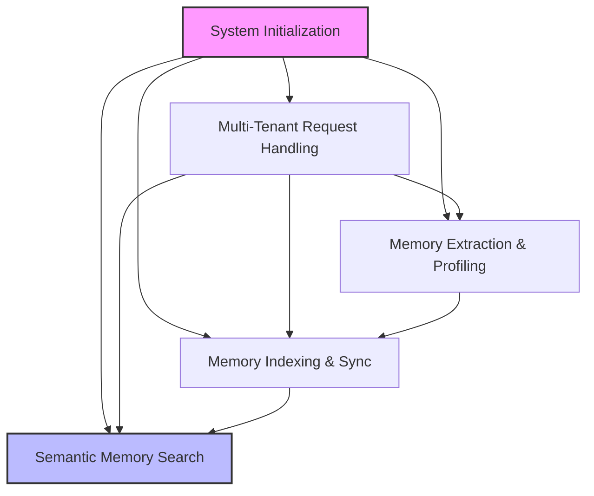
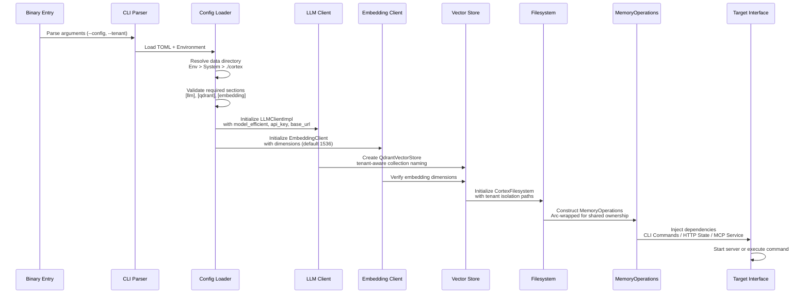
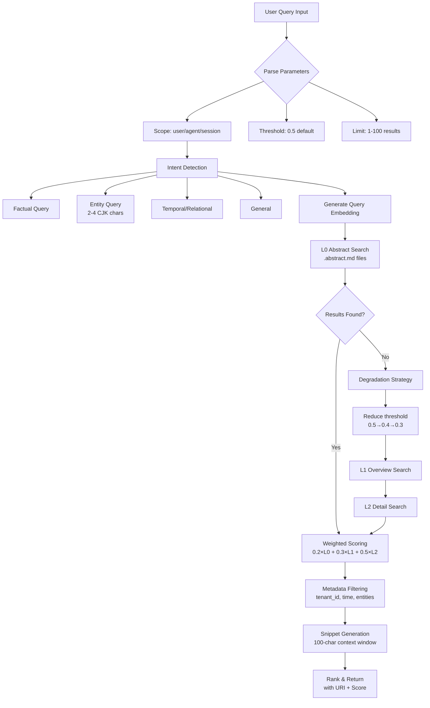
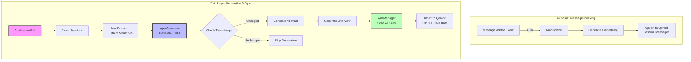
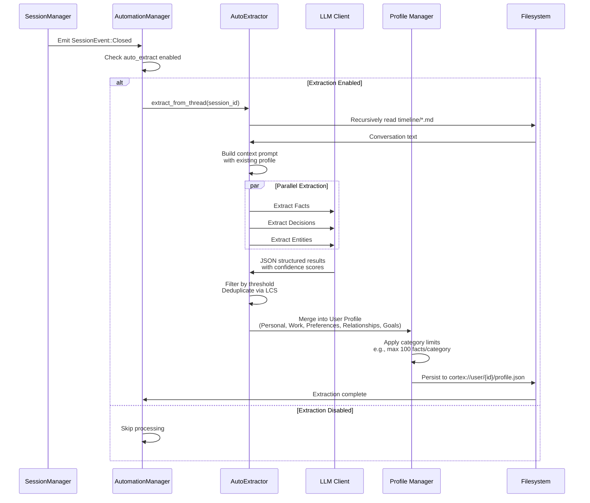
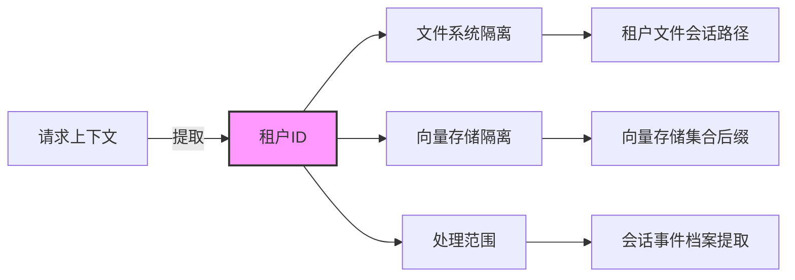
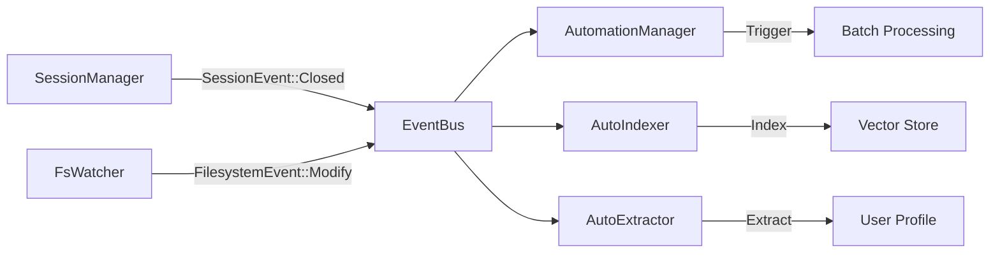
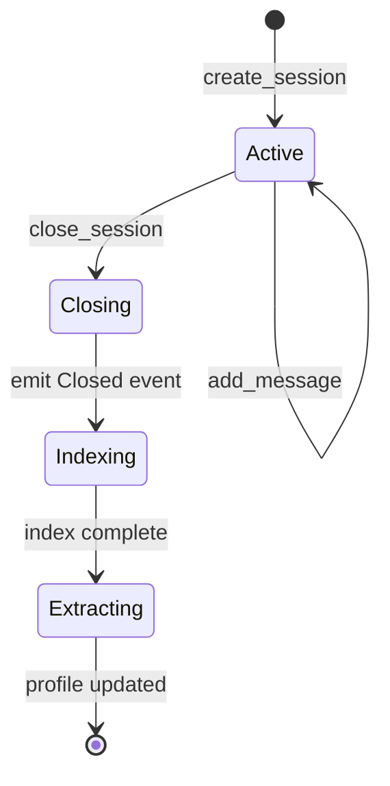
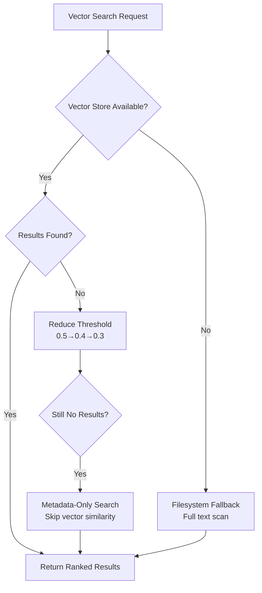

# Core Workflows

**Document Version**: 1.0  
**System**: Cortex Memory (cortex-mem)  
**Last Updated**: 2024  

## Table of Contents
1. [Workflow Overview](#1-workflow-overview)
2. [Main Workflows](#2-main-workflows)
3. [Flow Coordination and Control](#3-flow-coordination-and-control)
4. [Exception Handling and Recovery](#4-exception-handling-and-recovery)
5. [Key Process Implementation](#5-key-process-implementation)

---

## 1. Workflow Overview

### 1.1 System Architecture and Workflow Landscape

Cortex-Mem implements a **multi-dimensional memory management system** designed for AI agents, structured around five core operational workflows that ensure persistent, context-aware memory across sessions. The system follows a **layered retrieval architecture** (L0 Abstract, L1 Overview, L2 Detail) combined with **vector-based semantic search** and **filesystem abstraction**.

### 1.2 Core Workflow Taxonomy

The system operates through five primary workflows that span initialization, runtime operations, and background automation:

| Workflow | Type | Frequency | Criticality | Key Components |
|----------|------|-----------|-------------|----------------|
| **System Initialization** | Bootstrap | Per-instance | Critical | Config loading, DI container, service wiring |
| **Semantic Memory Search** | User-facing | Per-query | Critical | Vector engine, layer manager, ranking |
| **Memory Indexing & Sync** | Background | Event-driven | High | File watcher, indexer, vector store |
| **Memory Extraction & Profiling** | Background | Session-close | High | LLM extraction, profile merging, dedup |
| **Multi-Tenant Request Handling** | Cross-cutting | Per-request | Critical | Tenant isolation, URI routing, collection scoping |

### 1.3 Workflow Interdependencies



**Dependency Rationale**:
- **Initialization** is the prerequisite for all operational workflows, establishing the dependency injection graph and service boundaries.
- **Multi-Tenant Handling** acts as a cross-cutting concern that scopes all subsequent operations.
- **Indexing** feeds the vector store that **Search** depends upon.
- **Extraction** generates profile data that enriches future search contexts.

---

## 2. Main Workflows

### 2.1 System Initialization and Dependency Injection

#### 2.1.1 Process Overview

The initialization workflow bootstraps the entire system by loading configuration, initializing core services (LLM, Qdrant, Filesystem), and wiring dependencies for all interfaces (CLI, HTTP API, MCP, Web). This ensures consistent state across all entry points.

#### 2.1.2 Execution Flow



#### 2.1.3 Key Process Nodes

**Configuration Resolution Strategy**:
1. **Environment Variables** (`CORTEX_DATA_DIR`, `EMBEDDING_API_KEY`) take highest priority
2. **TOML Configuration** file specified via `--config` or default locations
3. **System Directories** using `directories` crate (e.g., `~/Library/Application Support/com.cortex-mem.tars` on macOS)
4. **Local Fallback** to `./.cortex` for development/portability

**Dependency Injection Pattern**:
- Uses `Arc<T>` for thread-safe shared ownership of `MemoryOperations`
- Boxed trait objects (`Box<dyn VectorStore>`, `Box<dyn LLMClient>`) enable loose coupling and testability
- Builder pattern (`CortexMemBuilder`) for fluent initialization

**Validation Gates**:
- Required config sections: `[llm]`, `[qdrant]`, `[embedding]`
- Qdrant connectivity verification
- Embedding dimension auto-detection (fallback to 1536 for text-embedding-3-small)

---

### 2.2 Semantic Memory Search Process

#### 2.2.1 Process Overview

The semantic search workflow performs intelligent, multi-layered retrieval across memory dimensions (user, agent, session) using a weighted combination of L0 (Abstract), L1 (Overview), and L2 (Detail) layers. This is the primary value-delivering workflow of the system.

#### 2.2.2 Execution Flow



#### 2.2.3 Layered Retrieval Algorithm

**Three-Tier Architecture**:

1. **L0 Layer (Abstract)**: Fast positioning using `.abstract.md` files (~100 tokens)
   - **Purpose**: Coarse-grained candidate selection
   - **Weight**: 20% of final score
   - **Content**: Single-sentence or 2-3 sentence summaries capturing core essence (who, what, when)

2. **L1 Layer (Overview)**: Deep exploration using `.overview.md` files (500-2000 tokens)
   - **Purpose**: Contextual refinement for decision-making
   - **Weight**: 30% of final score
   - **Content**: Structured markdown with Summary, Core Topics, Key Points, Entities

3. **L2 Layer (Detail)**: Precise matching using full message content
   - **Purpose**: Final relevance confirmation
   - **Weight**: 50% of final score
   - **Content**: Raw conversation messages in markdown format

**Scoring Formula**:
```rust
final_score = (l0_score × 0.2) + (l1_score × 0.3) + (l2_score × 0.5)
```

#### 2.2.4 Adaptive Query Processing

**Intent Detection**:
- **Entity Queries**: Short Chinese names (2-4 CJK characters) or short English proper nouns trigger specialized handling with threshold 0.4
- **Factual Queries**: Pattern matching for fact-seeking (who, what, when)
- **Temporal Queries**: Time-based constraints detected via regex

**Default Thresholds**:
- **Default Search Threshold**: 0.6 (increased from 0.5 for better precision)
- **Entity Query Threshold**: 0.4 (higher recall for specific lookups)
- **Minimum Threshold**: 0.4 (prevents returning overly irrelevant results)

**Degradation Strategies**:
1. **Progressive Threshold Reduction**: If L0 returns empty, reduce similarity threshold with floor at 0.4 (prevents returning overly broad results)
2. **Layer Bypass**: Fallback to full semantic search bypassing hierarchical architecture when layered retrieval fails
3. **Scope Filtering**: Application-level URI prefix filtering ensures scope isolation even if vector store filters are misconfigured

---

### 2.3 Memory Indexing and Synchronization

#### 2.3.1 Process Overview

This workflow manages two critical synchronization mechanisms:
1. **Runtime Message Indexing**: Automatically indexes conversation messages as they're added during runtime
2. **Exit-time Layer Generation & Sync**: Generates L0/L1 layer files and syncs them to the vector database when the application exits

This dual-approach ensures both immediate searchability of conversations and comprehensive coverage of all memory data.

#### 2.3.2 Execution Flow



#### 2.3.3 Runtime Message Indexing

**Triggered by**: `SessionEvent::MessageAdded`

**Process**:
1. Message content is immediately embedded using `EmbeddingClient`
2. Vector point created with metadata (user_id, session_id, role, timestamp)
3. Upserted to Qdrant collection (tenant-aware naming)
4. Asynchronous processing via `tokio::spawn` (non-blocking)

**Configuration**:
```rust
AutomationConfig {
    auto_index: true,
    index_on_message: true,   // ✅ Immediate indexing
    index_on_close: true,     // ✅ Session close triggers L0/L1 generation + indexing
    index_batch_delay: 1,
    generate_layers_every_n_messages: 5,  // ✅ Periodic L0/L1 generation
}
```

#### 2.3.4 Exit-time and Session-Close Layer Generation & Sync

**Triggered by**: 
1. Application shutdown (`App::on_exit()`)
2. Session close via `close_session()` MCP tool or HTTP API

**Multi-stage Process**:

**Stage 1: Memory Extraction**
- Session closed, triggering `AutoExtractor`
- LLM extracts structured facts, entities, preferences
- Saves to `cortex://user/{user_id}/` categorized directories

**Stage 2: Layer File Generation**
- `LayerGenerator::ensure_timeline_layers()` for specific session, or
- `LayerGenerator::ensure_all_layers()` for all sessions
- **Change Detection**: Compares file timestamps with existing `.abstract.md`
- Only regenerates if:
  - `.abstract.md` or `.overview.md` is missing
  - Source files newer than existing layer files
- Generates L0 Abstract (~100 tokens) and L1 Overview (~2000 tokens)
- **Token Savings**: Skips 90% of regeneration by timestamp tracking

**Stage 3: Vector Sync**
- `SyncManager::sync_specific_path()` for session-scoped sync, or
- `SyncManager::sync_all()` for full system sync
- Indexes **all** markdown files (session, user, agent data)
- Includes newly generated `.abstract.md` and `.overview.md`
- **Deduplication**: Content hash checking prevents duplicate indexing
- Returns statistics: `{total_files, indexed_files, skipped_files, error_files}`

**Code Implementation**:
```rust
// examples/cortex-mem-tars/src/app.rs
pub async fn on_exit(&mut self) -> Result<()> {
    // 1. Close session → triggers extraction
    session_manager.close_session(session_id).await?;
    
    // 2. Generate L0/L1 layer files
    let stats = tenant_ops.ensure_all_layers().await?;
    log::info!("Layers: {} generated, {} skipped", 
        stats.generated, stats.skipped);
    
    // 3. Sync all files to Qdrant
    let sync_stats = tenant_ops.index_all_files().await?;
    log::info!("Indexed: {}/{} files", 
        sync_stats.indexed_files, sync_stats.total_files);
    
    Ok(())
}
```

**MCP Tool Integration**:
```rust
// New MCP tools for session lifecycle management
// cortex-mem-mcp/src/service.rs

#[tool(description = "Generate L0/L1 layer files for memories")]
async fn generate_layers(
    thread_id: Option<String>,  // Optional: specific session or all
) -> GenerateLayersResult;

#[tool(description = "Index memories to vector database")]
async fn index_memories(
    thread_id: Option<String>,  // Optional: specific session or all
) -> IndexMemoriesResult;

#[tool(description = "Close session and trigger final processing")]
async fn close_session(
    thread_id: String,
) -> CloseSessionResult;
```

#### 2.3.5 Key Mechanisms

**Change Detection Strategy**:
```rust
async fn should_regenerate(&self, uri: &str) -> Result<bool> {
    // 1. Check if .abstract.md exists
    let abstract_path = format!("{}/.abstract.md", uri);
    if !filesystem.exists(&abstract_path).await? {
        return Ok(true);  // Must generate
    }
    
    // 2. Extract timestamp from .abstract.md
    let content = filesystem.read(&abstract_path).await?;
    let abstract_time = extract_added_timestamp(&content);
    
    // 3. Compare with source file timestamps
    for file in list_directory(uri).await? {
        if file.modified > abstract_time {
            return Ok(true);  // Files updated, regenerate
        }
    }
    
    Ok(false)  // No changes, skip
}
```

**Deterministic Vector ID Generation**:
```rust
// Double hashing ensures same URI+Layer always generates same ID
id = hash(hash(uri) + layer_suffix)
```
- **Purpose**: Enables idempotent updates and deduplication
- **Format**: UUIDv5 derived from content URI and layer identifier (L0/L1/L2)

**Batch Processing Strategy**:
- **Real-time Mode**: Immediate indexing on message add (used during conversation)
- **Batch Mode**: Exit-time full scan (comprehensive coverage)
- **Deduplication**: Content hash checking before embedding generation to avoid redundant LLM API calls

**Layer Generation Pipeline**:
1. **Raw Content** (L2): Loaded from filesystem markdown
2. **Abstract Generation**: LLM prompt using `Prompts::generate_abstract` (~100 tokens)
3. **Overview Generation**: LLM prompt using `Prompts::generate_overview` (structured markdown)
4. **Vectorization**: Each layer embedded separately with dimensional consistency checks

#### 2.3.6 Performance Optimizations

**Token Savings**:
- **90% reduction**: Timestamp-based change detection skips unchanged directories
- **Example**: 100 directories, only 10 changed → 10 LLM calls instead of 100

**Sync Efficiency**:
- **Hash Deduplication**: Content hash stored in vector metadata
- **Skip Already Indexed**: Qdrant `exists(vector_id)` check before embedding
- **Batch Processing**: Files processed in configurable batch sizes (default: 10)

**Memory Management**:
- Layer generation and sync run **after** session close
- Non-blocking during runtime (only blocks on exit)
- Ensures complete data synchronization before shutdown

---

### 2.4 Memory Extraction and Profiling

#### 2.4.1 Process Overview

Triggered on session closure, this workflow extracts structured facts, decisions, and entities from conversation history and enriches user or agent profiles. It enables persistent personalization and cumulative learning across sessions.

#### 2.4.2 Execution Flow



#### 2.4.3 Extraction Taxonomy

**Memory Types**:
- **Facts**: Objective statements with confidence (0.0-1.0) and importance (Low/Medium/High/Critical)
- **Decisions**: Choices made with context and rationale
- **Entities**: People, organizations, products with attributes

**Profile Categories**:
1. **Personal Information**: Demographics, contact details
2. **Work History**: Professional background
3. **Preferences**: Explicit likes/dislikes
4. **Relationships**: Connections between entities
5. **Goals**: Stated objectives and aspirations

**Deduplication Strategy**:
- **Algorithm**: Longest Common Substring (LCS) similarity
- **Threshold**: Configurable string similarity (default 0.85)
- **Conflict Resolution**: Higher confidence scores overwrite existing; timestamp-based tie-breaking

---

### 2.5 Multi-Tenant Memory Management

#### 2.5.1 Process Overview

Enables isolation of memory data across different users, agents, or organizations by scoping all operations to a tenant ID. Supports SaaS deployment where multiple tenants share the same system instance while maintaining data segregation.

#### 2.5.2 Isolation Architecture



#### 2.5.3 Tenant Propagation Chain

1. **Entry Point Extraction**:
   - CLI: `--tenant` argument
   - HTTP: `Authorization` header or request metadata
   - MCP: Context parameters

2. **Configuration Propagation**:
   - `QdrantConfig::with_tenant_id()`: Suffixes collection name
   - `CortexFilesystem`: Prepends `/tenants/{tenant_id}` to all paths
   - `AutomationManager`: Scopes event handling per tenant

3. **Data Isolation Guarantees**:
   - **Filesystem**: Physical directory separation prevents cross-tenant file access
   - **Vector Store**: Separate Qdrant collections per tenant (or namespace segregation in shared collections)
   - **Search**: Automatic filtering by `tenant_id` metadata in all vector queries

---

## 3. Flow Coordination and Control

### 3.1 Event-Driven Architecture

The system implements a **pub/sub event bus** using Tokio's `mpsc` unbounded channels for loose coupling between components.

**Event Taxonomy**:
```rust
enum CortexEvent {
    Session(SessionEvent),      // Creation, MessageAdded, Closed
    Filesystem(FilesystemEvent), // Create, Modify, Delete
}
```

**Event Flow**:


**Coordination Patterns**:
- **Fire-and-Forget**: Session events trigger background extraction without blocking UI
- **Batch Aggregation**: `AutomationManager` uses `HashSet` to deduplicate rapid successive events
- **Concurrent Processing**: `tokio::spawn` for parallel indexing; `tokio::select!` for timeout management

### 3.2 State Management

**Session State Machine**:


**Indexing State Tracking**:
- **In-Memory**: `HashMap<String, Vec<String>>` tracks processed message IDs per thread
- **Deduplication**: Content hash stored in vector metadata to prevent re-indexing
- **Persistence**: Vector store serves as source of truth for indexed state

### 3.3 Data Flow Patterns

**Request-Response Flow** (Synchronous):
1. Interface receives request (HTTP/MCP/CLI)
2. Extract tenant context
3. Invoke `MemoryOperations` methods
4. Direct filesystem or vector store access
5. Return structured response

**Background Processing Flow** (Asynchronous):
1. Event detected (file change, session close)
2. Event queued in `AutomationManager`
3. `tokio::spawn` creates background task
4. Progress tracked via `tracing` logs
5. Results persisted to storage

### 3.4 Concurrency Control

**Resource Sharing**:
- `Arc<MemoryOperations>`: Shared across all request handlers
- `Arc<Mutex<File>>`: Log file access serialization
- `RwLock<HashMap>`: Tenant cache in web UI

**Parallelism Strategies**:
- **Per-Tenant Parallelism**: Different tenants process concurrently
- **Layer Parallelism**: L0/L1/L2 vectorization happens sequentially (dependency), but multiple messages batch process in parallel
- **Extraction Parallelism**: Facts, Decisions, Entities extracted simultaneously via `join!`

---

## 4. Exception Handling and Recovery

### 4.1 Error Taxonomy

The system defines a comprehensive error hierarchy using `thiserror`:

| Error Variant | Source | Handling Strategy |
|--------------|--------|-------------------|
| `InvalidUri` | URI parsing | Fail fast with user context |
| `InvalidDimension` | Category validation | Return 400 Bad Request |
| `MemoryNotFound` | Storage lookup | Return empty result set |
| `IoError` | Filesystem | Retry with exponential backoff |
| `JsonError` | Serialization | Log and continue (skipping record) |
| `LlmError` | AI/ML service | Degrade to keyword search |
| `EmbeddingError` | Vectorization | Skip indexing, alert monitoring |
| `QdrantError` | Vector store | Circuit breaker pattern |
| `ConfigError` | Initialization | Panic/Exit with error message |

### 4.2 Degradation Strategies

**Search Degradation**:


**LLM Service Degradation**:
- **Primary**: OpenAI-compatible API
- **Fallback**: Local LLM via compatible endpoint
- **Emergency**: Skip extraction/indexing, maintain L2 storage only

**Indexing Failure Recovery**:
1. **Batch Rollback**: Failed batch items logged to `warn!`, others committed
2. **Retry Logic**: 3 attempts with 1s, 5s, 30s delays
3. **Dead Letter Queue**: Persistent failures written to `failed_index/{tenant_id}/{timestamp}.json`

### 4.3 Fault Tolerance Patterns

**Circuit Breaker** (Vector Store):
- **Closed**: Normal operation
- **Open**: After 5 consecutive failures, bypass vector operations for 60s
- **Half-Open**: Test ping after cooldown, resume if healthy

**Graceful Shutdown**:
1. Stop accepting new requests
2. Wait for in-flight indexing to complete (30s timeout)
3. Flush pending extraction queues
4. Close filesystem handles
5. Terminate runtime

### 4.4 Recovery Procedures

**Data Consistency Repair**:
- **SyncManager**: Manual trigger via CLI `cortex-mem sync` to reconcile filesystem vs vector store
- **Hash Mismatch**: Re-index content where filesystem hash ≠ stored hash
- **Orphaned Vectors**: Weekly cleanup job removes vectors with non-existent filesystem URIs

**Tenant Isolation Breach Recovery**:
- Immediate collection quarantine
- Audit log analysis for data leakage scope
- Profile regeneration from filesystem backup

---

## 5. Key Process Implementation

### 5.1 Vector ID Generation Algorithm

**Purpose**: Ensure deterministic, unique identifiers for vector entries to support idempotent updates.

**Implementation**:
```rust
fn uri_to_vector_id(uri: &str, layer: ContextLayer) -> String {
    // Step 1: Normalize URI (lowercase, trim)
    let normalized = uri.to_lowercase().trim();
    
    // Step 2: Create layer suffix
    let suffix = match layer {
        ContextLayer::Abstract => \"#L0\",
        ContextLayer::Overview => \"#L1\", 
        ContextLayer::Detail => \"#L2\",
    };
    
    // Step 3: Double hash for entropy
    let hash1 = sha256(normalized);
    let hash2 = sha256(hash1 + suffix);
    
    // Step 4: Convert to UUIDv5 format
    uuid_from_hash(hash2)
}
```

**Properties**:
- **Deterministic**: Same URI + Layer always produces same ID
- **Collision Resistant**: Double SHA256 with tenant-scoped URIs
- **Parseable**: `parse_vector_id()` extracts original URI and layer from ID

### 5.2 Intent Detection Engine

**Classification Logic**:

```rust
fn detect_intent(query: &str) -> IntentType {
    // Entity detection: Short proper nouns
    if is_cjk(query) && query.len() <= 12 {  // 2-4 CJK characters
        return IntentType::Entity;
    }
    
    // Factual patterns
    if query.matches(r\"^(who|what|when|where|why|how)\\b\") {
        return IntentType::Factual;
    }
    
    // Temporal patterns
    if query.matches(r\"\\b(yesterday|today|last week|in 2024)\\b\") {
        return IntentType::Temporal;
    }
    
    // Relational patterns
    if query.matches(r\"\\b(related to|about|with)\\b\") {
        return IntentType::Relational;
    }
    
    IntentType::General
}
```

**Threshold Adaptation**:
- **Entity/Factual**: 0.4 (higher recall for specific lookups)
- **General**: 0.5 (balanced precision/recall)
- **Relational**: 0.45 (weighted for connection finding)

### 5.3 Content Hashing and Deduplication

**Deduplication Pipeline**:
1. **Content Normalization**: Remove whitespace, lowercase, normalize Unicode
2. **SimHash Generation**: 64-bit hash for near-duplicate detection
3. **Hamming Distance**: Threshold of 3 bits for similarity
4. **LCS Verification**: Longest Common Substring > 80% confirms duplicate

**Batch Deduplication**:
- In-memory `HashSet` of processed message IDs per indexing run
- Vector store pre-flight check: `exists(vector_id)` before embedding
- Timestamp-based conflict resolution: Keep newer if hashes match

### 5.4 Profile Merging Algorithm

**Conflict Resolution**:
```rust
fn merge_profile(existing: UserProfile, new: ExtractedMemories) -> UserProfile {
    for fact in new.facts {
        // Check for semantic duplicates
        if existing.facts.any(|f| similarity(f, fact) > 0.85) {
            // Update if higher confidence
            if fact.confidence > existing.confidence {
                replace(existing_fact, fact);
            }
        } else {
            // Check category limits
            if category_count < MAX_CATEGORY_SIZE {
                existing.facts.push(fact);
            } else if fact.importance > existing.min_importance {
                // Replace least important
                replace_least_important(existing.facts, fact);
            }
        }
    }
}
```

**Category Limits**:
- Personal Info: 50 items
- Work History: 100 items
- Preferences: 200 items
- Relationships: 50 items
- Goals: 50 items

### 5.5 Performance Optimization Strategies

**Embedding Batch Processing**:
- **Optimal Batch Size**: 32 items (balances latency vs throughput)
- **Chunked Processing**: Large batches split into sub-batches with 100ms yield points
- **Connection Pooling**: HTTP/2 multiplexing for embedding API calls

**Filesystem I/O**:
- **Async Operations**: All FS calls use `tokio::fs` (non-blocking)
- **Metadata Caching**: LRU cache for file stats (1000 entries)
- **Buffered Writes**: 4KB buffer for markdown file writes

**Vector Search Optimization**:
- **HNSW Indexing**: Qdrant's HNSW algorithm for sub-millisecond similarity search
- **Metadata Filtering**: Pre-filter by tenant_id before vector comparison (reduces search space)
- **Pagination**: Cursor-based scrolling for large result sets (avoid offset limits)

**Memory Management**:
- **Streaming Processing**: Large session files processed via streaming JSON parser
- **Object Pooling**: Reuse LLM client connections across requests
- **Lazy Loading**: L0/L1 layers generated on-demand, cached to filesystem

---

## Appendix: Workflow Metrics and Monitoring

**Key Performance Indicators**:

| Workflow | Metric | Target | Alert Threshold |
|----------|--------|--------|----------------|
| Search | P95 Latency | <200ms | >500ms |
| Indexing | Throughput | 100 docs/sec | <20 docs/sec |
| Extraction | Accuracy | >90% confidence | <70% confidence |
| Initialization | Startup Time | <5s | >15s |

**Health Check Endpoints**:
- `/health`: Liveness probe (HTTP 200 if runtime active)
- `/ready`: Readiness probe (checks Qdrant connectivity, disk space)
- `/metrics`: Prometheus-style metrics for vector store latency, indexing queue depth

---

*End of Core Workflows Document*
