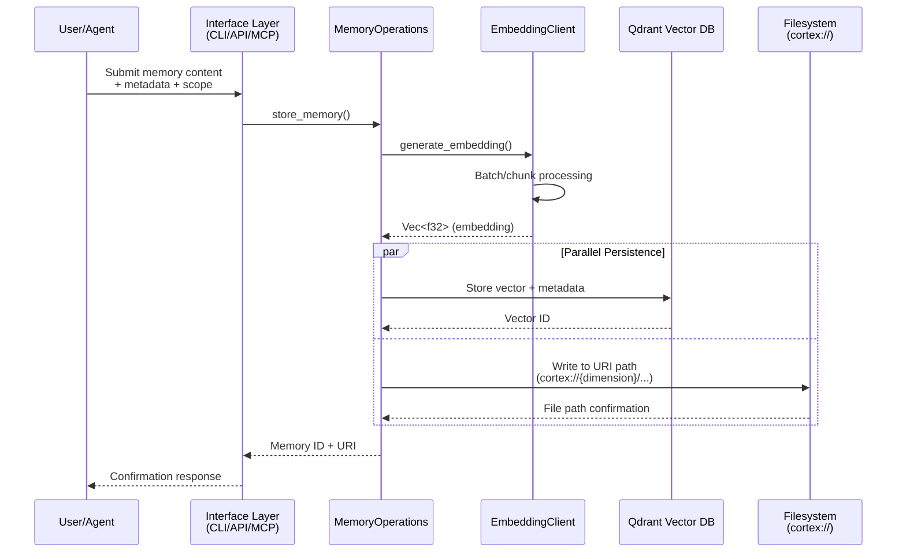
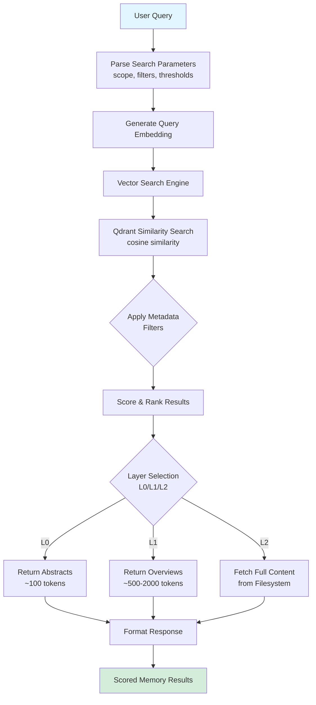
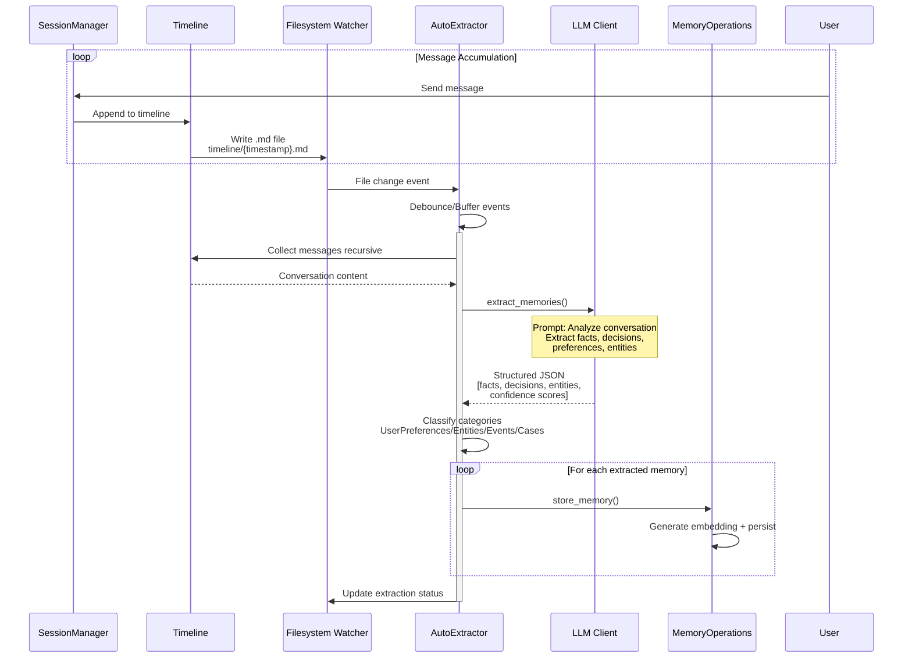
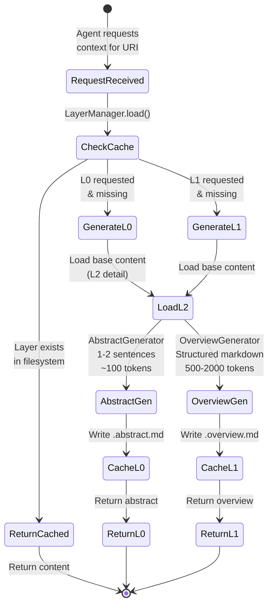
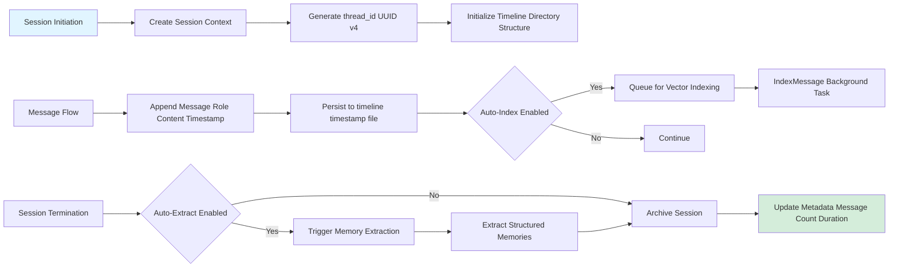
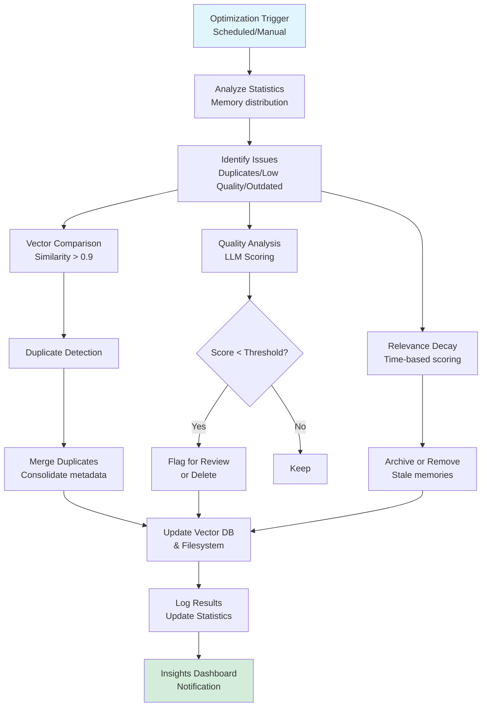

 Based on the comprehensive research analysis of the Cortex-Mem system, here is the detailed Core Workflows documentation:

---

# Core Workflows

**Document Version**: 1.0  
**Generation Timestamp**: 2026-02-17 16:34:09 (UTC)  
**System**: Cortex-Mem Memory Management Infrastructure  
**Scope**: End-to-end workflow analysis covering CLI, API, MCP, and Web Interfaces

---

## 1. Workflow Overview

### 1.1 System Positioning and Value Proposition

Cortex-Mem implements a comprehensive memory management infrastructure for AI agents, solving the fundamental context window limitation problem through persistent semantic storage. The system operates as a multi-interface memory layer supporting:

- **Multi-dimensional Organization**: User, Agent, and Session scopes with hierarchical categorization
- **Tiered Abstraction**: Progressive context loading via L0 (Abstract), L1 (Overview), and L2 (Detail) layers
- **Semantic Retrieval**: Vector-based similarity search using embeddings for relevance-based memory recall
- **Automated Extraction**: LLM-powered content analysis for automatic memory generation from conversations

### 1.2 Core Execution Paths

The system executes along three primary pathways:

1. **Ingestion Path**: Content → Embedding Generation → Vector Storage (Qdrant) + Filesystem Persistence
2. **Retrieval Path**: Query → Vectorization → Similarity Search → Layered Content Retrieval
3. **Processing Path**: Session Monitoring → Extraction Trigger → LLM Analysis → Structured Memory Generation

### 1.3 Process Coordination Architecture

The workflow architecture follows a **Command Query Responsibility Segregation (CQRS)** pattern with event-driven automation:

- **Synchronous Operations**: Memory CRUD, immediate search, session management
- **Asynchronous Pipelines**: Auto-indexing, memory extraction, optimization tasks
- **Cross-Cutting Concerns**: Multi-tenancy isolation via `tenant_id`, configuration management, error propagation using `anyhow::Result`

### 1.4 Key Process Nodes

| Node | Responsibility | Modules Involved |
|------|---------------|------------------|
| **Interface Dispatch** | Protocol adaptation (CLI/HTTP/MCP) | `cortex-mem-cli`, `cortex-mem-service`, `cortex-mem-mcp` |
| **Memory Operations** | Core business logic orchestration | `cortex-mem-tools::operations` |
| **Embedding Generation** | Text vectorization | `cortex-mem-core::embedding::client` |
| **Vector Search** | Semantic similarity computation | `cortex-mem-core::search::vector_engine` |
| **Layer Management** | Tiered content generation | `cortex-mem-core::layers::manager` |
| **Session Management** | Conversation lifecycle | `cortex-mem-core::session` |
| **Automation** | Background processing | `cortex-mem-core::automation` |

---

## 2. Main Workflows

### 2.1 Memory Semantic Storage and Retrieval Flow

**Business Value**: Enables persistent memory storage with semantic search capabilities, allowing AI agents to recall information based on meaning rather than exact keyword matches.

#### 2.1.1 Storage Sub-flow



**Detailed Process Steps**:

1. **Request Reception** (`cortex-mem-cli/src/commands/`, `cortex-mem-service/src/handlers/`)
   - **Input**: Raw content, dimension (User/Agent/Session), category, metadata
   - **Validation**: URI scheme validation, tenant isolation check
   - **Transformation**: Construct `Memory` struct with generated ID and timestamps

2. **Embedding Generation** (`cortex-mem-core/src/embedding/client.rs`)
   - **Strategy**: Single text or batch processing (configurable batch size, default 10)
   - **API Integration**: OpenAI-compatible endpoint (`text-embedding-3-small`, 1536 dimensions)
   - **Error Handling**: Fallback to default dimensions if service unavailable
   - **Output**: High-dimensional vector representation

3. **Dual Persistence** (`cortex-mem-tools/src/operations.rs`)
   - **Vector Store**: Async write to Qdrant with payload metadata (user_id, agent_id, timestamps)
   - **Filesystem**: Synchronous write to markdown files using `cortex://` URI mapping
   - **Transaction Semantics**: Filesystem write succeeds before vector commit (eventual consistency)

4. **Confirmation** (`cortex-mem-core/src/types.rs`)
   - **Output**: Memory ID (UUID), canonical URI, creation timestamp
   - **Side Effects**: Auto-indexer notification (if enabled)

#### 2.1.2 Retrieval Sub-flow



**Execution Details**:

- **Vector Search** (`cortex-mem-core/src/search/vector_engine.rs`): Executes approximate nearest neighbor (ANN) search with configurable `top_k` (default 10) and `min_score` threshold (0.0-1.0)
- **Metadata Filtering**: Pre-filter by dimension, category, date ranges, importance scores
- **Layer Resolution**: Lazy loading pattern—L0/L1 generated on-demand if missing, cached to filesystem (`.abstract.md`, `.overview.md`)

### 2.2 Automated Memory Extraction Flow

**Business Value**: Transforms ephemeral conversation history into structured, searchable long-term memories without manual intervention.



**Process Implementation**:

1. **Trigger Mechanisms**:
   - **File Watcher** (`automation/watcher.rs`): Monitors `cortex://session/{id}/timeline/` for new `.md` files
   - **Manual Trigger**: CLI command `cortex-mem session extract <session_id>`
   - **Scheduled**: Batch processing via `index_thread_with_progress()`

2. **LLM Analysis Phase** (`llm/prompts.rs`):
   - **Prompt Template**: `memory_extraction` with structured output schema
   - **Extraction Types** (`extractor_types.rs`): `ExtractedFact`, `UserPreference`, `EntityMemory`, `DecisionRecord`
   - **Confidence Scoring**: 0.0-1.0 threshold filtering (default >0.7)

3. **Classification & Routing**:
   - **User Profile**: `cortex://user/{id}/profile.json` (structured JSON)
   - **Agent Learning**: `cortex://agent/{id}/skills/` or `cases/`
   - **Session Archive**: `cortex://session/{id}/extracted/`

4. **Deduplication** (`automation/indexer.rs`):
   - Check content hash before indexing
   - Skip if similarity >0.95 with existing memories

### 2.3 Tiered Memory Layer Generation Flow

**Business Value**: Optimizes token usage by providing progressive disclosure of context—agents retrieve only the detail level necessary for current task.



**Technical Implementation**:

- **Lazy Generation**: Layers computed on-demand to avoid storage bloat
- **Caching Strategy**: Filesystem-based persistence with mtime checks
- **LLM Integration** (`layers/generator.rs`):
  - **L0 (Abstract)**: Single sentence or 2-3 sentence summary using `abstract_generation` prompt
  - **L1 (Overview)**: Structured markdown with Summary, Core Topics, Key Points, Entities sections
- **Fallback Chain**: If L2 missing → error; If L1 generation fails → return L2; If L0 fails → return L1

### 2.4 Session Lifecycle Management Flow

**Business Value**: Maintains conversational continuity across interactions, enabling context-aware AI responses and post-session analysis.



**State Management**:

- **Session State**: In-memory `SessionManager` with `Arc<Mutex<Session>>` for thread safety
- **Persistence Format**: Markdown with YAML frontmatter for metadata
- **Indexing Strategy**: Async batch indexing (default batch size 10) via `AutoIndexer.index_thread_with_progress()`

### 2.5 Memory Optimization and Maintenance Flow

**Business Value**: Ensures memory quality and storage efficiency through automated deduplication, quality scoring, and reorganization.



**Optimization Strategies**:

- **Deduplication**: Vector similarity comparison using Qdrant scroll API
- **Quality Scoring**: LLM-based importance assessment (0-100 scale)
- **Merge Logic**: Preserve highest quality version, merge metadata tags
- **Dry-Run Mode**: Analysis without mutation (`analyzeOptimization` endpoint)

---

## 3. Flow Coordination and Control

### 3.1 Multi-Module Coordination Mechanisms

**Dependency Injection Pattern**:
The system uses trait-based abstraction for loose coupling:

```rust
// Core abstraction enabling testability and provider swapping
pub trait LLMClient: Send + Sync { ... }
pub trait VectorStore: Send + Sync { ... }
pub trait EmbeddingClient: Send + Sync { ... }
```

**Shared State Architecture**:
- **Global State**: `Arc<AppState>` or `Arc<MemoryOperations>` shared across async handlers
- **Tenant Isolation**: Each request scoped to `tenant_id` (derived from CLI arg `--tenant` or API header)
- **Configuration Cascade**: CLI args → Environment Variables → Config File (`config.toml`) → Defaults

### 3.2 State Management and Synchronization

**Concurrency Control**:

1. **Filesystem Operations** (`cortex-mem-core/src/filesystem/operations.rs`):
   - Tokio async I/O with `tokio::fs`
   - Directory locking via file-based semaphores for write operations
   - Atomic writes: Write to temp file → rename for durability

2. **Vector Store Consistency**:
   - Eventual consistency model between Filesystem (source of truth) and Qdrant (search index)
   - Reconciliation via `SyncManager` on startup
   - Deduplication checks prevent double indexing

3. **Session State**:
   - In-memory `HashMap<thread_id, Session>` with `RwLock`
   - Periodic flush to filesystem (every N messages or on session close)
   - Crash recovery via timeline file scanning on restart

**Data Passing Patterns**:

| Flow | Mechanism | Serialization |
|------|-----------|---------------|
| CLI → Core | Function calls | Rust types |
| HTTP API | Axum handlers | JSON (serde) |
| MCP Protocol | JSON-RPC | MCP schema types |
| Web UI → API | HTTP fetch | JSON via Elysia |
| Background Tasks | Tokio mpsc channels | Internal enums |

### 3.3 Execution Control and Scheduling

**Async Runtime**:
- Tokio multi-threaded scheduler (`#[tokio::main]`)
- CPU-bound tasks (LLM calls, embedding generation) spawn on `tokio::task::spawn_blocking`
- I/O bound tasks (filesystem, HTTP) use async/await

**Background Job Management**:
- **AutoIndexer**: Configurable batch size (default 10), progress callbacks
- **AutoExtractor**: Debounced filesystem events (500ms quiet period)
- **Optimization Jobs**: Singleton execution prevents concurrent optimizations

**Resource Limits**:
- **Embedding Rate Limiting**: Configurable `requests_per_minute` in `EmbeddingConfig`
- **LLM Token Budgets**: `max_tokens` enforcement per request
- **Memory Pressure**: LRU cache for layer generation (configurable size)

---

## 4. Exception Handling and Recovery

### 4.1 Error Taxonomy and Detection

The system implements a hierarchical error system (`cortex-mem-core/src/error.rs`):

```rust
pub enum Error {
    #[error("Invalid URI: {0}")]
    InvalidUri(String),
    #[error("Dimension not found: {0}")]
    DimensionNotFound(String),
    #[error("Memory not found: {0}")]
    MemoryNotFound(String),
    #[error("IO error: {0}")]
    Io(#[from] std::io::Error),
    #[error("Serialization error: {0}")]
    Serialization(#[from] serde_json::Error),
    #[error("LLM error: {0}")]
    LLM(String),
    #[error("Embedding error: {0}")]
    Embedding(String),
    #[error("Config error: {0}")]
    Config(String),
    #[error("Vector store error: {0}")]
    VectorStore(String),
    #[error("Other: {0}")]
    Other(String),
}
```

**Error Propagation Strategy**:
- **Library Layer**: Returns structured `Result<T, Error>` using `thiserror`
- **Application Layer**: Converts to `anyhow::Result` with context (`with_context()`)
- **API Layer**: Maps to HTTP status codes (404, 500, 503)
- **CLI Layer**: Pretty-print with `colored` crate, exit codes (0=success, 1=error)

### 4.2 Recovery Mechanisms

**Graceful Degradation**:

1. **LLM Service Unavailable**:
   - **Detection**: Health check timeout (5s primary, 3s secondary)
   - **Fallback**: Return cached layers only, skip extraction
   - **User Notification**: Warning in logs and API response headers

2. **Vector Store Connection Failure**:
   - **Retry**: Exponential backoff (3 attempts)
   - **Fallback**: Filesystem-only mode (search disabled, storage enabled)
   - **Recovery**: Auto-reconnect on next search attempt

3. **Embedding Service Timeout**:
   - **Circuit Breaker**: Open after 5 consecutive failures
   - **Fallback**: Skip indexing, store without vectors (searchable by metadata only)
   - **Monitoring**: Insights dashboard alerts

**Data Integrity Recovery**:

- **Orphaned Files**: Optimization job scans for files without vector entries, re-indexes or deletes
- **Corrupted Sessions**: Timeline parser skips malformed markdown files, logs error, continues processing
- **Partial Writes**: Atomic rename pattern ensures no half-written files; temp file cleanup on restart

### 4.3 Fault Tolerance Design

**Crash Recovery**:
- **Write-Ahead Pattern**: Metadata updated before content write
- **Journal Files**: Session operations logged to `.journal` files for replay
- **Consistency Check**: Startup validation compares filesystem vs. vector store counts

**Redundancy**:
- **Multi-Interface Availability**: If MCP fails, CLI and HTTP API remain operational
- **Layer Fallback**: L2 always available even if L0/L1 generation fails
- **Config Redundancy**: Environment variable overrides for critical settings

---

## 5. Key Process Implementation

### 5.1 Core Algorithm: Vector Search Pipeline

**Implementation** (`cortex-mem-core/src/search/vector_engine.rs`):

1. **Query Preprocessing**:
   - Text normalization (lowercase, trim)
   - Optional query expansion via LLM (synonym generation)

2. **Vectorization**:
   - API call to embedding service (`text-embedding-3-small` or custom)
   - Client-side caching of frequent queries (LRU, 1000 entries)

3. **Search Execution**:
   ```rust
   // Pseudocode representation of actual implementation
   let results = vector_store.search(
       collection_name,
       query_vector,
       filter_conditions,  // Metadata pre-filtering
       limit: top_k,
       score_threshold: min_score
   ).await?;
   ```

4. **Post-Processing**:
   - Reranking by recency (time-decay factor)
   - Deduplication by content hash
   - Layer resolution (fetch L0/L1/L2 based on context window budget)

**Performance Optimization**:
- **Batch Search**: Support for multiple query vectors in single request
- **HNSW Indexing**: Qdrant configured with HNSW parameters (ef=128, m=16) for approximate search
- **Metadata Filtering**: Pre-filter at database level to reduce vector comparison scope

### 5.2 Data Processing Pipeline: Batch Indexing

**AutoIndexer** (`cortex-mem-core/src/automation/indexer.rs`):

```rust
pub struct IndexerConfig {
    pub enabled: bool,
    pub batch_size: usize,        // Default: 10
    pub async_mode: bool,         // true = background, false = blocking
}
```

**Processing Stages**:
1. **Collection**: Recursive filesystem scan (`collect_messages_recursive`)
2. **Deduplication**: Hash-based filtering (SHA256 of content)
3. **Batch Embedding**: Chunked API calls (respects rate limits)
4. **Bulk Insert**: Qdrant batch upload for efficiency
5. **Progress Reporting**: Callback-based progress for UI updates

**Concurrency Model**:
- **Producer-Consumer**: Filesystem walker produces paths, embedding workers consume
- **Backpressure**: Bounded channel (100 items) prevents memory exhaustion
- **Cancellation**: Cooperative cancellation via `tokio::select!` with shutdown signal

### 5.3 Business Rule Execution: Multi-Tenancy Isolation

**Tenant Isolation Strategy**:

- **Data Isolation**: Physical directory separation (`data/{tenant_id}/`)
- **Vector Isolation**: Qdrant collection per tenant or metadata filtering with `tenant_id` field
- **Configuration Isolation**: Separate `Config` instances per tenant in multi-tenant deployments

**Implementation Pattern**:
```rust
// From cortex-mem-tools operations
pub struct MemoryOperations {
    tenant_id: String,
    base_path: PathBuf,
    vector_store: Arc<dyn VectorStore>,
    // ...
}

// All operations scoped to tenant_id
pub async fn list(&self, uri: &str) -> Result<Vec<FileEntry>> {
    let path = self.to_tenant_path(uri)?;  // Prepends tenant directory
    // ...
}
```

### 5.4 Technical Implementation: Layer Generation

**AbstractGenerator** (L0):
- **Algorithm**: Extractive summarization via LLM with strict token limit (max 100 tokens)
- **Prompt Engineering**: Zero-shot prompting with format examples
- **Caching**: Filesystem cache key based on content hash

**OverviewGenerator** (L1):
- **Structure Enforcement**: JSON schema validation for structured output
- **Sections**: Summary (20%), Core Topics (30%), Key Points (30%), Entities (20%)
- **Hierarchical Aggregation**: For thread summaries, aggregates multiple L0 abstracts

**Performance Characteristics**:
- **Latency**: L0 generation ~500ms, L1 generation ~2-3s (depending on content size)
- **Throughput**: 10-20 layer generations per minute per LLM connection
- **Cache Hit Ratio**: Typically 80%+ for stable conversation histories

### 5.5 Optimization Strategies

**Resource Management**:
- **Connection Pooling**: HTTP client reuse for embedding/LLM APIs (`reqwest::Client` with `Arc`)
- **Memory Mapping**: Large file reads use `tokio::fs` with buffered streams (8KB chunks)
- **Vector Compression**: Qdrant scalar quantization reduces memory footprint by 4x

**Concurrent Processing**:
- **Parallel Extraction**: Multiple session extractions run concurrently (limit: CPU cores * 2)
- **Pipeline Parallelism**: Indexing pipes: Read → Parse → Embed → Store execute in streaming fashion
- **Lock-Free Structures**: Use of `dashmap` for concurrent session caches

**Caching Strategy**:
- **Layer Cache**: Infinite retention (small text files), filesystem-based
- **Embedding Cache**: Redis-compatible external cache optional (TTL: 24h)
- **Config Cache**: TOML parsed once at startup, hot-reload on SIGTERM

---

## Appendix: Workflow Interactions Summary

| Workflow | Input | Output | Trigger | Async/Sync |
|----------|-------|--------|---------|------------|
| Memory Storage | Content + Metadata | URI + ID | User/API/MCP | Sync (with async indexing) |
| Semantic Search | Query + Filters | Scored Results | User Request | Sync |
| Auto Extraction | Session Timeline | Memory Records | File Watcher | Async |
| Layer Generation | URI + Level | Formatted Content | Agent Request | Sync (with cache write) |
| Session Management | Messages | Session State | Conversation | Mixed |
| Optimization | Strategy Config | Statistics | Schedule/Manual | Async |

---

**Document Maintenance**: This workflow documentation should be updated when:
- New interface types are added (e.g., WebSocket, gRPC)
- Core algorithm changes (vector search strategy, embedding models)
- Business logic modifications (new memory categories, extraction rules)
- Performance characteristics change significantly (latency/throughput)
