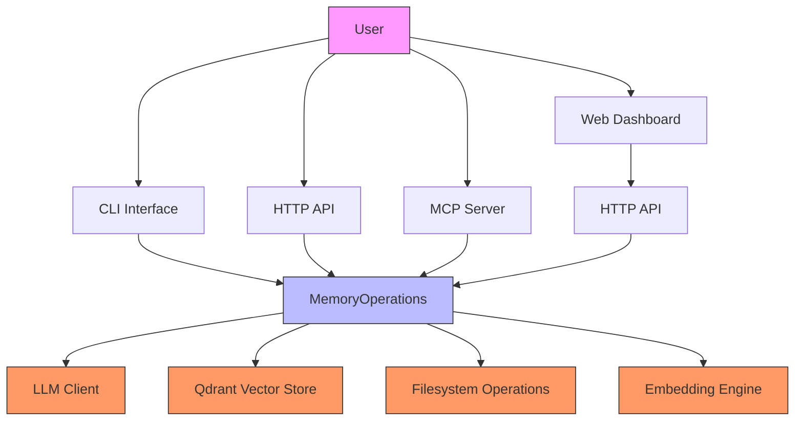
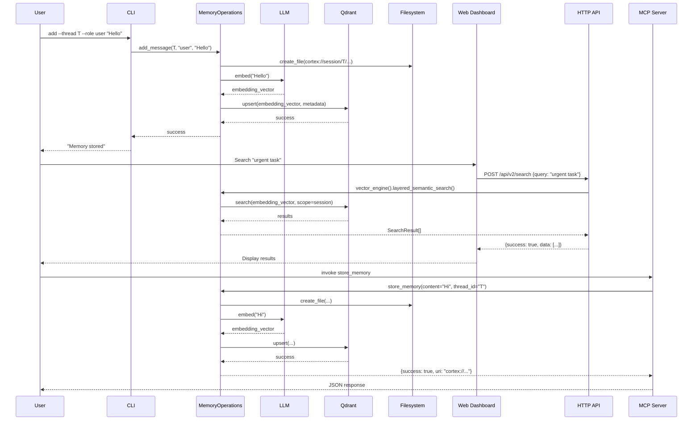

 **Technical Documentation: Application Interface Domain**
**Project:** Cortex-Mem  
**Version:** 1.0  
**Last Updated:** 2026-02-19 04:08:52 (UTC)

---

## 1. Overview

The **Application Interface Domain** serves as the user-facing gateway to the Cortex-Mem memory management system. It provides a unified abstraction layer that exposes core memory operations through four distinct interaction patterns: command-line interface (CLI), HTTP REST API, Model Context Protocol (MCP) server, and web-based dashboard.

This domain implements the **Adapter Pattern**, wrapping the central `MemoryOperations` service to accommodate diverse consumption models while ensuring consistent business logic, configuration management, and multi-tenant isolation across all entry points.

### 1.1 Key Responsibilities
- **Interface Adaptation**: Translating protocol-specific inputs (CLI arguments, JSON payloads, MCP tool calls) into domain operations
- **Dependency Injection**: Initializing and wiring core services (LLM, Qdrant, Filesystem) into interface-specific contexts
- **Protocol Normalization**: Standardizing URI handling (removing `cortex://` prefixes), input validation, and response formatting
- **Tenant Context Propagation**: Extracting and propagating tenant identifiers across all interfaces for data isolation

---

## 2. Architecture

### 2.1 System Context



### 2.2 Component Structure

The domain is implemented across four specialized projects:

| Interface | Technology Stack | Primary Purpose | Entry Point |
|-----------|-----------------|-----------------|-------------|
| **CLI** | Rust (clap, tokio) | Direct memory management via shell commands | `/cortex-mem-cli/src/main.rs` |
| **HTTP API** | Rust (Axum) | RESTful endpoints for web/integration clients | `/cortex-mem-service/src/main.rs` |
| **MCP Server** | Rust (rmcp) | AI assistant/IDE integration via stdio | `/cortex-mem-mcp/src/main.rs` |
| **Web Dashboard** | TypeScript (Svelte) | Visualization and management UI | `/cortex-mem-insights/src/main.ts` |

---

## 3. Interface Specifications

### 3.1 CLI Interface (`cortex-mem-cli`)

**Implementation Pattern**: Command Pattern with async execution  
**Key Dependencies**: `clap` (argument parsing), `tokio` (async runtime), `cortex_mem_tools` (operations)

**Architecture**:
- Command handlers located in `/cortex-mem-cli/src/commands/`
- Direct function calls to `MemoryOperations` (synchronous-like async execution)
- Configuration loaded via `config.toml` with environment variable overrides

**Supported Operations**:
```rust
// Core commands implemented
commands::search::execute    // Semantic search with filters
commands::session::list      // Timeline enumeration
commands::add                // Memory insertion
commands::delete             // URI-based deletion
commands::stats              // Storage metrics
```

**Tenant Handling**: CLI accepts `--tenant <TENANT_ID>` flag, propagating the identifier through the `MemoryOperations` initialization chain.

### 3.2 HTTP API Service (`cortex-mem-service`)

**Implementation Pattern**: Layered Architecture with Dependency Injection  
**Framework**: Axum (Rust web framework)  
**Base Path**: `/api/v2`

**Architecture Components**:
- **Routes** (`/cortex-mem-service/src/routes/`): URL routing definitions
- **Handlers** (`/cortex-mem-service/src/handlers/`): Request processing logic
- **AppState**: Centralized dependency container holding `MemoryOperations` instance

**Key Implementation Details**:
```rust
// AppState struct serves as dependency injection container
pub struct AppState {
    pub memory_ops: Arc<MemoryOperations>,
    pub config: Config,
}

// Handler injection pattern
async fn search_handler(
    State(state): State<AppState>,
    Json(payload): Json<SearchRequest>,
) -> Result<Json<ApiResponse>, AppError>
```

**Endpoint Mapping**:
- `POST /api/v2/search` → `vector_engine().layered_semantic_search()`
- `GET /api/v2/tenants/stats` → Storage metrics aggregation
- `GET /api/v2/filesystem/list` → URI browsing
- `POST /api/v2/session/message` → Conversation logging

**Tenant Extraction**: HTTP Header `X-Tenant-ID` or URL path parameter, injected into `MemoryOperations` via request extensions.

### 3.3 MCP Server (`cortex-mem-mcp`)

**Implementation Pattern**: Tool Router Pattern  
**Protocol**: Model Context Protocol (MCP) over stdio transport  
**Framework**: `rmcp` (Rust MCP implementation)

**Architecture**:
- **Service Definition** (`/cortex-mem-mcp/src/service.rs`): `MemoryMcpService` struct implementing the MCP protocol
- **Tool Registration**: Uses `tool_router!` macro to expose `MemoryOperations` as standardized tools

**Exposed Tools**:
```rust
tool_router! {
    store_memory(content: String, thread_id: String) -> MemoryResult,
    query_memory(query: String, scope: String, limit: i32) -> SearchResult,
    list_memories(uri_prefix: String) -> Vec<MemoryEntry>,
    delete_memory(uri: String) -> DeletionResult,
}
```

**Input Normalization**: The MCP layer automatically strips `cortex://` prefixes from URIs before delegating to core operations, ensuring consistency with other interfaces.

**Integration Flow**:
1. AI Assistant (Client) sends JSON-RPC request via stdio
2. `MemoryMcpService` routes to appropriate tool handler
3. Handler invokes `MemoryOperations` methods
4. Results serialized to MCP-compliant JSON responses

### 3.4 Web Dashboard (`cortex-mem-insights`)

**Implementation Pattern**: Single Page Application (SPA) with API Client  
**Framework**: Svelte ( frontend ), TypeScript  
**Communication**: Fetch-based HTTP client to `/api/v2` endpoints

**Architecture**:
- **Pages** (`/cortex-mem-insights/src/lib/pages/`): Route-specific components (Dashboard, Memories, Search)
- **API Client** (`/cortex-mem-insights/src/lib/api.ts`): `ApiClient` class wrapping HTTP calls
- **State Management** (`/cortex-mem-insights/src/lib/stores/tenant.ts`): Reactive tenant selection store

**Key Components**:
```typescript
// ApiClient provides type-safe HTTP abstraction
class ApiClient {
    async search(query: string, scope: string): Promise<SearchResult[]>;
    async getTenantStats(): Promise<TenantMetrics>;
    async listMemories(uri: string): Promise<MemoryList>;
}

// Tenant-aware request headers
headers: {
    'X-Tenant-ID': currentTenant.id,
    'Content-Type': 'application/json'
}
```

**UI Flow**:
- Tenant selection triggers global state update
- All subsequent API calls include tenant context
- Results rendered via Svelte reactive components with real-time updates

---

## 4. Integration Patterns

### 4.1 Shared Core Dependency

All interfaces maintain a **Singleton-per-Process** instance of `MemoryOperations`, initialized with identical configurations:

```rust
// Common initialization pattern across CLI, HTTP, and MCP
let memory_ops = MemoryOperations::new(
    llm_client,
    qdrant_store,
    filesystem,
    embedding_client,
    config.automation,
)?;
```

This ensures:
- Consistent vector dimensions and LLM models across interfaces
- Unified filesystem path resolution (`cortex://` URI handling)
- Shared connection pooling for Qdrant and LLM APIs

### 4.2 Request Flow Sequence



### 4.3 Multi-Tenant Isolation

All interfaces implement consistent tenant extraction strategies:

| Interface | Tenant Source | Propagation Mechanism |
|-----------|--------------|---------------------|
| CLI | `--tenant` argument | Command context → MemoryOperations constructor |
| HTTP API | Header `X-Tenant-ID` | Axum State → Qdrant collection suffixing |
| MCP | Initialization metadata | Session context → Filesystem path scoping |
| Web Dashboard | UI selector + API header | Global store → HTTP headers |

**Implementation Detail**: The `QdrantConfig::with_tenant_id()` method dynamically suffixes collection names (e.g., `cortex-mem-{tenant_id}`), while `CortexFilesystem` scopes directories to `/data/tenants/{tenant_id}/`.

---

## 5. Error Handling and Observability

### 5.1 Error Handling Strategy

**Rust Components** (CLI, HTTP, MCP):
- **Library**: `anyhow` for error context propagation
- **HTTP Specific**: `AppError` type converting domain errors to HTTP status codes (4xx/5xx)
- **MCP Specific**: Protocol-compliant error codes with descriptive messages

**TypeScript Components** (Web Dashboard):
- **ApiResponse Wrapper**: Standardized envelope `{success: boolean, data: T, error?: string}`
- **Frontend Error Boundaries**: Svelte error handling for API failures

### 5.2 Observability

- **Tracing**: `tracing` crate integrated across all Rust binaries for structured logging
- **Request IDs**: HTTP API generates UUIDs for request tracing through the stack
- **Metrics**: Endpoint latency and error rates exposed via `/api/v2/health` and `/api/v2/stats`

---

## 6. Configuration and Deployment

### 6.1 Configuration Loading

All interfaces load configuration via `cortex-mem-config` with the following precedence:
1. Environment variables (e.g., `CORTEX_LLM_API_KEY`)
2. TOML configuration file (`config.toml`)
3. Sensible defaults (embedded in binary)

**Required Configuration**:
```toml
[llm]
model = "gpt-4"
api_key = "${OPENAI_API_KEY}"

[qdrant]
url = "http://localhost:6334"
collection = "cortex-mem"

[embeddings]
endpoint = "https://api.openai.com/v1/embeddings"
dimensions = 1536
```

### 6.2 Deployment Patterns

**Single-Node Deployment**:
```bash
# Terminal 1: Start API server
cargo run --bin cortex-mem-service -- --port 3000

# Terminal 2: Start MCP server (stdio)
cargo run --bin cortex-mem-mcp

# Terminal 3: CLI operations
cortex-mem-cli search --query "project requirements" --tenant acme-corp
```

**Containerized Deployment**:
- HTTP Service: Exposes port 3000, requires Qdrant and LLM API connectivity
- MCP Server: Runs as sidecar container with stdio bridge
- Web Dashboard: Static files served via nginx or embedded in HTTP service

---

## 7. Development Guidelines

### 7.1 Adding New Interfaces

When implementing new interaction patterns (e.g., gRPC, WebSocket):
1. Create new crate in workspace root
2. Import `cortex-mem-tools` for `MemoryOperations` access
3. Implement configuration loading via `cortex-mem-config`
4. Ensure tenant context extraction at entry point
5. Normalize inputs (URI prefix stripping, validation) before calling core operations

### 7.2 Interface Consistency Requirements

All interfaces must:
- Support `--tenant` or equivalent tenant scoping mechanism
- Return normalized URI formats (`cortex://dimension/id`)
- Handle L0/L1/L2 layer abstractions transparently (delegated to core)
- Implement identical retry logic for LLM/Vector store failures

### 7.3 Testing Strategy

- **Integration Tests**: Use HTTP API as primary test surface for end-to-end flows
- **CLI Tests**: Shell-based testing for command parsing and filesystem interactions
- **MCP Tests**: JSON-RPC fixture testing via stdio mocking
- **Web UI**: Component testing with mocked `ApiClient`

---

## 8. Summary

The **Application Interface Domain** successfully abstracts the complexity of the Cortex-Mem core engine behind four purpose-built interfaces. By maintaining strict separation between protocol handling (HTTP, MCP, CLI) and business logic, the architecture enables:

- **Protocol Flexibility**: New interfaces can be added without modifying core domains
- **Operational Consistency**: Identical behavior across CLI scripts, web applications, and AI assistants
- **Scalable Isolation**: Multi-tenant support enforced at the boundary of every interface
- **Maintainability**: Shared `MemoryOperations` facade reduces code duplication while ensuring uniform application of business rules

The domain serves as the critical bridge between external consumers and the rich memory management capabilities of the Cortex-Mem platform, adhering to the architectural principle of **Ports and Adapters** (Hexagonal Architecture).