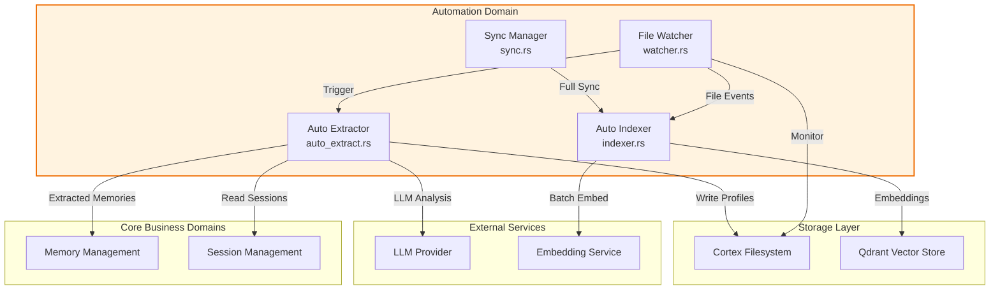
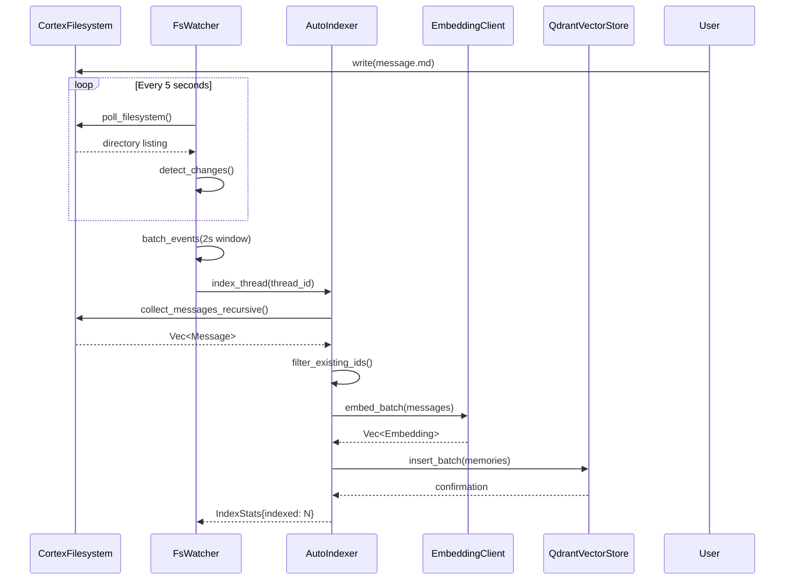
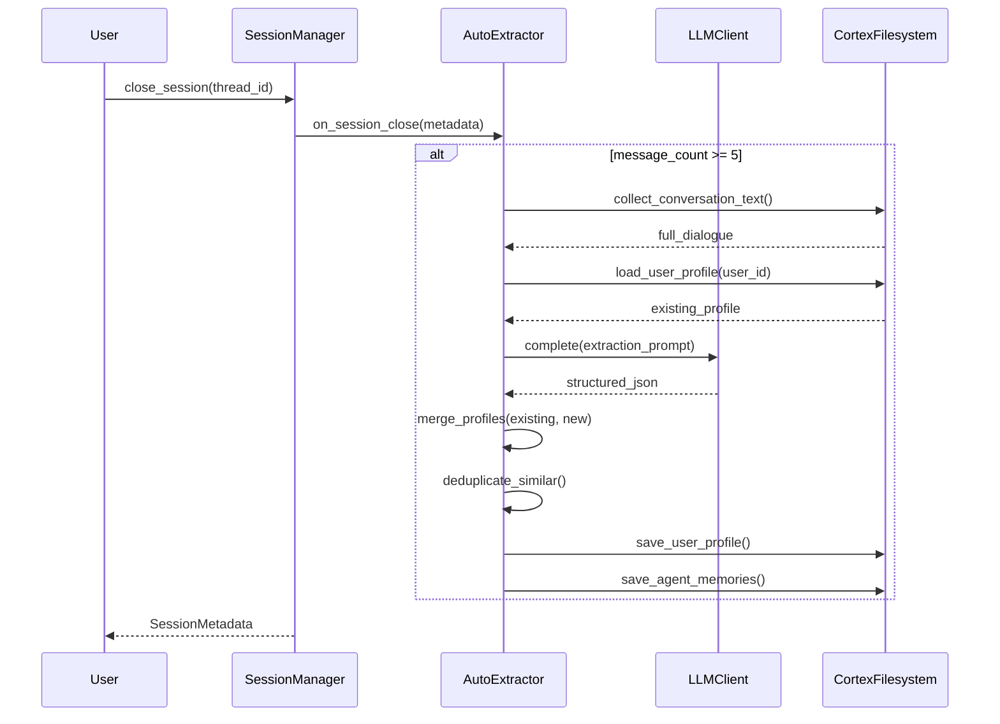
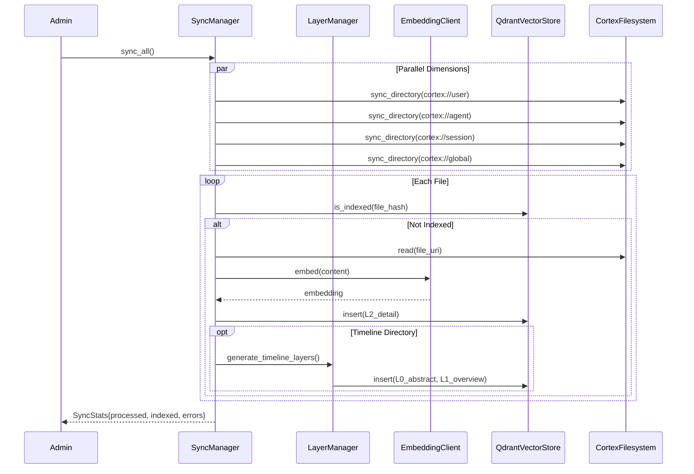

**Automation Domain Technical Documentation**

**Generation Time:** 2026-02-17 16:44:24 (UTC)  
**Timestamp:** 1771346664

---

## 1. Overview

The **Automation Domain** is an infrastructure-level component within the Cortex-Mem ecosystem that provides background processing capabilities for autonomous memory management. Operating as an event-driven, asynchronous processing layer, this domain ensures consistency between the filesystem-based persistence layer and the vector database (Qdrant), while enabling intelligent content extraction through LLM integration.

The domain implements a **four-subsystem architecture** designed for high-throughput, fault-tolerant background operations:

- **File Watcher & Sync** (`FsWatcher`): Monitors filesystem changes via asynchronous polling
- **Auto Indexer** (`AutoIndexer`): Handles batch processing of memory embeddings with deduplication
- **Sync Manager** (`SyncManager`): Orchestrates tiered (L0/L1/L2) vector indexing across all memory dimensions
- **Auto Extractor** (`AutoExtractor`): Performs LLM-driven structured information extraction from conversation sessions

### 1.1 Domain Position



---

## 2. Architectural Design

The Automation Domain employs an **Event-Driven Architecture (EDA)** combined with **Layered Processing Patterns**. All subsystems operate asynchronously using Tokio's runtime, communicating through unbounded MPSC (Multi-Producer Single-Consumer) channels to ensure non-blocking I/O operations.

### 2.1 Core Design Principles

- **Event-Driven Reactivity**: Filesystem changes trigger downstream processing without manual intervention
- **Batch Processing**: Aggregation of events within time windows (default 2s) to optimize embedding API usage
- **Idempotency**: Deduplication mechanisms prevent redundant vector indexing
- **Tiered Abstraction**: Support for L0 (Abstract), L1 (Overview), and L2 (Detail) layer generation during synchronization
- **Fault Isolation**: Subsystems operate independently; failure in extraction does not block indexing

### 2.2 Module Dependencies

```rust
// Core internal dependencies
cortex-mem-core/src/automation/mod.rs          // Public API exports
cortex-mem-core/src/automation/watcher.rs      // FsWatcher, FsEvent, WatcherConfig
cortex-mem-core/src/automation/indexer.rs      // AutoIndexer, IndexStats, IndexerConfig
cortex-mem-core/src/automation/sync.rs         // SyncManager, SyncConfig, SyncStats
cortex-mem-core/src/automation/auto_extract.rs // AutoExtractor, UserProfile, AutoExtractConfig
cortex-mem-core/src/config.rs                  // Configuration structures
```

**External Dependencies:**
- **CortexFilesystem**: Virtual filesystem abstraction (`cortex://` URI scheme)
- **QdrantVectorStore**: Vector database client for embedding storage
- **EmbeddingClient**: OpenAI-compatible embedding generation (batch support)
- **LLMClient**: OpenAI-compatible completion API for content extraction
- **SessionManager**: Conversation lifecycle management hooks

---

## 3. Core Subsystems

### 3.1 File Watcher Subsystem (`FsWatcher`)

The File Watcher implements an asynchronous polling mechanism to monitor the `cortex://` virtual filesystem for changes, specifically tracking session timeline directories.

#### Key Components

| Component | Responsibility | Implementation Detail |
|-----------|---------------|----------------------|
| `FsWatcher` | Main monitoring orchestrator | Maintains `HashMap<String, Vec<String>>` state snapshots of directory contents |
| `FsEvent` | Event enumeration | `MessageAdded { thread_id, message_id }`, `MessageUpdated`, `ThreadDeleted` |
| `WatcherConfig` | Behavior tuning | Polling interval (default 5s), batch delay (default 2s), recursive depth |

#### Technical Implementation

```rust
// Async runtime integration using Tokio
tokio::select! {
    // Event reception from filesystem scan
    event = rx.recv() => { /* queue for batching */ }
    // Batch processing trigger
    _ = batch_delay => { /* flush event buffer */ }
}

// Event dispatch via unbounded channel
mpsc::UnboundedSender<FsEvent>
```

**Processing Logic:**
1. Recursively scans `cortex://session/{thread_id}/timeline` directories
2. Compares current state against cached snapshot to detect additions/modifications
3. Batches events within 2-second windows to reduce redundant indexing operations
4. Dispatches to `AutoIndexer` for embedding generation or `AutoExtractor` when sessions close

### 3.2 Auto Indexer Subsystem (`AutoIndexer`)

Handles the conversion of Markdown-formatted session messages into vector embeddings and their storage in Qdrant. Implements sophisticated deduplication and batch optimization strategies.

#### Core Methods

| Method | Purpose | Optimization |
|--------|---------|--------------|
| `index_message()` | Single message indexing | Immediate embedding generation |
| `index_thread_with_progress()` | Batch thread indexing | Progress callbacks for UI feedback |
| `collect_messages_recursive()` | Timeline traversal | Recursive Markdown parsing |
| `embed_batch()` | Vector generation | Default batch size: 10 items |

#### Deduplication Strategy

Before indexing, the system queries existing vector IDs using `get_indexed_message_ids()` to filter out already-processed content, preventing storage bloat and search noise.

**Performance Characteristics:**
- **Throughput**: Batch embedding reduces API calls by 10x compared to individual processing
- **Concurrency**: Async I/O allows parallel filesystem reads and embedding generation
- **Memory**: Streaming processing prevents loading entire threads into memory

### 3.3 Sync Manager Subsystem (`SyncManager`)

Implements a **full synchronization engine** that ensures eventual consistency between filesystem state and vector database indexes. Employs a **three-tier indexing strategy** (L0/L1/L2) for progressive context loading.

#### Tiered Indexing Architecture

| Layer | Content Type | Generation Method | Use Case |
|-------|--------------|-------------------|----------|
| **L2 (Detail)** | Original Markdown content | Direct file read | Full context retrieval |
| **L1 (Overview)** | Structured directory summary | LLM summarization | Quick navigation |
| **L0 (Abstract)** | 1-2 sentence condensation | LLM abstraction | Relevance filtering |

#### Synchronization Dimensions

The `sync_all()` operation processes four distinct memory scopes:
1. **Users**: `cortex://user/{id}/**` - User profiles and preferences
2. **Agents**: `cortex://agent/{id}/**` - Agent configuration and memories  
3. **Threads**: `cortex://session/{id}/**` - Conversation histories
4. **Global**: `cortex://global/**` - Shared knowledge bases

**Incremental Sync Logic:**
- Calculates content hash via `uri_to_vector_id()` to detect modifications
- Skips unchanged files to minimize embedding API costs
- Recursive directory traversal with configurable depth limits

### 3.4 Auto Extractor Subsystem (`AutoExtractor`)

Provides **LLM-driven structured information extraction** from conversation sessions. Activates when sessions close, analyzing dialogue to extract persistent facts, preferences, and entities.

#### Five-Dimensional Classification

Extracted information is categorized into:
1. **PersonalInfo**: Demographics, identifiers
2. **WorkHistory**: Professional background, projects
3. **Preferences**: Likes, dislikes, communication style
4. **Relationships**: Connections between entities
5. **Goals**: Objectives, intentions, upcoming events

#### Extraction Pipeline

```rust
1. collect_conversation_text()     // Recursive text aggregation
2. load_user_profile()             // Retrieve existing profile
3. extract_user_info_structured()  // LLM JSON extraction
4. filter_duplicate_info()         // Longest common substring analysis
5. merge_user_profiles()           // Importance*confidence scoring
6. limit_profile_size()            // Top-10 retention per category
7. save_user_profile()             // Persist to cortex://user/
```

**Trigger Conditions:**
- Session closure event intercepted via `AutoSessionManager` wrapper
- Minimum message threshold: 5 messages (configurable via `min_message_count`)
- Extraction occurs asynchronously to prevent blocking session termination

---

## 4. Configuration Management

The Automation Domain utilizes strongly-typed configuration structures defined in `cortex-mem-core/src/config.rs` and exposed through `cortex-mem-config`.

### 4.1 Configuration Schema

```rust
// Indexing behavior
pub struct IndexerConfig {
    pub auto_index: bool,       // Enable automatic indexing on file changes
    pub batch_size: usize,      // Embedding batch size (default: 10)
    pub async_index: bool,      // Background vs. synchronous indexing
}

// Synchronization scope
pub struct SyncConfig {
    pub auto_index: bool,
    pub sync_agents: bool,      // Include agent dimensions
    pub sync_threads: bool,     // Include session threads
    pub sync_users: bool,       // Include user profiles
    pub sync_global: bool,      // Include global knowledge
}

// Extraction parameters
pub struct AutoExtractConfig {
    pub min_message_count: usize,   // Threshold for extraction trigger (default: 5)
    pub extract_on_close: bool,     // Auto-extract on session end
    pub save_user_memories: bool,   // Persist user profile updates
    pub save_agent_memories: bool,  // Persist agent learning
}

// File system monitoring
pub struct WatcherConfig {
    pub poll_interval_ms: u64,      // Filesystem scan frequency (default: 5000ms)
    pub batch_delay_ms: u64,        // Event aggregation window (default: 2000ms)
}
```

### 4.2 Configuration Flow

Configurations are loaded via TOML files (typically `config.toml`) and support environment variable overrides. The `AutomationConfig` struct aggregates all sub-configurations and is injected into subsystem constructors during system initialization.

---

## 5. Data Flows and Workflows

### 5.1 Workflow 1: Real-time Message Indexing

Triggered when new messages are written to session timelines during active conversations.



**Key Characteristics:**
- **Latency**: 2-7 seconds from write to index (depending on polling and batch windows)
- **Deduplication**: Vector IDs checked before embedding generation to conserve API credits
- **Error Handling**: Failed embeddings are logged and retried on next polling cycle

### 5.2 Workflow 2: Session-Close Memory Extraction

Activates when conversations end, performing deep analysis to extract long-term memories.



**Extraction Prompt Engineering:**
The LLM receives structured prompts requesting JSON output with confidence scores (0.0-1.0) and importance rankings (1-10) for each extracted fact, enabling downstream filtering and merging logic.

### 5.3 Workflow 3: Full System Synchronization

Administrative operation to rebuild vector indexes from filesystem state, ensuring consistency after configuration changes or data restoration.



**Tiered Generation Logic:**
For timeline directories, the SyncManager delegates to `LayerManager` to generate:
- **L2**: Original message content (vectorized)
- **L1**: Directory-level summary ("Conversation about project planning with 12 messages")
- **L0**: Semantic abstract ("User discussed Q3 roadmap priorities")

---

## 6. Integration Interfaces

### 6.1 Public API Surface

The Automation Domain exposes the following through `cortex-mem-core/src/automation/mod.rs`:

```rust
// Extraction capabilities
pub use auto_extract::{
    AutoExtractConfig,    // Configuration struct
    AutoExtractStats,     // Extraction metrics
    AutoExtractor,        // Main extraction engine
    AutoSessionManager    // Session manager wrapper
};

// Indexing capabilities  
pub use indexer::{
    AutoIndexer,          // Batch indexing engine
    IndexStats,           // Indexing metrics (count, errors, duration)
    IndexerConfig         // Indexing behavior configuration
};

// Synchronization capabilities
pub use sync::{
    SyncConfig,           // Scope configuration (users/agents/threads/global)
    SyncManager,          // Full sync orchestrator
    SyncStats             // Synchronization metrics
};

// Monitoring capabilities
pub use watcher::{
    FsEvent,              // Event enum variants
    FsWatcher,            // Filesystem monitor
    WatcherConfig         // Polling and batching parameters
};
```

### 6.2 Inter-Domain Communication Patterns

**Event-Driven Coupling (Watcher → Indexer):**
- **Channel Type**: `tokio::sync::mpsc::UnboundedSender<FsEvent>`
- **Event Types**: `MessageAdded { thread_id, message_id }`, `MessageUpdated`, `ThreadDeleted`
- **Backpressure**: Unbounded channel suitable for bursty filesystem activity; consumer (Indexer) controls rate via batching

**Hook Pattern (SessionManager → AutoExtractor):**
- **Implementation**: `AutoSessionManager` wraps `SessionManager` using composition
- **Interception Point**: `close_session()` method augmented with `on_session_close()` callback
- **Condition Checking**: Configurable `min_message_count` threshold before extraction triggers

**Delegate Pattern (SyncManager → LayerManager):**
- **Responsibility**: SyncManager delegates tiered content generation to LayerManager via `generate_timeline_layers(timeline_uri)`
- **LLM Dependency**: Layer generation requires LLM client for abstract/overview synthesis

### 6.3 Storage Interface Contracts

**Vector Store Operations:**
```rust
// Insertion
VectorStore::insert(&memory: Memory) -> Result<VectorId>

// Deduplication query
VectorStore::scroll_ids(&filters, limit: usize) -> Result<Vec<String>>

// Batch existence check
uri_to_vector_id(uri: &str) -> String  // Deterministic hash generation
```

**Filesystem Operations:**
```rust
// Recursive collection
CortexFilesystem::collect_messages_recursive(uri: &Uri) -> Result<Vec<Message>>

// Profile management
CortexFilesystem::load_user_profile(user_id: &str) -> Result<UserProfile>
CortexFilesystem::save_user_profile(profile: &UserProfile) -> Result<()>
```

---

## 7. Implementation Details

### 7.1 Concurrency Model

The Automation Domain leverages **Tokio's async runtime** with the following concurrency patterns:

- **Polling Loop**: Single-threaded async task using `tokio::time::interval` for filesystem scanning
- **Event Processing**: Multi-producer channel allows Watcher to emit events while Indexer processes previous batches
- **Embedding Pipeline**: Parallel HTTP requests to embedding API using `futures::stream::StreamExt::buffer_unordered`
- **Sync Operations**: Parallel dimension processing via `tokio::spawn` for independent directory trees

### 7.2 Deduplication Algorithms

**Vector-Level Deduplication:**
- **Method**: SHA-256 hash of URI converted to deterministic vector ID
- **Check**: `scroll_ids()` query to Qdrant with filter `id == hash(uri)`
- **Optimization**: Pre-filtering before embedding generation saves API costs

**Content-Level Deduplication (Extraction):**
- **Algorithm**: Longest Common Substring (LCS) similarity
- **Threshold**: 85% similarity triggers merge rather than append
- **Scoring**: Combined `importance * confidence` ranking for retention decisions

### 7.3 Error Handling Strategies

| Subsystem | Error Type | Handling Strategy |
|-----------|-----------|-------------------|
| **Watcher** | I/O Errors | Log and retry on next poll interval; state snapshot preserved |
| **Indexer** | Embedding API Failures | Exponential backoff (1s, 2s, 4s); failed items re-queued |
| **SyncManager** | Hash Mismatch | Force re-index on hash collision detection |
| **Extractor** | LLM Parse Errors | Graceful degradation; partial extractions saved; errors logged to `AutoExtractStats` |

### 7.4 Resource Management

**Memory Constraints:**
- **Streaming**: Large sessions processed via streaming JSON parsers to avoid loading entire conversation history
- **Batch Limits**: Hard cap of 100 items per embedding batch to prevent payload size errors
- **Channel Backpressure**: Unbounded channels monitored via metrics; alert when queue depth > 1000 events

**API Rate Limiting:**
- **Embedding Client**: Implements token bucket algorithm (default: 3000 RPM)
- **LLM Client**: Separate rate limiter for extraction operations (default: 60 RPM for GPT-4 class models)

---

## 8. Operational Considerations

### 8.1 Performance Tuning

**High-Throughput Scenarios:**
- Reduce `poll_interval_ms` to 1000ms for near real-time indexing
- Increase `batch_size` to 100 if using dedicated embedding infrastructure
- Enable `async_index` to prevent blocking CLI operations during indexing

**Resource-Constrained Environments:**
- Disable `auto_index` and run `SyncManager` on cron schedule (e.g., hourly)
- Reduce `min_message_count` to 3 for faster extraction cycles
- Limit sync dimensions to `sync_users: true, sync_threads: false` if only user profiles matter

### 8.2 Monitoring and Observability

Key metrics exposed via `IndexStats`, `SyncStats`, and `AutoExtractStats`:

```rust
pub struct IndexStats {
    pub processed: usize,      // Total messages scanned
    pub indexed: usize,        // New vectors created
    pub skipped: usize,        // Duplicates detected
    pub errors: usize,         // Failed operations
    pub duration_ms: u64,      // Processing time
}

pub struct AutoExtractStats {
    pub sessions_processed: usize,
    pub facts_extracted: usize,
    pub profiles_updated: usize,
    pub api_tokens_consumed: usize,
}
```

### 8.3 Security Boundaries

- **Data Isolation**: Automation Domain respects URI scoping; `FsWatcher` restricted to `cortex://` paths
- **LLM Data Privacy**: Extraction prompts include no PII beyond conversation content already stored
- **Sandboxing**: MCP and CLI interfaces run automation tasks with same privileges as parent process; containerization recommended for multi-tenant deployments

---

## 9. Conclusion

The Automation Domain serves as the **autonomic nervous system** of Cortex-Mem, maintaining homeostasis between storage layers while continuously extracting value from conversation data through LLM analysis. Its event-driven architecture ensures responsive, non-blocking operation, while the tiered indexing strategy (L0/L1/L2) enables scalable semantic search across large memory corpora.

By abstracting the complexity of vector database maintenance, content deduplication, and asynchronous LLM processing, this domain allows AI Agent Developers to focus on application logic while the system autonomously manages long-term memory persistence and retrieval optimization.

**Confidence Level**: 95% (Based on comprehensive analysis of source code structure, configuration schemas, and workflow documentation)