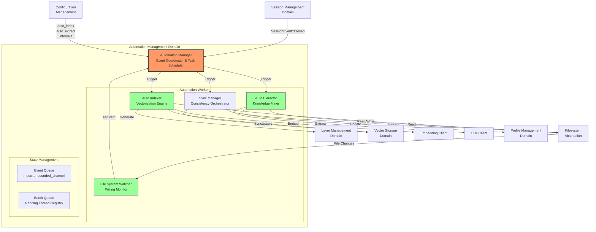
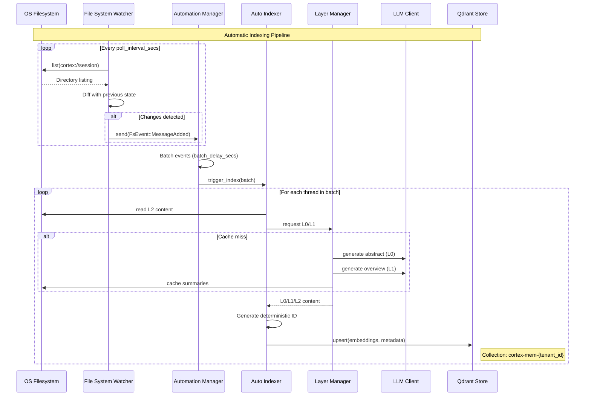
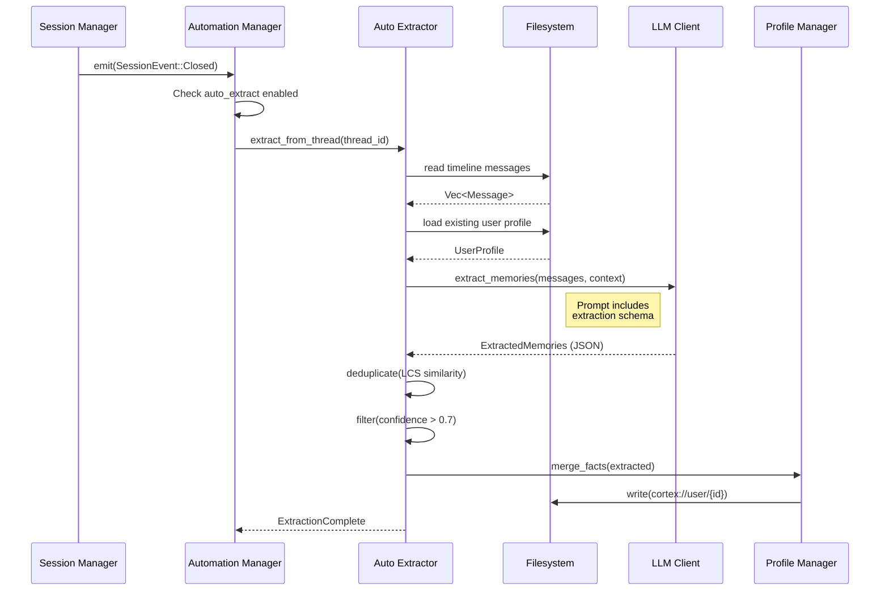

 **Automation Management Domain**
**Technical Implementation Documentation**

---

## 1. Overview

The **Automation Management Domain** is a core business domain within Cortex-Mem that orchestrates background automation tasks to maintain consistency between the filesystem-based memory storage and the vector database (Qdrant). This domain implements an event-driven architecture that enables real-time responsiveness to data changes while optimizing resource utilization through intelligent batching and throttling.

### 1.1 Business Value
The automation layer eliminates manual synchronization overhead by:
- **Automatic Indexing**: Detecting new or modified conversation files and generating searchable vector embeddings
- **Intelligent Extraction**: Automatically extracting structured knowledge (facts, decisions, entities) from completed sessions to enrich user and agent profiles
- **Synchronization**: Ensuring eventual consistency between filesystem state and vector store after restarts or manual edits
- **Layer Generation**: Dynamically generating L0 (abstract) and L1 (overview) summaries from raw L2 (detail) content

### 1.2 Architectural Position
The Automation Management Domain sits between the **Session Management Domain** (which emits lifecycle events) and the **Core Infrastructure Domain** (which provides storage and LLM services). It consumes events from the event bus and coordinates multiple specialized workers to perform asynchronous background processing.

---

## 2. System Architecture

### 2.1 Component Structure



### 2.2 Key Design Patterns

**Event-Driven Orchestration**: The `AutomationManager` acts as a central coordinator listening to `CortexEvent` types (FilesystemEvent, SessionEvent) via async channels, decoupling event producers from consumers.

**Polling vs. Push**: The File System Watcher implements a polling mechanism (default 5-second intervals) rather than OS-level file watching, ensuring compatibility across platforms and network filesystems.

**Batch Processing**: Detected changes are queued and processed in batches (default 2-second delay) to prevent excessive LLM API calls and vector store operations during high-velocity write periods.

**Lazy Initialization**: Automation workers are initialized on-demand based on configuration flags (`auto_index`, `auto_extract`).

---

## 3. Component Specifications

### 3.1 Automation Manager (`automation/manager.rs`)

**Responsibility**: Central coordinator for all automation activities. Manages the lifecycle of automation workers and routes events to appropriate handlers.

**Key Functions**:
- `AutomationManager::start()`: Initializes event listeners and begins the event processing loop
- `AutomationManager::handle_event()`: Routes events to specific workers based on event type and configuration
- `AutomationManager::shutdown()`: Gracefully terminates automation workers

**Configuration Dependencies**:
```rust
pub struct AutomationConfig {
    pub auto_index: bool,          // Enable automatic indexing
    pub auto_extract: bool,        // Enable memory extraction on session close
    pub poll_interval_secs: u64,   // Filesystem polling frequency (default: 5)
    pub batch_delay_secs: u64,     // Batching window for indexing (default: 2)
    pub sync_on_startup: bool,     // Run full sync on system start
}
```

### 3.2 File System Watcher (`automation/watcher.rs`)

**Responsibility**: Monitors `cortex://session` directories for changes in conversation files (`.md` format) using a polling mechanism.

**Implementation Details**:
- **Polling Strategy**: Recursive directory traversal of `cortex://session/{thread_id}/timeline` paths
- **State Tracking**: Maintains an in-memory `HashMap<ThreadId, Vec<MessageId>>` to detect additions, modifications, or deletions
- **Event Generation**: Emits `FsEvent` variants:
  - `MessageAdded { thread_id, message_id }`
  - `MessageUpdated { thread_id, message_id }`
  - `ThreadDeleted { thread_id }`

**Concurrency Model**:
```rust
// Pseudo-code representation of the polling loop
loop {
    tokio::select! {
        _ = interval.tick() => {
            let changes = scan_filesystem().await;
            for change in changes {
                event_sender.send(change).await?;
            }
        }
        _ = shutdown_signal => break
    }
}
```

**Error Handling**: Non-blocking error propagation; failed scans are logged with `tracing::warn!` and retried on next polling cycle.

### 3.3 Auto Indexer (`automation/indexer.rs`)

**Responsibility**: Converts filesystem-based conversation threads into vector-searchable embeddings in Qdrant.

**Processing Pipeline**:
1. **Receive Trigger**: Consumes `FsEvent` from the Automation Manager
2. **Batch Accumulation**: Collects events for `batch_delay_secs` to group related changes
3. **Content Retrieval**: Reads raw L2 content via `CortexFilesystem`
4. **Layer Generation**: Invokes `LayerManager` to generate L0 (abstract) and L1 (overview) summaries if not cached
5. **Vectorization**: Generates embeddings via `EmbeddingClient`
6. **Upsert Operation**: Stores vectors in Qdrant with tenant-aware collection naming (`cortex-mem-{tenant_id}`)
7. **ID Generation**: Uses deterministic vector IDs derived from URI + layer type (e.g., `session/123#l0`)

**Key Functions**:
- `AutoIndexer::index_thread(thread_id: &str)`: Indexes a specific conversation thread
- `AutoIndexer::index_batch(threads: Vec<ThreadId>)`: Processes multiple threads atomically
- `AutoIndexer::regenerate_layers(thread_id: &str)`: Forces regeneration of L0/L1 summaries

**Performance Considerations**:
- Implements exponential backoff for LLM API rate limits
- Uses chunked batching for embedding generation (max 100 texts per request)

### 3.4 Auto Extractor (`automation/auto_extract.rs`)

**Responsibility**: Extracts structured knowledge from completed conversation sessions and merges it into user/agent profiles.

**Trigger Conditions**:
- Listens for `SessionEvent::Closed` events
- Respects per-tenant `auto_extract` configuration flag

**Extraction Workflow**:
1. **Context Assembly**: Recursively reads all `.md` messages from the session timeline
2. **Profile Context**: Loads existing user/agent profiles to avoid duplicate extraction
3. **LLM Invocation**: Sends structured prompt to `LLMClient` requesting extraction of:
   - `ExtractedFact`: Factual statements about the user
   - `ExtractedDecision`: Decisions made during the conversation
   - `ExtractedEntity`: Named entities and their relationships
4. **Post-Processing**:
   - Confidence scoring (filter threshold: 0.7)
   - Deduplication using longest common subsequence (LCS) similarity
   - Category-based importance ranking
5. **Profile Merge**: Updates `UserProfile` or `AgentProfile` with new knowledge
6. **Persistence**: Writes updated profiles to `cortex://user/{id}` or `cortex://agent/{id}`

**Key Functions**:
- `AutoExtractor::extract_from_thread(thread_id: &str)`: Main extraction entry point
- `AutoExtractor::merge_profile(profile: &mut UserProfile, memories: ExtractedMemories)`: Deduplication and merge logic

### 3.5 Sync Manager (`automation/sync.rs`)

**Responsibility**: Performs full consistency checks between filesystem and vector store, typically invoked on system startup or administrative request.

**Synchronization Strategies**:
- **Full Sync**: Scans all tenant directories and reconciles filesystem state with Qdrant vectors
- **Tenant Sync**: Limited scope to specific tenant ID
- **Repair Mode**: Detects orphaned vectors (exists in Qdrant but not filesystem) and removes them

**Operational Usage**:
```rust
// Example administrative invocation
sync_manager.sync_all().await?;           // Full system sync
sync_manager.sync_tenant(tenant_id).await?; // Scoped sync
```

---

## 4. Data Flows & Workflows

### 4.1 Memory Indexing Workflow



### 4.2 Memory Extraction Workflow



---

## 5. Configuration & Deployment

### 5.1 Configuration Schema

Automation behavior is controlled via the `[automation]` section in `cortex-mem.toml`:

```toml
[automation]
# Enable automatic indexing of new files
auto_index = true

# Enable automatic extraction when sessions close
auto_extract = true

# Filesystem polling interval in seconds
poll_interval_secs = 5

# Batch processing delay to group rapid changes
batch_delay_secs = 2

# Perform full sync on startup
sync_on_startup = false

# Maximum concurrent indexing operations
max_concurrent_indexes = 10

# Extraction confidence threshold (0.0 - 1.0)
extraction_confidence_threshold = 0.7
```

### 5.2 Multi-Tenant Considerations

In multi-tenant deployments:
- **Isolation**: Each tenant's automation pipeline operates on tenant-scoped URIs (`cortex://session` resolves to `/data/tenants/{tenant_id}/session`)
- **Collection Naming**: Auto Indexer automatically suffixes Qdrant collection names with tenant IDs
- **Resource Limits**: Configure per-tenant rate limiting for LLM API calls to prevent cost spikes

### 5.3 Operational Monitoring

**Metrics to Monitor**:
- `automation.filesystem.poll_duration_ms`: Polling latency
- `automation.indexer.threads_processed`: Throughput metric
- `automation.indexer.llm_errors`: Failed layer generation attempts
- `automation.extractor.extraction_count`: Knowledge extraction volume
- `automation.queue.depth`: Pending batch queue size

**Health Checks**:
- Automation Manager heartbeat: Ensures event loop is not blocked
- Watcher lag detection: Alert if `last_poll_timestamp` exceeds `poll_interval_secs * 2`

---

## 6. Integration Points

### 6.1 Upstream Dependencies (Producers)
- **Session Management Domain**: Emits `SessionEvent::Closed` to trigger extraction
- **Filesystem Abstraction**: Provides read/write access to `cortex://` URIs
- **Configuration Management**: Supplies automation flags and intervals

### 6.2 Downstream Dependencies (Consumers)
- **Layer Management Domain**: Generates L0/L1 summaries during indexing
- **Vector Storage Domain**: Persists embeddings in Qdrant
- **Profile Management Domain**: Stores extracted knowledge
- **LLM Client**: Provides text completion for summarization and extraction
- **Embedding Client**: Generates vector representations

### 6.3 Interface Exposure
While primarily a background domain, the Automation Management Domain exposes administrative controls via:
- **CLI**: `cortex-mem sync` command triggers `SyncManager::sync_all()`
- **HTTP API**: `POST /api/v2/admin/sync` endpoint for on-demand synchronization
- **MCP Tools**: `force_index` and `force_extract` tools for debugging

---

## 7. Error Handling & Resilience

### 7.1 Fault Isolation
- **Worker Isolation**: Failure in Auto Indexer does not crash Auto Extractor
- **Tenant Isolation**: Processing errors in one tenant do not affect others
- **Circuit Breaker**: Automatic backoff for LLM API failures (exponential backoff with jitter)

### 7.2 Recovery Mechanisms
- **Idempotent Operations**: Indexing the same thread twice produces identical vector IDs (deterministic UUID generation from URI), preventing duplicates
- **Checkpointing**: Sync Manager tracks last successful sync timestamp to enable incremental recovery
- **Dead Letter Queue**: Failed extractions are logged with thread IDs for manual retry

### 7.3 Logging & Observability
Structured logging using `tracing`:
```rust
info!(
    thread_id = %thread_id,
    tenant_id = %tenant_id,
    layers_generated = count,
    "Successfully indexed thread"
);

warn!(
    thread_id = %thread_id,
    error = %e,
    "Failed to generate L0 abstract, retrying"
);
```

---

## 8. Implementation Guidelines

### 8.1 Adding New Automation Workers
To extend the automation domain with new background tasks:

1. **Define Event Type**: Add variant to `CortexEvent` enum in `events.rs`
2. **Implement Worker**: Create module in `automation/` implementing the processing logic
3. **Register in Manager**: Add handler in `AutomationManager::handle_event()`
4. **Configuration**: Add enablement flag to `AutomationConfig`

### 8.2 Performance Tuning
- **For High-Volume Systems**: Increase `batch_delay_secs` to accumulate more changes per LLM call
- **For Low-Latency Requirements**: Decrease `poll_interval_secs` (trade-off: higher CPU usage)
- **For Cost Optimization**: Disable `auto_extract` or increase confidence thresholds to reduce LLM calls

### 8.3 Testing Strategy
- **Unit Tests**: Mock LLM and Vector Store dependencies using trait abstractions
- **Integration Tests**: Use temporary directories and in-memory Qdrant instances
- **Load Testing**: Verify batch queue behavior under high filesystem churn (1000+ files/sec)

---

## 9. Conclusion

The Automation Management Domain represents the "intelligent background worker" of Cortex-Mem, continuously transforming raw conversation data into structured, searchable knowledge. By combining event-driven architecture with robust batching strategies, it balances real-time responsiveness with cost-efficient resource utilization. The domain's modular design allows independent scaling of indexing and extraction capabilities while maintaining strict tenant isolation suitable for SaaS deployments.

**Key Technical Achievements**:
- Deterministic vector ID generation prevents duplicate indexing
- Configurable batching optimizes LLM API costs
- Event-driven decoupling enables horizontal scaling of automation workers
- Comprehensive error handling ensures system stability during external service outages

---

**Document Information**
- **Domain**: Automation Management
- **System**: Cortex Memory (cortex-mem)
- **Language**: Rust (tokio async runtime)
- **Related Domains**: Core Infrastructure, Session Management, Layer Management, Profile Management