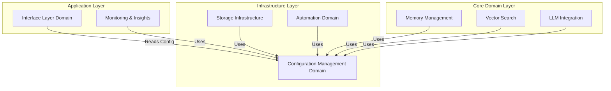
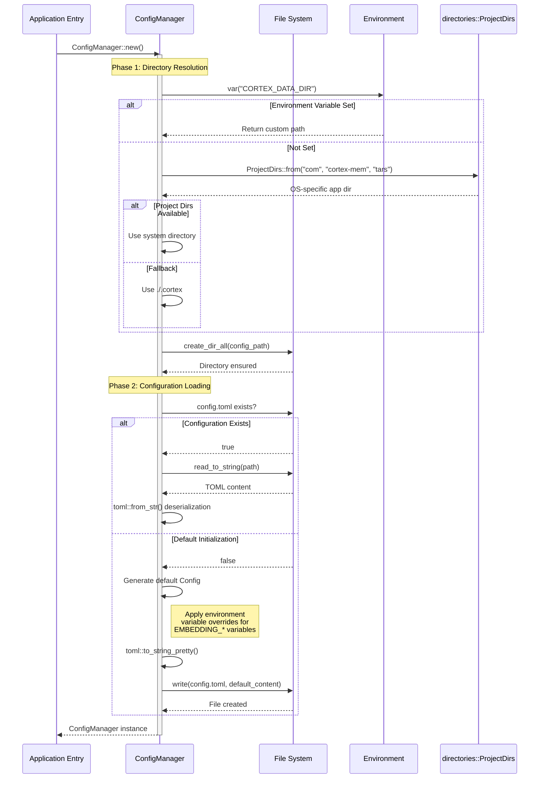

 **Configuration Management Domain Technical Documentation**

**Document Version**: 1.0  
**System**: Cortex-Mem Full-Stack Memory Infrastructure  
**Domain Type**: Infrastructure Domain  
**Complexity Rating**: 5/10  
**Criticality**: High (Cross-Cutting Concern)

---

## 1. Domain Overview

The **Configuration Management Domain** serves as the foundational infrastructure layer for the Cortex-Mem ecosystem, providing centralized, type-safe configuration handling across all system components. As an **Infrastructure Domain** within the Clean Architecture paradigm, it bridges external configuration sources—such as TOML files, environment variables, and OS-specific directories—with internal application structures.

This domain ensures consistent configuration semantics across heterogeneous deployment contexts, including command-line tools, HTTP services, Model Context Protocol (MCP) servers, and embedded library usage. By abstracting configuration resolution complexities, it enables zero-configuration startup scenarios while supporting sophisticated multi-tenant deployments.

---

## 2. Architectural Position & Responsibilities

### 2.1 Architectural Classification
- **Layer**: Infrastructure Layer (Hexagonal Architecture)
- **Pattern**: Cross-Cutting Concern / Configuration Adapter
- **Dependencies**: Minimal external dependencies (`directories`, `serde`, `toml`, `anyhow`)
- **Dependents**: All application domains (Interface Layer, Memory Management, Vector Search, Storage Infrastructure)

### 2.2 Core Responsibilities
1. **Type-Safe Configuration Mapping**: Translates external unstructured configuration (TOML, ENV) into compile-time validated Rust structures
2. **Hierarchical Resolution**: Implements cascading configuration resolution (Environment Variables → Configuration Files → System Defaults → Hardcoded Defaults)
3. **Cross-Platform Directory Management**: Resolves OS-specific data directories using the `directories` crate (e.g., `~/Library/Application Support/` on macOS, `%APPDATA%` on Windows, `~/.local/share/` on Linux)
4. **Deployment Context Abstraction**: Provides uniform configuration interfaces regardless of execution context (CLI vs. Service vs. Library)

### 2.3 Domain Relationships


---

## 3. Configuration Hierarchy & Schema

The domain implements a hierarchical configuration structure that mirrors the system's modular architecture:

### 3.1 Root Configuration Structure (`Config`)
The top-level configuration container aggregating all subsystem configurations:

```rust
pub struct Config {
    pub cortex: CortexConfig,      // Core system settings
    pub qdrant: QdrantConfig,      // Vector database connection
    pub embedding: EmbeddingConfig, // Text embedding service
    pub llm: LLMConfig,            // Language model integration
    pub server: ServerConfig,      // HTTP service settings
    pub logging: LoggingConfig,    // Observability settings
}
```

### 3.2 Subsystem Configurations

#### **CortexConfig**
Manages core system parameters and data directory resolution:
- **Data Directory Resolution**: Implements three-tier fallback strategy:
  1. `$CORTEX_DATA_DIR` environment variable
  2. OS-specific application directory (`directories::ProjectDirs`)
  3. Local fallback (`./.cortex`)
- **Scope**: Defines the virtual filesystem root for `cortex://` URI scheme mapping

#### **QdrantConfig**
Vector database connectivity parameters:
- `url`: Qdrant service endpoint
- `collection_name`: Vector collection identifier
- `embedding_dim`: Dimensionality of stored vectors (default: 1536)
- `api_key`: Optional authentication token

#### **EmbeddingConfig**
External embedding service integration (OpenAI-compatible):
- `api_base_url`: Service endpoint (default: `https://api.openai.com/v1`)
- `api_key`: Authentication credential
- `model`: Model identifier (default: `text-embedding-3-small`)
- `batch_size`: Processing batch optimization

#### **LLMConfig**
Language model provider configuration for content generation and extraction:
- Provider-specific endpoints and authentication
- Model selection parameters
- Timeout and retry configurations

#### **ServerConfig**
HTTP REST API service parameters:
- `host`: Bind address
- `port`: Listen port
- `cors_origins`: Cross-origin resource sharing policies

#### **LoggingConfig**
Observability infrastructure:
- `enabled`: Boolean activation flag
- `level`: Log verbosity (`error`, `warn`, `info`, `debug`, `trace`)
- `log_directory`: Filesystem path for log file storage

---

## 4. Technical Implementation

### 4.1 Type-Safe Configuration Structures
The implementation leverages Rust's type system and the `serde` ecosystem for compile-time configuration validation:

```rust
use serde::{Deserialize, Serialize};

#[derive(Debug, Serialize, Deserialize, Default)]
pub struct EmbeddingConfig {
    #[serde(default = "default_api_base")]
    pub api_base_url: String,
    #[serde(default)]
    pub api_key: String,
    #[serde(default = "default_model")]
    pub model: String,
    #[serde(default = "default_batch_size")]
    pub batch_size: usize,
}
```

**Key Implementation Details**:
- **`Default` Trait Implementations**: Enable partial configuration with sensible defaults filling missing values
- **`serde(default)` Attributes**: Ensure backward compatibility when new fields are added
- **`anyhow::Result` Error Handling**: Ergonomic error propagation for I/O and parsing failures

### 4.2 Configuration Loading Mechanism

#### **File-Based Loading** (`Config::load`)
```rust
impl Config {
    pub fn load<P: AsRef<std::path::Path>>(path: P) -> anyhow::Result<Self> {
        let content = std::fs::read_to_string(path)?;
        let config: Config = toml::from_str(&content)?;
        Ok(config)
    }
}
```

**Process Flow**:
1. **File System Read**: Loads TOML content via `std::fs::read_to_string`
2. **Deserialization**: Parses TOML into typed structures using `toml::from_str`
3. **Default Application**: Serde's default handling populates missing fields with predefined values
4. **Validation**: Returns `anyhow::Result` for unified error handling

### 4.3 Smart Default Resolution

#### **Data Directory Resolution Algorithm**
The `CortexConfig::data_dir()` method implements environment-aware path resolution:

```rust
impl CortexConfig {
    pub fn data_dir(&self) -> PathBuf {
        // Tier 1: Environment variable override
        if let Ok(env_dir) = std::env::var("CORTEX_DATA_DIR") {
            return PathBuf::from(env_dir);
        }
        
        // Tier 2: OS-specific application directory
        if let Some(proj_dirs) = ProjectDirs::from("com", "cortex-mem", "tars") {
            return proj_dirs.data_dir().join("cortex");
        }
        
        // Tier 3: Local project directory fallback
        PathBuf::from("./.cortex")
    }
}
```

**Platform-Specific Paths**:
- **macOS**: `~/Library/Application Support/com.cortex-mem.tars/cortex`
- **Linux**: `~/.local/share/com.cortex-mem.tars/cortex`
- **Windows**: `%APPDATA%\com\cortex-mem\tars\data\cortex`

#### **Embedding Configuration Defaults**
Environment-aware initialization for OpenAI-compatible services:
- `EMBEDDING_API_BASE_URL` → `api_base_url` (fallback: `https://api.openai.com/v1`)
- `EMBEDDING_API_KEY` → `api_key` (fallback: empty string)
- `EMBEDDING_MODEL` → `model` (fallback: `text-embedding-3-small`)

### 4.4 Configuration Manager Pattern
For service contexts requiring dynamic configuration management, the domain supports a `ConfigManager` pattern (exemplified in `examples/cortex-mem-tars/src/config.rs`):

**Responsibilities**:
- **Orchestration**: Coordinates initialization of all configuration subsystems
- **Directory Provisioning**: Ensures data directories exist via `fs::create_dir_all`
- **Lazy Loading**: Defers configuration loading until first access
- **Persistence Management**: Handles both TOML (cortex-mem configuration) and JSON (application-specific bot configurations) formats

**Key Methods**:
- `ConfigManager::new()`: Initializes configuration infrastructure, creates default config if missing
- `ConfigManager::cortex_config()`: Returns immutable reference to core configuration
- `ConfigManager::get_bots()`: Loads domain-specific configurations (JSON-based)

---

## 5. Configuration Resolution Workflow

The following sequence illustrates the complete configuration initialization process:



---

## 6. Integration Patterns

### 6.1 CLI Applications
Command-line tools utilize static configuration loading at startup:

```rust
use cortex_mem_config::Config;

fn main() -> anyhow::Result<()> {
    let config_path = dirs::config_dir()
        .expect("Cannot find config directory")
        .join("cortex-mem/config.toml");
    
    let config = Config::load(&config_path)?;
    
    // Initialize subsystems with configuration
    let memory_system = MemorySystem::new(config.cortex.data_dir())?;
    let vector_store = QdrantClient::new(config.qdrant)?;
    
    Ok(())
}
```

### 6.2 Service Deployment
Long-running services employ the `ConfigManager` pattern for dynamic configuration:

```rust
pub struct ServiceState {
    config_manager: Arc<ConfigManager>,
    memory_engine: Arc<MemoryEngine>,
}

impl ServiceState {
    pub async fn initialize() -> anyhow::Result<Self> {
        let config_manager = ConfigManager::new().await?;
        let cortex_config = config_manager.cortex_config();
        
        let memory_engine = MemoryEngine::builder()
            .data_dir(cortex_config.data_dir())
            .qdrant_config(cortex_config.qdrant.clone())
            .build()
            .await?;
            
        Ok(Self {
            config_manager: Arc::new(config_manager),
            memory_engine: Arc::new(memory_engine),
        })
    }
}
```

### 6.3 Library Context
When used as a dependency in third-party applications, the domain supports programmatic configuration construction:

```rust
use cortex_mem_config::{Config, CortexConfig, EmbeddingConfig};

// Zero-configuration default
let config = Config::default();

// Or programmatic construction
let custom_config = Config {
    cortex: CortexConfig {
        data_dir: PathBuf::from("/custom/path"),
        ..Default::default()
    },
    embedding: EmbeddingConfig {
        model: "text-embedding-3-large".to_string(),
        ..Default::default()
    },
    ..Default::default()
};
```

---

## 7. Environment Variable Reference

The domain recognizes the following environment variables for runtime configuration:

| Variable | Scope | Description | Default |
|----------|-------|-------------|---------|
| `CORTEX_DATA_DIR` | Global | Root directory for memory storage and logs | OS-specific or `./.cortex` |
| `EMBEDDING_API_BASE_URL` | Embedding | Base URL for embedding service | `https://api.openai.com/v1` |
| `EMBEDDING_API_KEY` | Embedding | Authentication key for embedding API | Empty string |
| `EMBEDDING_MODEL` | Embedding | Model identifier for embeddings | `text-embedding-3-small` |
| `RUST_LOG` | Logging | Global log level filter (env_logger compatible) | `info` |

---

## 8. Implementation Best Practices

### 8.1 Configuration Validation
While the domain provides type safety, applications should implement semantic validation:

```rust
impl Config {
    pub fn validate(&self) -> anyhow::Result<()> {
        // Ensure data directory is writable
        if !self.cortex.data_dir().exists() {
            std::fs::create_dir_all(self.cortex.data_dir())?;
        }
        
        // Validate embedding dimensions match Qdrant configuration
        if self.embedding.model.contains("3-small") && self.qdrant.embedding_dim != 1536 {
            anyhow::bail!("Embedding dimension mismatch: model produces 1536 dimensions but Qdrant configured for {}", 
                self.qdrant.embedding_dim);
        }
        
        Ok(())
    }
}
```

### 8.2 Secret Management
For production deployments, avoid storing API keys in plain-text TOML files:

```rust
// Prioritize environment variables over file configuration
impl EmbeddingConfig {
    pub fn api_key(&self) -> String {
        std::env::var("EMBEDDING_API_KEY")
            .unwrap_or_else(|_| self.api_key.clone())
    }
}
```

### 8.3 Hot Reloading (Advanced)
For services requiring configuration updates without restart, implement file watching:

```rust
use notify::{Watcher, RecursiveMode};

pub struct HotReloadConfig {
    inner: Arc<RwLock<Config>>,
    _watcher: notify::RecommendedWatcher,
}

impl HotReloadConfig {
    pub fn new(path: &Path) -> anyhow::Result<Self> {
        let config = Config::load(path)?;
        let inner = Arc::new(RwLock::new(config));
        
        let inner_clone = inner.clone();
        let path_clone = path.to_owned();
        
        let mut watcher = notify::recommended_watcher(move |res: Result<notify::Event, _>| {
            if let Ok(event) = res {
                if event.kind.is_modify() {
                    if let Ok(new_config) = Config::load(&path_clone) {
                        let mut write_guard = inner_clone.write().unwrap();
                        *write_guard = new_config;
                        log::info!("Configuration reloaded");
                    }
                }
            }
        })?;
        
        watcher.watch(path.parent().unwrap(), RecursiveMode::NonRecursive)?;
        
        Ok(Self {
            inner,
            _watcher: watcher,
        })
    }
    
    pub fn get(&self) -> Config {
        self.inner.read().unwrap().clone()
    }
}
```

---

## 9. Conclusion

The Configuration Management Domain provides the essential infrastructure foundation for the Cortex-Mem ecosystem, enabling consistent, type-safe configuration across diverse deployment scenarios. By implementing hierarchical resolution strategies and cross-platform directory management, it abstracts operational complexities while maintaining flexibility for both development and production environments.

The domain's adherence to Rust's type system principles—combined with serde's serialization capabilities—ensures that configuration errors are caught at compile time or load time rather than runtime, significantly improving system reliability and operator experience.

**Key Architectural Success Factors**:
- **Zero-Configuration Startup**: Sensible defaults enable immediate system operation
- **Environment Portability**: Seamless operation across development machines, containers, and cloud environments
- **Type Safety**: Compile-time guarantees prevent configuration-related runtime failures
- **Separation of Concerns**: Clean abstraction between external configuration sources and internal domain logic

---

**Related Documentation**:
- [Storage Infrastructure Domain](./storage-infrastructure.md)
- [Interface Layer Domain](./interface-layer.md)
- [System Deployment Guide](./deployment.md)