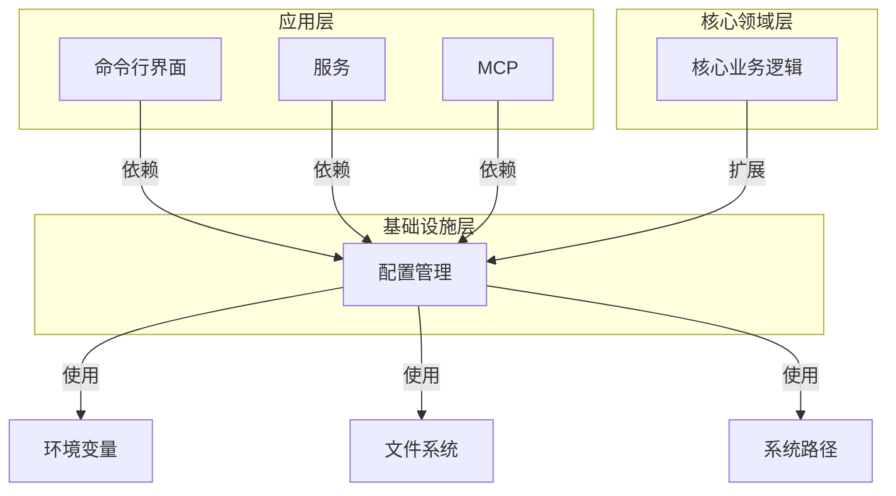
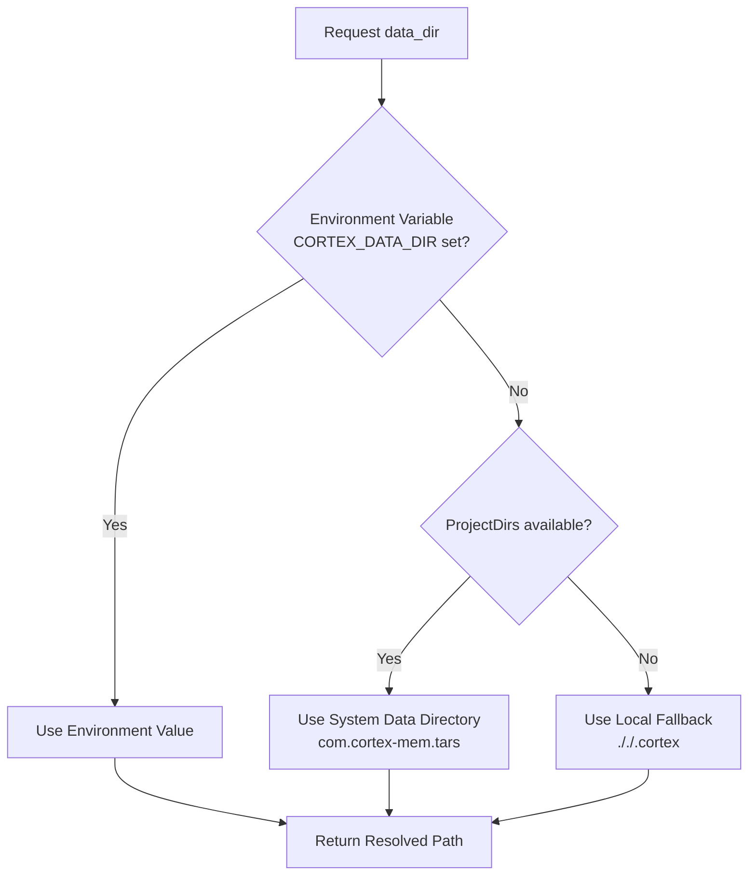
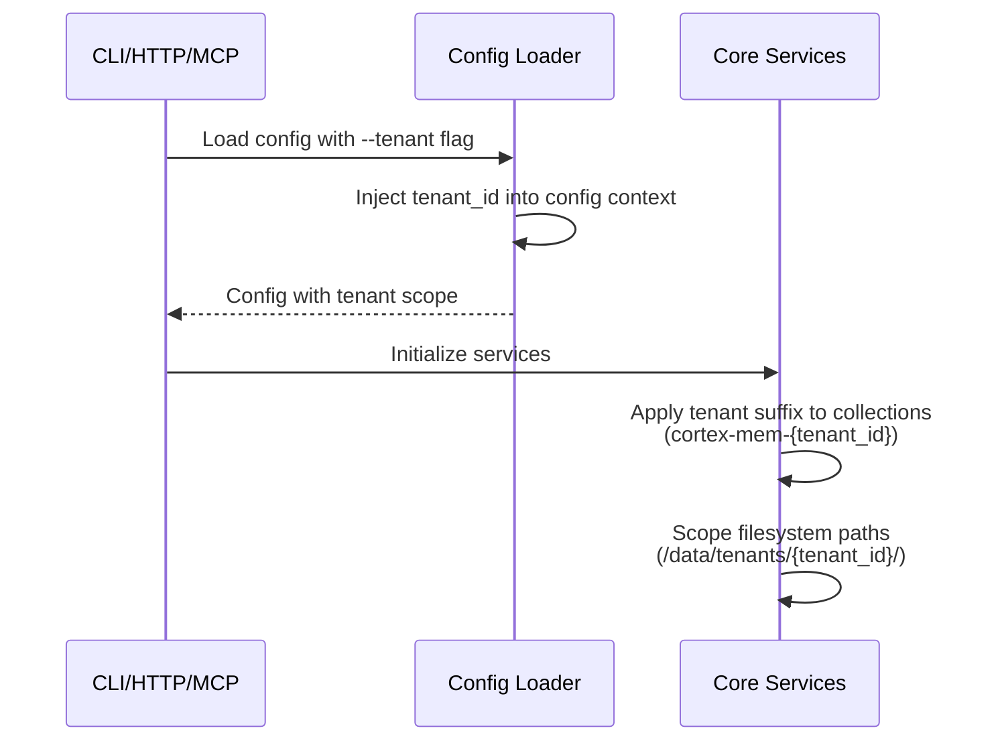
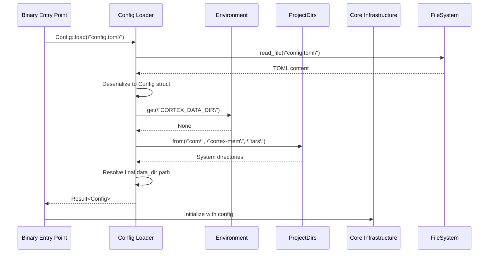

**Configuration Management Domain**

**Version:** 1.0  
**Last Updated:** 2026-02-19 04:01:33 (UTC)  
**Scope:** Technical implementation documentation for the configuration management infrastructure of the Cortex-Mem system.

---

## 1. Domain Overview

The **Configuration Management Domain** serves as the foundational infrastructure component responsible for centralizing, loading, and distributing system configuration across all Cortex-Mem interfaces and core services. Implemented primarily in the `cortex-mem-config` crate with extensions in `cortex-mem-core`, this domain ensures consistent, type-safe configuration access across the CLI, HTTP API, MCP server, and web dashboard.

**Key Responsibilities:**
- Hierarchical configuration loading (TOML files → Environment variables → Hard-coded defaults)
- Cross-platform data directory resolution
- Tenant-aware configuration scoping and isolation
- Type-safe configuration structs with serialization/deserialization support
- Configuration validation and error propagation

**Architectural Classification:** Infrastructure Domain  
**Importance Level:** 9/10 (Foundation for all system operations)  
**Complexity:** 7/10 (Moderate complexity due to fallback hierarchies and multi-tenancy)

---

## 2. Architectural Context

Within the Cortex-Mem workspace architecture, the Configuration Management Domain resides in the **Infrastructure Layer**, providing essential services to upper layers without business logic dependencies.



**Dependency Flow:**
- **Upstream Dependencies:** `serde` (serialization), `anyhow` (error handling), `directories` (cross-platform paths), `std::env` (environment access)
- **Downstream Consumers:** All application interfaces (CLI, HTTP, MCP), Core Infrastructure services (LLM client, Vector Store, Filesystem abstraction), and automation components

---

## 3. Core Components

The domain is structured into three specialized sub-modules, each addressing distinct configuration concerns:

### 3.1 Config Loader
**Code Path:** `/cortex-mem-config/src/lib.rs`

The primary entry point for configuration management, responsible for orchestrating the loading sequence from external sources into strongly-typed Rust structs.

**Key Functions:**
- `Config::load(path: &str) -> Result<Config>`: Main entry point for deserialization
- `CortexConfig::default_data_dir() -> PathBuf`: Implements the three-tier directory resolution strategy
- `EmbeddingConfig::default()`: Provides environment-aware default values

**Implementation Pattern:**
```rust
// Hierarchical loading: File -> Env -> Defaults
pub fn load(path: &str) -> anyhow::Result<Config> {
    let content = fs::read_to_string(path)?;
    let config: Config = toml::from_str(&content)?;
    // Apply environment variable overrides and fallbacks
    Ok(config.resolve_env())
}
```

### 3.2 Multi-Tenant Configuration
**Code Path:** `/cortex-mem-core/src/config.rs`

Extends base configuration with tenant-scoping capabilities, enabling SaaS deployments where multiple tenants share a single instance while maintaining data isolation.

**Key Functions:**
- `QdrantConfig::with_tenant_id(tenant_id: &str)`: Applies tenant suffixes to collection names
- `LLMConfig::from_env()`: Loads tenant-specific LLM credentials from environment variables

### 3.3 Configuration Builder
**Code Path:** `/cortex-mem-core/src/config.rs`

Provides a fluent API for programmatic configuration construction, primarily used during system initialization and testing scenarios.

**Key Functions:**
- `QdrantConfig::builder()`: Initializes builder pattern for vector store configuration
- `CortexMemBuilder`: Orchestrates dependency wiring based on configuration state

---

## 4. Configuration Resolution Strategy

The domain implements a **cascading priority system** for configuration values, ensuring flexibility across deployment environments:

| Priority | Source | Use Case |
|----------|--------|----------|
| 1 | CLI Arguments | Runtime overrides (e.g., `--data-dir`) |
| 2 | Environment Variables | Containerized deployments, secrets management |
| 3 | TOML Configuration File | Persistent environment-specific settings |
| 4 | Application Defaults | Sensible fallbacks for local development |

### 4.1 Data Directory Resolution Flow

A critical function of this domain is resolving the data directory path using a robust fallback mechanism:



**Implementation Details:**
```rust
fn default_data_dir() -> PathBuf {
    // Tier 1: Environment variable
    if let Ok(dir) = env::var(\"CORTEX_DATA_DIR\") {
        return PathBuf::from(dir);
    }
    
    // Tier 2: System directories (cross-platform)
    if let Some(proj_dirs) = ProjectDirs::from(\"com\", \"cortex-mem\", \"tars\") {
        return proj_dirs.data_dir().join(\"cortex\");
    }
    
    // Tier 3: Local fallback
    PathBuf::from(\"././.cortex\")
}
```

---

## 5. Technical Implementation Details

### 5.1 Type Safety and Serialization

The domain leverages Rust's type system and `serde` to provide compile-time guarantees for configuration validity:

```rust
#[derive(Debug, Serialize, Deserialize)]
pub struct Config {
    pub cortex: CortexConfig,
    pub embedding: EmbeddingConfig,
    pub qdrant: QdrantConfig,
    pub llm: LLMConfig,
}

#[derive(Debug, Serialize, Deserialize)]
pub struct CortexConfig {
    pub data_dir: Option<PathBuf>,
    pub auto_index: bool,
    pub auto_extract: bool,
}
```

**Key Features:**
- **Strong Typing:** PathBuf for filesystem paths, URL types for endpoints
- **Optional Fields:** `Option<T>` for non-mandatory configuration with default fallbacks
- **Custom Deserializers:** Handling of environment variable interpolation within TOML strings

### 5.2 Environment Variable Integration

Default implementations check specific environment variables to support 12-factor app methodology:

```rust
impl Default for EmbeddingConfig {
    fn default() -> Self {
        Self {
            api_base_url: env::var(\"EMBEDDING_API_BASE_URL\")
                .unwrap_or_else(|_| \"http://localhost:11434\".to_string()),
            api_key: env::var(\"EMBEDDING_API_KEY\").ok(),
            model: env::var(\"EMBEDDING_MODEL\")
                .unwrap_or_else(|_| \"nomic-embed-text\".to_string()),
        }
    }
}
```

### 5.3 Error Handling Strategy

The domain uses `anyhow::Result` for ergonomic error propagation, delegating validation to consumers while ensuring clear error contexts:

- **IO Errors:** File not found, permission denied during TOML reading
- **Parse Errors:** Invalid TOML syntax or type mismatches during deserialization
- **Resolution Errors:** Unavailable system directories with exhausted fallbacks

**Note:** The domain intentionally performs minimal validation (e.g., existence of paths, reachability of endpoints), leaving semantic validation to the consuming services that possess the context for appropriate error handling.

---

## 6. Multi-Tenancy Configuration

The Configuration Management Domain enables tenant isolation through configuration scoping:

### 6.1 Tenant ID Propagation

Configuration objects maintain tenant context throughout the system lifecycle:



### 6.2 Tenant-Aware Components

- **Vector Storage:** `QdrantConfig::with_tenant_id()` suffixes collection names (e.g., `cortex-mem-acme-corp`)
- **Filesystem:** All `cortex://` URIs are prefixed with tenant-specific base paths
- **LLM Configuration:** Supports tenant-specific API keys and model endpoints for rate limiting or data residency requirements

---

## 7. Integration Patterns

### 7.1 System Initialization Sequence

During bootstrap, the domain participates in the system initialization workflow:



### 7.2 Consumer Usage Examples

**CLI Interface:**
```rust
// CLI argument parsing overrides config values
let cli = Cli::parse();
let mut config = Config::load(&cli.config_path)?;
if let Some(tenant) = cli.tenant {
    config.cortex.tenant_id = Some(tenant);
}
```

**HTTP Service:**
```rust
// Axum state initialization
let config = Config::load(&env::var(\"CONFIG_PATH\").unwrap_or(\"config.toml\".to_string()))?;
let app_state = AppState::from_config(config).await?;
```

---

## 8. Configuration Schema Reference

### 8.1 Core Configuration Structures

| Struct | Purpose | Key Fields |
|--------|---------|------------|
| `Config` | Root configuration container | `cortex`, `embedding`, `qdrant`, `llm` |
| `CortexConfig` | General system settings | `data_dir`, `auto_index`, `auto_extract`, `tenant_id` |
| `EmbeddingConfig` | Vectorization service settings | `api_base_url`, `api_key`, `model`, `dimensions` |
| `QdrantConfig` | Vector database connection | `url`, `collection_name`, `timeout`, `tenant_suffix` |
| `LLMConfig` | Language model integration | `api_base`, `api_key`, `model`, `temperature` |

### 8.2 Sample Configuration (TOML)

```toml
[cortex]
data_dir = \"/var/lib/cortex-mem\"
auto_index = true
auto_extract = true

[embedding]
api_base_url = \"http://localhost:11434\"
model = \"nomic-embed-text\"
dimensions = 768

[qdrant]
url = \"http://localhost:6334\"
collection_name = \"cortex-mem\"

[llm]
api_base = \"https://api.openai.com/v1\"
model = \"gpt-4\"
temperature = 0.7
```

---

## 9. Deployment Considerations

### 9.1 Environment-Specific Configurations

- **Development:** Local fallback paths (`././.cortex`), local Ollama embeddings
- **Production:** System directories, external Qdrant clusters, environment variable injection for secrets
- **Containerized:** Docker volumes mounted at `CORTEX_DATA_DIR`, environment-only configuration for secrets

### 9.2 Security Implications

- **Secret Management:** API keys should be provided via environment variables (`EMBEDDING_API_KEY`, `LLM_API_KEY`) rather than committed TOML files
- **Tenant Isolation:** Ensure filesystem permissions restrict access to `/data/tenants/{tenant_id}/` directories
- **Configuration Validation:** Consumers must validate that `data_dir` exists and is writable before initialization

---

## 10. Limitations and Extensibility

### 10.1 Current Limitations

- **Validation Scope:** The domain does not validate connectivity to external services (Qdrant, LLM APIs) during load; this occurs during service initialization
- **Hot Reload:** Configuration changes require process restart; no file-watching mechanism exists for dynamic reconfiguration
- **Schema Evolution:** No built-in migration system for configuration schema changes between versions

### 10.2 Extension Points

- **Custom Providers:** Implement the `ConfigProvider` trait to support additional sources (etcd, Consul, AWS Parameter Store)
- **Validation Layers:** Add middleware validation functions between loading and consumption
- **Secrets Integration:** Extend to support secret management systems (HashiCorp Vault, AWS Secrets Manager) through custom deserializers

---

## 11. Conclusion

The Configuration Management Domain provides a robust, type-safe foundation for Cortex-Mem's configuration needs, balancing flexibility (through environment variables and hierarchical fallbacks) with safety (through strong typing and structured error handling). Its design supports both single-tenant local development and multi-tenant production deployments, serving as the essential bridge between deployment environments and the system's core business logic.

**Related Documentation:**
- System Architecture Overview
- Multi-Tenant Memory Management Process
- System Initialization and Dependency Injection Process
- Core Infrastructure Domain
