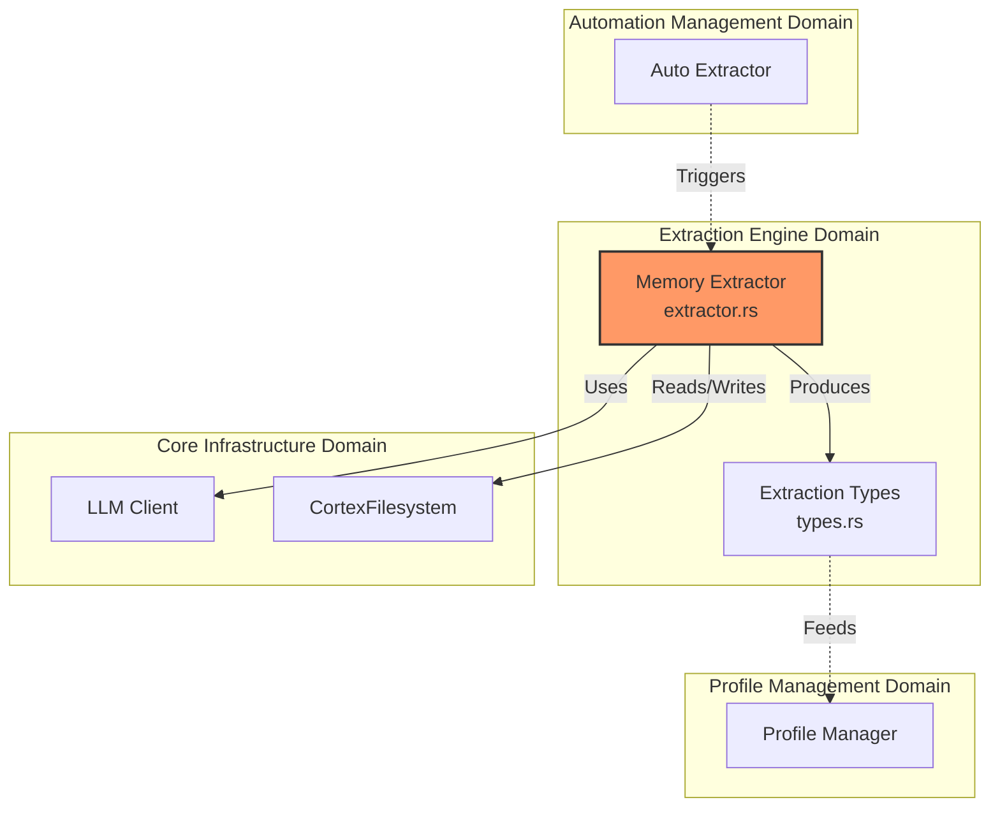
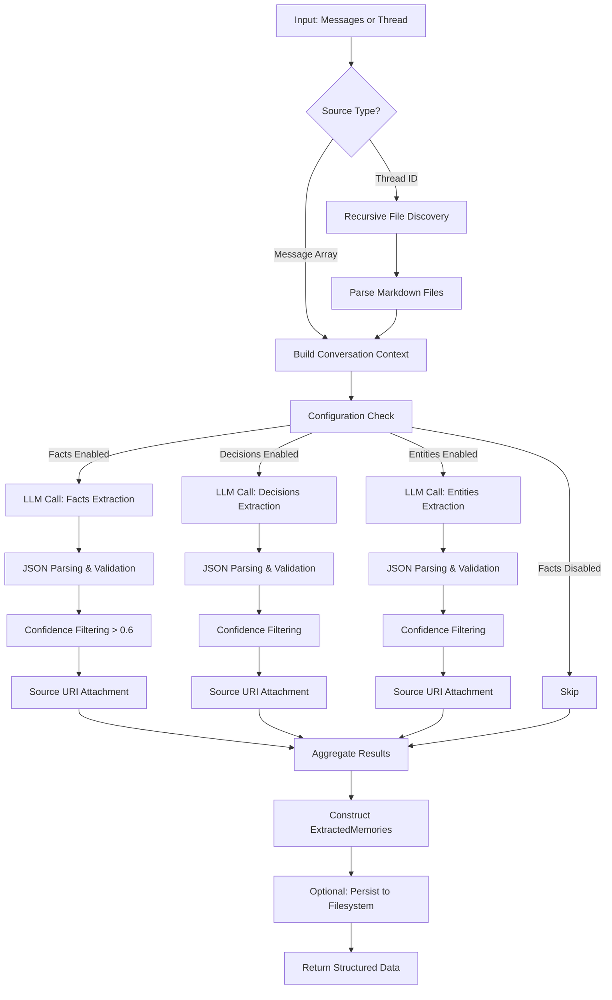
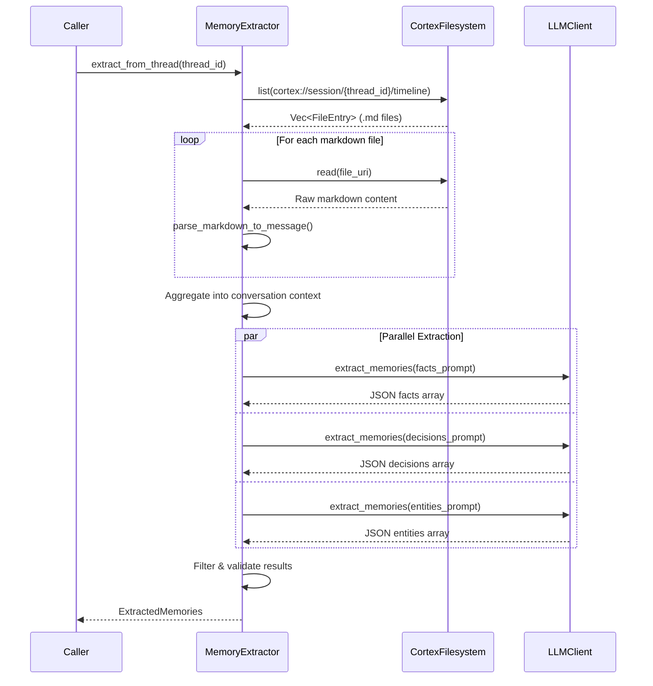

 **Extraction Engine Domain Technical Documentation**

**Generation Time:** 2026-02-19 04:05:26 (UTC)  
**Version:** 1.0.0  
**Domain Classification:** Core Business Domain  
**Complexity Score:** 8.0/10  
**Business Criticality:** 8.0/10  

---

## 1. Domain Overview

The **Extraction Engine Domain** is a specialized cognitive processing layer within Cortex-Mem responsible for transforming unstructured conversational data into structured, queryable knowledge representations. This domain implements intelligent Natural Language Processing (NLP) pipelines that identify, categorize, and extract semantic artifacts—specifically **facts**, **decisions**, and **entities**—from AI agent conversations.

### 1.1 Business Value Proposition

The domain addresses the fundamental challenge of knowledge persistence in AI systems by:

- **Semantic Structuring**: Converting free-form dialogue into typed knowledge objects (facts, decisions, entities) with metadata
- **Attribution Preservation**: Maintaining provenance through source URI tracking, enabling auditability and context retrieval
- **Confidence Scoring**: Filtering low-quality extractions using configurable confidence thresholds (default: 0.6)
- **Cross-Session Learning**: Enabling persistent user and agent personalization through the Memory Extraction and Profiling Process

### 1.2 Architectural Position

Within the Cortex-Mem architecture, the Extraction Engine operates as a **Core Business Domain** encapsulated within `cortex-mem-core`. It serves as the primary bridge between raw conversational data (L2 Detail layer) and structured profile knowledge.



---

## 2. Core Components

### 2.1 Memory Extractor (`cortex-mem-core/src/extraction/extractor.rs`)

The **MemoryExtractor** is the primary orchestration component, implemented as a Rust struct with dependency injection for filesystem and LLM operations.

#### 2.1.1 Structural Definition

```rust
pub struct MemoryExtractor {
    fs: Arc<dyn CortexFilesystem>,
    llm: Arc<dyn LLMClient>,
    config: ExtractionConfig,
}
```

**Dependencies:**
- **CortexFilesystem**: Abstracts storage operations for reading conversation threads and persisting extraction results
- **LLMClient**: OpenAI-compatible interface for generative extraction operations
- **ExtractionConfig**: Feature flags controlling extraction types (facts, decisions, entities) and quality thresholds

#### 2.1.2 Public Interface

| Method | Signature | Purpose |
|--------|-----------|---------|
| `extract_from_messages` | `async fn(&self, thread_id: &str, messages: &[Message]) -> Result<ExtractedMemories>` | Direct extraction from in-memory message arrays |
| `extract_from_thread` | `async fn(&self, thread_id: &str) -> Result<ExtractedMemories>` | Recursive filesystem-based extraction from markdown timelines |
| `save_extraction` | `async fn(&self, thread_id: &str, extraction: &ExtractedMemories) -> Result<()>` | Persistence of extraction results to `cortex://session/{thread_id}/extractions/` |

### 2.2 Extraction Types (`cortex-mem-core/src/extraction/types.rs`)

Defines the domain model for structured memory artifacts with strong typing and serialization support.

#### 2.2.1 Core Data Structures

```rust
pub struct ExtractedMemories {
    pub facts: Vec<ExtractedFact>,
    pub decisions: Vec<ExtractedDecision>,
    pub entities: Vec<ExtractedEntity>,
    pub source_thread_id: String,
    pub extracted_at: DateTime<Utc>,
}

pub struct ExtractedFact {
    pub content: String,
    pub category: FactCategory,  // Personal, Professional, Preference, etc.
    pub confidence: f32,         // 0.0 - 1.0
    pub source_uris: Vec<String>,
    pub importance: i32,         // 1-10 scale
}

pub struct ExtractedDecision {
    pub content: String,
    pub context: String,
    pub confidence: f32,
    pub participants: Vec<String>,
    pub source_uris: Vec<String>,
}

pub struct ExtractedEntity {
    pub name: String,
    pub entity_type: EntityType,  // Person, Organization, Technology, etc.
    pub relationships: Vec<Relationship>,
    pub confidence: f32,
}
```

---

## 3. Extraction Workflows

### 3.1 Primary Extraction Pipeline

The extraction engine implements a configurable, parallelized pipeline for processing conversational data:



### 3.2 Thread-Based Extraction Sequence

When operating on filesystem-based conversation threads, the extractor performs I/O operations before LLM processing:



### 3.3 Confidence Scoring & Quality Assurance

The domain implements a multi-layered quality control mechanism:

1. **LLM Confidence**: The underlying model provides confidence scores based on response probability
2. **Threshold Filtering**: Configurable `min_confidence` parameter (default: 0.6) filters uncertain extractions
3. **Structural Validation**: JSON schema validation ensures type safety before domain object construction
4. **Source Attribution**: Every extraction maintains reference to its origin URI(s) for traceability

---

## 4. Technical Implementation Details

### 4.1 Prompt Engineering Strategy

The extraction engine utilizes domain-specific prompt templates to guide LLM output:

- **Facts Prompt**: Focuses on objective statements about the user ("User prefers dark mode", "User works at Company X")
- **Decisions Prompt**: Captures commitment statements and agreed-upon actions ("Decided to use PostgreSQL", "Scheduled meeting for Tuesday")
- **Entities Prompt**: Identifies named entities and their relationships ("Mentioned Project Alpha", "Referencing the Q4 budget")

All prompts enforce JSON output schemas with typed fields for programmatic parsing.

### 4.2 Batch Processing & Performance

To optimize token usage and API costs:

- **Message Batching**: Processes up to 50 messages per LLM call to maximize context window utilization
- **Parallel Extraction**: Executes fact, decision, and entity extractions concurrently using `try_join!` macros
- **Lazy Evaluation**: Only extracts configured memory types (controlled via `ExtractionConfig` flags)

### 4.3 Error Handling & Resilience

The domain implements graceful degradation strategies:

```rust
// Fallback parsing for non-JSON LLM responses
fn parse_with_fallback(raw_response: &str) -> Result<ExtractedMemories, Error> {
    match serde_json::from_str(raw_response) {
        Ok(parsed) => Ok(parsed),
        Err(_) => parse_markdown_fallback(raw_response), // Regex-based extraction
    }
}
```

- **Partial Success**: If one extraction type fails (e.g., entities), facts and decisions are still returned
- **Filesystem Resilience**: Missing or corrupted message files are skipped with warning logs, not fatal errors

---

## 5. Integration Patterns

### 5.1 Automation Integration

The Extraction Engine is primarily consumed by the **Auto Extractor** (`automation/auto_extract.rs`) within the Automation Management Domain:


**Integration Point**: When a conversation session closes, the automation pipeline triggers `extract_from_thread()` to update user and agent profiles incrementally.

### 5.2 Profile Management Integration

Extracted memories flow into the Profile Management Domain through:

- **Fact Aggregation**: `UserProfile::add_fact()` merges new facts with deduplication logic
- **Decision History**: `AgentProfile::add_decision()` maintains agent learning history
- **Category Enforcement**: Profile managers enforce limits (e.g., max 100 facts per category) to prevent profile bloat

### 5.3 External API Surface

While primarily used internally, the extraction capabilities are exposed through:

- **MCP Tool**: `extract_memories` tool allows AI assistants to request on-demand extraction
- **HTTP API**: `/api/v2/sessions/{id}/extract` endpoint for manual extraction triggers
- **CLI Command**: `cortex-mem extract --thread <id>` for administrative operations

---

## 6. Configuration & Deployment

### 6.1 Configuration Schema

Extraction behavior is controlled via `ExtractionConfig`:

```toml
[extraction]
enabled = true
min_confidence = 0.6
extract_facts = true
extract_decisions = true
extract_entities = true
max_messages_per_batch = 50
```

### 6.2 Tenant Isolation

As part of the multi-tenant architecture:

- **Filesystem Scope**: Extractions are stored under `cortex://session/{thread_id}/extractions/` with tenant-specific resolution
- **Vector Store**: Extracted content destined for semantic search inherits tenant-aware collection naming (`cortex-mem-{tenant_id}`)
- **Profile Scope**: Merged profiles respect tenant boundaries, preventing cross-tenant knowledge leakage

---

## 7. Usage Examples

### 7.1 Direct Message Extraction

```rust
let extractor = MemoryExtractor::new(fs, llm, config);
let messages = vec![
    Message::new(Role::User, "I prefer Python over JavaScript"),
    Message::new(Role::Assistant, "Noted. I'll prioritize Python examples."),
];

let extracted = extractor.extract_from_messages("thread-123", &messages).await?;

for fact in extracted.facts {
    println!("Fact: {} (confidence: {})", fact.content, fact.confidence);
}
```

### 7.2 Thread-Based Extraction with Persistence

```rust
// Extract from filesystem thread
let memories = extractor.extract_from_thread("session-456").await?;

// Save to filesystem for audit trail
extractor.save_extraction("session-456", &memories).await?;

// Results stored at: cortex://session/session-456/extractions/{timestamp}.md
```

---

**Related Documentation:**
- [Automation Management Domain](./automation-management.md)
- [Profile Management Domain](./profile-management.md)
- [Session Management Domain](./session-management.md)
- [LLM Integration Guide](./llm-client.md)
