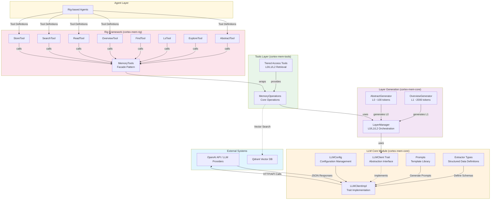
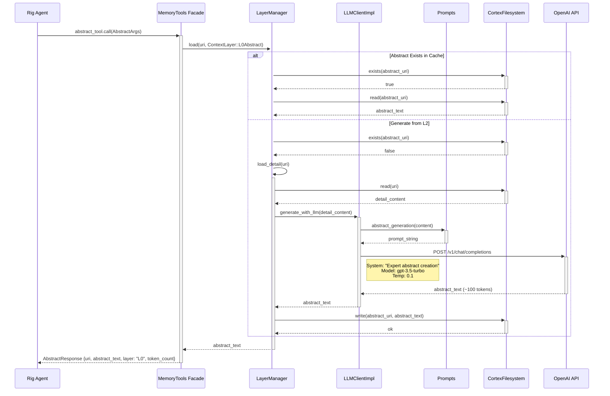
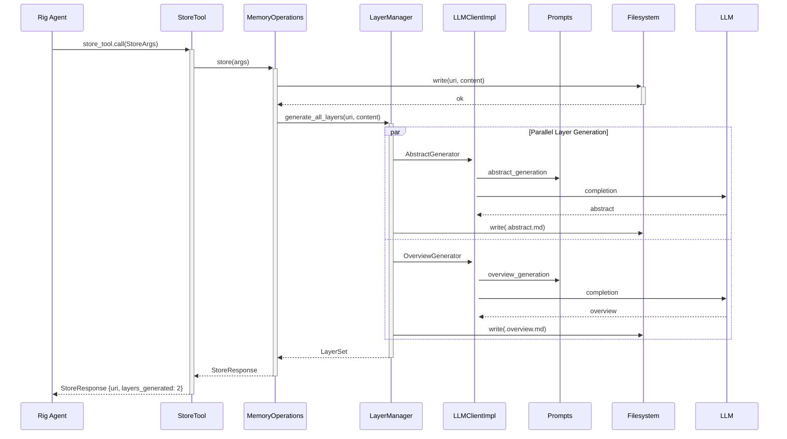

 **LLM Integration Domain - Technical Documentation**

**Generation Time:** 2026-02-17 16:39:06 (UTC)  
**Version:** 1.0  
**Status:** Production Ready

---

## 1. Overview

The **LLM Integration Domain** provides the core infrastructure for interacting with Large Language Models (LLMs) within the Cortex-Mem system. This domain abstracts provider-specific implementations (OpenAI, Azure, local models) through a unified trait-based interface, enabling text completion, structured data extraction, and automated memory layer generation.

The domain implements a **three-tier memory abstraction architecture** (L0-L2) inspired by the OpenViking design pattern, where content is progressively summarized to optimize context window usage. It serves as the cognitive engine powering automated memory extraction, content classification, and semantic summarization.

### 1.1 Key Capabilities

- **Unified LLM Client Interface**: Trait-based abstraction (`LLMClient`) supporting multiple providers via the Rig framework
- **Structured Extraction**: Type-safe JSON extraction with schema validation using 12 specialized data types
- **Tiered Content Generation**: Automatic generation of L0 Abstracts (~100 tokens) and L1 Overviews (~2000 tokens) from detailed content
- **Prompt Engineering System**: Centralized template management for consistent LLM interactions
- **Rig Framework Integration**: 8 specialized tools enabling agent-based memory operations

---

## 2. Architecture

### 2.1 High-Level Component Diagram



### 2.2 Design Principles

The domain follows **Hexagonal Architecture** principles with clear dependency boundaries:

1. **Dependency Inversion**: Interface adapters (`cortex-mem-rig`, `cortex-mem-tools`) depend on the core domain, not vice versa
2. **Provider Abstraction**: The `LLMClient` trait enables swapping between OpenAI, Azure, or local LLM providers without changing business logic
3. **Type Safety**: Structured extraction uses Serde for serialization and Schemars for JSON Schema generation, ensuring runtime contract compliance
4. **Async-First**: All LLM operations are async using Tokio, supporting concurrent processing of multiple extraction tasks

---

## 3. Core Components

### 3.1 LLM Client Architecture

The system implements a **trait-based abstraction layer** using the `rig-core` library as the underlying provider.

#### 3.1.1 LLMClient Trait

The `LLMClient` trait defines the contract for all LLM interactions:

```rust
#[async_trait]
pub trait LLMClient: Send + Sync {
    /// Simple text completion
    async fn complete(&self, prompt: &str) -> Result<String>;
    
    /// Completion with system prompt context
    async fn complete_with_system(&self, system: &str, prompt: &str) -> Result<String>;
    
    /// Structured memory extraction from conversation text
    async fn extract_memories(&self, prompt: &str) -> Result<MemoryExtractionResponse>;
    
    /// Extract structured facts with metadata
    async fn extract_structured_facts(&self, prompt: &str) -> Result<StructuredFactExtraction>;
    
    /// Detailed fact extraction with comprehensive metadata
    async fn extract_detailed_facts(&self, prompt: &str) -> Result<DetailedFactExtraction>;
    
    /// Introspection methods
    fn model_name(&self) -> &str;
    fn config(&self) -> &LLMConfig;
}
```

#### 3.1.2 LLMClientImpl

The `LLMClientImpl` struct wraps the Rig OpenAI client and follows the pattern: **Client → CompletionModel → Agent**.

**Key Implementation Details**:
- **JSON Extraction**: Parses structured responses from markdown code blocks with multiple fallback strategies (regex extraction, direct JSON parsing, error recovery)
- **Provider Compatibility**: Supports OpenAI-compatible APIs (OpenAI, Azure, local inference servers like Ollama)
- **Error Handling**: Distinguishes between transient network errors (retryable) and schema validation errors (application logic)

**File**: `cortex-mem-core/src/llm/client.rs`

### 3.2 Configuration Management

The `LLMConfig` struct manages all LLM-related configuration with environment variable fallbacks:

```rust
pub struct LLMConfig {
    pub api_base_url: String,      // LLM_API_BASE_URL
    pub api_key: String,           // LLM_API_KEY
    pub model: String,             // LLM_MODEL
    pub temperature: f32,          // Default: 0.1 for deterministic extraction
    pub max_tokens: usize,         // Context window management
}
```

**Default Configuration**:
- **Model**: `gpt-3.5-turbo` (efficient model for extraction tasks)
- **Temperature**: `0.1` (low variance for consistent structured output)
- **Endpoint**: OpenAI API v1 chat completions

**File**: `cortex-mem-core/src/llm/mod.rs`

### 3.3 Prompt Engineering Layer

The `Prompts` struct provides four specialized prompt templates following cognitive processing stages:

#### 3.3.1 L0 Abstract Generation
- **Target**: ~100 tokens
- **Purpose**: Single-sentence summaries for quick relevance checking
- **Use Case**: Initial memory filtering, fast retrieval previews

#### 3.3.2 L1 Overview Generation
- **Target**: ~500-2000 tokens
- **Structure**: Markdown format with sections:
  - **Summary**: High-level narrative
  - **Core Topics**: Key subject matter
  - **Key Points**: Bullet-pointed insights
  - **Entities**: People, organizations, concepts
  - **Context**: Temporal and situational metadata

#### 3.3.3 Memory Extraction
- **Format**: JSON-structured output
- **Categories**: Facts, decisions, action items, user preferences, agent learnings
- **Metadata**: Importance scoring, source attribution, entity relationships

#### 3.3.4 Intent Analysis
- **Output**: Keywords, entities, time ranges, query type classification
- **Purpose**: Query understanding for semantic search optimization

**File**: `cortex-mem-core/src/llm/prompts.rs`

### 3.4 Structured Type System

The `extractor_types.rs` module defines 12 structured data types using **Serde** for serialization and **Schemars** for JSON Schema generation:

| Type | Purpose | Key Fields |
|------|---------|------------|
| `StructuredFactExtraction` | High-level fact harvesting | facts: Vec<StructuredFact> |
| `DetailedFactExtraction` | Comprehensive analysis | facts, entities, sentiment, confidence |
| `StructuredFact` | Individual fact representation | importance, category, entities, source_role |
| `KeywordExtraction` | Search optimization | keywords, entities, concepts |
| `MemoryClassification` | Categorization | memory_type, priority, retention_policy |
| `ImportanceScore` | Priority ranking | score (1-10), rationale |
| `DeduplicationResult` | Memory consolidation | is_duplicate, canonical_id, similarity_score |
| `SummaryResult` | Content condensation | summary, key_points, length |
| `LanguageDetection` | Localization | language_code, confidence |
| `EntityExtraction` | NER processing | entities: Vec<Entity> |
| `Entity` | Named entity | name, type, mentions, metadata |
| `ConversationAnalysis` | Dialogue understanding | topics, sentiment, action_items, participants |

**Schema Generation**: Types implement `JsonSchema` for automatic OpenAI function calling schema generation.

**File**: `cortex-mem-core/src/llm/extractor_types.rs`

---

## 4. Layer Generation System

The **Three-Layer Memory Architecture** provides progressive context loading to optimize LLM context window usage.

### 4.1 Layer Manager

The `LayerManager` implements lazy-loading with automatic generation:

```rust
impl LayerManager {
    /// Unified layer loading with automatic fallback generation
    pub async fn load(&self, uri: &str, layer: ContextLayer) -> Result<String>;
    
    /// Batch generation of all three layers
    pub async fn generate_all_layers(&self, uri: &str, content: &str) -> Result<()>;
    
    /// Timeline aggregation for batch processing
    pub async fn generate_timeline_layers(&self, messages: &[Message]) -> Result<LayerSet>;
}
```

**Layer Types**:
- **L0 (Abstract)**: ~100 tokens, 1-2 sentence summary
- **L1 (Overview)**: ~2000 tokens, structured markdown
- **L2 (Detail)**: Complete original content

### 4.2 Generation Strategy

When a layer is requested but doesn't exist:
1. Load base content from L2 (detail layer)
2. Select appropriate generator (`AbstractGenerator` or `OverviewGenerator`)
3. Apply LLMClient with specialized prompts
4. Persist generated content to filesystem cache
5. Return content to caller

**Caching Strategy**: Generated layers are cached in the filesystem with naming convention `{uri}.abstract.md` and `{uri}.overview.md` to avoid redundant LLM calls.

**Files**: 
- `cortex-mem-core/src/layers/manager.rs`
- `cortex-mem-core/src/layers/generator.rs`

---

## 5. Rig Framework Integration

The `cortex-mem-rig` crate provides integration with the Rig agent framework, exposing memory capabilities as callable tools.

### 5.1 MemoryTools Facade

The `MemoryTools` struct acts as a **Facade Pattern** providing thread-safe access:

```rust
pub struct MemoryTools {
    operations: Arc<MemoryOperations>,
}

impl MemoryTools {
    pub async fn new_with_config(config: &Config) -> Result<Self>;
    pub fn get_abstract(&self, uri: &str) -> AbstractTool;
    pub fn get_overview(&self, uri: &str) -> OverviewTool;
    // ... additional tool accessors
}
```

### 5.2 Tool Implementations

Eight specialized tools implement the `rig::tool::Tool` trait:

| Tool | Purpose | Args | Output |
|------|---------|------|--------|
| `AbstractTool` | Retrieve L0 summaries | `uri: String` | `AbstractResponse` |
| `OverviewTool` | Retrieve L1 structured overviews | `uri: String` | `OverviewResponse` |
| `ReadTool` | Access L2 full content | `uri: String` | `ReadResponse` |
| `SearchTool` | Semantic vector search | `query: String, limit: usize` | `SearchResponse` |
| `FindTool` | Quick L0 relevance search | `keywords: Vec<String>` | `FindResponse` |
| `LsTool` | Directory/memory listing | `path: String, recursive: bool` | `LsResponse` |
| `ExploreTool` | Intelligent content exploration | `uri: String, depth: usize` | `ExploreResponse` |
| `StoreTool` | Content storage with auto-layering | `uri: String, content: String` | `StoreResponse` |

Each tool implements:
- `const NAME: &'static str` - Tool identifier
- `type Args` - Input schema (Deserializable)
- `type Output` - Response schema (Serializable)
- `async fn definition() -> ToolDefinition` - JSON Schema for LLM function calling
- `async fn call(args: Self::Args) -> Result<Self::Output>` - Execution logic

**File**: `cortex-mem-rig/src/tools/mod.rs`

---

## 6. Data Flows

### 6.1 Tiered Memory Retrieval Flow (L0 Abstract)



### 6.2 Structured Memory Extraction Flow



---

## 7. Integration Patterns

### 7.1 Dependency Injection

All components use `Arc<dyn LLMClient>` for shared ownership and dependency injection:

```rust
pub struct AbstractGenerator {
    llm_client: Arc<dyn LLMClient>,
}

impl AbstractGenerator {
    pub fn new(llm_client: Arc<dyn LLMClient>) -> Self {
        Self { llm_client }
    }
}
```

This pattern enables:
- **Testing**: Mock LLMClient implementations for unit testing
- **Provider Switching**: Runtime selection of LLM providers
- **Resource Sharing**: Single client connection pool across all generators

### 7.2 Initialization Pattern

The `create_memory_tools_with_tenant_and_vector()` async constructor initializes the full stack:

```rust
pub async fn create_memory_tools_with_tenant_and_vector(
    data_dir: PathBuf,
    tenant_id: String,
    llm_config: LLMConfig,
    qdrant_url: String,
    embedding_config: EmbeddingConfig,
) -> Result<MemoryTools> {
    // 1. Initialize filesystem
    // 2. Create LLMClient
    // 3. Connect to Qdrant
    // 4. Initialize LayerManager with generators
    // 5. Wrap in MemoryTools facade
}
```

---

## 8. Configuration Reference

### 8.1 Environment Variables

| Variable | Description | Default |
|----------|-------------|---------|
| `LLM_API_BASE_URL` | Base URL for LLM API | `https://api.openai.com/v1` |
| `LLM_API_KEY` | Authentication key | *required* |
| `LLM_MODEL` | Model identifier | `gpt-3.5-turbo` |
| `LLM_TEMPERATURE` | Sampling temperature | `0.1` |
| `LLM_MAX_TOKENS` | Maximum completion length | `4096` |

### 8.2 TOML Configuration

```toml
[llm]
api_base_url = "https://api.openai.com/v1"
api_key = "sk-..."
model = "gpt-3.5-turbo"
temperature = 0.1
max_tokens = 4096

[embedding]
api_base_url = "https://api.openai.com/v1"
api_key = "sk-..."
model = "text-embedding-3-small"
dimensions = 1536
```

---

## 9. Implementation Guidelines

### 9.1 Error Handling Strategy

The domain uses a layered error approach:
- **Network Layer**: Retries with exponential backoff for transient HTTP errors
- **Parsing Layer**: Multiple fallback strategies for JSON extraction from markdown code blocks
- **Schema Layer**: Validation against Schemars-generated schemas with detailed field-level error reporting

### 9.2 Performance Considerations

- **Async Concurrency**: Layer generation (L0 and L1) runs in parallel using `tokio::join!`
- **Caching**: Generated layers are persisted to filesystem to avoid redundant LLM calls
- **Token Optimization**: L0 abstracts minimize context window usage while preserving semantic relevance
- **Batch Processing**: `generate_timeline_layers` aggregates multiple messages for efficient batch LLM processing

### 9.3 Extensibility Points

To add a new extraction type:
1. Define struct in `extractor_types.rs` with `Serialize`, `Deserialize`, and `JsonSchema` derives
2. Add extraction method to `LLMClient` trait
3. Implement method in `LLMClientImpl` with appropriate prompt template
4. Update `Prompts` module with new template if required

---

## 10. Security Considerations

1. **API Key Management**: Keys are stored in `LLMConfig` and passed via headers; never logged
2. **Prompt Injection Prevention**: System prompts are static templates; user content is treated as data, not instructions
3. **Output Validation**: All LLM responses are validated against JSON Schema before deserialization
4. **Rate Limiting**: Clients should implement rate limiting at the interface layer (CLI/Service) to prevent API quota exhaustion

---

## 11. Related Documentation

- **Memory Management Domain**: Core memory operations and URI scheme
- **Vector Search Domain**: Qdrant integration and embedding generation
- **Rig Framework**: Agent tool definitions and trait specifications
- **Configuration Management**: Environment resolution and TOML parsing

**Associated Files**:
- `cortex-mem-core/src/llm/mod.rs`
- `cortex-mem-core/src/llm/client.rs`
- `cortex-mem-core/src/llm/prompts.rs`
- `cortex-mem-core/src/llm/extractor_types.rs`
- `cortex-mem-core/src/layers/manager.rs`
- `cortex-mem-core/src/layers/generator.rs`
- `cortex-mem-rig/src/lib.rs`
- `cortex-mem-tools/src/tools/tiered.rs`