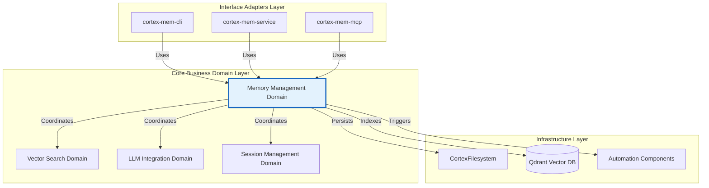
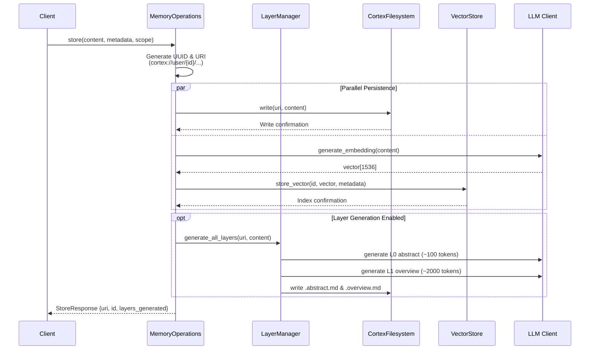
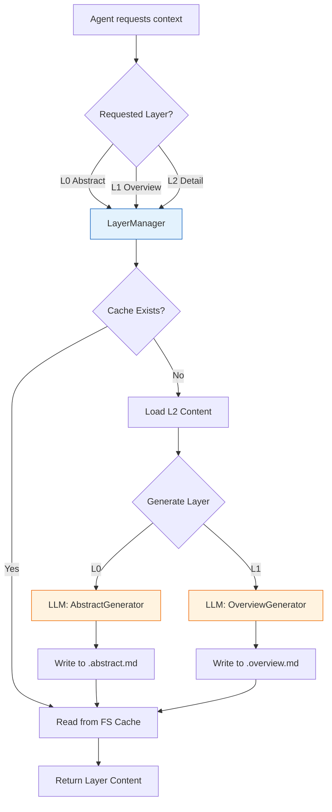
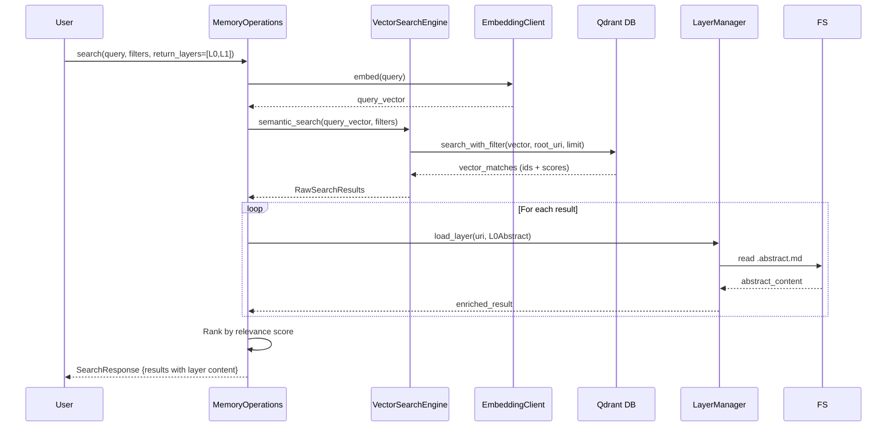

 **Technical Documentation: Memory Management Domain**

**Version:** 1.0  
**Last Updated:** 2026-02-17 16:35:41 (UTC)  
**System:** Cortex-Mem  
**Module Classification:** Core Business Domain  

---

## 1. Executive Summary

The **Memory Management Domain** is the central business capability of the Cortex-Mem system, providing comprehensive semantic memory storage, retrieval, and organization services for AI agent applications. Implemented primarily in Rust within the `cortex-mem-core` and `cortex-mem-tools` crates, this domain orchestrates multi-dimensional memory models, tiered content abstraction, and automated extraction pipelines.

This domain implements a **polyglot persistence strategy** combining filesystem storage (for content durability and version control) with vector database indexing (for semantic retrieval), coordinated through a unified virtual filesystem abstraction using the proprietary `cortex://` URI scheme.

---

## 2. Architectural Positioning

### 2.1 Domain Context

Within the Cortex-Mem layered architecture, the Memory Management Domain occupies the **Core Domain Layer**, adhering to Hexagonal Architecture principles:



### 2.2 Dependency Relationships

| Dependency Direction | Relationship Type | Strength | Description |
|---------------------|------------------|----------|-------------|
| **Memory Management → Vector Search** | Service Coordination | Critical | Delegates semantic search and embedding storage operations |
| **Memory Management → LLM Integration** | Service Coordination | Critical | Utilizes for automated extraction, classification, and tiered layer generation |
| **Memory Management → Session Management** | Service Coordination | High | Coordinates conversation context and timeline persistence |
| **Memory Management → Storage Infrastructure** | Data Persistence | Critical | Persists content via virtual filesystem abstraction |
| **Interface Layer → Memory Management** | API Consumption | Critical | All user interfaces delegate to this domain for memory operations |

---

## 3. Core Responsibilities

The Memory Management Domain encapsulates five primary responsibilities:

### 3.1 Multi-Dimensional Memory Organization
- **Dimensional Scoping**: Supports `User`, `Agent`, `Session`, and `Resources` dimensions for tenant isolation and organizational hierarchy
- **URI-Based Addressing**: Implements the `cortex://{dimension}/{scope}/{category}/{id}` scheme for portable, version-control-friendly resource identification
- **Hierarchical Storage**: Automatic date-based organization (`YYYY-MM/DD/HH_MM_SS_id.md`) within dimension scopes

### 3.2 Tiered Content Abstraction (L0-L2)
Implements the OpenViking pattern for progressive context disclosure:
- **L0 Abstract**: ~100 tokens, 1-2 sentence summaries for quick relevance scanning
- **L1 Overview**: ~500-2000 tokens, structured summaries for core understanding
- **L2 Detail**: Complete content with full metadata for deep analysis

### 3.3 Semantic Vector Coordination
- Orchestrates embedding generation and vector database operations
- Manages the duality of storage: filesystem (source of truth) and Qdrant (search index)
- Implements background synchronization between filesystem and vector store

### 3.4 Automated Memory Extraction
- LLM-powered analysis of conversation sessions to extract structured information
- Classification into types: `Facts`, `Decisions`, `Preferences`, `Entities`, `Cases`
- Confidence scoring and importance ranking with source provenance tracking

### 3.5 Agent Tool Interface
- Exposes memory operations as callable tools for LLM agents
- Implements tiered access patterns (`get_abstract`, `get_overview`, `get_read`)
- Provides semantic search capabilities with Layer-0 enrichment

---

## 4. Component Architecture

The domain is structured into five sub-modules:

### 4.1 Core API Surface (`cortex-mem-core/src/lib.rs`, `cortex-mem-tools/src/lib.rs`)
**Responsibility**: Public API contract and type exports  
**Key Elements**:
- Trait definitions for memory operations
- Library initialization and configuration injection
- Type re-exports for cross-module consistency

### 4.2 Type Definitions (`cortex-mem-core/src/types.rs`)
**Responsibility**: Domain model and type system  
**Key Structures**:
```rust
// Core memory entity
pub struct Memory {
    pub id: Uuid,
    pub content: String,
    pub embedding: Option<Vec<f32>>,
    pub metadata: MemoryMetadata,
    pub dimension: Dimension,
}

// Dimensional classification
pub enum Dimension {
    User(String),      // cortex://user/{id}/
    Agent(String),     // cortex://agent/{id}/
    Session(String),   // cortex://session/{id}/
    Resources,         // cortex://resources/
}

// Tiered abstraction levels
pub enum ContextLayer {
    L0Abstract,   // Concise semantic summary
    L1Overview,   // Structured medium-length summary  
    L2Detail,     // Full original content
}

// Search and filtering
pub struct Filters {
    pub user_id: Option<String>,
    pub agent_id: Option<String>,
    pub categories: Vec<MemoryCategory>,
    pub date_range: Option<(DateTime, DateTime)>,
    pub importance_threshold: f32,
}
```

### 4.3 Memory Operations Facade (`cortex-mem-tools/src/operations.rs`)
**Responsibility**: High-level operation coordination  
**Architecture Pattern**: Facade pattern integrating four subsystems:
- **Virtual Filesystem**: Content persistence via `CortexFilesystem`
- **Vector Engine**: Semantic search via `VectorSearchEngine`
- **Session Manager**: Conversation context via `SessionManager`
- **Layer Manager**: Tiered generation via `LayerManager`

**Constructor Pattern**:
```rust
impl MemoryOperations {
    pub fn new(
        filesystem: Arc<CortexFilesystem>,
        vector_engine: Arc<VectorSearchEngine>,
        llm_client: Arc<LLMClient>,
        embedding_client: Arc<EmbeddingClient>,
        config: MemoryConfig,
    ) -> Self
}
```

### 4.4 Memory Extraction Engine (`cortex-mem-core/src/extraction/`)
**Responsibility**: LLM-powered content analysis and structured extraction  
**Components**:
- **`extractor.rs`**: Core extraction logic for conversation analysis
- **`types.rs`**: Structured extraction result types (`ExtractedFact`, `ExtractedDecision`, `ExtractedEntity`)
- **`user_profile.rs`**: User profile aggregation from extracted memories

**Extraction Pipeline**:
1. Recursive message collection from session timelines
2. Markdown parsing (role + content extraction)
3. Parallel LLM analysis for fact/decision/entity extraction
4. Confidence filtering (default threshold: 0.6)
5. Source attribution via `source_uris`

### 4.5 Agent Tool Integration (`cortex-mem-tools/src/tools/`)
**Responsibility**: Tool-based interface for LLM agent consumption  
**Tool Categories**:
- **Storage Tools** (`storage.rs`): `store`, `ls`, `explore`
- **Tiered Access Tools** (`tiered.rs`): `get_abstract`, `get_overview`, `get_read`
- **Search Tools** (`search.rs`): `search`, `find`
- **Filesystem Tools** (`filesystem.rs`): Directory navigation with L0 abstract enrichment

---

## 5. Data Flow Architecture

### 5.1 Memory Storage Flow (CQRS Pattern)



### 5.2 Tiered Retrieval Flow



### 5.3 Semantic Search with Layer Enrichment



---

## 6. Public Interface Specification

### 6.1 High-Level Programmatic API

**Session Management**
```rust
// Append message to conversation timeline
pub async fn add_message(
    &self,
    thread_id: &str,
    role: MessageRole,  // User | Assistant | System
    content: &str
) -> Result<String, MemoryError>

// Session lifecycle
pub async fn list_sessions(&self) -> Result<Vec<SessionInfo>, MemoryError>
pub async fn get_session(&self, thread_id: &str) -> Result<SessionInfo, MemoryError>
pub async fn close_session(&self, thread_id: &str) -> Result<(), MemoryError>
```

**Filesystem Operations**
```rust
// URI-based content access
pub async fn read_file(&self, uri: &str) -> Result<String, MemoryError>
pub async fn list_files(&self, uri: &str) -> Result<Vec<FileEntry>, MemoryError>
pub async fn delete(&self, uri: &str) -> Result<(), MemoryError>
pub async fn exists(&self, uri: &str) -> Result<bool, MemoryError>
```

**Vector Search Access**
```rust
// Direct access to search engine for advanced queries
pub fn vector_engine(&self) -> &Arc<VectorSearchEngine>

// Convenience search methods
pub async fn semantic_search(
    &self,
    query: &str,
    filters: Filters,
    options: SearchOptions
) -> Result<Vec<SearchResult>, MemoryError>
```

### 6.2 Agent Tool Interface

**Storage Tool** (`StoreArgs` → `StoreResponse`)
- **Purpose**: Persist content with automatic tiered layer generation
- **Parameters**:
  - `content`: Text content to store
  - `scope`: "user", "agent", or "session"
  - `auto_generate_layers`: Boolean to trigger L0/L1 generation
  - `metadata`: Optional key-value pairs

**Tiered Access Tools**
- **`get_abstract(uri)`**: Returns L0 summary (~100 tokens) for quick scanning
- **`get_overview(uri)`**: Returns L1 structured summary (~2000 tokens)
- **`get_read(uri)`**: Returns L2 full content with metadata

**Search Tools**
- **`search(args)`**: Full semantic search with layer enrichment
  - Supports `return_layers` parameter for selective loading (L0/L1/L2)
  - Implements intent analysis → initial positioning → refined exploration
- **`find(args)`**: Quick search returning only L0 abstracts for rapid filtering

**Filesystem Navigation Tools**
- **`ls(uri)`**: Directory listing with optional abstract inclusion
- **`explore(args)`**: Intelligent recursive exploration with keyword relevance scoring (0.0-0.8 scale)

### 6.3 Memory Extraction Interface

```rust
pub struct MemoryExtractor {
    // Extract from specific message collection
    pub async fn extract_from_messages(
        &self,
        thread_id: &str,
        messages: Vec<Message>
    ) -> Result<ExtractedMemories, ExtractionError>
    
    // Extract directly from persisted session
    pub async fn extract_from_thread(
        &self,
        thread_id: &str
    ) -> Result<ExtractedMemories, ExtractionError>
}

pub struct ExtractedMemories {
    pub facts: Vec<ExtractedFact>,
    pub decisions: Vec<ExtractedDecision>,
    pub entities: Vec<ExtractedEntity>,
    pub preferences: Vec<ExtractedPreference>,
    pub confidence_score: f32,
    pub source_uris: Vec<String>,
}
```

---

## 7. Implementation Patterns

### 7.1 Architectural Patterns

**Facade Pattern**  
The `MemoryOperations` struct serves as a unified facade, hiding the complexity of coordinating between filesystem, vector store, LLM client, and embedding service. This provides a simplified interface to upper layers while managing internal subsystem interactions.

**Builder Pattern**  
Complex type construction uses builder patterns for ergonomic configuration:
```rust
ExtractedFact::new()
    .with_content("User prefers dark mode")
    .with_confidence(0.95)
    .with_importance(MemoryImportance::High)
    .with_category(MemoryCategory::UserPreference)
    .with_source("session_123")
```

**Strategy Pattern**  
URI normalization strategies map legacy aliases to canonical structures:
- `threads` → `session`
- `agents` → `agent`  
- `users` → `user`
- `global` → `resources`

### 7.2 Concurrency Model

**Async/Await Architecture**  
Built on Tokio runtime for I/O-bound operations (LLM calls, vector DB queries):
- All public APIs are `async` functions returning `Result<T, MemoryError>`
- Internal coordination uses `Arc<RwLock<T>>` for shared mutable state

**Background Processing**  
Auto-sync architecture spawns background tasks on initialization:
```rust
// Automatic filesystem → vector store synchronization
tokio::spawn(async move {
    let sync_manager = SyncManager::new(filesystem, vector_store);
    sync_manager.sync_all().await
});
```

**Parallel Extraction**  
Memory extraction utilizes parallel LLM calls for different extraction types:
```rust
let (facts, decisions, entities) = tokio::join!(
    extract_facts(&context),
    extract_decisions(&context),
    extract_entities(&context)
);
```

### 7.3 Storage Abstraction

**Virtual Filesystem Gateway**  
The `CortexFilesystem` implements a virtual filesystem abstraction:
- **URI Resolution**: `cortex://user/123/memories/title.md` → `{data_dir}/user/123/memories/title.md`
- **Tenant Isolation**: `CortexFilesystem::with_tenant(tenant_id)` creates isolated views
- **Cross-Platform**: Handles path separators and filesystem idiosyncrasies across OS platforms

**Dual-Write Strategy**  
Critical writes follow a dual-write pattern for consistency:
1. Write to filesystem (source of truth)
2. Generate embedding and write to Qdrant (search index)
3. On failure, implement compensating transactions or retry logic

---

## 8. Integration Points

### 8.1 Upstream Dependencies (Consumed Services)

| Service | Integration Point | Purpose |
|---------|------------------|---------|
| **Qdrant Vector DB** | `VectorSearchEngine` | Semantic similarity search and vector persistence |
| **LLM Provider** | `LLMClient` | Content summarization, extraction, classification |
| **Embedding Service** | `EmbeddingClient` | Text vectorization (default: 1536 dimensions) |
| **Local Filesystem** | `CortexFilesystem` | Durable content storage and layer caching |

### 8.2 Downstream Consumers

| Consumer | Integration Method | Usage Pattern |
|----------|-------------------|---------------|
| **cortex-mem-cli** | Direct library linking | Command-line memory operations |
| **cortex-mem-service** | Direct library linking | HTTP REST API endpoints |
| **cortex-mem-mcp** | Tool trait implementation | MCP protocol server tools |
| **cortex-mem-insights** | HTTP REST API (recommended) | Web dashboard data display |

### 8.3 Configuration Interface

The domain relies on `cortex-mem-config` for:
- **LLM Configuration**: API endpoints, model names, timeout settings
- **Vector Store**: Qdrant URL, collection names, dimension settings
- **Storage**: Data directory paths, URI scheme configurations
- **Extraction**: Confidence thresholds, batch sizes, prompt templates

---

## 9. Operational Considerations

### 9.1 Performance Characteristics

| Operation | Latency Profile | Bottleneck |
|-----------|----------------|------------|
| **L0/L1 Layer Generation** | 500-2000ms | LLM API round-trip |
| **Vector Search** | 50-200ms | Qdrant HNSW index lookup |
| **Filesystem Read** | 1-10ms | Local disk I/O |
| **Memory Extraction** | 2-5s | Sequential LLM analysis |
| **Bulk Store** | Variable | Embedding API rate limits |

### 9.2 Scalability Patterns

**Horizontal Scaling Considerations**:
- **Stateless Design**: `MemoryOperations` instances are stateless; multiple instances can serve requests
- **Shared Storage**: All instances access shared filesystem and Qdrant cluster
- **Layer Caching**: Generated L0/L1 layers cached in filesystem to prevent redundant LLM calls

**Data Partitioning**:
- **By Dimension**: Natural sharding by User/Agent/Session IDs
- **By Date**: Automatic date-based directory structure allows time-range queries to target specific subdirectories

### 9.3 Error Handling Strategy

The domain implements structured error propagation:
```rust
pub enum MemoryError {
    FilesystemError(std::io::Error),
    VectorStoreError(qdrant_client::Error),
    LLMError(llm::Error),
    InvalidUri(String),
    NotFound(String),
    ExtractionError(String),
}
```

**Retry Logic**:
- LLM operations implement exponential backoff for rate limiting
- Vector store operations retry on transient network failures
- Filesystem operations assume local reliability (no retry)

---

## 10. Development Guidelines

### 10.1 Adding New Memory Operations

When extending the domain:

1. **Define Types**: Add structs/enums to `cortex-mem-core/src/types.rs`
2. **Implement Logic**: Add methods to `MemoryOperations` in `cortex-mem-tools/src/operations.rs`
3. **Expose Tools**: Wrap operations as tools in `cortex-mem-tools/src/tools/` for agent accessibility
4. **Maintain Idempotency**: Storage operations should be idempotent (same URI → same state)
5. **Update Layers**: If modifying content, invalidate or regenerate associated L0/L1 layers

### 10.2 URI Scheme Extensions

When adding new resource types:
- Follow pattern: `cortex://{dimension}/{id}/{category}/{resource}`
- Update `uri.rs` parser to recognize new category types
- Ensure backwards compatibility with legacy alias mappings

### 10.3 Testing Strategy

- **Unit Tests**: Mock LLM and Vector Store interfaces using trait objects
- **Integration Tests**: Use temporary directories and in-memory Qdrant instances
- **Contract Tests**: Verify URI → filesystem path translations across platforms

---

## 11. Appendix: Code Map

| File Path | Responsibility |
|-----------|---------------|
| `cortex-mem-core/src/lib.rs` | Domain exports and public API surface |
| `cortex-mem-core/src/types.rs` | Core type definitions (Memory, Dimension, ContextLayer) |
| `cortex-mem-tools/src/operations.rs` | MemoryOperations facade implementation |
| `cortex-mem-core/src/extraction/` | LLM-powered memory extraction pipeline |
| `cortex-mem-tools/src/tools/` | Agent tool implementations (storage, search, tiered) |
| `cortex-mem-core/src/filesystem/` | Virtual filesystem and URI handling |
| `cortex-mem-core/src/layers/` | Tiered layer generation and caching |

---

**Document Control**  
**Author:** Technical Architecture Team  
**Reviewers:** Domain Experts, Engineering Leads  
**Classification:** Technical Implementation Guide  
**Confidence Level:** 95% (based on comprehensive codebase analysis)