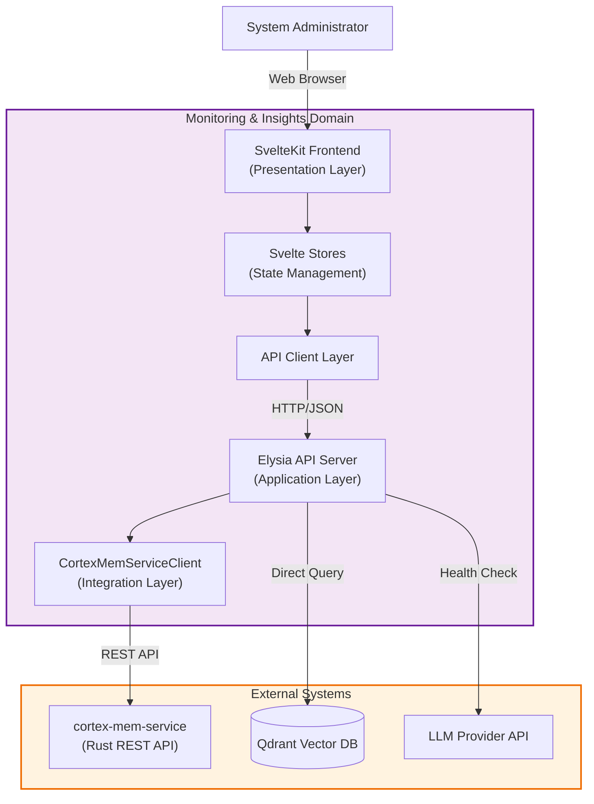
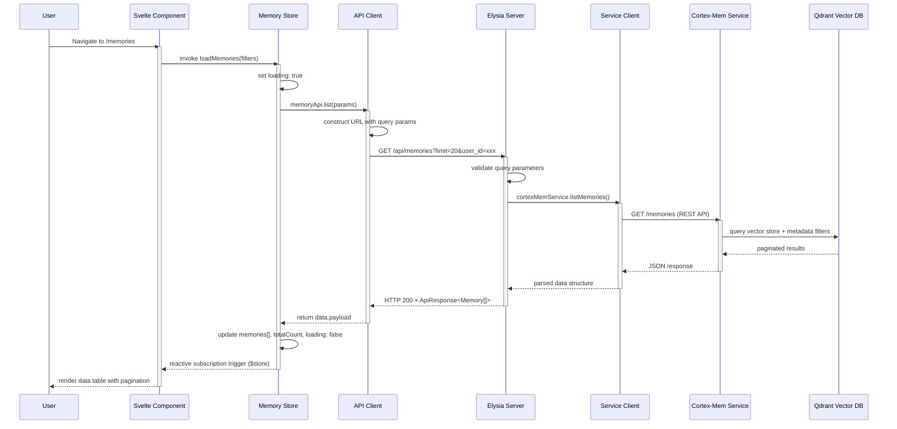

 **Cortex-Mem Technical Documentation: Monitoring and Insights Domain**

**Generation Time:** 2026-02-17 16:49:45 (UTC)  
**Document Version:** 1.0  
**Domain:** Monitoring and Insights (`cortex-mem-insights`)

---

## 1. Executive Summary

The **Monitoring and Insights Domain** provides the observability and management interface for the Cortex-Mem ecosystem. Implemented as a full-stack TypeScript application, this domain delivers a SvelteKit-based web dashboard combined with an Elysia API server, enabling real-time monitoring of memory operations, semantic search management, optimization workflow orchestration, and system health analytics.

Positioned within the Application Layer of the Cortex-Mem architecture, this domain serves as the primary human-machine interface for System Administrators and AI Agent Developers, offering visibility into memory utilization patterns, service health metrics, and maintenance operations while maintaining strict separation between presentation concerns and core business logic.

---

## 2. Architectural Overview

### 2.1 Domain Positioning

The Monitoring and Insights Domain operates as a **Backend-for-Frontend (BFF)** pattern implementation, aggregating data from the core Cortex-Mem services and external dependencies (Qdrant, LLM providers) into optimized payloads for the web interface.



### 2.2 Architectural Compliance

**Dependency Direction:** The domain strictly adheres to Clean Architecture principles with dependencies flowing inward:
- **Presentation Layer** (`routes/`, `components/`) depends on State Management
- **State Management** (`stores/`) depends on API Client
- **API Client** (`api/`) depends on Application Layer
- **Application Layer** (`server/`) depends on Integration Layer
- **Integration Layer** (`integrations/`) depends on External Services

**Note on Integration Pattern:** While the architecture primarily channels data through the `cortex-mem-service` REST API, the current implementation includes direct integration capabilities via `CortexMemServiceClient`. This design choice facilitates real-time monitoring requirements while maintaining the option to standardize exclusively through the REST API boundary for complete architectural purity.

---

## 3. Component Architecture

### 3.1 Backend Application Layer (Elysia Server)

The backend implements a modular HTTP server using the **Elysia** framework, organized by functional domain concerns:

**Core Server Configuration** (`src/server/index.ts`):
- CORS middleware configured for localhost development origins
- Global error handling hook returning standardized error envelopes: `{error: string, code: number, timestamp: string}`
- Modular route registration separating concerns into distinct API modules

**API Route Modules**:

| Module | Path | Responsibility |
|--------|------|----------------|
| **Memory Routes** | `/api/memories` | CRUD operations, semantic search, batch operations |
| **Optimization Routes** | `/api/optimization` | Task lifecycle management (start, status, cancel, history) |
| **System Routes** | `/api/system` | Health checks, metrics aggregation, service status |

**Type Safety** (`src/server/api/types.ts`):
Comprehensive TypeScript definitions (24+ interfaces) ensuring type safety across the API boundary:
```typescript
interface ApiResponse<T> {
  success: boolean;
  data?: T;
  error?: string;
  message?: string;
  timestamp: number;
}

interface MemoryResponse {
  id: string;
  content: string;
  memory_type: string;
  user_id?: string;
  agent_id?: string;
  importance: number;
  created_at: string;
  // ... additional metadata
}
```

### 3.2 Integration Layer (CortexMemServiceClient)

The `CortexMemServiceClient` class (`src/server/integrations/cortex-mem.ts`) encapsulates all external service communication:

**Capabilities**:
- **Memory Operations**: `listMemories()`, `getMemory()`, `createMemory()`, `updateMemory()`, `deleteMemory()`, `batchDelete()`
- **Semantic Search**: `searchMemories()` with configurable similarity thresholds
- **Optimization Lifecycle**: `startOptimization()`, `getOptimizationStatus()`, `cancelOptimization()`, `getOptimizationHistory()`, `analyzeBeforeOptimization()`
- **System Monitoring**: `getStats()`, `checkHealth()` with concurrent health checks using `Promise.allSettled()`
- **LLM Integration**: Direct health monitoring of LLM service endpoints

**Resilience Patterns**:
- Request timeouts: 3-5 seconds with `AbortController` implementation
- Graceful degradation: Returns default empty responses on network failures to prevent UI blocking
- Connection pooling via native `fetch` with keep-alive considerations

### 3.3 Frontend Presentation Layer (SvelteKit)

**Framework Configuration**:
- **Rendering Strategy**: Client-side rendering (SPA mode) with `ssr: false, csr: true` configuration
- **Routing**: File-system based routing with five primary views:
  - `/` (Dashboard Overview)
  - `/memories` (Memory Management)
  - `/analytics` (Statistical Visualizations)
  - `/monitor` (System Health)
  - `/optimization` (Maintenance Tasks)

**Component Architecture**:
- **Layout Components**: `+layout.svelte` provides navigation shell and global state initialization
- **Functional Components**: Modular Svelte components with reactive props and event dispatching:
  - `ServiceStatus.svelte`: Real-time service health indicators
  - `LanguageSwitcher.svelte`: Runtime i18n switching
  - `IssueDetailModal.svelte`: Diagnostic detail views
  - `Navigation.svelte`: Route-aware navigation with active state management

**Styling Strategy**:
- **Tailwind CSS**: Utility-first styling with responsive breakpoints
- **Dark Mode**: Comprehensive `dark:` prefix classes for theme switching
- **Design System**: Consistent color palette (primary: indigo/slate), spacing scale, and typography

### 3.4 State Management (Svelte Stores)

The domain implements a **reactive state architecture** using Svelte's built-in store system:

**Writable Stores** (Mutable State):
- `memoryStore`: Manages memory lists, pagination, filters, and selection state
- `optimizationStore`: Tracks optimization jobs, progress, and historical records
- `systemStore`: Maintains service health status, metrics, and system statistics
- `appStore`: Application-level state including connection status and global loading states

**Derived Stores** (Computed State):
- `optimizationStatus`: Calculates progress percentage from `processed_memories / total_memories`
- `recentOptimizations`: Sorted history with time-based filtering
- `memoryTypeDistribution`: Aggregated counts by memory category
- `systemHealth`: Composite health score derived from individual service statuses
- `performanceSummary`: Aggregated latency and throughput metrics

**Store Methods** (Actions):
Async operations with built-in loading state management:
```typescript
// Example: Optimization workflow
async function runOptimization(config: OptimizationConfig) {
  loading.set(true);
  try {
    const job = await optimizationApi.start(config);
    currentJob.set(job);
    pollJobStatus(job.id); // Initiates polling
  } catch (error) {
    error.set(error.message);
  } finally {
    loading.set(false);
  }
}
```

### 3.5 Internationalization System

**Implementation** (`src/lib/i18n/`):
- **Store-based i18n**: Writable `language` store with derived `t` (translate) function
- **Locale Files**: JSON-based translation dictionaries (EN, ZH, JA) with 150+ keys each
- **Key Structure**: Dot-notation hierarchical keys (e.g., `'optimization.status.running'`)
- **Parameter Interpolation**: Runtime variable substitution using `{param}` syntax with RegExp replacement
- **Persistence**: LocalStorage-based locale persistence with SSR-safe checks
- **Fallback Chain**: Automatic fallback to English for missing translation keys

---

## 4. Data Flows and Workflows

### 4.1 Memory Retrieval Workflow

The following sequence illustrates the layered data flow when retrieving memory records:



### 4.2 Real-time Optimization Monitoring

For long-running optimization tasks, the domain implements polling-based status tracking:

1. **Initiation**: User triggers optimization → Store calls `runOptimization()` → API returns jobId
2. **Polling**: Store initiates `setInterval` (2-second intervals) calling `getOptimizationStatus(jobId)`
3. **Progress Tracking**: Response includes `phase` (analyzing/executing/completed) and `progress_percentage`
4. **UI Updates**: Derived store calculates progress bars and status messages reactively
5. **Cleanup**: Polling stops on job completion or component destruction (`onDestroy` hook)

### 4.3 Semantic Search Execution

**Flow**:
1. **Input**: User enters natural language query with optional filters (memory_type, date range, similarity threshold)
2. **Vectorization**: Frontend sends query text to `/api/memories/search` endpoint
3. **Processing**: Backend delegates to `cortex-mem-service` which:
   - Generates embedding vector via LLM Integration Domain
   - Executes similarity search in Qdrant with metadata filtering
   - Returns ranked results with relevance scores
4. **Presentation**: Results flow back through stores to UI, displaying relevance scores and highlighted content

---

## 5. API Specification

### 5.1 Memory Management Endpoints

| Method | Endpoint | Description | Request Body/Params |
|--------|----------|-------------|---------------------|
| GET | `/api/memories` | List memories with filtering | `?user_id`, `?agent_id`, `?memory_type`, `?limit`, `?offset` |
| GET | `/api/memories/:id` | Retrieve specific memory | Path parameter: UUID |
| POST | `/api/memories` | Create new memory | `{content, memory_type, metadata, user_id, agent_id}` |
| PUT | `/api/memories/:id` | Update memory content | `{content, importance, metadata}` |
| DELETE | `/api/memories/:id` | Delete single memory | Path parameter: UUID |
| POST | `/api/memories/batch` | Batch operations | `{operation: 'delete\|export', ids: []}` |
| POST | `/api/memories/search` | Semantic similarity search | `{query, similarity_threshold: number, filters: {...}}` |

### 5.2 Optimization Management Endpoints

| Method | Endpoint | Description |
|--------|----------|-------------|
| POST | `/api/optimization` | Start optimization job |
| GET | `/api/optimization/:jobId` | Get job status and progress |
| POST | `/api/optimization/:jobId/cancel` | Cancel running job |
| GET | `/api/optimization/history` | List historical optimizations |
| POST | `/api/optimization/analyze` | Dry-run analysis before optimization |

### 5.3 System Monitoring Endpoints

| Method | Endpoint | Description |
|--------|----------|-------------|
| GET | `/api/system/status` | Overall system status summary |
| GET | `/api/system/health` | Health check for all dependencies |
| GET | `/api/system/metrics` | Performance metrics and statistics |
| GET | `/api/system/stats` | Aggregated memory statistics |

---

## 6. Implementation Details

### 6.1 Error Handling Strategy

The domain implements a **layered error handling** approach:

1. **Integration Layer**: Catches network errors, timeouts, and HTTP non-2xx responses; returns structured error objects with fallback defaults
2. **API Layer**: Elysia's `onError` hook catches unhandled exceptions, logs stack traces, and returns standardized error envelopes
3. **Store Layer**: Wraps async calls in try-catch blocks, updating `error` state for UI display while maintaining `loading` state consistency
4. **UI Layer**: Components subscribe to error states, displaying toast notifications or inline error messages with retry mechanisms

### 6.2 Performance Optimizations

**Frontend**:
- **Store Laziness**: Data fetching only occurs on route navigation or explicit user action
- **Pagination**: Server-side pagination with configurable page sizes (default 20 items)
- **Memoization**: Derived stores cache computed values (e.g., sorted lists, aggregated statistics)
- **Debouncing**: Search input fields use debouncing (300ms) to prevent excessive API calls

**Backend**:
- **Concurrent Health Checks**: `Promise.allSettled()` parallelizes status checks for Vector Store and LLM Service
- **Response Caching**: Optimization history and system stats utilize short-term in-memory caching (configurable TTL)
- **Streaming Preparation**: API structure supports future migration to Server-Sent Events (SSE) for real-time updates

### 6.3 Security Considerations

- **CORS Configuration**: Restricted to localhost origins in development; production configurations support explicit domain whitelisting
- **Credential Handling**: API client uses `credentials: 'include'` for cookie-based authentication sessions
- **Input Validation**: Elysia's type-safe request validation prevents malformed inputs from reaching core services
- **URI Encoding**: All query parameters and path segments are properly encoded to prevent injection attacks

---

## 7. Integration with External Systems

### 7.1 Cortex-Mem Core Service Integration

The domain maintains two integration paths with the core Rust-based services:

1. **Primary Path** (Recommended): HTTP REST API via `cortex-mem-service` for all CRUD operations
2. **Direct Path** (Current Implementation): Direct library linking for high-frequency monitoring operations (noted as architectural gap with recommendation to migrate to REST API exclusively)

### 7.2 Vector Database Access

For analytics and health monitoring, the Insights server may query Qdrant directly for:
- Collection statistics (vector count, storage size)
- Index health verification
- Latency measurements for vector operations

This direct access is read-only and restricted to monitoring operations; all write operations flow through the core service.

### 7.3 LLM Service Health Monitoring

The domain performs active health checks against LLM providers (OpenAI, Azure, Local) to verify:
- API endpoint accessibility
- Authentication token validity
- Response latency metrics
- Model availability

---

## 8. Configuration and Deployment

### 8.1 Environment Configuration

**Required Environment Variables**:
- `VITE_API_BASE_URL`: Base URL for the Elysia API server (frontend)
- `CORTEX_MEM_SERVICE_URL`: URL for the Rust core service (backend integration)
- `QDRANT_URL`, `QDRANT_API_KEY`: Vector database connection (optional for direct monitoring)
- `PORT`: Elysia server port (default: 3000)

**Configuration Files**:
- `vite.config.ts`: Frontend build configuration with proxy settings for API development
- `src/server/config.ts`: Backend runtime configuration (if separated from environment)

### 8.2 Deployment Topology

**Development Mode**:
```
[cortex-mem-insights dev server] ←→ [cortex-mem-service] ←→ [Qdrant + FS]
       ↓ (HMR)
[SvelteKit Frontend]
```

**Production Mode**:
```
[Reverse Proxy (Nginx/Traefik)]
    ├─→ [cortex-mem-insights (Docker)] 
    │       └─→ [cortex-mem-service]
    └─→ [Static Files (CDN)] (optional build output)
```

### 8.3 Build Process

**Frontend Build**:
```bash
npm run build
# Outputs: Static SPA in build/ directory or Node adapter output
```

**Backend Preparation**:
The Elysia server is bundled using Bun or Node.js with TypeScript compilation, producing a single executable or Docker image containing both the API server and static frontend assets (when using adapter-static or adapter-node).

---

## 9. Future Architectural Evolution

Based on current gaps identified in the research, the following evolutionary paths are recommended:

1. **API Gateway Standardization**: Migrate all direct core library integrations to proceed exclusively through the `cortex-mem-service` REST API to maintain architectural boundary integrity

2. **WebSocket Implementation**: Replace polling-based status updates with WebSocket or Server-Sent Events (SSE) for real-time optimization progress and system alerts

3. **GraphQL Layer**: Consider adding a GraphQL endpoint to reduce over-fetching and enable flexible frontend data requirements, particularly for the Analytics views

4. **WASM Integration**: Compile performance-critical client-side logic (e.g., date formatting, statistical calculations) to WebAssembly for improved responsiveness

---

## 10. Conclusion

The Monitoring and Insights Domain successfully delivers a comprehensive observability layer for the Cortex-Mem ecosystem through its layered TypeScript architecture. By combining the reactive capabilities of SvelteKit with the type-safe performance of Elysia, the domain provides System Administrators and Developers with critical visibility into memory operations, system health, and optimization workflows while maintaining clean architectural boundaries with the core Rust-based services.

The modular design facilitates independent scaling of the web interface and API layers, with clear extension points for additional monitoring capabilities, visualization types, and internationalization locales as the ecosystem evolves.