# Cortex-Mem Technical Documentation: Monitoring and Insights Domain

**Generation Time:** 2026-02-18  
**Document Version:** 2.0  
**Domain:** Monitoring and Insights (`cortex-mem-insights`)

---

## 1. Executive Summary

The **Monitoring and Insights Domain** provides the observability and management interface for the Cortex-Mem ecosystem. Implemented as a pure frontend Single Page Application (SPA) using Svelte 5, this domain delivers a web dashboard for monitoring memory operations, browsing memory files, and performing semantic search across the Cortex-Mem service.

Positioned within the Application Layer of the Cortex-Mem architecture, this domain serves as the primary human-machine interface for System Administrators and AI Agent Developers, offering visibility into tenant management, memory storage statistics, and file browsing while maintaining strict separation between presentation concerns and core business logic.

---

## 2. Architectural Overview

### 2.1 Domain Positioning

The Monitoring and Insights Domain operates as a **pure frontend application** that communicates directly with the `cortex-mem-service` REST API. Unlike traditional Backend-for-Frontend (BFF) patterns, this implementation delegates all data operations to the backend service, keeping the frontend lightweight and maintainable.


### 2.2 Architectural Compliance

**Dependency Direction:** The domain strictly adheres to Clean Architecture principles:
- **Presentation Layer** (`pages/`, `components/`) depends on State Management
- **State Management** (`stores/`) depends on API Client
- **API Client** (`api.ts`) depends on External Services via HTTP

**Technology Stack:**
- **Frontend Framework:** Svelte 5.19.0 with Runes syntax (`$state`, `$effect`, `$derived`)
- **Build Tool:** Vite 6.1.0
- **Language:** TypeScript 5.7.3
- **Routing:** Client-side manual routing (not SvelteKit file-system routing)
- **Styling:** CSS with CSS Variables for theming

---

## 3. Component Architecture

### 3.1 Application Structure

```
cortex-mem-insights/src/
├── App.svelte              # Main application entry with client-side routing
├── main.ts                 # TypeScript entry point
├── app.css                 # Global styles with CSS variables
├── lib/
│   ├── api.ts              # API client for cortex-mem-service
│   ├── types.ts            # TypeScript type definitions
│   ├── components/
│   │   └── TenantSelector.svelte  # Tenant selection component
│   ├── pages/
│   │   ├── Dashboard.svelte       # Dashboard with tenant overview
│   │   ├── Memories.svelte        # File browser for memory files
│   │   └── Search.svelte          # Semantic search interface
│   └── stores/
│       └── tenant.ts              # Tenant state management
└── routes/                 # Not used (no SvelteKit routing)
```

### 3.2 Client-Side Routing

The application implements manual client-side routing in `App.svelte`:

```typescript
let currentPath = $state(window.location.pathname);

function navigate(path: string) {
  window.history.pushState({}, '', path);
  currentPath = path;
}

// Page rendering based on currentPath
{#if currentPath === '/'}
  <Dashboard />
{:else if currentPath.startsWith('/memories')}
  <Memories />
{:else if currentPath.startsWith('/search')}
  <Search />
{/if}
```

**Available Routes:**
| Route | Component | Description |
|-------|-----------|-------------|
| `/` | Dashboard | Tenant overview, system status, storage statistics |
| `/memories` | Memories | File browser for cortex:// URIs |
| `/search` | Search | Semantic search across memory content |

### 3.3 API Client Layer

The `ApiClient` class (`src/lib/api.ts`) encapsulates all HTTP communication with the backend:

**Capabilities:**
- **Health Check:** `getHealth()` - Service status and LLM availability
- **Tenant Operations:** `listTenants()`, `switchTenant(tenantId)`
- **Filesystem Operations:** `listDirectory(uri)`, `readFile(path)`, `writeFile(path, content)`, `getDirectoryStats(uri)`
- **Session Operations:** `getSessions()` - List all sessions
- **Search Operations:** `search(keyword, scope, limit)` - Semantic search with filters

**Response Handling:**
```typescript
interface ApiResponse<T> {
  success: boolean;
  data: T | null;
  error: string | null;
  timestamp: string;
}
```

### 3.4 State Management

The domain uses Svelte 5's reactive stores for state management:

**Tenant Store** (`stores/tenant.ts`):
```typescript
// Writable stores
export const tenants = writable<string[]>([]);
export const currentTenant = writable<string | null>(null);
export const tenantInfo = writable<Map<string, TenantInfo>>(new Map());

// Derived stores and actions
export async function initTenants() { ... }
export async function switchTenant(tenantId: string) { ... }
export async function loadTenantInfo(tenant: string) { ... }
```

### 3.5 Type Definitions

**Core Types** (`lib/types.ts`):
```typescript
interface HealthStatus {
  status: string;
  service: string;
  version: string;
  llm_available: boolean;
}

interface FileEntryResponse {
  uri: string;
  name: string;
  is_directory: boolean;
  size: number;
  modified: string;
}

interface SearchResult {
  uri: string;
  score: number;
  snippet: string;
  content?: string;
  source: string;
}
```

---

## 4. Data Flows and Workflows

### 4.1 Application Initialization

```mermaid
sequenceDiagram
    participant Browser
    participant App
    participant Dashboard
    participant Store as Tenant Store
    participant API as API Client
    participant Service as cortex-mem-service

    Browser->>App: Load page
    App->>Dashboard: Render Dashboard component
    Dashboard->>API: getHealth() + listTenants()
    API->>Service: GET /health + GET /api/v2/tenants/tenants
    Service-->>API: Health + Tenant list
    API-->>Dashboard: Response data
    Dashboard->>Store: Update tenants list
    loop For each tenant
        Dashboard->>API: getDirectoryStats(tenant)
        API->>Service: GET /api/v2/filesystem/stats?uri=...
        Service-->>API: Stats response
        API-->>Dashboard: Tenant info
        Dashboard->>Store: Update tenantInfo map
    end
    Dashboard-->>Browser: Render tenant table
```



### 4.2 Tenant Switching

1. **User Action:** Click "Select" button on tenant row
2. **State Update:** Call `switchTenant(tenantId)` in tenant store
3. **API Call:** `POST /api/v2/tenants/tenants/switch` with `{ tenant_id: string }`
4. **Response:** Backend updates active tenant context
5. **UI Update:** Current tenant is highlighted, data is refreshed

### 4.3 File Browsing Workflow

1. **Navigate:** User navigates to `/memories`
2. **Load:** Component fetches directory listing via `listDirectory(uri)`
3. **Display:** File entries are rendered in a table with icons for files/folders
4. **Drill-down:** Clicking a directory updates the current URI
5. **Read:** Clicking a file fetches content via `readFile(path)`

### 4.4 Semantic Search Workflow

1. **Input:** User enters search query in Search page
2. **Scope Selection:** Choose search scope (all, user, system)
3. **API Call:** `POST /api/v2/search` with query and filters
4. **Results:** Search results displayed with relevance scores and snippets
5. **Drill-down:** Click result to view full content

---

## 5. API Integration

The frontend integrates with the following `cortex-mem-service` endpoints:

### 5.1 Health Endpoints

| Method | Endpoint | Description |
|--------|----------|-------------|
| GET | `/health` | Service health check with LLM status |

### 5.2 Tenant Endpoints

| Method | Endpoint | Description |
|--------|----------|-------------|
| GET | `/api/v2/tenants/tenants` | List all available tenants |
| POST | `/api/v2/tenants/tenants/switch` | Switch active tenant |

### 5.3 Filesystem Endpoints

| Method | Endpoint | Description |
|--------|----------|-------------|
| GET | `/api/v2/filesystem/list?uri=` | List directory contents |
| GET | `/api/v2/filesystem/read/*path` | Read file content |
| POST | `/api/v2/filesystem/write` | Write file content |
| GET | `/api/v2/filesystem/stats?uri=` | Get directory statistics |

### 5.4 Session Endpoints

| Method | Endpoint | Description |
|--------|----------|-------------|
| GET | `/api/v2/sessions` | List all sessions |

### 5.5 Search Endpoints

| Method | Endpoint | Description |
|--------|----------|-------------|
| POST | `/api/v2/search` | Semantic search with query |

---

## 6. Implementation Details

### 6.1 Error Handling Strategy

The domain implements error handling at multiple levels:

1. **API Layer:** HTTP errors are caught and thrown with descriptive messages
2. **Component Layer:** Errors are captured in state and displayed to users
3. **Fallback:** Graceful degradation with loading states and error messages

```typescript
try {
  const data = await apiClient.listDirectory(uri);
  // Process data
} catch (e) {
  error = e instanceof Error ? e.message : 'Failed to load data';
} finally {
  loading = false;
}
```

### 6.2 Performance Optimizations

- **Concurrent Requests:** `Promise.all()` for independent API calls (health + tenants)
- **Sequential Loading:** Tenant info loaded sequentially to avoid race conditions
- **Lazy Loading:** Data only fetched on component mount or user action
- **Debouncing:** Search input uses debouncing to prevent excessive API calls

### 6.3 Styling Architecture

- **CSS Variables:** Consistent theming via CSS custom properties
- **Component Scoped Styles:** `<style>` blocks within Svelte components
- **Responsive Design:** Flexbox and grid layouts for responsive UI

**Key CSS Variables:**
```css
:root {
  --bg-card: #ffffff;
  --bg-hover: #f3f4f6;
  --border: #e5e7eb;
  --text-primary: #111827;
  --text-secondary: #6b7280;
  --primary: #3b82f6;
}
```

---

## 7. Configuration and Deployment

### 7.1 Environment Configuration

**Build Configuration** (`vite.config.ts`):
- Development server proxy for API requests
- Production build output to `dist/`

**Runtime Configuration:**
- API base URL: `/api/v2` (configurable in `api.ts`)

### 7.2 Deployment Topology

**Development Mode:**
```
[Vite Dev Server :5173] ←→ [cortex-mem-service :8085] ←→ [Filesystem + Qdrant]
         ↓ (Proxy /api/v2/*)
[Svelte SPA with HMR]
```

**Production Mode:**
```
[Reverse Proxy (Nginx/Traefik)]
    ├─→ [Static Files (dist/)]
    └─→ [cortex-mem-service :8085]
```

### 7.3 Build Process

```bash
# Install dependencies
bun install

# Development server
bun run dev

# Production build
bun run build

# Preview production build
bun run preview
```

---

## 8. Key Differences from Previous Architecture

This document reflects significant architectural changes from the previous version:

| Previous Architecture | Current Architecture |
|----------------------|---------------------|
| Backend-for-Frontend (BFF) with Elysia server | Pure frontend SPA |
| SvelteKit file-system routing | Manual client-side routing |
| 5+ page routes (analytics, monitor, optimization) | 3 core pages (Dashboard, Memories, Search) |
| Complex optimization and system monitoring APIs | Focused on tenant management and file browsing |
| WebSocket/SSE for real-time updates | REST API only |
| Internationalization (EN/ZH/JA) | No i18n support |
| 24+ TypeScript interfaces | 5 core interfaces |

---

## 9. Future Considerations

Based on the current architecture, the following enhancements could be considered:

1. **SvelteKit Migration:** Adopt SvelteKit for file-system based routing and SSR capabilities
2. **Real-time Updates:** WebSocket integration for live tenant statistics
3. **Internationalization:** Add i18n support for multi-language users
4. **Dark Mode:** Enhanced theming with dark mode support
5. **Export Functionality:** Add ability to export memory data

---

## 10. Conclusion

The Monitoring and Insights Domain provides a streamlined, maintainable web interface for the Cortex-Mem ecosystem. By adopting a pure frontend architecture with direct REST API integration, the domain achieves simplicity and performance while delivering essential monitoring and management capabilities for System Administrators and Developers.

The modular component structure and reactive state management facilitate future enhancements and maintenance, with clear separation between presentation concerns and backend data operations.