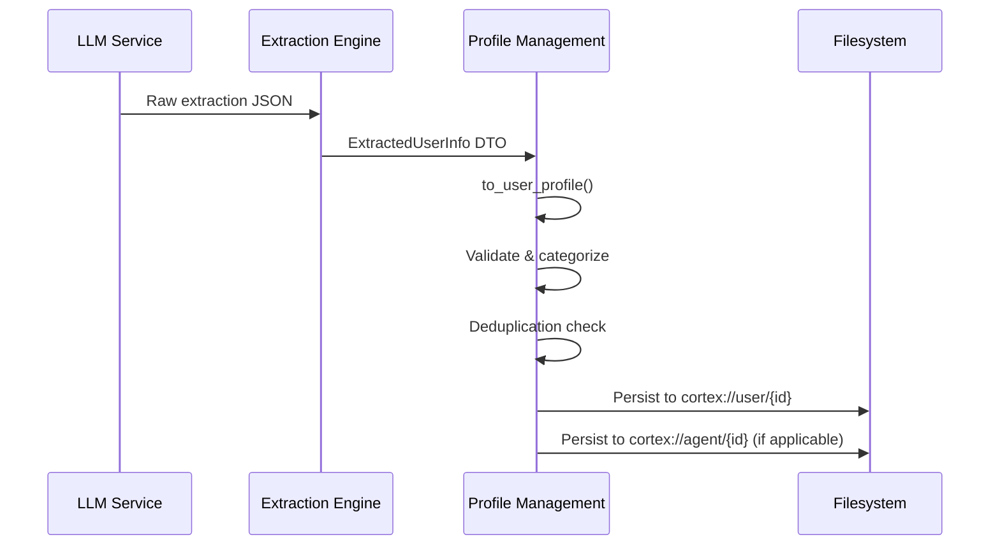

 **Profile Management Domain Technical Documentation**

## 1. Domain Overview

The **Profile Management Domain** is a core business domain within the Cortex-Mem system responsible for aggregating, validating, and persisting structured user and agent profiles derived from conversational memory extraction. This domain implements a categorical knowledge storage system that enables AI agents to maintain persistent, context-aware personalization across sessions.

The domain serves as the persistent memory layer for user-specific knowledge (preferences, goals, personal history) and agent-specific learning (decisions, skills), ensuring that extracted insights survive session boundaries and contribute to cumulative intelligence.

## 2. Architectural Position

Within the Cortex-Mem layered architecture, the Profile Management Domain resides in the **Core Business Domain** layer, encapsulated within the `cortex-mem-core` crate. It maintains tight integration with:

- **Extraction Engine Domain**: Consumes structured extraction outputs (`ExtractedUserInfo`) generated from LLM-based conversation analysis
- **Automation Management Domain**: Receives triggered updates from the `AutoExtractor` upon session closure events
- **Core Infrastructure Domain**: Utilizes filesystem abstraction (`cortex://` URI scheme) for persistent storage and the event bus for change notifications

```
Domain Dependency Flow:
Extraction Engine → Profile Management → Core Infrastructure
      (Raw Data)       (Aggregation)       (Persistence)
```

## 3. Core Data Structures

The domain implements a three-tier data transformation pipeline that ensures data integrity and provenance tracking:

### 3.1 ExtractedUserInfo (DTO Layer)
Raw deserialization target for LLM extraction outputs. Contains unstructured candidate facts before validation and categorization.

### 3.2 UserInfoItem (Entity Layer)
Validated, versioned data points with full provenance metadata:
- **Content**: The factual statement or preference
- **Category**: Classification (PersonalInfo, WorkHistory, Preferences, Relationships, Goals)
- **Confidence**: Floating-point score clamped to [0.0, 1.0] representing extraction certainty
- **Importance**: Integer rank clamped to [0, 10] representing significance
- **Source Tracking**: `source_session`, `extracted_at`, `updated_at` timestamps
- **Versioning**: Incremental version counter for conflict resolution

### 3.3 UserProfile (Aggregate Root)
Container managing category-segregated vectors of `UserInfoItem`:
```rust
// Conceptual structure
UserProfile {
    personal_info: Vec<UserInfoItem>,
    work_history: Vec<UserInfoItem>,
    preferences: Vec<UserInfoItem>,
    relationships: Vec<UserInfoItem>,
    goals: Vec<UserInfoItem>,
    // Metadata: created_at, updated_at, version
}
```

## 4. Profile Categories

The domain organizes knowledge into five semantic categories to optimize retrieval and context injection:

| Category | Description | Example Data |
|----------|-------------|--------------|
| **PersonalInfo** | Demographics, identifiers, static attributes | "User prefers email over Slack", "Timezone: PST" |
| **WorkHistory** | Professional background, project context | "Previously worked on Cortex-Mem indexing", "Rust expertise" |
| **Preferences** | Behavioral patterns, interface choices | "Prefers concise responses", "Dark mode preference" |
| **Relationships** | Social connections, organizational context | "Reports to Engineering Manager", "Collaborates with Design team" |
| **Goals** | Objectives, aspirations, task tracking | "Learning Rust async patterns", "Q2 deliverable: Documentation" |

*Note: Agent profiles utilize a parallel structure focused on `AgentProfile` with categories specific to learned skills and decision history.*

## 5. Data Validation & Versioning

### 5.1 Input Validation
The domain enforces strict validation at the boundary during `add_item()` operations:
- **Confidence Clamping**: Values outside [0.0, 1.0] are clamped to nearest boundary
- **Importance Bounds**: Values outside [0, 10] are constrained using `min(10, max(0, value))`
- **Content Sanitization**: Trimming and normalization of whitespace

### 5.2 Optimistic Versioning
Each `UserInfoItem` maintains an internal version counter:
- Initial version: 1
- Incremented on each update to the same semantic item (deduplication match)
- Enables conflict resolution when merging profiles from different sessions

### 5.3 Temporal Metadata
- **`extracted_at`**: UTC timestamp of initial extraction (immutable)
- **`updated_at`**: UTC timestamp of last modification (updates on merge)
- **`source_session`**: URI reference to originating conversation (`cortex://session/{id}`)

## 6. Key Operations

### 6.1 Profile Construction
**`to_user_profile(source_session: String) -> UserProfile`**
Transforms raw `ExtractedUserInfo` into a validated `UserProfile`:
1. Iterates through extraction results by category
2. Constructs `UserInfoItem` for each fact with current UTC timestamps
3. Applies validation clamps to confidence and importance
4. Initializes versioning metadata

### 6.2 Category Management
**`add_item(category: Category, item: UserInfoItem)`**
- Validates input bounds
- Appends to appropriate category vector
- Updates aggregate timestamps
- Triggers deduplication if configured

**`get_category(category: Category) -> &[UserInfoItem]`**
- Immutable access to category-specific facts
- Used for context injection into LLM prompts

**`get_category_mut(category: Category) -> &mut Vec<UserInfoItem>`**
- Mutable access for bulk updates and merging

### 6.3 Export & Serialization
**`to_json() -> String`**
- Serde-based JSON serialization for API responses and storage
- Preserves all metadata and versioning

**`to_markdown() -> String`**
- Human-readable formatting for debugging and reporting
- Category headers with bullet-pointed facts
- Confidence scores shown as visual indicators (e.g., `▓▓▓▓░ 0.8`)

## 7. Integration with Extraction Pipeline

The Profile Management Domain participates in the **Memory Extraction and Profiling Process**:



**Deduplication Strategy**:
- String similarity matching using Longest Common Subsequence (LCS) or semantic embedding comparison
- Threshold-based merging: if similarity > 0.85, merge and increment version rather than append
- Category size limits enforced (e.g., max 100 facts per category) with FIFO eviction for lowest importance/confidence items

## 8. Persistence Model

Profiles utilize the **Cortex Filesystem Abstraction** with tenant-aware scoping:

### 8.1 Storage URIs
- **User Profiles**: `cortex://user/{user_id}/profile.json`
- **Agent Profiles**: `cortex://agent/{agent_id}/profile.json`
- **Tenant Isolation**: Automatically scoped to `/data/tenants/{tenant_id}/user/` or `/data/tenants/{tenant_id}/agent/`

### 8.2 Serialization Format
JSON storage with the following schema characteristics:
- Top-level metadata (version, updated_at)
- Category-named arrays containing structured items
- Compact encoding to minimize storage overhead while maintaining readability

### 8.3 Atomic Updates
File writes utilize atomic rename operations to prevent corruption during concurrent access across multiple interfaces (CLI vs. HTTP API vs. MCP).

## 9. Multi-Tenancy Considerations

The domain enforces **tenant isolation** at the persistence boundary:
- Profile lookups automatically filter by `tenant_id` propagated from the request context
- No cross-tenant profile leakage: queries for `cortex://user/{id}` resolve to tenant-scoped paths
- Separate vector storage collections per tenant (though profiles primarily use filesystem storage)

## 10. Implementation Details

### 10.1 Technology Stack
- **Language**: Rust
- **Serialization**: `serde` with `serde_json` for JSON handling
- **Temporal**: `chrono` crate for UTC timestamp management
- **Storage**: Filesystem abstraction via `CortexFilesystem` (async I/O)

### 10.2 Performance Characteristics
- **Time Complexity**: O(n) for category retrieval where n = items in category
- **Memory**: Lazy loading pattern; profiles loaded on-demand during extraction or query operations
- **Concurrency**: Profile updates are processed sequentially per user/agent ID to prevent write conflicts

### 10.3 Error Handling
The domain utilizes the `CortexError` type system:
- `ValidationError`: Input violations (confidence > 1.0, etc.)
- `PersistenceError`: Filesystem I/O failures
- `SerializationError`: JSON encoding/decoding failures

## 11. Usage Patterns

### 11.1 Automatic Profile Enrichment
Triggered by `SessionEvent::Closed` via the Automation Manager:
```rust
// Pseudo-code flow
auto_extractor.extract_from_thread(thread_id)
    .map(|extracted| profile_manager.merge(extracted))
    .await?;
```

### 11.2 Context Injection
Retrieving profiles for LLM prompt augmentation:
```rust
let user_prefs = profile.get_category(Category::Preferences);
let context_prompt = format!("User preferences: {:?}", user_prefs);
```

This domain ensures that Cortex-Mem maintains a comprehensive, evolving understanding of users and agents, enabling truly persistent and personalized AI interactions across sessions.