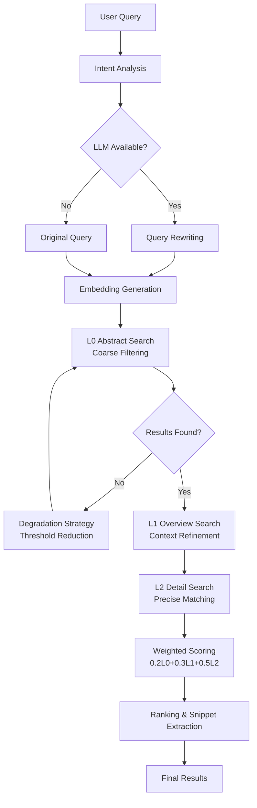

 **Technical Documentation: Search Engine Domain**

**Module:** `cortex-mem-core/src/search/vector_engine.rs`  
**Domain:** Core Business Domain  
**Version:** 1.0  
**Last Updated:** 2026-02-19 04:06:14 (UTC)

---

## 1. Executive Overview

The **Search Engine Domain** implements an intelligent, multi-layered semantic search system that enables context-aware memory retrieval across the Cortex-Mem platform. It serves as the primary retrieval mechanism for the AI agent memory system, supporting operations across all memory dimensions (user, agent, session, and resources).

### 1.1 Business Value
- **Precision Retrieval**: Delivers contextually relevant memories through hierarchical semantic analysis
- **Scalable Architecture**: Handles large memory corpora through progressive refinement (L0→L1→L2)
- **Adaptive Intelligence**: Dynamically adjusts search strategies based on query intent and result quality
- **Multi-Tenancy Support**: Enforces data isolation while maintaining search performance across tenants

---

## 2. Architectural Design

### 2.1 High-Level Architecture

The Search Engine implements a **three-tier retrieval pattern** with weighted aggregation, designed to balance computational efficiency with search precision:



### 2.2 Core Components

| Component | Responsibility | Technology Stack |
|-----------|----------------|------------------|
| **Vector Search Engine** | Orchestrates layered retrieval and scoring | Rust, Async/Await, Tokio |
| **Embedding Client** | Generates dense vector representations | OpenAI-compatible APIs |
| **Qdrant Vector Store** | Persistence and similarity search | Qdrant (gRPC/HTTP) |
| **Intent Detector** | Classifies query types for adaptive thresholding | Pattern matching, Heuristics |
| **Layer Manager** | Provides L0/L1 summary access | Filesystem + LLM caching |
| **Snippet Extractor** | Generates contextual text windows | String processing, Regex |

---

## 3. The Three-Layer Retrieval Model

The system implements a **progressive disclosure** pattern inspired by the TARS/OpenViking memory specification, searching across three abstraction levels:

### 3.1 Layer Definitions

| Layer | Content Type | File Suffix | Search Purpose | Weight |
|-------|--------------|-------------|----------------|--------|
| **L0 (Abstract)** | High-level summaries | `.abstract.md` | Broad semantic filtering | 20% |
| **L1 (Overview)** | Structured key points | `.overview.md` | Context refinement | 30% |
| **L2 (Detail)** | Raw conversation content | `.md` (full) | Precise semantic matching | 50% |

### 3.2 Hierarchical Search Strategy

**Phase 1: L0 Coarse Filtering**  
The engine first searches L0 abstracts using an adaptive similarity threshold (default 0.5). This layer acts as a coarse sieve, identifying candidate directories that broadly match the query semantics without expensive full-text processing.

**Phase 2: L1 Context Refinement**  
For directories with matching L0 content, the engine retrieves L1 overview vectors. This layer provides structured context (key topics, entities, decisions) that refines the initial candidate set.

**Phase 3: L2 Precise Matching**  
Within high-scoring candidate directories, the engine performs detailed semantic search against full message content. For timeline directories, this involves iterating through individual messages; for resource directories, direct content comparison.

**Phase 4: Weighted Aggregation**  
Final scores are computed using the weighted formula:
```
Combined Score = (0.2 × L0_Score) + (0.3 × L1_Score) + (0.5 × L2_Score)
```

---

## 4. Query Processing Pipeline

### 4.1 Intent Detection & Adaptive Thresholding

The engine classifies incoming queries into five intent categories to optimize retrieval parameters:

| Intent Type | Characteristics | Adaptive Threshold | Use Case |
|-------------|----------------|-------------------|----------|
| **Factual** | "What is...", "When did..." | 0.4 | Entity lookup, specific facts |
| **Search** | "Find...", "Look for..." | 0.5 | General content discovery |
| **Relational** | "How is X related to Y" | 0.5 | Connection analysis |
| **Temporal** | "Last week...", "Yesterday..." | 0.5 | Time-bound retrieval |
| **General** | Open-ended questions | 0.5 | Broad exploration |

**Implementation Note**: Thresholds adjust dynamically; factual queries use lower thresholds (0.4) to ensure recall of specific entities, while general queries maintain higher precision (0.5).

### 4.2 Query Enhancement (Optional)

When an LLM client is available, the engine performs **query rewriting** to expand or disambiguate user input:
- **Synonym Expansion**: Adding semantically related terms
- **Context Enrichment**: Incorporating user/agent profile context
- **Disambiguation**: Clarifying ambiguous pronouns or references

### 4.3 Vector Generation

Query text is converted to dense embeddings using the configured embedding model (default: OpenAI-compatible APIs). The resulting vector serves as the search key for similarity computation across all layers.

---

## 5. Robustness: Degradation Strategies

The engine implements **graceful degradation** to ensure result delivery even when optimal conditions are not met:

### 5.1 Threshold Relaxation
If L0 search returns no results above the initial threshold:
1. **First Retry**: Reduce threshold 0.5 → 0.4
2. **Second Retry**: Reduce threshold 0.4 → 0.3
3. **Final Fallback**: Execute full semantic search across L2 layer (bypassing L0/L1 optimization)

### 5.2 Filesystem Fallback
For unindexed L2 content (vectors not yet generated), the engine falls back to filesystem reads:
- Reads raw markdown content from `cortex://` URIs
- Assigns L2 score of 0.0 (weighted contribution from L0/L1 only)
- Useful for real-time content not yet synchronized to vector store

---

## 6. Result Processing

### 6.1 Snippet Generation
For each qualifying result, the engine extracts contextual snippets:
- **Context Window**: 100 characters before/after match
- **Maximum Length**: 200 characters total
- **Highlighting**: Query term emphasis for UI presentation

### 6.2 Metadata Filtering
Results are post-filtered based on:
- **Tenant Isolation**: `tenant_id` strict matching
- **Temporal Bounds**: `created_at` range filtering
- **Entity Constraints**: Specific participant or dimension filtering
- **URI Prefix Scoping**: Limiting search to specific memory dimensions (user/agent/session)

---

## 7. Integration Interfaces

### 7.1 Public API Surface

The module exposes two primary async interfaces:

```rust
// Direct semantic search (bypasses layered optimization)
pub async fn semantic_search(
    &self,
    query: &str,
    options: SearchOptions
) -> Result<Vec<SearchResult>, SearchError>

// Layered retrieval with intent detection and degradation
pub async fn layered_semantic_search(
    &self,
    query: &str,
    options: SearchOptions
) -> Result<Vec<SearchResult>, SearchError>
```

### 7.2 Dependency Injection

The engine maintains thread-safe references to external services via `Arc`:

```rust
pub struct VectorSearchEngine {
    vector_store: Arc<dyn QdrantVectorStore>,
    embedding_client: Arc<dyn EmbeddingClient>,
    filesystem: Arc<dyn CortexFilesystem>,
    llm_client: Option<Arc<dyn LLMClient>>, // Optional
}
```

### 7.3 Cross-Domain Interactions

| Target Domain | Interaction Pattern | Purpose |
|---------------|-------------------|---------|
| **Layer Management** | Service Call | Retrieve L0/L1 summaries |
| **Vector Storage** | Service Call | Execute similarity searches |
| **Core Infrastructure** | Composition | Access filesystem and embedding clients |
| **Automation Management** | Event Consumption | Re-index updated memories |

---

## 8. Configuration & Tuning

### 8.1 Search Parameters

| Parameter | Default | Description |
|-----------|---------|-------------|
| `limit` | 10 | Maximum results returned |
| `threshold` | Adaptive (0.4-0.5) | Minimum similarity score |
| `scope` | All dimensions | URI prefix filter (user/agent/session) |
| `include_content` | false | Return full text vs. snippets |

### 8.2 Performance Optimization

- **Batch Processing**: L2 searches within directories are batched to minimize vector store round-trips
- **Caching**: L0/L1 summaries are filesystem-cached to avoid repeated LLM generation
- **Tenant Isolation**: Collection suffixing (`cortex-mem-{tenant_id}`) ensures query-time filtering is unnecessary, improving performance

---

## 9. Implementation Details

### 9.1 Concurrency Model
- **Async/Await**: All I/O operations (vector search, filesystem, LLM) are non-blocking
- **Thread Safety**: Dependencies shared via `Arc`, preventing data races across concurrent search requests
- **Cancellation Safety**: Long-running searches respect Tokio cancellation tokens

### 9.2 Error Handling
- **Malformed URIs**: Graceful handling with warning logs
- **Missing Vectors**: Fallback to filesystem content
- **LLM Unavailability**: Degrades to original query (no rewriting)
- **Vector Store Timeout**: Retries with exponential backoff

### 9.3 Cosine Similarity
Similarity scores are computed using cosine distance between normalized vectors:
```
score = (query_vector · document_vector) / (||query|| × ||document||)
```

---

## 10. Usage Examples

### 10.1 Basic Search
```rust
let results = engine.layered_semantic_search(
    "machine learning project requirements",
    SearchOptions {
        limit: 5,
        threshold: 0.5,
        scope: Some("cortex://session/"),
        ..Default::default()
    }
).await?;
```

### 10.2 Factual Lookup (Lower Threshold)
```rust
let facts = engine.layered_semantic_search(
    "user's database password", // Factual intent detected
    SearchOptions {
        threshold: 0.4, // Automatically adjusted if intent detection enabled
        limit: 3,
        ..Default::default()
    }
).await?;
```

---

## 11. Monitoring & Observability

Key metrics to monitor:
- **Layer Hit Rates**: L0→L1→L2 progression ratios
- **Degradation Frequency**: How often fallback strategies trigger
- **Query Latency**: P99 percentiles for end-to-end search
- **Vector Store Latency**: Qdrant response times per layer

---

## 12. Summary

The Search Engine Domain represents a sophisticated **hierarchical retrieval system** that balances the precision of deep semantic search with the performance of coarse filtering. By leveraging the L0/L1/L2 abstraction architecture, it enables sub-second search across large memory corpora while maintaining the contextual richness required for AI agent operations.

The system's **adaptive thresholding** and **degradation strategies** ensure robustness across varying query types and system states, making it suitable for production deployments requiring high availability and consistent performance.

**Next Steps**: For integration details, refer to the [Session Management Domain] documentation for event flows, or the [Vector Storage Domain] documentation for underlying persistence mechanisms.