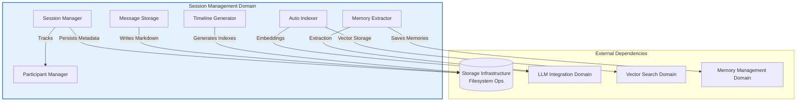
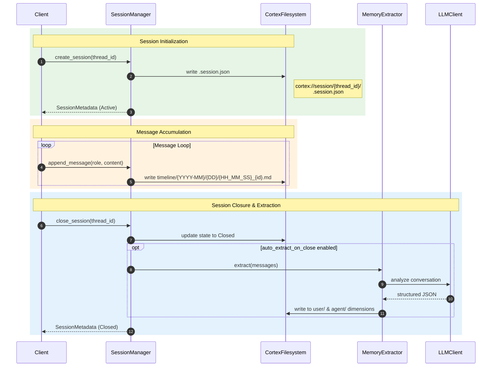
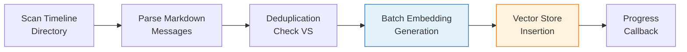

**Technical Documentation: Session Management Domain**

**Cortex-Mem System Architecture**  
**Version**: 1.0  
**Last Updated**: 2026-02-17 16:40:50 (UTC)

---

## 1. Executive Summary

The **Session Management Domain** is a core business domain within the Cortex-Mem architecture responsible for comprehensive conversation lifecycle management. It provides the foundational infrastructure for organizing multi-turn conversations with full temporal context, persistent storage, and automated semantic indexing capabilities.

This domain implements a stateful session orchestration system that captures conversation timelines, manages participant roles, and triggers intelligent content processing pipelines upon session closure. By integrating with the Storage Infrastructure, LLM Integration, and Vector Search domains, it enables both temporal navigation and semantic retrieval of conversation history.

**Key Capabilities:**
- Hierarchical session lifecycle management (Active → Closed → Archived)
- Temporal message persistence with URI-based addressing (`cortex://session/`)
- Automated vector indexing of conversation content to Qdrant
- LLM-powered structured memory extraction (preferences, entities, events, cases)
- Multi-party participant tracking with role-based categorization

---

## 2. Architecture Overview

### 2.1 Domain Position

The Session Management Domain operates as a core business domain within the Cortex-Mem layered architecture, maintaining clear dependencies with infrastructure and sibling business domains:



### 2.2 Component Hierarchy

| Component | Responsibility | Primary File |
|-----------|---------------|--------------|
| **Session Manager** | Lifecycle orchestration, state transitions, metadata management | `cortex-mem-core/src/session/manager.rs` |
| **Message Storage** | Temporal persistence, markdown serialization, URI generation | `cortex-mem-core/src/session/message.rs` |
| **Timeline Generator** | Hierarchical index generation (daily/monthly/yearly) | `cortex-mem-core/src/session/timeline.rs` |
| **Auto Indexer** | Vector database indexing, batch processing, deduplication | `cortex-mem-core/src/automation/indexer.rs` |
| **Memory Extractor** | LLM-powered structured extraction on session close | `cortex-mem-core/src/session/extraction.rs` |
| **Participant Manager** | Multi-party participant registry and role assignment | `cortex-mem-core/src/session/participant.rs` |

---

## 3. Core Workflows

### 3.1 Session Lifecycle Management

The session lifecycle follows a state machine pattern with three distinct states, persisted in `.session.json` metadata files:

**State Transitions:**
```
Active → Closed → Archived
```

**Operational Flow:**



**Implementation Details:**
- Session metadata is stored as JSON at `cortex://session/{thread_id}/.session.json`
- State transitions are atomic filesystem operations
- Closure triggers conditional memory extraction based on `SessionConfig.auto_extract_on_close` flag
- Supports hierarchical organization through `parent_thread_id` for conversation threading

### 3.2 Temporal Message Storage

Messages are persisted using a hierarchical date-based directory structure that enables efficient temporal queries and manual navigation:

**URI Schema:**
```
cortex://session/{thread_id}/timeline/{YYYY-MM}/{DD}/{HH_MM_SS}_{message_id}.md
```

**Storage Format:**
Messages are serialized to Markdown with structured metadata headers:

```markdown
---
id: msg_001
role: user
timestamp: 2024-01-15T14:30:00Z
thread_id: thread_abc123
---

👤 **User** (2024-01-15 14:30)

Message content here...
```

**Factory Methods:**
The `MessageStorage` component provides role-specific factory methods:
- `MessageStorage::user(content)` → Role::User
- `MessageStorage::assistant(content)` → Role::Assistant  
- `MessageStorage::system(content)` → Role::System

### 3.3 Automated Vector Indexing

The AutoIndexer implements a batch processing pipeline for semantic indexing of session content:

**Indexing Workflow:**



**Technical Specifications:**
- **Batch Size**: Configurable, default 10 messages per batch
- **Deduplication**: Uses `scroll_ids()` queries to check existing vector IDs before processing
- **Vector ID Format**: `cortex://session/{thread_id}/messages/{message_id}`
- **Async Processing**: Non-blocking indexing with progress callbacks for UI feedback
- **Content Extraction**: Parses markdown content, excluding metadata headers for embedding

**Configuration:**
```rust
IndexerConfig {
    auto_index: bool,      // Enable reactive indexing
    batch_size: usize,     // Default: 10
    async_index: bool,     // Background processing
}
```

### 3.4 Structured Memory Extraction

Upon session closure, the system can automatically extract structured memories using LLM analysis, implementing an OpenViking-style extraction pattern:

**Extraction Categories:**
1. **Preferences**: User preferences, likes/dislikes, settings
2. **Entities**: Named entities, people, organizations, locations
3. **Events**: Significant occurrences, milestones, decisions
4. **Cases**: Agent-specific problem-solving patterns and solutions

**Persistence Targets:**
- Preferences → `cortex://user/preferences/`
- Entities → `cortex://user/entities/`
- Events → `cortex://user/events/`
- Cases → `cortex://agent/cases/`

**Process Flow:**
1. Collect all messages from session timeline via recursive filesystem scan
2. Build structured extraction prompt containing full conversation context
3. LLM analyzes content and outputs JSON with categorized memories
4. Parse response and generate embeddings for extracted items
5. Persist to appropriate dimensional storage with metadata linking to source session

---

## 4. Data Structures

### 4.1 Core Types

**SessionMetadata**
```rust
struct SessionMetadata {
    thread_id: String,
    state: SessionState,           // Active, Closed, Archived
    created_at: DateTime<Utc>,
    updated_at: DateTime<Utc>,
    closed_at: Option<DateTime<Utc>>,
    participant_ids: Vec<String>,
    message_count: usize,
    tags: Vec<String>,
    parent_thread_id: Option<String>,
    auto_extract_on_close: bool,
}
```

**Message**
```rust
struct Message {
    id: String,
    thread_id: String,
    role: MessageRole,             // User, Assistant, System
    content: String,
    timestamp: DateTime<Utc>,
    metadata: HashMap<String, Value>,
}
```

**Participant**
```rust
struct Participant {
    id: String,
    name: String,
    role: ParticipantRole,         // User, Agent, System
    metadata: ParticipantMetadata,
}
```

### 4.2 Timeline Aggregation

The TimelineGenerator creates navigable index views at three aggregation levels:

| Level | File | Content |
|-------|------|---------|
| **Daily** | `timeline/{YYYY-MM}/{DD}/index.md` | Chronological list of messages for specific day |
| **Monthly** | `timeline/{YYYY-MM}/index.md` | Summary of days with message counts |
| **Yearly** | `timeline/{YYYY}/index.md` | Overview of months with activity metrics |

---

## 5. Integration Patterns

### 5.1 Dependency Injection

All components utilize Arc-based dependency injection for thread-safe async operations:

```rust
pub struct SessionManager {
    filesystem: Arc<dyn CortexFilesystem>,
    config: SessionConfig,
    // Optional dependencies for advanced features
    layer_manager: Option<Arc<dyn LayerManager>>,
    llm_client: Option<Arc<dyn LLMClient>>,
}
```

### 5.2 Interface Contracts

**CortexFilesystem Trait**
All storage operations abstract through the filesystem interface:
- `read(uri: &str) -> Result<String>`
- `write(uri: &str, content: &str) -> Result<()>`
- `list(dir_uri: &str) -> Result<Vec<String>>`
- `exists(uri: &str) -> Result<bool>`

**LLMClient Trait**
Used for extraction workflows:
- `complete(prompt: &str) -> Result<String>`
- `complete_structured<T>(prompt: &str) -> Result<T>` where T: DeserializeOwned

### 5.3 Cross-Domain Communication

**With Storage Infrastructure Domain:**
- All message content persisted via `FilesystemOperations`
- URI resolution handled by `URIParser` (`cortex-mem-core/src/filesystem/uri.rs`)
- Markdown serialization/deserialization in MessageStorage

**With Vector Search Domain:**
- AutoIndexer inserts to Qdrant via `VectorStore` trait
- Uses `EmbeddingClient` for vector generation (1536-dimensional default)
- Implements scroll-based deduplication before insertion

**With LLM Integration Domain:**
- MemoryExtractor utilizes `LLMClient` for content analysis
- Prompt templates defined in `cortex-mem-core/src/llm/prompts.rs`
- Structured extraction types in `cortex-mem-core/src/llm/extractor_types.rs`

---

## 6. Configuration

### 6.1 Session Configuration

```rust
pub struct SessionConfig {
    /// Automatically extract memories when session closes
    pub auto_extract_on_close: bool,
    
    /// Enable vector indexing of messages
    pub auto_index: bool,
    
    /// Batch size for indexing operations
    pub index_batch_size: usize,
    
    /// Enable layered content generation (L0/L1)
    pub enable_layer_generation: bool,
}
```

### 6.2 Indexer Configuration

Located in `cortex-mem-core/src/config.rs`:

```rust
pub struct IndexerConfig {
    pub auto_index: bool,
    pub batch_size: usize,        // Default: 10
    pub async_index: bool,
    pub skip_existing: bool,      // Deduplication flag
}
```

---

## 7. Usage Examples

### 7.1 Creating and Managing a Session

```rust
use cortex_mem_core::session::{SessionManager, SessionConfig};
use cortex_mem_core::filesystem::LocalFilesystem;

// Initialize manager
let fs = Arc::new(LocalFilesystem::new(data_dir));
let config = SessionConfig {
    auto_extract_on_close: true,
    auto_index: true,
    ..Default::default()
};
let manager = SessionManager::new(fs, config);

// Create session
let session = manager.create_session("user_123").await?;
println!("Session created: {}", session.thread_id);

// Add messages
let message = manager
    .create_message(&session.thread_id, MessageRole::User, "Hello, AI!")
    .await?;
```

### 7.2 Manual Timeline Indexing

```rust
use cortex_mem_core::automation::AutoIndexer;

let indexer = AutoIndexer::new(
    filesystem.clone(),
    embedding_client,
    vector_store,
);

// Index specific thread
let stats = indexer.index_thread("thread_abc123").await?;
println!("Indexed: {}, Skipped: {}", stats.indexed, stats.skipped);
```

### 7.3 URI Resolution

```rust
// Session metadata
let meta_uri = format!("cortex://session/{}/.session.json", thread_id);

// Specific message
let msg_uri = format!(
    "cortex://session/{}/timeline/{}/{}/{}_{}.md",
    thread_id, "2024-01", "15", "14_30_00", "msg_001"
);
```

---

## 8. Performance Considerations

### 8.1 Concurrency Model
- **Async/Await**: All I/O operations (filesystem, LLM calls) use Tokio async runtime
- **Parallel Processing**: Message indexing and extraction run in background tasks
- **Thread Safety**: Arc-based sharing ensures safe concurrent access to session state

### 8.2 Storage Optimization
- **Deduplication**: AutoIndexer checks vector store before re-indexing
- **Batch Processing**: Configurable batch sizes prevent memory pressure during large session indexing
- **Lazy Loading**: Session metadata loaded on-demand; message content streamed during extraction

### 8.3 Caching Strategy
- **Layer Cache**: Generated L0/L1 abstractions cached in filesystem (if LayerManager enabled)
- **Index Caches**: Timeline indexes generated once and persisted as markdown
- **Vector Cache**: Qdrant HNSW indices provide sub-millisecond similarity search

---

## 9. Error Handling

The domain implements comprehensive error handling for filesystem and network operations:

| Error Type | Handling Strategy |
|------------|------------------|
| **Filesystem IO** | Propagates via `Result<T, SessionError>` with context |
| **LLM Timeout** | Extraction continues with partial results; logged as warning |
| **Vector Store Unavailable** | Indexing queued for retry; session operations continue |
| **Parse Errors** | Markdown parsing failures logged; message skipped during indexing |

---

## 10. Appendix

### 10.1 File Structure Reference

```
cortex-mem-core/src/session/
├── mod.rs              # Public API exports
├── manager.rs          # SessionManager implementation
├── timeline.rs         # TimelineGenerator and aggregation
├── message.rs          # Message struct and MessageStorage
├── participant.rs      # Participant tracking
└── extraction.rs       # MemoryExtractor implementation

cortex-mem-core/src/automation/
└── indexer.rs          # AutoIndexer implementation
```

### 10.2 URI Schema Reference

| Resource | URI Pattern | Example |
|----------|-------------|---------|
| Session Metadata | `cortex://session/{id}/.session.json` | `cortex://session/abc/.session.json` |
| Message | `cortex://session/{id}/timeline/{YYYY-MM}/{DD}/{HH_MM_SS}_{msg_id}.md` | `cortex://session/abc/timeline/2024-01/15/14_30_00_msg1.md` |
| Daily Index | `cortex://session/{id}/timeline/{YYYY-MM}/{DD}/index.md` | `cortex://session/abc/timeline/2024-01/15/index.md` |
| Monthly Index | `cortex://session/{id}/timeline/{YYYY-MM}/index.md` | `cortex://session/abc/timeline/2024-01/index.md` |

### 10.3 Emoji Conventions in Markdown

| Role | Emoji | Header Format |
|------|-------|---------------|
| User | 👤 | `👤 **User** (ISO Timestamp)` |
| Assistant | 🤖 | `🤖 **Assistant** (ISO Timestamp)` |
| System | ⚙️ | `⚙️ **System** (ISO Timestamp)` |

---

**Document End**