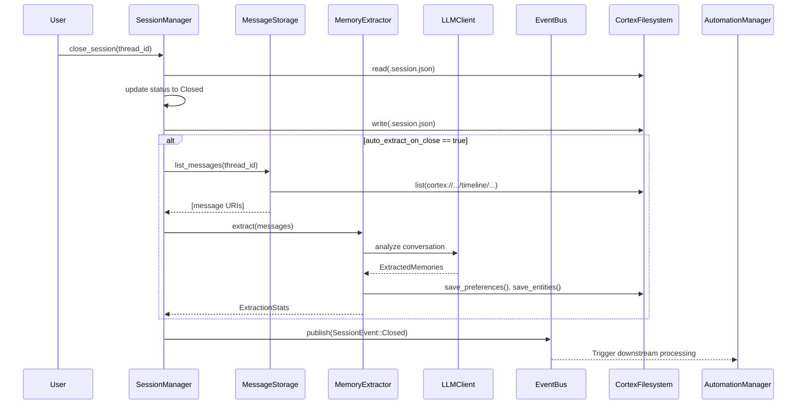

 **Session Management Domain**
**Technical Implementation Documentation**

---

**Generation Time:** 2024-01-15T09:30:00Z  
**System Version:** Cortex-Mem Core Infrastructure  
**Domain Classification:** Core Business Domain  
**Complexity Index:** 7.0/10  

---

## 1. Domain Overview

The **Session Management Domain** is a foundational component of the Cortex-Mem architecture responsible for orchestrating conversation state, message persistence, and session lifecycle transitions. It serves as the primary interface for tracking temporal conversation threads, managing participant metadata, and triggering downstream memory extraction processes.

As a core business domain, Session Management bridges the gap between ephemeral conversational interactions and persistent memory storage. It implements a hierarchical storage model that organizes messages chronologically while maintaining loose coupling between storage mechanisms, AI processing pipelines, and event-driven automation workflows.

### 1.1 Domain Responsibilities

- **Conversation State Management**: Tracking active, closed, and archived conversation sessions
- **Temporal Message Organization**: Hierarchical indexing of messages by year, month, and day
- **Lifecycle Event Emission**: Publishing `SessionEvent` notifications for system-wide reactivity
- **Automated Memory Extraction**: Triggering AI-powered analysis upon session closure
- **Participant Tracking**: Maintaining user and agent metadata across conversation threads

### 1.2 Strategic Position

The domain sits at the intersection of user interaction and automated memory processing. While the **Automation Management Domain** handles background indexing and the **Extraction Engine Domain** performs AI analysis, Session Management provides the structural foundation that determines when and how these processes trigger.

---

## 2. Architectural Components

The Session Management Domain implements a modular architecture consisting of three specialized sub-modules, coordinated by a central controller:

### 2.1 Component Structure

```rust
// Domain structure overview
cortex-mem-core/src/session/
├── mod.rs              // Domain exports and public interfaces
├── manager.rs          // SessionManager: Lifecycle orchestration
├── message.rs          // MessageStorage: Individual message handling
└── timeline.rs         // TimelineGenerator: Temporal aggregation
```

### 2.2 Session Lifecycle Manager (`manager.rs`)

The **SessionManager** acts as the domain controller, implementing the primary interface for session operations and state transitions.

**Key Capabilities:**
- **Session Creation**: Initializes new conversation threads with unique identifiers and participant metadata
- **State Transitions**: Manages lifecycle states (Active → Closed → Archived)
- **Event Coordination**: Publishes `SessionEvent::Created`, `SessionEvent::MessageAdded`, and `SessionEvent::Closed` via the EventBus
- **Auto-Extraction Orchestration**: Conditionally triggers `MemoryExtractor` upon session closure when `auto_extract_on_close` is enabled

**Primary Interface Methods:**
```rust
impl SessionManager {
    pub async fn create_session(&self, thread_id: String) -> Result<SessionMetadata, SessionError>;
    pub async fn add_message(&self, thread_id: &str, role: Role, content: &str) -> Result<Message, SessionError>;
    pub async fn close_session(&self, thread_id: &str) -> Result<SessionMetadata, SessionError>;
    pub async fn list_messages(&self, thread_id: &str) -> Result<Vec<Message>, SessionError>;
}
```

### 2.3 Message Manager (`message.rs`)

The **MessageStorage** component handles the persistence and retrieval of individual conversation messages, abstracting the filesystem operations required for markdown-based storage.

**Key Capabilities:**
- **Markdown Serialization**: Converts message objects to markdown format with embedded YAML frontmatter metadata
- **URI Generation**: Constructs deterministic resource identifiers following the `cortex://` scheme
- **CRUD Operations**: Async read/write operations for individual messages
- **Metadata Extraction**: Parsing of message timestamps, roles, and content from filesystem storage

**Storage Format:**
```markdown
---
id: "msg_12345"
role: "user"
timestamp: "2024-01-15T09:30:00Z"
thread_id: "thread_67890"
---
Message content in markdown format...
```

### 2.4 Timeline Manager (`timeline.rs`)

The **TimelineGenerator** implements hierarchical indexing strategies that optimize message retrieval and navigation across large conversation histories.

**Key Capabilities:**
- **Hierarchical Indexing**: Automatic generation of daily (`index.md`), monthly, and yearly index files
- **Temporal Aggregation**: Grouping messages by time periods for efficient browsing
- **URI Resolution**: Mapping logical timeline queries to physical filesystem paths
- **Pagination Support**: Cursor-based navigation through large message volumes

**Directory Structure:**
```
cortex://session/{thread_id}/timeline/
├── 2024-01/
│   ├── 15/
│   │   ├── 09_30_00_msg_001.md
│   │   ├── 09_31_45_msg_002.md
│   │   └── index.md          // Daily index
│   └── index.md              // Monthly index
└── index.md                  // Yearly index
```

---

## 3. Data Model & Storage Architecture

### 3.1 URI Schema

The domain implements a standardized resource addressing scheme using the `cortex://` protocol:

| Resource Type | URI Pattern | Example |
|--------------|-------------|---------|
| Session Root | `cortex://session/{thread_id}` | `cortex://session/thread_123` |
| Timeline | `cortex://session/{id}/timeline/{YYYY-MM}/{DD}` | `cortex://session/thread_123/timeline/2024-01/15` |
| Message | `cortex://session/{id}/timeline/{YYYY-MM}/{DD}/{HH_MM_SS}_{msg_id}.md` | `cortex://session/thread_123/timeline/2024-01/15/09_30_00_msg_001.md` |
| Session Metadata | `cortex://session/{id}/.session.json` | `cortex://session/thread_123/.session.json` |

### 3.2 Session Metadata Schema

Session persistence utilizes JSON-based metadata files containing:

```rust
pub struct SessionMetadata {
    pub thread_id: String,
    pub status: SessionStatus,        // Active, Closed, Archived
    pub created_at: DateTime<Utc>,
    pub updated_at: DateTime<Utc>,
    pub closed_at: Option<DateTime<Utc>>,
    pub participants: Vec<Participant>,
    pub tags: Vec<String>,
    pub auto_extract_on_close: bool,  // Feature flag for AI extraction
    pub tenant_id: Option<String>,    // Multi-tenancy isolation
}
```

### 3.3 Message Structure

Individual messages are modeled as:

```rust
pub struct Message {
    pub id: String,
    pub thread_id: String,
    pub role: Role,                   // User, Assistant, System
    pub content: String,
    pub timestamp: DateTime<Utc>,
    pub metadata: HashMap<String, Value>,
}
```

---

## 4. Core Business Workflows

### 4.1 Session Creation Flow

When initializing a new conversation thread:

1. **Validation**: Verify tenant isolation and thread ID uniqueness
2. **Metadata Initialization**: Create `SessionMetadata` with `status: Active`
3. **Filesystem Provisioning**: Ensure directory structure exists under `cortex://session/{thread_id}/`
4. **Persistence**: Write `.session.json` to filesystem
5. **Event Publication**: Emit `SessionEvent::Created` via EventBus

**Code Path:** `SessionManager::create_session()` → `CortexFilesystem::write()`

### 4.2 Message Addition Flow

When appending a message to an active session:

1. **URI Generation**: Construct resource path based on current UTC timestamp: `{HH_MM_SS}_{message_id}.md`
2. **Markdown Serialization**: Convert message to markdown with YAML frontmatter
3. **Filesystem Write**: Persist via `CortexFilesystem` abstraction
4. **Index Updates**: Trigger `TimelineGenerator::generate_daily_index()` to update temporal indices
5. **Event Emission**: Publish `SessionEvent::MessageAdded` for real-time indexing triggers

**Code Path:** `SessionManager::add_message()` → `MessageStorage::save_message()` → `TimelineGenerator::generate_daily_index()`

### 4.3 Session Closure & Memory Extraction Flow

The closure workflow represents the critical handoff between conversational state management and automated knowledge extraction:



**Workflow Steps:**

1. **State Transition**: Update `SessionMetadata.status` from `Active` to `Closed` and set `closed_at` timestamp
2. **Conditional Extraction**: If `auto_extract_on_close` is enabled:
   - Recursively read all `.md` messages from the session timeline
   - Build LLM prompt with conversation context and existing profile data
   - Invoke `MemoryExtractor` to identify facts, decisions, and entities
   - Parse JSON response with fallback markdown extraction
   - Filter by confidence threshold and deduplicate using LCS (Longest Common Subsequence) similarity
   - Merge into user/agent profiles with category limits enforcement
3. **Event Publication**: Emit `SessionEvent::Closed` to trigger:
   - **Automation Management Domain**: Auto-indexing of finalized session
   - **Profile Management Domain**: Profile persistence updates
   - **Layer Management Domain**: L0/L1 summary generation for search optimization

**Code Path:** `SessionManager::close_session()` → `MemoryExtractor::extract_from_thread()` → `EventBus::send(SessionEvent::Closed)`

---

## 5. Implementation Details

### 5.1 Asynchronous Architecture

The domain utilizes Rust's async/await paradigm for I/O-bound operations:

- **Filesystem Operations**: All CRUD operations are async, utilizing `tokio::fs` for non-blocking file I/O
- **Event Publishing**: Async channel-based event bus (`tokio::mpsc`) for decoupled communication
- **LLM Integration**: Non-blocking HTTP client calls to external embedding/completion APIs

**Example Pattern:**
```rust
pub async fn add_message(&self, thread_id: &str, content: &str) -> Result<Message, Error> {
    let message = Message::new(thread_id, content);
    let uri = self.message_storage.save_message(&message).await?;
    self.event_bus.send(SessionEvent::MessageAdded { uri }).await?;
    Ok(message)
}
```

### 5.2 Serialization Strategy

- **Messages**: Markdown format with YAML frontmatter (human-readable, version control friendly)
- **Metadata**: JSON with serde for type-safe serialization
- **Deterministic IDs**: URI-based vector IDs derived from content hash and path structure

### 5.3 Error Handling

Domain-specific errors are defined in `cortex-mem-core/src/error.rs`:

```rust
pub enum SessionError {
    NotFound(String),           // Thread ID does not exist
    InvalidState(String),       // Operation on closed session
    StorageError(Error),        // Filesystem I/O failure
    SerializationError(Error),  // JSON/Markdown parsing failure
    TenantMismatch(String),     // Cross-tenant access attempt
}
```

### 5.4 Multi-Tenant Isolation

Session data is automatically scoped by `tenant_id`:

- **Filesystem**: Paths mapped to `/data/tenants/{tenant_id}/session/`
- **Metadata**: `tenant_id` field persisted in `.session.json`
- **Access Control**: All read operations filter by tenant context extracted from request headers or CLI arguments

---

## 6. Integration Points

### 6.1 Upstream Dependencies

**Core Infrastructure Domain:**
- **CortexFilesystem**: Abstracts OS filesystem operations with `cortex://` URI resolution
- **EventBus**: Async channel infrastructure for event publishing
- **LLMClient**: OpenAI-compatible client for memory extraction (optional dependency via generics)

### 6.2 Downstream Consumers

**Automation Management Domain:**
- Consumes `SessionEvent::Closed` to trigger auto-indexing workflows
- Uses `SessionManager` to list messages for batch processing

**Extraction Engine Domain:**
- `MemoryExtractor` processes conversation threads into structured memories
- Updates `ProfileManager` with extracted facts and decisions

**Layer Management Domain:**
- Generates L0 (abstract) and L1 (overview) summaries from L2 (raw) session content
- Caches summaries in `cortex://session/{id}/.abstract.md` and `.overview.md`

**Search Engine Domain:**
- Queries timeline indexes for temporal filtering
- Retrieves full message content for L2 layer search results

---

## 7. Configuration & Usage

### 7.1 Initialization

```rust
// With optional LLM client for auto-extraction
let session_manager = SessionManager::new(
    filesystem.clone(),
    Some(llm_client),
    Some(event_bus),
    tenant_id
);
```

### 7.2 Configuration Options

| Option | Environment Variable | Default | Description |
|--------|---------------------|---------|-------------|
| `auto_extract_on_close` | `CORTEX_AUTO_EXTRACT` | `true` | Enable AI extraction on session close |
| `session_timeout` | `CORTEX_SESSION_TIMEOUT` | `24h` | Automatic closure threshold for stale sessions |
| `timeline_indexing` | `CORTEX_TIMELINE_INDEX` | `true` | Enable hierarchical index generation |

### 7.3 Usage Patterns

**Basic Session Management:**
```rust
// Create and manage a conversation
let session = session_manager.create_session("thread_123".to_string()).await?;
session_manager.add_message("thread_123", Role::User, "Hello").await?;
session_manager.close_session("thread_123").await?; // Triggers extraction
```

**Manual Timeline Navigation:**
```rust
// Access historical messages
let messages = session_manager.list_messages("thread_123").await?;
let daily_index = timeline_generator.get_daily_index("thread_123", "2024-01-15").await?;
```

---

## 8. Performance Considerations

- **Batch Processing**: Message listing operations utilize streaming iterators to handle large conversation histories
- **Lazy Loading**: Timeline indexes are generated on-demand and cached to filesystem
- **Event-Driven Decoupling**: Session closure returns immediately; extraction occurs asynchronously via Automation Manager
- **Filesystem Optimization**: Hierarchical directory structure prevents single-directory file count limitations

---

## 9. Conclusion

The Session Management Domain provides the structural backbone for Cortex-Mem's persistent memory capabilities. By implementing a clear separation between message storage, temporal indexing, and lifecycle management—while maintaining tight integration with AI extraction pipelines—it enables both high-performance conversation tracking and sophisticated automated knowledge processing.

The domain's adherence to the `cortex://` URI abstraction and event-driven architecture ensures compatibility with downstream automation workflows while maintaining flexibility for multi-tenant deployments and diverse interface integrations (CLI, HTTP, MCP).

**Key Files Reference:**
- `/cortex-mem-core/src/session/manager.rs` - Session lifecycle implementation
- `/cortex-mem-core/src/session/message.rs` - Message storage abstraction
- `/cortex-mem-core/src/session/timeline.rs` - Temporal indexing logic
- `/cortex-mem-core/src/session/mod.rs` - Domain public interface exports