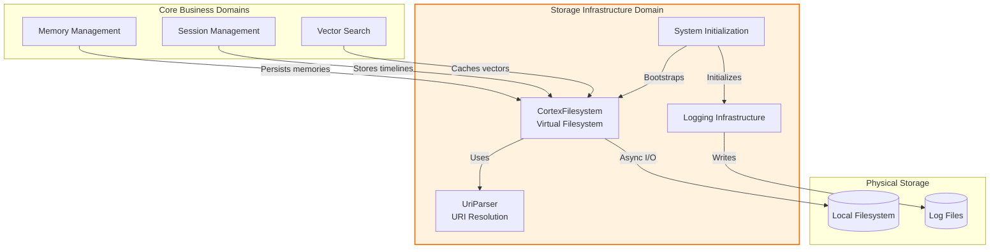
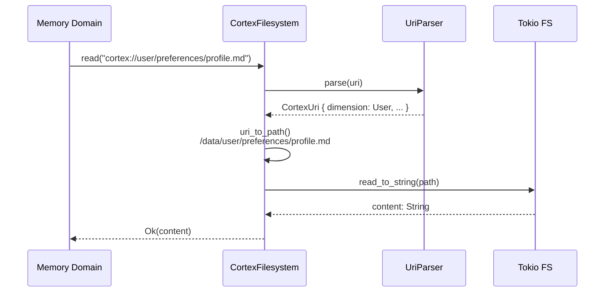
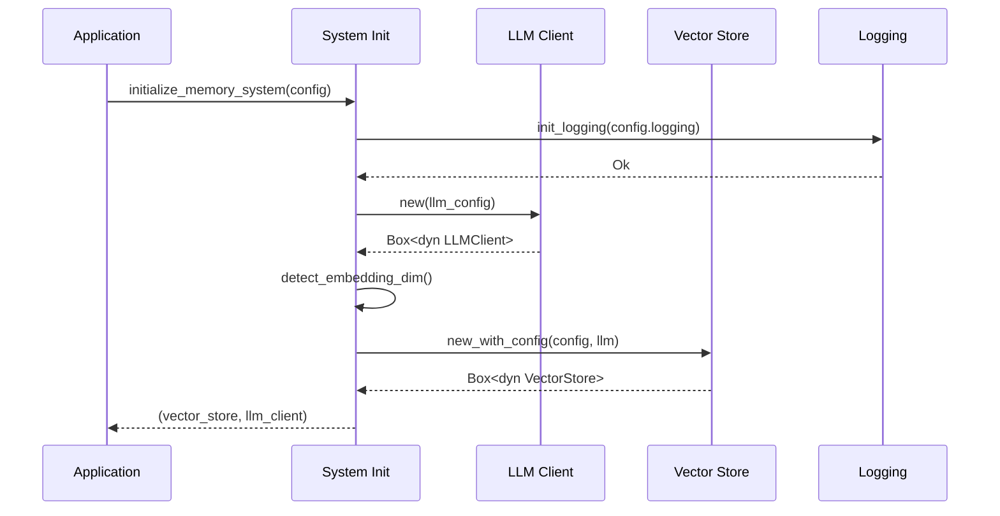

**Storage Infrastructure Domain Technical Documentation**

**Version:** 1.0  
**Last Updated:** 2024  
**Component:** `cortex-mem-core` Infrastructure Layer  

---

## 1. Executive Summary

The **Storage Infrastructure Domain** provides the foundational persistence layer for the Cortex-Mem system, implementing a virtual filesystem abstraction that enables portable, version-control-friendly storage of memory artifacts. This domain delivers cross-platform file I/O operations, multi-tenant data isolation, system initialization orchestration, and comprehensive logging infrastructure.

Key capabilities include:
- **Virtual Filesystem Gateway**: URI-based resource addressing via the `cortex://` scheme
- **Multi-tenant Isolation**: Optional tenant-scoped directory segregation
- **Async I/O Operations**: Non-blocking filesystem operations powered by Tokio
- **Dimension-based Organization**: Structured storage across User, Agent, Session, and Resource dimensions
- **Secure Path Resolution**: Protection against directory traversal attacks
- **System Bootstrap**: Dependency injection initialization for LLM clients and vector stores

---

## 2. Architecture Overview

The Storage Infrastructure Domain implements a **layered abstraction pattern** that decouples logical resource addressing from physical storage mechanisms. The architecture follows the Dependency Rule, with infrastructure concerns depending on configuration utilities while exposing clean trait interfaces to core business domains.



### 2.1 Design Principles

- **Portability**: Abstract filesystem interface enables testing and platform independence
- **Security**: URI validation prevents path traversal; tenant isolation ensures data segregation
- **Performance**: Async/await patterns prevent I/O blocking in the Tokio runtime
- **Observability**: Structured logging with configurable verbosity levels

---

## 3. Core Components

### 3.1 Virtual Filesystem Layer (`CortexFilesystem`)

The `CortexFilesystem` struct implements the `FilesystemOperations` trait, providing async CRUD operations for memory content. It supports dual operational modes:

**Multi-tenant Mode**:  
Path structure: `{root}/tenants/{tenant_id}/{dimension}/{category}/{resource}`  
*Use case*: SaaS deployments requiring strict data isolation between users

**Single-tenant Mode**:  
Path structure: `{root}/{dimension}/{category}/{resource}`  
*Use case*: Personal deployments or single-user environments

#### Key Operations

| Operation | Description | Async Primitive |
|-----------|-------------|-----------------|
| `read` | Retrieves file content as UTF-8 string | `tokio::fs::read_to_string` |
| `write` | Atomically writes content with parent directory creation | `tokio::fs::write` + `create_dir_all` |
| `delete` | Removes files or directories recursively | `tokio::fs::remove_file` / `remove_dir_all` |
| `list` | Returns directory entries with metadata filtering | `tokio::fs::read_dir` |
| `exists` | Checks resource availability | `tokio::fs::try_exists` |
| `metadata` | Retrieves file timestamps and size | `tokio::fs::metadata` |

#### Trait Interface

```rust
#[async_trait]
pub trait FilesystemOperations: Send + Sync {
    async fn list(&self, uri: &str) -> Result<Vec<FileEntry>>;
    async fn read(&self, uri: &str) -> Result<String>;
    async fn write(&self, uri: &str, content: &str) -> Result<()>;
    async fn delete(&self, uri: &str) -> Result<()>;
    async fn exists(&self, uri: &str) -> Result<bool>;
    async fn metadata(&self, uri: &str) -> Result<FileMetadata>;
}
```

*Note*: The `async_trait` macro enables async methods in traits by desugaring to boxed futures.

### 3.2 URI Parsing System (`UriParser`)

The `cortex://` URI scheme provides semantic addressing for memory artifacts, decoupling logical resource identity from physical storage locations.

#### URI Schema Specification

```
cortex://{dimension}/{category}/{subcategory}/{resource}?{params}
```

**Components:**
- **Dimension**: Namespace isolation (`user`, `agent`, `session`, `resources`)
- **Category**: Content classification (e.g., `preferences`, `entities`, `timeline`)
- **Subcategory**: Optional hierarchical grouping
- **Resource**: Specific artifact identifier (filename or UUID)
- **Params**: Query string for metadata hints

#### Factory Methods

The parser provides semantic constructors for common resource types:

```rust
// User preference profile
CortexUri::user_preferences("profile")

// Agent case storage
CortexUri::agent_cases("case-123")

// Session timeline entry
CortexUri::session("session-uuid").with_timeline_entry("001")
```

#### Path Resolution Algorithm

1. **Scheme Validation**: Verify URI starts with `cortex://`
2. **Segmentation**: Split path by `/` delimiter
3. **Dimension Extraction**: Map first segment to `Dimension` enum
4. **Tenant Resolution**: Prepend tenant prefix if multi-tenant mode enabled
5. **Platform Adaptation**: Convert URI separators to OS-specific path delimiters
6. **Extension Handling**: Preserve or append file extensions (`.md`, `.json`)

### 3.3 System Initialization (`init/mod.rs`)

The initialization module orchestrates system bootstrap using dependency injection patterns, returning boxed trait objects for loose coupling.

#### Initialization Flow

```rust
pub async fn initialize_memory_system(
    qdrant_config: &QdrantConfig,
    llm_config: LLMConfig,
) -> Result<(Box<dyn VectorStore>, Box<dyn LLMClient>)>
```

**Process:**
1. Instantiate LLM client with provided configuration
2. Auto-detect embedding dimensions using fallback cascade:
   - Check `QdrantConfig.embedding_dim` (explicit configuration)
   - Check environment variable `EMBEDDING_DIM`
   - Default to 1536 (optimized for text-embedding-3-small)
3. Initialize vector store with LLM client reference
4. Return tuple of boxed trait objects for dynamic dispatch

### 3.4 Logging Infrastructure (`logging.rs`)

Implements file-based structured logging using the `tracing` ecosystem.

#### Configuration Options

| Parameter | Type | Description |
|-----------|------|-------------|
| `enabled` | bool | Master toggle for logging |
| `level` | String | Filter level: `error`, `warn`, `info`, `debug`, `trace` |
| `log_directory` | Path | Destination directory for log files |

#### Implementation Details

- **File Naming**: `cortex-memo-{YYYY-MM-DD-HH-MM-SS}.log` (timestamped for rotation)
- **Output**: File-only (console pollution avoided via Mutex-wrapped writer)
- **Formatting**: Structured events with target module and span context
- **Initialization**: Global registry pattern using `tracing_subscriber::registry()`

---

## 4. Dimension-Based Organization

The system organizes storage across four primary dimensions, implementing an OpenViking-style hierarchy:

### 4.1 Directory Structure

```
{cortex_root}/
├── tenants/                    # Optional multi-tenant isolation
│   └── {tenant_id}/
│       ├── user/
│       │   ├── preferences/    # User-specific settings
│       │   ├── entities/       # Known entities/people
│       │   └── events/         # User-related events
│       ├── agent/
│       │   ├── cases/          # Agent reasoning cases
│       │   └── skills/         # Agent capabilities
│       ├── session/
│       │   └── timeline/       # Conversation histories
│       └── resources/          # System resources
└── {dimension}/                # Non-tenant layout (same structure)
```

### 4.2 Content Storage Strategy

- **Markdown Format**: Human-readable content storage (`.md`) enabling version control
- **JSON Metadata**: Structured metadata alongside content files
- **Layer Caching**: Generated L0/L1 abstractions cached in `layers/` subdirectories

---

## 5. Security Considerations

### 5.1 Path Traversal Protection

The URI parser validates all path components to prevent `../` sequences and absolute path injection:

```rust
// Rejected patterns
cortex://user/../../../etc/passwd
cortex://user/preferences//absolute/path
```

**Mitigation**: Strict parsing regex allows only alphanumeric, hyphen, underscore, and forward slash characters in path segments.

### 5.2 Tenant Isolation

When multi-tenant mode is enabled:
- Each tenant receives a dedicated subdirectory
- URI resolution enforces tenant prefixing
- Cross-tenant access requires explicit tenant context switch

### 5.3 Async Safety

All filesystem operations use `tokio::fs` to prevent blocking the async runtime during disk I/O, ensuring the system remains responsive under concurrent load.

---

## 6. Integration Patterns

### 6.1 Usage by Core Domains

**Memory Management Domain**:  
Uses `FilesystemOperations.write()` to persist memory content after vector database storage, ensuring dual-write consistency (filesystem + vectors).

**Session Management Domain**:  
Appends conversation messages via `write()` to timeline files in `cortex://session/{id}/timeline/`, using atomic appends for concurrency safety.

**Vector Search Domain**:  
Caches embedding vectors and metadata in filesystem for offline analysis, using `read()` for layer retrieval.

### 6.2 Error Handling

All operations return `anyhow::Result` types with context-rich error messages:

```rust
// Example error chain
fs.read("cortex://user/preferences/profile.md")
    .await
    .context("Failed to load user preferences")?
```

Common error types:
- `InvalidUriError`: Malformed cortex:// scheme
- `IoError`: Underlying filesystem failure
- `NotFoundError`: Resource does not exist

---

## 7. Configuration

The domain depends on `cortex-mem-config` for runtime parameters:

```toml
[storage]
data_directory = "/var/lib/cortex-mem"
multi_tenant = false
default_tenant = "default"

[logging]
enabled = true
level = "info"
log_directory = "/var/log/cortex-mem"
```

**Environment Variables:**
- `CORTEX_MEM_DATA_DIR`: Override data directory path
- `EMBEDDING_DIM`: Override auto-detected embedding dimensions
- `RUST_LOG`: Standard tracing filter (fallback if config file unspecified)

---

## 8. Performance Characteristics

| Metric | Value | Notes |
|--------|-------|-------|
| **Concurrent Operations** | Unlimited (OS permitting) | Tokio task-per-operation model |
| **Read Latency** | ~1-5ms (SSD) | Depends on file size |
| **Write Latency** | ~2-10ms (SSD) | Includes parent dir creation |
| **Directory Listing** | O(n) where n = entries | No indexing; linear scan |
| **Memory Footprint** | Minimal | Zero-copy path operations via `PathBuf` |

**Optimization Recommendations:**
- Use SSD storage for high-throughput scenarios
- Enable OS-level directory caching for frequently accessed dimensions
- Implement application-level caching for `metadata()` calls in hot paths

---

## 9. Appendix: Sequence Diagrams

### 9.1 File Read Operation



### 9.2 System Initialization



---

## 10. API Reference

### 10.1 Public Exports

From `cortex-mem-core/src/filesystem/mod.rs`:

```rust
pub use uri::{CortexUri, UriParser};
pub use operations::{CortexFilesystem, FilesystemOperations, FileEntry, FileMetadata};
```

From `cortex-mem-core/src/init/mod.rs`:

```rust
pub async fn initialize_memory_system(
    qdrant_config: &QdrantConfig,
    llm_config: LLMConfig,
) -> Result<(Box<dyn VectorStore>, Box<dyn LLMClient>)>;

pub async fn create_auto_config(
    base_config: &QdrantConfig,
    llm_client: &dyn LLMClient,
) -> Result<QdrantConfig>;
```

From `cortex-mem-core/src/logging.rs`:

```rust
pub fn init_logging(config: &cortex_mem_config::LoggingConfig) -> Result<()>;
```

---

**End of Document**