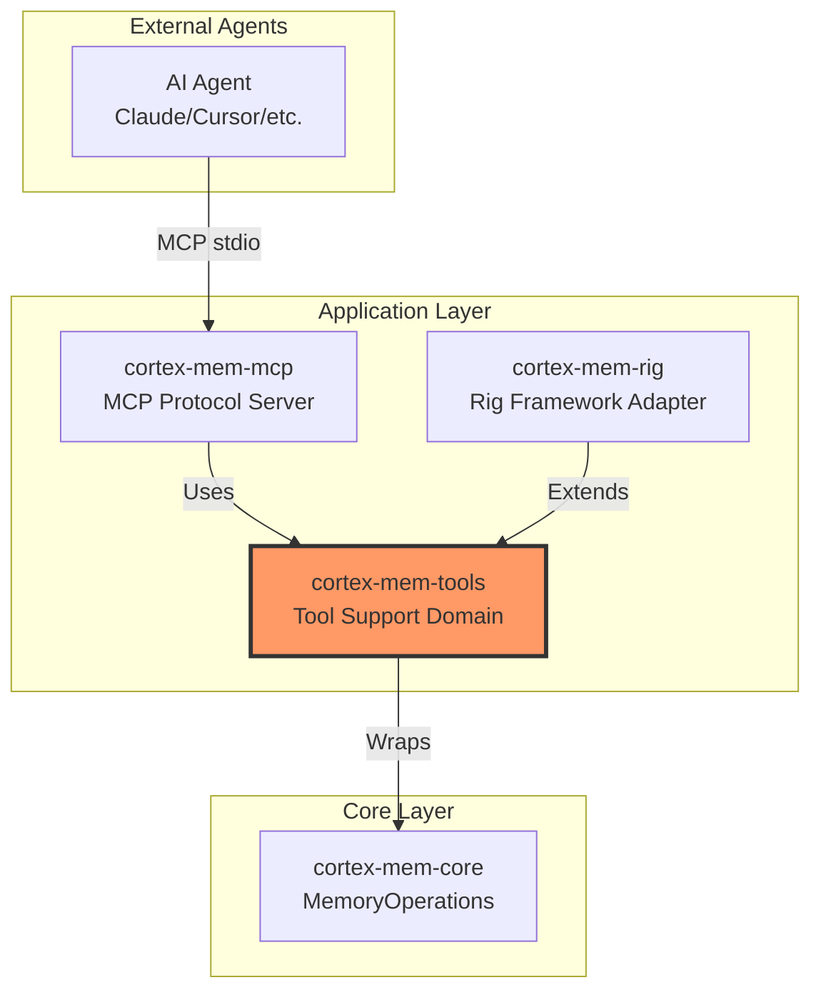
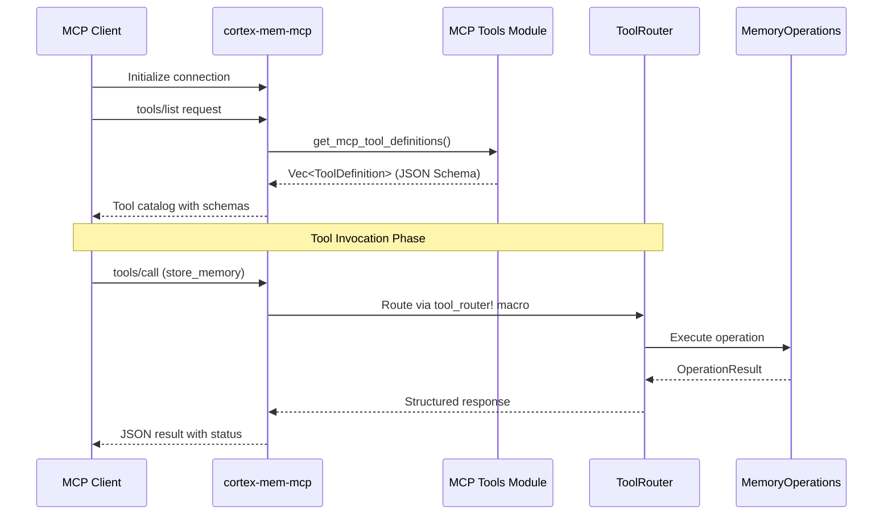
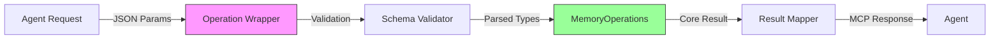
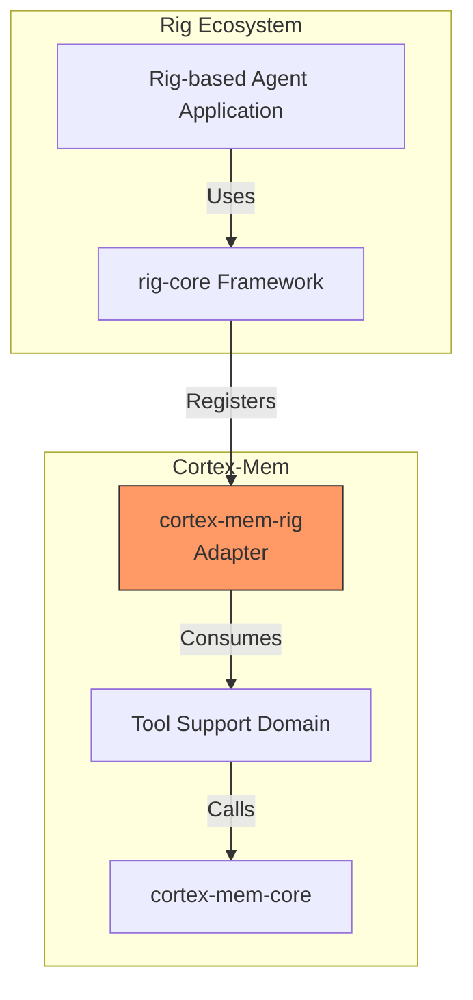
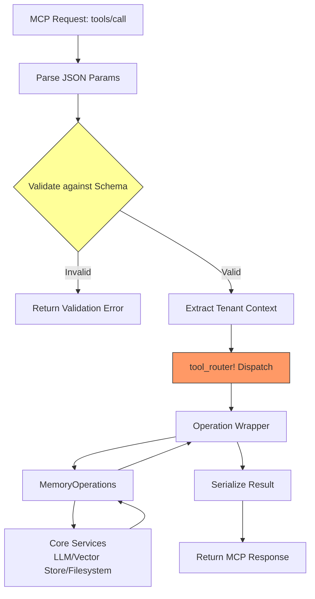

 **Technical Documentation: Tool Support Domain**

**Generation Time:** 2026-02-19 04:10:46 (UTC)  
**Timestamp:** 1771474246

---

## 1. Overview

The **Tool Support Domain** provides standardized tool definitions and integration utilities that enable AI agents to interact with the Cortex-Mem memory system through the Model Context Protocol (MCP). This domain serves as the bridge between AI assistant frameworks and the core memory management capabilities, exposing memory operations (store, query, list, etc.) as discoverable, schema-validated tools.

**Business Value:**
- **Standardized Integration**: Enables any MCP-compliant AI assistant to leverage Cortex-Mem without custom adapters
- **Type Safety**: JSON Schema definitions ensure consistent parameter validation across different agent implementations
- **Framework Agility**: Abstracts core memory operations into reusable tool definitions consumable by rig-core and other agent frameworks
- **Protocol Compliance**: Implements MCP specifications for tool discovery and invocation, ensuring interoperability with ecosystem tools (Claude Desktop, IDEs, etc.)

---

## 2. Architectural Positioning

### 2.1 Domain Context

The Tool Support Domain resides in the **Application Layer** of the Cortex-Mem architecture, positioned between interface implementations and core business logic:



### 2.2 Component Structure

The domain comprises three primary sub-modules:

| Component | Path | Responsibility |
|-----------|------|----------------|
| **MCP Tools** | `/cortex-mem-tools/src/mcp/` | JSON Schema definitions and tool metadata for MCP protocol |
| **Operation Wrappers** | `/cortex-mem-tools/src/operations.rs` | Simplified high-level interfaces for memory operations |
| **Rig Integration** | `/cortex-mem-rig/src/lib.rs` | rig-core framework adapter for Rust agent applications |

---

## 3. MCP Tools Module

### 3.1 Design Philosophy

The MCP Tools module implements **declarative tool definitions** using Rust structs that serialize into standardized JSON schemas. This approach ensures:
- Compile-time type safety for tool parameters
- Automatic schema generation compliant with MCP 1.0+ specifications
- Static validation of tool contracts before runtime exposure

### 3.2 Tool Inventory

The module exposes the following memory operations as MCP tools:

| Tool Name | Description | Key Parameters |
|-----------|-------------|----------------|
| `store_memory` | Persists content to memory with metadata | `content`, `dimension`, `metadata` |
| `query_memory` | Performs semantic search across memory layers | `query`, `scope`, `limit`, `threshold` |
| `list_memories` | Enumerates memories within a specific dimension | `dimension`, `filters`, `pagination` |
| `get_memory` | Retrieves specific memory by URI | `uri` |
| `delete_memory` | Removes memory entry and associated vectors | `uri`, `cascade` |

### 3.3 Schema Definition Architecture

Tool definitions follow a structured metadata pattern:

```rust
// Conceptual structure based on implementation
pub struct ToolDefinition {
    pub name: String,
    pub description: String,
    pub parameters: JSONSchema,      // Input validation schema
    pub return_schema: JSONSchema,   // Output structure definition
    pub annotations: ToolAnnotations // Rate limits, permissions, etc.
}
```

**Key Functions:**
- `get_mcp_tool_definitions() -> Vec<ToolDefinition>`: Returns static vector of all available tools for agent discovery
- `get_mcp_tool_definition(name: &str) -> Option<ToolDefinition>`: Retrieves specific tool metadata by identifier

### 3.4 Discovery Flow



---

## 4. Operation Wrappers

### 4.1 Abstraction Layer

The Operation Wrappers submodule (`/cortex-mem-tools/src/operations.rs`) provides **simplified facades** over the core `MemoryOperations` service. These wrappers:

- **Normalize Input/Output**: Convert between MCP JSON payloads and internal Rust types
- **Error Translation**: Map domain-specific errors to MCP-compliant error codes
- **Context Enrichment**: Automatically inject tenant IDs and session contexts from request metadata
- **Batch Optimization**: Aggregate multiple tool calls into efficient batch operations where applicable

### 4.2 Integration Pattern



**Key Characteristics:**
- **Zero-cost Abstractions**: Wrappers utilize compile-time generics to avoid runtime overhead
- **Async-native**: All operations return `impl Future` for non-blocking execution
- **Tenant Propagation**: Automatic scoping of all operations via `TenantContext` extraction from MCP request metadata

---

## 5. Rig Framework Integration

### 5.1 Purpose

The `cortex-mem-rig` crate provides first-class integration with the **rig-core** Rust agent framework, enabling Rust-based AI applications to incorporate Cortex-Mem capabilities as native rig tools.

### 5.2 Integration Architecture



### 5.3 Implementation Details

The Rig integration implements the `Tool` trait from `rig-core`, mapping Cortex-Mem operations to rig's tool execution context:

- **Tool Registration**: Automatic registration of all MCP tools with rig's agent builder
- **Type Conversion**: Bidirectional conversion between rig's JSON Value types and Cortex-Mem's domain types
- **Streaming Support**: Integration with rig's streaming completion APIs for real-time memory operations

**Key Integration Points:**
- `RigMemoryTool`: Wrapper struct implementing rig's `Tool` trait
- `CortexMemExtension`: Extension trait for rig's `Agent` to enable fluent memory configuration

---

## 6. Routing and Execution Flow

### 6.1 ToolRouter Macro

The Tool Support Domain utilizes a declarative `tool_router!` macro to map incoming MCP tool invocations to specific operation handlers:

```rust
// Conceptual usage pattern
tool_router! {
    "store_memory" => handle_store_memory,
    "query_memory" => handle_query_memory,
    "list_memories" => handle_list_memories,
    // ...
}
```

**Macro Capabilities:**
- **Static Dispatch**: Compile-time routing table generation for O(1) lookup complexity
- **Schema Validation**: Automatic parameter validation against ToolDefinition schemas before handler invocation
- **Error Handling**: Standardized error conversion to MCP error response formats

### 6.2 Execution Pipeline



---

## 7. Data Models and Schemas

### 7.1 Tool Parameter Schemas

**store_memory Tool Schema:**
```json
{
  "name": "store_memory",
  "description": "Stores content in the memory system with semantic indexing",
  "parameters": {
    "type": "object",
    "properties": {
      "content": {
        "type": "string",
        "description": "Raw content to store"
      },
      "dimension": {
        "type": "string",
        "enum": ["session", "user", "agent", "resource"],
        "description": "Memory dimension classification"
      },
      "metadata": {
        "type": "object",
        "properties": {
          "content_type": {"type": "string"},
          "tags": {"type": "array", "items": {"type": "string"}},
          "source_uri": {"type": "string"}
        }
      }
    },
    "required": ["content", "dimension"]
  }
}
```

### 7.2 Response Structures

All tools return standardized response envelopes:

```rust
pub struct ToolResponse {
    pub success: bool,
    pub data: Option<Value>,
    pub error: Option<ToolError>,
    pub metadata: ResponseMetadata,  // Execution time, tenant ID, etc.
}
```

---

## 8. Configuration and Deployment

### 8.1 Configuration Interface

Tools are configured via the centralized `cortex-mem-config` system:

```toml
[tools]
enabled = ["store_memory", "query_memory", "list_memories"]
default_limit = 10
max_content_length = 10000  # Characters

[tools.validation]
strict_schema = true
reject_unknown_fields = true
```

### 8.2 Deployment Considerations

**Multi-Tenancy Support:**
- Tool invocations automatically inherit tenant context from MCP client metadata
- Tenant isolation enforced at the operation wrapper layer before reaching core services

**Security Boundaries:**
- JSON Schema validation prevents injection attacks through parameter sanitization
- Content length limits enforced at the tool boundary
- Tenant scoping prevents cross-tenant memory access even if tool parameters are manipulated

---

## 9. Usage Examples

### 9.1 Direct MCP Integration

**Tool Discovery:**
```bash
# Via MCP Inspector or compatible client
echo '{"jsonrpc": "2.0", "method": "tools/list", "id": 1}' | cortex-mem-mcp
```

**Tool Invocation:**
```json
{
  "jsonrpc": "2.0",
  "method": "tools/call",
  "params": {
    "name": "store_memory",
    "arguments": {
      "content": "User prefers dark mode interfaces",
      "dimension": "user",
      "metadata": {
        "category": "preference",
        "confidence": 0.95
      }
    }
  },
  "id": 2
}
```

### 9.2 Rig Framework Integration

```rust
use cortex_mem_rig::CortexMemExtension;
use rig_core::agent::AgentBuilder;

let agent = AgentBuilder::new(model)
    .with_cortex_mem(tenant_id)
    .build();

// Agent can now use store_memory, query_memory, etc. as native tools
```

---

## 10. Dependencies and Interfaces

**Upstream Dependencies:**
- `cortex-mem-core`: Core memory operations and types
- `cortex-mem-config`: Configuration management for tool settings
- `serde` & `schemars`: JSON serialization and schema generation

**Downstream Consumers:**
- `cortex-mem-mcp`: MCP server implementation consuming tool definitions
- `cortex-mem-rig`: Rig framework adapter
- External AI agents via MCP protocol

---

## 11. Error Handling

The domain implements hierarchical error translation:

| Internal Error | MCP Error Code | HTTP Status |
|----------------|----------------|-------------|
| `MemoryNotFound` | `INVALID_URI` | 404 |
| `ValidationError` | `INVALID_PARAMS` | 400 |
| `TenantIsolationViolation` | `ACCESS_DENIED` | 403 |
| `VectorStoreUnavailable` | `INTERNAL_ERROR` | 503 |
| `LLMTimeout` | `TIMEOUT` | 504 |

---

**Document Version:** 1.0  
**Domain Scope:** Tool Support Domain (cortex-mem-tools, cortex-mem-rig)  
**Related Documentation:** Core Infrastructure Domain, MCP Server Interface, Configuration Management Domain
