**Technical Documentation: Vector Search Domain**

**Cortex-Mem System**  
*Generation Time: 2026-02-17 16:37:31 (UTC)*

---

## 1. Overview

The Vector Search Domain constitutes the semantic intelligence layer of the Cortex-Mem memory management system. It enables AI agents to transcend keyword-based retrieval by implementing high-dimensional vector similarity search across persistent memory stores. This domain bridges external AI inference services with structured storage infrastructure, providing the foundation for context-aware memory retrieval.

**Core Value Proposition:**  
Converts unstructured text memories into mathematically comparable vector representations, enabling semantic relevance matching that understands conceptual similarity rather than lexical overlap.

---

## 2. Architectural Overview

The domain implements a **three-module pipeline architecture** that separates concerns across embedding generation, vector persistence, and intelligent retrieval strategies.


### 2.1 Design Principles

- **Pluggable Storage Backend**: Trait-based abstraction (`VectorStore`) enables migration between vector databases (Qdrant, Pinecone, Weaviate) without domain logic changes
- **Tiered Indexing Strategy**: L0/L1/L2 layer architecture trades storage redundancy for query performance
- **Deterministic Addressability**: Content-derived UUID generation ensures idempotent storage operations
- **Async-First I/O**: Full async/await implementation using Tokio for concurrent embedding generation and vector operations

---

## 3. Core Components

### 3.1 Embedding Client (`embedding/client.rs`)

The Embedding Client manages text-to-vector conversion through external OpenAI-compatible APIs, implementing production-ready resilience patterns.

**Key Capabilities:**
- **Adaptive Batching**: Configurable batch sizes (default: 10) with automatic chunked processing for large datasets
- **Dimension Auto-Detection**: Runtime probing of embedding dimensions from API responses
- **Connection Resilience**: Configurable timeouts (default: 30s) with Bearer token authentication

**Configuration Interface:**
```rust
pub struct EmbeddingConfig {
    pub api_base_url: String,      // EMBEDDING_API_BASE_URL
    pub api_key: String,           // EMBEDDING_API_KEY / LLM_API_KEY
    pub model: String,             // text-embedding-3-small (default)
    pub batch_size: usize,         // 10 (default)
    pub timeout_secs: u64,         // 30 (default)
}
```

**Public API Surface:**
- `embed(&self, text: &str) -> Result<Vec<f32>>`: Single text embedding with ~100-500ms latency
- `embed_batch(&self, texts: &[String]) -> Result<Vec<Vec<f32>>>`: Optimized batch processing reducing API overhead
- `embed_batch_chunked(&self, texts: &[String]) -> Result<Vec<Vec<f32>>>`: Memory-efficient processing respecting batch limits

**Technical Implementation:**
- HTTP client powered by `reqwest` with JSON serialization via `serde`
- Automatic retry logic for transient network failures
- Support for Azure OpenAI, local inference servers (Ollama, llama.cpp), and cloud providers (Cohere, Voyage AI)

### 3.2 Vector Store (`vector_store/`)

#### 3.2.1 Trait Abstraction (`vector_store/mod.rs`)

Defines the contract for vector storage backends using `async_trait` for async trait objects:

```rust
#[async_trait]
pub trait VectorStore: DynClone {
    async fn insert(&self, memory: &Memory) -> Result<()>;
    async fn search(&self, query_vector: &[f32], filters: &Filters, limit: usize) -> Result<Vec<ScoredMemory>>;
    async fn search_with_threshold(&self, query_vector: &[f32], filters: &Filters, limit: usize, score_threshold: Option<f32>) -> Result<Vec<ScoredMemory>>;
    async fn update(&self, memory: &Memory) -> Result<()>;
    async fn delete(&self, id: &str) -> Result<()>;
    async fn health_check(&self) -> Result<bool>;
}
```

#### 3.2.2 Qdrant Implementation (`vector_store/qdrant.rs`)

**Collection Management:**
- Auto-provisions collections with configurable embedding dimensions (default: 1536 for OpenAI embeddings)
- Cosine distance metric configuration for semantic similarity
- Runtime dimension validation preventing vector dimension mismatches

**Deterministic ID Generation:**
Implements double-hashing strategy for content-addressable storage:
```rust
pub fn uri_to_vector_id(uri: &str, layer: ContextLayer) -> String {
    // Double hashing (DefaultHasher twice) generates UUID-like identifiers
    // Ensures identical content produces identical IDs across restarts
}
```

**Data Transformation Pipeline:**
- **`memory_to_point()`**: Converts domain `Memory` structs to Qdrant `PointStruct` with rich payload metadata
- **`point_to_memory()`**: Reverse transformation extracting structured metadata from stored payloads

**Payload Schema:**
```rust
// Stored in Qdrant alongside vectors
{
    "content": String,
    "created_at": RFC3339_timestamp,
    "created_at_ts": milliseconds,
    "metadata": {
        "uri": String,
        "user_id": String,
        "agent_id": String,
        "run_id": String,
        "role": String,
        "memory_type": String,
        "importance_score": f32,
        "entities": Vec<String>,
        "topics": Vec<String>,
        "custom_*": String  // Arbitrary custom metadata
    }
}
```

**Advanced Filtering:**
Translates domain `Filters` to Qdrant Filter protobufs supporting:
- **String Matching**: Exact and prefix matching on user_id, agent_id, run_id
- **Temporal Queries**: Range queries on `created_at_ts` and `updated_at_ts` (millisecond precision)
- **Categorical Filtering**: Array containment checks for topics and entities
- **Numeric Ranges**: Importance score thresholds
- **Custom Metadata**: Keyword matching on arbitrary payload fields

### 3.3 Search Engine (`search/vector_engine.rs`)

Implements the **Three-Layer Retrieval Architecture** (L0/L1/L2) enabling progressive context loading with weighted relevance scoring.

#### 3.3.1 Layer Definitions

| Layer | Content Type | Weight | Purpose |
|-------|-------------|---------|---------|
| **L0** | Abstract summaries (1-2 sentences) | 20% | Fast candidate location |
| **L1** | Overview summaries (structured) | 30% | Deep exploration |
| **L2** | Full message content | 50% | Precise matching |

#### 3.3.2 Layered Search Algorithm

**Stage 1: L0 Abstract Retrieval**
- Queries Qdrant with `layer="L0"` filter and optional URI prefix scoping
- Retrieves top-K candidates (typically limit × 3 for cascading)
- Fast filtering using high-level semantic summaries

**Stage 2: L1 Overview Enrichment**
- For each L0 candidate, extracts directory URI
- Retrieves corresponding L1 embeddings via `get()` operations
- Calculates cosine similarity between query and L1 vectors
- Fallback to L0 score if L1 layer missing

**Stage 3: L2 Detail Matching**
- Timeline directories: Lists directory entries, retrieves individual L2 embeddings
- User/Agent memories: Direct L2 retrieval with filesystem fallback
- Computes final combined score: `0.2×L0 + 0.3×L1 + 0.5×L2`

**Similarity Calculation:**
```rust
fn cosine_similarity(a: &[f32], b: &[f32]) -> f32 {
    dot_product(a, b) / (magnitude(a) * magnitude(b))
}
```

#### 3.3.3 Query Intent Analysis

**Pattern-Based Detection:**
- **Temporal**: Keywords (when, recent, latest, yesterday) trigger time-weighted scoring
- **Factual**: Patterns (what is, who is, how to) enable fact-extraction optimizations
- **Relational**: Comparisons (vs, compared to, difference between) activate entity-linking

**Optional LLM Rewriting:**
When `LLMClient` is injected, performs query expansion for improved retrieval accuracy via prompt-based intent clarification.

---

## 4. Data Flows and Interactions

### 4.1 Standard Semantic Search Flow

```mermaid
sequenceDiagram
    actor User as 用户
    participant SE as 向量搜索引擎
    participant EC as 嵌入客户端
    participant QS as Qdrant向量存储
    participant API as 外部嵌入API
    participant DB as Qdrant数据库

    User->>SE: "语义搜索"
    SE->>EC: "生成嵌入"
    EC->>API: "调用嵌入API"
    API-->>EC: "嵌入向量"
    EC-->>SE: "向量数据"
    
    SE->>QS: "带阈值搜索"
    QS->>QS: "转换过滤器"
    QS->>DB: "搜索点数据"
    DB-->>QS: "评分点列表"
    
    QS->>QS: "转换为记忆格式"
    QS-->>SE: "评分记忆列表"
    
    SE->>SE: "丰富结果片段"
    SE-->>User: "搜索结果列表"
```



### 4.2 Layered Semantic Search Flow


### 4.3 Memory Storage Flow


---

## 5. Configuration and Deployment

### 5.1 Environment Configuration

**Embedding Service:**
```bash
# Required
EMBEDDING_API_KEY="sk-..."
EMBEDDING_API_BASE_URL="https://api.openai.com/v1"

# Optional
EMBEDDING_MODEL="text-embedding-3-small"  # Default: 1536 dims
EMBEDDING_BATCH_SIZE="10"
EMBEDDING_TIMEOUT_SECS="30"
```

**Vector Store (Qdrant):**
```toml
[qdrant]
url = "http://localhost:6334"
collection_name = "cortex_memories"
embedding_dim = 1536  # Auto-creates collection if specified
```

### 5.2 Deployment Topologies

**Development Mode:**
```rust
// In-process Qdrant (Docker) + Local filesystem
VectorSearchEngine::new(
    Arc::new(QdrantVectorStore::new(&config).await?),
    Arc::new(EmbeddingClient::new(embedding_config)?),
    Arc::new(CortexFilesystem::new(data_dir)?),
)
```

**Production Mode:**
- External Qdrant cluster with replication
- Dedicated embedding service endpoints with load balancing
- Connection pooling via `Arc<>` shared ownership across search engine instances

---

## 6. Performance Characteristics

### 6.1 Latency Profiles

| Operation | Latency | Notes |
|-----------|---------|-------|
| Single Embedding | 100-500ms | Network dependent, API provider latency |
| Batch Embedding (10) | 150-600ms | 6-10× throughput improvement vs single |
| Vector Storage (Upsert) | 10-50ms | Async, network I/O bound |
| L0 Search | 50-150ms | HNSW index query in Qdrant |
| Layered Search | 500ms-2s | N L1 lookups + M L2 retrievals |

### 6.2 Throughput Optimization

**Batch Processing:**
- Embedding Client automatically chunks large datasets respecting `batch_size`
- Reduces HTTP overhead for bulk indexing operations

**Concurrent Operations:**
- Layered search performs concurrent L2 lookups for timeline directories using Tokio `join!` macros
- Async trait implementation enables parallel vector database queries

### 6.3 Memory Efficiency

- **Streaming**: Scroll-based ID pagination (`scroll_ids`) for incremental indexing of large collections
- **Lazy Loading**: L2 content loaded on-demand from filesystem only when vector index stale
- **Arc Sharing**: Search engines share Qdrant and Embedding clients via atomic reference counting

---

## 7. Integration Patterns

### 7.1 Domain Integration

**Memory Management Domain:**
```rust
// Memory Operations coordinate embedding generation and storage
pub async fn store_memory(&self, content: &str, metadata: Metadata) -> Result<Memory> {
    let embedding = self.embedding_client.embed(content).await?;
    let memory = Memory::new(content, embedding, metadata);
    self.vector_store.insert(&memory).await?;
    self.filesystem.write(&memory.uri(), content).await?;
    Ok(memory)
}
```

**Filter Translation:**
Domain-specific `Filters` struct maps to Qdrant's protobuf Filter format:
- `created_after/before` → `RangeCondition` on millisecond timestamps
- `topics[]` → `Match` conditions with `should` clause for array containment
- `custom: HashMap` → Dynamic `FieldCondition` construction

### 7.2 Extension Points

**Custom VectorStore Backend:**
```rust
pub struct PineconeVectorStore { ... }

#[async_trait]
impl VectorStore for PineconeVectorStore {
    async fn search(&self, vector: &[f32], filters: &Filters, limit: usize) -> Result<Vec<ScoredMemory>> {
        // Pinecone-specific implementation
    }
}
```

**Local Model Support:**
Extend `EmbeddingClient` to support Ollama endpoints by modifying the HTTP client configuration to use local base URLs (`http://localhost:11434/v1`).

---

## 8. Security and Multi-Tenancy

**Tenant Isolation:**
- URI prefix filtering (`root_uri` in `SearchOptions`) scopes searches to user/agent-specific subtrees
- Metadata filters on `user_id` and `agent_id` fields enforce access control at the database level
- No cross-tenant vector leakage when filters properly applied

**Data Privacy:**
- Embedding content sent to external APIs (OpenAI) for vectorization
- Vector representations stored in self-hosted Qdrant (no third-party vector database exposure)
- Raw content remains in local filesystem; only vectors and metadata transmitted to Qdrant

---

## 9. Troubleshooting and Observability

**Health Checks:**
```rust
// Verify Qdrant connectivity
let healthy = vector_store.health_check().await?;
```

**Logging:**
Structured logging via `tracing` crate at:
- **INFO**: Search queries, embedding generation batches
- **DEBUG**: Filter translations, ID generation
- **WARN**: Layer fallback events (L1/L2 missing)
- **ERROR**: API timeouts, dimension mismatches

**Common Issues:**
1. **Dimension Mismatch**: Ensure `EMBEDDING_MODEL` dimensions match Qdrant collection configuration
2. **Timeout Errors**: Increase `timeout_secs` for slow embedding APIs or reduce `batch_size`
3. **Empty Results**: Check `score_threshold` (default 0.5) may be too high for specific domains

---

## 10. Conclusion

The Vector Search Domain provides Cortex-Mem with enterprise-grade semantic retrieval capabilities through a clean separation of embedding generation, vector persistence, and intelligent search orchestration. Its three-layer architecture (L0/L1/L2) enables sub-second retrieval across large memory corpora while maintaining precision through weighted scoring algorithms.

The trait-based design ensures vendor independence, allowing migration between vector databases or embedding providers without domain logic modifications. Full async implementation and batch processing optimizations support high-throughput AI agent workloads requiring real-time memory augmentation.

**Next Steps for Implementation:**
1. Configure Qdrant connection parameters and embedding API credentials
2. Initialize collections with appropriate dimensions for chosen embedding models
3. Implement tenant isolation filters for multi-user deployments
4. Monitor L0→L1→L2 hit rates to optimize layer caching strategies