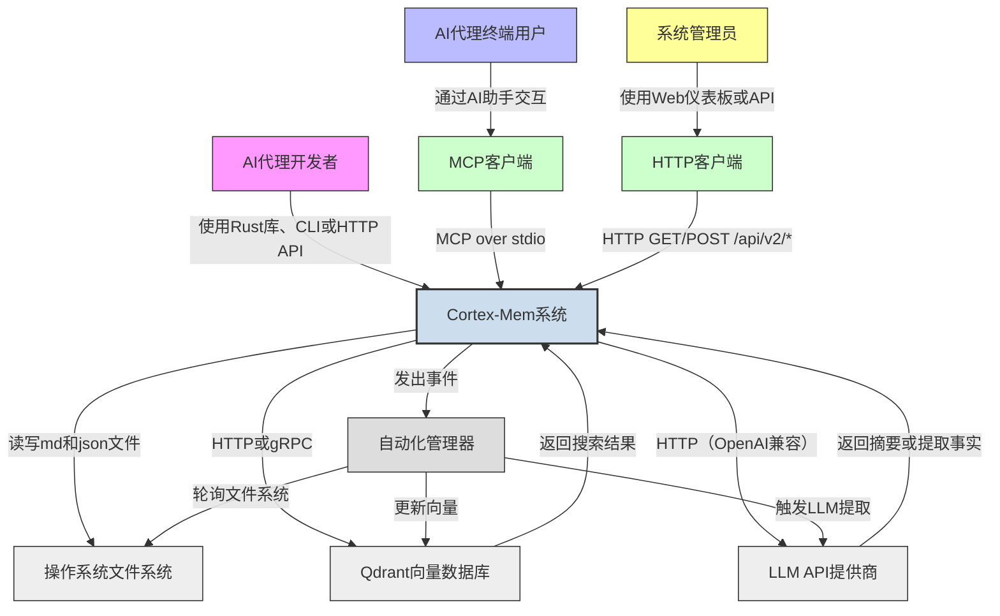

# 系统上下文概述

## 1. 项目介绍

**项目名称**: Cortex Memory (cortex-mem)  
**项目类型**: 全栈AI记忆系统  
**生成时间**: 2026-02-19 03:57:58 (UTC)  
**时间戳**: 1771473478

Cortex-Mem 是一个高性能、领域驱动的记忆管理系统，专为AI智能体设计，用于在对话会话中保留和利用上下文知识。它采用Rust构建，通过实现持久化、多维度的记忆架构来解决AI交互中无状态的根本挑战，自动捕获、结构化并检索人机对话历史。

其核心引入了一个由三个语义层组成的分层记忆模型：
- **L0（抽象层）**: 简洁、高层次的会话意图摘要。
- **L1（概览层）**: 结构化的markdown摘要，包含关键决策、实体和结果。
- **L2（细节层）**: 原始、未处理的对话记录，以markdown文件形式存储。

这些层使用外部LLM提供商生成的向量嵌入进行索引，并存储在Qdrant向量数据库中，实现快速、上下文感知的语义搜索。系统通过文件系统监控自动检测对话文件的变化，触发基于LLM的摘要和提取，并同步持久文件系统存储与向量存储之间的内容——确保一致性，无需人工干预。

Cortex-Mem不是单一的应用程序，而是一个模块化、可组合的基础设施。它通过四个不同的接口暴露其功能：
- **CLI工具**: 用于直接开发者交互和脚本编写。
- **RESTful HTTP API**: 用于与Web和移动客户端集成。
- **模型上下文协议（MCP）服务器**: 无缝集成到AI助手和IDE中。
- **基于Svelte的Web仪表板（Insights）**: 用于可视化记忆使用情况、租户分析和系统健康状况。

该系统为多租户而架构，支持SaaS部署，不同用户、组织或智能体的隔离记忆空间共享底层服务实例。此设计实现了企业级隐私、合规性和可扩展性。

**核心业务价值**:
- **消除会话间的上下文丢失**: 实现真正持久化的对话。
- **通过自动提取用户偏好、目标和关系**: 实现个性化智能体行为。
- **支持智能体的累积学习**: 让它们能够随着时间推移而改进，无需重新训练。
- **提供SaaS就绪的多租户**: 具有严格的数据隔离。
- **通过标准协议（MCP、HTTP、Rust库）**: 与现有LLM生态系统原生集成。

Cortex-Mem不是LLM提供商或聊天界面——它是让AI智能体记住的*记忆层*。它是将反应性AI转变为主动、上下文感知智能体的基础设施工具。

---

## 2. 目标用户

Cortex-Mem服务三种不同的用户角色，每种角色通过不同的接口与系统交互，具有独特的操作需求。

### 2.1 AI智能体开发者

**描述**: 使用TARS、Rig或自定义Rust/Python后端框架构建智能智能体的软件工程师和AI系统架构师。他们通过编程方式集成Cortex-Mem，为其应用程序添加持久记忆功能。

**使用场景**:
- 将`cortex-mem-core`作为Rust库嵌入，在自定义智能体运行时中启用记忆操作。
- 使用HTTP API从Web聊天前端持久化对话历史。
- 配置MCP工具（`query_memory`、`store_memory`），让AI助手（如Cursor、GitHub Copilot）能够回忆过去的用户交互。
- 通过CLI编写自动化脚本，批量导入或审计记忆数据。

**关键需求**:
- 用于记忆CRUD操作的类型安全、异步Rust API。
- 通过`tenant_id`上下文支持多租户隔离。
- 可靠的LLM集成，带有结构化提取的回退解析。
- 使用`cortex://` URIs的透明文件系统抽象。
- 全面的错误处理和日志记录，用于调试。
- 兼容OpenAI兼容的LLM端点和Qdrant集群。

### 2.2 AI智能体最终用户

**描述**: 使用AI驱动应用程序的最终用户（如客户支持机器人、个人助理、辅导智能体），依赖Cortex-Mem进行记忆持久化。这些用户通过智能体界面间接与系统交互。

**使用场景**:
- 与能够记住其偏好、过去请求和个人详情的AI助手进行自然的多会话对话。
- 根据历史行为接收个性化推荐（例如，"你上周提到更喜欢素食选项——你想让我推荐一家新餐厅吗？"）。
- 相信在一个会话中分享的敏感信息不会泄露给其他用户或智能体。

**关键需求**:
- 跨会话的无缝、不可见记忆保留。
- 无需手动记忆管理。
- 通过租户隔离确保隐私保证。
- 一致、准确地回忆事实和决策。
- 不会因记忆负载而性能下降。

### 2.3 系统管理员

**描述**: 负责在生产环境中部署、监控和扩展Cortex-Mem的DevOps工程师、平台运营人员和云基础设施团队——特别是在多租户SaaS部署中。

**使用场景**:
- 通过TOML文件和环境变量配置系统，指向远程Qdrant和LLM端点。
- 通过Insights仪表板监控跨租户的内存使用和存储增长。
- 在系统中断或数据损坏后触发手动同步（`sync_all`）。
- 独立扩展Qdrant集群，同时保持租户感知路由。
- 审计访问日志和资源消耗以确保合规。

**关键需求**:
- 集中式配置管理，带有环境回退。
- 用于健康检查（`/health`）、统计（`/api/v2/tenants/stats`）和管理的REST API端点。
- 用于可视化存储指标、租户数量和向量存储健康的Web仪表板。
- 清晰的系统组件关注点分离，便于故障排除。
- 支持容器化部署（Docker/Kubernetes）和可观察性（指标、日志）。
- 不依赖外部身份提供商——租户隔离通过命名空间作用域在内部处理。

---

## 3. 系统边界

Cortex-Mem在自身拥有什么和依赖什么之间定义了清晰的架构边界。此边界确保了可维护性、可扩展性和职责的清晰性。

### 3.1 包含的组件

以下组件在**系统边界内**，作为Cortex-Mem代码库的一部分进行开发、部署和维护：

| 组件 | 描述 |
|---------|-------------|
| **cortex-mem-core** | 包含所有核心业务逻辑的中心库：文件系统抽象（`cortex://`）、LLM客户端封装器、嵌入生成、Qdrant集成、会话管理、层级生成、提取引擎、搜索引擎和自动化编排器。 |
| **cortex-mem-cli** | 用于开发者交互记忆的命令行界面（搜索、列表、获取、删除、会话、统计）。 |
| **cortex-mem-service** | HTTP REST API服务器（基于Axum），暴露`/api/v2`端点用于记忆操作和租户分析。 |
| **cortex-mem-mcp** | 模型上下文协议服务器，通过stdio向AI助手暴露记忆工具（`query_memory`、`store_memory`等）。 |
| **cortex-mem-insights** | 基于Svelte的Web仪表板，用于可视化记忆使用情况、租户统计和搜索结果。 |
| **cortex-mem-config** | 配置管理模块，处理TOML加载、环境变量解析和租户特定覆盖。 |
| **cortex-mem-tools** | MCP工具模式用于智能体集成的操作封装。 |
| **cortex-mem-rig** | 与rig-core智能体框架的集成层，用于工具注册。 |
| **自动化组件** | 文件系统监视器、自动索引器、自动提取器、sync管理器和自动化管理器——所有内部事件驱动的编排器。 |
| **会话管理** | 消息、时间线和会话生命周期跟踪，带有事件发射（`SessionEvent::Closed`）。 |
| **向量存储客户端** | Qdrant客户端实现，带有租户感知的集合命名（`cortex-mem-{tenant_id}`）。 |
| **嵌入客户端** | OpenAI兼容嵌入API的封装器（如text-embedding-3-small）。 |
| **层级管理** | L0/L1/L2摘要生成和延迟加载逻辑。 |
| **提取引擎** | 从对话文本中结构化提取记忆（偏好、实体、事件、案例等）。 |
| **搜索引擎** | 加权评分的多层语义搜索（0.2×L0 + 0.3×L1 + 0.5×L2）。 |

所有组件均用Rust编写（Insights除外，为TypeScript/Svelte），共享单一Cargo工作空间下的代码库。

### 3.2 排除的外部依赖

以下组件**明确在系统边界外**，被视为外部服务：

| 组件 | 排除原因 |
|---------|----------------------|
| **第三方LLM提供商**（OpenAI、Anthropic、Mistral等） | Cortex-Mem通过HTTP API与它们交互，但不托管或管理它们。 |
| **外部Qdrant集群** | Cortex-Mem作为客户端连接Qdrant；数据库集群的部署、扩展和维护由运营者负责。 |
| **操作系统文件系统API** | 虽然Cortex-Mem使用操作系统文件系统进行持久化，但它通过`cortex://` URIs和异步文件系统特性抽象所有直接访问。操作系统级细节（如inode处理、NTFS vs ext4）无关紧要。 |
| **客户端应用程序**（如TARS聊天UI、Copilot、自定义Web应用） | 这些使用Cortex-Mem的API，但独立开发和维护。 |
| **Rust编译器和工具链** | 开发基础设施，非运行时系统的一部分。 |
| **外部监控/日志基础设施**（Prometheus、Grafana、Loki） | Cortex-Mem发出指标和日志，但摄取和可视化是外部的。 |
| **认证/授权提供商**（OAuth、Keycloak、Auth0） | 租户隔离通过headers/CLI参数中的`tenant_id`在内部处理。未实现身份联合。 |

> **范围说明**: Cortex-Mem的范围包括工作空间中提供记忆管理基础设施的所有crate——包括接口、自动化和配置——但排除任何外部基础设施、第三方服务或消费其API的客户端应用程序。

---

## 4. 外部系统交互

Cortex-Mem与五个关键的外部系统交互，每个都定义了关键的依赖或集成点。这些交互严格基于协议，不涉及共享代码或部署。

### 4.1 Qdrant向量数据库

- **交互类型**: 主数据存储
- **协议**: HTTP/gRPC（默认端口：6334）
- **目的**: L0、L1和L2记忆层的向量嵌入持久化存储。启用带元数据过滤（tenant_id、时间范围、实体）的语义相似性搜索。
- **数据流**:
  - Cortex-Mem发送带有向量化记忆对象（包括元数据）的`upsert`请求。
  - Cortex-Mem发送带有查询嵌入和过滤器的`search`请求。
  - Qdrant返回带有point ID和评分的排名结果。
- **依赖特征**:
  - **关键**: 没有Qdrant，系统无法执行语义搜索。
  - **可配置**: 端点、API密钥和集合命名方案可通过TOML配置。
  - **租户感知**: 每个租户有专属集合：`cortex-mem-{tenant_id}`。
  - **无回写**: Cortex-Mem不依赖Qdrant进行持久化——文件系统是真相来源。

### 4.2 LLM API提供商

- **交互类型**: AI/ML服务
- **协议**: HTTP（OpenAI兼容REST API）
- **目的**: 为文本生成嵌入，并为记忆摘要（L0/L1）和结构化提取（事实、决策、实体）执行文本补全。
- **示例**: OpenAI（`text-embedding-3-small`、`gpt-4o`）、Azure OpenAI、通过vLLM或Ollama的本地模型（如果OpenAI兼容）。
- **数据流**:
  - Cortex-Mem发送提示（结构化JSON）生成摘要或提取结构化记忆（偏好、实体、事件等）。
  - LLM返回结构化JSON输出（如`ExtractedMemories`）。
  - Cortex-Mem使用回退解析器解析和验证输出，以确保可靠性。
- **依赖特征**:
  - **关键**: 记忆提取和摘要依赖于LLM。
  - **可配置**: 端点、模型名称、API密钥、超时和重试策略可配置。
  - **回退策略**: 如果LLM失败，跳过或记录提取——系统保持运行。
  - **成本敏感**: 嵌入和提取被分批处理以最小化API调用。

### 4.3 操作系统文件系统

- **交互类型**: 文件存储
- **协议**: 类POSIX文件系统（通过Rust `tokio::fs`）
- **目的**: 将原始对话数据（L2）作为`.md`文件持久化存储，并将提取的配置文件存储为`.json`文件。
- **目录结构**:
  ```
  cortex://
  ├── tenants/
  │   ├── {tenant_id}/
  │   │   ├── session/
  │   │   │   ├── {session_id}.md
  │   │   │   └── ...
  │   │   ├── user/
  │   │   │   └── {user_id}.json
  │   │   ├── agent/
  │   │   │   └── {agent_id}.json
  │   │   └── resources/
  │   └── ...
  ```
- **依赖特征**:
  - **真相来源**: 所有记忆源于此处。向量存储是缓存。
  - **租户隔离**: 通过目录作用域实现——无跨租户文件访问。
  - **事件驱动**: 文件系统监视器监控变化以触发索引。
  - **可移植**: 在Linux、macOS、Windows上工作——通过`CortexFilesystem`特性抽象。

### 4.4 MCP客户端

- **交互类型**: 客户端协议
- **协议**: 通过stdio的模型上下文协议（MCP）
- **目的**: 使AI助手（如Cursor、Claude、自定义LLM智能体）无需直接HTTP访问即可查询和存储记忆。
- **暴露的工具**:
  - `query_memory`: 用自然语言搜索记忆。
  - `store_memory`: 持久化新事实或摘要。
  - `list_memories`: 枚举可用记忆。
  - `get_memory`: 通过ID获取特定记忆。
- **数据流**:
  - MCP客户端通过stdin发送JSON-RPC请求。
  - Cortex-Mem MCP服务器处理请求，调用核心逻辑，通过stdout返回JSON响应。
- **依赖特征**:
  - **战略性**: 实现与任何MCP兼容AI智能体的集成。
  - **轻量级**: 无网络开销——非常适合本地智能体执行。
  - **无状态**: 每个请求独立；不维护会话状态。

### 4.5 HTTP客户端（Web浏览器）

- **交互类型**: Web UI
- **协议**: HTTP/HTTPS（RESTful API）
- **目的**: 使用户和管理员能够通过Cortex-Mem Insights Web仪表板可视化、搜索和管理记忆。
- **消费的端点**:
  - `GET /api/v2/search` — 语义搜索。
  - `GET /api/v2/tenants/stats` — 存储指标。
  - `GET /api/v2/filesystem/list` — 浏览记忆文件。
- **数据流**:
  - 浏览器发送经过认证的请求（通过JWT或API密钥）。
  - Cortex-Mem服务返回JSON响应。
  - 前端使用Svelte组件渲染数据。
- **依赖特征**:
  - **面向用户**: 非技术用户和管理员的主要界面。
  - **有状态UI**: Web仪表板在客户端store中维护租户选择。
  - **无认证**: Cortex-Mem不处理认证——依赖反向代理（如Nginx、Auth0）进行TLS和令牌验证。

---

## 5. 系统上下文图



### 关键交互流

1. **记忆索引流**:  
   文件变更 → 文件系统监视器 → 自动化管理器 → 层级管理器（L0/L1） → 嵌入客户端 → Qdrant Upsert。

2. **语义搜索流**:  
   用户查询 → HTTP/MCP → 搜索引擎 → L0/L1/L2检索 → Qdrant相似性搜索 → 加权评分 → 返回排名结果。

3. **记忆提取流**:  
   会话关闭 → 会话管理器 → 自动化管理器 → 提取引擎 → LLM → 配置文件管理器 → 文件系统写入。

4. **仪表板流**:  
   管理员打开Insights → Web UI调用`/api/v2/tenants/stats` → 服务查询文件系统+Qdrant → 返回JSON → 前端渲染图表。

### 架构决策

- **文件系统作为真相来源**: 确保持久性和可审计性。向量存储是缓存。
- **通过命名空间的租户隔离**: 避免复杂的认证系统；简单的目录/集合作用域。
- **事件驱动自动化**: 将检测（监视器）与操作（索引器/提取器）解耦，以实现可扩展性。
- **分层检索**: 组合粗粒度（L0）和细粒度（L2）搜索以提高效率和精度。
- **协议无关**: 通过CLI、HTTP、MCP暴露相同核心逻辑——最大化集成灵活性。
- **无共享状态**: 所有接口无状态；上下文通过`tenant_id`和请求参数传递。

---

## 6. 技术架构概述

### 6.1 主要技术栈

| 层 | 技术 | 理由 |
|----|------------|-----------|
| **语言** | Rust | 内存安全、异步运行时（tokio）、零成本抽象、用于领域建模的强大类型系统。 |
| **核心库** | `cortex-mem-core` | 封装所有业务逻辑的单一crate；支持跨接口重用。 |
| **文件系统** | `tokio::fs` + `cortex://` URI方案 | 抽象OS细节；支持可移植、可测试的存储层。 |
| **向量存储** | Qdrant | 高性能、元数据感知的向量搜索；支持过滤、分页和批量upsert。 |
| **LLM集成** | OpenAI兼容HTTP API | 利用现有生态系统；支持本地和云模型。 |
| **HTTP服务器** | Axum | 异步、类型安全、富含中间件的Web框架。 |
| **MCP服务器** | 自定义stdio协议 | 轻量级、安全，非常适合本地智能体集成。 |
| **Web UI** | Svelte + TypeScript | 响应式、轻量级前端，Bundle大小最小。 |
| **配置** | TOML + 环境变量 | 标准、人类可读、可通过容器部署。 |
| **事件总线** | `tokio::mpsc`通道 | 轻量级、进程内事件处理，用于自动化触发。 |
| **构建系统** | Cargo Workspace | Monorepo结构，用于统一版本控制和依赖管理。 |

### 6.2 架构模式

- **分层架构**:  
  应用接口（CLI/HTTP/MCP/Web）、核心业务逻辑（core）和基础设施（文件系统、LLM、Qdrant）之间清晰分离。

- **领域驱动设计（DDD）**:  
  模块直接映射到有界上下文：`会话管理`、`提取引擎`、`配置文件管理`等。

- **事件驱动架构**:  
  自动化由事件（`FilesystemEvent`、`SessionEvent::Closed`）触发——将检测与操作解耦。

- **类似CQRS的模式**:  
  写路径（文件系统+提取）和读路径（向量搜索）逻辑分离——针对不同工作负载进行优化。

- **通过命名空间的多租户**:  
  无共享数据库模式；通过目录路径和集合名称实现隔离——简单、可扩展、安全。

- **基于接口的设计**:  
  核心服务暴露特性（`Filesystem`、`LLMClient`、`VectorStore`）——支持模拟、交换和测试。

### 6.3 关键设计决策

| 决策 | 理由 | 影响 |
|--------|-----------|--------|
| **使用`cortex://` URI方案** | 抽象文件系统细节；支持测试中的模拟和跨OS的可移植性。 | 支持无需真实文件的单元测试；简化路径解析。 |
| **将L2存储为.md文件** | 人类可读、版本控制友好、支持审计跟踪。 | 支持人工检查、通过git备份和调试。 |
| **按需生成L0/L1** | 减少存储开销；避免昂贵的预处理。 | 平衡延迟（首次搜索）与存储成本。 |
| **加权L0+L1+L2搜索** | 结合速度（L0）和精度（L2）；提高召回率和相关性。 | 在基准测试中优于单层搜索。 |
| **Cortex-Mem中无认证** | 将认证委托给反向代理或API网关。 | 简化核心逻辑；符合云原生模式。 |
| **MCP over stdio** | 实现本地、低延迟智能体集成，无需网络栈。 | 对IDE和边缘智能体用例至关重要。 |
| **从header/CLI获取租户ID** | 避免复杂的身份联合；简单、明确的作用域。 | 易于实现、审计和通过网络安全策略保护。 |
| **每个租户一个Qdrant集合** | 保证数据隔离，无需复杂RBAC。 | 防止即使Qdrant配置错误也不会发生跨租户泄漏。 |

### 6.4 可扩展性和可维护性洞察

- **水平扩展**:  
  HTTP API和MCP服务器可在负载均衡器后复制。Qdrant和文件系统必须共享（如NFS、S3、分布式FS）。

- **存储增长**:  
  记忆随对话量线性增长。L0/L1摘要相比原始L2减少约70%的向量存储需求。

- **可观察性**:  
  所有组件发出结构化日志（JSON）和指标（Prometheus格式）。健康端点（`/health`）报告Qdrant/LLM连接性。

- **升级策略**:  
  模式演进通过版本化数据模型处理（`MemoryV1`、`MemoryV2`）。通过serde的`skip_serializing_if`保持向后兼容。

- **测试策略**:  
  单元测试：模拟文件系统和Qdrant。集成测试：CI中真实Qdrant + LLM。端到端：CLI + HTTP + MCP针对真实数据。

---

## 结论

Cortex-Mem不仅仅是记忆存储——它是下一代AI智能体的**认知支柱**。通过结合持久文件系统存储、语义向量搜索、自动化知识提取和多租户隔离，它将短暂对话转化为持久的个性化智能。

其架构刻意模块化、协议无关和基础设施无关——支持在云、边缘和嵌入式环境中的采用。系统的优势不在于单个组件的创新，而在于它们的**优雅编排**：文件监视器触发LLM总结对话，然后被嵌入和索引——所有这些都无需用户干预。

对于AI开发者，它是库。  
对于最终用户，它是无缝的记忆。  
对于管理员，它是可扩展的、可观察的服务。

Cortex-Mem将遗忘转化为记忆——并将AI从反应性转变为真正的智能。
