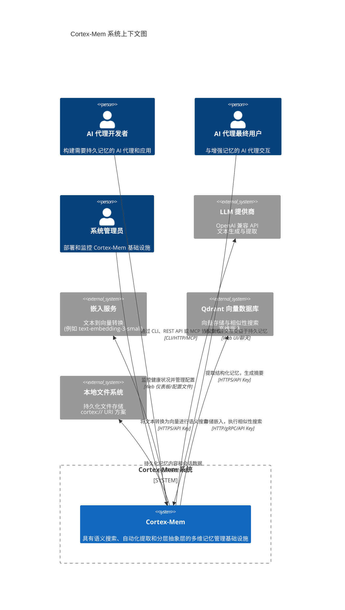

# Cortex-Mem 系统上下文概述

**文档版本：** 1.0  
**生成日期：** 2026-02-17 16:29:26 (UTC)  
**状态：** 架构基线  

---

## 1. 执行摘要

### 1.1 项目介绍

**Cortex-Mem** 是专门为 AI 代理和大语言模型（LLM）应用设计的全面、端到端内存管理基础设施。该系统通过提供持久化、语义化、长期记忆存储和检索能力，解决了现代 LLM 固定大小上下文窗口的根本限制。

作为多接口记忆底层，Cortex-Mem 使 AI 代理能够在对话中保持连续性，回忆用户偏好，检索相关历史背景，并随着时间推移逐步构建知识。该架构实现了复杂的多维记忆模型，在用户、代理和会话范围内组织数据，并具有分层抽象层（L0-L2），能够根据相关性和计算约束实现渐进式上下文加载。

### 1.2 核心业务价值

该系统提供六个主要价值主张：

1. **上下文窗口扩展**：通过持久化外部内存克服 LLM token 限制，实现理论上无限的对话历史保留
2. **语义检索**：基于向量的相似性搜索允许代理根据概念相关性而非精确关键词匹配来回忆信息
3. **自动化知识提取**：LLM 驱动的分析自动从原始对话数据中识别和结构化事实、偏好和实体
4. **多模式访问**：通过 CLI 工具、REST API、模型上下文协议（MCP）和基于 Web 的管理界面支持多种集成模式
5. **开发者体验**：基于文件系统的持久化与 URI 寻址（`cortex://`）支持版本控制、可移植性和简单调试
6. **多租户**：隔离的内存空间支持安全的多用户和多代理部署

### 1.3 技术特性

- **架构模式**：命令查询职责分离（CQRS）与事件驱动自动化
- **核心技术栈**：Rust（高性能后端服务）、TypeScript/SvelteKit（Web 洞察仪表板）
- **存储模型**：虚拟文件系统抽象（`cortex://` URI 方案），由物理文件存储支持
- **搜索能力**：使用高维嵌入（默认 1536 维）进行向量相似性搜索
- **集成协议**：HTTP/REST、模型上下文协议（MCP）、命令行接口（CLI）

---

## 2. 目标用户和利益相关者

Cortex-Mem 服务于三个不同的用户角色，每个角色都有特定的交互模式和技术要求。

### 2.1 AI 代理开发者

**角色定义**：构建需要持久记忆功能的 AI 代理应用的软件工程师和架构师。

**使用场景**：
- 将记忆功能集成到基于 Rust 的代理框架中
- 为 Python、Node.js 或其他语言生态系统构建 HTTP 客户端集成
- 开发具有基于工具的记忆访问的 MCP 兼容 AI 助手
- 编写记忆维护和数据迁移工作流的脚本

**关键需求**：
- Rust 库集成（`cortex-mem-core`）
- 跨平台集成的 HTTP REST API 访问
- AI 助手工具的模型上下文协议（MCP）支持
- 具有过滤和评分功能的向量搜索 API
- SaaS 部署的多租户隔离
- 优化的上下文窗口管理的分层内存加载（L0/L1/L2）

### 2.2 AI 代理最终用户

**角色定义**：通过聊天界面或 Web 应用与具有 Cortex-Mem 记忆功能的 AI 代理交互的非技术用户。

**使用场景**：
- 与能够记住过去交互的个人 AI 助手进行长时间对话
- 通过 Web 仪表板查询记忆洞察，了解代理知道什么
- 从回忆的偏好和历史中受益
- 跨多个聊天实例查看会话连续性

**关键需求**：
- 无需手动保存/加载操作的持久化对话历史
- 通过自然语言查询对过去交互进行语义搜索
- 跨会话的用户档案和偏好回忆
- 透明的基于 Web 的记忆洞察和分析
- 存储记忆内容的隐私控制

### 2.3 系统管理员

**角色定义**：负责部署、监控和维护 Cortex-Mem 生产实例的 DevOps 工程师和基础设施团队。

**使用场景**：
- 部署多服务架构（核心 + 洞察 + 向量数据库）
- 监控 Qdrant 向量数据库连接性和 LLM API 可用性
- 管理 CLI、服务和 MCP 服务器组件的配置
- 执行记忆优化和维护任务
- 分析系统性能指标和存储利用率

**关键需求**：
- 健康监控仪表板（通过洞察 Web UI）
- 通过 TOML 文件和环境变量进行配置管理
- REST API 和 MCP 端点的服务状态监控
- 性能指标和日志聚合
- 多服务编排能力

---

## 3. 系统边界和范围

### 3.1 系统范围定义

Cortex-Mem 包含从用户界面到核心处理库的完整内存管理基础设施。系统边界包括所有实现记忆语义、存储抽象和接口协议的软件组件。

### 3.2 包含的组件

以下组件构成 Cortex-Mem 系统：

**核心处理层**：
- `cortex-mem-core`：Rust 库，提供内存操作、向量搜索协调、LLM/嵌入客户端和提取管道
- `cortex-mem-tools`：Rust crate，包含 LLM 代理集成的工具定义
- `cortex-mem-config`：Rust 配置管理库，支持 TOML 解析

**接口适配器**：
- `cortex-mem-cli`：用于交互式和脚本化内存操作的 Rust CLI 应用
- `cortex-mem-service`：提供 JSON 端点的 Rust HTTP REST API 服务器
- `cortex-mem-mcp`：用于 AI 助手集成的 Rust 模型上下文协议服务器
- `cortex-mem-insights`：TypeScript/SvelteKit Web UI，带有基于 Elysia 的 API 服务器，用于监控和分析

**集成组件**：
- `cortex-mem-rig`：Rust Rig 框架集成，用于代理工具
- 配置文件（`config.toml`）和环境变量模式
- 会话数据、记忆存储和生成的层文件（本地文件系统）
- 服务内的内存状态管理

### 3.3 排除的组件

以下内容超出系统边界，作为外部依赖处理：

**外部 AI 服务**：
- LLM 服务提供商（OpenAI、Azure OpenAI、本地推理服务器如 Ollama）
- 第三方嵌入 API 服务（OpenAI text-embedding-3-small 或兼容服务）

**基础设施依赖**：
- Qdrant 向量数据库实例（外部服务，虽紧密集成）
- 操作系统文件系统驱动和内核级存储机制
- 网络基础设施、负载均衡器和 TLS 终止代理
- 容器编排平台（Kubernetes、Docker Swarm）用于部署时

---

## 4. 外部系统交互

Cortex-Mem 依赖四个外部系统来实现完整功能：

### 4.1 LLM 提供商（OpenAI 兼容）

**交互类型**：生成式 AI 服务集成  
**协议**：HTTPS/REST，API Key 认证  
**功能**：
- 为记忆摘要和抽象层创建（L0-L1）生成文本补全
- 为分析对话内容提供动力的自动化记忆提取管道
- 执行内容分类和重要性评分
- 支持多种提供商：OpenAI、Azure OpenAI 和本地 OpenAI 兼容端点

**数据流**：双向；Cortex-Mem 发送对话文本并接收结构化 JSON 提取或摘要内容。

### 4.2 嵌入服务 API

**交互类型**：向量生成服务  
**协议**：HTTPS/REST，API Key 认证  
**功能**：
- 将文本内容（记忆、查询、会话消息）转换为高维向量嵌入（默认 1536 维）
- 通过提供概念的一致向量表示实现语义相似性搜索
- 支持批量处理以高效索引大型记忆语料库

**数据流**：单向出站；Cortex-Mem 提交文本并接收嵌入向量。

### 4.3 Qdrant 向量数据库

**交互类型**：向量存储和搜索引擎  
**协议**：HTTP/gRPC，API Key 认证  
**功能**：
- 高维嵌入向量及相关元数据的持久化存储
- 用于语义相似性查询的近似最近邻（ANN）搜索
- 支持多维范围过滤（用户/代理/会话 ID）
- 用于记忆隔离和多租户的集合管理

**数据流**：双向；Cortex-Mem 在存储操作期间写入嵌入，在检索期间查询向量。

### 4.4 文件系统存储

**交互类型**：本地持久化层  
**协议**：OS 文件系统 API  
**功能**：
- 将记忆内容存储为带元数据头的 markdown 文件
- 持久化会话时间线和对话历史
- 缓存生成的抽象层（L0 摘要、L1 概述）
- 维护配置文件和系统日志

**数据流**：双向；Cortex-Mem 实现虚拟 URI 方案（`cortex://`），映射到目录结构，实现可移植的版本控制友好存储。

---

## 5. 系统上下文架构

### 5.1 C4 系统上下文图

下图说明了 Cortex-Mem 在其生态系统中的位置，描述了用户交互和外部系统依赖：

### 5.2 关键交互流程

**记忆存储流程**：  
开发者通过 CLI（`cortex-mem add`）或 API（POST `/memories`）提交记忆。系统通过嵌入服务生成嵌入，将向量存储到 Qdrant，使用 `cortex://` URI 方案将内容持久化到文件系统，并返回唯一的记忆标识符。

**语义检索流程**：  
最终用户或代理提交自然语言查询。Cortex-Mem 将查询转换为嵌入向量，使用元数据过滤（用户/代理/会话范围）在 Qdrant 中执行相似性搜索，从文件系统检索完整内容，并返回具有相关性评分的排名结果。

**自动化提取流程**：  
在会话处理期间，系统监控对话时间线，使用专门的提取提示将内容发送到 LLM 提供商进行分析，对识别的记忆进行分类（偏好、实体、事件），生成嵌入，并存储结构化结果以供将来检索。

**分层上下文加载**：  
当代理请求上下文时，系统首先返回 L0（摘要）层以进行快速相关性扫描。如果需要更深入的上下文，它会逐步加载 L1（概述）和 L2（详细）层，当缓存版本不存在时，通过 LLM 摘要按需生成中间层。

### 5.3 架构决策

**文件系统即真理**：  
与传统的数据库中心架构不同，Cortex-Mem 将本地文件系统作为主要持久化层，Qdrant 作为可搜索索引。这一决策优先考虑数据可移植性、版本控制兼容性和运营简单性。

**多接口策略**：  
系统通过四个不同的接口（CLI、REST、MCP、Web）公开功能，以适应不同的集成模式：shell 脚本、服务导向架构、AI 助手工具调用和人工行政监督。

**外部 AI 服务依赖**：  
核心功能（嵌入生成、记忆提取、摘要）依赖于外部 AI 服务而非嵌入式模型。这将计算要求与核心系统解耦，同时允许模型选择的灵活性。

**带事件驱动自动化的 CQRS**：  
该架构分离读写操作，自动化组件（文件监视器、自动索引器）处理文件系统存储和向量索引之间的后台同步。

---

## 6. 业务流程上下文

在系统上下文级别，Cortex-Mem 支持六个主要业务流程，为利益相关者提供价值：

### 6.1 记忆语义存储和检索
支持具有语义向量索引的结构化和非结构化记忆条目的持久化存储。支持多维组织（用户/代理/会话范围）和重要性评分。

### 6.2 自动化记忆提取
使用 LLM 功能实现智能内容分析，自动从对话会话中识别和结构化事实、偏好、决策和实体，减少手动数据输入。

### 6.3 分层记忆层生成
通过三个抽象级别（L0 摘要、L1 概述、L2 详细）提供渐进式上下文加载，通过仅加载必要的细节级别来优化 LLM 上下文窗口中的 token 使用。

### 6.4 语义向量搜索
使用向量相似性算法跨记忆语料库提供自然语言查询功能，实现概念检索而非精确关键词匹配。

### 6.5 会话生命周期管理
管理对话会话创建、消息累积、时间线持久化和自动索引，以维护跨交互的对话连续性。

### 6.6 记忆优化和维护
执行后台维护，包括重复检测、质量评分、内容重组和存储优化，确保记忆有用性和系统性能。

---

## 7. 技术约束和注意事项

**延迟敏感性**：  
语义搜索和记忆提取需要调用外部 LLM 和嵌入服务，引入对第三方 API 性能的延迟依赖。

**数据隐私**：  
记忆内容可能包含敏感用户信息。系统支持本地 LLM 部署以将数据保留在组织边界内，但这需要额外的基础设施。

**存储可扩展性**：  
虽然文件系统存储提供可移植性，但非常大的记忆语料库可能需要仔细的目录结构管理，以及向量数据库组件的分布式存储解决方案。

**一致性模型**：  
系统通过自动化同步进程在文件系统存储和向量数据库索引之间运行最终一致性模型。

---

*本文档建立了 Cortex-Mem 在系统上下文级别的架构基线，定义系统的范围、利益相关者和外部依赖，作为后续容器和组件级设计活动的输入。*
