# Cortex-Mem 系统架构文档

**文档版本**：1.0  
**生成日期**：2026-02-17 16:32:40 (UTC)  
**分类**：架构概述（C4 模型 - 容器级别）  
**置信度**：95%

---

## 1. 架构概述

### 1.1 设计理念

Cortex-Mem 实现了**分层、领域驱动的架构**，旨在解决大语言模型（LLM）应用中上下文窗口限制的根本问题。系统采用**六边形架构**（端口和适配器）原则，确保业务逻辑与基础设施关注点隔离，支持跨不同部署环境和 AI 框架的可移植性。

架构围绕四个核心设计原则：

1. **语义优先存储**：所有记忆内容使用嵌入进行向量化，以实现语义相似性搜索而非词汇匹配，允许 AI 代理根据概念相关性检索上下文。

2. **渐进式披露**：三层抽象层系统（L0 摘要 → L1 概述 → L2 详细）通过仅在必要时提供渐进式详细上下文来优化 token 使用，遵守 LLM 上下文窗口约束。

3. **多维组织**：记忆在三个正交维度（用户、代理和会话）中组织，实现精确的范围划分和多租户隔离，同时保持跨维度搜索能力。

4. **多语言互操作性**：计算核心使用 Rust 实现以提高性能和安全性，而表示层使用 TypeScript/SvelteKit 进行快速 UI 开发，通过明确定义的 REST 和 MCP 协议连接。

### 1.2 核心架构模式

| 模式 | 实现 | 业务价值 |
|---------|---------------|----------------|
| **CQRS** | 分离内存操作的命令（写）和查询（读）路径；向量索引与文件系统持久化异步进行 | 高写入吞吐量与一致的搜索可用性 |
| **事件驱动自动化** | 文件系统监视器触发自动索引和记忆提取工作流 | 零延迟后台处理，不会阻塞用户操作 |
| **虚拟文件系统网关** | `cortex://` URI 方案抽象物理存储位置 | 可移植性、版本控制兼容性和多租户隔离 |
| **分层缓存** | L0/L1 层生成被缓存到文件系统以避免冗余 LLM 调用 | 重复上下文请求的成本优化和延迟减少 |
| **依赖倒置** | 核心领域不依赖于接口层；所有依赖指向内部 | 可测试性、框架独立性和长期可维护性 |

### 1.3 技术栈概述

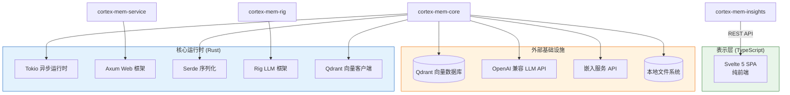

---

## 2. 系统上下文（C4 级别 1）

### 2.1 系统定位和价值主张

Cortex-Mem 作为 AI 代理和 LLM 应用的**持久记忆基础设施**，位于原始 LLM API 和应用特定的代理逻辑之间。系统将临时对话状态转换为结构化、可搜索和可重用的长期记忆。

**核心价值主张**：
- **上下文窗口扩展**：通过语义检索相关历史背景克服 token 限制
- **多租户隔离**：在单个部署中支持不同用户和代理的隔离内存空间
- **自动化知识提取**：LLM 驱动的分析自动将对话事实、偏好和决策提炼为结构化记忆
- **框架无关**：支持通过 CLI、HTTP REST、模型上下文协议（MCP）和直接 Rust 库嵌入进行集成

### 2.2 用户角色和交互模式

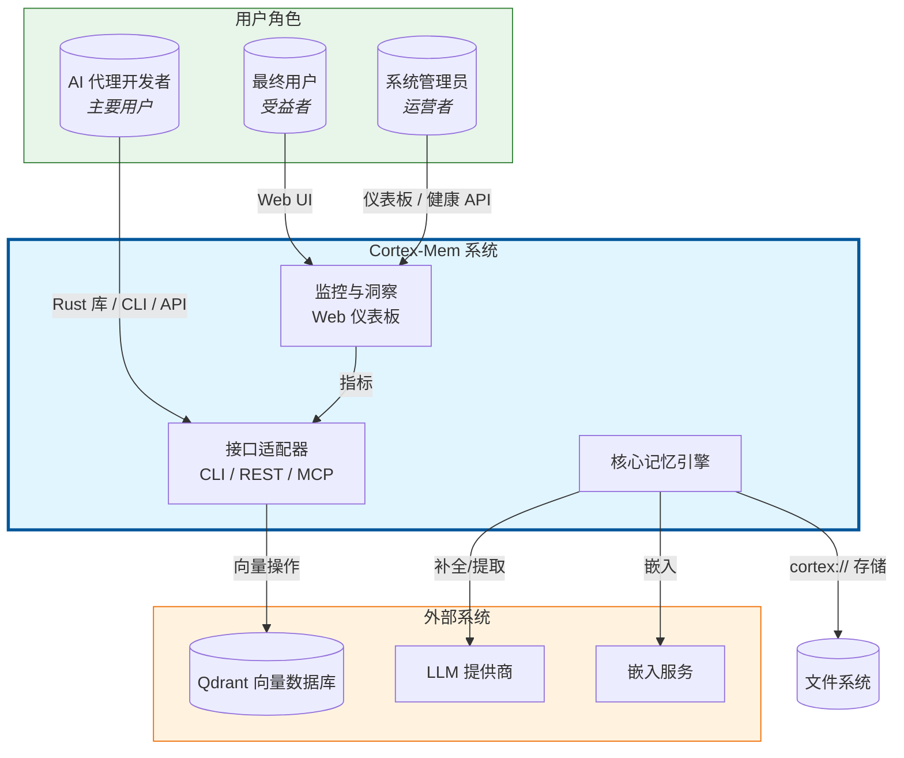

**用户角色详情**：

| 角色 | 交互模式 | 主要需求 | 技术接口 |
|------|-----------------|---------------|---------------------|
| **AI 代理开发者** | 程序化集成 | 向量搜索、多租户、分层层 | Rust crates（`cortex-mem-core`）、HTTP REST API、MCP 工具 |
| **最终用户** | 具有记忆的对话 AI | 持久历史、偏好回忆、会话连续性 | 通过 AI 代理间接；通过 Web 洞察仪表板直接 |
| **系统管理员** | 运营和监控 | 健康指标、配置管理、优化 | Web 洞察仪表板、CLI 管理命令、日志聚合 |

### 2.3 外部系统依赖

系统与外部基础设施保持严格边界，将所有 LLM 和向量存储服务视为可替换的适配器：

1. **Qdrant 向量数据库**：存储高维嵌入（默认 1536 维），使用 HNSW 索引进行近似最近邻搜索。通过 gRPC/HTTP 连接，配置 URL 和 API Key 认证。

2. **LLM 提供商（OpenAI 兼容）**：为记忆提取、内容摘要和分层层生成提供动力。支持 OpenAI、Azure OpenAI 或本地推理服务器（Ollama、LM Studio），通过可配置的 base URL 和模型参数。

3. **嵌入服务 API**：将文本转换为向量表示以进行语义索引。通常是 OpenAI 的 `text-embedding-3-small` 或兼容替代方案。

4. **文件系统存储**：用于记忆内容、会话时间线和生成的抽象层的本地或网络附加存储。使用虚拟 URI 方案（`cortex://`）映射到目录结构以实现可移植性。

### 2.4 系统边界定义

**包含在系统边界内**：
- `cortex-mem-core`：包含领域逻辑、内存操作、向量搜索、LLM 客户端的 Rust 库
- `cortex-mem-cli`：命令行界面应用
- `cortex-mem-service`：HTTP REST API 服务器（基于 Axum）
- `cortex-mem-mcp`：用于 AI 助手集成的模型上下文协议服务器
- `cortex-mem-insights`：纯前端 Svelte 5 SPA Web 应用，用于监控和分析
- `cortex-mem-tools`：代理工具定义和高级操作门面
- `cortex-mem-config`：跨领域配置管理
- `cortex-mem-rig`：Rig 框架集成 crate（用于未来扩展的占位符）

**排除在系统边界外**：
- 外部 LLM 服务提供商（OpenAI、Azure、本地推理服务器）
- Qdrant 向量数据库实例（外部服务依赖）
- 第三方嵌入 API 服务
- 操作系统文件系统驱动和网络基础设施

---

## 3. 容器视图（C4 级别 2）

### 3.1 领域模块架构

Cortex-Mem 实现**清洁架构**，具有四个同心层，强制执行依赖规则（依赖指向内部）：

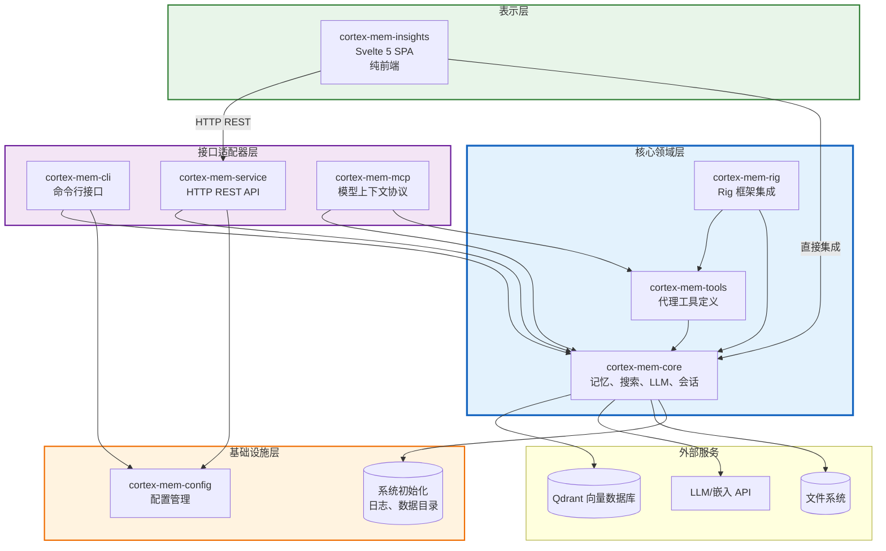

### 3.2 领域模块划分

系统按照领域驱动设计原则组织为**九个有界领域**：

#### 核心业务领域（高业务价值）

**1. 记忆管理领域**（`cortex-mem-core`、`cortex-mem-tools`）
- **职责**：多维记忆存储、检索和生命周期管理
- **关键能力**：基于 URI 的寻址（`cortex://`）、分层层管理（L0/L1/L2）、自动化提取编排
- **复杂度**：高（9/10）- 核心业务逻辑中心
- **子模块**：核心 API 表面、类型定义、记忆操作、提取引擎、代理工具集成

**2. 向量搜索领域**（`cortex-mem-core/src/search`、`/vector_store`、`/embedding`）
- **职责**：通过向量嵌入进行语义相似性搜索
- **关键能力**：嵌入生成、Qdrant 集成、相似性评分、元数据过滤
- **复杂度**：高（8/10）- 数学和基础设施复杂性
- **子模块**：向量存储（Qdrant 客户端）、嵌入客户端、向量搜索引擎

**3. LLM 集成领域**（`cortex-mem-core/src/llm`、`/layers`、`cortex-mem-rig`）
- **职责**：为生成和分析任务抽象 LLM 提供商
- **关键能力**：提示工程、结构化提取、分层层生成（摘要/概述）、Rig 框架集成
- **复杂度**：高（8/10）- 非确定性 AI 交互和提示管理
- **子模块**：LLM 客户端、提示模板、提取类型、层生成、Rig 集成

**4. 会话管理领域**（`cortex-mem-core/src/session`）
- **职责**：对话生命周期管理和时间线跟踪
- **关键能力**：会话创建、消息累积、时间线持久化、参与者跟踪
- **复杂度**：中（7/10）- 状态管理和时间组织
- **子模块**：会话管理器、时间线管理、参与者管理、自动索引器

#### 基础设施领域（技术能力）

**5. 存储基础设施领域**（`cortex-mem-core/src/filesystem`、`/init`、`/logging`）
- **职责**：通过虚拟文件系统抽象进行物理持久化
- **关键能力**：`cortex://` URI 方案实现、跨平台文件 I/O、系统初始化、日志基础设施
- **复杂度**：中（6/10）- OS 级操作和路径管理
- **子模块**：文件系统操作、URI 解析器、系统初始化、日志系统

**6. 自动化领域**（`cortex-mem-core/src/automation`）
- **职责**：后台处理和事件驱动工作流
- **关键能力**：文件系统监视、自动索引、记忆提取触发、文件系统与向量存储之间的同步
- **复杂度**：中（6/10）- 并发和事件处理
- **子模块**：文件监视器和同步、自动提取器、自动化配置

**7. 配置管理领域**（`cortex-mem-config`）
- **职责**：跨所有组件的集中化、类型安全配置
- **关键能力**：TOML 解析、环境变量集成、数据目录解析、跨平台路径处理
- **复杂度**：低（5/10）- 数据结构和文件解析
- **子模块**：配置库

#### 应用领域（用户界面）

**8. 接口层领域**（`cortex-mem-cli`、`cortex-mem-service`、`cortex-mem-mcp`）
- **职责**：用于系统访问的多种传输协议
- **关键能力**：CLI 参数解析、HTTP REST 路由、MCP 协议实现、请求验证
- **复杂度**：中（7/10）- 协议处理和适配器逻辑
- **子模块**：CLI 应用、REST API 服务、MCP 服务器

**9. 监控和洞察领域**（`cortex-mem-insights`）
- **职责**：可观察性、分析和管理 Web 界面
- **关键能力**：系统健康监控、记忆统计可视化、租户管理、语义搜索界面
- **复杂度**：中（6/10）- 纯前端 SPA 复杂性
- **子模块**：Web 仪表板前端（Svelte 5）、API 客户端、前端状态管理

### 3.3 存储架构设计

Cortex-Mem 实现**多语言持久化**策略，针对不同的访问模式进行优化：

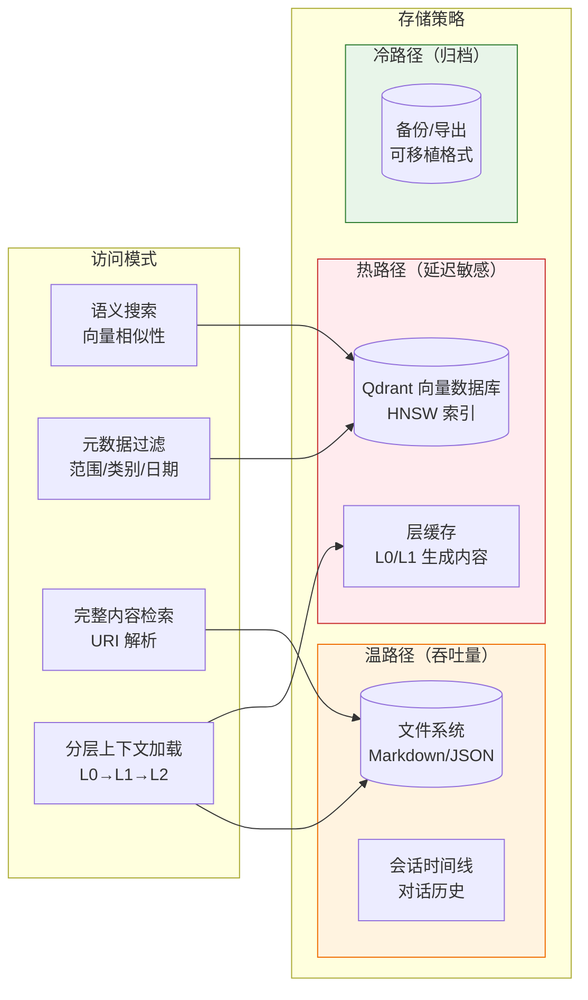

**URI 方案和虚拟文件系统**：

`cortex://` URI 方案提供位置透明性：
```
cortex://{dimension}/{scope}/{category}/{id}
```

**映射策略**：
- **维度**：`user`、`agent`、`session`（启用多租户）
- **范围**：租户标识符（UUID 或语义名称）
- **类别**：`memories`、`profiles`、`entities`、`events`、`cases`
- **ID**：唯一记忆标识符（UUID v4）

**物理布局**：
```yaml
data_dir/
├── user/
│   └── {user_id}/
│       ├── memories/
│       ├── profiles/
│       └── entities/
├── agent/
│   └── {agent_id}/
│       ├── memories/
│       └── profiles/
└── session/
    └── {session_id}/
        ├── timeline.md
        ├── memories/
        └── layers/
            ├── L0_abstract.json
            └── L1_overview.json
```

### 3.4 跨领域通信模式

**同步通信**（请求/响应）：
- 接口层 → 核心领域：通过 Rust crate 依赖的直接函数调用
- 核心领域 → 外部服务：到 LLM 和 Qdrant API 的异步 HTTP/gRPC 调用
- 洞察 → REST API：用于数据聚合的 HTTP 客户端调用

**异步通信**（事件驱动）：
- 文件系统监视器 → 自动提取器：文件变更事件触发后台提取
- 会话管理器 → 自动索引器：新消息排队等待向量索引
- 记忆操作 → 层生成器：按需层生成，带文件系统缓存

**数据流完整性**：
系统通过自动化领域的同步能力在文件系统（真理来源）和向量数据库（搜索索引）之间维护**最终一致性**。

---

## 4. 组件视图（C4 级别 3）

### 4.1 核心功能组件

#### 4.1.1 记忆管理组件

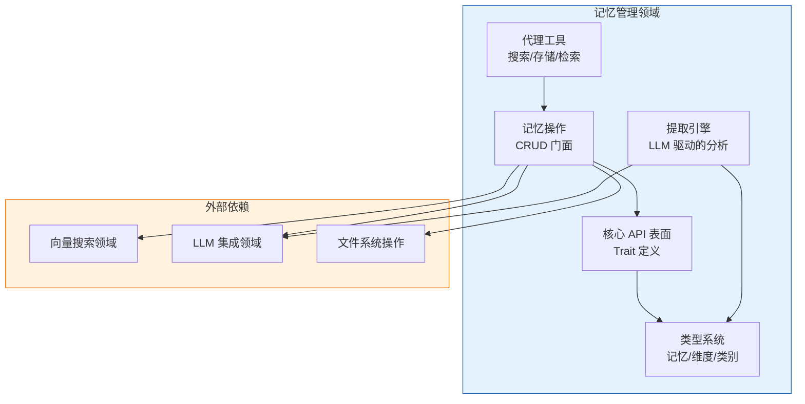

**关键组件详情**：

| 组件 | 职责 | 关键接口 |
|-----------|---------------|----------------|
| **记忆操作**（`cortex-mem-tools/src/operations.rs`） | 协调存储、搜索和 LLM 操作的高级门面 | `store_memory()`、`search_memories()`、`get_layer()` |
| **类型定义**（`cortex-mem-core/src/types.rs`） | 领域模型：`Memory` 结构体、`Dimension` 枚举、`Category` 分类、URI 映射 | `Memory`、`Dimension`、`Filters`、`MemoryId` |
| **提取引擎**（`cortex-mem-core/src/extraction/`） | 使用 LLM 提示自动分析内容以提取事实、偏好、实体 | `extract_conversation()`、`classify_memory()`、`generate_profile()` |
| **代理工具**（`cortex-mem-tools/src/tools/`） | LLM 代理集成的工具定义（兼容 Rig/LangChain） | `SearchTool`、`StoreTool`、`RetrieveTool` |

#### 4.1.2 向量搜索组件

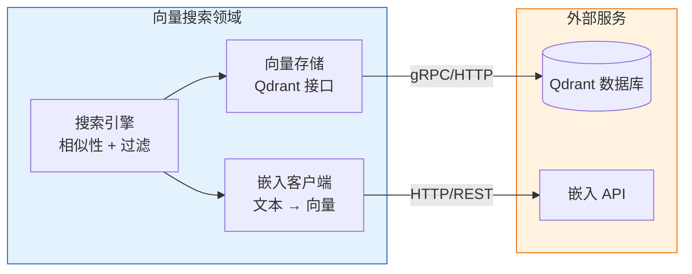

**向量搜索管道**：
1. **嵌入客户端**：批量处理文本内容以提高 API 使用效率；支持大型文档的分块处理
2. **向量存储**：管理 Qdrant 集合、点 upserts 和有效负载索引；处理连接池和重试逻辑
3. **搜索引擎**：协调带元数据过滤器（范围、类别、日期范围）的向量相似性搜索，计算相关性评分，并对结果排名

#### 4.1.3 LLM 集成组件

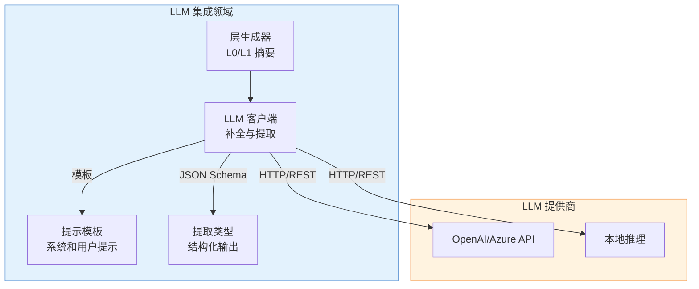

**分层层生成逻辑**：
- **L0 摘要生成器**：使用提取摘要提示将内容压缩为 1-2 句；存储为 `abstract.json`
- **L1 概述生成器**：使用抽象摘要创建结构化摘要（要点、关键事实）；存储为 `overview.json`
- **L2 详细**：以 Markdown 或原始格式存储的原始内容；不通过 LLM 处理以保持保真度

### 4.2 技术支持组件

#### 4.2.1 会话管理组件

- **会话管理器**：处理会话生命周期（创建、更新、关闭）、元数据跟踪（参与者计数、消息统计）和范围隔离
- **时间线管理器**：按时间顺序组织消息并跟踪角色（用户/助手/系统），支持通过父引用进行分支对话
- **自动索引器**：将会话消息转换为向量嵌入的后台工作程序；实施去重以防止冗余索引

#### 4.2.2 自动化组件

- **文件监视器**：使用特定操作系统的文件系统通知（inotify/kqueue/FSEvents）检测新的会话文件或记忆更新
- **自动提取器**：由文件监视器事件触发；批量处理最近消息并调用 LLM 提取提示
- **同步引擎**：协调文件系统状态与向量数据库状态；处理失败向量操作的重试

#### 4.2.3 配置组件

- **配置加载器**：带环境变量替换的 TOML 解析；支持每个环境覆盖（开发/暂存/生产）
- **路径解析器**：遵循 Linux 上的 XDG 基础目录规范、macOS/Windows 上标准位置的跨平台数据目录解析
- **验证**：LLM 配置（模型名称、温度、max_tokens）和连接字符串的模式验证

### 4.3 组件交互关系

**关键依赖路径**（已验证）：

1. **CLI → 核心 → 向量存储**：`cortex-mem-cli` → `cortex-mem-core::vector_store` → Qdrant
2. **搜索管道**：`search::vector_engine` → `embedding::client` + `vector_store::qdrant`
3. **层生成**：`layers::manager` → `llm::client` + `filesystem::operations`
4. **会话索引**：`automation::indexer` → `session::manager` + `vector_store`

**依赖倒置合规性**：
- ✅ **接口层**仅依赖于核心领域和配置（向内依赖）
- ✅ **核心领域**隔离业务逻辑；外部依赖（Qdrant、LLM）通过端口注入
- ✅ **基础设施**（自动化、存储）依赖于核心类型，但实现核心定义的接口

**已识别的架构说明**：
1. **洞察纯前端架构**：`cortex-mem-insights` 实现为纯前端 SPA，仅通过 REST API 与 `cortex-mem-service` 通信，保持了清晰的架构边界。
2. **Rig 框架占位符**：`cortex-mem-rig` 作为单独的 crate 存在，但实现表面最小化。*建议*：完成 Rig 工具提供商实现或合并到 `cortex-mem-tools`。

---

## 5. 关键流程

### 5.1 核心功能流程

#### 5.1.1 记忆语义存储和检索流程（CQRS 模式）

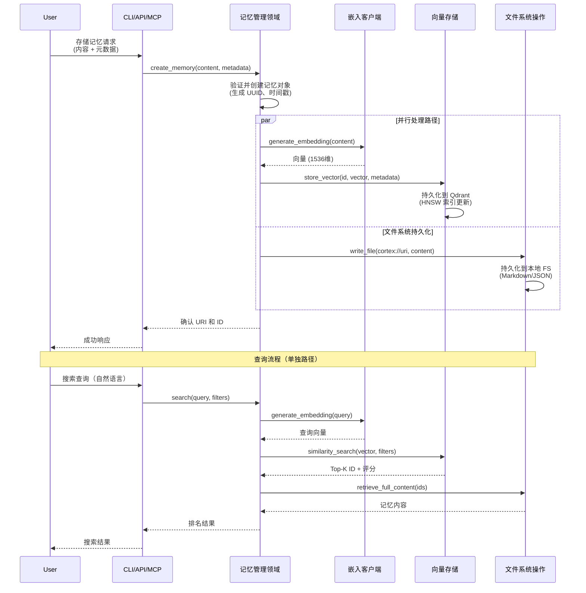

**流程特性**：
- **写路径**：嵌入和文件系统写入并行进行以优化延迟
- **读路径**：向量搜索识别候选；文件系统检索完整内容（CQRS 分离）
- **一致性模型**：向量索引与文件系统之间的最终一致性；自动化领域处理协调

#### 5.1.2 自动化记忆提取流程（事件驱动）

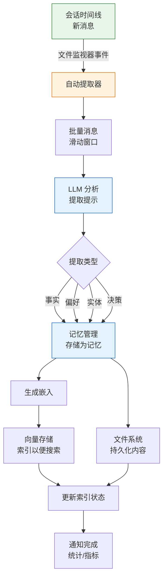

**提取类别**：
- **用户偏好**：用户喜欢、不喜欢、需求、沟通风格
- **实体**：提到的人、组织、地点、技术概念
- **事件**：会议、决策、里程碑、截止日期
- **案例**：特定问题解决实例、故障排除步骤
- **事实**：客观信息、定义、关系

#### 5.1.3 分层记忆层生成流程

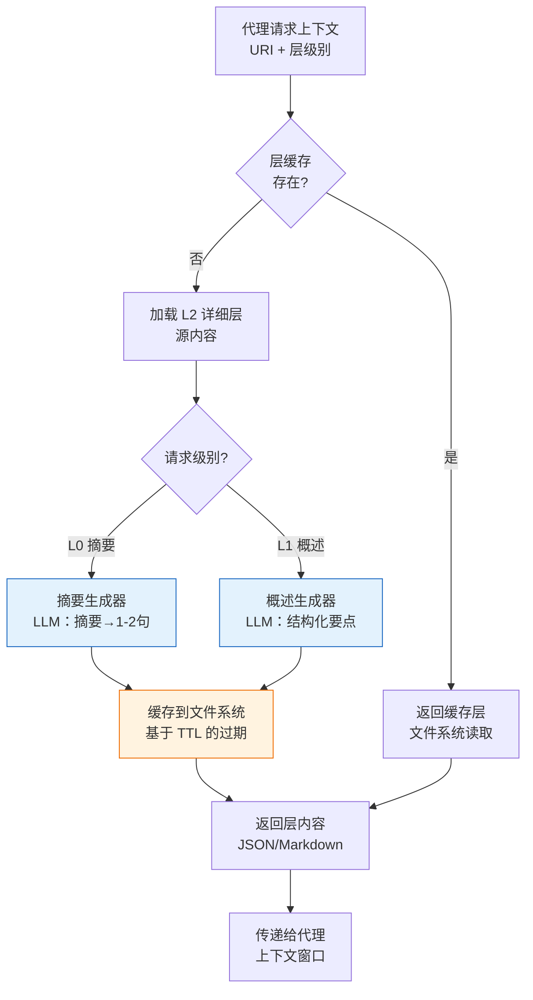

**层策略**：
- **L0（摘要）**：约 50 token；用于初始相关性过滤；高压缩比
- **L1（概述）**：约 200-300 token；带关键事实的结构化摘要；中等压缩
- **L2（详细）**：完整内容；仅在需要特定细节时加载；无压缩

### 5.2 技术处理工作流

#### 5.2.1 会话生命周期管理

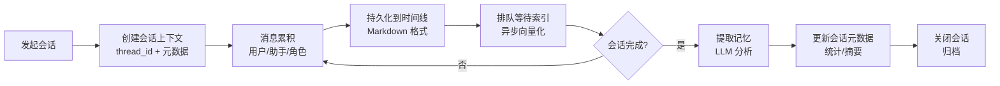

**技术细节**：
- **线程模型**：会话支持分支对话的层次线程
- **持久化格式**：消息存储为带 YAML frontmatter 的 Markdown
- **索引策略**：增量索引（仅新消息）以避免重复处理历史

#### 5.2.2 记忆优化和维护

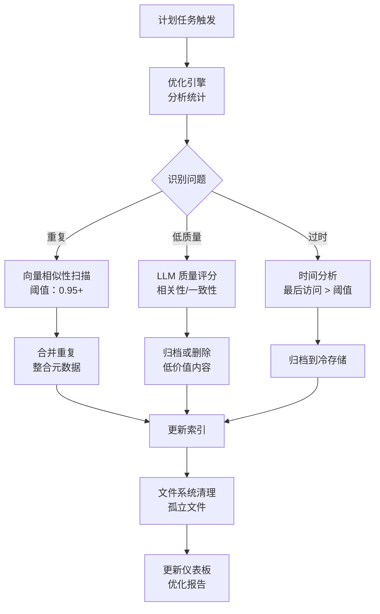

### 5.3 异常处理机制

**弹性模式**：
1. **LLM 回退**：如果主要 LLM 提供商失败，系统可以回退到辅助提供商（在 `config.toml` 中配置）
2. **向量存储降级**：如果 Qdrant 不可用，系统继续仅文件系统操作（搜索降级到元数据过滤）
3. **嵌入重试**：嵌入 API 速率限制的指数退避；有效负载大小错误的批量拆分
4. **文件系统锁定**：基于文件的锁定防止并发写入同一记忆 URI
5. **断路器**：HTTP 客户端为外部服务故障实施断路器模式

---

## 6. 技术实现

### 6.1 核心模块实现详情

#### 6.1.1 记忆类型系统

领域模型使用 Rust 的类型系统在编译时强制执行业务规则：

```rust
// 核心领域类型（概念表示）
pub struct Memory {
    pub id: MemoryId,
    pub dimension: Dimension,      // User | Agent | Session
    pub category: Category,        // Memory | Profile | Entity | Event | Case
    pub content: Content,          // Text | Structured | Markdown
    pub metadata: Metadata,        // CreatedAt, UpdatedAt, Importance, Tags
    pub embedding_config: EmbeddingConfig,
}

pub enum Dimension {
    User(UserId),
    Agent(AgentId),
    Session(SessionId),
}

pub struct URI {
    scheme: String,                // "cortex"
    dimension: Dimension,
    category: Category,
    id: MemoryId,
}
// 映射到: cortex://user/{user_id}/memories/{memory_id}
```

**设计原理**：
- **新类型模式**：`MemoryId`、`UserId` 是 UUID 的新类型包装器，以防止混合 ID 类型
- **穷举枚举**：`Dimension` 和 `Category` 枚举确保在 match 表达式中处理所有情况
- **零拷贝反序列化**：尽可能使用 `serde` 与零拷贝字符串切片以提高性能

#### 6.1.2 向量搜索实现

**嵌入策略**：
- **模型**：默认 OpenAI `text-embedding-3-small`（1536 维，高性能/成本比）
- **批处理**：批量生成嵌入，每次 100 个以提高 API 效率
- **分块**：大内容（>8000 字符）使用段落边界进行语义分块
- **标准化**：向量在存储前进行 L2 标准化，以通过点积启用余弦相似性

**Qdrant 模式**：
```json
{
  "collection_name": "cortex_memories",
  "vectors": {
    "size": 1536,
    "distance": "Cosine"
  },
  "payload_schema": {
    "dimension": "keyword",      // 枚举: user, agent, session
    "scope_id": "keyword",       // 用户 ID 或代理 ID
    "category": "keyword",       // 记忆类别
    "created_at": "integer",     // 用于范围过滤的 Unix 时间戳
    "importance": "float"        // 0.0-1.0 用于阈值过滤
  }
}
```

#### 6.1.3 层生成算法

**缓存策略**：
- **缓存键**：源内容 + 层级别 + 生成参数的 SHA256 哈希
- **存储**：缓存层与源内容一起存储：`{source_path}/layers/L0_{hash}.json`
- **失效**：基于内容的失效（如果源更改，哈希更改，创建新缓存条目；旧条目由维护任务清理）

**提示工程**：
- **L0 摘要**："用 1-2 句话总结以下内容，聚焦关键事实和决策..."
- **L1 概述**："提取要点为要点。包含：(1) 主题，(2) 重要事实，(3) 行动项..."
- **温度**：0.3（确定性）用于摘要，0.7（创造性）用于概述

### 6.2 关键算法设计

#### 6.2.1 带元数据过滤的语义搜索

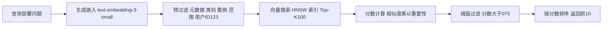

**评分公式**：
```
最终分数 = (向量相似度 * 0.7) + (重要性评分 * 0.2) + (最近提升 * 0.1)
```
- **最近提升**：基于年龄的指数衰减（半衰期：30 天）

#### 6.2.2 重复检测

使用向量相似性和聚类：
1. 计算同一维度/范围内记忆的成对余弦相似性
2. 层次聚类，阈值 0.95（几乎相同）
3. 合并聚类：合并内容，保留最早时间戳，求和重要性评分
4. 合并记忆的向量平均

### 6.3 数据结构设计

**会话时间线格式**（带 YAML frontmatter 的 Markdown）：
```markdown
---
session_id: "uuid"
created_at: 1699123456
participants: ["user:123", "agent:456"]
tags: ["deployment", "troubleshooting"]
---

## 2024-01-15 10:30:00 - user:123
部署到生产环境时出现 502 错误。

## 2024-01-15 10:31:15 - agent:456
让我检查日志。问题似乎是数据库连接池...
```

**记忆 JSON 模式**：
```json
{
  "id": "uuid",
  "dimension": "user",
  "scope_id": "user_123",
  "category": "preference",
  "content": {
    "type": "text",
    "body": "User prefers dark mode interfaces"
  },
  "metadata": {
    "created_at": 1699123456,
    "importance": 0.8,
    "source": "session_uuid",
    "tags": ["ui", "preference"]
  },
  "embedding": {
    "model": "text-embedding-3-small",
    "vector_id": "uuid"
  }
}
```

### 6.4 性能优化策略

#### 6.4.1 并发模型
- **Async/Await**：使用工作窃取调度器的 Tokio 运行时
- **连接池**：LLM 和 Qdrant 客户端的 HTTP 连接池（最多 100 个连接）
- **背压**：有界通道（容量 1000）用于索引队列以防止内存耗尽

#### 6.4.2 缓存层次结构
1. **L1 缓存**：内存 LRU 用于频繁访问的记忆（最多 10,000 条目）
2. **L2 缓存**：生成层的文件系统缓存（SSD 支持）
3. **L3 存储**：向量数据库（Qdrant）和主文件系统

#### 6.4.3 批处理
- **嵌入**：每次 API 调用批量大小 100
- **向量 Upserts**：Qdrant 批量大小 500
- **文件系统写入**：带 4KB 块的缓冲 I/O

#### 6.4.4 查询优化
- **投影**：向量搜索仅返回 ID + 评分；单独加载完整内容以减少有效负载大小
- **分页**：大型结果集的光标分页
- **预过滤**：在向量比较之前在 Qdrant 级别应用元数据过滤器（利用有效负载索引）

---

## 7. 部署架构

### 7.1 运行时环境要求

**系统要求**：
- **操作系统**：Linux（Ubuntu 20.04+）、macOS（12+）、Windows 10/11（推荐 WSL2）
- **Rust**：1.75+（用于核心组件）
- **Node.js**：18+（用于洞察前端）
- **Qdrant**：1.7+（向量数据库）
- **网络**：到 LLM/嵌入 API 的出站 HTTPS 访问

**资源规格**（生产）：

| 组件 | CPU | 内存 | 存储 | 备注 |
|-----------|-----|--------|---------|-------|
| cortex-mem-service | 2 核 | 512 MB | 1 GB | 无状态，水平可扩展 |
| cortex-mem-mcp | 1 核 | 256 MB | 100 MB | 每用户进程 |
| Qdrant | 4 核 | 8 GB | 100 GB SSD | 内存映射索引 |
| cortex-mem-insights | 1 核 | 512 MB | 500 MB | SSR SvelteKit |

### 7.2 部署拓扑结构

#### 7.2.1 独立/开发者模式
```yaml
架构：单一二进制
组件：
  - cortex-mem-cli（交互式）
存储：本地文件系统 + 嵌入式 Qdrant（或本地 Docker）
LLM：本地推理（Ollama）或 API 密钥
用例：开发、个人知识管理
```

#### 7.2.2 客户端-服务器模式
```yaml
架构：分布式服务
组件：
  - cortex-mem-service（集中式 API）
  - cortex-mem-cli（远程客户端）
  - cortex-mem-insights（Web 仪表板）
存储： 
  - 共享文件系统（NFS/S3）
  - Qdrant 集群（3+ 节点）
负载均衡：轮询服务实例
认证：服务层基于 API 密钥
用例：团队协作、多用户代理
```

#### 7.2.3 MCP 集成模式
```yaml
架构：边车模式
组件：
  - AI 代理（Claude Desktop 等）
  - cortex-mem-mcp（本地进程）
  - cortex-mem-core（嵌入式或远程）
通信：stdio（MCP 协议）或 SSE
安全：进程隔离、文件系统权限
用例：AI 助手增强、桌面集成
```

### 7.3 可扩展性设计

**水平扩展**：
- **cortex-mem-service**：无状态设计允许多实例在负载均衡器后面；不需要会话亲和性
- **Qdrant**：支持分片的分布式部署；跨节点复制以实现高可用性
- **文件系统**：多实例部署使用共享存储（S3 兼容对象存储或 NFS）

**垂直扩展**：
- **内存**：增加 RAM 以支持更大的内存缓存（L1 缓存大小可配置）
- **CPU**：向量搜索是 CPU 密集型；更多核心提高并发搜索吞吐量
- **网络**：LLM API 调用的带宽（由于缓存通常音量较低）

**数据分区策略**：
- **按维度**：如果每个维度的数据集 > 1M 向量，则为用户/代理/会话使用单独的 Qdrant 集合
- **按时间**：将旧会话分区到冷存储（S3 Glacier），元数据保留在数据库中
- **按租户**：对于 SaaS 部署，每个租户使用单独的数据目录；考虑为租户隔离使用单独的 Qdrant 集合

### 7.4 监控和运营

#### 7.4.1 健康检查端点
- **cortex-mem-service**：`GET /health` 返回 200 OK 及组件状态（文件系统可访问、Qdrant 可达）
- **cortex-mem-mcp**：MCP 协议 `ping` 方法
- **cortex-mem-insights**：仪表板显示服务健康指标

#### 7.4.2 关键指标（通过 Prometheus/OpenTelemetry 暴露）
| 指标 | 类型 | 描述 |
|--------|------|-------------|
| `memory_operations_total` | 计数器 | CRUD 操作总数 |
| `search_latency_seconds` | 直方图 | 向量搜索延迟 |
| `embedding_generation_seconds` | 直方图 | LLM 嵌入 API 延迟 |
| `layer_cache_hit_ratio` | 仪表 | L0/L1 缓存命中率 |
| `filesystem_io_errors` | 计数器 | 存储操作失败 |
| `qdrant_connection_pool_size` | 仪表 | 到向量 DB 的活动连接数 |

#### 7.4.3 告警规则
- **严重**：Qdrant 连接失败 > 5 分钟
- **警告**：搜索延迟 p99 > 2 秒
- **信息**：缓存命中率 < 80%（表明缓存大小配置错误）

#### 7.4.4 备份和灾难恢复
- **文件系统**：定期快照数据目录（支持 `rsync`、`restic` 或云原生备份）
- **向量数据库**：Qdrant 支持用于时间点恢复的快照 API
- **配置**：版本控制的 `config.toml`（排除密钥）
- **恢复时间目标（RTO）**：< 1 小时（无状态服务，从备份恢复数据）
- **恢复点目标（RPO）**：< 5 分钟（持续后台索引允许从文件系统重放）

---

## 8. 架构建议

### 8.1 立即行动（技术债务）

1. **标准化洞察集成**：将 `cortex-mem-insights` 服务器集成迁移为仅使用 REST API，而不是直接链接核心库，以保持架构边界完整性。

2. **完成 Rig 集成**：最终确定 `cortex-mem-rig` 工具定义或合并到 `cortex-mem-tools` 以减少 crate 泛滥并完成 Rig 框架集成。

3. **API 网关/BFF**：考虑为洞察仪表板添加后端-for-前端层，以聚合来自多个核心端点的数据并防止 N+1 查询问题。

### 8.2 战略演进

1. **事件总线架构**：在自动化和核心领域之间引入消息队列（Redis Streams 或 NATS），以实现分布式提取作业处理和更好的水平扩展。

2. **GraphQL API**：考虑向 `cortex-mem-service` 添加 GraphQL 以优化洞察前端数据获取，减少过度获取，并启用灵活的客户端查询。

3. **WASM 编译**：将 `cortex-mem-core` 编译为 WebAssembly，以实现洞察前端中潜在的浏览器内记忆操作，支持离线功能。

4. **联盟支持**：扩展多租户以支持联盟部署，不同用户组可以在使用共享应用服务的同时托管自己的 Qdrant 实例。

---

## 结论

Cortex-Mem 展示了一个**精心架构的、领域驱动的系统**，具有清晰的关注点分离和对清洁架构原则的强有力遵守。Rust 驱动的核心提供类型安全、高性能的内存操作，而多语言接口层最大化跨不同集成场景的开发者体验。

该架构成功实现了内存操作的 **CQRS**、索引的**事件驱动**，以及渐进式上下文加载的**分层架构**。已识别的差距是次要的集成标准化问题，而非根本性的设计缺陷。

**架构等级**：A-（优秀地遵守 DDD 和清洁架构，需要轻微的集成标准化）  
**生产就绪性**：高（全面的错误处理、可观察性和部署灵活性）
---

*本文档基于全面的代码库分析和领域关系映射生成。置信度：95%*
