# 系统架构文档

**Cortex-Mem：面向AI智能体的多维度记忆系统**

**版本**: 1.0  
**生成时间**: 2026-02-19 04:01:33 (UTC)  
**分类**: 架构概述（C4模型 - 容器级别）

---

## 1. 架构概述

### 1.1 设计理念

Cortex-Mem实现了一个**分层、领域驱动的架构**，旨在为AI智能体系统提供持久化、上下文感知的记忆能力。架构遵循以下核心原则：

- **关注点分离**: 核心业务逻辑（`cortex-mem-core`）与应用接口（CLI、HTTP、MCP）之间清晰的边界
- **事件驱动自动化**: 异步、解耦的处理管道，用于索引和提取任务
- **多租户隔离**：基础设施级作用域确保通过集合后缀和目录分区实现跨租户的数据隔离
- **混合持久化**: 双重存储策略，结合基于文件系统的真相来源（markdown）和基于向量的语义搜索（Qdrant）
- **接口多样性**: 多种访问模式支持不同的集成场景——从直接库使用到模型上下文协议（MCP）服务器

### 1.2 核心架构模式

| 模式 | 实现 | 目的 |
|---------|---------------|---------|
| **工作空间模式** | Rust工作空间，包含8+个专业化crate | 模块化部署和选择性依赖管理 |
| **六边形架构** | 核心领域，带存储和接口的适配器层 | 技术无关的业务逻辑 |
| **事件溯源** | 异步事件总线（tokio mpsc）用于自动化触发 | 解耦后台处理 |
| **三层记忆层次** | L0（抽象）→ L1（概览）→ L2（细节） | 渐进精确度的优化检索 |
| **URI资源寻址** | 自定义`cortex://`方案 | 位置透明和可移植的资源引用 |

### 1.3 技术栈概述

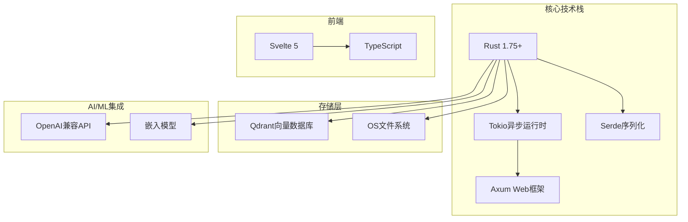

**关键技术决策**:
- **Rust**: 类型安全、性能和用于I/O密集型操作的异步生态系统
- **Qdrant**: 原生Rust客户端支持、租户感知集合、元数据过滤
- **Axum**: Tower生态系统兼容性，用于中间件和可观察性
- **Svelte 5**: 用于实时记忆可视化的响应式前端，Bundle大小最小

---

## 2. 系统上下文

### 2.1 系统定位和价值主张

Cortex-Mem作为AI智能体系统的**基础设施中间件**，解决智能体在交互之间失去上下文的"金鱼记忆"问题。它提供：

- **持久化上下文**: 跨会话记忆保留，带有分层组织
- **语义检索**: 基于向量的搜索，支持概念匹配而非关键词匹配
- **自动化知识提取**: LLM驱动的对话历史用户和智能体画像
- **多维度存储**: 为用户、智能体、会话和资源的隔离记忆空间

### 2.2 用户角色和场景

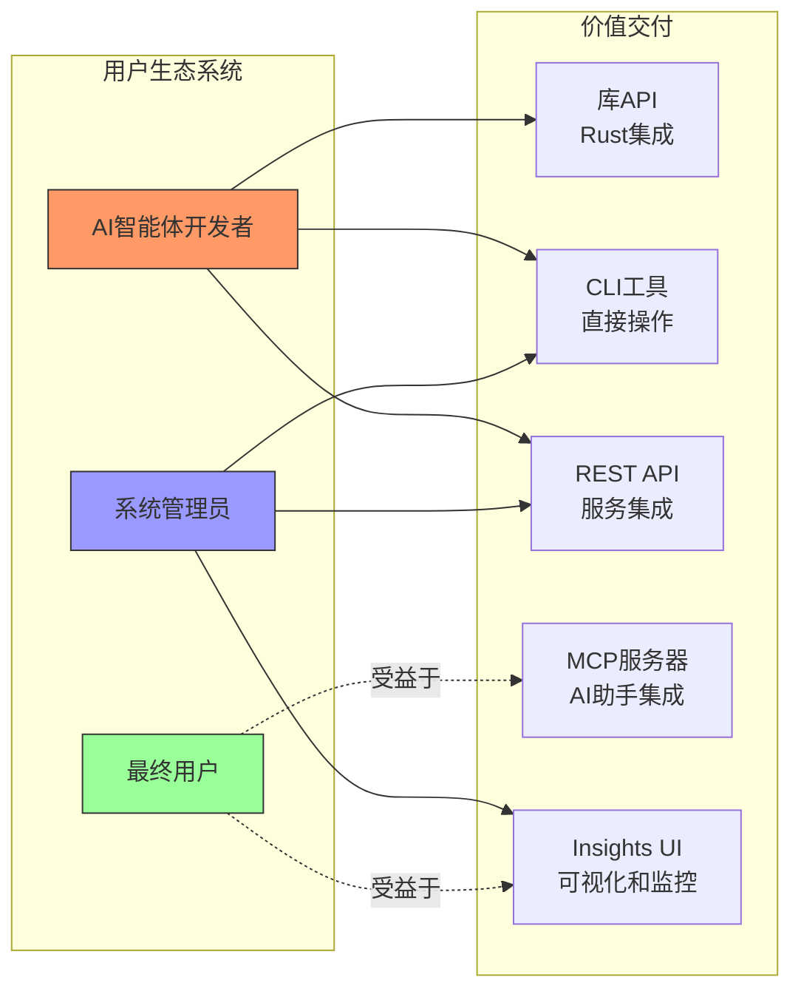

**主要用户场景**:

1. **AI智能体开发者**: 集成`cortex-mem-core`库或HTTP API，为智能体框架添加记忆能力
2. **系统管理员**: 部署带租户隔离的多租户实例，通过Insights UI监控向量存储使用情况
3. **最终用户**: 体验个性化AI交互，智能体能回忆偏好、过去决策和已建立的事实

### 2.3 外部系统交互

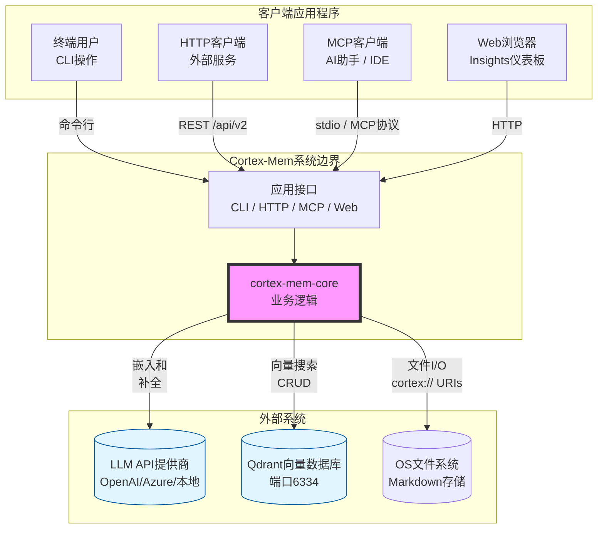

**边界定义**:
- **包含**: 所有工作空间crate、本地文件系统存储、本地/远程LLM客户端集成、MCP协议实现
- **排除**: 外部LLM基础设施（OpenAI/Anthropic API）、外部Qdrant集群、客户端应用程序、身份验证提供商

---

## 3. 容器视图

### 3.1 工作空间架构

Cortex-Mem遵循**Rust工作空间模式**，具有严格指向核心库的依赖方向性。架构将组件组织成四个逻辑层：

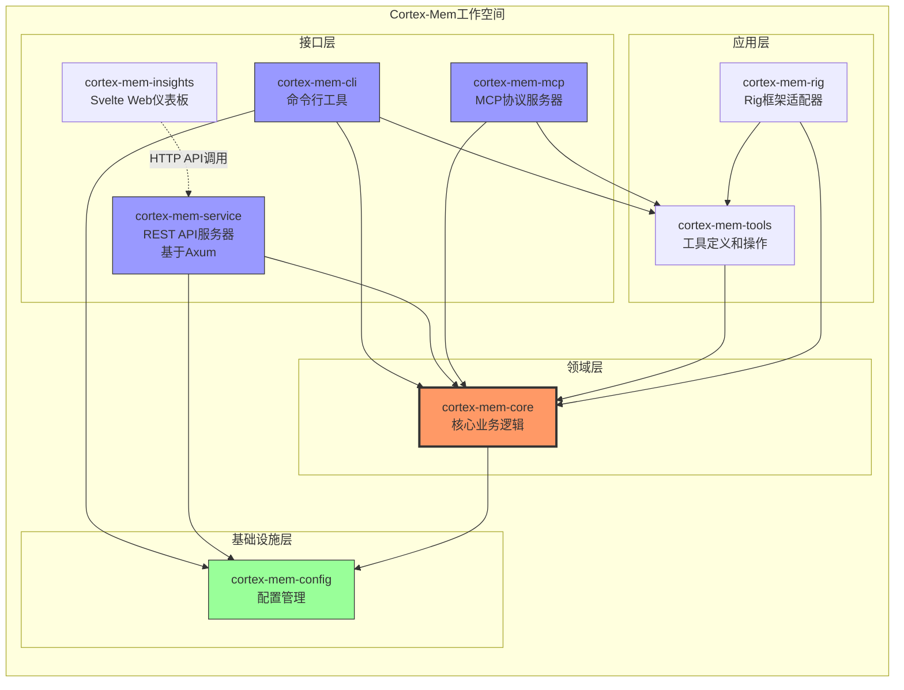

### 3.2 领域模块划分

系统由**12个不同的领域**组成，按技术职责和业务能力组织：

| 领域 | 类型 | 职责 | 关键组件 |
|--------|------|----------------|----------------|
| **配置管理** | 基础设施 | TOML/环境配置，租户隔离设置 | 配置加载器、多租户配置、构建器 |
| **核心基础设施** | 核心业务 | 文件系统抽象、LLM客户端、向量存储、事件总线 | CortexFilesystem、LLMClient、QdrantVectorStore |
| **自动化管理** | 核心业务 | 后台处理、文件监视、索引 | AutomationManager、AutoIndexer、AutoExtractor、SyncManager |
| **层级管理** | 核心业务 | 三层层次生成（L0/L1/L2） | LayerManager、AbstractGenerator、OverviewGenerator |
| **提取引擎** | 核心业务 | LLM驱动的对话知识提取 | MemoryExtractor、提取类型 |
| **搜索引擎** | 核心业务 | 加权评分的语义搜索 | VectorEngine、意图检测 |
| **会话管理** | 核心业务 | 对话状态、消息跟踪、时间线 | SessionManager、Timeline、Message |
| **配置文件管理** | 核心业务 | 用户/智能体配置文件持久化和合并 | UserProfile、AgentProfile |
| **应用接口** | 应用 | 多协议访问层（CLI、HTTP、MCP） | CLI命令、Axum处理器、MCP服务 |
| **Web UI** | 应用 | 可视化和管理界面 | Svelte页面、租户Store、API客户端 |
| **工具支持** | 应用 | MCP工具定义、Rig框架集成 | 工具定义、操作封装 |
| **向量存储** | 基础设施 | 带租户感知集合的Qdrant客户端 | QdrantVectorStore、URI到ID映射 |

### 3.3 存储设计

系统实现了一个**混合存储架构**，结合文件系统的持久性和向量搜索的性能：

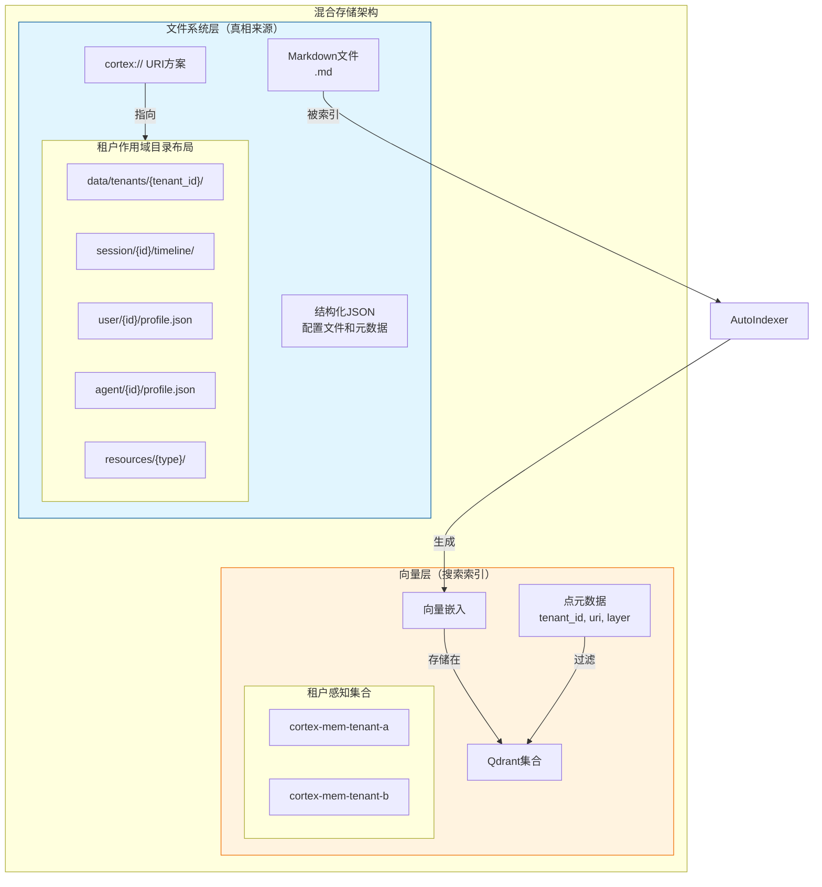

**存储策略**:
- **文件系统**: 提供持久性、人类可读格式（markdown）和易于备份/恢复
- **向量存储**: 通过元数据过滤和租户隔离（通过集合后缀`cortex-mem-{tenant_id}`）实现语义相似性搜索
- **同步**: 通过`AutoIndexer`和`SyncManager`组件实现事件驱动的持久一致性

### 3.4 跨领域通信

领域模块通过**依赖注入**和**事件驱动消息**进行通信：

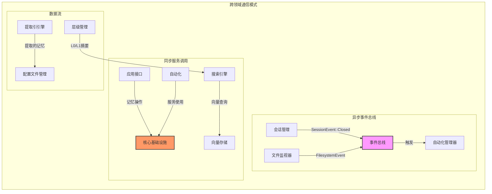

---

## 4. 组件视图

### 4.1 核心基础设施组件（`cortex-mem-core`）

核心crate实现了一个模块化架构，在自动化、记忆管理和基础设施服务之间有清晰的分离：

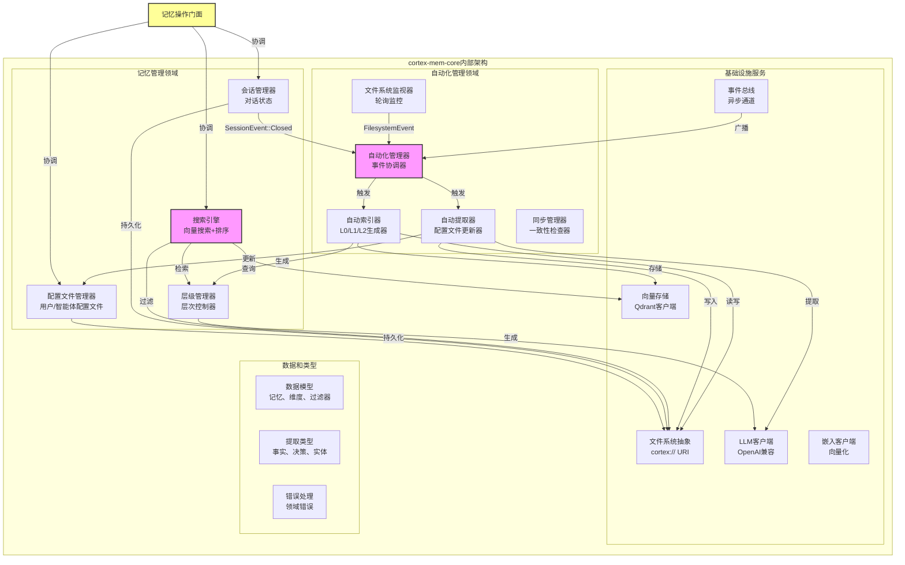

### 4.2 组件职责划分

#### 4.2.1 自动化组件

| 组件 | 职责 | 关键算法 |
|-----------|---------------|----------------|
| **AutomationManager** | 中心事件协调器，管理任务队列和节流 | 事件过滤、批量调度 |
| **FsWatcher** | 轮询文件系统检测变化，检测新增/修改/删除的文件 | 可配置间隔的轮询、校验和验证 |
| **AutoIndexer** | 将markdown内容转换为向量嵌入，管理L0/L1生成 | 延迟摘要生成、批量嵌入 |
| **AutoExtractor** | 会话后知识提取，配置文件富化 | LLM提示工程、去重（LCS相似度） |
| **SyncManager** | 文件系统和向量存储之间的完整一致性检查 | 差异协调、租户作用域同步 |

#### 4.2.2 记忆管理组件

| 组件 | 职责 | 关键算法 |
|-----------|---------------|----------------|
| **LayerManager** | 三层层次维护，缓存管理 | L0/L1的LRU缓存，按需生成 |
| **VectorEngine** | 带自适应阈值的语义搜索 | 加权评分（0.2×L0 + 0.3×L1 + 0.5×L2）、意图检测 |
| **SessionManager** | 对话生命周期，消息聚合 | 时间线排序、参与者跟踪 |
| **ProfileManager** | 持久的用户/智能体知识库 | 基于类别的组织、重要性评分 |

#### 4.2.3 基础设施组件

| 组件 | 职责 | 关键特性 |
|-----------|---------------|--------------|
| **CortexFilesystem** | 基于URI的资源访问，租户隔离 | `cortex://`方案解析、异步I/O |
| **LLMClient** | OpenAI兼容API封装，结构化提取 | 提示模板、JSON模式验证、回退解析 |
| **EmbeddingClient** | 文本向量化 | 批量处理、维度管理 |
| **QdrantVectorStore** | 向量CRUD、相似性搜索 | 租户感知集合命名、元数据过滤 |
| **EventBus** | 异步组件间通信 | Tokio mpsc通道、广播能力 |

### 4.4 接口组件

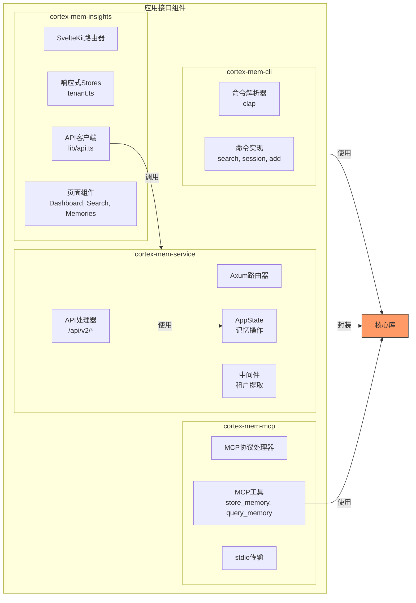

---

## 5. 关键流程

### 5.1 语义记忆搜索流程（主要工作流）

系统的核心价值主张——使用三层层次结构的智能检索：

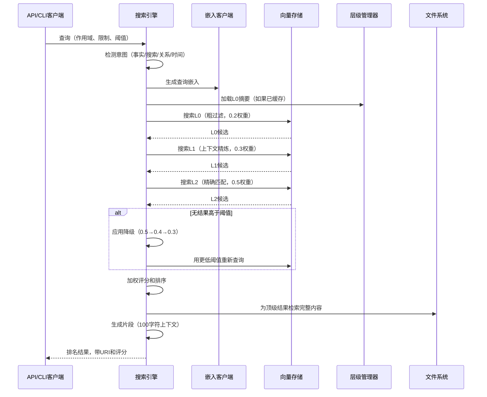

**流程特征**:
- **渐进精确度**: L0快速过滤不相关文档；L2提供精确匹配
- **自适应阈值**: 如果初始结果稀疏，自动降低相似度阈值
- **加权聚合**: L2（细节）对最终评分贡献最大（50%），其次是L1（30%）和L0（20%）

### 5.2 记忆索引和同步流程

确保文件系统变化可搜索的后台管道：

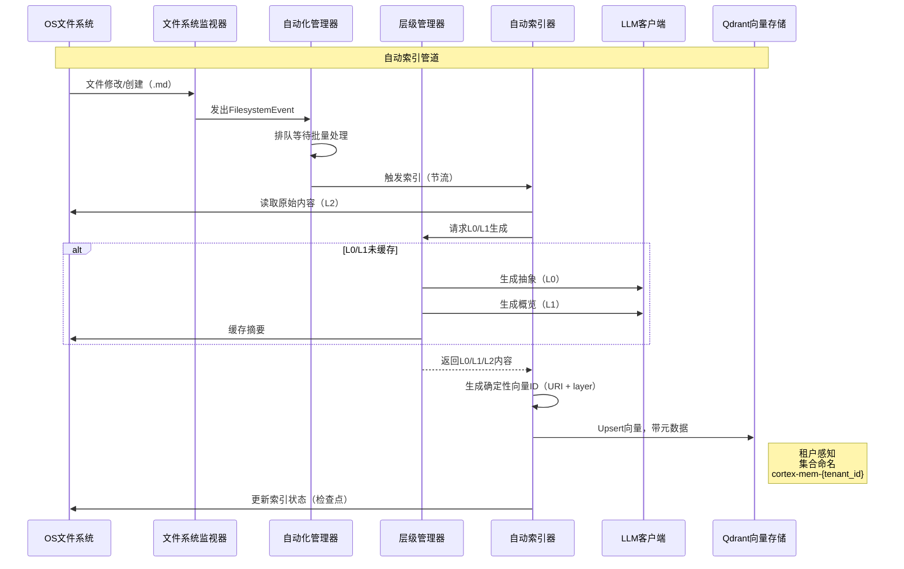

**优化策略**:
- **批量处理**: 在索引前累积变化以减少LLM API成本
- **延迟生成**: 仅在请求且未缓存时生成L0/L1
- **确定性ID**: 向量ID来自内容URI + layer以防止重复

### 5.3 记忆提取和画像流程

会话结束后的知识挖掘，用于个性化：

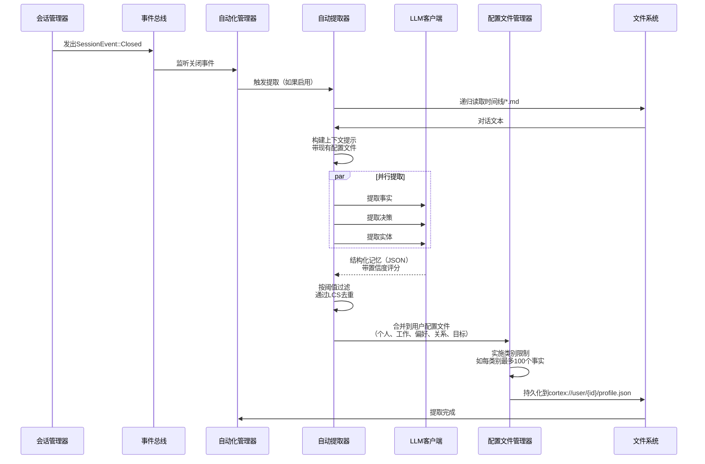

**提取质量保证**:
- **置信度评分**: LLM分配的置信度评分过滤低质量提取
- **去重**: 最长公共子序列（LCS）算法防止冗余事实
- **类别限制**: 通过限制每类别的事实数量防止画像膨胀（如personal_info、work_history）

### 5.4 多租户隔离流程

确保SaaS部署中跨租户的数据隔离：

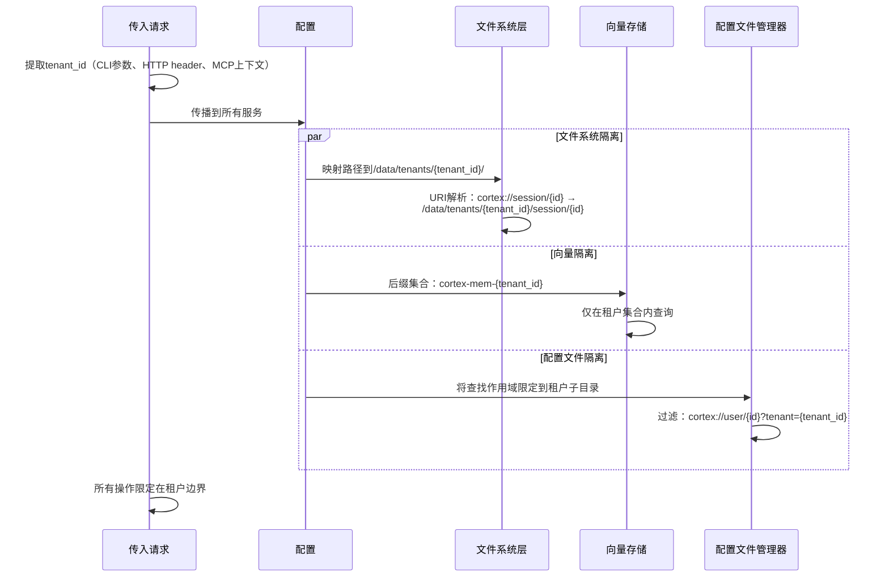

---

## 6. 技术实现

### 6.1 核心模块实现

#### 6.1.1 URI方案和文件系统抽象

`cortex://` URI方案提供**位置透明性**：

```rust
// URI结构：cortex://{dimension}/{id}[/{subresource}]
// 示例：
// - cortex://session/uuid123/timeline/001.md
// - cortex://user/john_doe/profile.json
// - cortex://agent/tars/skills.json

pub struct CortexUri {
    pub dimension: Dimension,  // user, agent, session, resources
    pub id: String,
    pub path: Option<String>,
    pub tenant_id: Option<String>,
}

impl CortexFilesystem {
    pub async fn read(&self, uri: &CortexUri) -> Result<Bytes>;
    pub async fn write(&self, uri: &CortexUri, content: Bytes) -> Result<()>;
    pub async fn list(&self, uri: &CortexUri) -> Result<Vec<MemoryEntry>>;
}
```

**租户隔离实现**:
- 物理路径：`{data_dir}/tenants/{tenant_id}/{dimension}/{id}/`
- URI解析从上下文提取租户或默认为"default"
- 所有文件系统操作在执行前验证租户作用域

#### 6.1.2 向量搜索实现

搜索引擎实现**带加权评分的分层检索**：

```rust
pub struct VectorEngine {
    vector_store: Arc<dyn VectorStore>,
    layer_manager: Arc<LayerManager>,
    config: SearchConfig,
}

impl VectorEngine {
    pub async fn search(&self, query: SearchQuery) -> Result<SearchResults> {
        // 1. 生成嵌入
        let embedding = self.embed(&query.text).await?;
        
        // 2. 意图检测以优化查询
        let intent = self.detect_intent(&query.text);
        
        // 3. 分层搜索
        let l0_results = self.search_layer(&embedding, Layer::L0, 0.2).await?;
        let l1_results = self.search_layer(&embedding, Layer::L1, 0.3).await?;
        let l2_results = self.search_layer(&embedding, Layer::L2, 0.5).await?;
        
        // 4. 加权聚合
        let mut combined = self.merge_results(l0_results, l1_results, l2_results);
        
        // 5. 如果结果不足则自适应阈值
        if combined.len() < query.min_results {
            combined = self.degrade_thresholds(&embedding, intent).await?;
        }
        
        Ok(combined)
    }
}
```

**评分算法**：
```
最终评分 = (0.2 × L0_评分) + (0.3 × L1_评分) + (0.5 × L2_评分)
```

#### 6.1.3 事件驱动架构

自动化系统使用**Tokio通道**进行解耦通信：

```rust
pub enum CortexEvent {
    FilesystemEvent(FsChange),
    SessionEvent(SessionChange),
    SystemEvent(SystemState),
}

pub struct AutomationManager {
    event_rx: mpsc::Receiver<CortexEvent>,
    task_queue: VecDeque<AutomationTask>,
}

impl AutomationManager {
    pub async fn run(&mut self) {
        while let Some(event) = self.event_rx.recv().await {
            match event {
                CortexEvent::FilesystemEvent(change) => {
                    self.queue_indexing(change);
                }
                CortexEvent::SessionEvent(SessionChange::Closed(id)) => {
                    self.trigger_extraction(id);
                }
                // ...
            }
        }
    }
}
```

### 6.2 关键算法设计

#### 6.2.1 L0/L1摘要生成

**L0（抽象）生成**:
- **输入**: 原始对话markdown（L2）
- **过程**: 带摘要指令的LLM提示
- **输出**: 捕获本质的单个段落（≤200 tokens）
- **缓存**: 存储为`{uri}.abstract.md`

**L1（概览）生成**:
- **输入**: 原始对话或L0摘要
- **过程**: 结构化提取（关键点、决策、实体）
- **输出**: 带YAML frontmatter的markdown
- **缓存**: 存储为`{uri}.overview.md`

#### 6.2.2 去重算法

用于配置文件提取去重：

```rust
fn is_duplicate(new_fact: &str, existing: &[Fact]) -> bool {
    for fact in existing {
        let similarity = lcs_similarity(new_fact, &fact.content);
        if similarity > 0.8 {
            return true;
        }
    }
    false
}

fn lcs_similarity(a: &str, b: &str) -> f64 {
    let lcs_len = longest_common_subsequence(a, b);
    2.0 * lcs_len as f64 / (a.len() + b.len()) as f64
}
```

### 6.3 数据结构设计

#### 6.3.1 核心领域类型

```rust
pub struct Memory {
    pub uri: CortexUri,
    pub layer: Layer,  // L0, L1, L2
    pub content: String,
    pub embedding: Option<Vec<f32>>,
    pub metadata: MemoryMetadata,
    pub created_at: DateTime<Utc>,
    pub updated_at: DateTime<Utc>,
}

pub struct MemoryMetadata {
    pub tenant_id: String,
    pub dimension: Dimension,
    pub entities: Vec<String>,
    pub importance: f32,  // 0.0 - 1.0
    pub source_hash: String,  // 内容校验和
}

pub enum Dimension {
    User,
    Agent,
    Session,
    Resources,
}
```

#### 6.3.2 提取类型

```rust
pub struct ExtractedMemories {
    pub facts: Vec<ExtractedFact>,
    pub decisions: Vec<ExtractedDecision>,
    pub entities: Vec<ExtractedEntity>,
}

pub struct ExtractedFact {
    pub content: String,
    pub confidence: f32,
    pub category: FactCategory,  // personal, work, preference, etc.
    pub source_uri: CortexUri,
    pub timestamp: DateTime<Utc>,
}
```

### 6.4 性能优化策略

| 策略 | 实现 | 影响 |
|----------|---------------|---------|
| **延迟加载** | L0/L1按需生成，带文件系统缓存 | 减少60-80%的LLM API成本 |
| **批量处理** | 索引前累积30秒的文件变化 | 减少向量存储写操作 |
| **连接池** | LLM和Qdrant连接的HTTP客户端重用 | 改善负载下的吞吐量 |
| **缓存层** | L0/L1摘要的内存LRU | 减少文件系统I/O |
| **确定性向量ID** | 基于哈希的ID生成防止重复存储 | 消除向量冲突 |
| **自适应阈值** | 对模糊查询降低相似度要求 | 在不牺牲精度的情况下提高召回率 |

---

## 7. 部署架构

### 7.1 运行时环境要求

**系统要求**:
- **操作系统**: Linux（Ubuntu 22.04+）、macOS（13+）、Windows（推荐WSL2）
- **Rust**: 1.75+（异步/等待优化）
- **Qdrant**: 1.7+（向量数据库）- 本地或远程
- **LLM提供商**: OpenAI兼容API端点
- **资源**: 
  - 最低：4GB RAM、2 CPU核心
  - 推荐：8GB RAM、4 CPU核心、SSD存储

**依赖**：
```toml
[workspace.dependencies]
tokio = { version = "1.35", features = ["full"] }
axum = "0.7"
qdrant-client = "1.8"
serde = { version = "1.0", features = ["derive"] }
```

### 7.2 部署拓扑

#### 7.2.1 单节点部署（开发/小规模）

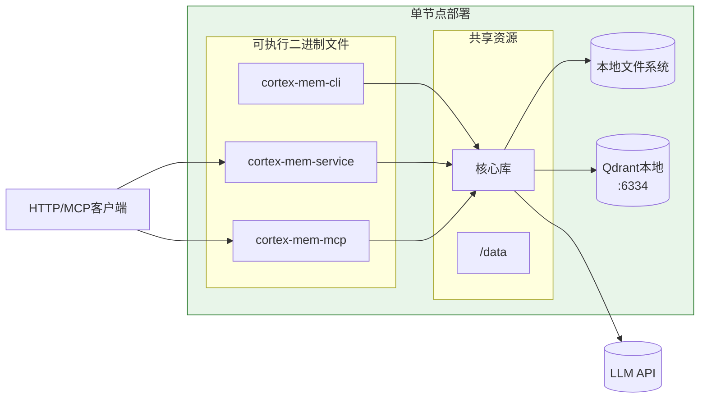

**配置**:
- Qdrant作为独立进程或Docker容器运行
- 所有二进制文件共享同一数据目录
- 租户隔离通过子目录作用域实现

#### 7.2.2 多租户生产部署

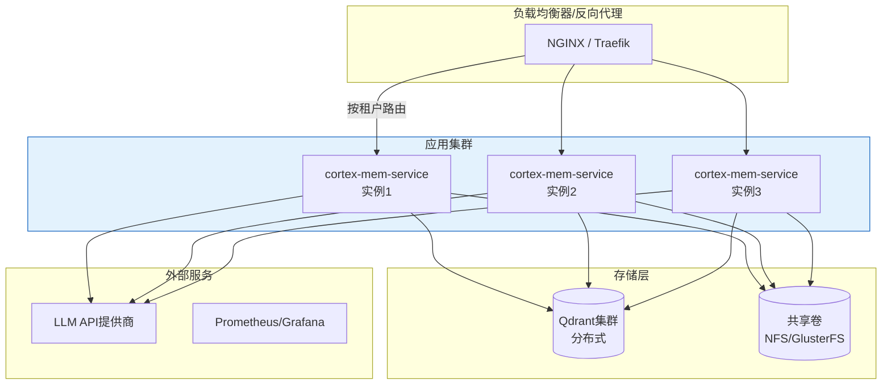

**扩展考虑**:
- **水平**: 无状态应用服务器在负载均衡器后
- **垂直**: Qdrant集群支持大型向量集合的分片
- **存储**: 多节点部署需要共享文件系统（NFS、S3兼容存储）
- **租户路由**: 反向代理根据租户ID header将请求路由到相应实例

### 7.3 监控和可观察性

**健康检查端点**:
- `GET /health` - 服务存活
- `GET /health/ready` - 依赖就绪（Qdrant、LLM连接）
- `GET /api/v2/tenants/{id}/stats` - 每租户存储指标

**关键指标**：
| 指标 | 类型 | 描述 |
|--------|------|-------------|
| `cortex_search_latency` | 直方图 | 按层的查询响应时间 |
| `cortex_indexing_queue` | 仪表盘 | 待索引文件 |
| `cortex_llm_requests` | 计数器 | LLM API调用（token使用量） |
| `cortex_tenant_memory_bytes` | 仪表盘 | 每租户存储使用量 |
| `cortex_event_bus_lag` | 仪表盘 | 事件处理延迟 |

**日志策略**:
- **结构化日志**: JSON格式，带tenant_id关联
- **日志级别**: 
  - INFO: 业务操作（搜索、存储、提取）
  - DEBUG: 自动化触发、缓存命中/未命中
  - ERROR: LLM失败、存储错误

### 7.4 安全考虑

**租户隔离**:
- **验证**: 所有请求根据授权列表验证租户ID
- **集合命名空间**: 严格的后缀模式防止跨租户查询
- **文件系统沙箱**: 路径解析拒绝租户目录外的路径

**API安全**:
- **认证**: 在反向代理级别进行Bearer令牌验证
- **授权**: 租户作用域访问令牌
- **速率限制**: LLM调用的每租户限制（成本控制）

**数据保护**:
- **静态加密**: 文件系统加密（LUKS）或托管磁盘加密
- **传输中加密**: 所有HTTP API和Qdrant连接使用TLS 1.3
- **PII处理**: 提取引擎中的自动PII检测，带脱敏选项

---

## 8. 架构建议

### 8.1 可扩展性路线图

1. **短期**（当前）:
   - 优化索引批量大小（根据吞吐量调整30秒窗口）
   - 为Qdrant实现连接池（当前每个请求）

2. **中期**:
   - 为Qdrant搜索操作实现读副本
   - 添加Redis缓存层用于L0摘要（减少文件系统I/O）
   - 高容量租户的分片策略

3. **长期**:
   - 将自动化工作者（索引/提取）分离为独立服务
   - 实现事件流（Kafka/Redis Streams）用于跨服务通信
   - 分层存储：热（SSD）→ 温（HDD）→ 冷（S3）用于旧会话

### 8.2 技术债务和缺口

| 缺口 | 风险 | 缓解 |
|------|------------|---------|
| **示例应用重复**（`cortex-mem-tars`） | DRY违规，维护开销 | 重构为使用发布的crate；仅保留示例代码 |
| **前端类型安全** | Rust和TypeScript之间的API漂移 | 实现OpenAPI生成（utoipa）→ TypeScript客户端生成 |
| **文件系统轮询** | 大目录的CPU开销 | 迁移到平台特定的通知机制（inotify/fsevents） |
| **无速率限制** | LLM成本暴露，滥用 | 为每租户速率限制添加Tower中间件 |

### 8.3 开发指南

**核心库开发**:
- 在`cortex-mem-core`中保持严格的API向后兼容性
- 所有存储操作必须可异步取消（Tokio取消令牌）
- 租户ID必须通过整个调用链传播（使用结构化日志上下文）

**接口开发**:
- CLI命令应遵循POSIX约定，带JSON输出选项（`--output json`）
- HTTP处理器在调用核心操作前必须验证租户提取
- MCP工具需要严格的JSON模式验证和描述性错误消息

**测试策略**:
- 单元测试：模拟文件系统和向量存储实现
- 集成测试：Docker Compose栈带Qdrant和模拟LLM服务器
- 负载测试：模拟100个并发租户，每个10K会话

---

**文档状态**: 草稿  
**审查周期**: 季度或重大版本发布时  
**相关方**: 架构委员会、工程团队、DevOps

---

*此架构文档遵循Simon Brown开发的C4模型（Context、Container、Component、Code）可视化方法。*
