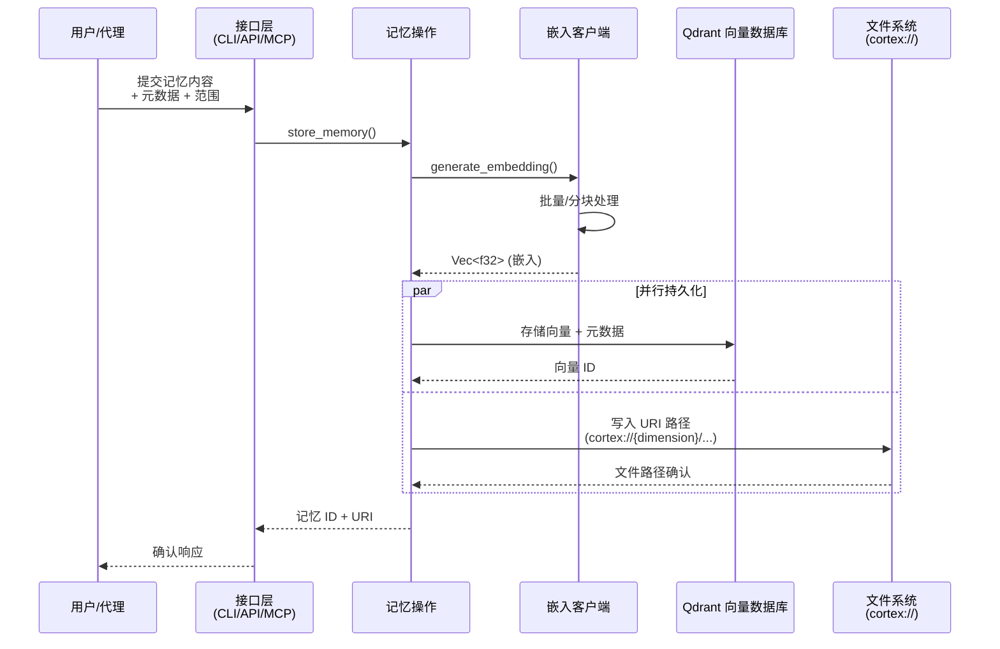
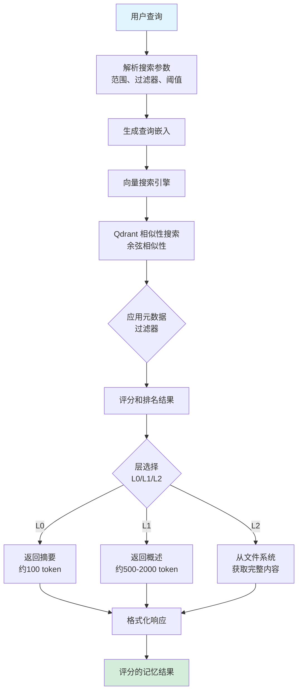
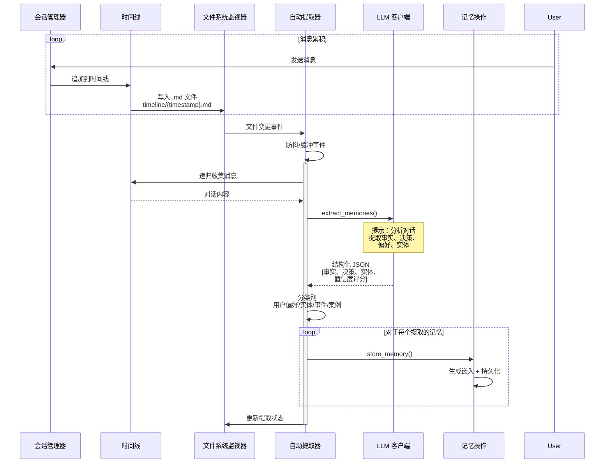
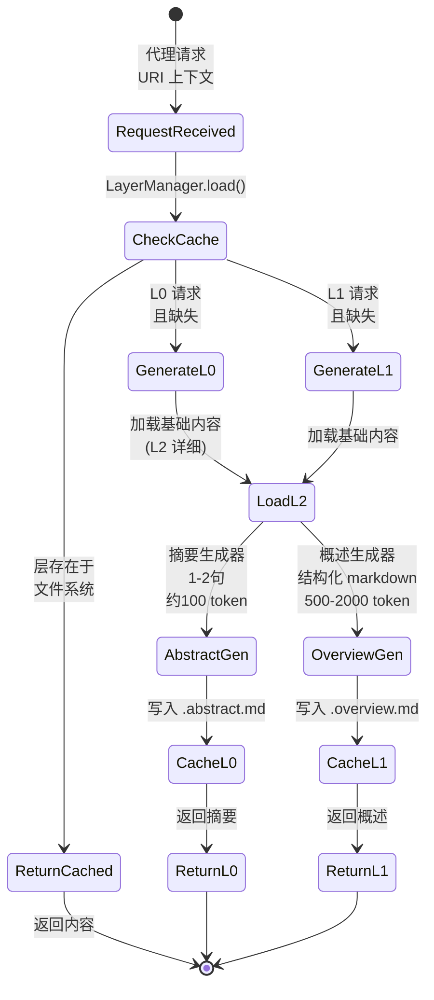
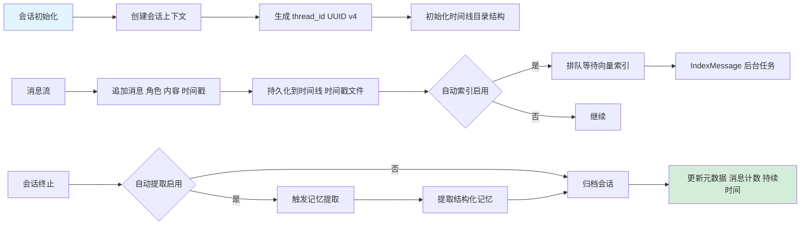
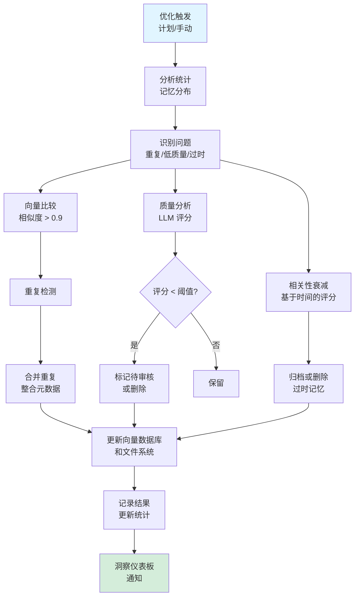

# 核心工作流

**文档版本**：1.0  
**生成时间戳**：2026-02-17 16:34:09 (UTC)  
**系统**：Cortex-Mem 内存管理基础设施  
**范围**：端到端工作流分析，涵盖 CLI、API、MCP 和 Web 接口

---

## 1. 工作流概述

### 1.1 系统定位和价值主张

Cortex-Mem 为 AI 代理实现了全面的内存管理基础设施，通过持久语义存储解决根本的上下文窗口限制问题。该系统作为多接口内存层运行，支持：

- **多维组织**：用户、代理和会话范围，具有层次分类
- **分层抽象**：通过 L0（摘要）、L1（概述）和 L2（详细）层进行渐进式上下文加载
- **语义检索**：使用嵌入进行基于向量的相似性搜索，以实现基于相关性的记忆召回
- **自动化提取**：LLM 驱动的内容分析，用于从对话中自动生成记忆

### 1.2 核心执行路径

系统沿三个主要路径执行：

1. **摄取路径**：内容 → 嵌入生成 → 向量存储（Qdrant）+ 文件系统持久化
2. **检索路径**：查询 → 向量化 → 相似性搜索 → 分层内容检索
3. **处理路径**：会话监控 → 提取触发 → LLM 分析 → 结构化记忆生成

### 1.3 流程协调架构

工作流架构遵循**命令查询职责分离（CQRS）**模式，辅以事件驱动自动化：

- **同步操作**：内存 CRUD、即时搜索、会话管理
- **异步管道**：自动索引、记忆提取、优化任务
- **跨领域关注**：通过 `tenant_id` 进行多租户隔离，使用 `anyhow::Result` 进行配置管理和错误传播

### 1.4 关键流程节点

| 节点 | 职责 | 涉及的模块 |
|------|---------------|------------------|
| **接口调度** | 协议适配（CLI/HTTP/MCP） | `cortex-mem-cli`、`cortex-mem-service`、`cortex-mem-mcp` |
| **内存操作** | 核心业务逻辑编排 | `cortex-mem-tools::operations` |
| **嵌入生成** | 文本向量化 | `cortex-mem-core::embedding::client` |
| **向量搜索** | 语义相似性计算 | `cortex-mem-core::search::vector_engine` |
| **层管理** | 分层内容生成 | `cortex-mem-core::layers::manager` |
| **会话管理** | 对话生命周期 | `cortex-mem-core::session` |
| **自动化** | 后台处理 | `cortex-mem-core::automation` |

---

## 2. 主要工作流

### 2.1 记忆语义存储和检索流程

**业务价值**：支持具有语义搜索功能的持久记忆存储，允许 AI 代理根据含义而非精确关键词匹配来回忆信息。

#### 2.1.1 存储子流程



**详细流程步骤**：

1. **请求接收**（`cortex-mem-cli/src/commands/`、`cortex-mem-service/src/handlers/`）
   - **输入**：原始内容、维度（用户/代理/会话）、类别、元数据
   - **验证**：URI 方案验证、租户隔离检查
   - **转换**：使用生成的 ID 和时间戳构造 `Memory` 结构体

2. **嵌入生成**（`cortex-mem-core/src/embedding/client.rs`）
   - **策略**：单文本或批处理（可配置批量大小，默认 10）
   - **API 集成**：OpenAI 兼容端点（`text-embedding-3-small`，1536 维）
   - **错误处理**：如果服务不可用则回退到默认维度
   - **输出**：高维向量表示

3. **双重持久化**（`cortex-mem-tools/src/operations.rs`）
   - **向量存储**：带有效负载元数据（user_id、agent_id、时间戳）的异步写入 Qdrant
   - **文件系统**：使用 `cortex://` URI 映射同步写入 markdown 文件
   - **事务语义**：向量提交前文件系统写入成功（最终一致性）

4. **确认**（`cortex-mem-core/src/types.rs`）
   - **输出**：记忆 ID（UUID）、规范 URI、创建时间戳
   - **副作用**：自动索引器通知（如果启用）

#### 2.1.2 检索子流程



**执行详情**：

- **向量搜索**（`cortex-mem-core/src/search/vector_engine.rs`）：执行近似最近邻（ANN）搜索，可配置 `top_k`（默认 10）和 `min_score` 阈值（0.0-1.0）
- **元数据过滤**：按维度、类别、日期范围、重要性分数进行预过滤
- **层解析**：延迟加载模式—如果缺少 L0/L1 则按需生成，缓存到文件系统（`.abstract.md`、`.overview.md`）

### 2.2 自动化记忆提取流程

**业务价值**：将临时对话历史转换为结构化、可搜索的长期记忆，无需人工干预。



**流程实现**：

1. **触发机制**：
   - **文件监视器**（`automation/watcher.rs`）：监视 `cortex://session/{id}/timeline/` 中的新 `.md` 文件
   - **手动触发**：CLI 命令 `cortex-mem session extract <session_id>`
   - **计划任务**：通过 `index_thread_with_progress()` 批量处理

2. **LLM 分析阶段**（`llm/prompts.rs`）：
   - **提示模板**：带结构化输出的 `memory_extraction` 提示
   - **提取类型**（`extractor_types.rs`）：`ExtractedFact`、`UserPreference`、`EntityMemory`、`DecisionRecord`
   - **置信度评分**：0.0-1.0 阈值过滤（默认 >0.7）

3. **分类和路由**：
   - **用户档案**：`cortex://user/{id}/profile.json`（结构化 JSON）
   - **代理学习**：`cortex://agent/{id}/skills/` 或 `cases/`
   - **会话归档**：`cortex://session/{id}/extracted/`

4. **去重**（`automation/indexer.rs`）：
   - 索引前检查内容哈希
   - 如果与现有记忆相似度 >0.95 则跳过

### 2.3 分层记忆层生成流程

**业务价值**：通过提供上下文的渐进式披露来优化 token 使用——代理仅检索当前任务所需的细节级别。



**技术实现**：

- **延迟生成**：按需计算层以避免存储膨胀
- **缓存策略**：基于文件系统的持久化，带 mtime 检查
- **LLM 集成**（`layers/generator.rs`）：
  - **L0（摘要）**：使用 `abstract_generation` 提示的 1-2 句摘要
  - **L1（概述）**：带摘要、核心主题、要点、实体部分的结构化 markdown
- **回退链**：如果 L2 缺失 → 错误；如果 L1 生成失败 → 返回 L2；如果 L0 失败 → 返回 L1

### 2.4 会话生命周期管理流程

**业务价值**：维护跨交互的对话连续性，实现上下文感知的 AI 响应和会话后分析。



**状态管理**：

- **会话状态**：内存中的 `SessionManager`，带 `Arc<Mutex<Session>>` 用于线程安全
- **持久化格式**：带 YAML frontmatter 的 Markdown
- **索引策略**：异步批量索引（默认批量大小 10），通过 `AutoIndexer.index_thread_with_progress()`

### 2.5 记忆优化和维护流程

**业务价值**：通过自动化去重、质量评分和重组来确保记忆质量和存储效率。



**优化策略**：

- **去重**：使用 Qdrant 滚动 API 进行向量相似性比较
- **质量评分**：基于 LLM 的重要性评估（0-100 刻度）
- **合并逻辑**：保留最高质量版本，合并元数据标签
- **试运行模式**：无变异的分析（`analyzeOptimization` 端点）

---

## 3. 流程协调和控制

### 3.1 多模块协调机制

**依赖注入模式**：
系统使用基于 trait 的抽象以实现松散耦合：

```rust
// 启用可测试性和提供商交换的核心抽象
pub trait LLMClient: Send + Sync { ... }
pub trait VectorStore: Send + Sync { ... }
pub trait EmbeddingClient: Send + Sync { ... }
```

**共享状态架构**：
- **全局状态**：跨异步处理器共享的 `Arc<AppState>` 或 `Arc<MemoryOperations>`
- **租户隔离**：每个请求作用域为 `tenant_id`（来自 CLI 参数 `--tenant` 或 API 头）
- **配置级联**：CLI 参数 → 环境变量 → 配置文件（`config.toml`）→ 默认值

### 3.2 状态管理和同步

**并发控制**：

1. **文件系统操作**（`cortex-mem-core/src/filesystem/operations.rs`）：
   - 使用 `tokio::fs` 进行 Tokio 异步 I/O
   - 写操作通过基于文件的信号量进行目录锁定
   - 原子写入：写入临时文件 → 重命名以实现持久性

2. **向量存储一致性**：
   - 文件系统（真理来源）和 Qdrant（搜索索引）之间的最终一致性模型
   - 启动时通过 `SyncManager` 进行协调
   - 去重检查防止双重索引

3. **会话状态**：
   - 内存中的 `HashMap<thread_id, Session>` 带 `RwLock`
   - 定期刷新到文件系统（每 N 条消息或会话关闭时）
   - 重启时通过时间线文件扫描进行崩溃恢复

**数据传递模式**：

| 流程 | 机制 | 序列化 |
|------|-----------|---------------|
| CLI → 核心 | 函数调用 | Rust 类型 |
| HTTP API | Axum 处理器 | JSON (serde) |
| MCP 协议 | JSON-RPC | MCP 模式类型 |
| Web UI → API | HTTP fetch | 通过 Elysia 的 JSON |
| 后台任务 | Tokio mpsc 通道 | 内部枚举 |

### 3.3 执行控制和调度

**异步运行时**：
- Tokio 多线程调度器（`#[tokio::main]`）
- CPU 密集型任务（LLM 调用、嵌入生成）在 `tokio::task::spawn_blocking` 上生成
- I/O 密集型任务（文件系统、HTTP）使用 async/await

**后台作业管理**：
- **自动索引器**：可配置批量大小（默认 10），进度回调
- **自动提取器**：防抖的文件系统事件（500ms 静默期）
- **优化作业**：单例执行防止并发优化

**资源限制**：
- **嵌入速率限制**：可配置的 `requests_per_minute` 在 `EmbeddingConfig` 中
- **LLM Token 预算**：每个请求强制执行 `max_tokens`
- **内存压力**：用于层生成的 LRU 缓存（可配置大小）

---

## 4. 异常处理和恢复

### 4.1 错误分类和检测

系统实现了分层错误系统（`cortex-mem-core/src/error.rs`）：

```rust
pub enum Error {
    #[error("无效 URI: {0}")]
    InvalidUri(String),
    #[error("未找到维度: {0}")]
    DimensionNotFound(String),
    #[error("未找到记忆: {0}")]
    MemoryNotFound(String),
    #[error("IO 错误: {0}")]
    Io(#[from] std::io::Error),
    #[error("序列化错误: {0}")]
    Serialization(#[from] serde_json::Error),
    #[error("LLM 错误: {0}")]
    LLM(String),
    #[error("嵌入错误: {0}")]
    Embedding(String),
    #[error("配置错误: {0}")]
    Config(String),
    #[error("向量存储错误: {0}")]
    VectorStore(String),
    #[error("其他: {0}")]
    Other(String),
}
```

**错误传播策略**：
- **库层**：使用 `thiserror` 返回结构化的 `Result<T, Error>`
- **应用层**：使用 `with_context()` 转换为 `anyhow::Result` 并添加上下文
- **API 层**：映射到 HTTP 状态码（404、500、503）
- **CLI 层**：使用 `colored` crate 漂亮打印，退出码（0=成功，1=错误）

### 4.2 恢复机制

**优雅降级**：

1. **LLM 服务不可用**：
   - **检测**：健康检查超时（主站 5s，备用 3s）
   - **回退**：仅返回缓存层，跳过提取
   - **用户通知**：日志和 API 响应头中的警告

2. **向量存储连接失败**：
   - **重试**：指数退避（3 次尝试）
   - **回退**：仅文件系统模式（搜索禁用，存储启用）
   - **恢复**：下次搜索尝试时自动重连

3. **嵌入服务超时**：
   - **断路器**：连续 5 次失败后打开
   - **回退**：跳过索引，仅存储无向量（可按元数据搜索）
   - **监控**：洞察仪表板告警

**数据完整性恢复**：

- **孤立文件**：优化作业扫描无向量条目的文件，重新索引或删除
- **损坏会话**：时间线解析器跳过格式错误的 markdown 文件，记录错误，继续处理
- **部分写入**：原子重命名模式确保没有半写文件；重启时清理临时文件

### 4.3 容错设计

**崩溃恢复**：
- **预写模式**：内容写入前更新元数据
- **日志文件**：会话操作记录到 `.journal` 文件以重放
- **一致性检查**：启动验证比较文件系统与向量存储计数

**冗余**：
- **多接口可用性**：如果 MCP 失败，CLI 和 HTTP API 保持运行
- **层回退**：即使 L0/L1 生成失败，L2 始终可用
- **配置冗余**：关键设置的环境变量覆盖

---

## 5. 关键流程实现

### 5.1 核心算法：向量搜索管道

**实现**（`cortex-mem-core/src/search/vector_engine.rs`）：

1. **查询预处理**：
   - 文本规范化（小写、修剪）
   - 可选通过 LLM 进行查询扩展（同意生成）

2. **向量化**：
   - 调用嵌入服务的 API（`text-embedding-3-small` 或自定义）
   - 频繁查询的客户端缓存（LRU，1000 条目）

3. **搜索执行**：
   ```rust
   // 实际实现的伪代码表示
   let results = vector_store.search(
       collection_name,
       query_vector,
       filter_conditions,  // 元数据预过滤
       limit: top_k,
       score_threshold: min_score
   ).await?;
   ```

4. **后处理**：
   - 按最近度重新排名（时间衰减因子）
   - 按内容哈希去重
   - 层解析（根据上下文窗口预算获取 L0/L1/L2）

**性能优化**：
- **批量搜索**：支持单次请求中多个查询向量
- **HNSW 索引**：Qdrant 配置 HNSW 参数（ef=128, m=16）用于近似搜索
- **元数据过滤**：在数据库级别预过滤以减少向量比较范围

### 5.2 数据处理管道：批量索引

**自动索引器**（`cortex-mem-core/src/automation/indexer.rs`）：

```rust
pub struct IndexerConfig {
    pub enabled: bool,
    pub batch_size: usize,        // 默认：10
    pub async_mode: bool,         // true = 后台，false = 阻塞
}
```

**处理阶段**：
1. **收集**：递归文件系统扫描（`collect_messages_recursive`）
2. **去重**：基于哈希的过滤（内容的 SHA256）
3. **批量嵌入**：分块 API 调用（遵守速率限制）
4. **批量插入**：Qdrant 批量上传以提高效率
5. **进度报告**：基于回调的进度以更新 UI

**并发模型**：
- **生产者-消费者**：文件系统遍历器生成路径，嵌入工作者消费
- **背压**：有界通道（100 项）防止内存耗尽
- **取消**：通过 `tokio::select!` 与关闭信号的合作取消

### 5.3 业务规则执行：多租户隔离

**租户隔离策略**：

- **数据隔离**：物理目录分离（`data/{tenant_id}/`）
- **向量隔离**：每个租户的 Qdrant 集合或带 `tenant_id` 字段的元数据过滤
- **配置隔离**：多租户部署中每个租户的单独 `Config` 实例

**实现模式**：
```rust
// 来自 cortex-mem-tools 操作
pub struct MemoryOperations {
    tenant_id: String,
    base_path: PathBuf,
    vector_store: Arc<dyn VectorStore>,
    // ...
}

// 所有操作作用域为 tenant_id
pub async fn list(&self, uri: &str) -> Result<Vec<FileEntry>> {
    let path = self.to_tenant_path(uri)?;  // 预置租户目录
    // ...
}
```

### 5.4 技术实现：层生成

**摘要生成器**（L0）：
- **算法**：通过 LLM 的提取摘要，严格 token 限制（最多 100 token）
- **提示工程**：带格式示例的零样本提示
- **缓存**：基于内容哈希的文件系统缓存键

**概述生成器**（L1）：
- **结构强制**：结构化输出的 JSON 模式验证
- **部分**：摘要（20%）、核心主题（30%）、要点（30%）、实体（20%）
- **层次聚合**：对于线程摘要，聚合多个 L0 摘要

**性能特性**：
- **延迟**：L0 生成约 500ms，L1 生成约 2-3s（取决于内容大小）
- **吞吐量**：每分钟每 LLM 连接 10-20 次层生成
- **缓存命中率**：对于稳定对话历史通常 80%+

### 5.5 优化策略

**资源管理**：
- **连接池**：嵌入/LLM API 的 HTTP 客户端重用（`reqwest::Client` 带 `Arc`）
- **内存映射**：大文件读取使用带缓冲流的 `tokio::fs`（8KB 块）
- **向量压缩**：Qdrant 标量量化将内存占用减少 4 倍

**并发处理**：
- **并行提取**：多个会话提取并发运行（限制：CPU 核心 × 2）
- **管道并行性**：索引管道：读取 → 解析 → 嵌入 → 存储以流式方式执行
- **无锁结构**：使用 `dashmap` 进行并发会话缓存

**缓存策略**：
- **层缓存**：无限保留（小文本文件），基于文件系统
- **嵌入缓存**：Redis 兼容外部缓存可选（TTL：24h）
- **配置缓存**：TOML 在启动时解析一次，在 SIGTERM 时热重载

---

## 附录：工作流交互摘要

| 工作流 | 输入 | 输出 | 触发器 | 异步/同步 |
|----------|-------|--------|---------|------------|
| 记忆存储 | 内容 + 元数据 | URI + ID | 用户/API/MCP | 同步（带异步索引） |
| 语义搜索 | 查询 + 过滤器 | 评分结果 | 用户请求 | 同步 |
| 自动提取 | 会话时间线 | 记忆记录 | 文件监视器 | 异步 |
| 层生成 | URI + 级别 | 格式化内容 | 代理请求 | 同步（带缓存写入） |
| 会话管理 | 消息 | 会话状态 | 对话 | 混合 |
| 优化 | 策略配置 | 统计 | 计划/手动 | 异步 |

---

**文档维护**：此工作流文档应在以下情况下更新：
- 添加新的接口类型（例如 WebSocket、gRPC）
- 核心算法更改（向量搜索策略、嵌入模型）
- 业务逻辑修改（新记忆类别、提取规则）
- 性能特性显著更改（延迟/吞吐量）
