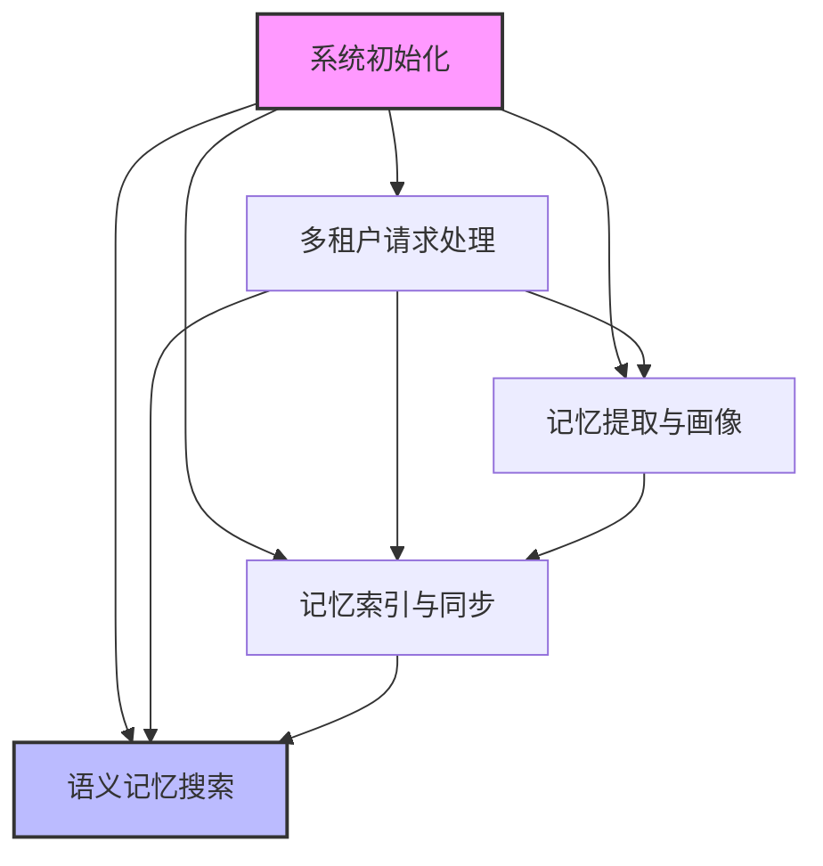
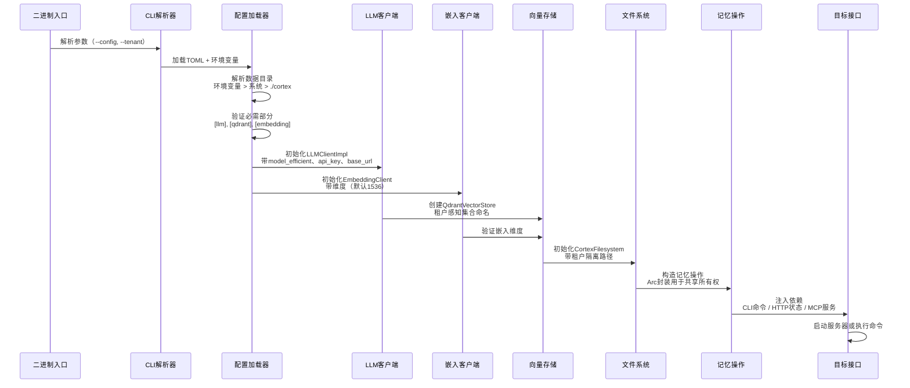
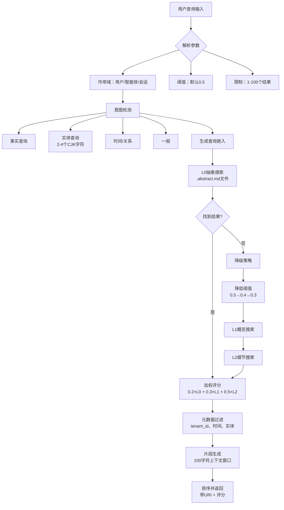
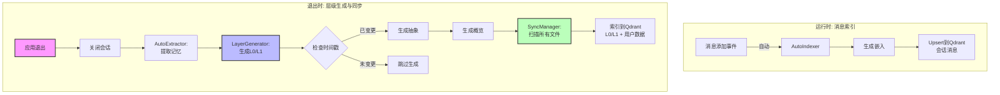
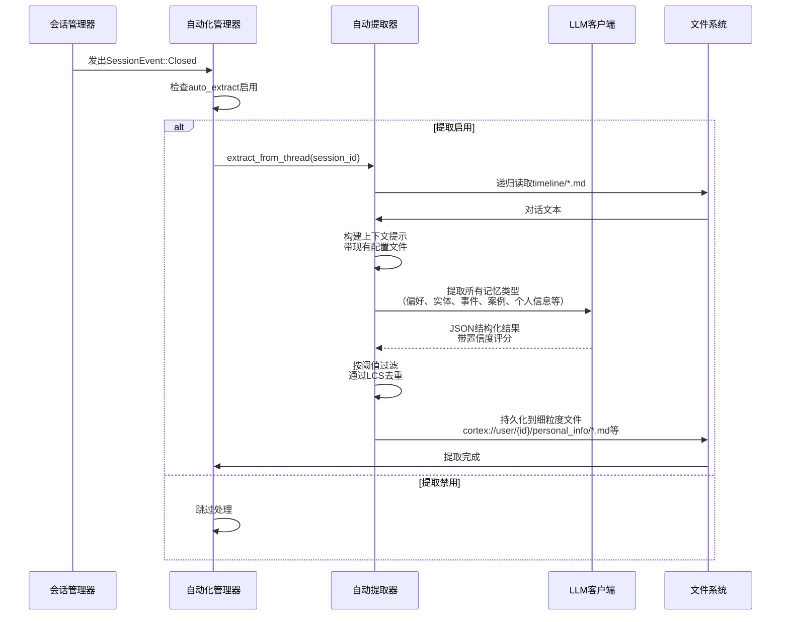
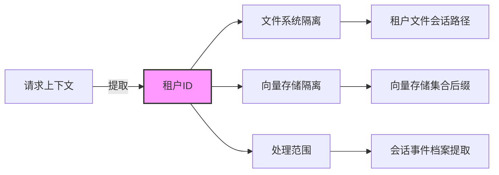
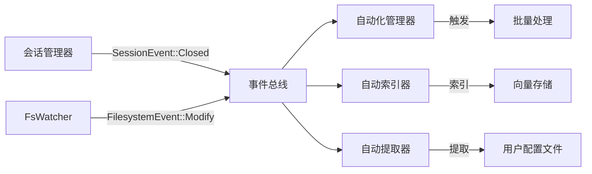
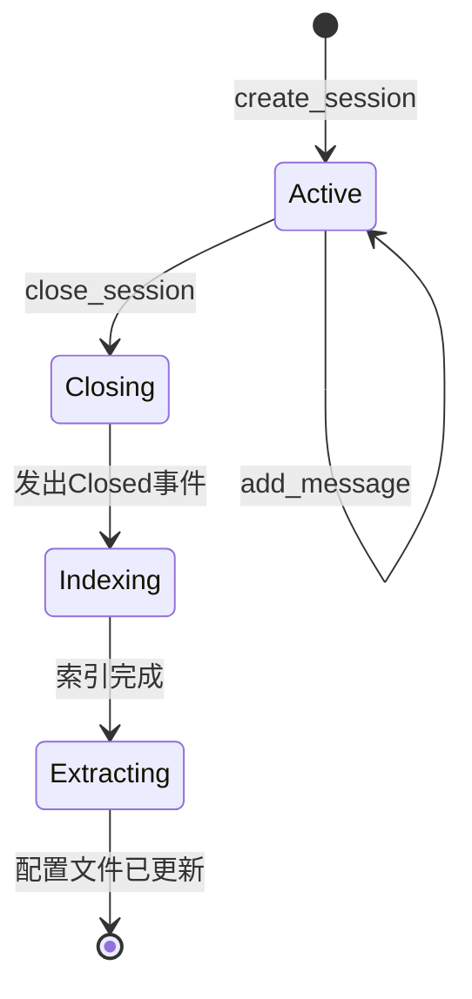
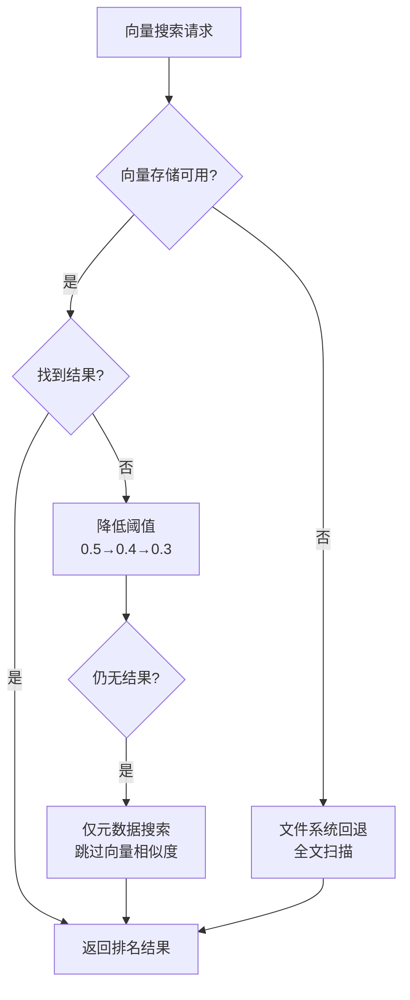

# 核心工作流

**文档版本**: 1.0  
**系统**: Cortex Memory (cortex-mem)  
**最后更新**: 2024

## 目录
1. [工作流概述](#1-工作流概述)
2. [主要工作流](#2-主要工作流)
3. [流程协调与控制](#3-流程协调与控制)
4. [异常处理与恢复](#4-异常处理与恢复)
5. [关键流程实现](#5-关键流程实现)

---

## 1. 工作流概述

### 1.1 系统架构与工作流全景

Cortex-Mem实现了一个**多维度记忆管理系统**，为AI智能体设计，围绕五个核心运营工作流构建，确保跨会话的持久化、上下文感知记忆。系统遵循**分层检索架构**（L0抽象、L1概览、L2细节）结合**基于向量的语义搜索**和**文件系统抽象**。

### 1.2 核心工作流分类

系统通过五个主要工作流运行，涵盖初始化、运行时操作和后台自动化：

| 工作流 | 类型 | 频率 | 关键性 | 关键组件 |
|----------|------|-----------|-------------|----------------|
| **系统初始化** | 引导 | 每个实例 | 关键 | 配置加载、DI容器、服务连接 |
| **语义记忆搜索** | 用户面向 | 每个查询 | 关键 | 向量引擎、层级管理器、排序 |
| **记忆索引与同步** | 后台 | 事件驱动 | 高 | 文件监视器、索引器、向量存储 |
| **记忆提取与画像** | 后台 | 会话关闭 | 高 | LLM提取、配置文件合并、去重 |
| **多租户请求处理** | 跨切面 | 每个请求 | 关键 | 租户隔离、URI路由、集合作用域 |

### 1.3 工作流依赖关系



**依赖理由**:
- **初始化**是所有运营工作流的前提，建立依赖注入图和服务边界。
- **多租户处理**作为跨切面问题，限定所有后续操作。
- **索引**为**搜索**依赖的向量存储提供数据。
- **提取**生成丰富未来搜索上下文的配置文件数据。

---

## 2. 主要工作流

### 2.1 系统初始化与依赖注入

#### 2.1.1 流程概述

初始化工作流通过加载配置、初始化核心服务（LLM、Qdrant、文件系统）并为所有接口（CLI、HTTP API、MCP、Web）连接依赖项来引导整个系统。这确保所有入口点的状态一致。

#### 2.1.2 执行流程



#### 2.1.3 关键流程节点

**配置解析策略**:
1. **环境变量**（`CORTEX_DATA_DIR`、`EMBEDDING_API_KEY`）具有最高优先级
2. **TOML配置文件**通过`--config`指定或默认位置
3. **系统目录**使用`directories` crate（如macOS上的`~/Library/Application Support/com.cortex-mem.tars`）
4. **本地回退**到`.cortex`用于开发/可移植性

**依赖注入模式**:
- 使用`Arc<T>`进行`MemoryOperations`的线程安全共享所有权
- boxed特性对象（`Box<dyn VectorStore>`、`Box<dyn LLMClient>`）实现松耦合和可测试性
- 构建器模式（`CortexMemBuilder`）用于流式初始化

**验证门控**:
- 必需配置部分：`[llm]`、`[qdrant]`、`[embedding]`
- Qdrant连接验证
- 嵌入维度自动检测（回退到1536用于text-embedding-3-small）

---

### 2.2 语义记忆搜索流程

#### 2.2.1 流程概述

语义搜索工作流使用L0（抽象）、L1（概览）和L2（细节）层的加权组合，对记忆维度（用户、智能体、会话）执行智能的多层检索。这是系统的主要价值交付工作流。

#### 2.2.2 执行流程



#### 2.2.3 分层检索算法

**三层架构**:

1. **L0层（抽象）**: 使用`.abstract.md`文件（~100 tokens）的快速定位
   - **目的**: 粗粒度候选选择
   - **权重**: 最终评分的20%
   - **内容**: 捕获核心本质的单句或2-3句摘要（谁、什么、何时）

2. **L1层（概览）**: 使用`.overview.md`文件（500-2000 tokens）的深度探索
   - **目的**: 决策的上下文精炼
   - **权重**: 最终评分的30%
   - **内容**: 带摘要、核心主题、关键点、实体的结构化markdown

3. **L2层（细节）**: 使用完整消息内容的精确匹配
   - **目的**: 最终相关性确认
   - **权重**: 最终评分的50%
   - **内容**: Markdown格式的原始对话消息

**评分公式**:
```rust
final_score = (l0_score × 0.2) + (l1_score × 0.3) + (l2_score × 0.5)
```

#### 2.2.4 自适应查询处理

**意图检测**:
- **实体查询**: 短中文名（2-4个CJK字符）或短英文专有名词触发专门处理，阈值为0.4
- **事实查询**: 事实寻求的模式匹配（谁、什么、何时）
- **时间查询**: 通过正则表达式检测的基于时间的约束

**默认阈值**:
- **默认搜索阈值**: 0.6（从0.5提升以提高精确度）
- **实体查询阈值**: 0.4（特定查找更高召回率）
- **最小阈值**: 0.4（防止返回过度不相关的结果）

**降级策略**:
1. **渐进阈值降低**: 如果L0返回空，降低相似度阈值，但最低不低于0.4（防止返回过度宽泛的结果）
2. **层级旁路**: 当分层检索失败时，回退到绕过层级架构的完整语义搜索
3. **作用域过滤**: 应用层URI前缀过滤确保作用域隔离，即使向量存储过滤器配置错误

---

### 2.3 记忆索引与同步

#### 2.3.1 流程概述

此工作流管理两个关键的同步机制：
1. **运行时消息索引**：在运行时自动索引对话消息
2. **退出时层级生成与同步**：应用退出时生成 L0/L1 层级文件并同步到向量数据库

这种双重机制确保了对话的即时可搜索性以及所有记忆数据的全面覆盖。

#### 2.3.2 执行流程



#### 2.3.3 运行时消息索引

**触发条件**: `SessionEvent::MessageAdded`

**处理流程**:
1. 使用 `EmbeddingClient` 立即嵌入消息内容
2. 创建带元数据（user_id、session_id、role、timestamp）的向量点
3. Upsert 到 Qdrant 集合（租户感知命名）
4. 通过 `tokio::spawn` 异步处理（非阻塞）

**配置**:
```rust
AutomationConfig {
    auto_index: true,
    index_on_message: true,   // ✅ 立即索引
    index_on_close: true,     // ✅ 会话关闭时生成L0/L1并索引
    index_batch_delay: 1,
    generate_layers_every_n_messages: 5,  // ✅ 定期L0/L1生成
}
```

#### 2.3.4 退出时与会话关闭时的层级生成与同步

**触发条件**: 
1. 应用关闭（`App::on_exit()`）
2. 通过 `close_session()` MCP工具或HTTP API关闭会话

**多阶段处理**:

**阶段1：记忆提取**
- 会话关闭，触发 `AutoExtractor`
- LLM 提取结构化事实、实体、偏好
- 保存到 `cortex://user/{user_id}/` 分类目录

**阶段2：层级文件生成**
- `LayerGenerator::ensure_timeline_layers()` 用于特定会话，或
- `LayerGenerator::ensure_all_layers()` 用于所有会话
- **变更检测**: 比较文件时间戳与现有 `.abstract.md`
- 仅在以下情况重新生成：
  - `.abstract.md` 或 `.overview.md` 缺失
  - 源文件比现有层级文件更新
- 生成 L0 抽象（~100 tokens）和 L1 概览（~2000 tokens）
- **Token 节省**: 通过时间戳跟踪跳过 90% 的重新生成

**阶段3：向量同步**
- `SyncManager::sync_specific_path()` 用于会话作用域同步，或
- `SyncManager::sync_all()` 用于全系统同步
- 索引**所有** markdown 文件（会话、用户、智能体数据）
- 包括新生成的 `.abstract.md` 和 `.overview.md`
- **去重**: 内容哈希检查防止重复索引
- 返回统计信息：`{total_files, indexed_files, skipped_files, error_files}`

**代码实现**:
```rust
// examples/cortex-mem-tars/src/app.rs
pub async fn on_exit(&mut self) -> Result<()> {
    // 1. 关闭会话 → 触发提取
    session_manager.close_session(session_id).await?;
    
    // 2. 生成 L0/L1 层级文件
    let stats = tenant_ops.ensure_all_layers().await?;
    log::info!("层级: {} 已生成, {} 已跳过", 
        stats.generated, stats.skipped);
    
    // 3. 同步所有文件到 Qdrant
    let sync_stats = tenant_ops.index_all_files().await?;
    log::info!("已索引: {}/{} 文件", 
        sync_stats.indexed_files, sync_stats.total_files);
    
    Ok(())
}
```

**MCP工具集成**:
```rust
// 新增MCP工具用于会话生命周期管理
// cortex-mem-mcp/src/service.rs

#[tool(description = "为记忆生成L0/L1层级文件")]
async fn generate_layers(
    thread_id: Option<String>,  // 可选：特定会话或全部
) -> GenerateLayersResult;

#[tool(description = "将记忆索引到向量数据库")]
async fn index_memories(
    thread_id: Option<String>,  // 可选：特定会话或全部
) -> IndexMemoriesResult;

#[tool(description = "关闭会话并触发最终处理")]
async fn close_session(
    thread_id: String,
) -> CloseSessionResult;
```

#### 2.3.5 关键机制

**变更检测策略**:
```rust
async fn should_regenerate(&self, uri: &str) -> Result<bool> {
    // 1. 检查 .abstract.md 是否存在
    let abstract_path = format!("{}/.abstract.md", uri);
    if !filesystem.exists(&abstract_path).await? {
        return Ok(true);  // 必须生成
    }
    
    // 2. 从 .abstract.md 提取时间戳
    let content = filesystem.read(&abstract_path).await?;
    let abstract_time = extract_added_timestamp(&content);
    
    // 3. 与源文件时间戳比较
    for file in list_directory(uri).await? {
        if file.modified > abstract_time {
            return Ok(true);  // 文件已更新，重新生成
        }
    }
    
    Ok(false)  // 无变化，跳过
}
```

**确定性向量ID生成**:
```rust
// 双重哈希确保相同URI+Layer始终生成相同ID
id = hash(hash(uri) + layer_suffix)
```
- **目的**: 实现幂等更新和去重
- **格式**: 来自内容URI和层标识符（L0/L1/L2）的UUIDv5

**批量处理策略**:
- **实时模式**: 消息添加时立即索引（对话期间使用）
- **批量模式**: 退出时全扫描（全面覆盖）
- **去重**: 在嵌入生成前检查内容哈希以避免冗余LLM API调用

**层级生成管道**:
1. **原始内容**（L2）：从文件系统markdown加载
2. **抽象生成**：使用`Prompts::generate_abstract`的LLM提示（~100 tokens）
3. **概览生成**：使用`Prompts::generate_overview`的LLM提示（结构化markdown）
4. **向量化**：每个层级分别嵌入，带维度一致性检查

#### 2.3.6 性能优化

**Token 节省**:
- **90% 减少**: 基于时间戳的变更检测跳过未变更的目录
- **示例**: 100个目录，仅10个变更 → 10次LLM调用而非100次

**同步效率**:
- **哈希去重**: 内容哈希存储在向量元数据中
- **跳过已索引**: 嵌入前通过 Qdrant `exists(vector_id)` 检查
- **批量处理**: 文件按可配置批量大小处理（默认：10）

**内存管理**:
- 层级生成和同步在会话关闭**之后**运行
- 运行时非阻塞（仅退出时阻塞）
- 确保关闭前完成数据同步

---

### 2.4 记忆提取与画像

#### 2.4.1 流程概述

在会话关闭时触发，此工作流从对话历史中提取结构化事实、决策和实体，并丰富用户或智能体画像。它实现跨会话的持久化个性化和累积学习。

#### 2.4.2 执行流程



#### 2.4.3 提取分类

**提取类型**:

1. **个人信息 (Personal Info)**: 人口统计、联系方式等
2. **工作经历 (Work History)**: 公司、角色、期限、描述
3. **偏好 (Preferences)**: 用户偏好和习惯
4. **关系 (Relationships)**: 人际关系网络（家人、朋友、同事）
5. **目标 (Goals)**: 个人或职业目标
6. **实体 (Entities)**: 人物、项目、组织
7. **事件 (Events)**: 重要决策、里程碑
8. **案例 (Cases)**: 问题与解决方案（用于Agent学习）

**去重策略**:
- **算法**: 最长公共子串（LCS）相似度
- **阈值**: 可配置的字符串相似度（默认0.85）
- **冲突解决**: 更高置信度分数覆盖现有；以时间戳为基础的平局决胜

---

### 2.5 多租户记忆管理

#### 2.5.1 流程概述

通过将所有操作限定到租户ID，实现不同用户、智能体或组织之间记忆数据的隔离。支持多个租户共享同一系统实例同时保持数据分离的SaaS部署。

#### 2.5.2 隔离架构



#### 2.5.3 租户传播链

1. **入口点提取**:
   - CLI: `--tenant`参数
   - HTTP: `Authorization` header或请求元数据
   - MCP: 上下文参数

2. **配置传播**:
   - `QdrantConfig::with_tenant_id()`：后缀集合名称
   - `CortexFilesystem`：在所有路径前加上`/tenants/{tenant_id}`
   - `AutomationManager`：按租户限定事件处理

3. **数据隔离保证**:
   - **文件系统**: 物理目录分离防止跨租户文件访问
   - **向量存储**: 每个租户独立的Qdrant集合（或共享集合中的命名空间隔离）
   - **搜索**: 所有向量查询自动按`tenant_id`元数据过滤

---

## 3. 流程协调与控制

### 3.1 事件驱动架构

系统使用Tokio的`mpsc`无界通道实现**发布/订阅事件总线**，实现组件间的松耦合。

**事件分类**:
```rust
enum CortexEvent {
    Session(SessionEvent),      // 创建、消息添加、关闭
    Filesystem(FilesystemEvent), // 创建、修改、删除
}
```

**事件流**:


**协调模式**:
- **即发即忘**: 会话事件触发后台提取而不阻塞UI
- **批量聚合**: `AutomationManager`使用`HashSet`对快速连续事件去重
- **并发处理**: `tokio::spawn`用于并行索引；`tokio::select!`用于超时管理

### 3.2 状态管理

**会话状态机**:


**索引状态跟踪**:
- **内存中**: `HashMap<String, Vec<String>>`跟踪每个线程处理的消息ID
- **去重**: 存储在向量元数据中的内容哈希防止重新索引
- **持久化**: 向量存储作为索引状态的真相来源

### 3.3 数据流模式

**请求-响应流**（同步）:
1. 接口接收请求（HTTP/MCP/CLI）
2. 提取租户上下文
3. 调用`MemoryOperations`方法
4. 直接访问文件系统或向量存储
5. 返回结构化响应

**后台处理流**（异步）:
1. 检测到事件（文件变化、会话关闭）
2. 事件排队到`AutomationManager`
3. `tokio::spawn`创建后台任务
4. 进度通过`tracing`日志跟踪
5. 结果持久化到存储

### 3.4 并发控制

**资源共享**:
- `Arc<MemoryOperations>`: 在所有请求处理器间共享
- `Arc<Mutex<File>>`: 日志文件访问串行化
- `RwLock<HashMap>`: Web UI中的租户缓存

**并行策略**:
- **每租户并行**: 不同租户并发处理
- **层级并行**: L0/L1/L2向量化按顺序发生（依赖），但多条消息批量并行处理
- **提取并行**: 事实、决策、实体通过`join!`同时提取

---

## 4. 异常处理与恢复

### 4.1 错误分类

系统使用`thiserror`定义全面的错误层次：

| 错误变体 | 来源 | 处理策略 |
|--------------|--------|-------------------|
| `InvalidUri` | URI解析 | 快速失败，带用户上下文 |
| `InvalidDimension` | 类别验证 | 返回400 Bad Request |
| `MemoryNotFound` | 存储查找 | 返回空结果集 |
| `IoError` | 文件系统 | 指数退避重试 |
| `JsonError` | 序列化 | 记录并继续（跳过记录） |
| `LlmError` | AI/ML服务 | 降级到关键词搜索 |
| `EmbeddingError` | 向量化 | 跳过索引，警告监控 |
| `QdrantError` | 向量存储 | 断路器模式 |
| `ConfigError` | 初始化 | 恐慌/退出带错误消息 |

### 4.2 降级策略

**搜索降级**:


**LLM服务降级**:
- **主要**: OpenAI兼容API
- **回退**: 通过兼容端点的本地LLM
- **紧急**: 跳过提取/索引，仅维护L2存储

**索引失败恢复**:
1. **批量回滚**: 失败批次项目记录到`warn!`，其他提交
2. **重试逻辑**: 3次尝试，延迟1s、5s、30s
3. **死信队列**: 持久化失败写入`failed_index/{tenant_id}/{timestamp}.json`

### 4.3 容错模式

**断路器**（向量存储）:
- **关闭**: 正常运行
- **打开**: 5次连续失败后，绕过向量操作60秒
- **半开**: 冷却后测试ping，如果健康则恢复

**优雅关闭**:
1. 停止接受新请求
2. 等待进行中的索引完成（30秒超时）
3. 刷新待处理提取队列
4. 关闭文件系统句柄
5. 终止运行时

### 4.4 恢复程序

**数据一致性修复**:
- **SyncManager**: 通过CLI `cortex-mem sync`手动触发，协调文件系统与向量存储
- **哈希不匹配**: 重新索引文件系统哈希≠存储哈希的内容
- **孤立向量**: 每周清理作业删除具有不存在文件系统URI的向量

**租户隔离 breach恢复**:
- 立即隔离集合
- 审计日志分析数据泄漏范围
- 从文件系统备份重新生成配置文件

---

## 5. 关键流程实现

### 5.1 向量ID生成算法

**目的**: 确保向量条目的确定性、唯一标识符，支持幂等更新。

**实现**:
```rust
fn uri_to_vector_id(uri: &str, layer: ContextLayer) -> String {
    // 步骤1: 规范化URI（小写、修剪）
    let normalized = uri.to_lowercase().trim();
    
    // 步骤2: 创建层后缀
    let suffix = match layer {
        ContextLayer::Abstract => "#L0",
        ContextLayer::Overview => "#L1", 
        ContextLayer::Detail => "#L2",
    };
    
    // 步骤3: 双重哈希增加熵
    let hash1 = sha256(normalized);
    let hash2 = sha256(hash1 + suffix);
    
    // 步骤4: 转换为UUIDv5格式
    uuid_from_hash(hash2)
}
```

**属性**:
- **确定性**: 相同URI + Layer始终产生相同ID
- **抗碰撞**: 双重SHA256，带租户作用域URI
- **可解析**: `parse_vector_id()`从ID提取原始URI和层

### 5.2 意图检测引擎

**分类逻辑**:

```rust
fn detect_intent(query: &str) -> IntentType {
    // 实体检测：短专有名词
    if is_cjk(query) && query.len() <= 12 {  // 2-4个CJK字符
        return IntentType::Entity;
    }
    
    // 事实模式
    if query.matches(r"^(who|what|when|where|why|how)\b") {
        return IntentType::Factual;
    }
    
    // 时间模式
    if query.matches(r"\b(yesterday|today|last week|in 2024)\b") {
        return IntentType::Temporal;
    }
    
    // 关系模式
    if query.matches(r"\b(related to|about|with)\b") {
        return IntentType::Relational;
    }
    
    IntentType::General
}
```

**阈值适配**:
- **实体/事实**: 0.4（更高召回率用于特定查找）
- **一般**: 0.5（平衡精确度/召回率）
- **关系**: 0.45（加权用于连接发现）

### 5.3 内容哈希与去重

**去重管道**:
1. **内容规范化**: 移除空白、小写、规范化Unicode
2. **SimHash生成**: 64位哈希用于近重复检测
3. **汉明距离**: 3位阈值用于相似度
4. **LCS验证**: 最长公共子串 > 80%确认重复

**批量去重**:
- 每次索引运行中处理消息ID的内存`HashSet`
- 向量存储预检查：`exists(vector_id)`在嵌入前
- 基于时间戳的冲突解决：如果哈希匹配则保留较新

### 5.4 记忆去重与持久化算法

**去重策略**:
记忆提取时通过计算新内容与现有文件的相似度来避免重复：

```rust
fn deduplicate<T>(new_items: &[T], existing_contents: &[String]) -> Vec<T> {
    new_items.iter().filter(|item| {
        // 1. 构建完整内容字符串（组合多个关键字段，如 topic+preference）
        let full_content = format!("{} {}", item.field1, item.field2);
        
        // 2. 检查与现有文件的相似度（> 0.8 视为重复）
        let is_duplicate = existing_contents.iter().any(|existing| {
            calculate_similarity(&full_content, existing) > 0.8
        });
        
        !is_duplicate
    }).cloned().collect()
}
```

**持久化策略**:
- **细粒度存储**: 每个记忆项（偏好、实体等）作为一个独立的 `.md` 文件保存
- **文件命名**: 使用递增索引避免覆盖（如 `pref_0.md`, `pref_1.md`）
- **元数据**: 文件内容包含添加时间、置信度、来源上下文等元数据
- **目录结构**:
  - `cortex://user/{id}/preferences/`
  - `cortex://user/{id}/personal_info/`
  - `cortex://user/{id}/entities/`
  - 等等

### 5.5 性能优化策略

**嵌入批量处理**:
- **最优批量大小**: 32项（平衡延迟与吞吐量）
- **分块处理**: 大批量分割为子批次，带100ms产生活动点
- **连接池**: HTTP/2多路复用用于嵌入API调用

**文件系统I/O**:
- **异步操作**: 所有FS调用使用`tokio::fs`（非阻塞）
- **元数据缓存**: 文件stat的LRU缓存（1000条）
- **缓冲写入**: Markdown文件写入的4KB缓冲区

**向量搜索优化**:
- **HNSW索引**: Qdrant的HNSW算法用于亚毫秒相似度搜索
- **元数据过滤**: 在向量比较前按tenant_id预过滤（减少搜索空间）
- **分页**: 大结果集的光标滚动（避免偏移限制）

**内存管理**:
- **流式处理**: 大会话文件通过流式JSON解析器处理
- **对象池**: 跨请求重用LLM客户端连接
- **延迟加载**: L0/L1层按需生成，缓存到文件系统

---

## 附录：工作流指标与监控

**关键性能指标**:

| 工作流 | 指标 | 目标 | 告警阈值 |
|----------|--------|--------|----------------|
| 搜索 | P95延迟 | <200ms | >500ms |
| 索引 | 吞吐量 | 100 docs/sec | <20 docs/sec |
| 提取 | 准确度 | >90%置信度 | <70%置信度 |
| 初始化 | 启动时间 | <5s | >15s |

**健康检查端点**:
- `/health`: 存活探针（运行时活跃则HTTP 200）
- `/ready`: 就绪探针（检查Qdrant连接、磁盘空间）
- `/metrics`: Prometheus风格指标，用于向量存储延迟、索引队列深度

---

*核心工作流文档结束*
