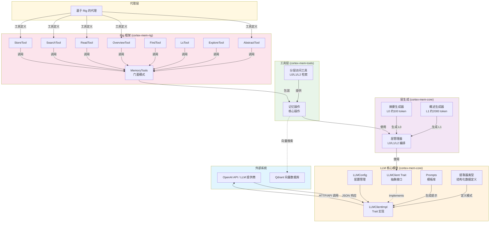
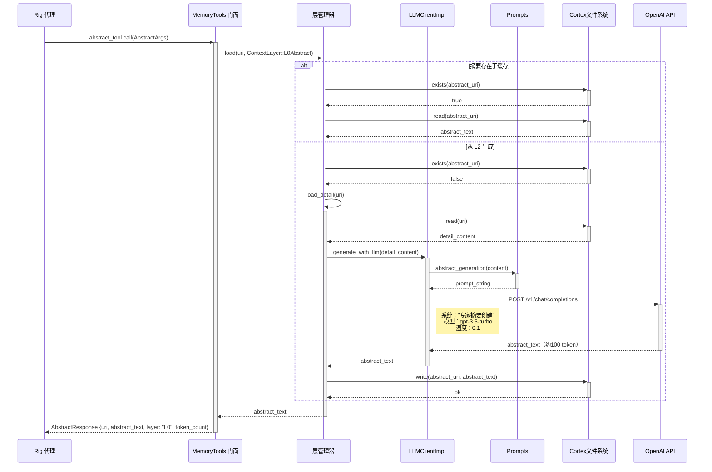
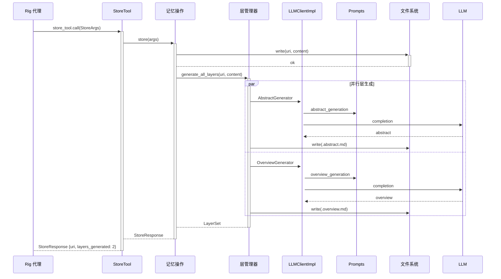

**LLM 集成领域 - 技术文档**

**生成时间**：2026-02-17 16:39:06 (UTC)  
**版本**：1.0  
**状态**：生产就绪

---

## 1. 概述

**LLM 集成领域**提供了在 Cortex-Mem 系统内与大语言模型（LLM）交互的核心基础设施。该领域通过统一的基于 trait 的接口抽象了提供商特定实现（OpenAI、Azure、本地模型），实现文本补全、结构化数据提取和自动化记忆层生成。

该领域实现了受 OpenViking 设计模式启发的**三层记忆抽象架构**（L0-L2），内容被逐步摘要以优化上下文窗口使用。它作为认知引擎，为自动化记忆提取、内容分类和语义摘要提供动力。

### 1.1 关键能力

- **统一 LLM 客户端接口**：基于 trait 的抽象（`LLMClient`），通过 Rig 框架支持多个提供商
- **结构化提取**：使用模式验证的类型安全 JSON 提取，使用 12 种专用数据类型
- **分层内容生成**：从详细内容自动生成 L0 摘要（约 100 token）和 L1 概述（约 2000 token）
- **提示工程系统**：用于一致 LLM 交互的集中模板管理
- **Rig 框架集成**：8 种专用工具，实现基于代理的记忆操作

---

## 2. 架构

### 2.1 高级组件图



### 2.2 设计原则

该领域遵循**六边形架构**原则，具有清晰的依赖边界：

1. **依赖倒置**：接口适配器（`cortex-mem-rig`、`cortex-mem-tools`）依赖核心领域，而非相反
2. **提供商抽象**：`LLMClient` trait 支持在 OpenAI、Azure 或本地 LLM 提供商之间切换，而不改变业务逻辑
3. **类型安全**：结构化提取使用 Serde 进行序列化，Schemars 用于 JSON Schema 生成，确保运行时契约合规
4. **异步优先**：所有 LLM 操作都是异步的，使用 Tokio，支持多个提取任务的并发处理

---

## 3. 核心组件

### 3.1 LLM 客户端架构

系统使用 `rig-core` 库作为底层提供商，实现**基于 trait 的抽象层**。

#### 3.1.1 LLMClient Trait

`LLMClient` trait 定义了所有 LLM 交互的契约：

```rust
#[async_trait]
pub trait LLMClient: Send + Sync {
    /// 简单文本补全
    async fn complete(&self, prompt: &str) -> Result<String>;
    
    /// 带系统提示上下文的补全
    async fn complete_with_system(&self, system: &str, prompt: &str) -> Result<String>;
    
    /// 从对话文本结构化提取记忆
    async fn extract_memories(&self, prompt: &str) -> Result<MemoryExtractionResponse>;
    
    /// 带元数据的结构化事实提取
    async fn extract_structured_facts(&self, prompt: &str) -> Result<StructuredFactExtraction>;
    
    /// 带综合元数据的详细事实提取
    async fn extract_detailed_facts(&self, prompt: &str) -> Result<DetailedFactExtraction>;
    
    /// 自省方法
    fn model_name(&self) -> &str;
    fn config(&self) -> &LLMConfig;
}
```

#### 3.1.2 LLMClientImpl

`LLMClientImpl` 结构体包装 Rig OpenAI 客户端，遵循模式：**客户端 → 补全模型 → 代理**。

**关键实现细节**：
- **JSON 提取**：从 markdown 代码块解析结构化响应，带多种回退策略（正则提取、直接 JSON 解析、错误恢复）
- **提供商兼容性**：支持 OpenAI 兼容 API（OpenAI、Azure、本地推理服务器如 Ollama）
- **错误处理**：区分瞬态网络错误（可重试）和模式验证错误（应用逻辑）

**文件**：`cortex-mem-core/src/llm/client.rs`

### 3.2 配置管理

`LLMConfig` 结构体管理所有 LLM 相关配置，带环境变量回退：

```rust
pub struct LLMConfig {
    pub api_base_url: String,      // LLM_API_BASE_URL
    pub api_key: String,           // LLM_API_KEY
    pub model: String,             // LLM_MODEL
    pub temperature: f32,          // 默认：0.1 用于确定性提取
    pub max_tokens: usize,         // 上下文窗口管理
}
```

**默认配置**：
- **模型**：`gpt-3.5-turbo`（用于提取任务的高效模型）
- **温度**：0.1（低方差，用于一致的结构化输出）
- **端点**：OpenAI API v1 聊天补全

**文件**：`cortex-mem-core/src/llm/mod.rs`

### 3.3 提示工程层

`Prompts` 结构体提供遵循认知处理阶段的四个专用提示模板：

#### 3.3.1 L0 摘要生成
- **目标**：约 100 token
- **目的**：用于快速相关性检查的单句摘要
- **用例**：初始记忆过滤、快速检索预览

#### 3.3.2 L1 概述生成
- **目标**：约 500-2000 token
- **结构**：带部分的 Markdown 格式：
  - **摘要**：高级叙事
  - **核心主题**：关键主题
  - **要点**：要点式洞察
  - **实体**：人、组织、概念
  - **上下文**：时间和情境元数据

#### 3.3.3 记忆提取
- **格式**：JSON 结构化输出
- **类别**：事实、决策、行动项、用户偏好、代理学习
- **元数据**：重要性评分、来源归属、实体关系

#### 3.3.4 意图分析
- **输出**：关键词、实体、时间范围、查询类型分类
- **目的**：语义搜索优化的查询理解

**文件**：`cortex-mem-core/src/llm/prompts.rs`

### 3.4 结构化类型系统

`extractor_types.rs` 模块使用 **Serde** 进行序列化和 **Schemars** 用于 JSON Schema 生成，定义了 12 种结构化数据类型：

| 类型 | 目的 | 关键字段 |
|------|---------|------------|
| `StructuredFactExtraction` | 高级事实收集 | facts: Vec<StructuredFact> |
| `DetailedFactExtraction` | 综合分析 | facts, entities, sentiment, confidence |
| `StructuredFact` | 单个事实表示 | importance, category, entities, source_role |
| `KeywordExtraction` | 搜索优化 | keywords, entities, concepts |
| `MemoryClassification` | 分类 | memory_type, priority, retention_policy |
| `ImportanceScore` | 优先级排名 | score (1-10), rationale |
| `DeduplicationResult` | 记忆合并 | is_duplicate, canonical_id, similarity_score |
| `SummaryResult` | 内容压缩 | summary, key_points, length |
| `LanguageDetection` | 本地化 | language_code, confidence |
| `EntityExtraction` | NER 处理 | entities: Vec<Entity> |
| `Entity` | 命名实体 | name, type, mentions, metadata |
| `ConversationAnalysis` | 对话理解 | topics, sentiment, action_items, participants |

**Schema 生成**：类型实现 `JsonSchema`，用于自动 OpenAI 函数调用 schema 生成。

**文件**：`cortex-mem-core/src/llm/extractor_types.rs`

---

## 4. 层生成系统

**三层记忆架构**提供渐进式上下文加载，以优化 LLM 上下文窗口使用。

### 4.1 层管理器

`LayerManager` 实现延迟加载与自动生成：

```rust
impl LayerManager {
    /// 带自动回退生成的统一层加载
    pub async fn load(&self, uri: &str, layer: ContextLayer) -> Result<String>;
    
    /// 批量生成所有三层
    pub async fn generate_all_layers(&self, uri: &str, content: &str) -> Result<()>;
    
    /// 用于批量处理的时间线聚合
    pub async fn generate_timeline_layers(&self, messages: &[Message]) -> Result<LayerSet>;
}
```

**层类型**：
- **L0（摘要）**：约 100 token，1-2 句摘要
- **L1（概述）**：约 2000 token，结构化 markdown
- **L2（详细）**：完整原始内容

### 4.2 生成策略

当请求层但不存在时：
1. 从 L2（详细层）加载基础内容
2. 选择适当的生成器（`AbstractGenerator` 或 `OverviewGenerator`）
3. 使用专门提示应用 LLMClient
4. 将生成内容持久化到文件系统缓存
5. 返回内容给调用者

**缓存策略**：生成层缓存在文件系统，带命名约定 `{uri}.abstract.md` 和 `{uri}.overview.md`，以避免冗余 LLM 调用。

**文件**： 
- `cortex-mem-core/src/layers/manager.rs`
- `cortex-mem-core/src/layers/generator.rs`

---

## 5. Rig 框架集成

`cortex-mem-rig` crate 提供与 Rig 代理框架的集成，将记忆能力公开为可调用工具。

### 5.1 MemoryTools 门面

`MemoryTools` 结构体作为**门面模式**提供线程安全访问：

```rust
pub struct MemoryTools {
    operations: Arc<MemoryOperations>,
}

impl MemoryTools {
    pub async fn new_with_config(config: &Config) -> Result<Self>;
    pub fn get_abstract(&self, uri: &str) -> AbstractTool;
    pub fn get_overview(&self, uri: &str) -> OverviewTool;
    // ... 额外的工具访问器
}
```

### 5.2 工具实现

八种专用工具实现 `rig::tool::Tool` trait：

| 工具 | 目的 | 参数 | 输出 |
|------|---------|------|--------|
| `AbstractTool` | 检索 L0 摘要 | `uri: String` | `AbstractResponse` |
| `OverviewTool` | 检索 L1 结构化概述 | `uri: String` | `OverviewResponse` |
| `ReadTool` | 访问 L2 完整内容 | `uri: String` | `ReadResponse` |
| `SearchTool` | 语义向量搜索 | `query: String, limit: usize` | `SearchResponse` |
| `FindTool` | 快速 L0 相关性搜索 | `keywords: Vec<String>` | `FindResponse` |
| `LsTool` | 目录/记忆列表 | `path: String, recursive: bool` | `LsResponse` |
| `ExploreTool` | 智能内容探索 | `uri: String, depth: usize` | `ExploreResponse` |
| `StoreTool` | 带自动分层的內容存储 | `uri: String, content: String` | `StoreResponse` |

每个工具实现：
- `const NAME: &'static str` - 工具标识符
- `type Args` - 输入模式（可反序列化）
- `type Output` - 响应模式（可序列化）
- `async fn definition() -> ToolDefinition` - 用于 LLM 函数调用的 JSON Schema
- `async fn call(args: Self::Args) -> Result<Self::Output>` - 执行逻辑

**文件**：`cortex-mem-rig/src/tools/mod.rs`

---

## 6. 数据流

### 6.1 分层记忆检索流程（L0 摘要）



### 6.2 结构化记忆提取流程



---

## 7. 集成模式

### 7.1 依赖注入

所有组件使用 `Arc<dyn LLMClient>` 用于共享所有权和依赖注入：

```rust
pub struct AbstractGenerator {
    llm_client: Arc<dyn LLMClient>,
}

impl AbstractGenerator {
    pub fn new(llm_client: Arc<dyn LLMClient>) -> Self {
        Self { llm_client }
    }
}
```

此模式启用：
- **测试**：用于单元测试的模拟 LLMClient 实现
- **提供商切换**：运行时选择 LLM 提供商
- **资源共享**：跨所有生成器的单个客户端连接池

### 7.2 初始化模式

`create_memory_tools_with_tenant_and_vector()` 异步构造函数初始化完整堆栈：

```rust
pub async fn create_memory_tools_with_tenant_and_vector(
    data_dir: PathBuf,
    tenant_id: String,
    llm_config: LLMConfig,
    qdrant_url: String,
    embedding_config: EmbeddingConfig,
) -> Result<MemoryTools> {
    // 1. 初始化文件系统
    // 2. 创建 LLMClient
    // 3. 连接 Qdrant
    // 4. 使用生成器初始化 LayerManager
    // 5. 包装在 MemoryTools 门面中
}
```

---

## 8. 配置参考

### 8.1 环境变量

| 变量 | 描述 | 默认 |
|----------|-------------|---------|
| `LLM_API_BASE_URL` | LLM API base URL | `https://api.openai.com/v1` |
| `LLM_API_KEY` | 认证密钥 | *必需* |
| `LLM_MODEL` | 模型标识符 | `gpt-3.5-turbo` |
| `LLM_TEMPERATURE` | 采样温度 | `0.1` |
| `LLM_MAX_TOKENS` | 最大补全长度 | `4096` |

### 8.2 TOML 配置

```toml
[llm]
api_base_url = "https://api.openai.com/v1"
api_key = "sk-..."
model = "gpt-3.5-turbo"
temperature = 0.1
max_tokens = 4096

[embedding]
api_base_url = "https://api.openai.com/v1"
api_key = "sk-..."
model = "text-embedding-3-small"
dimensions = 1536
```

---

## 9. 实现指南

### 9.1 错误处理策略

该领域使用分层错误方法：
- **网络层**：对瞬态 HTTP 错误使用指数退避重试
- **解析层**：从 markdown 代码块 JSON 提取的多种回退策略
- **模式层**：针对 Schemars 生成模式的验证，带详细字段级错误报告

### 9.2 性能注意事项

- **异步并发**：层生成（L0 和 L1）使用 `tokio::join!` 并行运行
- **缓存**：生成层持久化到文件系统以避免冗余 LLM 调用
- **Token 优化**：L0 摘要在保持语义相关性的同时最小化上下文窗口使用
- **批处理**：`generate_timeline_layers` 聚合多条消息以进行高效的批量 LLM 处理

### 9.3 扩展点

添加新提取类型：
1. 在 `extractor_types.rs` 使用 `Serialize`、`Deserialize` 和 `JsonSchema` 派生定义结构体
2. 将提取方法添加到 `LLMClient` trait
3. 在 `LLMClientImpl` 中使用适当的提示模板实现方法
4. 如需要，在 `Prompts` 模块中添加新模板

---

## 10. 安全注意事项

1. **API 密钥管理**：密钥存储在 `LLMConfig` 中并通过头传递；永不记录
2. **提示注入预防**：系统提示是静态模板；用户内容被视为数据，而非指令
3. **输出验证**：所有 LLM 响应在反序列化前根据 JSON Schema 验证
4. **速率限制**：客户端应在接口层（CLI/服务）实施速率限制以防止 API 配额耗尽

---

## 11. 相关文档

- **记忆管理领域**：核心记忆操作和 URI 方案
- **向量搜索领域**：Qdrant 集成和嵌入生成
- **Rig 框架**：代理工具定义和 trait 规范
- **配置管理**：环境解析和 TOML 解析

**关联文件**：
- `cortex-mem-core/src/llm/mod.rs`
- `cortex-mem-core/src/llm/client.rs`
- `cortex-mem-core/src/llm/prompts.rs`
- `cortex-mem-core/src/llm/extractor_types.rs`
- `cortex-mem-core/src/layers/manager.rs`
- `cortex-mem-core/src/layers/generator.rs`
- `cortex-mem-rig/src/lib.rs`
- `cortex-mem-tools/src/tools/tiered.rs`
