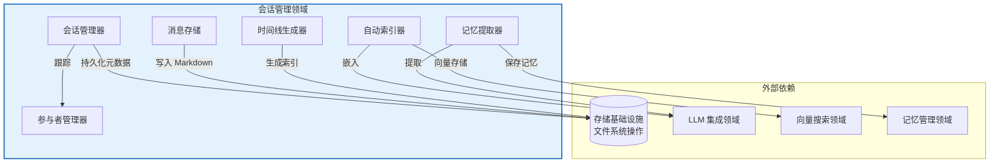
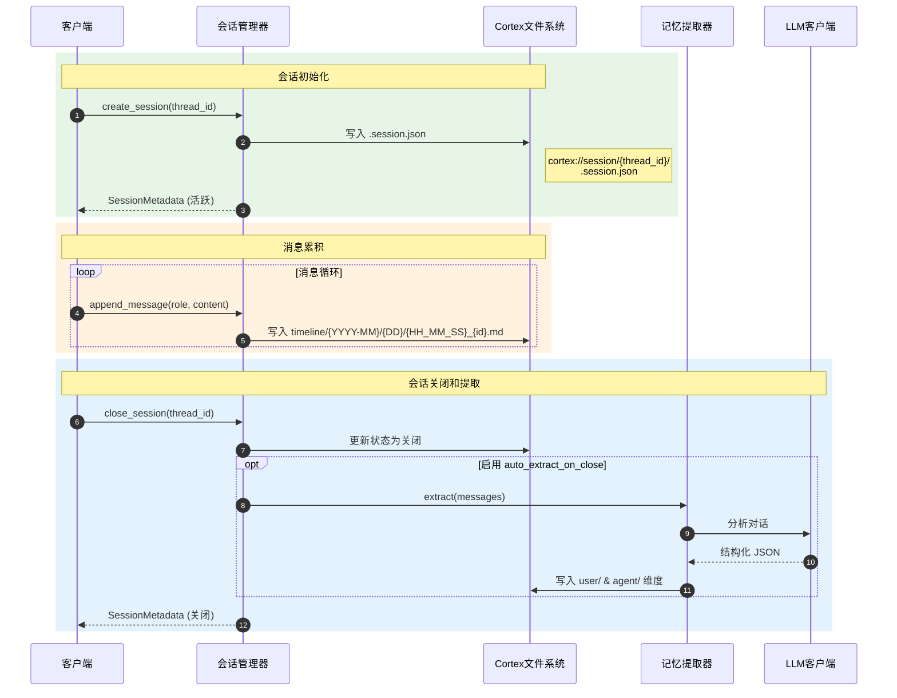
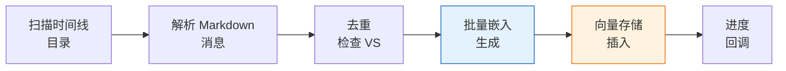

**技术文档：会话管理领域**

**Cortex-Mem 系统架构**  
**版本**：1.0  
**最后更新**：2026-02-17 16:40:50 (UTC)

---

## 1. 执行摘要

**会话管理领域**是 Cortex-Mem 架构内的核心业务领域，负责全面的对话生命周期管理。它为组织多轮对话提供基础性基础设施，具有完整的时间上下文、持久化存储和自动化语义索引功能。

该领域实现了一个有状态的会话编排系统，捕获对话时间线，管理参与者角色，并在会话关闭时触发智能内容处理管道。通过与存储基础设施、LLM 集成和向量搜索领域的集成，它实现了对话历史的时间导航和语义检索。

**关键能力：**
- 层次会话生命周期管理（活跃 → 关闭 → 已归档）
- 带 URI 可寻址的时间消息持久化（`cortex://session/`）
- 对话内容的自动化向量索引到 Qdrant
- LLM 驱动的结构化记忆提取（偏好、实体、事件、案例）
- 多方参与者跟踪与基于角色的分类

---

## 2. 架构概述

### 2.1 领域位置

会话管理领域作为核心业务领域在 Cortex-Mem 分，与层架构中运行基础设施和同级业务领域保持清晰的依赖关系：



### 2.2 组件层次结构

| 组件 | 职责 | 主要文件 |
|-----------|---------------|--------------|
| **会话管理器** | 生命周期编排、状态转换、元数据管理 | `cortex-mem-core/src/session/manager.rs` |
| **消息存储** | 时间持久化、markdown 序列化、URI 生成 | `cortex-mem-core/src/session/message.rs` |
| **时间线生成器** | 层次索引生成（日/月/年） | `cortex-mem-core/src/session/timeline.rs` |
| **自动索引器** | 向量数据库索引、批处理、去重 | `cortex-mem-core/src/automation/indexer.rs` |
| **记忆提取器** | 会话关闭时的 LLM 驱动的结构化提取 | `cortex-mem-core/src/session/extraction.rs` |
| **参与者管理器** | 多方参与者注册和角色分配 | `cortex-mem-core/src/session/participant.rs` |

---

## 3. 核心工作流

### 3.1 会话生命周期管理

会话生命周期遵循状态机模式，具有三种不同的状态，保存在 `.session.json` 元数据文件中：

**状态转换：**
```
活跃 → 关闭 → 已归档
```

**操作流程：**



**实现细节：**
- 会话元数据存储在 `cortex://session/{thread_id}/.session.json`
- 状态转换是原子文件系统操作
- 关闭根据 `SessionConfig.auto_extract_on_close` 标志触发条件记忆提取
- 支持通过 `parent_thread_id` 进行对话线程的层次组织

### 3.2 时间消息持久化

消息使用层次日期目录结构进行持久化，支持高效的时间查询和手动导航：

**URI 模式：**
```
cortex://session/{thread_id}/timeline/{YYYY-MM}/{DD}/{HH_MM_SS}_{message_id}.md
```

**存储格式：**
消息序列化为带结构化元数据头的 Markdown：

```markdown
---
id: msg_001
role: user
timestamp: 2024-01-15T14:30:00Z
thread_id: thread_abc123
---

👤 **用户** (2024-01-15 14:30)

消息内容...
```

**工厂方法：**
`MessageStorage` 组件提供角色特定的工厂方法：
- `MessageStorage::user(content)` → Role::User
- `MessageStorage::assistant(content)` → Role::Assistant  
- `MessageStorage::system(content)` → Role::System

### 3.3 自动化向量索引

自动索引器实现用于对话内容语义索引的批处理管道：

**索引工作流：**



**技术规格：**
- **批量大小**：可配置，默认每批 10 条消息
- **去重**：使用 `scroll_ids()` 查询在处理前检查现有向量 ID
- **向量 ID 格式**：`cortex://session/{thread_id}/messages/{message_id}`
- **异步处理**：非阻塞索引，带 UI 反馈的进度回调
- **内容提取**：解析 markdown 内容，排除元数据头进行嵌入

**配置：**
```rust
IndexerConfig {
    auto_index: bool,      // 启用响应式索引
    batch_size: usize,     // 默认：10
    async_index: bool,     // 后台处理
}
```

### 3.4 结构化记忆提取

会话关闭时，系统可以使用 LLM 分析自动提取结构化记忆，实现 OpenViking 风格的提取模式：

**提取类别：**
1. **偏好**：用户偏好、喜欢/不喜欢、设置
2. **实体**：命名实体、人、组织、地点
3. **事件**：重大事件、里程碑、决策
4. **案例**：代理特定的问题解决模式和解决方案

**持久化目标：**
- 偏好 → `cortex://user/preferences/`
- 实体 → `cortex://user/entities/`
- 事件 → `cortex://user/events/`
- 案例 → `cortex://agent/cases/`

**流程：**
1. 通过递归文件系统扫描从会话时间线收集所有消息
2. 构建包含完整对话上下文结构化提取提示
3. LLM 分析内容并输出带分类记忆的 JSON
4. 为提取的项目生成嵌入
5. 持久化到适当的维度存储，带链接到源会话的元数据

---

## 4. 数据结构

### 4.1 核心类型

**SessionMetadata**
```rust
struct SessionMetadata {
    thread_id: String,
    state: SessionState,           // 活跃、关闭、已归档
    created_at: DateTime<Utc>,
    updated_at: DateTime<Utc>,
    closed_at: Option<DateTime<Utc>>,
    participant_ids: Vec<String>,
    message_count: usize,
    tags: Vec<String>,
    parent_thread_id: Option<String>,
    auto_extract_on_close: bool,
}
```

**Message**
```rust
struct Message {
    id: String,
    thread_id: String,
    role: MessageRole,             // 用户、助手、系统
    content: String,
    timestamp: DateTime<Utc>,
    metadata: HashMap<String, Value>,
}
```

**Participant**
```rust
struct Participant {
    id: String,
    name: String,
    role: ParticipantRole,         // 用户、代理、系统
    metadata: ParticipantMetadata,
}
```

### 4.2 时间线聚合

时间线生成器在三个聚合级别创建可导航索引视图：

| 级别 | 文件 | 内容 |
|-------|------|---------|
| **日** | `timeline/{YYYY-MM}/{DD}/index.md` | 特定日期消息的时间顺序列表 |
| **月** | `timeline/{YYYY-MM}/index.md` | 带消息计数的日期摘要 |
| **年** | `timeline/{YYYY}/index.md` | 带活动指标的月份概览 |

---

## 5. 集成模式

### 5.1 依赖注入

所有组件使用基于 Arc 的依赖注入用于线程安全异步操作：

```rust
pub struct SessionManager {
    filesystem: Arc<dyn CortexFilesystem>,
    config: SessionConfig,
    // 高级功能的可选依赖
    layer_manager: Option<Arc<dyn LayerManager>>,
    llm_client: Option<Arc<dyn LLMClient>>,
}
```

### 5.2 接口契约

**CortexFilesystem Trait**
所有存储操作通过文件系统接口抽象：
- `read(uri: &str) -> Result<String>`
- `write(uri: &str, content: &str) -> Result<()>`
- `list(dir_uri: &str) -> Result<Vec<String>>`
- `exists(uri: &str) -> Result<bool>`

**LLMClient Trait**
用于提取工作流：
- `complete(prompt: &str) -> Result<String>`
- `complete_structured<T>(prompt: &str) -> Result<T>` 其中 T: DeserializeOwned

### 5.3 跨领域通信

**与存储基础设施领域：**
- 所有消息内容通过 `FilesystemOperations` 持久化
- URI 解析由 `URIParser` 处理（`cortex-mem-core/src/filesystem/uri.rs`）
- Markdown 序列化/反序列化在 MessageStorage 中

**与向量搜索领域：**
- 自动索引器通过 `VectorStore` trait 插入 Qdrant
- 使用 `EmbeddingClient` 进行向量生成（默认 1536 维）
- 插入前实现基于滚动的去重

**与 LLM 集成领域：**
- MemoryExtractor 利用 `LLMClient` 进行内容分析
- 提示模板定义在 `cortex-mem-core/src/llm/prompts.rs`
- 结构化提取类型在 `cortex-mem-core/src/llm/extractor_types.rs`

---

## 6. 配置

### 6.1 会话配置

```rust
pub struct SessionConfig {
    /// 会话关闭时自动提取记忆
    pub auto_extract_on_close: bool,
    
    /// 启用消息向量索引
    pub auto_index: bool,
    
    /// 索引操作的批量大小
    pub index_batch_size: usize,
    
    /// 启用分层内容生成 (L0/L1)
    pub enable_layer_generation: bool,
}
```

### 6.2 索引器配置

位于 `cortex-mem-core/src/config.rs`：

```rust
pub struct IndexerConfig {
    pub auto_index: bool,
    pub batch_size: usize,        // 默认：10
    pub async_index: bool,
    pub skip_existing: bool,      // 去重标志
}
```

---

## 7. 使用示例

### 7.1 创建和管理会话

```rust
use cortex_mem_core::session::{SessionManager, SessionConfig};
use cortex_mem_core::filesystem::LocalFilesystem;

// 初始化管理器
let fs = Arc::new(LocalFilesystem::new(data_dir));
let config = SessionConfig {
    auto_extract_on_close: true,
    auto_index: true,
    ..Default::default()
};
let manager = SessionManager::new(fs, config);

// 创建会话
let session = manager.create_session("user_123").await?;
println!("Session created: {}", session.thread_id);

// 添加消息
let message = manager
    .create_message(&session.thread_id, MessageRole::User, "Hello, AI!")
    .await?;
```

### 7.2 手动时间线索引

```rust
use cortex_mem_core::automation::AutoIndexer;

let indexer = AutoIndexer::new(
    filesystem.clone(),
    embedding_client,
    vector_store,
);

// 索引特定线程
let stats = indexer.index_thread("thread_abc123").await?;
println!("Indexed: {}, Skipped: {}", stats.indexed, stats.skipped);
```

### 7.3 URI 解析

```rust
// 会话元数据
let meta_uri = format!("cortex://session/{}/.session.json", thread_id);

// 特定消息
let msg_uri = format!(
    "cortex://session/{}/timeline/{}/{}/{}_{}.md",
    thread_id, "2024-01", "15", "14_30_00", "msg_001"
);
```

---

## 8. 性能注意事项

### 8.1 并发模型
- **Async/Await**：所有 I/O 操作（文件系统、LLM 调用）使用 Tokio 异步运行时
- **并行处理**：消息索引和提取在后台任务中运行
- **线程安全**：基于 Arc 的共享确保对会话状态的安全并发访问

### 8.2 存储优化
- **去重**：自动索引器在重新索引前检查向量存储
- **批处理**：可配置的批量大小防止大型会话索引期间的内存压力
- **延迟加载**：按需加载会话元数据；消息内容在提取期间流式传输

### 8.3 缓存策略
- **层缓存**：生成的 L0/L1 抽象缓存在文件系统（如果启用 LayerManager）
- **索引缓存**：时间线索引生成一次并持久化为 markdown
- **向量缓存**：Qdrant HNSW 索引提供亚毫秒相似性搜索

---

## 9. 错误处理

该领域为文件系统和网络操作实现全面的错误处理：

| 错误类型 | 处理策略 |
|------------|------------------|
| **文件系统 IO** | 通过 `Result<T, SessionError>` 及上下文传播 |
| **LLM 超时** | 提取继续并记录部分结果为警告 |
| **向量存储不可用** | 索引排队重试；会话操作继续 |
| **解析错误** | Markdown 解析失败记录；消息在索引期间跳过 |

---

## 10. 附录

### 10.1 文件结构参考

```
cortex-mem-core/src/session/
├── mod.rs              # 公共 API 导出
├── manager.rs          # SessionManager 实现
├── timeline.rs         # 时间线生成器和聚合
├── message.rs          # 消息结构和 MessageStorage
├── participant.rs      # 参与者跟踪
└── extraction.rs      # MemoryExtractor 实现

cortex-mem-core/src/automation/
└── indexer.rs          # 自动索引器实现
```

### 10.2 URI 模式参考

| 资源 | URI 模式 | 示例 |
|----------|-------------|---------|
| 会话元数据 | `cortex://session/{id}/.session.json` | `cortex://session/abc/.session.json` |
| 消息 | `cortex://session/{id}/timeline/{YYYY-MM}/{DD}/{HH_MM_SS}_{msg_id}.md` | `cortex://session/abc/timeline/2024-01/15/14_30_00_msg1.md` |
| 日索引 | `cortex://session/{id}/timeline/{YYYY-MM}/{DD}/index.md` | `cortex://session/abc/timeline/2024-01/15/index.md` |
| 月索引 | `cortex://session/{id}/timeline/{YYYY-MM}/index.md` | `cortex://session/abc/timeline/2024-01/index.md` |

### 10.3 Markdown 中的 Emoji 约定

| 角色 | Emoji | 头部格式 |
|------|-------|------------|
| 用户 | 👤 | `👤 **用户** (ISO 时间戳)` |
| 助手 | 🤖 | `🤖 **助手** (ISO 时间戳)` |
| 系统 | ⚙️ | `⚙️ **系统** (ISO 时间戳)` |

---

**文档结束**
