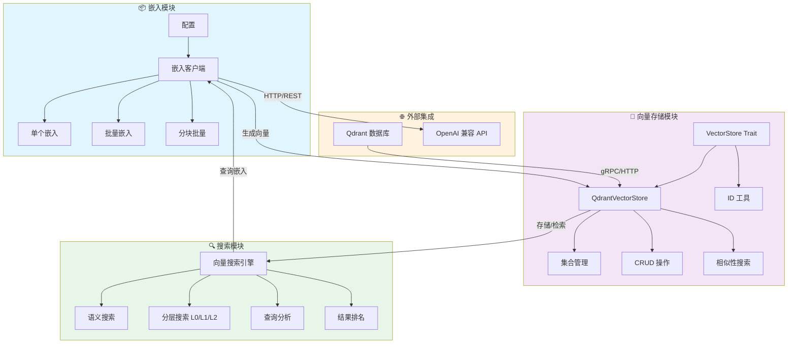
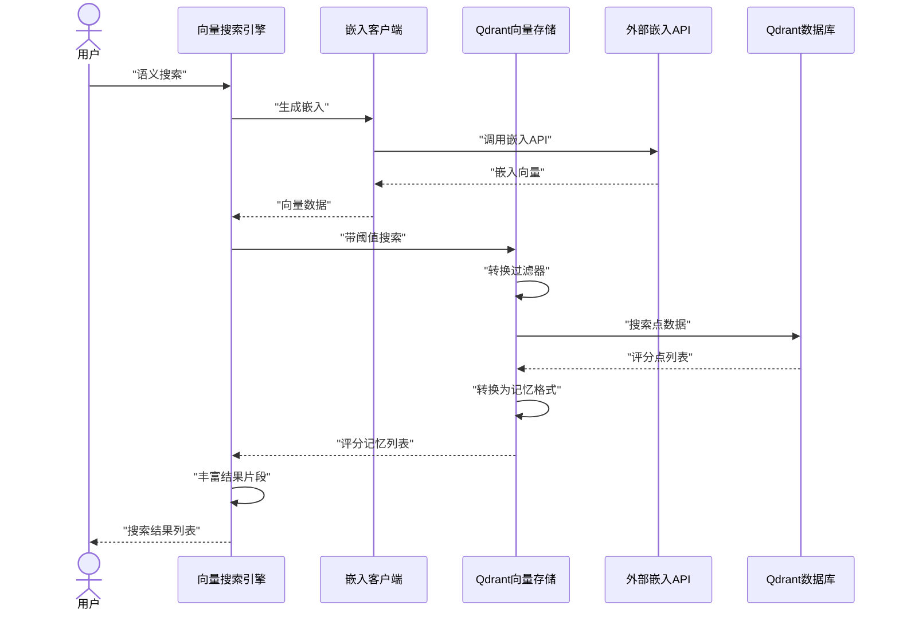
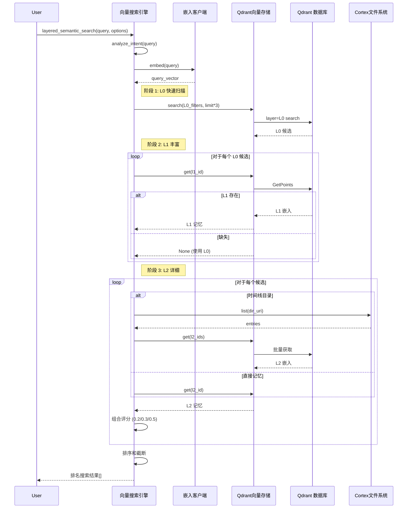
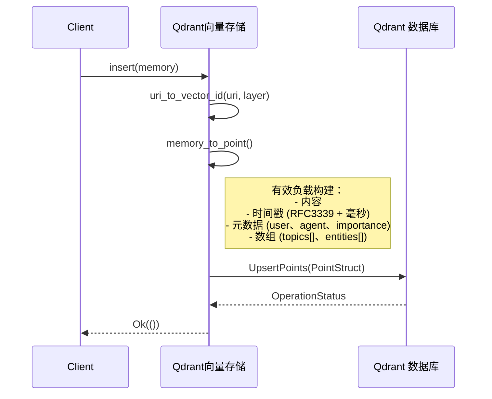

**技术文档：向量搜索领域**

**Cortex-Mem 系统**  
*生成时间：2026-02-17 16:37:31 (UTC)*

---

## 1. 概述

向量搜索领域构成了 Cortex-Mem 记忆管理系统的语义智能层。它使 AI 代理能够通过在高维向量空间中进行相似性搜索来超越基于关键词的检索，从而在持久化记忆存储上实现语义相关检索。该领域将外部 AI 推理服务与结构化存储基础设施连接起来，为上下文感知的记忆检索提供基础。

**核心价值主张：**  
将非结构化文本记忆转换为数学上可比较的向量表示，实现语义相关性匹配，理解概念相似性而非词汇重叠。

---

## 2. 架构概述

该领域实现了**三模块管道架构**，将关注点分离到嵌入生成、向量持久化和智能检索策略中。



### 2.1 设计原则

- **可插拔存储后端**：基于 Trait 的抽象（`VectorStore`）支持在域逻辑不变的情况下在向量数据库之间迁移（Qdrant、Pinecone、Weaviate）
- **分层索引策略**：L0/L1/L2 层架构以存储冗余换取查询性能
- **确定性可寻址性**：内容衍生的 UUID 生成确保幂等的存储操作
- **异步优先 I/O**：使用 Tokio 的完整 async/await 实现，用于并发嵌入生成和向量操作

---

## 3. 核心组件

### 3.1 嵌入客户端 (`embedding/client.rs`)

嵌入客户端通过外部 OpenAI 兼容 API 管理文本到向量的转换，实现生产就绪的弹性模式。

**关键能力：**
- **自适应批处理**：可配置的批量大小（默认：10），自动分块处理大型数据集
- **维度自动检测**：运行时从 API 响应探测嵌入维度
- **连接弹性**：可配置超时（默认：30s），带 Bearer 令牌认证

**配置接口：**
```rust
pub struct EmbeddingConfig {
    pub api_base_url: String,      // EMBEDDING_API_BASE_URL
    pub api_key: String,           // EMBEDDING_API_KEY / LLM_API_KEY
    pub model: String,             // text-embedding-3-small (默认)
    pub batch_size: usize,         // 10 (默认)
    pub timeout_secs: u64,         // 30 (默认)
}
```

**公共 API 表面：**
- `embed(&self, text: &str) -> Result<Vec<f32>>`：单个文本嵌入，约 100-500ms 延迟
- `embed_batch(&self, texts: &[String]) -> Result<Vec<Vec<f32>>>`：优化批处理，减少 API 开销
- `embed_batch_chunked(&self, texts: &[String]) -> Result<Vec<Vec<f32>>>`：尊重批量限制的内存高效处理

**技术实现：**
- 由 `reqwest` 驱动的 HTTP 客户端，通过 `serde` 进行 JSON 序列化
- 用于瞬态网络故障的自动重试逻辑
- 支持 Azure OpenAI、本地推理服务器（Ollama、llama.cpp）和云提供商（Cohere、Voyage AI）

### 3.2 向量存储 (`vector_store/`)

#### 3.2.1 Trait 抽象 (`vector_store/mod.rs`)

使用 `async_trait` 为异步 trait 对象定义向量存储后端的契约：

```rust
#[async_trait]
pub trait VectorStore: DynClone {
    async fn insert(&self, memory: &Memory) -> Result<()>;
    async fn search(&self, query_vector: &[f32], filters: &Filters, limit: usize) -> Result<Vec<ScoredMemory>>;
    async fn search_with_threshold(&self, query_vector: &[f32], filters: &Filters, limit: usize, score_threshold: Option<f32>) -> Result<Vec<ScoredMemory>>;
    async fn update(&self, memory: &Memory) -> Result<()>;
    async fn delete(&self, id: &str) -> Result<()>;
    async fn health_check(&self) -> Result<bool>;
}
```

#### 3.2.2 Qdrant 实现 (`vector_store/qdrant.rs`)

**集合管理：**
- 自动配置具有可配置嵌入维度（默认：1536，用于 OpenAI 嵌入）的集合
- 用于语义相似性的余弦距离度量配置
- 运行时维度验证，防止向量维度不匹配

**确定性 ID 生成：**
实现用于内容可寻址存储的双哈希策略：
```rust
pub fn uri_to_vector_id(uri: &str, layer: ContextLayer) -> String {
    // 双哈希（DefaultHasher 两次）生成类似 UUID 的标识符
    // 确保相同内容在重启后生成相同 ID
}
```

**数据转换管道：**
- **`memory_to_point()`**：将领域 `Memory` 结构体转换为带丰富有效负载元数据的 Qdrant `PointStruct`
- **`point_to_memory()`**：反向转换，从存储的有效负载中提取结构化元数据

**有效负载模式：**
```rust
// 与向量一起存储在 Qdrant 中
{
    "content": String,
    "created_at": RFC3339_timestamp,
    "created_at_ts": milliseconds,
    "metadata": {
        "uri": String,
        "user_id": String,
        "agent_id": String,
        "run_id": String,
        "role": String,
        "memory_type": String,
        "importance_score": f32,
        "entities": Vec<String>,
        "topics": Vec<String>,
        "custom_*": String  // 任意自定义元数据
    }
}
```

**高级过滤：**
将领域 `Filters` 转换为 Qdrant Filter protobufs，支持：
- **字符串匹配**：user_id、agent_id、run_id 的精确和前缀匹配
- **时间查询**：`created_at_ts` 和 `updated_at_ts` 的范围查询（毫秒精度）
- **分类过滤**：主题和实体的数组包含检查
- **数值范围**：重要性分数阈值
- **自定义元数据**：任意有效负载字段的关键词匹配

### 3.3 搜索引擎 (`search/vector_engine.rs`)

实现**三层检索架构**（L0/L1/L2），通过加权相关性评分实现渐进式上下文加载。

#### 3.3.1 层定义

| 层 | 内容类型 | 权重 | 目的 |
|-------|-------------|---------|---------|
| **L0** | 摘要（1-2 句） | 20% | 快速候选定位 |
| **L1** | 概述（结构化） | 30% | 深度探索 |
| **L2** | 完整消息内容 | 50% | 精确匹配 |

#### 3.3.2 分层搜索算法

**阶段 1：L0 摘要检索**
- 使用 `layer="L0"` 过滤和可选 URI 前缀范围查询 Qdrant
- 检索 top-K 候选（通常 limit × 3，用于级联）
- 使用高级语义摘要进行快速过滤

**阶段 2：L1 概述丰富**
- 对于每个 L0 候选，提取目录 URI
- 通过 `get()` 操作检索相应的 L1 嵌入
- 计算查询与 L1 向量之间的余弦相似性
- 如果 L1 层缺失则回退到 L0 分数

**阶段 3：L2 详细匹配**
- 时间线目录：列出目录条目，检索单个 L2 嵌入
- 用户/代理记忆：直接 L2 检索，带文件系统回退
- 计算组合分数：`0.2×L0 + 0.3×L1 + 0.5×L2`

**相似性计算：**
```rust
fn cosine_similarity(a: &[f32], b: &[f32]) -> f32 {
    dot_product(a, b) / (magnitude(a) * magnitude(b))
}
```

#### 3.3.3 查询意图分析

**基于模式的检测：**
- **时间性**：关键词（when、recent、latest、yesterday）触发时间加权评分
- **事实性**：模式（what is、who is、how to）启用事实提取优化
- **关系性**：比较（vs、compared to、difference between）激活实体链接

**可选 LLM 重写：**
当注入 `LLMClient` 时，通过基于提示的意图澄清执行查询扩展以提高检索准确性。

---

## 4. 数据流和交互

### 4.1 标准语义搜索流程



### 4.2 分层语义搜索流程



### 4.3 记忆存储流程



---

## 5. 配置和部署

### 5.1 环境配置

**嵌入服务：**
```bash
# 必需
EMBEDDING_API_KEY="sk-..."
EMBEDDING_API_BASE_URL="https://api.openai.com/v1"

# 可选
EMBEDDING_MODEL="text-embedding-3-small"  # 默认：1536 维
EMBEDDING_BATCH_SIZE="10"
EMBEDDING_TIMEOUT_SECS="30"
```

**向量存储（Qdrant）：**
```toml
[qdrant]
url = "http://localhost:6334"
collection_name = "cortex_memories"
embedding_dim = 1536  # 如果指定则自动创建集合
```

### 5.2 部署拓扑

**开发模式：**
```rust
// 进程内 Qdrant (Docker) + 本地文件系统
VectorSearchEngine::new(
    Arc::new(QdrantVectorStore::new(&config).await?),
    Arc::new(EmbeddingClient::new(embedding_config)?),
    Arc::new(CortexFilesystem::new(data_dir)?),
)
```

**生产模式：**
- 带复制的外部 Qdrant 集群
- 负载均衡的专用嵌入服务端点
- 通过 `Arc<>` 共享所有权跨搜索引擎实例的连接池

---

## 6. 性能特性

### 6.1 延迟配置文件

| 操作 | 延迟 | 备注 |
|-----------|---------|-------|
| 单个嵌入 | 100-500ms | 网络依赖，API 提供商延迟 |
| 批量嵌入 (10) | 150-600ms | 相比单个 6-10× 吞吐量提升 |
| 向量存储 (Upsert) | 10-50ms | 异步，网络 I/O 绑定 |
| L0 搜索 | 50-150ms | Qdrant 中 HNSW 索引查询 |
| 分层搜索 | 500ms-2s | N 个 L1 查找 + M 个 L2 检索 |

### 6.2 吞吐量优化

**批处理：**
- 嵌入客户端自动分块大数据集，遵守 `batch_size`
- 减少批量索引操作的 HTTP 开销

**并发操作：**
- 分层搜索使用 Tokio `join!` 宏对时间线目录进行并发 L2 查找
- 异步 trait 实现支持并行向量数据库查询

### 6.3 内存效率

- **流式处理**：用于大型集合增量索引的基于滚动 ID 分页（`scroll_ids`）
- **延迟加载**：L2 内容仅在向量索引过期时按需从文件系统加载
- **Arc 共享**：搜索引擎通过原子引用计数共享 Qdrant 和嵌入客户端

---

## 7. 集成模式

### 7.1 领域集成

**记忆管理领域：**
```rust
// 记忆操作协调嵌入生成和存储
pub async fn store_memory(&self, content: &str, metadata: Metadata) -> Result<Memory> {
    let embedding = self.embedding_client.embed(content).await?;
    let memory = Memory::new(content, embedding, metadata);
    self.vector_store.insert(&memory).await?;
    self.filesystem.write(&memory.uri(), content).await?;
    Ok(memory)
}
```

**过滤转换：**
领域特定的 `Filters` 结构体映射到 Qdrant 的 protobuf Filter 格式：
- `created_after/before` → 毫秒时间戳上的 `RangeCondition`
- `topics[]` → 带 `should` 子句的数组包含 `Match` 条件
- `custom: HashMap` → 动态 `FieldCondition` 构建

### 7.2 扩展点

**自定义 VectorStore 后端：**
```rust
pub struct PineconeVectorStore { ... }

#[async_trait]
impl VectorStore for PineconeVectorStore {
    async fn search(&self, vector: &[f32], filters: &Filters, limit: usize) -> Result<Vec<ScoredMemory>> {
        // Pinecone 特定实现
    }
}
```

**本地模型支持：**
通过修改 HTTP 客户端配置使用本地 base URL（`http://localhost:11434/v1`），扩展 `EmbeddingClient` 以支持 Ollama 端点。

---

## 8. 安全和多租户

**租户隔离：**
- URI 前缀过滤（`SearchOptions` 中的 `root_uri`）将搜索范围限定到用户/代理特定子树
- `user_id` 和 `agent_id` 字段上的元数据过滤在数据库级别强制访问控制
- 正确应用过滤时无跨租户向量泄漏

**数据隐私：**
- 嵌入内容发送到外部 API（OpenAI）进行向量化
- 向量表示存储在自托管 Qdrant（无第三方向量数据库暴露）
- 原始内容保留在本地文件系统；只有向量和元数据传输到 Qdrant

---

## 9. 故障排除和可观察性

**健康检查：**
```rust
// 验证 Qdrant 连接
let healthy = vector_store.health_check().await?;
```

**日志：**
通过 `trac` crate 进行结构化日志：
- **INFO**：搜索查询、嵌入生成批量
- **DEBUG**：过滤转换、ID 生成
- **WARN**：层回退事件（L1/L2 缺失）
- **ERROR**：API 超时、维度不匹配

**常见问题：**
1. **维度不匹配**：确保 `EMBEDDING_MODEL` 维度与 Qdrant 集合配置匹配
2. **超时错误**：为慢嵌入 API 增加 `timeout_secs` 或减少 `batch_size`
3. **空结果**：检查 `score_threshold`（默认 0.5）可能对特定领域太高

---

## 10. 结论

向量搜索领域通过嵌入生成、向量持久化和智能搜索编排的清晰分离，为 Cortex-Mem 提供了企业级语义检索能力。其三层架构（L0/L1/L2）支持在大型记忆语料库上实现亚秒级检索，同时通过加权评分算法保持精度。

基于 trait 的设计确保了供应商独立性，允许在向量数据库或嵌入提供商之间迁移，而无需修改领域逻辑。完整的异步实现和批处理优化支持需要实时记忆增强的高吞吐量 AI 代理工作负载。

**实施后续步骤：**
1. 配置 Qdrant 连接参数和嵌入 API 凭据
2. 为选择的嵌入模型初始化具有适当维度的集合
3. 为多用户部署实施租户隔离过滤器
4. 监控 L0→L1→L2 命中率以优化层缓存策略
