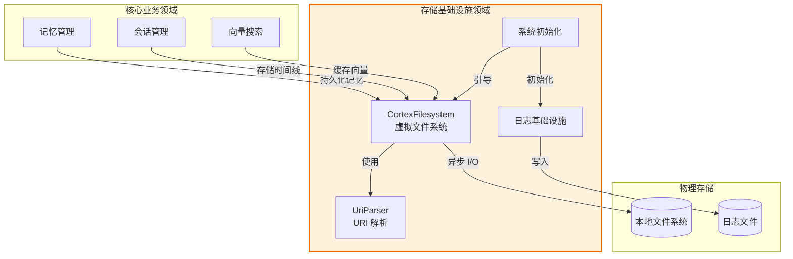
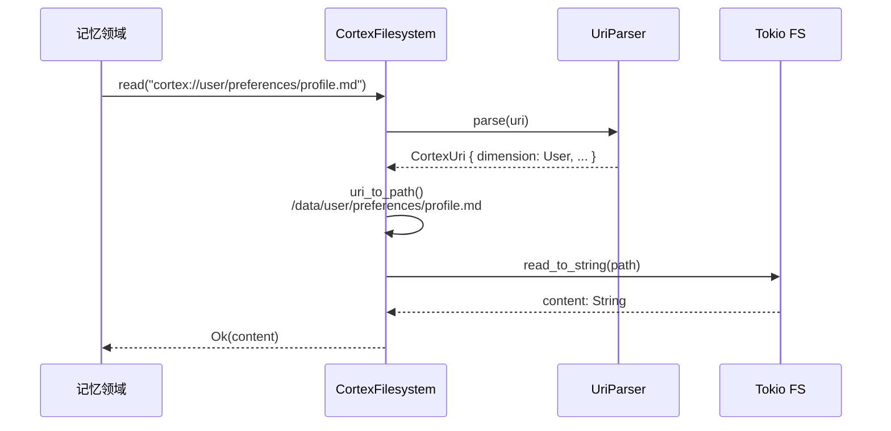
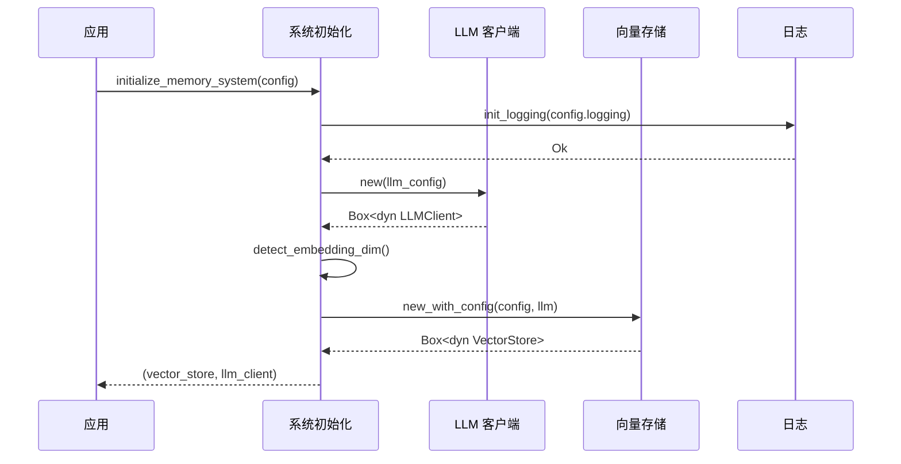

**存储基础设施领域技术文档**

**版本**：1.0  
**最后更新**：2024  
**组件**：`cortex-mem-core` 基础设施层  

---

## 1. 执行摘要

**存储基础设施领域**为 Cortex-Mem 系统提供基础持久化层，实现虚拟文件系统抽象，支持记忆工件的可移植、版本控制友好的存储。该领域提供跨平台文件 I/O 操作、多租户数据隔离、系统初始化编排和全面的日志基础设施。

关键能力包括：
- **虚拟文件系统网关**：通过 `cortex://` 方案进行基于 URI 的资源寻址
- **多租户隔离**：可选的租户范围目录分离
- **异步 I/O 操作**：由 Tokio 驱动的非阻塞文件系统操作
- **基于维度的组织**：跨用户、代理、会话和资源维度的结构化存储
- **安全路径解析**：防止目录遍历攻击的保护
- **系统引导**：用于 LLM 客户端和向量存储的依赖注入初始化

---

## 2. 架构概述

存储基础设施领域实现**分层抽象模式**，将逻辑资源寻址与物理存储机制分离。架构遵循依赖规则，基础设施关注点依赖配置工具，同时向核心业务领域公开干净的 trait 接口。



### 2.1 设计原则

- **可移植性**：抽象文件系统接口支持测试和平台独立性
- **安全性**：URI 验证防止路径遍历；租户隔离确保数据隔离
- **性能**：Async/await 模式防止 Tokio 运行时中的 I/O 阻塞
- **可观察性**：结构化日志，带可配置详细程度级别

---

## 3. 核心组件

### 3.1 虚拟文件系统层（`CortexFilesystem`）

`CortexFilesystem` 结构体实现 `FilesystemOperations` trait，提供记忆内容的异步 CRUD 操作。支持双操作模式：

**多租户模式**：  
路径结构：`{root}/tenants/{tenant_id}/{dimension}/{category}/{resource}`  
*用例*：需要严格用户数据隔离的 SaaS 部署

**单租户模式**：  
路径结构：`{root}/{dimension}/{category}/{resource}`  
*用例*：个人部署或单用户环境

#### 关键操作

| 操作 | 描述 | 异步原语 |
|-----------|---------------|-----------------|
| `read` | 以 UTF-8 字符串检索文件内容 | `tokio::fs::read_to_string` |
| `write` | 原子写入内容，带父目录创建 | `tokio::fs::write` + `create_dir_all` |
| `delete` | 递归删除文件或目录 | `tokio::fs::remove_file` / `remove_dir_all` |
| `list` | 返回带元数据过滤的目录条目 | `tokio::fs::read_dir` |
| `exists` | 检查资源可用性 | `tokio::fs::try_exists` |
| `metadata` | 检索文件时间戳和大小 | `tokio::fs::metadata` |

#### Trait 接口

```rust
#[async_trait]
pub trait FilesystemOperations: Send + Sync {
    async fn list(&self, uri: &str) -> Result<Vec<FileEntry>>;
    async fn read(&self, uri: &str) -> Result<String>;
    async fn write(&self, uri: &str, content: &str) -> Result<()>;
    async fn delete(&self, uri: &str) -> Result<()>;
    async fn exists(&self, uri: &str) -> Result<bool>;
    async fn metadata(&self, uri: &str) -> Result<FileMetadata>;
}
```

*注意*：`async_trait` 宏通过 desugaring 到 boxed futures 在 trait 中启用异步方法。

### 3.2 URI 解析系统（`UriParser`）

`cortex://` URI 方案为记忆工件提供语义寻址，将逻辑资源标识与物理存储位置解耦。

#### URI 模式规范

```
cortex://{dimension}/{category}/{subcategory}/{resource}?{params}
```

**组件：**
- **维度**：命名空间隔离（`user`、`agent`、`session`、`resources`）
- **类别**：内容分类（例如 `preferences`、`entities`、`timeline`）
- **子类别**：可选的层次分组
- **资源**：特定工件标识符（文件名或 UUID）
- **参数**：元数据提示的查询字符串

#### 工厂方法

解析器为常见资源类型提供语义构造函数：

```rust
// 用户偏好档案
CortexUri::user_preferences("profile")

// 代理案例存储
CortexUri::agent_cases("case-123")

// 会话时间线条目
CortexUri::session("session-uuid").with_timeline_entry("001")
```

#### 路径解析算法

1. **方案验证**：验证 URI 以 `cortex://` 开头
2. **分段**：按 `/` 分隔符拆分路径
3. **维度提取**：将第一段映射到 `Dimension` 枚举
4. **租户解析**：如果启用多租户模式则前置租户前缀
5. **平台适配**：将 URI 分隔符转换为 OS 特定路径分隔符
6. **扩展名处理**：保留或追加文件扩展名（`.md`、`.json`）

### 3.3 系统初始化（`init/mod.rs`）

初始化模块使用依赖注入模式编排系统引导，返回 boxed trait 对象以实现松散耦合。

#### 初始化流程

```rust
pub async fn initialize_memory_system(
    qdrant_config: &QdrantConfig,
    llm_config: LLMConfig,
) -> Result<(Box<dyn VectorStore>, Box<dyn LLMClient>)>
```

**流程：**
1. 使用提供的配置实例化 LLM 客户端
2. 使用回退级联自动检测嵌入维度：
   - 检查 `QdrantConfig.embedding_dim`（显式配置）
   - 检查环境变量 `EMBEDDING_DIM`
   - 默认为 1536（针对 text-embedding-3-small 优化）
3. 使用 LLM 客户端引用初始化向量存储
4. 返回用于动态分派的 boxed trait 对象元组

### 3.4 日志基础设施（`logging.rs`）

使用 `tracing` 生态系统实现基于文件的结构化日志。

#### 配置选项

| 参数 | 类型 | 描述 |
|-----------|------|-------------|
| `enabled` | bool | 日志总开关 |
| `level` | String | 过滤级别：`error`、`warn`、`info`、`debug`、`trace` |
| `log_directory` | Path | 日志文件目标目录 |

#### 实现细节

- **文件命名**：`cortex-memo-{YYYY-MM-DD-HH-MM-SS}.log`（带时间戳以支持轮转）
- **输出**：仅文件（通过 Mutex 包装的写入器避免控制台污染）
- **格式化**：带目标模块和跨度上下文的事件结构化
- **初始化**：使用 `tracing_subscriber::registry()` 的全局注册模式

---

## 4. 基于维度的组织

系统跨四个主要维度组织存储，实现 OpenViking 风格的层次结构：

### 4.1 目录结构

```
{cortex_root}/
├── tenants/                    # 可选多租户隔离
│   └── {tenant_id}/
│       ├── user/
│       │   ├── preferences/    # 用户特定设置
│       │   ├── entities/       # 已知实体/人
│       │   └── events/        # 用户相关事件
│       ├── agent/
│       │   ├── cases/          # 代理推理案例
│       │   └── skills/         # 代理能力
│       ├── session/
│       │   └── timeline/       # 对话历史
│       └── resources/          # 系统资源
└── {dimension}/                # 非租户布局（相同结构）
```

### 4.2 内容存储策略

- **Markdown 格式**：人类可读内容存储（`.md`）支持版本控制
- **JSON 元数据**：与内容文件一起的结构化元数据
- **层缓存**：生成的 L0/L1 抽象缓存在 `layers/` 子目录

---

## 5. 安全注意事项

### 5.1 路径遍历保护

URI 解析器验证所有路径组件以防止 `../` 序列和绝对路径注入：

```rust
// 拒绝的模式
cortex://user/../../../etc/passwd
cortex://user/preferences//absolute/path
```

**缓解**：严格解析正则表达式仅允许字母数字、连字符、下划线和正斜杠字符在路径段中。

### 5.2 租户隔离

启用多租户模式时：
- 每个租户收到专用子目录
- URI 解析强制租户前缀
- 跨租户访问需要显式租户上下文切换

### 5.3 异步安全

所有文件系统操作使用 `tokio::fs` 以防止磁盘 I/O 期间阻塞异步运行时，确保系统在并发负载下保持响应。

---

## 6. 集成模式

### 6.1 核心领域使用

**记忆管理领域**：  
使用 `FilesystemOperations.write()` 在向量数据库存储后持久化记忆内容，确保双写一致性（文件系统 + 向量）。

**会话管理领域**：  
通过 `write()` 追加对话消息到 `cortex://session/{id}/timeline/` 中的时间线文件，使用原子追加以实现并发安全。

**向量搜索领域**：  
在文件系统缓存嵌入向量和元数据以供离线分析，使用 `read()` 进行层检索。

### 6.2 错误处理

所有操作返回带丰富上下文错误消息的 `anyhow::Result` 类型：

```rust
// 错误链示例
fs.read("cortex://user/preferences/profile.md")
    .await
    .context("Failed to load user preferences")?
```

常见错误类型：
- `InvalidUriError`：格式错误的 cortex:// 方案
- `IoError`：底层文件系统故障
- `NotFoundError`：资源不存在

---

## 7. 配置

该领域依赖 `cortex-mem-config` 获取运行时参数：

```toml
[storage]
data_directory = "/var/lib/cortex-mem"
multi_tenant = false
default_tenant = "default"

[logging]
enabled = true
level = "info"
log_directory = "/var/log/cortex-mem"
```

**环境变量：**
- `CORTEX_MEM_DATA_DIR`：覆盖数据目录路径
- `EMBEDDING_DIM`：覆盖自动检测的嵌入维度
- `RUST_LOG`：标准跟踪过滤器（如果配置文件未指定则回退）

---

## 8. 性能特性

| 指标 | 值 | 备注 |
|--------|-------|-------|
| **并发操作** | 无限（操作系统允许） | Tokio 每操作任务模型 |
| **读取延迟** | ~1-5ms (SSD) | 取决于文件大小 |
| **写入延迟** | ~2-10ms (SSD) | 包括父目录创建 |
| **目录列表** | O(n)，其中 n = 条目 | 无索引；线性扫描 |
| **内存占用** | 最小 | 通过 `PathBuf` 的零拷贝路径操作 |

**优化建议：**
- 高吞吐量场景使用 SSD 存储
- 为频繁访问的维度启用 OS 级目录缓存
- 热路径中为 `metadata()` 调用实施应用级缓存

---

## 9. 附录：序列图

### 9.1 文件读取操作



### 9.2 系统初始化



---

## 10. API 参考

### 10.1 公共导出

来自 `cortex-mem-core/src/filesystem/mod.rs`：

```rust
pub use uri::{CortexUri, UriParser};
pub use operations::{CortexFilesystem, FilesystemOperations, FileEntry, FileMetadata};
```

来自 `cortex-mem-core/src/init/mod.rs`：

```rust
pub async fn initialize_memory_system(
    qdrant_config: &QdrantConfig,
    llm_config: LLMConfig,
) -> Result<(Box<dyn VectorStore>, Box<dyn LLMClient>)>;

pub async fn create_auto_config(
    base_config: &QdrantConfig,
    llm_client: &dyn LLMClient,
) -> Result<QdrantConfig>;
```

来自 `cortex-mem-core/src/logging.rs`：

```rust
pub fn init_logging(config: &cortex_mem_config::LoggingConfig) -> Result<()>;
```

---

**文档结束**
