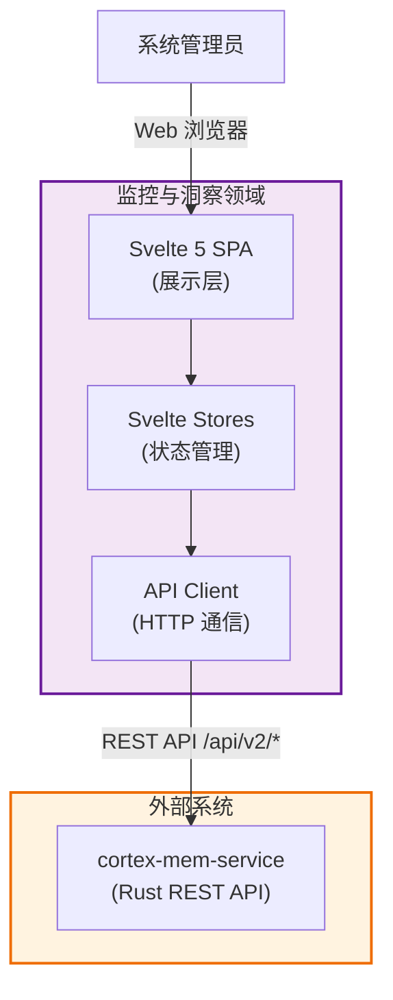
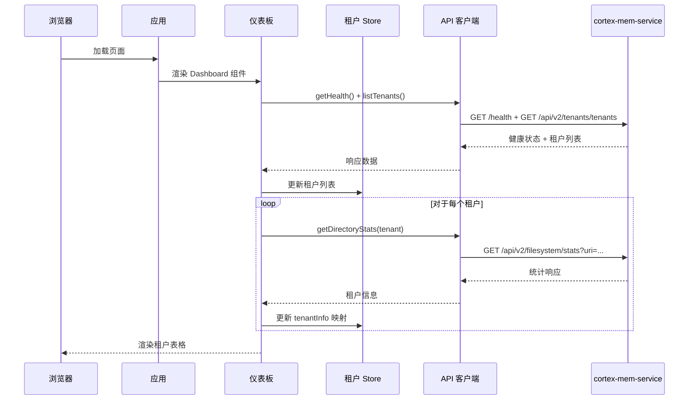

# Cortex-Mem 技术文档：监控和洞察领域

**生成时间：** 2026-02-18  
**文档版本：** 2.0  
**领域：** 监控和洞察（`cortex-mem-insights`）

---

## 1. 概述

**监控和洞察领域**为 Cortex-Mem 生态系统提供可观察性和管理界面。该领域使用 Svelte 5 实现为纯前端单页应用（SPA），提供用于监控记忆操作、浏览记忆文件和在 Cortex-Mem 服务中执行语义搜索的 Web 仪表板。

该领域位于 Cortex-Mem 架构的应用层，作为系统管理员和 AI Agent 开发者的主要人机界面，提供租户管理、记忆存储统计和文件浏览的可视化功能，同时保持展示层与核心业务逻辑的严格分离。

---

## 2. 架构概览

### 2.1 领域定位

监控和洞察领域作为**纯前端应用**运行，直接与 `cortex-mem-service` REST API 通信。与传统的前端后端（BFF）模式不同，此实现将所有数据操作委托给后端服务，保持前端轻量且易于维护。



### 2.2 架构合规性

**依赖方向：** 该领域严格遵循整洁架构原则：
- **展示层**（`pages/`、`components/`）依赖状态管理
- **状态管理**（`stores/`）依赖 API 客户端
- **API 客户端**（`api.ts`）通过 HTTP 依赖外部服务

**技术栈：**
- **前端框架：** Svelte 5.19.0，使用 Runes 语法（`$state`、`$effect`、`$derived`）
- **构建工具：** Vite 6.1.0
- **语言：** TypeScript 5.7.3
- **路由：** 客户端手动路由（非 SvelteKit 文件系统路由）
- **样式：** CSS 与 CSS 变量实现主题

---

## 3. 组件架构

### 3.1 应用结构

```
cortex-mem-insights/src/
├── App.svelte              # 主应用入口，包含客户端路由
├── main.ts                 # TypeScript 入口点
├── app.css                 # 全局样式与 CSS 变量
├── lib/
│   ├── api.ts              # cortex-mem-service 的 API 客户端
│   ├── types.ts            # TypeScript 类型定义
│   ├── components/
│   │   └── TenantSelector.svelte  # 租户选择组件
│   ├── pages/
│   │   ├── Dashboard.svelte       # 租户概览仪表板
│   │   ├── Memories.svelte        # 记忆文件浏览器
│   │   └── Search.svelte          # 语义搜索界面
│   └── stores/
│       └── tenant.ts              # 租户状态管理
└── routes/                 # 未使用（无 SvelteKit 路由）
```

### 3.2 客户端路由

应用在 `App.svelte` 中实现手动客户端路由：

```typescript
let currentPath = $state(window.location.pathname);

function navigate(path: string) {
  window.history.pushState({}, '', path);
  currentPath = path;
}

// 基于 currentPath 渲染页面
{#if currentPath === '/'}
  <Dashboard />
{:else if currentPath.startsWith('/memories')}
  <Memories />
{:else if currentPath.startsWith('/search')}
  <Search />
{/if}
```

**可用路由：**
| 路由 | 组件 | 描述 |
|-------|------|------|
| `/` | Dashboard | 租户概览、系统状态、存储统计 |
| `/memories` | Memories | cortex:// URI 文件浏览器 |
| `/search` | Search | 记忆内容的语义搜索 |

### 3.3 API 客户端层

`ApiClient` 类（`src/lib/api.ts`）封装所有与后端的 HTTP 通信：

**功能：**
- **健康检查：** `getHealth()` - 服务状态和 LLM 可用性
- **租户操作：** `listTenants()`、`switchTenant(tenantId)`
- **文件系统操作：** `listDirectory(uri)`、`readFile(path)`、`writeFile(path, content)`、`getDirectoryStats(uri)`
- **会话操作：** `getSessions()` - 列出所有会话
- **搜索操作：** `search(keyword, scope, limit)` - 带过滤器的语义搜索

**响应处理：**
```typescript
interface ApiResponse<T> {
  success: boolean;
  data: T | null;
  error: string | null;
  timestamp: string;
}
```

### 3.4 状态管理

该领域使用 Svelte 5 的响应式 store 进行状态管理：

**租户 Store**（`stores/tenant.ts`）：
```typescript
// 可写 store
export const tenants = writable<string[]>([]);
export const currentTenant = writable<string | null>(null);
export const tenantInfo = writable<Map<string, TenantInfo>>(new Map());

// 派生 store 和操作
export async function initTenants() { ... }
export async function switchTenant(tenantId: string) { ... }
export async function loadTenantInfo(tenant: string) { ... }
```

### 3.5 类型定义

**核心类型**（`lib/types.ts`）：
```typescript
interface HealthStatus {
  status: string;
  service: string;
  version: string;
  llm_available: boolean;
}

interface FileEntryResponse {
  uri: string;
  name: string;
  is_directory: boolean;
  size: number;
  modified: string;
}

interface SearchResult {
  uri: string;
  score: number;
  snippet: string;
  content?: string;
  source: string;
}
```

---

## 4. 数据流和工作流

### 4.1 应用初始化



### 4.2 租户切换

1. **用户操作：** 点击租户行的"选择"按钮
2. **状态更新：** 调用租户 store 中的 `switchTenant(tenantId)`
3. **API 调用：** `POST /api/v2/tenants/tenants/switch`，携带 `{ tenant_id: string }`
4. **响应：** 后端更新活动租户上下文
5. **UI 更新：** 当前租户高亮显示，数据刷新

### 4.3 文件浏览工作流

1. **导航：** 用户导航到 `/memories`
2. **加载：** 组件通过 `listDirectory(uri)` 获取目录列表
3. **显示：** 文件条目在表格中渲染，带有文件/文件夹图标
4. **钻取：** 点击目录更新当前 URI
5. **读取：** 点击文件通过 `readFile(path)` 获取内容

### 4.4 语义搜索工作流

1. **输入：** 用户在搜索页面输入搜索查询
2. **范围选择：** 选择搜索范围（全部、用户、系统）
3. **API 调用：** `POST /api/v2/search`，携带查询和过滤器
4. **结果：** 搜索结果显示相关分数和摘要
5. **钻取：** 点击结果查看完整内容

---

## 5. API 集成

前端与以下 `cortex-mem-service` 端点集成：

### 5.1 健康检查端点

| 方法 | 端点 | 描述 |
|------|------|------|
| GET | `/health` | 服务健康检查，含 LLM 状态 |

### 5.2 租户端点

| 方法 | 端点 | 描述 |
|------|------|------|
| GET | `/api/v2/tenants/tenants` | 列出所有可用租户 |
| POST | `/api/v2/tenants/tenants/switch` | 切换活动租户 |

### 5.3 文件系统端点

| 方法 | 端点 | 描述 |
|------|------|------|
| GET | `/api/v2/filesystem/list?uri=` | 列出目录内容 |
| GET | `/api/v2/filesystem/read/*path` | 读取文件内容 |
| POST | `/api/v2/filesystem/write` | 写入文件内容 |
| GET | `/api/v2/filesystem/stats?uri=` | 获取目录统计 |

### 5.4 会话端点

| 方法 | 端点 | 描述 |
|------|------|------|
| GET | `/api/v2/sessions` | 列出所有会话 |

### 5.5 搜索端点

| 方法 | 端点 | 描述 |
|------|------|------|
| POST | `/api/v2/search` | 语义搜索 |

---

## 6. 实现细节

### 6.1 错误处理策略

该领域在多个层级实现错误处理：

1. **API 层：** HTTP 错误被捕获并以描述性消息抛出
2. **组件层：** 错误在状态中捕获并显示给用户
3. **降级：** 使用加载状态和错误消息实现优雅降级

```typescript
try {
  const data = await apiClient.listDirectory(uri);
  // 处理数据
} catch (e) {
  error = e instanceof Error ? e.message : 'Failed to load data';
} finally {
  loading = false;
}
```

### 6.2 性能优化

- **并发请求：** 对独立 API 调用使用 `Promise.all()`（健康检查 + 租户列表）
- **顺序加载：** 租户信息按顺序加载以避免竞态条件
- **延迟加载：** 数据仅在组件挂载或用户操作时获取
- **防抖：** 搜索输入使用防抖以防止过多 API 调用

### 6.3 样式架构

- **CSS 变量：** 通过 CSS 自定义属性实现一致的主题
- **组件作用域样式：** Svelte 组件内的 `<style>` 块
- **响应式设计：** 使用 Flexbox 和 Grid 布局实现响应式 UI

**关键 CSS 变量：**
```css
:root {
  --bg-card: #ffffff;
  --bg-hover: #f3f4f6;
  --border: #e5e7eb;
  --text-primary: #111827;
  --text-secondary: #6b7280;
  --primary: #3b82f6;
}
```

---

## 7. 配置和部署

### 7.1 环境配置

**构建配置**（`vite.config.ts`）：
- 开发服务器代理 API 请求
- 生产构建输出到 `dist/`

**运行时配置：**
- API 基础 URL：`/api/v2`（可在 `api.ts` 中配置）

### 7.2 部署拓扑

**开发模式：**
```
[Vite 开发服务器 :5173] ←→ [cortex-mem-service :8085] ←→ [文件系统 + Qdrant]
         ↓ (代理 /api/v2/*)
[Svelte SPA with HMR]
```

**生产模式：**
```
[反向代理 (Nginx/Traefik)]
    ├─→ [静态文件 (dist/)]
    └─→ [cortex-mem-service :8085]
```

### 7.3 构建流程

```bash
# 安装依赖
bun install

# 开发服务器
bun run dev

# 生产构建
bun run build

# 预览生产构建
bun run preview
```

---

## 8. 与之前架构的关键差异

本文档反映了与之前版本的重大架构变更：

| 之前架构 | 当前架构 |
|---------|---------|
| 使用 Elysia 服务器的 BFF（前端后端）模式 | 纯前端 SPA |
| SvelteKit 文件系统路由 | 手动客户端路由 |
| 5+ 页面路由（analytics、monitor、optimization） | 3 个核心页面（Dashboard、Memories、Search） |
| 复杂的优化和系统监控 API | 专注于租户管理和文件浏览 |
| WebSocket/SSE 实时更新 | 仅 REST API |
| 国际化（EN/ZH/JA） | 无 i18n 支持 |
| 24+ TypeScript 接口 | 5 个核心接口 |

---

## 9. 未来考虑

基于当前架构，可以考虑以下增强功能：

1. **SvelteKit 迁移：** 采用 SvelteKit 实现文件系统路由和 SSR 能力
2. **实时更新：** WebSocket 集成实现实时租户统计
3. **国际化：** 为多语言用户添加 i18n 支持
4. **深色模式：** 增强主题，支持深色模式
5. **导出功能：** 添加导出记忆数据的能力

---

## 10. 结论

监控和洞察领域为 Cortex-Mem 生态系统提供了一个精简、可维护的 Web 界面。通过采用纯前端架构和直接 REST API 集成，该领域实现了简洁性和高性能，同时为系统管理员和开发者提供基本的监控和管理能力。

模块化的组件结构和响应式状态管理便于未来的增强和维护，展示层和后端数据操作之间有清晰的分离。
