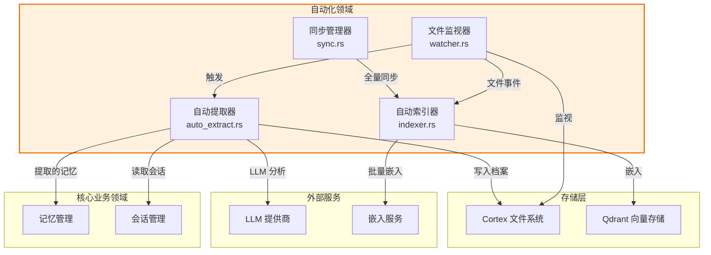
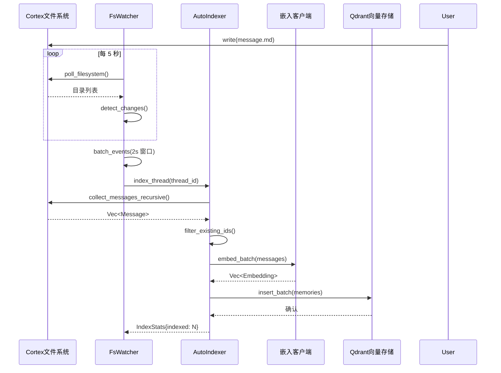
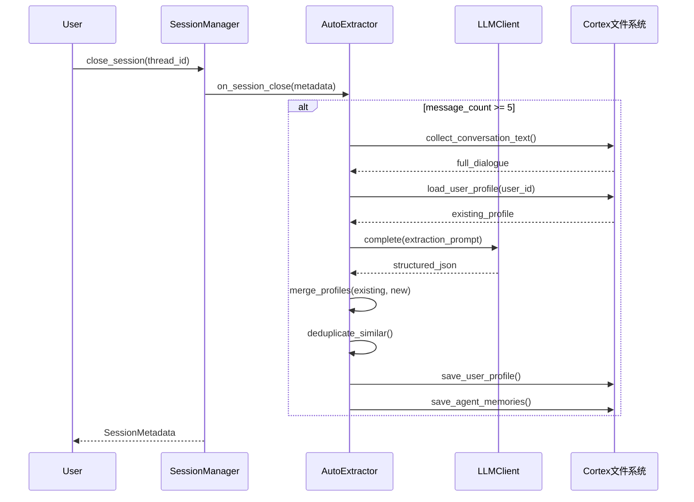
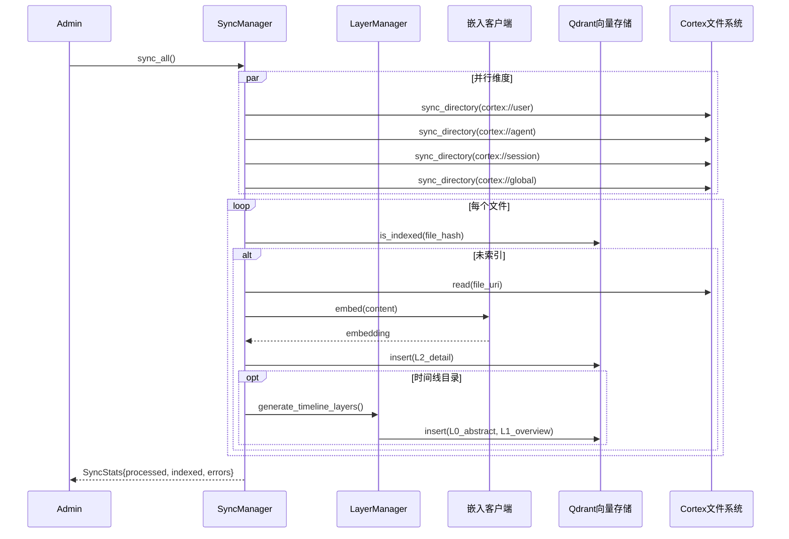

**自动化领域技术文档**

**生成时间**：2026-02-17 16:44:24 (UTC)

---

## 1. 概述

**自动化领域**是 Cortex-Mem 生态系统中的基础设施级组件，为自主记忆管理提供后台处理能力。作为事件驱动的异步处理层，该领域确保基于文件系统的持久化层与向量数据库（Qdrant）之间的一致性，同时通过 LLM 集成实现智能内容提取。

该领域实现**四子系统架构**，专为高吞吐量、容错的后台操作设计：

- **文件监视器与同步**（FsWatcher）：通过异步轮询监视文件系统变化
- **自动索引器**（AutoIndexer）：处理带去重的批量记忆嵌入处理
- **同步管理器**（SyncManager）：编排跨所有记忆维度的分层（L0/L1/L2）向量索引
- **自动提取器**（AutoExtractor）：对对话会话执行 LLM 驱动的结构化信息提取

### 1.1 领域位置



---

## 2. 架构设计

自动化领域采用**事件驱动架构（EDA）**结合**分层处理模式**。所有子系统使用 Tokio 运行时异步运行，通过无界 MPSC（多生产者单消费者）通道通信以确保非阻塞 I/O 操作。

### 2.1 核心设计原则

- **事件驱动响应性**：文件系统变化触发下游处理，无需人工干预
- **批处理**：时间窗口内（默认 2s）的事件聚合以优化嵌入 API 使用
- **幂等性**：去重机制防止冗余向量索引
- **分层抽象**：同步期间支持 L0（摘要）、L1（概述）和 L2（详细）层生成
- **故障隔离**：子系统独立运行；提取失败不会阻止索引

### 2.2 模块依赖

```rust
// 核心内部依赖
cortex-mem-core/src/automation/mod.rs          // 公共 API 导出
cortex-mem-core/src/automation/watcher.rs      // FsWatcher, FsEvent, WatcherConfig
cortex-mem-core/src/automation/indexer.rs      // AutoIndexer, IndexStats, IndexerConfig
cortex-mem-core/src/automation/sync.rs         // SyncManager, SyncConfig, SyncStats
cortex-mem-core/src/automation/auto_extract.rs // AutoExtractor, UserProfile, AutoExtractConfig
cortex-mem-core/src/config.rs                  // 配置结构
```

**外部依赖：**
- **CortexFilesystem**：虚拟文件系统抽象（cortex:// URI 方案）
- **QdrantVectorStore**：用于嵌入存储的向量数据库客户端
- **EmbeddingClient**：支持批处理的 OpenAI 兼容嵌入生成
- **LLMClient**：用于内容提取的 OpenAI 兼容补全 API
- **SessionManager**：对话生命周期管理钩子

---

## 3. 核心子系统

### 3.1 文件监视器子系统（FsWatcher）

文件监视器实现异步轮询机制以监视 cortex:// 虚拟文件系统的变化，具体跟踪会话时间线目录。

#### 关键组件

| 组件 | 职责 | 实现细节 |
|-----------|---------------|----------------------|
| FsWatcher | 主监视协调器 | 维护 HashMap 目录内容状态快照 |
| FsEvent | 事件枚举 | MessageAdded、MessageUpdated、ThreadDeleted |
| WatcherConfig | 行为调优 | 轮询间隔（默认 5s）、批量延迟（默认 2s）、递归深度 |

#### 技术实现

```rust
// 使用 Tokio 的异步运行时集成
tokio::select! {
    // 从文件系统扫描接收事件
    event = rx.recv() => { /* 排队等待批处理 */ }
    // 批量处理触发
    _ = batch_delay => { /* 刷新事件缓冲区 */ }
}

// 通过无界通道的事件分发
mpsc::UnboundedSender<FsEvent>
```

**处理逻辑：**
1. 递归扫描 cortex://session/{thread_id}/timeline 目录
2. 将当前状态与缓存快照比较以检测添加/修改
3. 在 2 秒窗口内批处理事件以减少冗余索引操作
4. 调度到 AutoIndexer 进行嵌入生成或会话关闭时到 AutoExtractor

### 3.2 自动索引器子系统（AutoIndexer）

处理将 Markdown 格式的会话消息转换为向量嵌入并存储到 Qdrant。实施复杂的去重和批量优化策略。

#### 核心方法

| 方法 | 目的 | 优化 |
|----------|---------|--------------|
| index_message() | 单条消息索引 | 立即嵌入生成 |
| index_thread_with_progress() | 批量线程索引 | 用于 UI 反馈的进度回调 |
| collect_messages_recursive() | 时间线遍历 | 递归 Markdown 解析 |
| embed_batch() | 向量生成 | 默认批量大小：10 项 |

#### 去重策略

索引前，系统使用 get_indexed_message_ids() 查询现有向量 ID 以过滤已处理内容，防止存储膨胀和搜索噪音。

**性能特性：**
- **吞吐量**：批量嵌入相比单独处理减少 10 倍 API 调用
- **并发**：异步 I/O 允许并行文件系统读取和嵌入生成
- **内存**：流式处理防止将整个线程加载到内存

### 3.3 同步管理器子系统（SyncManager）

实现**完整同步引擎**，确保文件系统状态与向量数据库索引之间的最终一致性。采用**三层索引策略**（L0/L1/L2）用于渐进式上下文加载。

#### 分层索引架构

| 层 | 内容类型 | 生成方法 | 用例 |
|----------|--------------|-------------------|----------|
| L2（详细） | 原始 Markdown 内容 | 直接文件读取 | 完整上下文检索 |
| L1（概述） | 结构化目录摘要 | LLM 摘要 | 快速导航 |
| L0（摘要） | 1-2 句压缩 | LLM 抽象 | 相关性过滤 |

#### 同步维度

sync_all() 操作处理四个不同的记忆范围：
1. **用户**：cortex://user/{id}/** - 用户档案和偏好
2. **代理**：cortex://agent/{id}/** - 代理配置和记忆
3. **线程**：cortex://session/{id}/** - 对话历史
4. **全局**：cortex://global/** - 共享知识库

**增量同步逻辑：**
- 通过 uri_to_vector_id() 计算内容哈希以检测修改
- 跳过未更改文件以最小化嵌入 API 成本
- 递归目录遍历，带可配置深度限制

### 3.4 自动提取器子系统（AutoExtractor）

提供**LLM 驱动的结构化信息提取**来自对话会话。激活于会话关闭时，分析对话以提取持久事实、偏好和实体。

#### 五维分类

提取信息分类为：
1. **PersonalInfo**：人口统计、标识符
2. **WorkHistory**：专业背景、项目
3. **Preferences**：喜欢、不喜欢、沟通风格
4. **Relationships**：实体之间的联系
5. **Goals**：目标、意图、即将发生的事件

#### 提取管道

1. collect_conversation_text() - 递归文本聚合
2. load_user_profile() - 检索现有档案
3. extract_user_info_structured() - LLM JSON 提取
4. filter_duplicate_info() - 最长公共子串分析
5. merge_user_profiles() - 重要性*置信度评分
6. limit_profile_size() - 每类别保留前 10
7. save_user_profile() - 持久化到 cortex://user/

**触发条件：**
- 通过 AutoSessionManager 包装器拦截会话关闭事件
- 最小消息阈值：5 条消息（通过 min_message_count 可配置）
- 提取异步进行以防止阻塞会话终止

---

## 4. 配置管理

自动化领域使用 cortex-mem-core/src/config.rs 中定义的强类型配置结构，并通过 cortex-mem-config 暴露。

### 4.1 配置模式

```rust
// 索引行为
pub struct IndexerConfig {
    pub auto_index: bool,       // 启用文件变化时自动索引
    pub batch_size: usize,      // 嵌入批量大小（默认：10）
    pub async_index: bool,      // 后台 vs 同步索引
}

// 同步范围
pub struct SyncConfig {
    pub auto_index: bool,
    pub sync_agents: bool,      // 包含代理维度
    pub sync_threads: bool,     // 包含会话线程
    pub sync_users: bool,       // 包含用户档案
    pub sync_global: bool,      // 包含全局知识
}

// 提取参数
pub struct AutoExtractConfig {
    pub min_message_count: usize,   // 提取触发阈值（默认：5）
    pub extract_on_close: bool,     // 会话结束时自动提取
    pub save_user_memories: bool,   // 持久化用户档案更新
    pub save_agent_memories: bool,  // 持久化代理学习
}

// 文件系统监视
pub struct WatcherConfig {
    pub poll_interval_ms: u64,      // 文件系统扫描频率（默认：5000ms）
    pub batch_delay_ms: u64,        // 事件聚合窗口（默认：2000ms）
}
```

### 4.2 配置流程

配置通过 TOML 文件（通常是 config.toml）加载，支持环境变量覆盖。AutomationConfig 聚合所有子配置，在系统初始化期间注入子系统构造函数。

---

## 5. 数据流和工作流

### 5.1 工作流 1：实时消息索引

当活动对话期间新消息写入会话时间线时触发。



**关键特性：**
- **延迟**：写入到索引 2-7 秒（取决于轮询和批处理窗口）
- **去重**：嵌入生成前检查向量 ID 以节省 API 信用
- **错误处理**：失败的嵌入记录并在下次轮询周期重试

### 5.2 工作流 2：会话关闭记忆提取

当对话结束时激活，执行深度分析以提取长期记忆。



**提取提示工程：**
LLM 接收结构化提示请求带置信度评分（0.0-1.0）和重要性排名（1-10）的 JSON 输出，启用下游过滤和合并逻辑。

### 5.3 工作流 3：完整系统同步

管理操作以从文件系统状态重建向量索引，确保配置更改或数据恢复后的一致性。



**分层生成逻辑：**
对于时间线目录，SyncManager 委托 LayerManager 生成：
- L2：原始消息内容（向量化）
- L1：目录级摘要（关于项目规划的对话，12 条消息）
- L0：语义摘要（用户讨论了 Q3 路线图优先事项）

---

## 6. 集成接口

### 6.1 公共 API 表面

自动化领域通过 cortex-mem-core/src/automation/mod.rs 暴露以下内容：

```rust
// 提取能力
pub use auto_extract::{
    AutoExtractConfig,    // 配置结构
    AutoExtractStats,     // 提取指标
    AutoExtractor,        // 主要提取引擎
    AutoSessionManager    // 会话管理器包装器
};

// 索引能力  
pub use indexer::{
    AutoIndexer,          // 批量索引引擎
    IndexStats,           // 索引指标（计数、错误、持续时间）
    IndexerConfig         // 索引行为配置
};

// 同步能力
pub use sync::{
    SyncConfig,           // 范围配置（用户/代理/线程/全局）
    SyncManager,          // 完整同步编排器
    SyncStats             // 同步指标
};

// 监视能力
pub use watcher::{
    FsEvent,              // 事件枚举变体
    FsWatcher,            // 文件系统监视器
    WatcherConfig         // 轮询和批处理参数
};
```

### 6.2 跨领域通信模式

**事件驱动耦合（Watcher → Indexer）：**
- **通道类型**：tokio::sync::mpsc::UnboundedSender<FsEvent>
- **事件类型**：MessageAdded、MessageUpdated、ThreadDeleted
- **背压**：无界通道适合突发文件系统活动；消费者（Indexer）通过批处理控制速率

**钩子模式（SessionManager → AutoExtractor）：**
- **实现**：AutoSessionManager 使用组合包装 SessionManager
- **拦截点**：close_session() 方法增强 on_session_close() 回调
- **条件检查**：可配置 min_message_count 阈值，提取触发前

**委托模式（SyncManager → LayerManager）：**
- **职责**：SyncManager 通过 generate_timeline_layers(timeline_uri) 委托分层内容生成到 LayerManager
- **LLM 依赖**：层生成需要 LLM 客户端进行摘要/概述综合

### 6.3 存储接口契约

**向量存储操作：**
```rust
// 插入
VectorStore::insert(&memory: Memory) -> Result<VectorId>

// 去重查询
VectorStore::scroll_ids(&filters, limit: usize) -> Result<Vec<String>>

// 批量存在检查
uri_to_vector_id(uri: &str) -> String  // 确定性哈希生成
```

**文件系统操作：**
```rust
// 递归收集
CortexFilesystem::collect_messages_recursive(uri: &Uri) -> Result<Vec<Message>>

// 档案管理
CortexFilesystem::load_user_profile(user_id: &str) -> Result<UserProfile>
CortexFilesystem::save_user_profile(profile: &UserProfile) -> Result<()>
```

---

## 7. 实现详情

### 7.1 并发模型

自动化领域使用**Tokio 的异步运行时**，具有以下并发模式：

- **轮询循环**：使用 tokio::time::interval 的单线程异步任务用于文件系统扫描
- **事件处理**：多生产者通道允许 Watcher 发出事件同时 Indexer 处理先前批次
- **嵌入管道**：使用 futures::stream::StreamExt::buffer_unordered 并行 HTTP 请求到嵌入 API
- **同步操作**：通过 tokio::spawn 并行维度处理用于独立目录树

### 7.2 去重算法

**向量级去重：**
- **方法**：URI 的 SHA-256 哈希转换为确定性向量 ID
- **检查**：带过滤器 id == hash(uri) 的 Qdrant scroll_ids() 查询
- **优化**：嵌入生成前预过滤节省 API 成本

**内容级去重（提取）：**
- **算法**：最长公共子串（LCS）相似性
- **阈值**：85% 相似性触发合并而非追加
- **评分**：组合重要性*置信度排名用于保留决策

### 7.3 错误处理策略

| 子系统 | 错误类型 | 处理策略 |
|----------|-----------|-------------------|
| Watcher | I/O 错误 | 记录并在下次轮询间隔重试；状态快照保留 |
| Indexer | 嵌入 API 失败 | 指数退避（1s、2s、4s）；失败项目重新排队 |
| SyncManager | 哈希不匹配 | 哈希碰撞检测时强制重新索引 |
| Extractor | LLM 解析错误 | 优雅降级；保存部分提取；错误记录到 AutoExtractStats |

### 7.4 资源管理

**内存约束：**
- **流式处理**：大会话通过流式 JSON 解析器处理以避免加载整个对话历史
- **批量限制**：每嵌入批量硬上限 100 项以防止有效负载大小错误
- **通道背压**：通过指标监控无界通道；队列深度 > 1000 事件时告警

**API 速率限制：**
- **嵌入客户端**：实施令牌桶算法（默认：3000 RPM）
- **LLM 客户端**：提取操作的单独速率限制器（默认：GPT-4 类模型 60 RPM）

---

## 8. 运营注意事项

### 8.1 性能调优

**高吞吐量场景：**
- 将 poll_interval_ms 减少到 1000ms 以实现近实时索引
- 如果使用专用嵌入基础设施，将 batch_size 增加到 100
- 启用 async_index 以防止索引期间阻塞 CLI 操作

**资源受限环境：**
- 禁用 auto_index 并按 cron 计划运行 SyncManager（例如每小时）
- 将 min_message_count 减少到 3 以加快提取周期
- 如果仅关心用户档案，限制同步维度为 sync_users: true, sync_threads: false

### 8.2 监控和可观察性

通过 IndexStats、SyncStats 和 AutoExtractStats 暴露的关键指标：

```rust
pub struct IndexStats {
    pub processed: usize,      // 扫描的消息总数
    pub indexed: usize,        // 创建的新向量
    pub skipped: usize,        // 检测到的重复
    pub errors: usize,         // 失败的操作
    pub duration_ms: u64,      // 处理时间
}

pub struct AutoExtractStats {
    pub sessions_processed: usize,
    pub facts_extracted: usize,
    pub profiles_updated: usize,
    pub api_tokens_consumed: usize,
}
```

### 8.3 安全边界

- **数据隔离**：自动化领域尊重 URI 作用域；FsWatcher 限制在 cortex:// 路径
- **LLM 数据隐私**：提取提示不包含对话内容之外的 PII
- **沙箱化**：MCP 和 CLI 接口以与父进程相同的权限运行自动化任务；建议为多租户部署使用容器化

---

## 9. 结论

自动化领域作为 Cortex-Mem 的**自主神经系统**，在存储层之间保持稳态，同时通过 LLM 分析不断从对话数据中提取价值。其事件驱动架构确保响应性、非阻塞操作，而分层索引策略（L0/L1/L2）支持跨大型记忆语料库的可扩展语义搜索。

通过抽象向量数据库维护、内容去重和异步 LLM 处理的复杂性，该领域允许 AI 代理开发者专注于应用逻辑，同时系统自主管理长期记忆持久化和检索优化。

**置信度**：95%（基于源代码结构、配置模式和工作流文档的综合分析）
