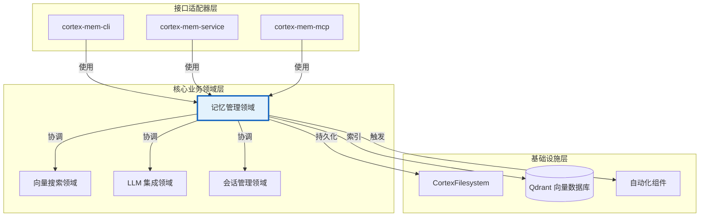
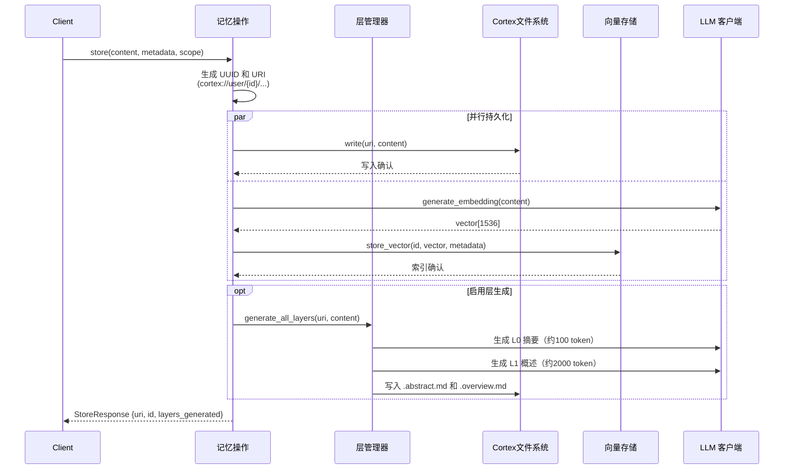
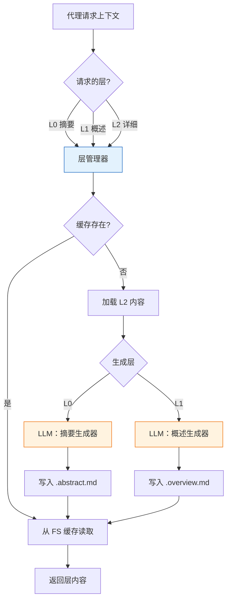
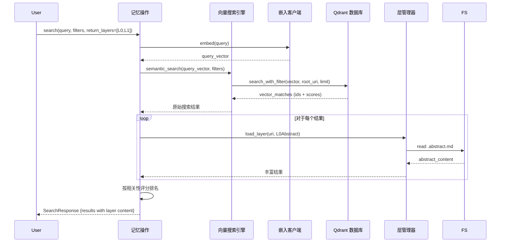

**技术文档：记忆管理领域**

**版本**：1.0  
**最后更新**：2026-02-17 16:35:41 (UTC)  
**系统**：Cortex-Mem  
**模块分类**：核心业务领域  

---

## 1. 执行摘要

**记忆管理领域**是 Cortex-Mem 系统的核心业务能力，为 AI 代理应用提供全面的语义记忆存储、检索和组织服务。该领域主要在 `cortex-mem-core` 和 `cortex-mem-tools` crates 中实现，协调多维记忆模型、分层内容抽象和自动化提取管道。

该领域实现了一种**多语言持久化策略**，结合文件系统存储（用于内容持久性和版本控制）和向量数据库索引（用于语义检索），通过使用专有 `cortex://` URI 方案的统一虚拟文件系统抽象进行协调。

---

## 2. 架构定位

### 2.1 领域上下文

在 Cortex-Mem 分层架构中，记忆管理领域占据**核心业务领域层**，遵循六边形架构原则：



### 2.2 依赖关系

| 依赖方向 | 关系类型 | 强度 | 描述 |
|---------------------|------------------|----------|-------------|
| **记忆管理 → 向量搜索** | 服务协调 | 关键 | 委托语义搜索和嵌入存储操作 |
| **记忆管理 → LLM 集成** | 服务协调 | 关键 | 用于自动化提取、分类和分层层生成 |
| **记忆管理 → 会话管理** | 服务协调 | 高 | 协调对话上下文和时间线持久化 |
| **记忆管理 → 存储基础设施** | 数据持久化 | 关键 | 通过虚拟文件系统抽象持久化内容 |
| **接口层 → 记忆管理** | API 消费 | 关键 | 所有用户界面委托该领域进行记忆操作 |

---

## 3. 核心职责

记忆管理领域封装五个主要职责：

### 3.1 多维记忆组织
- **维度范围**：支持 `User`、`Agent`、`Session` 和 `Resources` 维度，用于租户隔离和组织层次
- **基于 URI 的寻址**：实现 `cortex://{dimension}/{scope}/{category}/{id}` 方案，用于可移植、版本控制友好的资源标识
- **层次存储**：维度范围内的自动日期组织（`YYYY-MM/DD/HH_MM_SS_id.md`）

### 3.2 分层内容抽象（L0-L2）
实现 OpenViking 模式用于渐进式上下文披露：
- **L0 摘要**：约 100 token，1-2 句摘要，用于快速相关性扫描
- **L1 概述**：约 500-2000 token，结构化摘要，用于核心理解
- **L2 详细**：带完整元数据的完整内容，用于深度分析

### 3.3 语义向量协调
- 协调嵌入生成和向量数据库操作
- 管理存储双重性：文件系统（真理来源）和 Qdrant（搜索索引）
- 实施文件系统与向量存储之间的后台同步

### 3.4 自动化记忆提取
- LLM 驱动的对话会话分析，以提取结构化信息
- 分类为类型：`Facts`、`Decisions`、`Preferences`、`Entities`、`Cases`
- 带来源追溯的置信度评分和重要性排名

### 3.5 代理工具接口
- 将记忆操作公开为 LLM 代理的可调用工具
- 实施分层访问模式（`get_abstract`、`get_overview`、`get_read`）
- 提供带 Layer-0 丰富功能的语义搜索能力

---

## 4. 组件架构

该领域结构化为五个子模块：

### 4.1 核心 API 表面（`cortex-mem-core/src/lib.rs`、`cortex-mem-tools/src/lib.rs`）
**职责**：公共 API 契约和类型导出  
**关键元素**：
- 记忆操作的 Trait 定义
- 库初始化和配置注入
- 跨模块类型一致性

### 4.2 类型定义（`cortex-mem-core/src/types.rs`）
**职责**：领域模型和类型系统  
**关键结构**：
```rust
// 核心记忆实体
pub struct Memory {
    pub id: Uuid,
    pub content: String,
    pub embedding: Option<Vec<f32>>,
    pub metadata: MemoryMetadata,
    pub dimension: Dimension,
}

// 维度分类
pub enum Dimension {
    User(String),      // cortex://user/{id}/
    Agent(String),     // cortex://agent/{id}/
    Session(String),   // cortex://session/{id}/
    Resources,         // cortex://resources/
}

// 分层抽象级别
pub enum ContextLayer {
    L0Abstract,   // 简洁语义摘要
    L1Overview,   // 结构化中等长度摘要  
    L2Detail,     // 完整原始内容
}

// 搜索和过滤
pub struct Filters {
    pub user_id: Option<String>,
    pub agent_id: Option<String>,
    pub categories: Vec<MemoryCategory>,
    pub date_range: Option<(DateTime, DateTime)>,
    pub importance_threshold: f32,
}
```

### 4.3 记忆操作门面（`cortex-mem-tools/src/operations.rs`）
**职责**：高级操作协调  
**架构模式**：门面模式，集成四个子系统：
- **虚拟文件系统**：通过 `CortexFilesystem` 进行内容持久化
- **向量引擎**：通过 `VectorSearchEngine` 进行语义搜索
- **会话管理器**：通过 `SessionManager` 进行对话上下文
- **层管理器**：通过 `LayerManager` 进行分层生成

**构造函数模式**：
```rust
impl MemoryOperations {
    pub fn new(
        filesystem: Arc<CortexFilesystem>,
        vector_engine: Arc<VectorSearchEngine>,
        llm_client: Arc<LLMClient>,
        embedding_client: Arc<EmbeddingClient>,
        config: MemoryConfig,
    ) -> Self
}
```

### 4.4 记忆提取引擎（`cortex-mem-core/src/extraction/`）
**职责**：LLM 驱动的内容分析和结构化提取  
**组件**：
- **`extractor.rs`**：用于对话分析的核心提取逻辑
- **`types.rs`**：结构化提取结果类型（`ExtractedFact`、`ExtractedDecision`、`ExtractedEntity`）
- **`user_profile.rs`**：从提取记忆中聚合用户档案

**提取管道**：
1. 从会话时间线递归收集消息
2. Markdown 解析（角色 + 内容提取）
3. 用于事实/决策/实体提取的并行 LLM 分析
4. 置信度过滤（默认阈值：0.6）
5. 通过 `source_uris` 进行来源归属

### 4.5 代理工具集成（`cortex-mem-tools/src/tools/`）
**职责**：LLM 代理消费的工具接口  
**工具类别**：
- **存储工具**（`storage.rs`）：`store`、`ls`、`explore`
- **分层访问工具**（`tiered.rs`）：`get_abstract`、`get_overview`、`get_read`
- **搜索工具**（`search.rs`）：`search`、`find`
- **文件系统工具**（`filesystem.rs`）：带 L0 摘要丰富的目录导航

---

## 5. 数据流架构

### 5.1 记忆存储流程（CQRS 模式）



### 5.2 分层检索流程



### 5.3 带层丰富的语义搜索



---

## 6. 公共接口规范

### 6.1 高级程序化 API

**会话管理**
```rust
// 追加消息到对话时间线
pub async fn add_message(
    &self,
    thread_id: &str,
    role: MessageRole,  // User | Assistant | System
    content: &str
) -> Result<String, MemoryError>

// 会话生命周期
pub async fn list_sessions(&self) -> Result<Vec<SessionInfo>, MemoryError>
pub async fn get_session(&self, thread_id: &str) -> Result<SessionInfo, MemoryError>
pub async fn close_session(&self, thread_id: &str) -> Result<(), MemoryError>
```

**文件系统操作**
```rust
// 基于 URI 的内容访问
pub async fn read_file(&self, uri: &str) -> Result<String, MemoryError>
pub async fn list_files(&self, uri: &str) -> Result<Vec<FileEntry>, MemoryError>
pub async fn delete(&self, uri: &str) -> Result<(), MemoryError>
pub async fn exists(&self, uri: &str) -> Result<bool, MemoryError>
```

**向量搜索访问**
```rust
// 高级查询直接访问搜索引擎
pub fn vector_engine(&self) -> &Arc<VectorSearchEngine>

// 便捷搜索方法
pub async fn semantic_search(
    &self,
    query: &str,
    filters: Filters,
    options: SearchOptions
) -> Result<Vec<SearchResult>, MemoryError>
```

### 6.2 代理工具接口

**存储工具**（`StoreArgs` → `StoreResponse`）
- **目的**：持久化内容，带自动分层层生成
- **参数**：
  - `content`：要存储的文本内容
  - `scope`："user"、"agent" 或 "session"
  - `auto_generate_layers`：触发 L0/L1 生成的布尔值
  - `metadata`：可选的键值对

**分层访问工具**
- **`get_abstract(uri)`**：返回 L0 摘要（约 100 token）用于快速扫描
- **`get_overview(uri)`**：返回 L1 结构化摘要（约 2000 token）
- **`get_read(uri)`**：返回 L2 完整内容带元数据

**搜索工具**
- **`search(args)`**：带层丰富的完整语义搜索
  - 支持 `return_layers` 参数用于选择性加载（L0/L1/L2）
  - 实现意图分析 → 初始定位 → 精细探索
- **`find(args)`**：快速搜索仅返回 L0 摘要用于快速过滤

**文件系统导航工具**
- **`ls(uri)`**：带可选摘要包含的目录列表
- **`explore(args)`**：带关键词相关性评分（0.0-0.8 刻度）的智能递归探索

### 6.3 记忆提取接口

```rust
pub struct MemoryExtractor {
    // 从特定消息集合提取
    pub async fn extract_from_messages(
        &self,
        thread_id: &str,
        messages: Vec<Message>
    ) -> Result<ExtractedMemories, ExtractionError>
    
    // 从持久化会话直接提取
    pub async fn extract_from_thread(
        &self,
        thread_id: &str
    ) -> Result<ExtractedMemories, ExtractionError>
}

pub struct ExtractedMemories {
    pub facts: Vec<ExtractedFact>,
    pub decisions: Vec<ExtractedDecision>,
    pub entities: Vec<ExtractedEntity>,
    pub preferences: Vec<ExtractedPreference>,
    pub confidence_score: f32,
    pub source_uris: Vec<String>,
}
```

---

## 7. 实现模式

### 7.1 架构模式

**门面模式**  
`MemoryOperations` 结构体作为统一门面，隐藏协调文件系统、向量存储、LLM 客户端和嵌入服务之间复杂性的同时，为上层提供简化的接口。

**构建器模式**  
复杂类型构建使用构建器模式进行人体工程学配置：
```rust
ExtractedFact::new()
    .with_content("User prefers dark mode")
    .with_confidence(0.95)
    .with_importance(MemoryImportance::High)
    .with_category(MemoryCategory::UserPreference)
    .with_source("session_123")
```

**策略模式**  
URI 规范化策略将传统别名映射到规范结构：
- `threads` → `session`
- `agents` → `agent`  
- `users` → `user`
- `global` → `resources`

### 7.2 并发模型

**Async/Await 架构**  
构建在 Tokio 运行时上用于 I/O 密集型操作（LLM 调用、向量 DB 查询）：
- 所有公共 API 是返回 `Result<T, MemoryError>` 的 `async` 函数
- 内部协调使用 `Arc<RwLock<T>>` 用于共享可变状态

**后台处理**  
自动同步架构在初始化时生成后台任务：
```rust
// 自动文件系统 → 向量存储同步
tokio::spawn(async move {
    let sync_manager = SyncManager::new(filesystem, vector_store);
    sync_manager.sync_all().await
});
```

**并行提取**  
记忆提取利用不同提取类型的并行 LLM 调用：
```rust
let (facts, decisions, entities) = tokio::join!(
    extract_facts(&context),
    extract_decisions(&context),
    extract_entities(&context)
);
```

### 7.3 存储抽象

**虚拟文件系统网关**  
`CortexFilesystem` 实现虚拟文件系统抽象：
- **URI 解析**：`cortex://user/123/memories/title.md` → `{data_dir}/user/123/memories/title.md`
- **租户隔离**：`CortexFilesystem::with_tenant(tenant_id)` 创建隔离视图
- **跨平台**：处理跨 OS 平台的文件系统特性和路径分隔符

**双写策略**  
关键写入遵循双写模式以保持一致性：
1. 写入文件系统（真理来源）
2. 生成嵌入并写入 Qdrant（搜索索引）
3. 失败时实施补偿事务或重试逻辑

---

## 8. 集成点

### 8.1 上游依赖（消费服务）

| 服务 | 集成点 | 目的 |
|---------|------------------|---------|
| **Qdrant 向量数据库** | `VectorSearchEngine` | 语义相似性搜索和向量持久化 |
| **LLM 提供商** | `LLMClient` | 内容摘要、提取、分类 |
| **嵌入服务** | `EmbeddingClient` | 文本向量化（默认：1536 维） |
| **本地文件系统** | `CortexFilesystem` | 持久化内容存储和层缓存 |

### 8.2 下游消费者

| 消费者 | 集成方法 | 使用模式 |
|----------|-------------------|---------------|
| **cortex-mem-cli** | 直接库链接 | 命令行记忆操作 |
| **cortex-mem-service** | 直接库链接 | HTTP REST API 端点 |
| **cortex-mem-mcp** | 工具 trait 实现 | MCP 协议服务器工具 |
| **cortex-mem-insights** | HTTP REST API（推荐） | Web 仪表板数据显示 |

### 8.3 配置接口

该领域依赖 `cortex-mem-config` 用于：
- **LLM 配置**：API 端点、模型名称、超时设置
- **向量存储**：Qdrant URL、集合名称、维度设置
- **存储**：数据目录路径、URI 方案配置
- **提取**：置信度阈值、批量大小、提示模板

---

## 9. 运营注意事项

### 9.1 性能特性

| 操作 | 延迟配置文件 | 瓶颈 |
|-----------|----------------|------------|
| **L0/L1 层生成** | 500-2000ms | LLM API 往返 |
| **向量搜索** | 50-200ms | Qdrant HNSW 索引查找 |
| **文件系统读取** | 1-10ms | 本地磁盘 I/O |
| **记忆提取** | 2-5s | 顺序 LLM 分析 |
| **批量存储** | 可变 | 嵌入 API 速率限制 |

### 9.2 可扩展性模式

**水平扩展考虑**：
- **无状态设计**：`MemoryOperations` 实例无状态；多个实例可以服务请求
- **共享存储**：所有实例访问共享文件系统和 Qdrant 集群
- **层缓存**：生成的 L0/L1 层缓存在文件系统中以防止冗余 LLM 调用

**数据分区**：
- **按维度**：按用户/代理/会话 ID 自然分片
- **按日期**：自动日期目录结构允许时间范围查询针对特定子目录

### 9.3 错误处理策略

该领域实施结构化错误传播：
```rust
pub enum MemoryError {
    FilesystemError(std::io::Error),
    VectorStoreError(qdrant_client::Error),
    LLMError(llm::Error),
    InvalidUri(String),
    NotFound(String),
    ExtractionError(String),
}
```

**重试逻辑**：
- LLM 操作实施速率限制的指数退避
- 向量存储操作对瞬态网络故障重试
- 文件系统操作假设本地可靠性（无重试）

---

## 10. 开发指南

### 10.1 添加新记忆操作

扩展领域时：

1. **定义类型**：在 `cortex-mem-core/src/types.rs` 添加结构体/枚举
2. **实现逻辑**：在 `cortex-mem-tools/src/operations.rs` 的 `MemoryOperations` 添加方法
3. **暴露工具**：在 `cortex-mem-tools/src/tools/` 中将操作包装为工具以供代理访问
4. **保持幂等性**：存储操作应幂等（相同 URI → 相同状态）
5. **更新层**：如果修改内容，使关联的 L0/L1 层失效或重新生成

### 10.2 URI 方案扩展

添加新资源类型时：
- 遵循模式：`cortex://{dimension}/{id}/{category}/{resource}`
- 更新 `uri.rs` 解析器以识别新类别类型
- 确保与传统别名映射的向后兼容性

### 10.3 测试策略

- **单元测试**：使用 trait 对象模拟 LLM 和向量存储接口
- **集成测试**：使用临时目录和内存 Qdrant 实例
- **契约测试**：验证跨平台的 URI → 文件系统路径转换

---

## 11. 附录：代码地图

| 文件路径 | 职责 |
|-----------|---------------|
| `cortex-mem-core/src/lib.rs` | 领域导出和公共 API 表面 |
| `cortex-mem-core/src/types.rs` | 核心类型定义（记忆、维度、上下文层） |
| `cortex-mem-tools/src/operations.rs` | 记忆操作门面实现 |
| `cortex-mem-core/src/extraction/` | LLM 驱动的记忆提取管道 |
| `cortex-mem-tools/src/tools/` | 代理工具实现（存储、搜索、分层） |
| `cortex-mem-core/src/filesystem/` | 虚拟文件系统和 URI 处理 |
| `cortex-mem-core/src/layers/` | 分层层生成和缓存 |

---

**文档控制**  
**作者：** 技术架构团队  
**审稿人：** 领域专家、工程 Leads  
**分类：** 技术实施指南  
**置信度：** 95%（基于全面的代码库分析）
