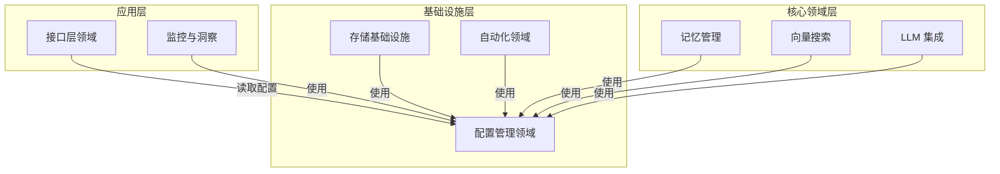
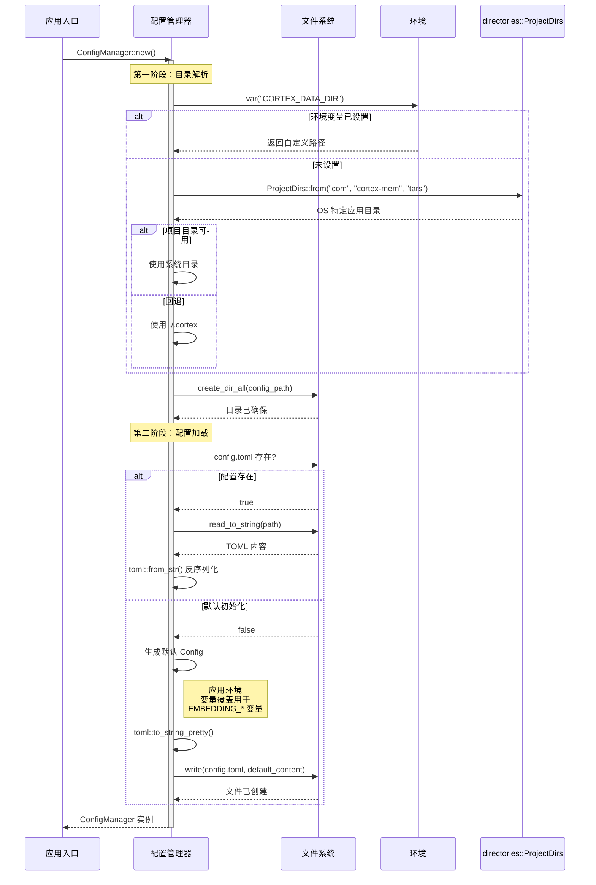

**配置管理领域技术文档**

**文档版本**：1.0  
**系统**：Cortex-Mem 全栈内存基础设施  
**领域类型**：基础设施领域  
**复杂性评级**：5/10  
**关键性**：高（跨领域关注）

---

## 1. 领域概述

**配置管理领域**作为 Cortex-Mem 生态系统的基础设施层，提供跨所有系统组件的集中化、类型安全的配置处理。作为清洁架构范式内的**基础设施领域**，它桥接外部配置源（如 TOML 文件、环境变量和 OS 特定目录）与内部应用结构。

该领域确保异构部署上下文中配置语义的一致性，包括命令行工具、HTTP 服务、模型上下文协议（MCP）服务器和嵌入式库使用。通过抽象配置解析复杂性，它实现了零配置启动场景，同时支持复杂的多租户部署。

---

## 2. 架构定位和职责

### 2.1 架构分类
- **层**：基础设施层（六边形架构）
- **模式**：跨领域关注 / 配置适配器
- **依赖**：最小外部依赖（`directories`、`serde`、`toml`、`anyhow`）
- **依赖者**：所有应用领域（接口层、记忆管理、向量搜索、存储基础设施）

### 2.2 核心职责
1. **类型安全配置映射**：将外部非结构化配置（TOML、ENV）转换为编译时验证的 Rust 结构
2. **层次解析**：实现级联配置解析（环境变量 → 配置文件 → 系统默认值 → 硬编码默认值）
3. **跨平台目录管理**：使用 `directories` crate 解析 OS 特定数据目录（例如 macOS 上的 `~/Library/Application Support/`、Windows 上的 `%APPDATA%`、Linux 上的 `~/.local/share/`）
4. **部署上下文抽象**：无论执行上下文（CLI vs. 服务 vs. 库）如何，提供统一的配置接口

### 2.3 领域关系


---

## 3. 配置层次结构和模式

该领域实现与其模块化架构镜像的层次配置结构：

### 3.1 根配置结构（`Config`）
聚合所有子系统配置的顶级配置容器：

```rust
pub struct Config {
    pub cortex: CortexConfig,      // 核心系统设置
    pub qdrant: QdrantConfig,      // 向量数据库连接
    pub embedding: EmbeddingConfig, // 文本嵌入服务
    pub llm: LLMConfig,            // 语言模型集成
    pub server: ServerConfig,      // HTTP 服务设置
    pub logging: LoggingConfig,    // 可观察性设置
}
```

### 3.2 子系统配置

#### **CortexConfig**
管理核心系统参数和数据目录解析：
- **数据目录解析**：实施三级回退策略：
  1. `$CORTEX_DATA_DIR` 环境变量
  2. OS 特定应用目录（`directories::ProjectDirs`）
  3. 本地回退（`./.cortex`）
- **范围**：定义 `cortex://` URI 方案映射的虚拟文件系统根

#### **QdrantConfig**
向量数据库连接参数：
- `url`：Qdrant 服务端点
- `collection_name`：向量集合标识符
- `embedding_dim`：存储向量的维度（默认：1536）
- `api_key`：可选认证令牌

#### **EmbeddingConfig**
外部嵌入服务集成（OpenAI 兼容）：
- `api_base_url`：服务端点（默认：`https://api.openai.com/v1`）
- `api_key`：认证凭据
- `model`：模型标识符（默认：`text-embedding-3-small`）
- `batch_size`：处理批量优化

#### **LLMConfig**
用于内容生成和提取的语言模型提供商配置：
- 提供商特定端点和认证
- 模型选择参数
- 超时和重试配置

#### **ServerConfig**
HTTP REST API 服务参数：
- `host`：绑定地址
- `port`：监听端口
- `cors_origins`：跨域资源共享策略

#### **LoggingConfig**
可观察性基础设施：
- `enabled`：布尔激活标志
- `level`：日志详细程度（`error`、`warn`、`info`、`debug`、`trace`）
- `log_directory`：日志文件存储的文件系统路径

---

## 4. 技术实现

### 4.1 类型安全配置结构
实现利用 Rust 类型系统和 `serde` 生态系统进行编译时配置验证：

```rust
use serde::{Deserialize, Serialize};

#[derive(Debug, Serialize, Deserialize, Default)]
pub struct EmbeddingConfig {
    #[serde(default = "default_api_base")]
    pub api_base_url: String,
    #[serde(default)]
    pub api_key: String,
    #[serde(default = "default_model")]
    pub model: String,
    #[serde(default = "default_batch_size")]
    pub batch_size: usize,
}
```

**关键实现细节**：
- **`Default` Trait 实现**：启用部分配置，用默认值填充缺失值
- **`serde(default)` 属性**：确保添加新字段时向后兼容
- **`anyhow::Result` 错误处理**：I/O 和解析失败的人体工程学错误传播

### 4.2 配置加载机制

#### **基于文件的加载**（`Config::load`）
```rust
impl Config {
    pub fn load<P: AsRef<std::path::Path>>(path: P) -> anyhow::Result<Self> {
        let content = std::fs::read_to_string(path)?;
        let config: Config = toml::from_str(&content)?;
        Ok(config)
    }
}
```

**流程**：
1. **文件系统读取**：通过 `std::fs::read_to_string` 加载 TOML 内容
2. **反序列化**：使用 `toml::from_str` 将 TOML 解析为类型结构
3. **默认应用**：Serde 的默认处理用预定义值填充缺失字段
4. **验证**：返回 `anyhow::Result` 进行统一错误处理

### 4.3 智能默认解析

#### **数据目录解析算法**
`CortexConfig::data_dir()` 方法实现环境感知的路径解析：

```rust
impl CortexConfig {
    pub fn data_dir(&self) -> PathBuf {
        // 第一层：环境变量覆盖
        if let Ok(env_dir) = std::env::var("CORTEX_DATA_DIR") {
            return PathBuf::from(env_dir);
        }
        
        // 第二层：OS 特定应用目录
        if let Some(proj_dirs) = ProjectDirs::from("com", "cortex-mem", "tars") {
            return proj_dirs.data_dir().join("cortex");
        }
        
        // 第三层：本地项目目录回退
        PathBuf::from("./.cortex")
    }
}
```

**平台特定路径**：
- **macOS**：`~/Library/Application Support/com.cortex-mem.tars/cortex`
- **Linux**：`~/.local/share/com.cortex-mem.tars/cortex`
- **Windows**：`%APPDATA%\com\cortex-mem\tars\data\cortex`

#### **嵌入配置默认值**
OpenAI 兼容服务的环境感知初始化：
- `EMBEDDING_API_BASE_URL` → `api_base_url`（回退：`https://api.openai.com/v1`）
- `EMBEDDING_API_KEY` → `api_key`（回退：空字符串）
- `EMBEDDING_MODEL` → `model`（回退：`text-embedding-3-small`）

### 4.4 配置管理器模式
对于需要动态配置管理的服务上下文，该领域支持 `ConfigManager` 模式（如 `examples/cortex-mem-tars/src/config.rs` 中示例）：

**职责**：
- **编排**：协调所有配置子系统的初始化
- **目录供应**：通过 `fs::create_dir_all` 确保数据目录存在
- **延迟加载**：延迟配置加载直到首次访问
- **持久化管理**：处理 TOML（cortex-mem 配置）和 JSON（应用特定机器人配置）格式

**关键方法**：
- `ConfigManager::new()`：初始化配置基础设施，缺失时创建默认配置
- `ConfigManager::cortex_config()`：返回不可变引用到核心配置
- `ConfigManager::get_bots()`：加载特定领域配置（基于 JSON）

---

## 5. 配置解析工作流

以下序列说明完整的配置初始化流程：



---

## 6. 集成模式

### 6.1 CLI 应用
命令行工具在启动时使用静态配置加载：

```rust
use cortex_mem_config::Config;

fn main() -> anyhow::Result<()> {
    let config_path = dirs::config_dir()
        .expect("Cannot find config directory")
        .join("cortex-mem/config.toml");
    
    let config = Config::load(&config_path)?;
    
    // 使用配置初始化子系统
    let memory_system = MemorySystem::new(config.cortex.data_dir())?;
    let vector_store = QdrantClient::new(config.qdrant)?;
    
    Ok(())
}
```

### 6.2 服务部署
长时间运行的服务使用 `ConfigManager` 模式进行动态配置：

```rust
pub struct ServiceState {
    config_manager: Arc<ConfigManager>,
    memory_engine: Arc<MemoryEngine>,
}

impl ServiceState {
    pub async fn initialize() -> anyhow::Result<Self> {
        let config_manager = ConfigManager::new().await?;
        let cortex_config = config_manager.cortex_config();
        
        let memory_engine = MemoryEngine::builder()
            .data_dir(cortex_config.data_dir())
            .qdrant_config(cortex_config.qdrant.clone())
            .build()
            .await?;
            
        Ok(Self {
            config_manager: Arc::new(config_manager),
            memory_engine: Arc::new(memory_engine),
        })
    }
}
```

### 6.3 库上下文
作为第三方应用程序中的依赖使用时，该领域支持程序化配置构建：

```rust
use cortex_mem_config::{Config, CortexConfig, EmbeddingConfig};

// 零配置默认值
let config = Config::default();

// 或程序化构建
let custom_config = Config {
    cortex: CortexConfig {
        data_dir: PathBuf::from("/custom/path"),
        ..Default::default()
    },
    embedding: EmbeddingConfig {
        model: "text-embedding-3-large".to_string(),
        ..Default::default()
    },
    ..Default::default()
};
```

---

## 7. 环境变量参考

该领域识别以下运行时配置的环境变量：

| 变量 | 范围 | 描述 | 默认 |
|----------|-------|-------------|---------|
| `CORTEX_DATA_DIR` | 全局 | 内存存储和日志的根目录 | OS 特定或 `./.cortex` |
| `EMBEDDING_API_BASE_URL` | 嵌入 | 嵌入服务的 base URL | `https://api.openai.com/v1` |
| `EMBEDDING_API_KEY` | 嵌入 | 嵌入 API 的认证密钥 | 空字符串 |
| `EMBEDDING_MODEL` | 嵌入 | 嵌入的模型标识符 | `text-embedding-3-small` |
| `RUST_LOG` | 日志 | 全局日志级别过滤器（env_logger 兼容） | `info` |

---

## 8. 实现最佳实践

### 8.1 配置验证
虽然该领域提供类型安全，应用应实施语义验证：

```rust
impl Config {
    pub fn validate(&self) -> anyhow::Result<()> {
        // 确保数据目录可写
        if !self.cortex.data_dir().exists() {
            std::fs::create_dir_all(self.cortex.data_dir())?;
        }
        
        // 验证嵌入维度与 Qdrant 配置匹配
        if self.embedding.model.contains("3-small") && self.qdrant.embedding_dim != 1536 {
            anyhow::bail!("嵌入维度不匹配：模型生成 1536 维，但 Qdrant 配置为 {}", 
                self.qdrant.embedding_dim);
        }
        
        Ok(())
    }
}
```

### 8.2 密钥管理
对于生产部署，避免将 API 密钥存储在纯文本 TOML 文件中：

```rust
// 优先环境变量而非文件配置
impl EmbeddingConfig {
    pub fn api_key(&self) -> String {
        std::env::var("EMBEDDING_API_KEY")
            .unwrap_or_else(|_| self.api_key.clone())
    }
}
```

### 8.3 热重载（高级）
对于需要重启而无需重启的配置更新，实施文件监视：

```rust
use notify::{Watcher, RecursiveMode};

pub struct HotReloadConfig {
    inner: Arc<RwLock<Config>>,
    _watcher: notify::RecommendedWatcher,
}

impl HotReloadConfig {
    pub fn new(path: &Path) -> anyhow::Result<Self> {
        let config = Config::load(path)?;
        let inner = Arc::new(RwLock::new(config));
        
        let inner_clone = inner.clone();
        let path_clone = path.to_owned();
        
        let mut watcher = notify::recommended_watcher(move |res: Result<notify::Event, _>| {
            if let Ok(event) = res {
                if event.kind.is_modify() {
                    if let Ok(new_config) = Config::load(&path_clone) {
                        let mut write_guard = inner_clone.write().unwrap();
                        *write_guard = new_config;
                        log::info!("Configuration reloaded");
                    }
                }
            }
        })?;
        
        watcher.watch(path.parent().unwrap(), RecursiveMode::NonRecursive)?;
        
        Ok(Self {
            inner,
            _watcher: watcher,
        })
    }
    
    pub fn get(&self) -> Config {
        self.inner.read().unwrap().clone()
    }
}
```

---

## 9. 结论

配置管理领域为 Cortex-Mem 生态系统提供了必要的基础设施基础，实现了跨不同部署场景的一致、类型安全配置。通过实施层次解析策略和跨平台目录管理，它在保持开发和生产环境灵活性的同时抽象了运营复杂性。

该领域对 Rust 类型系统原则的坚持——结合 serde 的序列化能力——确保配置错误在编译时或加载时被捕获，而非运行时，显著提高了系统可靠性和运营体验。

**关键架构成功因素**：
- **零配置启动**：合理的默认值实现即时系统运行
- **环境可移植性**：跨开发机器、容器和云环境的无缝运行
- **类型安全**：编译时保证防止配置相关的运行时故障
- **关注点分离**：外部配置源和内部领域逻辑之间的清晰抽象

---

**相关文档**：
- [存储基础设施领域](./storage-infrastructure.md)
- [接口层领域](./interface-layer.md)
- [系统部署指南](./deployment.md)
