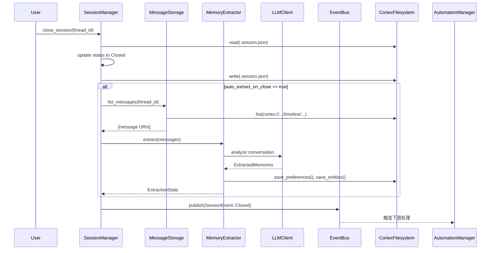

# 会话管理领域

**技术实现文档**

---

**生成时间:** 2024-01-15T09:30:00Z  
**系统版本:** Cortex-Mem核心基础设施  
**领域分类:** 核心业务领域  
**复杂度指数:** 7.0/10  

---

## 1. 领域概述

**会话管理领域**是Cortex-Mem架构的基础组件，负责协调对话状态、消息持久化和会话生命周期转换。它作为跟踪时间对话线程、管理参与者元数据和触发下游记忆提取过程的主要接口。

作为核心业务领域，会话管理弥合了短暂对话交互和持久记忆存储之间的差距。它实现了按时间顺序组织消息的分层存储模型，同时保持存储机制、AI处理管道和事件驱动自动化工作流之间的松耦合。

### 1.1 领域职责

- **对话状态管理**: 跟踪活动、关闭和归档的对话会话
- **时间消息组织**: 按年、月和日的消息分层索引
- **生命周期事件发射**: 发布`SessionEvent`通知以实现系统范围响应
- **自动化记忆提取**: 会话关闭时触发AI驱动的分析
- **参与者跟踪**: 跨对话线程维护用户和智能体元数据

### 1.2 战略位置

该领域处于用户交互和自动化记忆处理的交叉点。虽然**自动化管理领域**处理后台索引，**提取引擎领域**执行AI分析，但会话管理提供了决定何时以及如何触发这些过程的结构基础。

---

## 2. 架构组件

会话管理领域实现模块化架构，由三个专业子模块组成，由中央控制器协调：

### 2.1 组件结构

```rust
// 领域结构概述
cortex-mem-core/src/session/
├── mod.rs              // 领域导出和公共接口
├── manager.rs          // 会话管理器：生命周期编排
├── message.rs          // 消息存储：单个消息处理
└── timeline.rs        // 时间线生成器：时间聚合
```

### 2.2 会话生命周期管理器 (`manager.rs`)

**会话管理器**充当领域控制器，实现会话操作和状态转换的主要接口。

**关键能力:**
- **会话创建**: 使用唯一标识符和参与者元数据初始化新对话线程
- **状态转换**: 管理生命周期状态（活动 → 关闭 → 归档）
- **事件协调**: 通过EventBus发布`SessionEvent::Created`、`SessionEvent::MessageAdded`和`SessionEvent::Closed`
- **自动提取编排**: 当`auto_extract_on_close`启用时，有条件地在会话关闭时触发`MemoryExtractor`

**主要接口方法:**
```rust
impl SessionManager {
    pub async fn create_session(&self, thread_id: String) -> Result<SessionMetadata, SessionError>;
    pub async fn add_message(&self, thread_id: &str, role: Role, content: &str) -> Result<Message, SessionError>;
    pub async fn close_session(&self, thread_id: &str) -> Result<SessionMetadata, SessionError>;
    pub async fn list_messages(&self, thread_id: &str) -> Result<Vec<Message>, SessionError>;
}
```

### 2.3 消息管理器 (`message.rs`)

**消息存储**组件处理单个对话消息的持久化和检索，抽象markdown-based存储所需的文件系统操作。

**关键能力:**
- **Markdown序列化**: 将消息对象转换为带嵌入YAML frontmatter元数据的markdown格式
- **URI生成**: 遵循`cortex://`方案构造确定性资源标识符
- **CRUD操作**: 异步读写单个消息的操作
- **元数据提取**: 从文件系统存储解析消息时间戳、角色和内容

**存储格式:**
```markdown
---
id: "msg_12345"
role: "user"
timestamp: "2024-01-15T09:30:00Z"
thread_id: "thread_67890"
---
Message content in markdown format...
```

### 2.4 时间线管理器 (`timeline.rs`)

**时间线生成器**实现分层索引策略，优化大型对话历史的消息检索和导航。

**关键能力:**
- **分层索引**: 自动生成日（`index.md`）、月和年索引文件
- **时间聚合**: 按时间段分组消息以高效浏览
- **URI解析**: 将逻辑时间线查询映射到物理文件系统路径
- **分页支持**: 通过光标导航大量消息

**目录结构:**
```
cortex://session/{thread_id}/timeline/
├── 2024-01/
│   ├── 15/
│   │   ├── 09_30_00_msg_001.md
│   │   ├── 09_31_45_msg_002.md
│   │   └── index.md          // 日索引
│   └── index.md              // 月索引
└── index.md                  // 年索引
```

---

## 3. 数据模型和存储架构

### 3.1 URI模式

该领域使用`cortex://`协议实现标准化资源寻址方案：

| 资源类型 | URI模式 | 示例 |
|--------------|-------------|---------|
| 会话根 | `cortex://session/{thread_id}` | `cortex://session/thread_123` |
| 时间线 | `cortex://session/{id}/timeline/{YYYY-MM}/{DD}` | `cortex://session/thread_123/timeline/2024-01/15` |
| 消息 | `cortex://session/{id}/timeline/{YYYY-MM}/{DD}/{HH_MM_SS}_{msg_id}.md` | `cortex://session/thread_123/timeline/2024-01/15/09_30_00_msg_001.md` |
| 会话元数据 | `cortex://session/{id}/.session.json` | `cortex://session/thread_123/.session.json` |

### 3.2 会话元数据模式

会话持久化使用包含以下内容的JSON-based元数据文件：

```rust
pub struct SessionMetadata {
    pub thread_id: String,
    pub status: SessionStatus,        // 活动、关闭、归档
    pub created_at: DateTime<Utc>,
    pub updated_at: DateTime<Utc>,
    pub closed_at: Option<DateTime<Utc>>,
    pub participants: Vec<Participant>,
    pub tags: Vec<String>,
    pub auto_extract_on_close: bool,  // AI提取的特性标志
    pub tenant_id: Option<String>,    // 多租户隔离
}
```

### 3.3 消息结构

单个消息建模为：

```rust
pub struct Message {
    pub id: String,
    pub thread_id: String,
    pub role: Role,                   // 用户、助手、系统
    pub content: String,
    pub timestamp: DateTime<Utc>,
    pub metadata: HashMap<String, Value>,
}
```

---

## 4. 核心业务工作流

### 4.1 会话创建流程

初始化新对话线程时：

1. **验证**: 验证租户隔离和线程ID唯一性
2. **元数据初始化**: 创建`SessionMetadata`，状态为`Active`
3. **文件系统配置**: 确保`cortex://session/{thread_id}/`下目录结构存在
4. **持久化**: 将`.session.json`写入文件系统
5. **事件发布**: 通过EventBus发出`SessionEvent::Created`

**代码路径:** `SessionManager::create_session()` → `CortexFilesystem::write()`

### 4.2 消息添加流程

向活动会话追加消息时：

1. **URI生成**: 根据当前UTC时间戳构造资源路径：`{HH_MM_SS}_{message_id}.md`
2. **Markdown序列化**: 将消息转换为带YAML frontmatter的markdown
3. **文件系统写入**: 通过`CortexFilesystem`抽象持久化
4. **索引更新**: 触发`TimelineGenerator::generate_daily_index()`以更新时间索引
5. **事件发射**: 发布`SessionEvent::MessageAdded`用于实时索引触发

**代码路径:** `SessionManager::add_message()` → `MessageStorage::save_message()` → `TimelineGenerator::generate_daily_index()`

### 4.3 会话关闭和记忆提取流程

关闭工作流代表对话状态管理和自动化知识提取之间的关键交接：



**工作流步骤:**

1. **状态转换**: 将`SessionMetadata.status`从`Active`更新为`Closed`并设置`closed_at`时间戳
2. **条件提取**: 如果`auto_extract_on_close`启用：
   - 递归读取会话时间线中的所有`.md`消息
   - 构建带对话上下文和现有配置文件数据的LLM提示
   - 调用`MemoryExtractor`识别事实、决策和实体
   - 使用回退markdown提取解析JSON响应
   - 按置信度阈值过滤并使用LCS（最长公共子序列）相似度去重
   - 合并到用户/智能体配置文件，强制执行类别限制
3. **事件发布**: 发出`SessionEvent::Closed`以触发：
   - **自动化管理领域**: 自动索引已完成的会话
   - **配置文件管理领域**: 配置文件持久化更新
   - **层级管理领域**: L0/L1摘要生成用于搜索优化

**代码路径:** `SessionManager::close_session()` → `MemoryExtractor::extract_from_thread()` → `EventBus::send(SessionEvent::Closed)`

---

## 5. 实现细节

### 5.1 异步架构

该领域利用Rust的async/await范式进行I/O密集型操作：

- **文件系统操作**: 所有CRUD操作是异步的，使用`tokio::fs`进行非阻塞文件I/O
- **事件发布**: 异步基于通道的事件总线（`tokio::mpsc`）用于解耦通信
- **LLM集成**: 到外部嵌入/补全API的非阻塞HTTP客户端调用

**示例模式:**
```rust
pub async fn add_message(&self, thread_id: &str, content: &str) -> Result<Message, Error> {
    let message = Message::new(thread_id, content);
    let uri = self.message_storage.save_message(&message).await?;
    self.event_bus.send(SessionEvent::MessageAdded { uri }).await?;
    Ok(message)
}
```

### 5.2 序列化策略

- **消息**: 带YAML frontmatter的markdown格式（人类可读、版本控制友好）
- **元数据**: 带serde的JSON，用于类型安全序列化
- **确定性ID**: 基于内容哈希和路径结构的URI-based向量ID

### 5.3 错误处理

领域特定错误在`cortex-mem-core/src/error.rs`中定义：

```rust
pub enum SessionError {
    NotFound(String),           // 线程ID不存在
    InvalidState(String),       // 关闭会话上的操作
    StorageError(Error),        // 文件系统I/O失败
    SerializationError(Error),  // JSON/Markdown解析失败
    TenantMismatch(String),     // 跨租户访问尝试
}
```

### 5.4 多租户隔离

会话数据自动按`tenant_id`作用域：

- **文件系统**: 路径映射到`/data/tenants/{tenant_id}/session/`
- **元数据**: `tenant_id`字段持久化在`.session.json`中
- **访问控制**: 所有读操作按从请求header或CLI参数提取的租户上下文过滤

---

## 6. 集成点

### 6.1 上游依赖

**核心基础设施领域:**
- **CortexFilesystem**: 使用`cortex://` URI解析抽象OS文件系统操作
- **EventBus**: 用于事件发布的异步通道基础设施
- **LLMClient**: 用于记忆提取的OpenAI兼容客户端（通过泛型的可选依赖）

### 6.2 下游消费者

**自动化管理领域:**
- 消费`SessionEvent::Closed`以触发自动索引工作流
- 使用`SessionManager`列出消息用于批量处理

**提取引擎领域:**
- `MemoryExtractor`处理对话线程到结构化记忆
- 使用提取的事实和决策更新`ProfileManager`

**层级管理领域:**
- 从L2（原始）会话内容生成L0（抽象）和L1（概览）摘要
- 将摘要缓存在`cortex://session/{id}/.abstract.md`和`.overview.md`

**搜索引擎领域:**
- 查询时间线索引用于时间过滤
- 检索完整消息内容用于L2层搜索结果

---

## 7. 配置和使用

### 7.1 初始化

```rust
// 带用于自动提取的可选LLM客户端
let session_manager = SessionManager::new(
    filesystem.clone(),
    Some(llm_client),
    Some(event_bus),
    tenant_id
);
```

### 7.2 配置选项

| 选项 | 环境变量 | 默认 | 描述 |
|--------|---------------------|--------|-------------|
| `auto_extract_on_close` | `CORTEX_AUTO_EXTRACT` | `true` | 会话关闭时启用AI提取 |
| `session_timeout` | `CORTEX_SESSION_TIMEOUT` | `24h` | 陈旧会话的自动关闭阈值 |
| `timeline_indexing` | `CORTEX_TIMELINE_INDEX` | `true` | 启用分层索引生成 |

### 7.3 使用模式

**基本会话管理:**
```rust
// 创建和管理对话
let session = session_manager.create_session("thread_123".to_string()).await?;
session_manager.add_message("thread_123", Role::User, "Hello").await?;
session_manager.close_session("thread_123").await?; // 触发提取
```

**手动时间线导航:**
```rust
// 访问历史消息
let messages = session_manager.list_messages("thread_123").await?;
let daily_index = timeline_generator.get_daily_index("thread_123", "2024-01-15").await?;
```

---

## 8. 性能考虑

- **批量处理**: 消息列表操作使用流式迭代器处理大型对话历史
- **延迟加载**: 时间线索引按需生成并缓存到文件系统
- **事件驱动解耦**: 会话关闭立即返回；提取通过自动化管理器异步发生
- **文件系统优化**: 分层目录结构防止单目录文件数限制

---

## 9. 结论

会话管理领域为Cortex-Mem的持久化记忆能力提供了结构支柱。通过在消息存储、时间索引和生命周期管理之间实现清晰分离——同时保持与AI提取管道的紧密集成——它实现了高性能对话跟踪和复杂的自动化知识处理。

该领域对`cortex://`URI抽象和事件驱动架构的坚持确保了与下游自动化工作流的兼容性，同时为多租户部署和多样化接口集成（CLI、HTTP、MCP）保持灵活性。

**关键文件参考:**
- `/cortex-mem-core/src/session/manager.rs` - 会话生命周期实现
- `/cortex-mem-core/src/session/message.rs` - 消息存储抽象
- `/cortex-mem-core/src/session/timeline.rs` - 时间索引逻辑
- `/cortex-mem-core/src/session/mod.rs` - 领域公共接口导出
