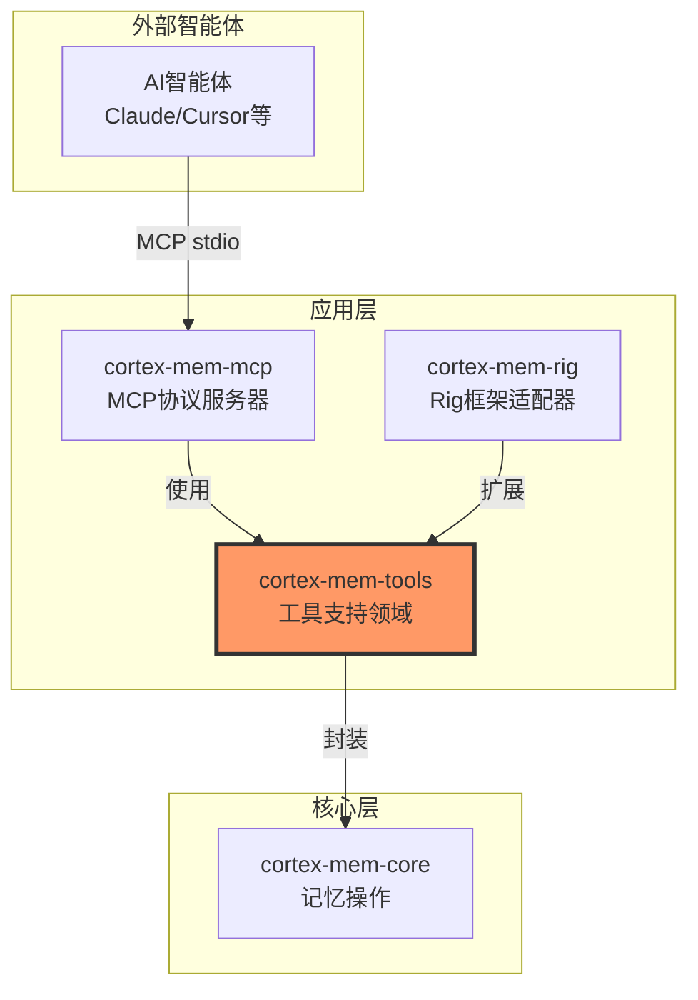
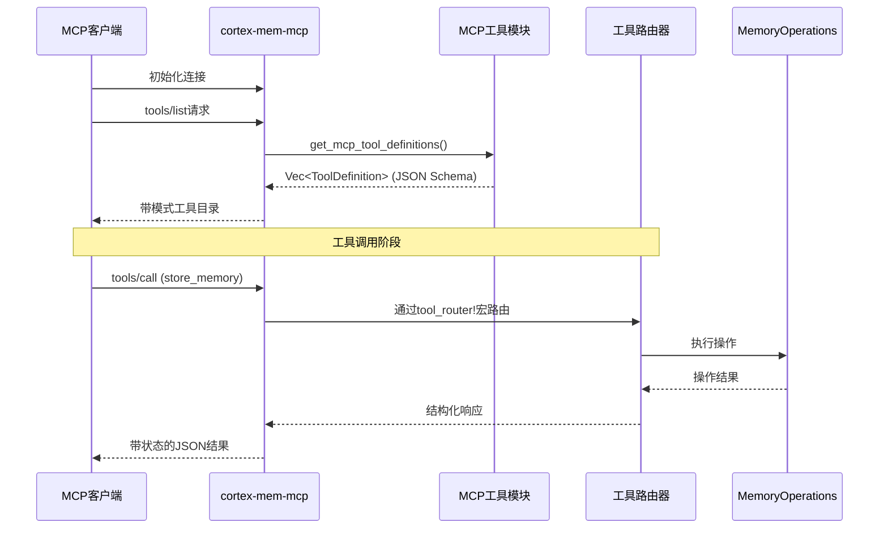
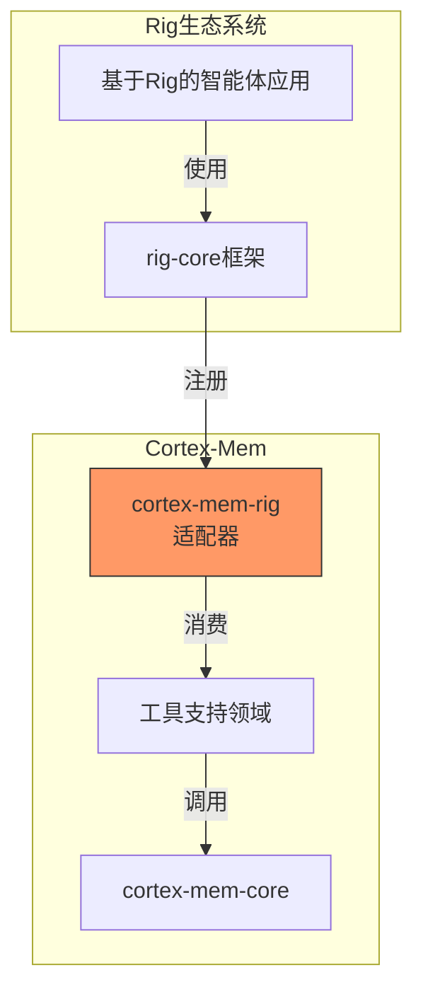
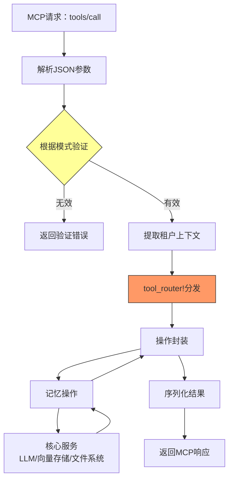

# 技术文档：工具支持领域

**生成时间:** 2026-02-19 04:10:46 (UTC)  
**时间戳:** 1771474246  

---

## 1. 概述

**工具支持领域**提供标准化工具定义和集成实用程序，使AI智能体能够通过模型上下文协议（MCP）与Cortex-Mem记忆系统交互。该领域作为AI助手框架与核心记忆管理能力之间的桥梁，将记忆操作（存储、查询、列表等）暴露为可发现、模式验证的工具。

**业务价值:**
- **标准化集成**: 使任何MCP兼容AI助手无需自定义适配器即可利用Cortex-Mem
- **类型安全**: JSON Schema定义确保跨不同智能体实现的一致参数验证
- **框架灵活性**: 将核心记忆操作抽象为可重用工具定义，可被rig-core和其他智能体框架消费
- **协议合规**: 实现MCP规范的工具发现和调用，确保与生态系统工具（Claude Desktop、IDE等）的互操作性

---

## 2. 架构定位

### 2.1 领域上下文

工具支持领域位于Cortex-Mem架构的**应用层**，位于接口实现和核心业务逻辑之间：



### 2.2 组件结构

该领域由三个主要子模块组成：

| 组件 | 路径 | 职责 |
|-----------|------|----------------|
| **MCP工具** | `/cortex-mem-tools/src/mcp/` | MCP协议JSON Schema定义和工具元数据 |
| **操作封装** | `/cortex-mem-tools/src/operations.rs` | 记忆操作的简化高级接口 |
| **Rig集成** | `/cortex-mem-rig/src/lib.rs` | 用于Rust智能体应用程序的rig-core框架适配器 |

---

## 3. MCP工具模块

### 3.1 设计理念

MCP工具模块使用Rust结构实现**声明性工具定义**，序列化为标准化的JSON Schema。此方法确保：
- 工具参数的编译时类型安全
- 符合MCP 1.0+规范的自动模式生成
- 运行时暴露前工具契约的静态验证

### 3.2 工具清单

该模块将以下记忆操作暴露为MCP工具：

| 工具名称 | 描述 | 关键参数 |
|-----------|-------------|----------------|
| `store_memory` | 带元数据将内容持久化到记忆 | `content`、`dimension`、`metadata` |
| `query_memory` | 跨记忆层执行语义搜索 | `query`、`scope`、`limit`、`threshold` |
| `list_memories` | 枚举特定维度内的记忆 | `dimension`、`filters`、`pagination` |
| `get_memory` | 通过URI检索特定记忆 | `uri` |
| `delete_memory` | 删除记忆条目和相关向量 | `uri`、`cascade` |

### 3.3 模式定义架构

工具定义遵循结构化元数据模式：

```rust
// 基于实现的概念结构
pub struct ToolDefinition {
    pub name: String,
    pub description: String,
    pub parameters: JSONSchema,      // 输入验证模式
    pub return_schema: JSONSchema,   // 输出结构定义
    pub annotations: ToolAnnotations // 速率限制、权限等
}
```

**关键功能:**
- `get_mcp_tool_definitions() -> Vec<ToolDefinition>`: 返回所有可用工具的静态向量用于智能体发现
- `get_mcp_tool_definition(name: &str) -> Option<ToolDefinition>`: 通过标识符检索特定工具元数据

### 3.4 发现流程



---

## 4. 操作封装

### 4.1 抽象层

操作封装子模块（`/cortex-mem-tools/src/operations.rs`）提供核心`MemoryOperations`服务的**简化门面**。这些封装：

- **标准化输入/输出**: 在MCP JSON负载和内部Rust类型之间转换
- **错误翻译**: 将领域特定错误映射到MCP兼容错误码
- **上下文丰富**: 自动从请求元数据注入租户ID和会话上下文
- **批量优化**: 在适用时将多个工具调用聚合为高效批量操作

### 4.2 集成模式


**关键特征:**
- **零成本抽象**: 封装使用编译时泛型以避免运行时开销
- **原生异步**: 所有操作返回`impl Future`以实现非阻塞执行
- **租户传播**: 通过MCP请求元数据自动作用域所有操作

---

## 5. Rig框架集成

### 5.1 目的

`cortex-mem-rig` crate提供与**rig-core** Rust智能体框架的一等集成，使基于Rust的AI应用程序能够将Cortex-Mem能力作为本地rig工具合并。

### 5.2 集成架构



### 5.3 实现细节

Rig集成实现来自`rig-core`的`Tool`特性，将Cortex-Mem操作映射到rig的工具执行上下文：

- **工具注册**: 所有MCP工具自动注册到rig的智能体构建器
- **类型转换**: rig的JSON Value类型与Cortex-Mem领域类型之间的双向转换
- **流式支持**: 与rig的流式补全API集成用于实时记忆操作

**关键集成点:**
- `RigMemoryTool`: 实现rig的`Tool`特性的封装结构
- `CortexMemExtension`: rig的`Agent`扩展特性以启用流畅记忆配置

---

## 6. 路由和执行流

### 6.1 工具路由器宏

工具支持领域使用声明性`tool_router!`宏将传入MCP工具调用映射到特定操作处理器：

```rust
// 概念使用模式
tool_router! {
    "store_memory" => handle_store_memory,
    "query_memory" => handle_query_memory,
    "list_memories" => handle_list_memories,
    // ...
}
```

**宏能力:**
- **静态分发**: 编译时路由表生成，实现O(1)查找复杂度
- **模式验证**: 处理器调用前自动根据ToolDefinition模式验证参数
- **错误处理**: 标准化错误转换为MCP错误响应格式

### 6.2 执行管道



---

## 7. 数据模型和模式

### 7.1 工具参数模式

**store_memory工具模式:**
```json
{
  "name": "store_memory",
  "description": "Stores content in the memory system with semantic indexing",
  "parameters": {
    "type": "object",
    "properties": {
      "content": {
        "type": "string",
        "description": "Raw content to store"
      },
      "dimension": {
        "type": "string",
        "enum": ["session", "user", "agent", "resource"],
        "description": "Memory dimension classification"
      },
      "metadata": {
        "type": "object",
        "properties": {
          "content_type": {"type": "string"},
          "tags": {"type": "array", "items": {"type": "string"}},
          "source_uri": {"type": "string"}
        }
      }
    },
    "required": ["content", "dimension"]
  }
}
```

### 7.2 响应结构

所有工具返回标准化响应信封：

```rust
pub struct ToolResponse {
    pub success: bool,
    pub data: Option<Value>,
    pub error: Option<ToolError>,
    pub metadata: ResponseMetadata,  // 执行时间、租户ID等
}
```

---

## 8. 配置和部署

### 8.1 配置接口

工具通过集中式`cortex-mem-config`系统配置：

```toml
[tools]
enabled = ["store_memory", "query_memory", "list_memories"]
default_limit = 10
max_content_length = 10000  # 字符

[tools.validation]
strict_schema = true
reject_unknown_fields = true
```

### 8.2 部署考虑

**多租户支持:**
- 工具调用自动继承MCP客户端元数据中的租户上下文
- 租户隔离在操作封装层强制执行，在到达核心服务前

**安全边界:**
- JSON Schema验证通过参数清理防止注入攻击
- 内容长度限制在工具边界强制执行
- 租户作用域防止即使工具参数被操纵也发生跨租户记忆访问

---

## 9. 使用示例

### 9.1 直接MCP集成

**工具发现:**
```bash
# 通过MCP检查器或兼容客户端
echo '{"jsonrpc": "2.0", "method": "tools/list", "id": 1}' | cortex-mem-mcp
```

**工具调用:**
```json
{
  "jsonrpc": "2.0",
  "method": "tools/call",
  "params": {
    "name": "store_memory",
    "arguments": {
      "content": "User prefers dark mode interfaces",
      "dimension": "user",
      "metadata": {
        "category": "preference",
        "confidence": 0.95
      }
    }
  },
  "id": 2
}
```

### 9.2 Rig框架集成

```rust
use cortex_mem_rig::CortexMemExtension;
use rig_core::agent::AgentBuilder;

let agent = AgentBuilder::new(model)
    .with_cortex_mem(tenant_id)
    .build();

// 智能体现在可以使用store_memory、query_memory等作为本地工具
```

---

## 10. 依赖和接口

**上游依赖:**
- `cortex-mem-core`: 核心记忆操作和类型
- `cortex-mem-config`: 工具设置配置管理
- `serde` & `schemars`: JSON序列化和模式生成

**下游消费者:**
- `cortex-mem-mcp`: 消费工具定义的MCP服务器实现
- `cortex-mem-rig`: Rig框架适配器
- 通过MCP协议的外部AI智能体

---

## 11. 错误处理

该领域实现分层错误翻译：

| 内部错误 | MCP错误码 | HTTP状态 |
|----------------|----------------|-------------|
| `MemoryNotFound` | `INVALID_URI` | 404 |
| `ValidationError` | `INVALID_PARAMS` | 400 |
| `TenantIsolationViolation` | `ACCESS_DENIED` | 403 |
| `VectorStoreUnavailable` | `INTERNAL_ERROR` | 503 |
| `LLMTimeout` | `TIMEOUT` | 504 |

---

## 12. 性能特征

- **模式生成**: 静态编译（零运行时成本）
- **工具分发**: 通过`tool_router!`生成的静态哈希映射O(1)
- **内存开销**: 每工具定义约50KB（模式元数据）
- **序列化**: 为高吞吐量场景使用`simd-json`优化

---

## 13. 未来扩展

**计划增强:**
- **流式工具**: 支持大上下文分块记忆检索
- **复合操作**: 多步骤工具工作流（如"search_and_consolidate"）
- **动态模式**: 基于租户配置的运行时模式修改
- **工具组合**: 通过内部路由链接工具的能力，无需智能体往返

---

**文档版本:** 1.0  
**领域范围:** 工具支持领域（cortex-mem-tools、cortex-mem-rig）  
**相关文档:** 核心基础设施领域、MCP服务器接口、配置管理领域
