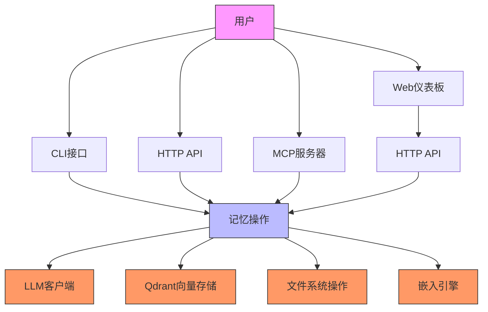
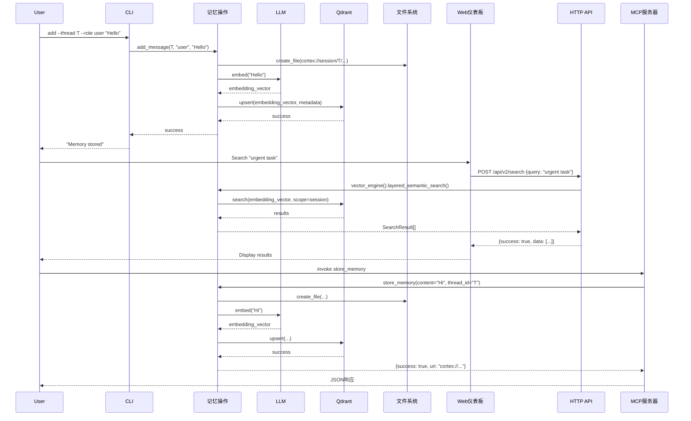

# 技术文档：应用接口领域

**项目:** Cortex-Mem  
**版本:** 1.0  
**最后更新:** 2026-02-19 04:08:52 (UTC)

---

## 1. 概述

**应用接口领域**是面向用户的Cortex-Mem记忆管理系统的网关。它提供了一个统一的抽象层，通过四种不同的交互模式暴露核心记忆操作：命令行界面（CLI）、HTTP REST API、模型上下文协议（MCP）服务器和基于Web的仪表板。

该领域实现**适配器模式**，封装中央`MemoryOperations`服务以适应不同的消费模型，同时确保所有入口点的业务逻辑、配置管理和多租户隔离的一致性。

### 1.1 关键职责
- **接口适配**: 将协议特定输入（CLI参数、JSON负载、MCP工具调用）转换领域操作
- **依赖注入**: 初始化并将核心服务（LLM、Qdrant、文件系统）连接到接口特定上下文
- **协议标准化**: 标准化URI处理（移除`cortex://`前缀）、输入验证和响应格式
- **租户上下文传播**: 跨所有接口提取和传播租户标识符以实现数据隔离

---

## 2. 架构

### 2.1 系统上下文



### 2.2 组件结构

该领域跨越四个专业项目实现：

| 接口 | 技术栈 | 主要目的 | 入口点 |
|-----------|-----------------|-----------------|-------------|
| **CLI** | Rust (clap, tokio) | 通过shell命令直接记忆管理 | `/cortex-mem-cli/src/main.rs` |
| **HTTP API** | Rust (Axum) | 用于Web/集成客户端的RESTful端点 | `/cortex-mem-service/src/main.rs` |
| **MCP服务器** | Rust (rmcp) | 通过stdio的AI助手/IDE集成 | `/cortex-mem-mcp/src/main.rs` |
| **Web仪表板** | TypeScript (Svelte) | 可视化和管理UI | `/cortex-mem-insights/src/main.ts` |

---

## 3. 接口规范

### 3.1 CLI接口 (`cortex-mem-cli`)

**实现模式**: 命令模式带异步执行  
**关键依赖**: `clap`（参数解析）、`tokio`（异步运行时）、`cortex_mem_tools`（操作）

**架构**:
- 命令处理器位于`/cortex-mem-cli/src/commands/`
- 直接调用`MemoryOperations`（同步式异步执行）
- 配置通过`config.toml`加载，带环境变量覆盖

**支持的操作**:
```rust
// 核心命令实现
commands::search::execute    // 带过滤的语义搜索
commands::session::list      // 时间线枚举
commands::add                // 记忆插入
commands::delete             // 基于URI的删除
commands::stats              // 存储指标
```

**租户处理**: CLI接受`--tenant <TENANT_ID>`标志，通过`MemoryOperations`初始化链传播标识符。

### 3.2 HTTP API服务 (`cortex-mem-service`)

**实现模式**: 分层架构带依赖注入  
**框架**: Axum (Rust Web框架)  
**基础路径**: `/api/v2`

**架构组件**:
- **路由** (`/cortex-mem-service/src/routes/`): URL路由定义
- **处理器** (`/cortex-mem-service/src/handlers/`): 请求处理逻辑
- **AppState**: 持有`MemoryOperations`实例的集中式依赖容器

**关键实现细节**:
```rust
// AppState作为依赖注入容器
pub struct AppState {
    pub memory_ops: Arc<MemoryOperations>,
    pub config: Config,
}

// 处理器注入模式
async fn search_handler(
    State(state): State<AppState>,
    Json(payload): Json<SearchRequest>,
) -> Result<Json<ApiResponse>, AppError>
```

**端点映射**:
- `POST /api/v2/search` → `vector_engine().layered_semantic_search()`
- `GET /api/v2/tenants/stats` → 存储指标聚合
- `GET /api/v2/filesystem/list` → URI浏览
- `POST /api/v2/session/message` → 对话日志

**租户提取**: HTTP Header `X-Tenant-ID`或URL路径参数，通过请求扩展注入`MemoryOperations`。

### 3.3 MCP服务器 (`cortex-mem-mcp`)

**实现模式**: 工具路由器模式  
**协议**: 模型上下文协议（MCP）over stdio传输  
**框架**: `rmcp` (Rust MCP实现)

**架构**:
- **服务定义** (`/cortex-mem-mcp/src/service.rs`): 实现MCP协议的`MemoryMcpService`结构
- **工具注册**: 使用`tool_router!`宏将`MemoryOperations`暴露为标准化工具

**暴露的工具**:
```rust
tool_router! {
    store_memory(content: String, thread_id: String) -> MemoryResult,
    query_memory(query: String, scope: String, limit: i32) -> SearchResult,
    list_memories(uri_prefix: String) -> Vec<MemoryEntry>,
    delete_memory(uri: String) -> DeletionResult,
}
```

**输入标准化**: MCP层自动在委托给核心操作前从URIs移除`cortex://`前缀，确保与其他接口的一致性。

**集成流程**:
1. AI助手（客户端）通过stdio发送JSON-RPC请求
2. `MemoryMcpService`路由到适当的工具处理器
3. 处理器调用`MemoryOperations`方法
4. 结果序列化为MCP兼容JSON响应

### 3.4 Web仪表板 (`cortex-mem-insights`)

**实现模式**: 单页应用（SPA）带API客户端  
**框架**: Svelte（前端）, TypeScript  
**通信**: 基于Fetch的HTTP客户端到`/api/v2`端点

**架构**:
- **页面** (`/cortex-mem-insights/src/lib/pages/`): 路由特定组件（Dashboard, Memories, Search）
- **API客户端** (`/cortex-mem-insights/src/lib/api.ts`): 封装HTTP调用的`ApiClient`类
- **状态管理** (`/cortex-mem-insights/src/lib/stores/tenant.ts`): 响应式租户选择store

**关键组件**:
```typescript
// ApiClient提供类型安全的HTTP抽象
class ApiClient {
    async search(query: string, scope: string): Promise<SearchResult[]>;
    async getTenantStats(): Promise<TenantMetrics>;
    async listMemories(uri: string): Promise<MemoryList>;
}

// 租户感知请求headers
headers: {
    'X-Tenant-ID': currentTenant.id,
    'Content-Type': 'application/json'
}
```

**UI流程**:
- 租户选择触发全局状态更新
- 所有后续API调用包含租户上下文
- 结果通过Svelte响应式组件渲染，带实时更新

---

## 4. 集成模式

### 4.1 共享核心依赖

所有接口维护`MemoryOperations`的**每进程单例**实例，使用相同配置初始化：

```rust
// CLI、HTTP和MCP间通用初始化模式
let memory_ops = MemoryOperations::new(
    llm_client,
    qdrant_store,
    filesystem,
    embedding_client,
    config.automation,
)?;
```

这确保：
- 跨接口一致的向量维度和LLM模型
- 统一文件系统路径解析（`cortex://` URI处理）
- Qdrant和LLM API的共享连接池

### 4.2 请求流序列



### 4.3 多租户隔离

所有接口实现一致的租户提取策略：

| 接口 | 租户源 | 传播机制 |
|-----------|--------------|---------------------|
| CLI | `--tenant`参数 | 命令上下文 → MemoryOperations构造器 |
| HTTP API | Header `X-Tenant-ID` | Axum State → Qdrant集合后缀 |
| MCP | 初始化元数据 | 会话上下文 → 文件系统路径作用域 |
| Web仪表板 | UI选择器 + API header | 全局store → HTTP headers |

**实现细节**: `QdrantConfig::with_tenant_id()`方法动态为集合名称添加后缀（如`cortex-mem-{tenant_id}`），而`CortexFilesystem`将目录限定到`/data/tenants/{tenant_id}/`。

---

## 5. 错误处理和可观察性

### 5.1 错误处理策略

**Rust组件**（CLI、HTTP、MCP）：
- **库**: `anyhow`用于错误上下文传播
- **HTTP特定**: `AppError`类型将领域错误转换为HTTP状态码（4xx/5xx）
- **MCP特定**: 协议兼容错误码带描述性消息

**TypeScript组件**（Web仪表板）：
- **ApiResponse封装**: 标准化信封`{success: boolean, data: T, error?: string}`
- **前端错误边界**: Svelte处理API失败的错误处理

### 5.2 可观察性

- **追踪**: `tracing`crate集成跨所有Rust二进制用于结构化日志
- **请求ID**: HTTP API生成UUID用于跨栈请求追踪
- **指标**: 端点延迟和错误率通过`/api/v2/health`和`/api/v2/stats`暴露

---

## 6. 配置和部署

### 6.1 配置加载

所有接口通过`cortex-mem-config`加载配置，优先级如下：
1. 环境变量（如`CORTEX_LLM_API_KEY`）
2. TOML配置文件（`config.toml`）
3. 合理默认值（嵌入二进制）

**必需配置**:
```toml
[llm]
model = "gpt-4"
api_key = "${OPENAI_API_KEY}"

[qdrant]
url = "http://localhost:6334"
collection = "cortex-mem"

[embeddings]
endpoint = "https://api.openai.com/v1/embeddings"
dimensions = 1536
```

### 6.2 部署模式

**单节点部署**:
```bash
# 终端1：启动API服务器
cargo run --bin cortex-mem-service -- --port 3000

# 终端2：启动MCP服务器（stdio）
cargo run --bin cortex-mem-mcp

# 终端3：CLI操作
cortex-mem-cli search --query "project requirements" --tenant acme-corp
```

**容器化部署**:
- HTTP服务：暴露端口3000，需要Qdrant和LLM API连接
- MCP服务器：作为sidecar容器运行，带stdio桥接
- Web仪表板：通过nginx提供静态文件或嵌入HTTP服务

---

## 7. 开发指南

### 7.1 添加新接口

实现新交互模式（如gRPC、WebSocket）时：
1. 在工作空间根创建新crate
2. 导入`cortex-mem-tools`以访问`MemoryOperations`
3. 通过`cortex-mem-config`实现配置加载
4. 确保入口点提取租户上下文
5. 标准化输入（URI前缀剥离、验证）在调用核心操作前

### 7.2 接口一致性要求

所有接口必须：
- 支持`--tenant`或等效租户作用域机制
- 返回标准化URI格式（`cortex://dimension/id`）
- 透明处理L0/L1/L2层抽象（委托给核心）
- 为LLM/向量存储失败实现相同重试逻辑

### 7.3 测试策略

- **集成测试**: 使用HTTP API作为端到端流的主要测试表面
- **CLI测试**: 基于shell的测试用于命令解析和文件系统交互
- **MCP测试**: 通过stdio模拟的JSON-RPC fixture测试
- **Web UI**: 使用模拟`ApiClient`的组件测试

---

## 8. 总结

**应用接口领域**成功地将Cortex-Mem核心引擎的复杂性抽象到四个专用接口后面。通过在协议处理（HTTP、MCP、CLI）和业务逻辑之间保持严格分离，该架构实现：

- **协议灵活性**: 新接口可以添加而不修改核心领域
- **运营一致性**: CLI脚本、Web应用程序和AI助手之间的行为相同
- **可扩展隔离**: 多租户支持在每个接口边界强制执行
- **可维护性**: 共享`MemoryOperations`门面减少代码重复，同时确保业务规则的统一应用

该领域作为外部消费者与Cortex-Mem平台丰富记忆管理能力之间的关键桥梁，遵循**端口和适配器**（六边形架构）的架构原则。
