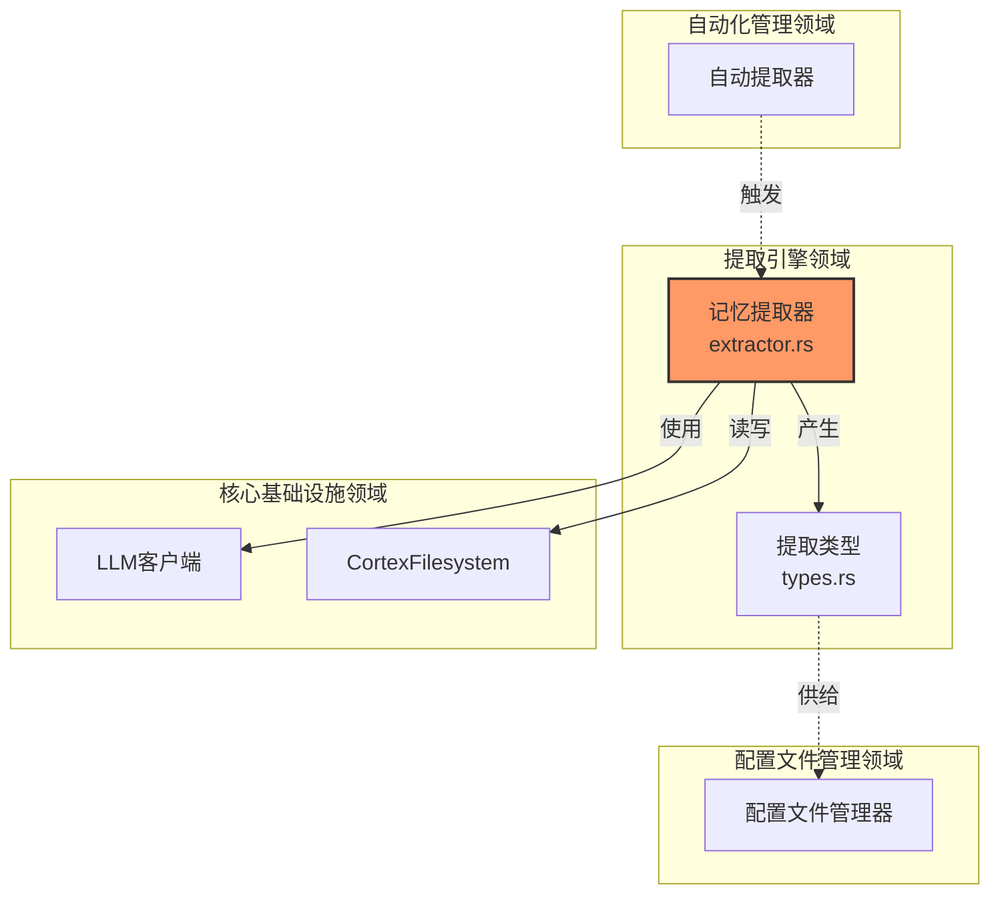
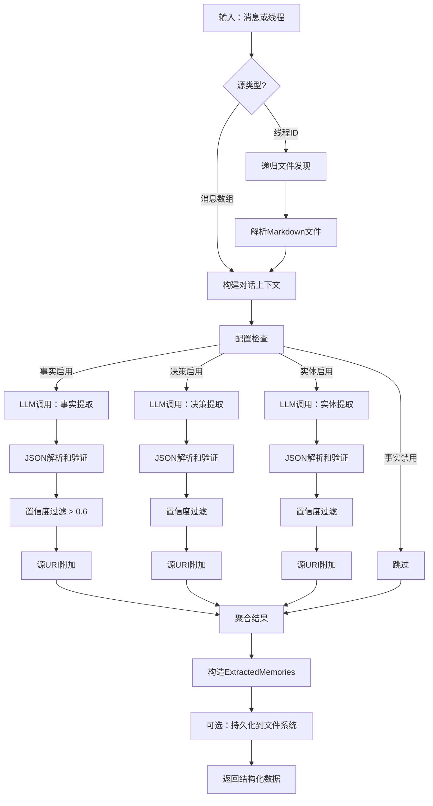
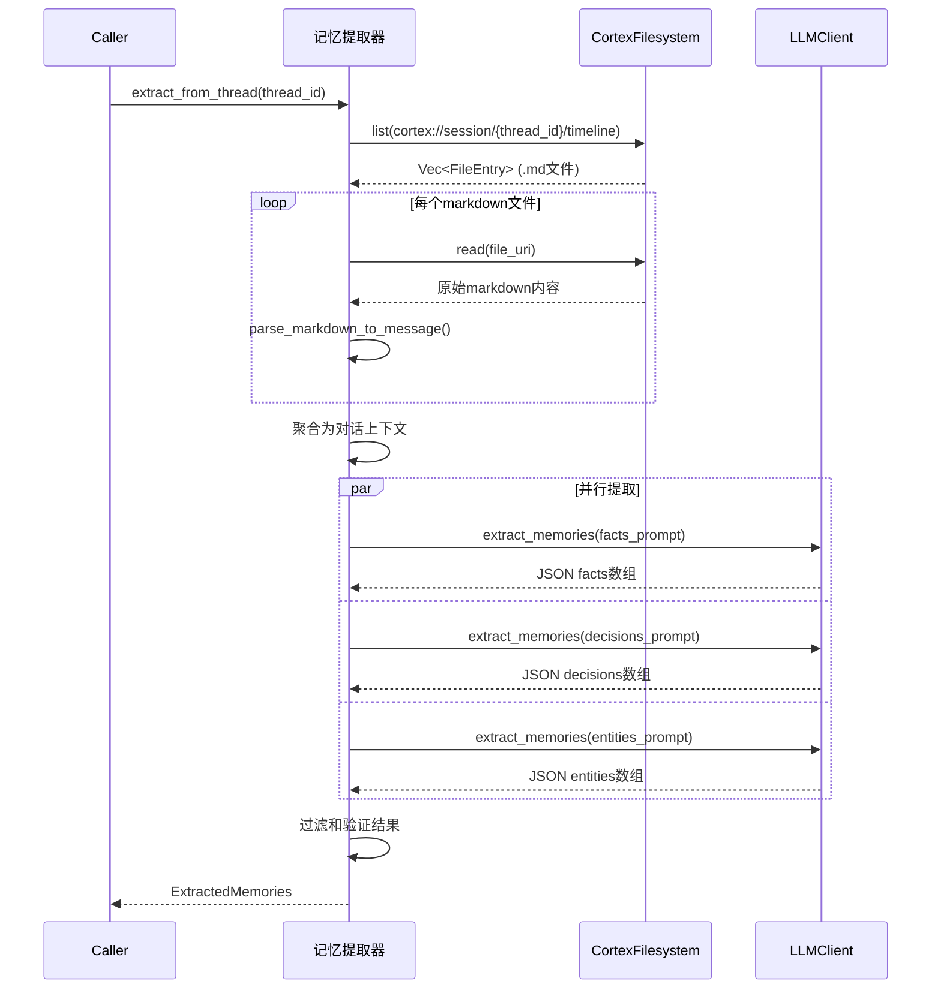
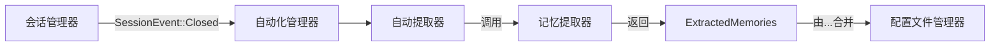

# 提取引擎领域技术文档

**生成时间:** 2026-02-19 04:05:26 (UTC)  
**版本:** 1.0.0  
**领域分类:** 核心业务领域  
**复杂度评分:** 8.0/10  
**业务关键性:** 8.0/10  

---

## 1. 领域概述

**提取引擎领域**是Cortex-Mem内的一个专门认知处理层，负责将非结构化对话数据转换为可查询的结构化知识表示。该领域实现智能自然语言处理（NLP）管道，从AI智能体对话中识别、分类和提取语义 artifacts——具体为**事实**、**决策**和**实体**。

### 1.1 业务价值主张

该领域通过以下方式解决AI系统中的知识持久化基本挑战：

- **语义结构化**: 将自由形式对话转换为带元数据的类型化知识对象（事实、决策、实体）
- **归属保留**: 通过源URI跟踪保持溯源，实现可审计性和上下文检索
- **置信度评分**: 使用可配置置信度阈值（默认：0.6）过滤低质量提取
- **跨会话学习**: 通过记忆提取和画像流程实现持久的用户和智能体个性化

### 1.2 架构位置

在Cortex-Mem架构中，提取引擎作为**核心业务领域**运行，封装在`cortex-mem-core`中。它作为原始对话数据（L2细节层）和结构化配置文件知识之间的主要桥梁。



---

## 2. 核心组件

### 2.1 记忆提取器 (`cortex-mem-core/src/extraction/extractor.rs`)

**记忆提取器**是主要的编排组件，实现为带有文件系统和LLM操作依赖注入的Rust结构体。

#### 2.1.1 结构定义

```rust
pub struct MemoryExtractor {
    fs: Arc<dyn CortexFilesystem>,
    llm: Arc<dyn LLMClient>,
    config: ExtractionConfig,
}
```

**依赖:**
- **CortexFilesystem**: 抽象读取对话线程和持久化提取结果的存储操作
- **LLMClient**: 用于生成提取操作的OpenAI兼容接口
- **ExtractionConfig**: 控制提取类型（事实、决策、实体）和质量阈值的特性标志

#### 2.1.2 公共接口

| 方法 | 签名 | 目的 |
|--------|-----------|---------|
| `extract_from_messages` | `async fn(&self, thread_id: &str, messages: &[Message]) -> Result<ExtractedMemories>` | 从内存消息数组直接提取 |
| `extract_from_thread` | `async fn(&self, thread_id: &str) -> Result<ExtractedMemories>` | 从markdown时间线的递归文件系统提取 |
| `save_extraction` | `async fn(&self, thread_id: &str, extraction: &ExtractedMemories) -> Result<()>` | 提取结果持久化到`cortex://session/{thread_id}/extractions/` |

### 2.2 提取类型 (`cortex-mem-core/src/extraction/types.rs`)

定义带强类型和序列化支持的结构化记忆artifacts领域模型。

#### 2.2.1 核心数据结构

```rust
pub struct ExtractedMemories {
    pub facts: Vec<ExtractedFact>,
    pub decisions: Vec<ExtractedDecision>,
    pub entities: Vec<ExtractedEntity>,
    pub source_thread_id: String,
    pub extracted_at: DateTime<Utc>,
}

pub struct ExtractedFact {
    pub content: String,
    pub category: FactCategory,  // Personal, Professional, Preference, etc.
    pub confidence: f32,         // 0.0 - 1.0
    pub source_uris: Vec<String>,
    pub importance: i32,         // 1-10 scale
}

pub struct ExtractedDecision {
    pub content: String,
    pub context: String,
    pub confidence: f32,
    pub participants: Vec<String>,
    pub source_uris: Vec<String>,
}

pub struct ExtractedEntity {
    pub name: String,
    pub entity_type: EntityType,  // Person, Organization, Technology, etc.
    pub relationships: Vec<Relationship>,
    pub confidence: f32,
}
```

---

## 3. 提取工作流

### 3.1 主要提取管道

提取引擎实现可配置的并行管道处理对话数据：



### 3.2 基于线程的提取序列

在文件系统-based对话线程上操作时，提取器在LLM处理前执行I/O操作：



### 3.3 置信度评分和质量保证

该领域实现多层质量控制机制：

1. **LLM置信度**: 底层模型根据响应概率提供置信度评分
2. **阈值过滤**: 可配置的`min_confidence`参数（默认：0.6）过滤不确定提取
3. **结构验证**: JSON模式验证确保领域对象构造前的类型安全
4. **源归属**: 每个提取维护对其源URI的可追溯性

---

## 4. 技术实现细节

### 4.1 提示工程策略

提取引擎利用领域特定提示模板引导LLM输出：

- **事实提示**: 聚焦关于用户的客观陈述（"用户喜欢深色模式"、"用户在X公司工作"）
- **决策提示**: 捕获承诺陈述和商定行动（"决定使用PostgreSQL"、"安排周二会议"）
- **实体提示**: 识别命名实体及其关系（"提到项目Alpha"、"引用Q4预算"）

所有提示强制JSON输出模式，带类型字段以供程序化解析。

### 4.2 批量处理和性能

优化token使用和API成本：

- **消息批量**: 每次LLM调用最多处理50条消息，以最大化上下文窗口利用
- **并行提取**: 使用`try_join!`宏并发执行事实、决策和实体提取
- **延迟评估**: 仅提取配置的记忆类型（通过`ExtractionConfig`标志控制）

### 4.3 错误处理和弹性

该领域实现优雅降级策略：

```rust
// 非JSON LLM响应的回退解析
fn parse_with_fallback(raw_response: &str) -> Result<ExtractedMemories, Error> {
    match serde_json::from_str(raw_response) {
        Ok(parsed) => Ok(parsed),
        Err(_) => parse_markdown_fallback(raw_response), // 基于正则的提取
    }
}
```

- **部分成功**: 如果一种提取类型失败（如实体），事实和决策仍返回
- **文件系统弹性**: 缺失或损坏的消息文件跳过并记录警告，非致命错误

---

## 5. 集成模式

### 5.1 自动化集成

提主要由自动化管理领域的**自动提取器**（`automation/auto_extract.rs`）消费：



**集成点**: 当对话会话关闭时，自动化管道触发`extract_from_thread()`以增量更新用户和智能体配置文件。

### 5.2 配置文件管理集成

提取的记忆通过以下方式流入配置文件管理领域：

- **事实聚合**: `UserProfile::add_fact()`合并新事实带去重逻辑
- **决策历史**: `AgentProfile::add_decision()`维护智能体学习历史
- **类别执行**: 配置文件管理器强制限制（如每类别最多100个事实）以防止配置文件膨胀

### 5.3 外部API表面

虽然主要内部使用，但提取能力通过以下方式暴露：

- **MCP工具**: `extract_memories`工具允许AI助手请求按需提取
- **HTTP API**: `/api/v2/sessions/{id}/extract`端点用于手动提取触发
- **CLI命令**: `cortex-mem extract --thread <id>`用于管理操作

---

## 6. 配置和部署

### 6.1 配置模式

提取行为通过`ExtractionConfig`控制：

```toml
[extraction]
enabled = true
min_confidence = 0.6
extract_facts = true
extract_decisions = true
extract_entities = true
max_messages_per_batch = 50
```

### 6.2 租户隔离

作为多租户架构的一部分：

- **文件系统作用域**: 提取存储在`cortex://session/{thread_id}/extractions/`下，带租户特定解析
- **向量存储**: 面向语义搜索的提取内容继承租户感知集合命名（`cortex-mem-{tenant_id}`）
- **配置文件作用域**: 合并配置文件遵守租户边界，防止跨租户知识泄漏

---

## 7. 使用示例

### 7.1 直接消息提取

```rust
let extractor = MemoryExtractor::new(fs, llm, config);
let messages = vec![
    Message::new(Role::User, "I prefer Python over JavaScript"),
    Message::new(Role::Assistant, "Noted. I'll prioritize Python examples."),
];

let extracted = extractor.extract_from_messages("thread-123", &messages).await?;

for fact in extracted.facts {
    println!("Fact: {} (confidence: {})", fact.content, fact.confidence);
}
```

### 7.2 基于线程的提取带持久化

```rust
// 从文件系统线程提取
let memories = extractor.extract_from_thread("session-456").await?;

// 保存到文件系统用于审计跟踪
extractor.save_extraction("session-456", &memories).await?;

// 结果存储在：cortex://session/session-456/extractions/{timestamp}.md
```

---

**相关文档:**
- [自动化管理领域](./automation-management.md)
- [配置文件管理领域](./profile-management.md)
- [会话管理领域](./session-management.md)
- [LLM集成指南](./llm-client.md)
