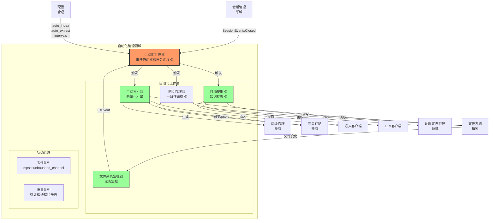
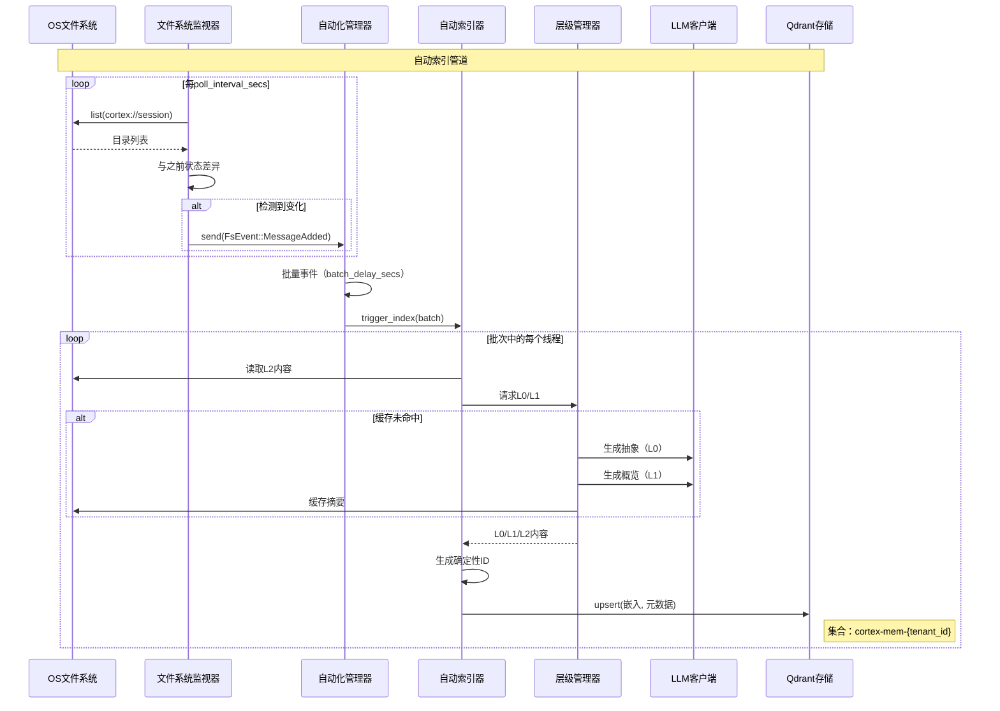
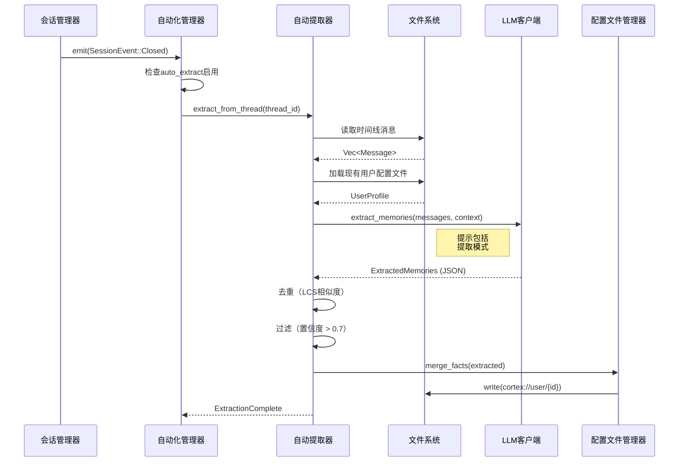

# 自动化管理领域

**技术实现文档**

---

## 1. 概述

**自动化管理领域**是Cortex-Mem内的核心业务领域，协调后台自动化任务以维护基于文件系统的记忆存储和向量数据库（Qdrant）之间的一致性。该领域实现事件驱动架构，实现对数据变化的实时响应，同时通过智能批处理和节流优化资源利用。

### 1.1 业务价值
自动化层通过以下方式消除手动同步开销：
- **自动索引**: 检测新的或修改的对话文件并生成可搜索向量嵌入
- **智能提取**: 自动从已完成的会话中提取结构化知识（事实、决策、实体）以丰富用户和智能体配置文件
- **同步**: 确保重启或手动编辑后文件系统状态和向量存储之间的最终一致性
- **层级生成**: 从原始L2（细节）内容动态生成L0（抽象）和L1（概览）摘要

### 1.2 架构位置
自动化管理领域位于**会话管理领域**（发出生命周期事件）和**核心基础设施领域**（提供存储和LLM服务）之间。它消费事件总线的事件并协调多个专业工作者执行异步后台处理。

---

## 2. 系统架构

### 2.1 组件结构



### 2.2 关键设计模式

**事件驱动编排**: `AutomationManager`作为中央协调器，通过异步通道监听`CortexEvent`类型（FilesystemEvent、SessionEvent），将事件生产者与消费者解耦。

**轮询vs推送**: 文件系统监视器实现轮询机制（默认5秒间隔）而非OS级文件监视，确保跨平台和网络文件系统兼容性。

**批量处理**: 检测到的变化排队并批量处理（默认2秒延迟），以防止高速写入期间过多的LLM API调用和向量存储操作。

**延迟初始化**: 自动化工作者根据配置标志（`auto_index`、`auto_extract`）按需初始化。

---

## 3. 组件规范

### 3.1 自动化管理器 (`automation/manager.rs`)

**职责**: 所有自动化活动的中央协调器。管理自动化工作者生命周期并将事件路由到适当的处理器。

**关键功能**:
- `AutomationManager::start()`: 初始化事件监听器并开始事件处理循环
- `AutomationManager::handle_event()`: 根据事件类型和配置将事件路由到特定工作者
- `AutomationManager::shutdown()`: 优雅终止自动化工作者

**配置依赖**:
```rust
pub struct AutomationConfig {
    pub auto_index: bool,          // 启用自动索引
    pub auto_extract: bool,        // 启用会话关闭时记忆提取
    pub index_on_message: bool,    // 消息添加时索引（默认：true）
    pub index_on_close: bool,      // 会话关闭时索引（默认：true）
    pub poll_interval_secs: u64,   // 文件系统轮询频率（默认：5）
    pub batch_delay_secs: u64,     // 索引批量窗口（默认：2）
    pub sync_on_startup: bool,     // 系统启动时运行完整同步
    pub auto_generate_layers_on_startup: bool,  // 启动时生成L0/L1（默认：false）
    pub generate_layers_every_n_messages: usize, // 定期L0/L1生成（0 = 禁用）
}
```

### 3.2 文件系统监视器 (`automation/watcher.rs`)

**职责**: 使用轮询机制监视`cortex://session`目录中对话文件（`.md`格式）的变化。

**实现细节**:
- **轮询策略**: 对`cortex://session/{thread_id}/timeline`路径递归遍历目录
- **状态跟踪**: 维护内存中`HashMap<ThreadId, Vec<MessageId>>`以检测添加、修改或删除
- **事件生成**: 发出`FsEvent`变体：
  - `MessageAdded { thread_id, message_id }`
  - `MessageUpdated { thread_id, message_id }`
  - `ThreadDeleted { thread_id }`

**并发模型**:
```rust
// 轮询循环的伪代码表示
loop {
    tokio::select! {
        _ = interval.tick() => {
            let changes = scan_filesystem().await;
            for change in changes {
                event_sender.send(change).await?;
            }
        }
        _ = shutdown_signal => break
    }
}
```

**错误处理**: 非阻塞错误传播；失败的扫描用`tracing::warn!`记录并在下一轮询周期重试。

### 3.3 自动索引器 (`automation/indexer.rs`)

**职责**: 将基于文件系统的对话线程转换为Qdrant中可向量搜索的嵌入。

**处理管道**:
1. **接收触发**: 从自动化管理器消费`FsEvent`
2. **批量累积**: 为`batch_delay_secs`累积事件以分组相关变化
3. **内容检索**: 通过`CortexFilesystem`读取原始L2内容
4. **层级生成**: 如果未缓存，调用`LayerManager`生成L0（抽象）和L1（概览）摘要
5. **向量化**: 通过`EmbeddingClient`生成嵌入
6. **Upsert操作**: 将向量存储到Qdrant，带租户感知集合命名（`cortex-mem-{tenant_id}`）
7. **ID生成**: 使用来自URI +层类型的确定性向量ID（如`session/123#l0`）

**关键功能**:
- `AutoIndexer::index_thread(thread_id: &str)`: 索引特定对话线程
- `AutoIndexer::index_batch(threads: Vec<ThreadId>)`: 原子处理多个线程
- `AutoIndexer::regenerate_layers(thread_id: &str)`: 强制重新生成L0/L1摘要
- `AutoIndexer::index_timeline_layers(thread_id: &str)`: 索引会话时间线的L0/L1层级文件

**时间线层级索引**:
自动索引器还支持索引会话时间线目录中的L0/L1层级文件：
- 扫描 `cortex://session/{thread_id}/timeline` 目录结构
- 为每个包含 `.abstract.md` 和 `.overview.md` 的目录生成向量索引
- 使用目录URI而非文件URI作为向量ID，确保层级文件正确关联

**性能考虑**:
- 为LLM API速率限制实现指数退避
- 使用分块批量处理嵌入生成（每次请求最多100个文本）

### 3.4 自动提取器 (`automation/auto_extract.rs`)

**职责**: 从已完成的对话会话中提取结构化知识并合并到用户/智能体配置文件。

**触发条件**:
- 监听`SessionEvent::Closed`事件
- 尊重每租户`auto_extract`配置标志

**提取工作流**:
1. **上下文组装**: 递归读取会话时间线中的所有`.md`消息
2. **配置文件上下文**: 加载现有用户/智能体配置文件以避免重复提取
3. **LLM调用**: 发送结构化提示到`LLMClient`请求提取：
   - `ExtractedFact`: 关于用户的事实陈述
   - `ExtractedDecision`: 对话期间做出的决策
   - `ExtractedEntity`: 命名实体及其关系
4. **后处理**:
   - 置信度评分（过滤阈值：0.7）
   - 使用最长公共子序列（LCS）相似度去重
   - 基于类别的重要性排序
5. **配置文件合并**: 使用新知识更新`UserProfile`或`AgentProfile`
6. **持久化**: 将更新的配置文件写入`cortex://user/{id}`或`cortex://agent/{id}`

**关键功能**:
- `AutoExtractor::extract_from_thread(thread_id: &str)`: 主要提取入口点
- `AutoExtractor::merge_profile(profile: &mut UserProfile, memories: ExtractedMemories)`: 去重和合并逻辑

### 3.5 同步管理器 (`automation/sync.rs`)

**职责**: 执行文件系统和向量存储之间的完整一致性检查，通常在系统启动或管理员请求时调用。

**同步策略**:
- **完整同步**: 扫描所有租户目录并协调文件系统状态与Qdrant向量
- **租户同步**: 限于特定租户ID范围
- **修复模式**: 检测孤立向量（存在于Qdrant但不存在于文件系统）并删除

**操作使用**:
```rust
// 示例管理调用
sync_manager.sync_all().await?;           // 完整系统同步
sync_manager.sync_tenant(tenant_id).await?; // 作用域同步
```

---

## 4. 数据流和工作流

### 4.1 记忆索引工作流



### 4.2 记忆提取工作流



---

## 5. 配置和部署

### 5.1 配置模式

自动化行为通过`cortex-mem.toml`中的`[automation]`部分控制：

```toml
[automation]
# 启用新文件自动索引
auto_index = true

# 会话关闭时启用自动提取
auto_extract = true

# 文件系统轮询间隔（秒）
poll_interval_secs = 5

# 批量处理延迟以分组快速变化
batch_delay_secs = 2

# 启动时执行完整同步
sync_on_startup = false

# 最大并发索引操作
max_concurrent_indexes = 10

# 提取置信度阈值（0.0 - 1.0）
extraction_confidence_threshold = 0.7
```

### 5.2 多租户考虑

在多租户部署中：
- **隔离**: 每个租户的自动化管道在租户作用域URI上操作（`cortex://session`解析到`/data/tenants/{tenant_id}/session`）
- **集合命名**: 自动索引器自动为Qdrant集合名称添加租户ID后缀
- **资源限制**: 配置每租户LLM API调用速率限制以防止成本激增

### 5.3 操作监控

**要监控的指标**:
- `automation.filesystem.poll_duration_ms`: 轮询延迟
- `automation.indexer.threads_processed`: 吞吐量指标
- `automation.indexer.llm_errors`: 失败的层级生成尝试
- `automation.extractor.extraction_count`: 知识提取量
- `automation.queue.depth`: 待处理批量队列大小

**健康检查**:
- 自动化管理器心跳：确保事件循环未被阻塞
- 监视器滞后检测：如果`last_poll_timestamp`超过`poll_interval_secs * 2`则告警

---

## 6. 集成点

### 6.1 上游依赖（生产者）
- **会话管理领域**: 发出`SessionEvent::Closed`以触发提取
- **文件系统抽象**: 提供对`cortex://` URIs的读写访问
- **配置管理**: 提供自动化标志和间隔

### 6.2 下游依赖（消费者）
- **层级管理领域**: 索引期间生成L0/L1摘要
- **向量存储领域**: 在Qdrant中持久化嵌入
- **配置文件管理领域**: 存储提取的知识
- **LLM客户端**: 提供用于摘要和提取的文本补全
- **嵌入客户端**: 生成向量表示

### 6.3 接口暴露
虽然主要是后台领域，自动化管理领域通过以下方式暴露管理控制：
- **CLI**: `cortex-mem sync`命令触发`SyncManager::sync_all()`
- **HTTP API**: `POST /api/v2/admin/sync`端点用于按需同步
- **MCP工具**: `force_index`和`force_extract`工具用于调试

---

## 7. 错误处理和弹性

### 7.1 故障隔离
- **工作者隔离**: 自动索引器中的故障不会使自动提取器崩溃
- **租户隔离**: 一个租户中的处理错误不影响其他租户
- **断路器**: LLM API故障的自动退避（带抖动的指数退避）

### 7.2 恢复机制
- **幂等操作**: 索引同一线程两次产生相同向量ID（来自URI的确定性UUID生成），防止重复
- **检查点**: 同步管理器跟踪最后成功同步时间戳以启用增量恢复
- **死信队列**: 失败的提取记录线程ID以供手动重试

### 7.3 日志和可观察性
使用`tracing`的结构化日志：
```rust
info!(
    thread_id = %thread_id,
    tenant_id = %tenant_id,
    layers_generated = count,
    "Successfully indexed thread"
);

warn!(
    thread_id = %thread_id,
    error = %e,
    "Failed to generate L0 abstract, retrying"
);
```

---

## 8. 实现指南

### 8.1 添加新的自动化工作者
要使用新后台任务扩展自动化领域：

1. **定义事件类型**: 在`events.rs`中的`CortexEvent`枚举添加变体
2. **实现工作者**: 在`automation/`中创建模块实现处理逻辑
3. **在管理器中注册**: 在`AutomationManager::handle_event()`中添加处理器
4. **配置**: 在`AutomationConfig`中添加启用标志

### 8.2 性能调优
- **高容量系统**: 增加`batch_delay_secs`以累积每次LLM调用的更多变化
- **低延迟需求**: 减少`poll_interval_secs`（权衡：更高CPU使用）
- **成本优化**: 禁用`auto_extract`或提高置信度阈值以减少LLM调用

### 8.3 测试策略
- **单元测试**: 使用特性抽象模拟LLM和向量存储依赖
- **集成测试**: 使用临时目录和内存Qdrant实例
- **负载测试**: 验证高文件系统变化（1000+文件/秒）下的批量队列行为

---

## 9. 结论

自动化管理领域代表Cortex-Mem的"智能后台工作者"，不断将原始对话数据转换为结构化、可搜索的知识。通过将事件驱动架构与健壮的批处理策略相结合，它在实时响应性和成本高效资源利用之间取得平衡。该领域的模块化设计允许索引和提取能力的独立扩展，同时保持适合SaaS部署的严格租户隔离。

**关键技术成就**:
- 确定性向量ID生成防止重复索引
- 可配置批处理优化LLM API成本
- 事件驱动解耦实现自动化工作者的水平扩展
- 全面的错误处理确保外部服务中断期间的系统稳定性

---

**文档信息**
- **领域**: 自动化管理
- **系统**: Cortex Memory (cortex-mem)
- **语言**: Rust (tokio异步运行时)
- **相关领域**: 核心基础设施、会话管理、层级管理、配置文件管理
