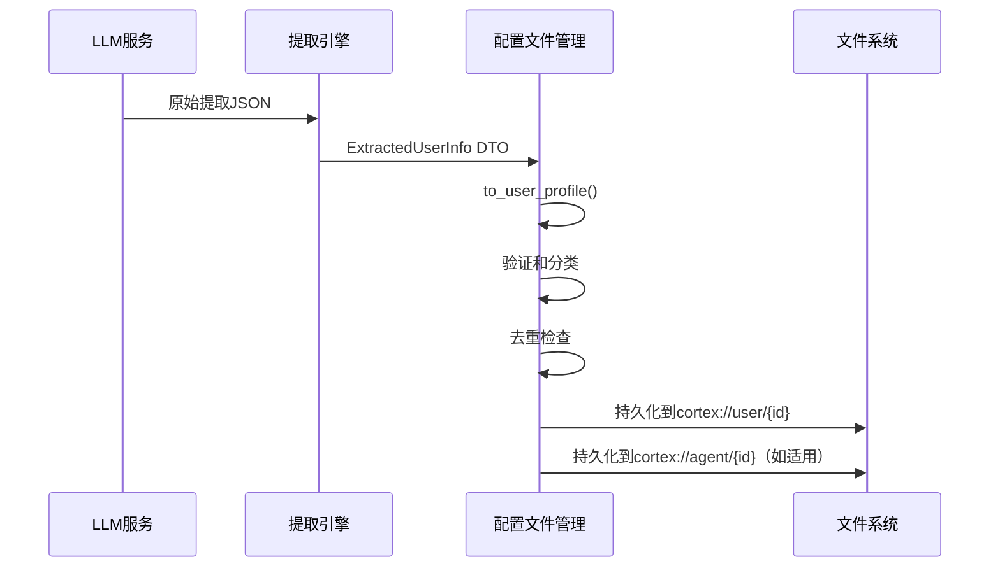

# 配置文件管理领域技术文档

## 1. 领域概述

**配置文件管理领域**是Cortex-Mem系统中负责聚合、验证和持久化从对话记忆提取的结构化用户和智能体配置文件的核心业务领域。该领域实现了一个分类知识存储系统，使AI智能体能够跨会话保持持久化、上下文感知的个性化。

该领域作为用户特定知识（偏好、目标、个人历史）和智能体特定学习（决策、技能）的持久记忆层，确保提取的见解跨越会话边界并有助于累积智能。

## 2. 架构位置

在Cortex-Mem分层架构中，配置文件管理领域位于**核心业务领域**层，封装在`cortex-mem-core` crate中。它保持与以下领域的紧密集成：

- **提取引擎领域**: 消费从LLM对话分析生成的结构化提取输出（`ExtractedUserInfo`）
- **自动化管理领域**: 接收会话关闭事件时来自`AutoExtractor`的触发更新
- **核心基础设施领域**: 使用文件系统抽象（`cortex://` URI方案）进行持久存储，使用事件总线进行变更通知

```
领域依赖流：
提取引擎 → 配置文件管理 → 核心基础设施
      （原始数据）   （聚合）       （持久化）
```

## 3. 核心数据结构

该领域实现三层数据转换管道，确保数据完整性和溯源跟踪：

### 3.1 ExtractedUserInfo（DTO层）
LLM提取输出的原始反序列化目标。包含验证和分类前的非结构化候选事实。

### 3.2 UserInfoItem（实体层）
验证的、带版本的数据点，带完整溯源元数据：
- **内容**: 事实陈述或偏好
- **类别**: 分类（PersonalInfo、WorkHistory、Preferences、Relationships、Goals）
- **置信度**: 浮点分数钳制到[0.0, 1.0]，表示提取确定性
- **重要性**: 整数排名钳制到[0, 10]，表示重要性
- **来源跟踪**: `source_session`、`extracted_at`、`updated_at`时间戳
- **版本控制**: 增量版本计数器用于冲突解决

### 3.3 UserProfile（聚合根）
管理类别隔离的`UserInfoItem`向量的容器：
```rust
// 概念结构
UserProfile {
    personal_info: Vec<UserInfoItem>,
    work_history: Vec<UserInfoItem>,
    preferences: Vec<UserInfoItem>,
    relationships: Vec<UserInfoItem>,
    goals: Vec<UserInfoItem>,
    // 元数据: created_at, updated_at, version
}
```

## 4. 配置文件类别

该领域将知识组织成五个语义类别，以优化检索和上下文注入：

| 类别 | 描述 | 示例数据 |
|----------|-------------|--------------|
| **PersonalInfo** | 人口统计、标识符、静态属性 | "用户更喜欢邮件而非Slack"、"时区：PST" |
| **WorkHistory** | 职业背景、项目上下文 | "曾在Cortex-Mem索引上工作"、"Rust专业知识" |
| **Preferences** | 行为模式、界面选择 | "偏好简洁回复"、"深色模式偏好" |
| **Relationships** | 社会联系、组织上下文 | "向工程经理汇报"、"与设计团队协作" |
| **Goals** | 目标、愿望、任务跟踪 | "学习Rust异步模式"、"Q2交付：文档" |

*注意：智能体配置文件使用并行结构，专注于特定于学习技能和决策历史的类别。*

## 5. 数据验证和版本控制

### 5.1 输入验证
该领域在`add_item()`操作期间在边界执行严格验证：
- **置信度钳制**: [0.0, 1.0]外的值钳制到最近边界
- **重要性边界**: [0, 10]外的值使用`min(10, max(0, value))`约束
- **内容清理**: 空白修剪和规范化

### 5.2 乐观版本控制
每个`UserInfoItem`维护内部版本计数器：
- 初始版本：1
- 每次更新同一语义项时递增（去重匹配）
- 启用合并来自不同会话的配置文件时的冲突解决

### 5.3 时间元数据
- **`extracted_at`**: 初始提取的UTC时间戳（不可变）
- **`updated_at`**: 最后修改的UTC时间戳（合并时更新）
- **`source_session`**: 源自对话的URI引用（`cortex://session/{id}`）

## 6. 关键操作

### 6.1 配置文件构建
**`to_user_profile(source_session: String) -> UserProfile`**
将原始`ExtractedUserInfo`转换为验证的`UserProfile`：
1. 按类别迭代提取结果
2. 为每个事实构造`UserInfoItem`，带当前UTC时间戳
3. 对置信度和重要性应用验证钳制
4. 初始化版本控制元数据

### 6.2 类别管理
**`add_item(category: Category, item: UserInfoItem)`**
- 验证输入边界
- 附加到适当类别向量
- 更新聚合时间戳
- 如果配置则触发去重

**`get_category(category: Category) -> &[UserInfoItem]`**
- 类别特定事实的不可变访问
- 用于上下文注入到LLM提示

**`get_category_mut(category: Category) -> &mut Vec<UserInfoItem>`**
- 批量更新和合并的可变访问

### 6.3 导出和序列化
**`to_json() -> String`**
- 用于API响应和存储的基于serde的JSON序列化
- 保留所有元数据和版本控制

**`to_markdown() -> String`**
- 用于调试和报告的人类可读格式
- 带要点事实的类别标题
- 置信度分数显示为视觉指示器（如`▓▓▓▓░ 0.8`）

## 7. 与提取管道的集成

配置文件管理领域参与**记忆提取和画像流程**：



**去重策略**:
- 使用最长公共子序列（LCS）或语义嵌入比较的字符串相似度匹配
- 基于阈值的合并：如果相似度 > 0.85，合并并递增版本而非追加
- 强制执行类别大小限制（如每类别最多100个事实），对最低重要性/置信度项目FIFO驱逐

## 8. 持久化模型

配置文件使用**Cortex文件系统抽象**，带租户感知作用域：

### 8.1 存储URI
- **用户配置文件**: `cortex://user/{user_id}/profile.json`
- **智能体配置文件**: `cortex://agent/{agent_id}/profile.json`
- **租户隔离**: 自动限定到`/data/tenants/{tenant_id}/user/`或`/data/tenants/{tenant_id}/agent/`

### 8.2 序列化格式
JSON存储，带以下模式特征：
- 顶层元数据（version、updated_at）
- 类别命名的数组包含结构化项目
- 紧凑编码以最小化存储开销，同时保持可读性

### 8.3 原子更新
文件写入使用原子重命名操作，防止跨多个接口（CLI vs HTTP API vs MCP）并发访问时的损坏。

## 9. 多租户考虑

该领域在持久化边界强制执行**租户隔离**：
- 配置文件查找自动按从请求上下文传播的`tenant_id`过滤
- 无跨租户配置文件泄漏：`cortex://user/{id}`的查询解析到租户限定路径
- 每个租户独立的向量存储集合（虽然配置文件主要使用文件系统存储）

## 10. 实现细节

### 10.1 技术栈
- **语言**: Rust
- **序列化**: `serde`带`serde_json`用于JSON处理
- **时间**: `chrono` crate用于UTC时间戳管理
- **存储**: 通过`CortexFilesystem`的文件系统抽象（异步I/O）

### 10.2 性能特征
- **时间复杂度**: O(n)用于类别检索，其中n = 类别中的项目数
- **内存**: 延迟加载模式；配置文件在提取或查询操作期间按需加载
- **并发**: 配置文件更新按用户/智能体ID顺序处理以防止写冲突

### 10.3 错误处理
该领域使用`CortexError`类型系统：
- `ValidationError`: 输入违规（置信度 > 1.0等）
- `PersistenceError`: 文件系统I/O失败
- `SerializationError`: JSON编码/解码失败

## 11. 使用模式

### 11.1 自动配置文件丰富
由`SessionEvent::Closed`通过自动化管理器触发：
```rust
// 伪代码流程
auto_extractor.extract_from_thread(thread_id)
    .map(|extracted| profile_manager.merge(extracted))
    .await?;
```

### 11.2 上下文注入
检索配置文件用于LLM提示增强：
```rust
let user_prefs = profile.get_category(Category::Preferences);
let context_prompt = format!("User preferences: {:?}", user_prefs);
```

该领域确保Cortex-Mem保持对用户和智能体的全面、不断发展的理解，实现真正持久化和个性化的AI跨会话交互。
