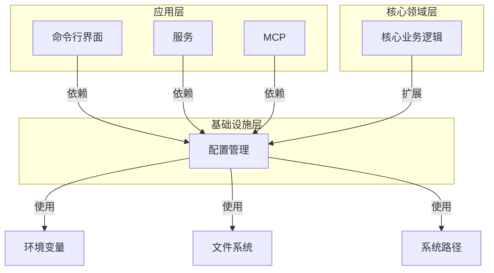
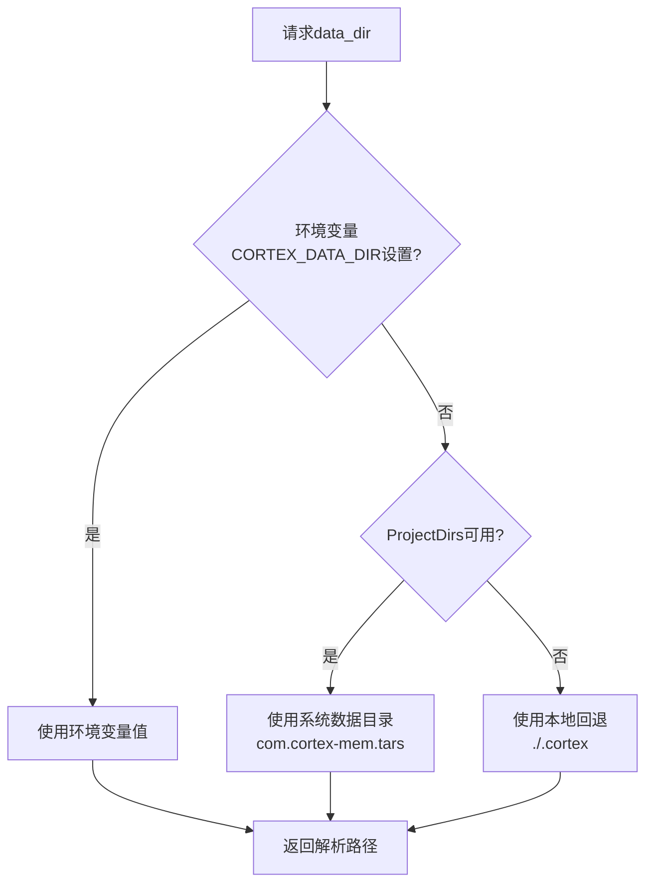
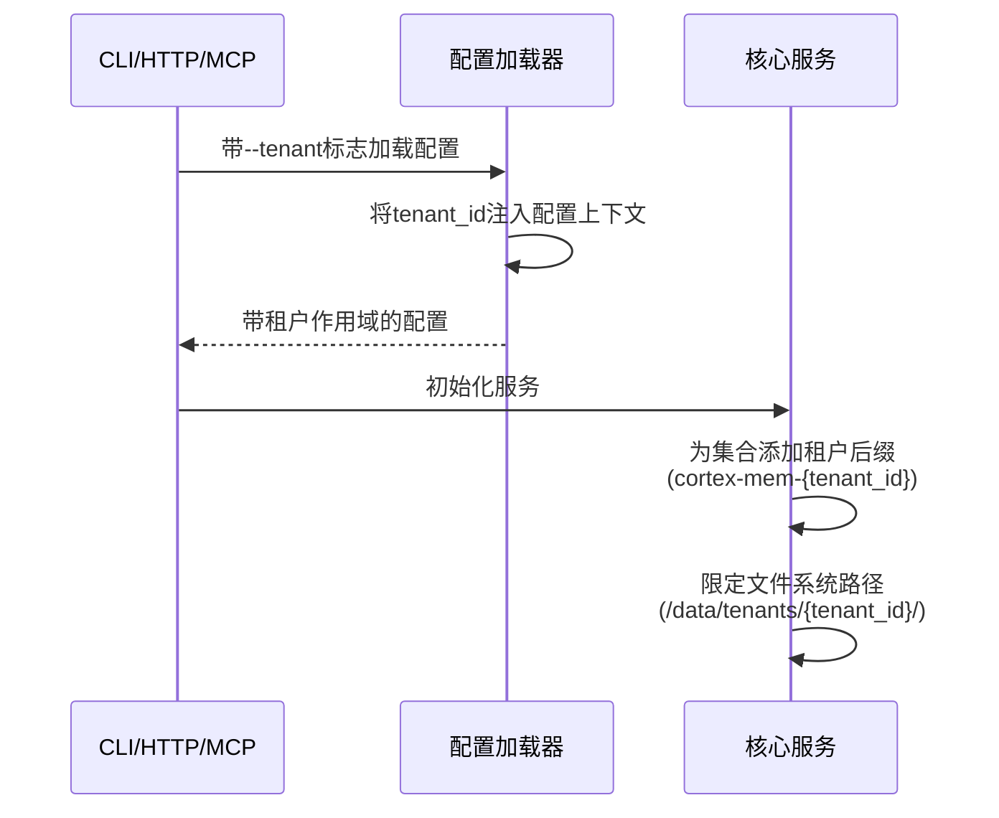
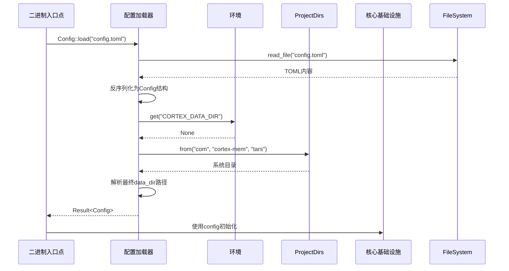

# 配置管理领域

**版本:** 1.0  
**最后更新:** 2026-02-19 04:01:33 (UTC)  
**范围:** Cortex-Mem系统配置管理基础设施的技术实现文档。

---

## 1. 领域概述

**配置管理领域**是Cortex-Mem系统的基础设施组件，负责跨所有Cortex-Mem接口和核心服务集中化、加载和分发系统配置。 主要在`cortex-mem-config` crate中实现，扩展在`cortex-mem-core`中，此领域确保CLI、HTTP API、MCP服务器和Web仪表板之间一致、类型安全的配置访问。

**关键职责:**
- 分层配置加载（TOML文件 → 环境变量 → 硬编码默认值）
- 跨平台数据目录解析
- 租户感知配置作用域和隔离
- 带序列化/反序列化支持的类型安全配置结构
- 配置验证和错误传播

**架构分类:** 基础设施领域  
**重要级别:** 9/10（所有系统操作的基础）  
**复杂度:** 7/10（由于回退层次和多租户，中等复杂度）

---

## 2. 架构上下文

在Cortex-Mem工作空间架构中，配置管理领域位于**基础设施层**，为上层提供基本服务，无业务逻辑依赖。



**依赖流:**
- **上游依赖:** `serde`（序列化）、`anyhow`（错误处理）、`directories`（跨平台路径）、`std::env`（环境访问）
- **下游消费者:** 所有应用接口（CLI、HTTP、MCP）、核心基础设施服务（LLM客户端、向量存储、文件系统抽象）和自动化组件

---

## 3. 核心组件

该领域由三个专业子模块组成，每个模块处理不同的配置问题：

### 3.1 配置加载器
**代码路径:** `/cortex-mem-config/src/lib.rs`

配置管理的主要入口点，负责协调从外部源加载到强类型Rust结构的序列。

**关键函数:**
- `Config::load(path: &str) -> Result<Config>`: 反序列化的主要入口点
- `CortexConfig::default_data_dir() -> PathBuf`: 实现三层目录解析策略
- `EmbeddingConfig::default()`: 提供环境感知默认值

**实现模式:**
```rust
// 分层加载：文件 -> 环境 -> 默认值
pub fn load(path: &str) -> anyhow::Result<Config> {
    let content = fs::read_to_string(path)?;
    let config: Config = toml::from_str(&content)?;
    // 应用环境变量覆盖和回退
    Ok(config.resolve_env())
}
```

### 3.2 多租户配置
**代码路径:** `/cortex-mem-core/src/config.rs`

使用租户作用域功能扩展基础配置，支持多个租户共享单一实例同时保持数据隔离的SaaS部署。

**关键函数:**
- `QdrantConfig::with_tenant_id(tenant_id: &str)`: 为集合名称应用租户后缀
- `LLMConfig::from_env()`: 从环境变量加载租户特定LLM凭证

### 3.3 配置构建器
**代码路径:** `/cortex-mem-core/src/config.rs`

提供流式API用于程序化配置构造，主要在系统初始化和测试场景中使用。

**关键函数:**
- `QdrantConfig::builder()`: 初始化向量存储配置的构建器模式
- `CortexMemBuilder`: 根据配置状态协调依赖连接

---

## 4. 配置解析策略

该领域实现配置值的**级联优先级系统**，确保跨部署环境的灵活性：

| 优先级 | 源 | 使用场景 |
|----------|--------|----------|
| 1 | CLI参数 | 运行时覆盖（如`--data-dir`） |
| 2 | 环境变量 | 容器化部署、密钥管理 |
| 3 | TOML配置文件 | 持久环境特定设置 |
| 4 | 应用默认值 | 本地开发的合理回退 |

### 4.1 数据目录解析流程

该领域的关键功能是使用健壮的回退机制解析数据目录路径：



**实现细节:**
```rust
fn default_data_dir() -> PathBuf {
    // 第一层：环境变量
    if let Ok(dir) = env::var("CORTEX_DATA_DIR") {
        return PathBuf::from(dir);
    }
    
    // 第二层：系统目录（跨平台）
    if let Some(proj_dirs) = ProjectDirs::from("com", "cortex-mem", "tars") {
        return proj_dirs.data_dir().join("cortex");
    }
    
    // 第三层：本地回退
    PathBuf::from("./.cortex")
}
```

---

## 5. 技术实现细节

### 5.1 类型安全和序列化

该领域利用Rust的类型系统和`serde`为配置有效性提供编译时保证：

```rust
#[derive(Debug, Serialize, Deserialize)]
pub struct Config {
    pub cortex: CortexConfig,
    pub embedding: EmbeddingConfig,
    pub qdrant: QdrantConfig,
    pub llm: LLMConfig,
}

#[derive(Debug, Serialize, Deserialize)]
pub struct CortexConfig {
    pub data_dir: Option<PathBuf>,
    pub auto_index: bool,
    pub auto_extract: bool,
}
```

**关键特性:**
- **强类型:** PathBuf用于文件系统路径，URL类型用于端点
- **可选字段:** `Option<T>`用于非必需配置，带默认回退
- **自定义反序列化器:** 处理TOML字符串中的环境变量插值

### 5.2 环境变量集成

默认实现检查特定环境变量以支持12要素应用方法：

```rust
impl Default for EmbeddingConfig {
    fn default() -> Self {
        Self {
            api_base_url: env::var("EMBEDDING_API_BASE_URL")
                .unwrap_or_else(|_| "http://localhost:11434".to_string()),
            api_key: env::var("EMBEDDING_API_KEY").ok(),
            model: env::var("EMBEDDING_MODEL")
                .unwrap_or_else(|_| "nomic-embed-text".to_string()),
        }
    }
}
```

### 5.3 错误处理策略

该领域使用`anyhow::Result`进行人体工程学的错误传播，将验证委托给消费者，同时确保清晰的错误上下文：

- **IO错误:** 读取TOML时文件未找到、权限被拒绝
- **解析错误:** 反序列化时无效TOML语法或类型不匹配
- **解析错误:** 不可用的系统目录，回退耗尽

**注意:** 该领域刻意执行最少验证（如路径存在、端点可达），将语义验证留给拥有适当错误处理上下文的消费服务。

---

## 6. 多租户配置

配置管理领域通过配置作用域实现租户隔离：

### 6.1 租户ID传播

配置对象在整个系统生命周期中维护租户上下文：



### 6.2 租户感知组件

- **向量存储:** `QdrantConfig::with_tenant_id()`为集合名称添加后缀（如`cortex-mem-acme-corp`）
- **文件系统:** 所有`cortex://` URIs都带有租户特定基础路径前缀
- **LLM配置:** 支持租户特定API密钥和模型端点，用于速率限制或数据驻留要求

---

## 7. 集成模式

### 7.1 系统初始化序列

在引导过程中，该领域参与系统初始化工作流：



### 7.2 消费者使用示例

**CLI接口:**
```rust
// CLI参数解析覆盖配置值
let cli = Cli::parse();
let mut config = Config::load(&cli.config_path)?;
if let Some(tenant) = cli.tenant {
    config.cortex.tenant_id = Some(tenant);
}
```

**HTTP服务:**
```rust
// Axum状态初始化
let config = Config::load(&env::var("CONFIG_PATH").unwrap_or("config.toml".to_string()))?;
let app_state = AppState::from_config(config).await?;
```

---

## 8. 配置模式参考

### 8.1 核心配置结构

| 结构 | 目的 | 关键字段 |
|--------|---------|------------|
| `Config` | 根配置容器 | `cortex`、`embedding`、`qdrant`、`llm` |
| `CortexConfig` | 通用系统设置 | `data_dir`、`auto_index`、`auto_extract`、`tenant_id` |
| `EmbeddingConfig` | 向量化服务设置 | `api_base_url`、`api_key`、`model`、`dimensions` |
| `QdrantConfig` | 向量数据库连接 | `url`、`collection_name`、`timeout`、`tenant_suffix` |
| `LLMConfig` | 语言模型集成 | `api_base`、`api_key`、`model`、`temperature` |

### 8.2 示例配置（TOML）

```toml
[cortex]
data_dir = "/var/lib/cortex-mem"
auto_index = true
auto_extract = true

[embedding]
api_base_url = "http://localhost:11434"
model = "nomic-embed-text"
dimensions = 768

[qdrant]
url = "http://localhost:6334"
collection_name = "cortex-mem"

[llm]
api_base = "https://api.openai.com/v1"
model = "gpt-4"
temperature = 0.7
```

---

## 9. 部署考虑

### 9.1 环境特定配置

- **开发:** 本地回退路径（`./.cortex`）、本地Ollama嵌入
- **生产:** 系统目录、外部Qdrant集群、用于密钥的环境变量注入
- **容器化:** 挂载在`CORTEX_DATA_DIR`的Docker卷、仅环境配置用于密钥

### 9.2 安全影响

- **密钥管理:** API密钥应通过环境变量（`EMBEDDING_API_KEY`、`LLM_API_KEY`）提供，而非提交TOML文件
- **租户隔离:** 确保文件系统权限限制访问`/data/tenants/{tenant_id}/`目录
- **配置验证:** 消费者必须验证`data_dir`存在且在初始化前可写

---

## 10. 局限性和可扩展性

### 10.1 当前局限性

- **验证范围:** 该领域在加载期间不验证外部服务连接性（Qdrant、LLM API）；这发生在服务初始化期间
- **热重载:** 配置更改需要进程重启；不存在用于动态重配置的文件监视机制
- **模式演进:** 版本间配置模式变更没有内置迁移系统

### 10.2 扩展点

- **自定义提供者:** 实现`ConfigProvider`特性以支持额外源（etcd、Consul、AWS Parameter Store）
- **验证层:** 在加载和消费之间添加中间件验证函数
- **密钥集成:** 扩展以支持密钥管理系统（HashiCorp Vault、AWS Secrets Manager），通过自定义反序列化器

---

## 11. 结论

配置管理领域为Cortex-Mem的配置需求提供了健壮、类型安全的基础，通过环境变量和分层回退平衡灵活性，同时通过强类型和结构化错误处理确保安全。其设计支持单租户本地开发和多租户生产部署，作为部署环境和系统核心业务逻辑之间的重要桥梁。

**相关文档:**
- 系统架构概述
- 多租户记忆管理工作流
- 系统初始化和依赖注入流程
- 核心基础设施领域
