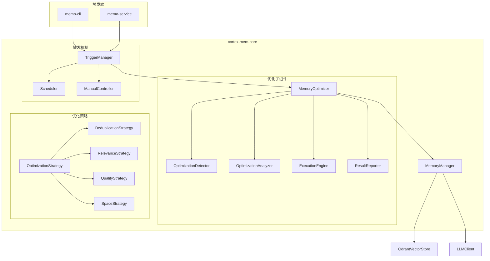

# Cortex-Mem主动Memory优化技术方案

**生成时间**: 2025-12-05  
**版本**: v1.0  
**项目**: cortex-mem 全栈智能记忆管理系统  

---

## 1. 方案概述

### 1.1 问题背景

随着cortex-mem系统使用时间的增长，memory数据会出现以下问题：

1. **信息密度下降**: 大量重复或冗余记忆条目占用存储空间
2. **有效性劣化**: 低质量、过时或不再相关的记忆影响搜索效率
3. **结构恶化**: 记忆之间的关联性减弱，分类体系混乱
4. **性能下降**: 数据库规模增长导致搜索延迟增加

### 1.2 解决方案

设计一个**主动Memory优化系统**，周期性对memory库进行全面优化，提升信息密度和有效性，维持系统的长期健康运行。

### 1.3 核心目标

- **提升信息密度**: 合并重复记忆，删除无效条目
- **增强内容质量**: 更新过时信息，优化重要性评分
- **优化存储结构**: 改善分类和关联性，提升搜索效率
- **维持系统性能**: 控制数据库规模，防止性能劣化

---

## 2. 系统架构设计

### 2.1 核心组件架构



### 2.2 组件职责说明

| 组件 | 职责 |
|------|------|
| **MemoryOptimizer** | 核心优化协调器，统一管理优化流程 |
| **OptimizationDetector** | 检测需要优化的memory问题区域 |
| **OptimizationAnalyzer** | 分析问题并制定优化策略 |
| **ExecutionEngine** | 执行具体的优化操作 |
| **ResultReporter** | 报告优化结果和系统健康状态 |
| **TriggerManager** | 管理优化触发条件和执行时机 |
| **Scheduler** | 定时触发机制 |
| **ManualController** | 手动触发机制 |

---

## 3. 优化策略设计

### 3.1 四大优化策略

#### 3.1.1 去重优化 (DeduplicationStrategy)

**目标**: 合并重复或高度相似的记忆条目，提升信息密度

**算法**:
1. **语义相似度分析**: 使用embedding计算余弦相似度
2. **内容相似度分析**: 使用Jaccard相似度
3. **元数据相似度分析**: 比较类型、主题、实体等
4. **综合评分**: 加权合并三种相似度得分
5. **智能合并**: LLM生成合并后的精炼内容

**阈值配置**:
```rust
struct DeduplicationConfig {
    semantic_threshold: f32,    // 语义相似度阈值 (默认0.85)
    content_threshold: f32,     // 内容相似度阈值 (默认0.7)  
    metadata_threshold: f32,    // 元数据相似度阈值 (默认0.8)
    merge_threshold: f32,       // 触发合并的阈值 (默认0.9)
    max_batch_size: usize,      // 单次处理最大数量 (默认1000)
}
```

#### 3.1.2 相关性优化 (RelevanceStrategy)

**目标**: 删除过时、不相关或低价值的记忆条目

**算法**:
1. **时间衰减分析**: 计算记忆的时间价值衰减
2. **访问频率统计**: 分析记忆被搜索和引用的频率
3. **重要性重新评估**: 使用当前标准重新评估重要性
4. **相关性分析**: 判断记忆与当前用户需求的关联性

**删除策略**:
- 超过特定时间未访问的低重要性记忆
- 与当前活跃话题无关的历史记忆
- 内容质量下降的记忆条目

#### 3.1.3 质量优化 (QualityStrategy)

**目标**: 提升记忆内容的质量和结构化程度

**优化内容**:
1. **内容质量评估**: LLM评估内容的清晰度和有用性
2. **结构化增强**: 改进记忆的分类和元数据
3. **摘要生成**: 为长内容生成精炼摘要
4. **关键词优化**: 更新和丰富关键词标签
5. **关联性增强**: 建立记忆之间的语义关联

#### 3.1.4 空间优化 (SpaceStrategy)

**目标**: 优化存储空间使用，提升系统性能

**优化内容**:
1. **向量压缩**: 对频繁访问的记忆进行向量缓存
2. **索引优化**: 重建或优化向量索引
3. **分区策略**: 按类型或重要性进行逻辑分区
4. **归档处理**: 将旧的高价值记忆转移到归档存储

---

## 4. 触发机制设计

### 4.1 自动触发条件

#### 4.1.1 基于数据量触发
- **总记忆数量**: 超过阈值（如10,000条）触发
- **存储空间**: 达到预设的存储限制
- **重复率**: 相似记忆比例超过阈值（如20%）

#### 4.1.2 基于时间触发
- **定期优化**: 每周/月进行一次全面优化
- **渐进优化**: 每日进行小规模增量优化
- **空闲触发**: 系统空闲时进行后台优化

#### 4.1.3 基于性能触发
- **搜索延迟**: 搜索响应时间超过阈值
- **查询准确率**: 搜索结果质量下降
- **内存使用**: 系统资源使用过高

### 4.2 手动触发机制

#### 4.2.1 CLI命令触发
```bash
# 执行全面优化
memo optimize --mode=full

# 执行特定策略优化  
memo optimize --strategy=deduplication

# 预览优化计划（不执行）
memo optimize --preview

# 优化特定用户或Agent的记忆
memo optimize --user-id=xxx --agent-id=yyy
```

#### 4.2.2 HTTP API触发
```http
POST /api/memory/optimize
Content-Type: application/json

{
  "strategy": "full|deduplication|relevance|quality|space",
  "filters": {
    "user_id": "optional",
    "agent_id": "optional", 
    "memory_type": "optional"
  },
  "dry_run": false,
  "aggressive": false
}
```

---

## 5. 核心算法实现

### 5.1 MemoryOptimizer 核心逻辑

```rust
pub struct MemoryOptimizer {
    memory_manager: Arc<MemoryManager>,
    config: OptimizationConfig,
    detector: OptimizationDetector,
    analyzer: OptimizationAnalyzer,
    executor: ExecutionEngine,
    reporter: ResultReporter,
}

impl MemoryOptimizer {
    /// 执行完整优化流程
    pub async fn optimize(&self, strategy: OptimizationStrategy) -> Result<OptimizationResult> {
        // 1. 检测问题区域
        let issues = self.detector.detect_issues().await?;
        
        // 2. 分析并制定策略
        let plan = self.analyzer.create_optimization_plan(&issues, &strategy).await?;
        
        // 3. 执行优化操作
        let result = self.executor.execute_plan(plan).await?;
        
        // 4. 报告结果
        self.reporter.report_optimization_result(result.clone()).await?;
        
        Ok(result)
    }
    
    /// 增量优化（每日执行）
    pub async fn incremental_optimize(&self) -> Result<OptimizationResult> {
        let strategy = OptimizationStrategy::Incremental;
        self.optimize(strategy).await
    }
    
    /// 批量优化（每周执行）
    pub async fn batch_optimize(&self) -> Result<OptimizationResult> {
        let strategy = OptimizationStrategy::Batch;
        self.optimize(strategy).await
    }
}
```

### 5.2 问题检测算法

```rust
pub struct OptimizationDetector {
    vector_store: Arc<dyn VectorStore>,
    metrics_calculator: MetricsCalculator,
}

impl OptimizationDetector {
    /// 检测需要优化的问题
    pub async fn detect_issues(&self) -> Result<Vec<OptimizationIssue>> {
        let mut issues = Vec::new();
        
        // 1. 检测重复问题
        let duplicates = self.detect_duplicates().await?;
        issues.extend(duplicates);
        
        // 2. 检测质量问题  
        let quality_issues = self.detect_quality_issues().await?;
        issues.extend(quality_issues);
        
        // 3. 检测相关性衰减
        let relevance_issues = self.detect_relevance_issues().await?;
        issues.extend(relevance_issues);
        
        // 4. 检测存储效率问题
        let storage_issues = self.detect_storage_issues().await?;
        issues.extend(storage_issues);
        
        Ok(issues)
    }
    
    /// 检测重复记忆
    async fn detect_duplicates(&self) -> Result<Vec<OptimizationIssue>> {
        // 使用滑动窗口检测相似记忆
        // 返回需要合并的记忆对
    }
    
    /// 检测质量问题
    async fn detect_quality_issues(&self) -> Result<Vec<OptimizationIssue>> {
        // 检测内容质量、分类准确性等
    }
    
    /// 检测相关性衰减
    async fn detect_relevance_issues(&self) -> Result<Vec<OptimizationIssue>> {
        // 检测时间衰减、访问频率等
    }
    
    /// 检测存储效率
    async fn detect_storage_issues(&self) -> Result<Vec<OptimizationIssue>> {
        // 检测存储浪费、索引效率等
    }
}
```

### 5.3 优化执行引擎

```rust
pub struct ExecutionEngine {
    memory_manager: Arc<MemoryManager>,
    dedup_strategy: DeduplicationStrategy,
    relevance_strategy: RelevanceStrategy,
    quality_strategy: QualityStrategy,
    space_strategy: SpaceStrategy,
}

impl ExecutionEngine {
    /// 执行优化计划
    pub async fn execute_plan(&self, plan: OptimizationPlan) -> Result<OptimizationResult> {
        let mut result = OptimizationResult::default();
        
        for action in &plan.actions {
            match action {
                OptimizationAction::Merge { memories } => {
                    let merged = self.dedup_strategy.merge_memories(memories).await?;
                    let memory_id = self.memory_manager.update(&merged).await?;
                    result.merge_operations += 1;
                    result.saved_space += self.calculate_saved_space(memories);
                }
                
                OptimizationAction::Delete { memory_id } => {
                    self.memory_manager.delete(memory_id).await?;
                    result.delete_operations += 1;
                }
                
                OptimizationAction::Update { memory_id, updates } => {
                    self.memory_manager.update_memory(memory_id, updates).await?;
                    result.update_operations += 1;
                }
                
                OptimizationAction::Reclassify { memory_id } => {
                    self.quality_strategy.reclassify_memory(memory_id).await?;
                    result.reclassify_operations += 1;
                }
            }
        }
        
        // 更新系统指标
        result.final_memory_count = self.memory_manager.get_memory_count().await?;
        result.optimization_time = chrono::Utc::now();
        
        Ok(result)
    }
}
```

---

## 6. 配置管理

### 6.1 优化配置结构

```rust
#[derive(Debug, Clone, Serialize, Deserialize)]
pub struct OptimizationConfig {
    /// 是否启用自动优化
    pub auto_optimize: bool,
    
    /// 优化触发阈值
    pub trigger_thresholds: TriggerThresholds,
    
    /// 优化策略配置
    pub strategy_configs: StrategyConfigs,
    
    /// 优化执行配置
    pub execution_config: ExecutionConfig,
    
    /// 日志和报告配置
    pub logging_config: LoggingConfig,
}

#[derive(Debug, Clone, Serialize, Deserialize)]
pub struct TriggerThresholds {
    pub max_memory_count: usize,        // 最大记忆数量
    pub max_storage_size_mb: usize,    // 最大存储大小(MB)
    pub duplicate_ratio_threshold: f32, // 重复率阈值
    pub search_latency_ms: u64,       // 搜索延迟阈值
    pub access_frequency_threshold: f32, // 访问频率阈值
}

#[derive(Debug, Clone, Serialize, Deserialize)]
pub struct StrategyConfigs {
    pub deduplication: DeduplicationConfig,
    pub relevance: RelevanceConfig,
    pub quality: QualityConfig,
    pub space: SpaceConfig,
}

#[derive(Debug, Clone, Serialize, Deserialize)]
pub struct ExecutionConfig {
    pub batch_size: usize,              // 批处理大小
    pub max_concurrent_tasks: usize,    // 最大并发任务数
    pub timeout_minutes: u64,          // 超时时间(分钟)
    pub retry_attempts: u32,           // 重试次数
}
```

### 6.2 默认配置

```toml
[optimization]
auto_optimize = true

[optimization.trigger_thresholds]
max_memory_count = 10000
max_storage_size_mb = 1024
duplicate_ratio_threshold = 0.2
search_latency_ms = 1000
access_frequency_threshold = 0.1

[optimization.strategy_configs.deduplication]
semantic_threshold = 0.85
content_threshold = 0.7
metadata_threshold = 0.8
merge_threshold = 0.9
max_batch_size = 1000

[optimization.strategy_configs.relevance]
time_decay_days = 30
min_access_frequency = 0.05
importance_threshold = 0.3

[optimization.strategy_configs.quality]
min_content_length = 10
quality_score_threshold = 0.4

[optimization.strategy_configs.space]
max_memory_per_type = 5000
archive_after_days = 90

[optimization.execution_config]
batch_size = 100
max_concurrent_tasks = 4
timeout_minutes = 30
retry_attempts = 3
```

---

## 7. 监控和报告

### 7.1 优化指标监控

```rust
pub struct OptimizationMetrics {
    pub total_optimizations: u64,
    pub last_optimization: Option<DateTime<Utc>>,
    pub memory_count_before: usize,
    pub memory_count_after: usize,
    pub saved_space_mb: f64,
    pub deduplication_rate: f32,
    pub quality_improvement: f32,
    pub performance_improvement: f32,
}

pub struct OptimizationResult {
    pub optimization_id: String,
    pub strategy: OptimizationStrategy,
    pub start_time: DateTime<Utc>,
    pub end_time: DateTime<Utc>,
    pub issues_found: Vec<OptimizationIssue>,
    pub actions_performed: Vec<OptimizationAction>,
    pub metrics: OptimizationMetrics,
    pub success: bool,
    pub error_message: Option<String>,
}
```

### 7.2 定期报告

- **优化执行日志**: 记录每次优化的详细信息
- **系统健康报告**: 定期生成系统优化状态报告
- **性能指标**: 跟踪优化对系统性能的影响
- **存储使用报告**: 监控存储效率和空间节约

---

## 8. 部署和集成

### 8.1 memo-cli 集成

```rust
// 新增优化相关命令
#[derive(Parser)]
pub struct OptimizeCommand {
    /// 优化策略: full, incremental, deduplication, relevance, quality, space
    #[arg(long, default_value = "full")]
    pub strategy: OptimizationStrategy,
    
    /// 用户ID过滤
    #[arg(long)]
    pub user_id: Option<String>,
    
    /// Agent ID过滤
    #[arg(long)] 
    pub agent_id: Option<String>,
    
    /// 记忆类型过滤
    #[arg(long)]
    pub memory_type: Option<MemoryType>,
    
    /// 预览模式（不执行）
    #[arg(long)]
    pub preview: bool,
    
    /// 激进模式（更深层优化）
    #[arg(long)]
    pub aggressive: bool,
}

impl OptimizeCommand {
    pub async fn run(&self) -> Result<()> {
        let config = load_config()?;
        let memory_manager = create_memory_manager(&config).await?;
        let optimizer = MemoryOptimizer::new(memory_manager, config.optimization_config);
        
        if self.preview {
            let plan = optimizer.create_optimization_plan(self.strategy).await?;
            println!("优化计划预览:");
            println!("{}", serde_yaml::to_string(&plan)?);
        } else {
            let result = optimizer.optimize(self.strategy).await?;
            println!("优化完成: {} 项操作", result.actions_performed.len());
        }
        
        Ok(())
    }
}
```

### 8.2 memo-service 集成

```rust
// 新增HTTP API端点
pub async fn optimize_memories(
    State(state): State<AppState>,
    Json(request): Json<OptimizeRequest>,
) -> Result<Json<OptimizeResponse>, MemoryError> {
    let optimizer = MemoryOptimizer::new(
        state.memory_manager.clone(),
        state.config.optimization_config.clone()
    );
    
    let result = if request.dry_run {
        optimizer.create_optimization_plan(request.strategy).await?
    } else {
        optimizer.optimize(request.strategy).await?
    };
    
    Ok(Json(OptimizeResponse {
        success: result.success,
        optimization_id: result.optimization_id,
        actions_count: result.actions_performed.len(),
        metrics: result.metrics,
        error_message: result.error_message,
    }))
}
```

---

## 9. 风险控制和回滚机制

### 9.1 安全保障

- **备份机制**: 优化前自动创建memory快照
- **增量执行**: 分批执行优化，便于中断和回滚
- **预览模式**: 提供优化计划预览功能
- **操作日志**: 详细记录所有优化操作

### 9.2 回滚机制

```rust
pub struct RollbackManager {
    backup_storage: Arc<dyn BackupStorage>,
}

impl RollbackManager {
    /// 创建优化前备份
    pub async fn create_backup(&self, optimization_id: &str) -> Result<BackupId> {
        // 创建memory状态快照
    }
    
    /// 回滚到指定备份点
    pub async fn rollback(&self, backup_id: &BackupId) -> Result<()> {
        // 恢复memory状态
    }
    
    /// 清理旧备份
    pub async fn cleanup_old_backups(&self, keep_days: u32) -> Result<()> {
        // 清理过期备份
    }
}
```

### 9.3 性能保护

- **限流控制**: 限制优化操作的并发数和资源使用
- **超时机制**: 防止优化操作占用过多时间
- **监控告警**: 实时监控优化对系统性能的影响

---

## 10. 总结

### 10.1 方案优势

1. **主动优化**: 区别于被动优化，主动发现和解决memory质量问题
2. **多维策略**: 四大优化策略全面覆盖不同类型的问题
3. **可配置性**: 高度可配置的优化参数，适应不同场景需求
4. **安全性**: 完善的备份和回滚机制，确保操作安全
5. **监控友好**: 详细的指标监控和报告系统

### 10.2 实施价值

1. **提升信息密度**: 有效减少冗余，提高memory库质量
2. **维持系统性能**: 防止数据库规模过大导致的性能问题
3. **改善用户体验**: 提升搜索准确性和响应速度
4. **降低运营成本**: 优化存储使用，减少资源消耗
5. **增强系统可靠性**: 主动维护系统健康，提高稳定性

### 10.3 实施建议

1. **渐进部署**: 先在测试环境验证，再逐步推广到生产环境
2. **参数调优**: 根据实际使用情况调整优化阈值和策略
3. **监控观察**: 密切观察优化效果，及时调整策略
4. **用户反馈**: 收集用户对优化效果的反馈，持续改进

这个技术方案将为cortex-mem系统提供强大的主动优化能力，有效应对memory急剧扩张后的信息密度和有效性劣化问题，确保系统的长期健康运行。