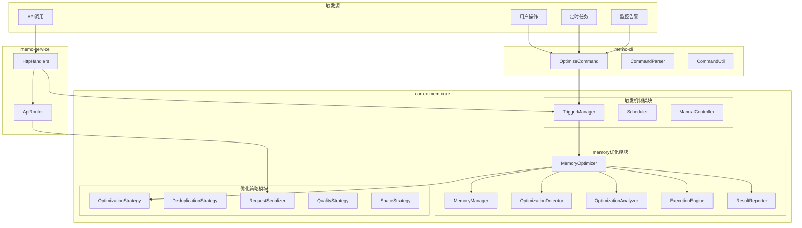

# Cortex-Mem主动优化架构实现设计

**生成时间**: 2025-12-05  
**版本**: v1.0  
**项目**: cortex-mem 全栈智能记忆管理系统  

---

## 1. 架构总览

### 1.1 设计原则

- **核心能力封装**: 将主动优化核心能力封装在 `cortex-mem-core` 中
- **统一触发接口**: 通过 `memo-cli` 和 `memo-service` 提供统一的触发入口
- **可配置化**: 支持通过配置文件灵活控制优化行为
- **模块化设计**: 各优化组件独立，便于测试和维护
- **异步非阻塞**: 所有优化操作异步执行，不影响正常服务

### 1.2 整体架构



---

## 2. cortex-mem-core 核心实现

### 2.1 目录结构

```
cortex-mem-core/src/
├── memory/
│   ├── mod.rs                 # 导出优化相关模块
│   ├── optimizer.rs           # MemoryOptimizer 核心实现
│   ├── optimization_detector.rs  # 问题检测器
│   ├── optimization_analyzer.rs  # 优化分析器
│   ├── execution_engine.rs    # 执行引擎
│   ├── result_reporter.rs     # 结果报告器
│   └── strategies/            # 优化策略
│       ├── mod.rs
│       ├── deduplication.rs   # 去重策略
│       ├── relevance.rs       # 相关性策略
│       ├── quality.rs         # 质量策略
│       └── space.rs           # 空间策略
├── optimization/
│   ├── mod.rs                 # 优化模块导出
│   ├── config.rs              # 优化配置
│   ├── triggers.rs            # 触发管理
│   ├── scheduler.rs           # 定时调度
│   └── manual.rs              # 手动控制
└── types/
    └── optimization.rs        # 优化相关类型定义
```

### 2.2 核心接口设计

#### 2.2.1 MemoryOptimizer 核心接口

```rust
/// 主动内存优化器 - 核心协调组件
#[async_trait]
pub trait MemoryOptimizer: Send + Sync {
    /// 执行优化操作
    async fn optimize(&self, request: &OptimizationRequest) -> Result<OptimizationResult>;
    
    /// 创建优化计划（预览模式）
    async fn create_optimization_plan(&self, strategy: OptimizationStrategy) -> Result<OptimizationPlan>;
    
    /// 获取优化状态
    async fn get_optimization_status(&self) -> Result<OptimizationStatus>;
    
    /// 取消正在进行的优化
    async fn cancel_optimization(&self, optimization_id: &str) -> Result<()>;
}

/// MemoryOptimizer 实现
pub struct DefaultMemoryOptimizer {
    memory_manager: Arc<MemoryManager>,
    config: OptimizationConfig,
    detector: Arc<OptimizationDetector>,
    analyzer: Arc<OptimizationAnalyzer>,
    executor: Arc<ExecutionEngine>,
    reporter: Arc<ResultReporter>,
}

#[async_trait]
impl MemoryOptimizer for DefaultMemoryOptimizer {
    async fn optimize(&self, request: &OptimizationRequest) -> Result<OptimizationResult> {
        let optimization_id = Uuid::new_v4().to_string();
        
        // 1. 检测问题
        tracing::info!("开始检测内存优化问题");
        let issues = self.detector.detect_issues(&request.filters).await?;
        
        // 2. 分析制定计划
        tracing::info!("制定优化计划");
        let plan = self.analyzer.create_optimization_plan(&issues, &request.strategy, &request.filters).await?;
        
        // 3. 执行优化
        tracing::info!("执行优化计划");
        let result = self.executor.execute_plan(&optimization_id, plan).await?;
        
        // 4. 报告结果
        self.reporter.report_optimization_result(&result).await?;
        
        Ok(result)
    }
    
    async fn create_optimization_plan(&self, strategy: OptimizationStrategy) -> Result<OptimizationPlan> {
        let issues = self.detector.detect_issues(&Default::default()).await?;
        self.analyzer.create_optimization_plan(&issues, &strategy, &Default::default()).await
    }
    
    async fn get_optimization_status(&self) -> Result<OptimizationStatus> {
        // 获取当前优化状态
        todo!()
    }
    
    async fn cancel_optimization(&self, optimization_id: &str) -> Result<()> {
        // 取消正在进行的优化
        todo!()
    }
}
```

#### 2.2.2 触发管理接口

```rust
/// 优化触发管理器
#[async_trait]
pub trait TriggerManager: Send + Sync {
    /// 注册触发器
    async fn register_trigger(&self, trigger: Box<dyn OptimizationTrigger>) -> Result<TriggerId>;
    
    /// 取消触发器
    async fn unregister_trigger(&self, trigger_id: &TriggerId) -> Result<()>;
    
    /// 手动触发优化
    async fn trigger_optimization(&self, request: &OptimizationRequest) -> Result<String>;
    
    /// 获取触发器状态
    async fn get_trigger_status(&self) -> Result<Vec<TriggerStatus>>;
}

/// 优化触发器trait
#[async_trait]
pub trait OptimizationTrigger: Send + Sync {
    /// 触发器名称
    fn name(&self) -> &str;
    
    /// 触发器描述
    fn description(&self) -> &str;
    
    /// 检查是否应该触发优化
    async fn should_trigger(&self, optimizer: &dyn MemoryOptimizer) -> Result<bool>;
    
    /// 触发时执行的优化请求
    fn get_optimization_request(&self) -> OptimizationRequest;
}

/// 定时触发器实现
pub struct ScheduleTrigger {
    name: String,
    description: String,
    schedule: Schedule,
    strategy: OptimizationStrategy,
    filters: OptimizationFilters,
}

/// 手动触发器实现
pub struct ManualTrigger {
    name: String,
    request: OptimizationRequest,
}

/// 监控触发器实现（基于系统指标）
pub struct MonitoringTrigger {
    name: String,
    description: String,
    thresholds: TriggerThresholds,
    strategy: OptimizationStrategy,
}
```

### 2.3 核心类型定义

#### 2.3.1 优化请求和结果

```rust
/// 优化请求
#[derive(Debug, Clone, Serialize, Deserialize)]
pub struct OptimizationRequest {
    pub optimization_id: Option<String>,
    pub strategy: OptimizationStrategy,
    pub filters: OptimizationFilters,
    pub aggressive: bool,
    pub dry_run: bool,
    pub timeout_minutes: Option<u64>,
}

/// 优化策略
#[derive(Debug, Clone, Serialize, Deserialize)]
pub enum OptimizationStrategy {
    /// 全面优化
    Full,
    /// 增量优化
    Incremental,
    /// 批量优化
    Batch,
    /// 仅去重
    Deduplication,
    /// 仅相关性优化
    Relevance,
    /// 仅质量优化
    Quality,
    /// 仅空间优化
    Space,
}

/// 优化过滤器
#[derive(Debug, Clone, Serialize, Deserialize)]
pub struct OptimizationFilters {
    pub user_id: Option<String>,
    pub agent_id: Option<String>,
    pub memory_type: Option<MemoryType>,
    pub date_range: Option<DateRange>,
    pub importance_range: Option<Range<f32>>,
    pub custom_filters: HashMap<String, Value>,
}

/// 优化结果
#[derive(Debug, Clone, Serialize, Deserialize)]
pub struct OptimizationResult {
    pub optimization_id: String,
    pub strategy: OptimizationStrategy,
    pub start_time: DateTime<Utc>,
    pub end_time: DateTime<Utc>,
    pub issues_found: Vec<OptimizationIssue>,
    pub actions_performed: Vec<OptimizationAction>,
    pub metrics: OptimizationMetrics,
    pub success: bool,
    pub error_message: Option<String>,
}

/// 优化操作
#[derive(Debug, Clone, Serialize, Deserialize)]
pub enum OptimizationAction {
    Merge { memories: Vec<String> },
    Delete { memory_id: String },
    Update { memory_id: String, updates: MemoryUpdates },
    Reclassify { memory_id: String },
    Archive { memory_id: String },
}
```

#### 2.3.2 优化配置

```rust
/// 优化配置
#[derive(Debug, Clone, Serialize, Deserialize)]
pub struct OptimizationConfig {
    pub auto_optimize: bool,
    pub trigger_config: TriggerConfig,
    pub strategy_configs: StrategyConfigs,
    pub execution_config: ExecutionConfig,
    pub safety_config: SafetyConfig,
}

/// 触发器配置
#[derive(Debug, Clone, Serialize, Deserialize)]
pub struct TriggerConfig {
    pub auto_triggers: Vec<AutoTriggerConfig>,
    pub schedule_config: ScheduleConfig,
    pub manual_config: ManualConfig,
}

/// 自动触发配置
#[derive(Debug, Clone, Serialize, Deserialize)]
pub struct AutoTriggerConfig {
    pub name: String,
    pub enabled: bool,
    pub strategy: OptimizationStrategy,
    pub thresholds: TriggerThresholds,
    pub filters: Option<OptimizationFilters>,
}

/// 执行配置
#[derive(Debug, Clone, Serialize, Deserialize)]
pub struct ExecutionConfig {
    pub batch_size: usize,
    pub max_concurrent_tasks: usize,
    pub timeout_minutes: u64,
    pub retry_attempts: u32,
    pub progress_callback: Option<ProgressCallback>,
}
```

---

## 3. memo-cli 集成实现

### 3.1 命令设计

#### 3.1.1 命令结构

```rust
/// 优化相关命令
pub mod optimize {
    use clap::Parser;
    use crate::types::*;
    
    #[derive(Parser)]
    pub struct OptimizeCommand {
        /// 优化策略
        #[arg(long, default_value = "full")]
        pub strategy: OptimizationStrategy,
        
        /// 用户ID过滤
        #[arg(long)]
        pub user_id: Option<String>,
        
        /// Agent ID过滤
        #[arg(long)]
        pub agent_id: Option<String>,
        
        /// 记忆类型过滤
        #[arg(long)]
        pub memory_type: Option<MemoryType>,
        
        /// 预览模式（不执行）
        #[arg(long)]
        pub preview: bool,
        
        /// 激进模式（更深层优化）
        #[arg(long)]
        pub aggressive: bool,
        
        /// 跳过确认
        #[arg(long)]
        pub no_confirm: bool,
        
        /// 超时时间（分钟）
        #[arg(long, default_value = "30")]
        pub timeout: u64,
    }
    
    #[derive(Parser)]
    pub struct OptimizationStatusCommand {
        /// 显示详细指标
        #[arg(long)]
        pub detailed: bool,
        
        /// 显示历史记录
        #[arg(long)]
        pub history: bool,
    }
    
    #[derive(Parser)]
    pub struct OptimizationConfigCommand {
        /// 显示当前配置
        #[arg(long)]
        pub show: bool,
        
        /// 更新配置
        #[arg(long)]
        pub update: bool,
        
        /// 配置文件路径
        #[arg(conflicts_with = "show")]
        config_file: Option<String>,
    }
}
```

#### 3.1.2 命令实现

```rust
/// 优化命令实现
pub struct OptimizeCommandRunner {
    memory_manager: Arc<MemoryManager>,
    config: Config,
}

impl OptimizeCommandRunner {
    pub fn new(memory_manager: Arc<MemoryManager>, config: Config) -> Self {
        Self {
            memory_manager,
            config,
        }
    }
    
    pub async fn run_optimize(&self, cmd: &optimize::OptimizeCommand) -> Result<()> {
        // 1. 构建优化请求
        let request = self.build_optimization_request(cmd)?;
        
        // 2. 创建优化器
        let optimizer = self.create_optimizer().await?;
        
        // 3. 执行优化
        if cmd.preview {
            self.run_preview(&optimizer, &request).await?;
        } else {
            self.run_optimization(&optimizer, &request, cmd.no_confirm).await?;
        }
        
        Ok(())
    }
    
    async fn create_optimizer(&self) -> Result<Arc<dyn MemoryOptimizer>> {
        let config = self.config.memory_config.clone();
        let optimization_config = config.optimization_config;
        
        let optimizer = DefaultMemoryOptimizer::new(
            self.memory_manager.clone(),
            optimization_config,
        ).await?;
        
        Ok(Arc::new(optimizer))
    }
    
    async fn run_preview(&self, optimizer: &dyn MemoryOptimizer, request: &OptimizationRequest) -> Result<()> {
        println!("🔍 优化计划预览");
        println!("策略: {:?}", request.strategy);
        println!("过滤器: {:?}", request.filters);
        println!();
        
        let plan = optimizer.create_optimization_plan(request.strategy.clone()).await?;
        
        println!("📋 检测到的问题:");
        for (i, issue) in plan.issues.iter().enumerate() {
            println!("  {}. {} - {}", i + 1, issue.severity, issue.description);
        }
        
        println!();
        println!("🎯 建议的操作:");
        for (i, action) in plan.actions.iter().enumerate() {
            println!("  {}. {:?}", i + 1, action);
        }
        
        Ok(())
    }
    
    async fn run_optimization(&self, optimizer: &dyn MemoryOptimizer, request: &OptimizationRequest, no_confirm: bool) -> Result<()> {
        if !no_confirm {
            println!("⚠️  此操作将修改您的memory数据库");
            let input = prompt_for_confirmation("是否继续? (y/N): ");
            if !input {
                println!("❌ 操作已取消");
                return Ok(());
            }
        }
        
        println!("🚀 开始执行优化...");
        
        let result = optimizer.optimize(request).await?;
        
        if result.success {
            println!("✅ 优化完成!");
            println!("📊 优化统计:");
            println!("  - 执行时间: {:?}", result.end_time - result.start_time);
            println!("  - 发现问题: {} 个", result.issues_found.len());
            println!("  - 执行操作: {} 个", result.actions_performed.len());
            
            if let Some(metrics) = result.metrics {
                println!("  - 节省空间: {:.2} MB", metrics.saved_space_mb);
                println!("  - 改善质量: {:.2}%", metrics.quality_improvement * 100.0);
            }
        } else {
            println!("❌ 优化失败: {}", result.error_message.unwrap_or("未知错误"));
        }
        
        Ok(())
    }
}
```

### 3.2 命令集成

```rust
// 在 main.rs 中集成优化命令
use crate::commands::optimize::{OptimizeCommand, OptimizationStatusCommand};

fn main() {
    let app = App::new("memo")
        .subcommand(
            Command::new("optimize")
                .about("优化memory数据库")
                .arg(OptimizeCommand::command())
        )
        .subcommand(
            Command::new("optimize-status")
                .about("查看优化状态")
                .arg(OptimizationStatusCommand::command())
        );
    
    let matches = app.get_matches();
    
    match matches.subcommand() {
        Some(("optimize", sub_matches)) => {
            let cmd = OptimizeCommand::from_arg_matches(sub_matches).unwrap();
            // 执行优化命令
        }
        Some(("optimize-status", sub_matches)) => {
            let cmd = OptimizationStatusCommand::from_arg_matches(sub_matches).unwrap();
            // 显示优化状态
        }
        _ => {}
    }
}
```

---

## 4. memo-service 集成实现

### 4.1 HTTP API设计

#### 4.1.1 API端点定义

```rust
/// 优化相关HTTP处理器
pub struct OptimizationHandlers {
    optimizer: Arc<dyn MemoryOptimizer>,
    trigger_manager: Arc<dyn TriggerManager>,
}

impl OptimizationHandlers {
    pub fn new(optimizer: Arc<dyn MemoryOptimizer>, trigger_manager: Arc<dyn TriggerManager>) -> Self {
        Self {
            optimizer,
            trigger_manager,
        }
    }
    
    /// 执行优化
    pub async fn optimize(
        State(state): State<OptimizationAppState>,
        Json(request): Json<OptimizationRequest>,
    ) -> Result<Json<OptimizationResponse>, MemoryError> {
        // 权限检查
        // 验证请求参数
        // 执行优化
        // 返回结果
    }
    
    /// 获取优化状态
    pub async fn get_status(
        State(state): State<OptimizationAppState>,
    ) -> Result<Json<OptimizationStatusResponse>, MemoryError> {
        // 获取当前优化状态
    }
    
    /// 获取优化历史
    pub async fn get_history(
        State(state): State<OptimizationAppState>,
        Query(params): Query<HistoryQueryParams>,
    ) -> Result<Json<OptimizationHistoryResponse>, MemoryError> {
        // 获取优化历史记录
    }
    
    /// 创建定时触发器
    pub async fn create_schedule(
        State(state): State<OptimizationAppState>,
        Json(request): Json<CreateScheduleRequest>,
    ) -> Result<Json<CreateScheduleResponse>, MemoryError> {
        // 创建定时触发器
    }
    
    /// 删除定时触发器
    pub async fn delete_schedule(
        State(state): State<OptimizationAppState>,
        Path(schedule_id): Path<String>,
    ) -> Result<Json<DeleteScheduleResponse>, MemoryError> {
        // 删除定时触发器
    }
}
```

#### 4.1.2 请求响应模型

```rust
/// 优化请求
#[derive(Debug, Clone, Serialize, Deserialize)]
pub struct OptimizationRequest {
    pub optimization_id: Option<String>,
    pub strategy: OptimizationStrategy,
    pub filters: OptimizationFilters,
    pub aggressive: Option<bool>,
    pub timeout_minutes: Option<u64>,
}

/// 优化响应
#[derive(Debug, Clone, Serialize, Deserialize)]
pub struct OptimizationResponse {
    pub optimization_id: String,
    pub status: OptimizationStatus,
    pub started_at: DateTime<Utc>,
    pub estimated_completion: Option<DateTime<Utc>>,
    pub message: String,
}

/// 优化状态响应
#[derive(Debug, Clone, Serialize, Deserialize)]
pub struct OptimizationStatusResponse {
    pub current_optimizations: Vec<OptimizationStatus>,
    pub last_optimization: Option<OptimizationSummary>,
    pub system_metrics: SystemMetrics,
}

/// 创建定时触发器请求
#[derive(Debug, Clone, Serialize, Deserialize)]
pub struct CreateScheduleRequest {
    pub name: String,
    pub description: Option<String>,
    pub cron_expression: String,
    pub strategy: OptimizationStrategy,
    pub filters: Option<OptimizationFilters>,
    pub enabled: Option<bool>,
}

/// 创建定时触发器响应
#[derive(Debug, Clone, Serialize, Deserialize)]
pub struct CreateScheduleResponse {
    pub schedule_id: String,
    pub created_at: DateTime<Utc>,
    pub message: String,
}
```

### 4.2 路由配置

```rust
/// 优化相关路由
pub fn optimization_routes() -> Router {
    Router::new()
        .route("/optimize", post(optimize_handler))
        .route("/optimize/status", get(get_status_handler))
        .route("/optimize/history", get(get_history_handler))
        .route("/optimize/schedules", post(create_schedule_handler))
        .route("/optimize/schedules/:id", delete(delete_schedule_handler))
        .route("/optimize/schedules", get(list_schedules_handler))
}

/// 优化处理器
async fn optimize_handler(
    State(app_state): State<OptimizationAppState>,
    Json(request): Json<OptimizationRequest>,
) -> Result<Json<OptimizationResponse>, MemoryError> {
    let handlers = OptimizationHandlers::new(
        app_state.optimizer.clone(),
        app_state.trigger_manager.clone(),
    );
    
    handlers.optimize(State(app_state), Json(request)).await
}

async fn get_status_handler(
    State(app_state): State<OptimizationAppState>,
) -> Result<Json<OptimizationStatusResponse>, MemoryError> {
    let handlers = OptimizationHandlers::new(
        app_state.optimizer.clone(),
        app_state.trigger_manager.clone(),
    );
    
    handlers.get_status(State(app_state)).await
}

// 其他处理器实现...
```

### 4.3 应用状态集成

```rust
/// 优化应用状态
pub struct OptimizationAppState {
    pub optimizer: Arc<dyn MemoryOptimizer>,
    pub trigger_manager: Arc<dyn TriggerManager>,
    pub config: OptimizationConfig,
}

impl OptimizationAppState {
    pub fn new(
        memory_manager: Arc<MemoryManager>,
        config: AppConfig,
    ) -> Result<Self> {
        let optimization_config = config.memory_config.optimization_config.clone();
        
        let optimizer = DefaultMemoryOptimizer::new(
            memory_manager.clone(),
            optimization_config.clone(),
        ).await?;
        
        let trigger_manager = DefaultTriggerManager::new(
            optimizer.clone(),
            optimization_config.trigger_config.clone(),
        ).await?;
        
        Ok(Self {
            optimizer,
            trigger_manager,
            config: optimization_config,
        })
    }
}

/// 在服务启动时初始化
#[tokio::main]
async fn main() -> Result<()> {
    let app_state = OptimizationAppState::new(
        memory_manager,
        config,
    )?;
    
    let app = Router::new()
        .nest("/api", optimization_routes())
        .with_state(app_state);
    
    axum::serve(listener, app).await?;
    Ok(())
}
```

---

## 5. 配置文件集成

### 5.1 主配置文件扩展

```toml
# config.toml

[optimization]
enabled = true

[optimization.trigger_config]
auto_triggers = [
    {
        name = "weekly_full_optimize",
        enabled = true,
        strategy = "Full",
        schedule = "0 2 * * 0",  # 每周日凌晨2点
        thresholds = {
            max_memory_count = 5000,
            duplicate_ratio = 0.2
        }
    },
    {
        name = "daily_incremental_optimize", 
        enabled = true,
        strategy = "Incremental",
        schedule = "0 1 * * *",  # 每天凌晨1点
        thresholds = {
            access_frequency = 0.1
        }
    }
]

[optimization.strategy_configs.deduplication]
semantic_threshold = 0.85
content_threshold = 0.7
metadata_threshold = 0.8
merge_threshold = 0.9
max_batch_size = 1000

[optimization.strategy_configs.relevance]
time_decay_days = 30
min_access_frequency = 0.05
importance_threshold = 0.3

[optimization.strategy_configs.quality]
min_content_length = 10
quality_score_threshold = 0.4

[optimization.strategy_configs.space]
max_memory_per_type = 5000
archive_after_days = 90

[optimization.execution_config]
batch_size = 100
max_concurrent_tasks = 4
timeout_minutes = 30
retry_attempts = 3

[optimization.safety_config]
auto_backup = true
backup_retention_days = 7
max_optimization_duration_hours = 2
```

### 5.2 配置加载逻辑

```rust
/// 优化配置加载器
pub struct OptimizationConfigLoader {
    config_path: PathBuf,
}

impl OptimizationConfigLoader {
    pub fn new(config_path: impl Into<PathBuf>) -> Self {
        Self {
            config_path: config_path.into(),
        }
    }
    
    pub async fn load_config(&self) -> Result<OptimizationConfig> {
        let content = tokio::fs::read_to_string(&self.config_path).await?;
        let config: OptimizationConfig = toml::from_str(&content)?;
        
        // 验证配置
        self.validate_config(&config)?;
        
        Ok(config)
    }
    
    pub async fn save_config(&self, config: &OptimizationConfig) -> Result<()> {
        let content = toml::to_string_pretty(config)?;
        tokio::fs::write(&self.config_path, content).await?;
        Ok(())
    }
    
    fn validate_config(&self, config: &OptimizationConfig) -> Result<()> {
        // 验证配置参数的有效性
        if config.strategy_configs.deduplication.semantic_threshold < 0.0 
            || config.strategy_configs.deduplication.semantic_threshold > 1.0 {
            return Err(MemoryError::Config("Invalid semantic threshold".into()));
        }
        
        // 其他验证逻辑...
        
        Ok(())
    }
}
```

---

## 6. 实施计划和里程碑

### 6.1 实施阶段

#### 第一阶段: 核心框架 (2周)
- [ ] 在 `cortex-mem-core` 中创建基础优化模块结构
- [ ] 实现 `MemoryOptimizer` 核心接口
- [ ] 实现基础的 `OptimizationDetector`
- [ ] 实现基础的 `ExecutionEngine`

#### 第二阶段: 优化策略 (2周)
- [ ] 实现 `DeduplicationStrategy`
- [ ] 实现 `RelevanceStrategy`
- [ ] 实现 `QualityStrategy`
- [ ] 实现 `SpaceStrategy`

#### 第三阶段: CLI集成 (1周)
- [ ] 实现 `memo optimize` 命令
- [ ] 集成到现有的CLI架构中
- [ ] 添加配置管理功能

#### 第四阶段: Service集成 (1周)
- [ ] 实现HTTP API处理器
- [ ] 添加路由配置
- [ ] 集成到服务启动流程

#### 第五阶段: 测试和优化 (1周)
- [ ] 编写单元测试和集成测试
- [ ] 性能测试和调优
- [ ] 文档完善

### 6.2 关键风险和缓解

#### 风险1: 优化操作影响系统性能
**缓解措施**:
- 异步执行，不阻塞主服务
- 配置限流和批处理大小
- 提供执行进度监控

#### 风险2: 优化误删重要记忆
**缓解措施**:
- 强制启用备份机制
- 提供回滚功能
- 预览模式和确认机制

#### 风险3: 优化算法效果不佳
**缓解措施**:
- 可配置的阈值和策略
- A/B测试不同算法参数
- 持续监控和调优

### 6.3 成功标准

1. **功能完整性**: 所有优化策略正常工作
2. **性能影响**: 优化操作对系统性能影响 < 5%
3. **安全可靠性**: 0%数据丢失，提供完整的备份回滚
4. **用户满意度**: CLI和API使用便利，配置灵活
5. **效果验证**: 信息密度提升 > 20%，搜索性能提升 > 15%

---

## 7. 总结

这个架构实现设计为cortex-mem系统提供了完整的主动优化能力：

### 核心优势
1. **模块化设计**: 核心能力封装在mem-core中，清晰的分层架构
2. **统一接口**: 通过CLI和Service提供一致的触发方式
3. **高度可配置**: 适应不同场景需求的灵活配置
4. **安全可靠**: 完善的备份回滚和安全机制
5. **异步高效**: 不影响正常服务的异步执行

### 技术特色
- **策略化优化**: 四大优化策略覆盖不同维度
- **智能触发**: 自动和手动触发机制结合
- **实时监控**: 完整的进度监控和结果报告
- **渐进部署**: 支持分阶段实施和验证

这个方案将有效解决cortex-mem系统面临的信息密度和有效性劣化问题，为系统的长期健康运行提供坚实保障。