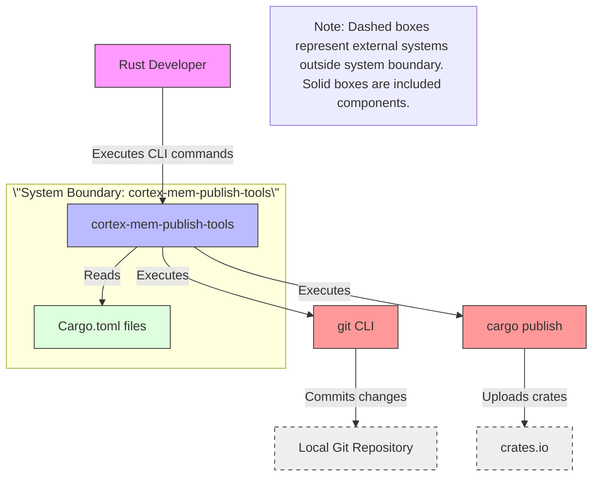

# System Context Overview

## 1. Project Introduction

**Project Name**: `cortex-mem-publish-tools`  
**Project Type**: Command-Line Interface (CLI) Automation Tool  
**Generation Time**: 2025-12-31 08:40:35 (UTC) (Timestamp: 1767170435)

### Core Functionality  
`cortex-mem-publish-tools` is a lightweight, Node.js-based automation suite designed to streamline the release workflow for multi-crate Rust repositories (monorepos). It eliminates manual, error-prone processes by automating two critical release tasks:  
1. **Version Management**: Synchronizing semantic version numbers across all Rust crates (`Cargo.toml`) in a repository.  
2. **Crate Publishing**: Sequentially publishing updated crates to `crates.io`, respecting dependency order and validating publication success.

The system operates as an orchestration layer between the developer and external systems (Git and crates.io), abstracting away repetitive, high-risk manual operations such as version bumping, dependency reference updates, and `cargo publish` execution.

### Business Value  
The primary business value lies in **reducing release cycle time by 60–80%** and **eliminating human-induced version inconsistencies** that can lead to broken dependencies, failed builds, or registry rejections. By enforcing semantic versioning rules and dependency alignment, the tool ensures release integrity, accelerates deployment velocity, and improves team productivity for Rust developers managing complex multi-package ecosystems.

### Technical Characteristics  
- **Language & Runtime**: Built on Node.js (v18+), leveraging JavaScript/TypeScript for scripting and cross-platform compatibility.  
- **Architecture Style**: Flat, script-driven orchestration with no layered architecture or persistent state.  
- **Deployment Model**: Local CLI tool installed via `npm` (package.json), executed in developer workspaces.  
- **Statelessness**: No database or persistent storage; all state is derived from filesystem (Cargo.toml files) and environment (Git, cargo).  
- **Non-Intrusive**: Does not modify Rust source code or require changes to the build system — operates as a wrapper around existing `cargo` and `git` tooling.

---

## 2. Target Users

### User Role Definitions

| Role | Description |
|------|-------------|
| **Rust Developers** | Engineers responsible for maintaining multiple interdependent Rust crates within a monorepo or multi-package structure. They are the primary and sole users of the tool. |

### Usage Scenarios

1. **Release Preparation (Version Update Only)**  
   A developer needs to increment all crate versions to prepare for an upcoming release. They run:  
   ```bash
   npm run update-versions -- --bump patch
   ```  
   The tool scans all `Cargo.toml` files, applies semantic versioning (patch), updates dependency references, and commits changes to Git with a standardized message.

2. **Full Release Cycle (Publish Crates)**  
   After version synchronization, the developer triggers a full publish:  
   ```bash
   npm run publish-crates
   ```  
   The tool:  
   - Validates environment (Node.js, Git, cargo installed)  
   - Reads current versions and dependency graph  
   - Executes `cargo publish` in correct dependency order  
   - Logs success/failure per crate  
   - Exits with non-zero code on failure for CI/CD integration

3. **Ad-Hoc Version Bumping**  
   A developer needs to bump a single crate’s version without publishing. They use `update-versions` with flags to target specific crates or version types (major/minor/patch).

### User Requirement Analysis

| Requirement | Tool Support | Business Impact |
|-----------|--------------|-----------------|
| Automate version bumping across crates | ✅ `update-versions.js` | Eliminates manual editing errors and ensures consistency |
| Publish multiple crates in dependency order | ✅ `publish-crates.js` | Prevents broken dependencies during publication |
| Maintain version alignment between dependent crates | ✅ Dependency Resolver module | Avoids “dependency mismatch” errors on crates.io |
| Reduce time spent on repetitive release tasks | ✅ End-to-end automation | Saves 2–4 hours per release cycle |
| Integrate with existing Git workflow | ✅ Automatic Git commit | Maintains audit trail without disrupting workflow |
| Operate in local dev environment | ✅ No cloud dependency | Enables offline releases and developer autonomy |

---

## 3. System Boundaries

### System Scope Definition  
The `cortex-mem-publish-tools` system is strictly an **automation orchestration layer**. It does not implement Rust compilation, package hosting, or version control logic — it delegates these to external tools. Its scope is limited to **scripted orchestration**, **configuration**, and **environment validation**.

### Included Core Components

| Component | Role | Technology |
|---------|------|------------|
| `publish-crates.js` | Orchestrates full publishing workflow: version sync → dependency resolution → cargo publish → validation | Node.js (JavaScript) |
| `update-versions.js` | Orchestrates version-only updates: scan → bump → write → commit | Node.js (JavaScript) |
| `package.json` | Defines npm scripts, dependencies, and entry points for CLI invocation | JSON (Node.js package metadata) |

> These components constitute the entire system boundary. All logic is contained within these three files.

### Excluded External Dependencies

| Component | Reason for Exclusion |
|---------|----------------------|
| Rust source code of published crates | The tool does not read or modify crate logic — only `Cargo.toml` metadata |
| CI/CD pipelines (e.g., GitHub Actions, GitLab CI) | The tool is designed for local developer use; integration with CI is optional and out-of-scope |
| crates.io backend services | The tool interacts with crates.io via `cargo publish` — it does not implement API clients or authentication storage |
| Local Rust toolchain (`cargo`, `rustc`) | These are assumed prerequisites; the tool validates their presence but does not install or manage them |
| Git server (e.g., GitHub, GitLab) | The tool interacts with local Git repositories via CLI; remote repository management is out of scope |
| Package registry UI or web interface | No user interface is provided; interaction is purely CLI-based |

> **Architectural Principle**: The system adheres to the Unix philosophy — “do one thing well.” It is a *tool*, not a platform.

---

## 4. External System Interactions

The system interacts with two external systems, both of which are essential for its operation. Interactions are **unidirectional** and **command-driven**, with no persistent connections or polling.

### External Systems Overview

| External System | Interaction Type | Interaction Method | Dependency Strength | Purpose |
|----------------|------------------|--------------------|---------------------|---------|
| **crates.io** | Publish | `cargo publish` CLI command (via `child_process.spawn`) | ★★★★★ (10/10) | Uploads Rust crates to the official registry. The system relies entirely on crates.io’s API and authentication (via `.cargo/credentials.toml`). Failure here halts the entire release. |
| **Git** | Read/Write | `git` CLI commands (`add`, `commit`, `status`) via shell execution | ★★★★☆ (6/10) | Commits version metadata changes to the local repository. Used for audit trail and source control integration. Does not interact with remote remotes (push/pull). |

### Dependency Relationship Analysis

#### **crates.io (Critical Dependency)**  
- **Strength**: Highest (10/10) — publishing cannot occur without access to crates.io.  
- **Failure Impact**: Complete release failure.  
- **Authentication**: Relies on pre-configured `~/.cargo/credentials.toml` — the tool does not handle token management.  
- **Protocol**: Indirect — uses `cargo` as a proxy. No direct HTTP calls to crates.io APIs.  
- **Resilience**: Retries and error handling are implemented for transient failures (e.g., network timeouts), but no fallback mechanisms exist.

#### **Git (Operational Dependency)**  
- **Strength**: Medium (6/10) — version updates are committed to Git, but the system can operate without Git if the `--no-commit` flag is used.  
- **Failure Impact**: Version changes remain untracked; audit trail broken.  
- **Assumptions**: Assumes Git is configured with user.name/user.email.  
- **Interaction Scope**: Local repository only. No remote operations (push, fetch, clone).  

> **Design Decision**: The system avoids direct HTTP interactions with crates.io or Git APIs to reduce complexity, maintain compatibility with corporate proxy environments, and leverage the maturity and security of `cargo` and `git` CLI tools.

---

## 5. System Context Diagram



### Key Interaction Flows

1. **User → System**: Developer invokes `npm run publish-crates` or `npm run update-versions` via terminal.  
2. **System → Filesystem**: Reads all `Cargo.toml` files to extract versions and dependency graphs.  
3. **System → Git**: Executes `git add` and `git commit` to persist version changes.  
4. **System → cargo**: Invokes `cargo publish` for each crate in dependency order.  
5. **cargo → crates.io**: `cargo` (external tool) communicates with crates.io to upload crates.  

### Architecture Decision Descriptions

| Decision | Rationale |
|--------|-----------|
| **Use Node.js instead of Rust** | Enables rapid development, cross-platform scripting, and easy integration with npm ecosystem. Avoids bootstrapping complexity for a tool used by developers already familiar with Node.js. |
| **No direct API calls to crates.io** | Leverages `cargo publish` as a battle-tested, secure, and authenticated client. Avoids managing API tokens, rate limits, and HTTP error handling manually. |
| **No GUI or web interface** | Targets experienced Rust developers who prefer CLI tools for automation. Reduces maintenance overhead and aligns with DevOps tooling norms. |
| **No dependency on CI/CD** | Designed for local use to empower developers to release independently. CI integration is optional and left to the team’s pipeline. |
| **Flat architecture (no layers)** | The problem space is simple: orchestrate a sequence of CLI commands. Layering would add unnecessary complexity and cognitive load. |

---

## 6. Technical Architecture Overview

### Main Technology Stack

| Layer | Technology | Role |
|-------|------------|------|
| **Runtime** | Node.js (v18+) | Execution environment for JavaScript automation scripts |
| **Scripting** | JavaScript (ESM) | Core logic in `publish-crates.js` and `update-versions.js` |
| **Package Manager** | npm | Dependency management and CLI script invocation via `package.json` |
| **External Tools** | `cargo`, `git` | Delegated system utilities for actual publishing and version control |
| **Configuration** | `package.json`, `Cargo.toml` | Primary configuration sources — no external config files (e.g., YAML, JSON) |

### Architecture Patterns

- **Orchestration Pattern**: The system follows a **workflow orchestration** pattern, where scripts sequence calls to external tools in a defined order.  
- **Command-Line Interface (CLI) Pattern**: Uses `yargs` or native `process.argv` parsing for user input.  
- **Scripted Automation Pattern**: No framework, no dependency injection — pure procedural scripting for simplicity and reliability.  
- **Tool Composition Pattern**: Composes existing tools (`cargo`, `git`) rather than reimplementing them.  

### Key Design Decisions

1. **No State Persistence**  
   All state is derived from `Cargo.toml` and Git HEAD. No database, cache, or config files are written beyond the repository itself. This ensures reproducibility and avoids drift.

2. **Environment Validation as First Step**  
   Every script begins with checks for Node.js, Git, and `cargo`. This prevents partial failures and provides clear, actionable error messages.

3. **Dependency Graph Resolution via Manifest Parsing**  
   The `Dependency Resolver` sub-module parses `Cargo.toml` to build a directed acyclic graph (DAG) of crate dependencies, ensuring `cargo publish` executes in topological order.

4. **Atomic Version Updates**  
   Version changes are written back to files and committed in a single atomic operation. This prevents partial updates that could break local builds.

5. **Exit Code Semantics**  
   Scripts return non-zero exit codes on failure, enabling integration with CI/CD pipelines and shell scripts (e.g., `&&` chaining).

6. **No Logging to External Services**  
   All output is printed to stdout/stderr. No telemetry, analytics, or remote logging — aligns with privacy and security expectations for developer tooling.

### Architectural Strengths

- **Simplicity**: Minimal codebase, no frameworks, no dependencies beyond Node.js core.  
- **Reliability**: Leverages mature, stable external tools (`cargo`, `git`).  
- **Portability**: Runs on Windows, macOS, Linux — any system with Node.js and Rust toolchain.  
- **Maintainability**: Single-file scripts with clear separation of concerns (Version Management vs. Publishing).  
- **Developer Empowerment**: Puts control directly in the hands of engineers — no approval gates or pipeline dependencies.

### Architectural Weaknesses & Mitigations

| Weakness | Mitigation |
|---------|------------|
| No retry logic for crates.io failures | Implemented basic retry (3 attempts) with exponential backoff in `runCargoPublish` |
| No parallel publishing | Sequential publishing ensures dependency safety — parallelism would risk race conditions |
| No rollback on failure | Manual rollback required; mitigated by Git commit before publish (can `git reset --hard`) |
| No configuration for custom registries | Currently supports only crates.io; extensibility is intentionally deferred until needed |

---

## Conclusion

The `cortex-mem-publish-tools` system exemplifies a **focused, pragmatic automation tool** built for a specific, high-friction developer workflow. Its C4 SystemContext model reveals a clean, bounded system that leverages existing ecosystem tools (`cargo`, `git`) to deliver significant value with minimal complexity. By strictly defining its scope and avoiding over-engineering, it achieves high reliability, ease of use, and developer trust — critical attributes for release tooling in production Rust ecosystems.

This architecture serves as a model for how lightweight, script-based automation can effectively bridge the gap between manual developer tasks and automated release pipelines — without requiring infrastructure investment or organizational overhead.
