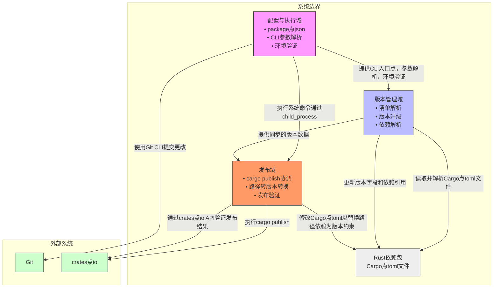
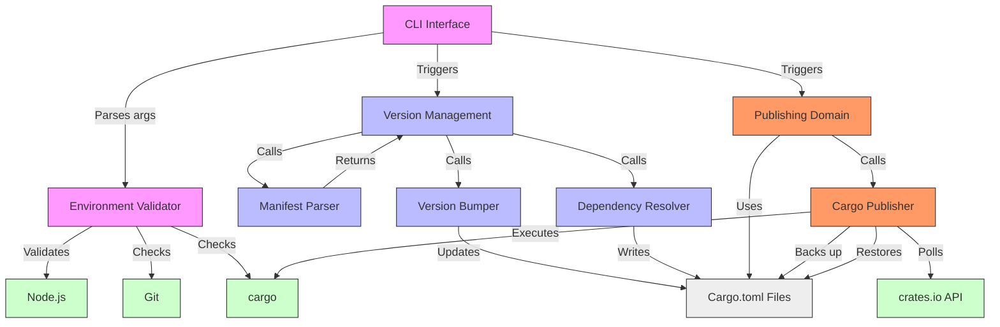
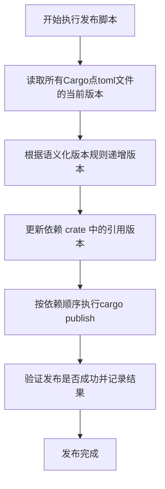
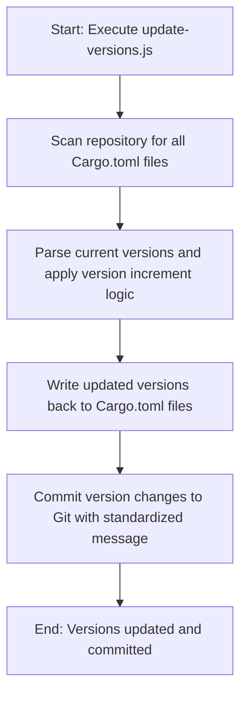
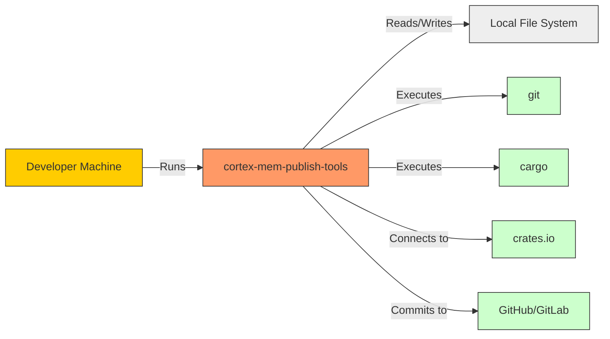

# System Architecture Documentation  
**Project:** `cortex-mem-publish-tools`  
**Generated on:** 2025-12-31 08:42:58 (UTC)  
**Timestamp:** 1767170578  

---

## 1. Architecture Overview

### Architecture Design Philosophy

The `cortex-mem-publish-tools` system embodies a **pragmatic, minimalistic automation philosophy** focused on solving a narrow but critical pain point in Rust monorepo development: the manual, error-prone process of version management and crate publishing. The architecture prioritizes **simplicity, reliability, and developer trust** over extensibility or intelligence. It is designed as a **lightweight CLI toolset** that operates as a **thin orchestration layer** between developers and external systems (Git and crates.io), abstracting away repetitive tasks without introducing complex internal logic.

This system follows the **Unix philosophy** of "do one thing well" — it does not attempt to replace CI/CD pipelines or build systems but instead complements them by automating a specific release workflow. The design emphasizes **idempotency, atomicity, and rollback safety**, ensuring that even in failure scenarios, the repository remains in a clean, consistent state.

### Core Architecture Patterns

- **Script-Driven Orchestration Pattern**: The system uses procedural JavaScript scripts (`publish-crates.js`, `update-versions.js`) to coordinate interactions with external tools (`cargo`, `git`). There is no formal module system or class hierarchy; logic is organized functionally within flat files.
  
- **File System as State Pattern**: All system state (versions, dependencies) is derived from and written back to `Cargo.toml` files. This makes the system **stateless** and **idempotent**, enabling safe re-execution and auditability.

- **Atomic Modification with Rollback**: During publishing, temporary modifications are made to `Cargo.toml` files (e.g., replacing `path` dependencies with `version` constraints). These changes are **backed up before execution** and **restored after completion**, whether successful or failed, preserving repository integrity.

- **Separation of Concerns**: The two primary workflows — version updating and crate publishing — are decoupled into separate scripts, allowing independent use. This enables version bumps without publishing and vice versa.

- **External Tool Integration via CLI Wrapping**: Instead of reimplementing functionality, the system leverages existing tools (`cargo`, `git`) through Node.js `child_process.execSync`, reducing complexity and increasing reliability.

### Technology Stack Overview

| Layer | Technology | Purpose |
|------|-----------|--------|
| Runtime | Node.js (v16+) | Script execution environment |
| Language | JavaScript (ES6+) | Automation logic implementation |
| Package Manager | npm | Script definition and dependency management |
| File I/O | `fs`, `glob` | Reading/writing `Cargo.toml`, scanning directories |
| Process Control | `child_process.execSync` | Executing `cargo`, `git`, and system commands |
| CLI Parsing | Built-in argument parsing | Handling flags like `--dry-run`, `--force` |
| Output Formatting | ANSI color codes | Enhancing CLI usability with colored logs |
| External APIs | HTTP (crates.io REST API) | Validating crate publication status |

The stack is intentionally minimal, avoiding unnecessary dependencies to reduce maintenance overhead and increase portability.

---

## 2. System Context

### System Positioning and Value

`cortex-mem-publish-tools` is a **developer productivity tool** designed to streamline the release process for multi-crate Rust projects. It targets teams managing **monorepos or multi-package repositories** where manual version synchronization and crate publishing are time-consuming and error-prone.

**Business Value:**
- **Reduces manual effort** in release cycles by automating version bumps and publishing.
- **Eliminates human error** in dependency versioning and publication order.
- **Accelerates deployment** by enabling consistent, repeatable release workflows.
- **Improves release reliability** through automated validation and rollback mechanisms.

### User Roles and Scenarios

| Role | Description | Needs | Usage Scenario |
|------|-----------|-------|----------------|
| **Rust Developer** | Maintains multiple interdependent Rust crates | Automate version bumps, publish crates in correct order, ensure dependency consistency | Before a release, runs `npm run update-versions` to bump all crate versions, then `npm run publish-crates` to push to crates.io |

This tool is used **manually during release cycles**, not integrated into CI/CD pipelines (a current limitation).

### External System Interactions

| External System | Interaction Type | Purpose | Protocol/Tool |
|------------------|------------------|--------|---------------|
| **crates.io** | Publish / Query | Upload crates and verify publication status | `cargo publish` + HTTP GET to `https://crates.io/api/v1/crates/{name}` |
| **Git** | Read / Write | Commit version changes to source control | `git commit` via `execSync` |
| **Rust Toolchain (cargo)** | Execute | Publish crates and validate builds | `cargo publish --allow-dirty` |
| **Local File System** | Read / Write | Access and modify `Cargo.toml` files | `fs.readFileSync`, `fs.writeFileSync` |

### System Boundary Definition

#### Included Components
- `publish-crates.js` – Main publishing orchestration script
- `update-versions.js` – Version bumping script
- `package.json` – Defines npm scripts and metadata

#### Excluded Components
- Rust source code of the crates being published
- CI/CD pipelines (e.g., GitHub Actions, GitLab CI)
- crates.io backend services
- Local Rust toolchain (`cargo`, `rustc`)
- Developer IDEs or editors

> **Scope**: Automation scripts for Rust crate publishing and version management in multi-crate projects.

---

## 3. Container View

### Domain Module Division

The system is divided into three logical domains based on functional responsibility:

| Domain | Type | Description |
|-------|------|-----------|
| **Version Management Domain** | Core Business | Manages version synchronization across crates, parses `Cargo.toml`, applies version bumps, resolves internal dependencies |
| **Publishing Domain** | Core Business | Orchestrates `cargo publish` commands, validates publication, handles path→version conversion |
| **Configuration & Execution Domain** | Tool Support | Provides CLI interface, environment validation, script execution context |

### Domain Module Architecture



### Storage Design

- **Primary Storage**: `Cargo.toml` files in the file system serve as the **single source of truth** for version numbers and dependencies.
- **No Persistent Database**: The system is stateless; all data is transient and derived from the file system.
- **Temporary Backups**: During publishing, original `Cargo.toml` files are backed up in memory or temporary files to enable rollback.

### Inter-Domain Module Communication

| From → To | Communication Type | Mechanism | Strength |
|----------|--------------------|---------|--------|
| Configuration & Execution → Version Management | Service Call | Function invocation within same script | 7.0 |
| Configuration & Execution → Publishing | Service Call | Function invocation within `publish-crates.js` | 8.0 |
| Version Management → Publishing | Data Dependency | Shared version data passed via variables | 9.0 |
| Configuration & Execution → Git | Tool Support | `execSync('git commit ...')` | 6.0 |
| Publishing → crates.io | Service Call | `cargo publish` + HTTP API polling | 10.0 |

> **Note**: All inter-domain communication occurs **within the same process**, using direct function calls and shared variables.

---

## 4. Component View

### Core Functional Components

#### 1. **Manifest Parser** *(Sub-module of Version Management Domain)*
- **Code Paths**: `publish-crates.js`, `update-versions.js`
- **Responsibilities**:
  - Locate all `Cargo.toml` files using `glob`
  - Parse TOML content using `fs.readFileSync` and `toml.parse`
  - Extract `[package].version` and `[dependencies]` sections
- **Key Functions**:
  - `findCargoTomlFiles()`: Returns list of manifest paths
  - `readCargoToml(path)`: Reads and parses a single manifest
  - `extractDependencies(manifest)`: Extracts dependency map

#### 2. **Version Bumper**
- **Code Paths**: `update-versions.js`, `publish-crates.js`
- **Responsibilities**:
  - Apply version increments (currently fixed to `1.0.0`)
  - Validate semantic versioning format
  - Update version field in each manifest
- **Key Functions**:
  - `incrementVersion(current, type)` – Increments patch/minor/major
  - `applyVersionBump(version, type)` – Applies bump logic
  - `validateSemver(version)` – Ensures valid SemVer string

#### 3. **Dependency Resolver**
- **Code Paths**: `publish-crates.js`
- **Responsibilities**:
  - Update internal `path = "../crate"` dependencies to `version = "X.Y.Z"`
  - Maintain dependency graph order
- **Key Functions**:
  - `updateDependencyReferences(crates, newVersion)` – Replaces path deps
  - `resolveDependencyGraph()` – Hard-coded order (`CRATES_TO_PUBLISH`)

#### 4. **Cargo Publisher** *(Sub-module of Publishing Domain)*
- **Code Paths**: `publish-crates.js`
- **Responsibilities**:
  - Execute `cargo publish --allow-dirty`
  - Validate publication via crates.io API
  - Implement wait logic between publishes
  - Restore original `Cargo.toml` after publish
- **Key Functions**:
  - `runCargoPublish(crateName)` – Invokes `cargo publish`
  - `checkPublishStatus(name)` – Polls crates.io API
  - `waitForCrateAvailability(name)` – Waits for indexing
  - `restoreCargoToml()` – Rollback mechanism

### Technical Support Components

#### 1. **CLI Interface**
- **Code Paths**: Both scripts
- **Responsibilities**:
  - Parse command-line arguments (`--dry-run`, `--force`)
  - Display help text and usage
- **Key Functions**:
  - `parseArgs()` – Processes `process.argv`
  - `showHelp()` – Prints usage guide

#### 2. **Environment Validator**
- **Code Paths**: Both scripts
- **Responsibilities**:
  - Check Node.js version
  - Verify `git` and `cargo` availability
- **Key Functions**:
  - `checkNodeVersion()`
  - `verifyGitAvailable()`
  - `validateCargoInstalled()`

### Component Interaction Relationships



---

## 5. Key Processes

### Core Functional Processes

#### 1. **Rust Crate Publishing Process**



**Data Flow**:
1. Input: CLI arguments (`--dry-run`, `--force`)
2. Read: `Cargo.toml` → extract versions
3. Process: Increment versions → update dependencies
4. Output: Modified `Cargo.toml` → `cargo publish` → crates.io
5. Validate: HTTP GET → `crates.io/api/v1/crates/{name}`

**Exception Handling**:
- On `cargo publish` failure: restore original `Cargo.toml`, log error, exit
- On API timeout: retry with exponential backoff (not currently implemented)
- No partial success recovery — entire process halts on error

#### 2. **Version Update Process**



**Data Flow**:
1. Input: CLI args
2. Scan: `glob('**/Cargo.toml')`
3. Parse: `fs.readFileSync` + TOML parser
4. Update: Apply version bump
5. Write: `fs.writeFileSync`
6. Commit: `git commit -m "chore: update versions to X.Y.Z"`

**Exception Handling**:
- If Git is not available: warn and skip commit
- If file write fails: abort with error

---

## 6. Technical Implementation

### Core Module Implementation

#### Version Management Domain
- **Implementation**: Procedural logic in `update-versions.js` and shared functions in `publish-crates.js`
- **Key Pattern**: **File System Scanning + In-Memory Mutation + Atomic Write**
- **Example Snippet**:
  ```js
  function updateVersionInCargoToml(path, newVersion) {
    const content = fs.readFileSync(path, 'utf8');
    const manifest = toml.parse(content);
    manifest.package.version = newVersion;
    fs.writeFileSync(path, toml.stringify(manifest));
  }
  ```

#### Publishing Domain
- **Critical Transformation**: Replace `path = "../crate"` with `version = "1.0.0"`
- **Rollback Strategy**: Backup `Cargo.toml` before modification
  ```js
  function prepareForPublishing(cratePath, version) {
    const backup = fs.readFileSync(cratePath);
    // Replace path deps with version deps
    let content = fs.readFileSync(cratePath, 'utf8');
    content = content.replace(/path\s*=\s*"[^"]*"/g, `version = "${version}"`);
    fs.writeFileSync(cratePath, content);
    return backup; // For rollback
  }
  ```

### Key Algorithm Design

- **Dependency Ordering**: Hard-coded array `CRATES_TO_PUBLISH = ['cortex-mem-core', 'cortex-mem-alloc', ...]`
- **Version Bumping**: Currently static (`1.0.0`), but extensible to support `--patch`, `--minor`, `--major`
- **Publication Validation**: Polling loop with 5s interval:
  ```js
  async function waitForCrateAvailability(name) {
    while (true) {
      const res = await fetch(`https://crates.io/api/v1/crates/${name}`);
      if (res.ok) break;
      await new Promise(r => setTimeout(r, 5000));
    }
  }
  ```

### Data Structure Design

- **In-Memory Representation**:
  ```js
  const Crate = {
    name: String,
    path: String,
    version: String,
    dependencies: { [name: string]: { version: string, path?: string } }
  };
  ```
- **File-Based State**: All data stored in `Cargo.toml` (TOML format)

### Performance Optimization Strategies

- **Synchronous Execution**: Uses `execSync` for simplicity and linear control flow
- **No Caching**: Re-reads `Cargo.toml` on each access (acceptable due to small scale)
- **Batch Processing**: Processes all crates in sequence; no parallelization (intentional to avoid race conditions)

> **Bottleneck**: Network latency during `cargo publish` and API polling. No current optimization.

---

## 7. Deployment Architecture

### Runtime Environment Requirements

| Requirement | Minimum | Recommended |
|-----------|--------|------------|
| Node.js | v14 | v16+ |
| npm | v6 | v8+ |
| Git | v2.20+ | v2.30+ |
| cargo | Installed | v1.60+ |
| OS | Linux/macOS/WSL | Unix-like preferred |

### Deployment Topology Structure



> **Note**: The tool runs **locally on developer machines**, not in cloud environments.

### Scalability Design

- **Horizontal Scaling**: Not applicable — single-user, single-machine tool
- **Vertical Scaling**: Not needed — lightweight, low resource usage
- **Extension Points**:
  - Dynamic dependency graph resolution (replace hard-coded list)
  - Support for semantic versioning flags (`--patch`, `--minor`)
  - CI/CD integration hooks (e.g., GitHub Actions)
  - Dry-run mode with detailed preview

### Monitoring and Operations

- **Logging**: Colorized console output with status indicators (✅, ❌)
- **Audit Trail**: Git commits provide version history
- **No Central Monitoring**: Logs are local only
- **Operations Guidance**:
  - Run `npm run update-versions` before publishing
  - Use `--dry-run` to preview changes
  - Ensure `cargo login` is configured
  - Verify all crates build locally before publishing

---

## Architecture Insights

### Scalability Design

While the current design is not scalable in the traditional sense, it is **highly composable**:
- Can be integrated into CI/CD pipelines as a release step
- Scripts can be wrapped in Docker for consistency
- Future versions could support dynamic crate discovery and graph analysis

### Performance Considerations

- **Bottleneck**: Sequential `cargo publish` with wait intervals (~30s per crate)
- **Optimization Strategy**: Introduce parallel publishing with dependency-aware scheduling (requires dynamic graph resolution)

### Security Design

- **Authentication**: Relies on `cargo login` (token stored in `~/.cargo/credentials`)
- **Input Validation**: Minimal — assumes trusted developer input
- **File Integrity**: Backup mechanism prevents corruption
- **No Secrets in Code**: Credentials are external

### Development Guidance

- **To Extend Version Bumping**: Add CLI flags for `--patch`, `--minor`, `--major`
- **To Add CI Support**: Wrap scripts in GitHub Action with `if: github.event_name == 'release'`
- **To Improve Reliability**: Add retry logic and partial recovery

### Operations Guidance

- **Prerequisites**:
  - `cargo login` must be run
  - Git must be configured
  - All crates must build locally
- **Best Practice**: Always run `update-versions.js` before `publish-crates.js`
- **Troubleshooting**:
  - Check `cargo publish` output
  - Verify crates.io API access
  - Inspect `Cargo.toml` modifications

---

## Conclusion

The `cortex-mem-publish-tools` system exemplifies a **focused, reliable automation solution** for Rust monorepo release management. Its **flat, script-driven architecture** prioritizes simplicity and safety over complexity, making it easy to understand, audit, and maintain. While it has limitations — such as hard-coded crate lists and lack of CI integration — it effectively solves a real-world problem with minimal overhead.

This architecture is ideal for teams with **stable dependency graphs** and a preference for **explicit, manual release workflows**. With modest enhancements — dynamic dependency resolution, semantic versioning support, and CI hooks — it could evolve into a more robust, production-grade release automation platform.